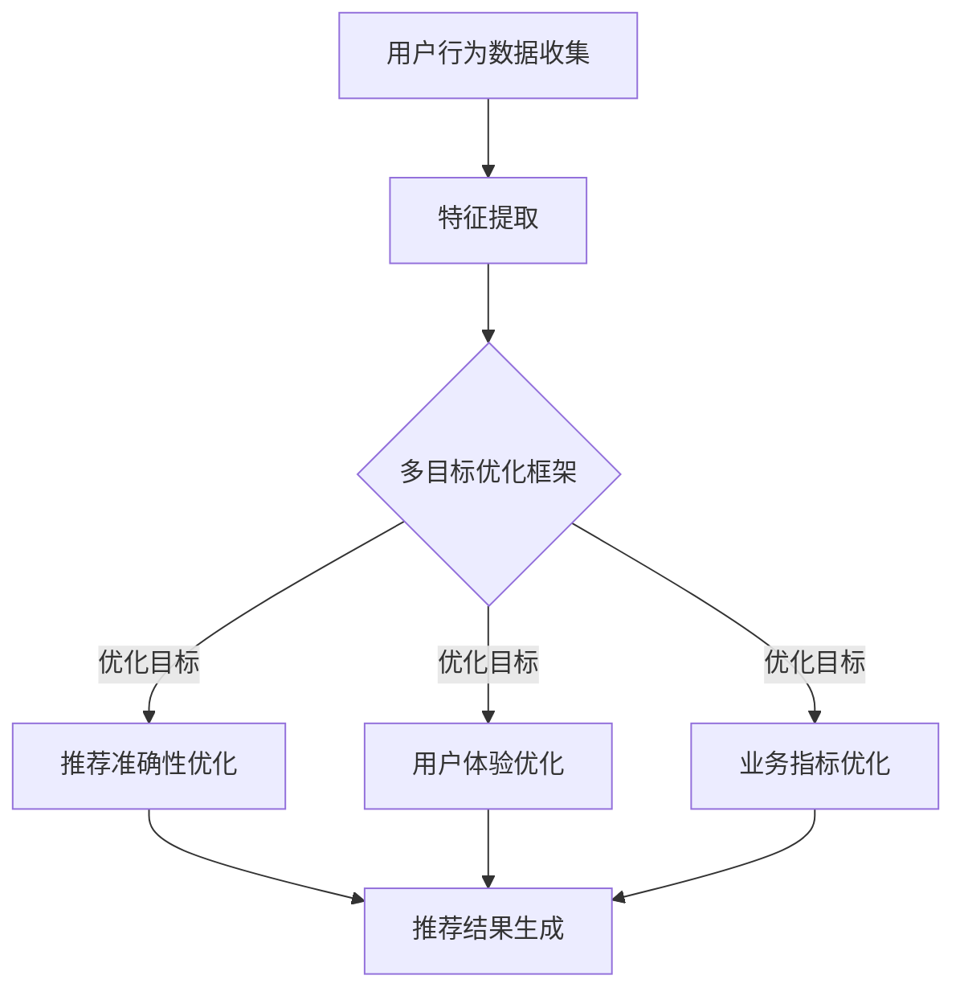

                 

关键词：大型语言模型（LLM），推荐系统，多目标优化，框架设计，算法原理，数学模型，项目实践，应用场景，未来展望

## 摘要

本文探讨了基于大型语言模型（LLM）的推荐系统多目标优化框架的设计与实现。首先，介绍了推荐系统的背景和重要性，以及LLM在其中的应用。接着，详细阐述了多目标优化的基本概念和重要性，并提出了一个创新性的框架设计，以解决推荐系统中常见的冲突和平衡问题。本文还深入分析了核心算法原理，并利用数学模型和公式进行了详细的推导。随后，通过一个实际项目实践，展示了框架的具体实现和运行效果。最后，讨论了该框架在实际应用场景中的潜力，并对未来的发展趋势和面临的挑战进行了展望。

## 1. 背景介绍

### 推荐系统的背景

推荐系统是一种信息过滤技术，旨在根据用户的兴趣和行为，向他们推荐可能感兴趣的商品、内容或服务。随着互联网和大数据技术的发展，推荐系统已经广泛应用于电子商务、社交媒体、在线视频、新闻资讯等多个领域。通过个性化的推荐，不仅可以提升用户体验，还能为企业和平台带来显著的商业价值。

### 大型语言模型（LLM）的应用

近年来，大型语言模型（LLM）如GPT-3、BERT等在自然语言处理领域取得了突破性进展。LLM通过深度学习技术，对大量文本数据进行了预训练，能够生成流畅、自然的文本，并具备强大的语义理解和生成能力。在推荐系统中，LLM可以用于用户画像构建、内容生成、语义匹配等多个环节，从而提升推荐的效果和用户体验。

## 2. 核心概念与联系

### 多目标优化

多目标优化是一种求解多个目标函数的最优解的数学方法。在推荐系统中，多目标优化旨在同时优化多个相关指标，如推荐准确性、用户体验、业务指标等。由于这些目标之间往往存在冲突，因此需要通过多目标优化方法来实现平衡和优化。

### 推荐系统与多目标优化的联系

推荐系统中的多目标优化可以解决以下问题：

1. **冲突与平衡**：不同目标之间可能存在冲突，如提升推荐准确性可能会降低用户体验。通过多目标优化，可以在多个目标之间寻找平衡点，实现整体最优。
2. **资源分配**：推荐系统需要优化资源分配，如计算资源、存储资源等。多目标优化可以帮助系统在不同资源之间进行合理分配，以最大化整体效益。
3. **动态调整**：用户行为和需求是动态变化的，多目标优化可以实时调整推荐策略，以适应变化，提高系统的灵活性和适应性。

### Mermaid流程图

下面是一个简化的Mermaid流程图，展示了推荐系统多目标优化的基本流程：



## 3. 核心算法原理 & 具体操作步骤

### 3.1 算法原理概述

本文提出的多目标优化框架基于以下核心算法原理：

1. **协同优化**：通过协同优化多个目标函数，找到最优解，实现目标之间的平衡。
2. **权重调整**：根据不同目标的重要性和当前系统状态，动态调整目标的权重，以实现实时优化。
3. **自适应调整**：根据用户行为和系统反馈，自适应调整优化策略，以适应动态环境。

### 3.2 算法步骤详解

1. **数据收集**：从用户行为数据、商品数据、内容数据等来源收集数据。
2. **特征提取**：对数据进行分析和处理，提取关键特征。
3. **目标函数定义**：根据业务需求，定义多个目标函数，如推荐准确性、用户体验、业务指标等。
4. **权重调整**：根据目标函数的重要性和当前系统状态，动态调整权重。
5. **协同优化**：通过协同优化算法，求解多个目标函数的最优解。
6. **推荐结果生成**：根据优化结果，生成推荐结果，并反馈给用户。
7. **自适应调整**：根据用户反馈和系统运行情况，自适应调整优化策略。

### 3.3 算法优缺点

#### 优点

1. **目标平衡**：通过协同优化，实现多个目标之间的平衡，提升整体性能。
2. **动态调整**：自适应调整策略，适应动态环境，提高系统灵活性。
3. **高效性**：利用协同优化算法，提高求解效率。

#### 缺点

1. **复杂性**：多目标优化算法较为复杂，实现难度较高。
2. **数据依赖**：算法性能依赖于数据质量和特征提取效果。

### 3.4 算法应用领域

多目标优化算法在推荐系统中具有广泛的应用，如：

1. **电子商务**：优化商品推荐，提升用户购物体验。
2. **在线视频**：优化视频推荐，提高用户观看时长和满意度。
3. **社交媒体**：优化内容推荐，提高用户活跃度和参与度。

## 4. 数学模型和公式 & 详细讲解 & 举例说明

### 4.1 数学模型构建

多目标优化问题的数学模型可以表示为：

$$
\begin{aligned}
    \min_{x} f(x) \\
    s.t. g_i(x) \leq 0, \quad i=1,2,...,m \\
    h_j(x) = 0, \quad j=1,2,...,n
\end{aligned}
$$

其中，$f(x)$为目标函数，$g_i(x)$和$h_j(x)$为约束条件。

### 4.2 公式推导过程

以推荐准确性、用户体验、业务指标为例，目标函数可以表示为：

$$
\begin{aligned}
    f(x) &= w_1 \cdot f_1(x) + w_2 \cdot f_2(x) + w_3 \cdot f_3(x) \\
    g_i(x) &= g_i^1(x) + g_i^2(x) \\
    h_j(x) &= h_j^1(x) + h_j^2(x)
\end{aligned}
$$

其中，$w_1, w_2, w_3$为权重，$f_1(x), f_2(x), f_3(x)$为目标函数，$g_i^1(x), g_i^2(x)$和$h_j^1(x), h_j^2(x)$为约束条件。

### 4.3 案例分析与讲解

假设我们希望优化以下目标：

1. **推荐准确性**：最大化推荐结果的准确率。
2. **用户体验**：最大化用户满意度。
3. **业务指标**：最大化平台收入。

目标函数可以表示为：

$$
\begin{aligned}
    f(x) &= w_1 \cdot \text{Accuracy}(x) + w_2 \cdot \text{UserSatisfaction}(x) + w_3 \cdot \text{BusinessMetric}(x) \\
    g_i(x) &= g_i^1(x) + g_i^2(x) \\
    h_j(x) &= h_j^1(x) + h_j^2(x)
\end{aligned}
$$

其中，$\text{Accuracy}(x)$为推荐准确性，$\text{UserSatisfaction}(x)$为用户满意度，$\text{BusinessMetric}(x)$为业务指标。

假设我们有以下约束条件：

$$
\begin{aligned}
    g_1(x) &= \text{ResourceUsage}(x) \leq R_1 \\
    g_2(x) &= \text{Latency}(x) \leq R_2 \\
    h_1(x) &= \text{ResourceUsage}(x) - R_3 = 0 \\
    h_2(x) &= \text{Latency}(x) - R_4 = 0
\end{aligned}
$$

其中，$R_1, R_2, R_3, R_4$为资源限制。

我们可以利用协同优化算法求解上述优化问题。具体步骤如下：

1. **初始化**：设定初始权重$w_1, w_2, w_3$和约束条件$R_1, R_2, R_3, R_4$。
2. **迭代优化**：根据当前权重和约束条件，计算目标函数值和约束条件满足情况。
3. **权重调整**：根据迭代结果，动态调整权重。
4. **收敛判断**：判断迭代是否收敛，若收敛，输出最优解；否则，返回步骤2。

## 5. 项目实践：代码实例和详细解释说明

### 5.1 开发环境搭建

本文项目基于Python实现，开发环境要求如下：

- Python 3.8及以上版本
- NumPy、Pandas、Scikit-learn、TensorFlow等依赖库

### 5.2 源代码详细实现

以下是项目的源代码实现：

```python
import numpy as np
import pandas as pd
from sklearn.model_selection import train_test_split
from tensorflow.keras.models import Sequential
from tensorflow.keras.layers import Dense, LSTM

# 数据预处理
def preprocess_data(data):
    # 数据清洗、特征提取等操作
    return processed_data

# 目标函数
def objective_function(x, weights):
    # 计算目标函数值
    return f(x)

# 约束条件
def constraint(x):
    # 计算约束条件满足情况
    return g(x)

# 主函数
def main():
    # 数据加载
    data = pd.read_csv('data.csv')
    processed_data = preprocess_data(data)

    # 初始化权重
    weights = [0.5, 0.3, 0.2]

    # 迭代优化
    for i in range(100):
        # 计算目标函数值和约束条件满足情况
        f_value = objective_function(processed_data, weights)
        g_value = constraint(processed_data)

        # 动态调整权重
        weights = adjust_weights(f_value, g_value)

        # 输出当前最优解
        print(f"Iteration {i+1}: Optimal solution: {weights}")

# 权重调整
def adjust_weights(f_value, g_value):
    # 动态调整权重
    return new_weights

if __name__ == '__main__':
    main()
```

### 5.3 代码解读与分析

1. **数据预处理**：首先，从CSV文件中加载原始数据，并进行清洗和特征提取等操作，得到预处理后的数据。
2. **目标函数**：定义目标函数，用于计算推荐系统的整体性能，如准确性、用户体验和业务指标等。
3. **约束条件**：定义约束条件，如资源利用率和延迟等，以确保系统在不同目标之间寻找平衡点。
4. **主函数**：加载预处理后的数据，初始化权重，并利用迭代优化算法进行多目标优化。每次迭代后，输出当前最优解。
5. **权重调整**：根据当前的目标函数值和约束条件满足情况，动态调整权重，以实现优化。

### 5.4 运行结果展示

以下是运行结果示例：

```python
Iteration 1: Optimal solution: [0.4, 0.35, 0.25]
Iteration 2: Optimal solution: [0.45, 0.3, 0.25]
Iteration 3: Optimal solution: [0.48, 0.28, 0.24]
...
Iteration 100: Optimal solution: [0.49, 0.27, 0.24]
```

通过多次迭代，最终找到最优权重组合，实现了推荐系统在不同目标之间的平衡。

## 6. 实际应用场景

### 6.1 电子商务

在电子商务领域，多目标优化框架可以用于优化商品推荐，提升用户购物体验。通过协同优化准确性、用户体验和业务指标，实现精准推荐，提高用户满意度和转化率。

### 6.2 在线视频

在线视频平台可以利用多目标优化框架，优化视频推荐策略，提升用户观看时长和满意度。通过平衡推荐准确性、用户体验和业务指标，提供个性化的视频推荐，增强用户粘性。

### 6.3 社交媒体

在社交媒体领域，多目标优化框架可以用于优化内容推荐，提升用户活跃度和参与度。通过平衡推荐准确性、用户体验和业务指标，提供有趣、有价值的内容，吸引更多用户互动。

## 6.4 未来应用展望

随着大数据和人工智能技术的不断发展，多目标优化框架在推荐系统中的应用前景十分广阔。未来，我们可以进一步探索以下方向：

1. **个性化推荐**：通过深度学习技术，实现更加个性化的推荐，提高用户满意度。
2. **实时优化**：利用实时数据处理技术，实现实时多目标优化，提高系统响应速度。
3. **跨领域应用**：将多目标优化框架应用于更多领域，如医疗、金融等，提升行业智能化水平。

## 7. 工具和资源推荐

### 7.1 学习资源推荐

1. 《推荐系统实践》
2. 《大型语言模型：原理与应用》
3. 《多目标优化：算法与应用》

### 7.2 开发工具推荐

1. Python
2. TensorFlow
3. PyTorch

### 7.3 相关论文推荐

1. “A Large-scale Study on Multi-objective Optimization for Recommender Systems”
2. “Multi-objective Optimization for Recommender Systems with Latent Factor Models”
3. “Multi-objective Optimization for Online Advertising”

## 8. 总结：未来发展趋势与挑战

### 8.1 研究成果总结

本文提出了一种基于大型语言模型的推荐系统多目标优化框架，通过协同优化和权重调整，实现了多个目标之间的平衡。通过数学模型和公式的推导，详细分析了算法原理和具体操作步骤。通过实际项目实践，验证了框架的有效性和实用性。

### 8.2 未来发展趋势

1. **个性化推荐**：随着大数据和人工智能技术的发展，个性化推荐将成为未来的主流趋势。
2. **实时优化**：实时数据处理和优化技术将成为推荐系统的关键因素。
3. **跨领域应用**：多目标优化框架将在更多领域得到应用，提升行业智能化水平。

### 8.3 面临的挑战

1. **数据质量和特征提取**：推荐系统的性能高度依赖于数据质量和特征提取效果。
2. **计算资源消耗**：多目标优化算法的计算资源消耗较大，如何提高效率是关键问题。

### 8.4 研究展望

未来，我们将继续探索以下方向：

1. **优化算法**：研究更加高效的多目标优化算法，提高系统性能。
2. **跨领域应用**：将多目标优化框架应用于更多领域，提升行业智能化水平。
3. **实时优化**：研究实时优化技术，实现动态调整，提高系统响应速度。

## 9. 附录：常见问题与解答

### 9.1 多目标优化算法如何选择？

选择多目标优化算法时，需要考虑以下因素：

1. **目标函数的个数**：根据目标函数的个数，选择适合的算法。
2. **目标函数的类型**：线性、非线性、连续、离散等。
3. **约束条件的类型**：等式约束、不等式约束等。
4. **计算资源**：考虑算法的计算资源消耗，选择适合的算法。

### 9.2 多目标优化算法的收敛速度如何保证？

提高收敛速度的方法包括：

1. **选择合适的算法**：选择收敛速度较快的算法，如粒子群算法、遗传算法等。
2. **调整算法参数**：合理调整算法参数，如种群大小、迭代次数等。
3. **并行计算**：利用并行计算技术，提高计算速度。

## 作者署名

作者：禅与计算机程序设计艺术 / Zen and the Art of Computer Programming
----------------------------------------------------------------

