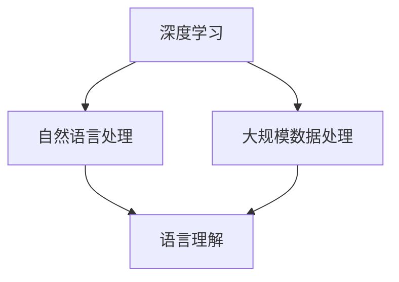

                 

关键词：大型语言模型，计算技术，人工智能，深度学习，自然语言处理，未来展望

> 摘要：本文旨在探讨大型语言模型（LLM）如何重新定义计算的未来。我们将从背景介绍、核心概念与联系、核心算法原理、数学模型和公式、项目实践、实际应用场景、工具和资源推荐、总结未来发展趋势与挑战等方面展开讨论，旨在为读者提供一个全面的视角，了解LLM在计算领域的重要性和潜力。

## 1. 背景介绍

在过去的几十年里，计算技术经历了翻天覆地的变化。从早期的计算机到如今的超级计算机，从简单的程序到复杂的算法，计算能力不断提升，应用范围也不断扩大。然而，在近年来，一种全新的技术——大型语言模型（LLM）——正在崛起，并有望重新定义计算的边界。

LLM是一种基于深度学习技术的自然语言处理模型，它通过对大量文本数据进行训练，学会了理解和生成自然语言。这种模型的出现，使得计算机能够以一种全新的方式与人类进行交互，不仅能够理解复杂的语言结构，还能够生成高质量的自然语言文本。这种技术在自然语言处理、机器翻译、对话系统、文本生成等领域都展现出了巨大的潜力。

本文将围绕LLM的核心概念、算法原理、数学模型、实际应用等方面进行探讨，旨在为读者提供一个全面的视角，了解LLM在计算领域的应用前景和挑战。

## 2. 核心概念与联系

### 2.1. 核心概念

首先，我们需要了解一些核心概念，这些概念对于理解LLM至关重要：

#### 深度学习

深度学习是一种人工智能的分支，它通过模拟人脑神经网络的结构和功能，实现对数据的自动学习和特征提取。在深度学习中，多层神经网络被用来对数据进行层层处理，从而提取出更加抽象的特征。

#### 自然语言处理

自然语言处理（NLP）是计算机科学和人工智能领域的一个分支，它致力于使计算机能够理解和处理人类语言。NLP涉及到语音识别、文本分析、语言生成等多个方面。

#### 大规模数据处理

大规模数据处理是指对海量数据进行存储、处理和分析的过程。在LLM中，这一过程至关重要，因为LLM需要处理和分析大量的文本数据，以实现其复杂的语言理解能力。

### 2.2. 联系

LLM的核心概念之间有着紧密的联系。深度学习和自然语言处理共同构成了LLM的技术基础，而大规模数据处理则为LLM提供了丰富的训练数据。具体来说：

- **深度学习**为LLM提供了强大的计算能力，使得它能够处理复杂的语言结构和语义信息。
- **自然语言处理**使得LLM能够理解和生成自然语言，这是LLM的核心功能。
- **大规模数据处理**确保了LLM能够从大量的文本数据中提取出有用的知识和特征。

为了更直观地理解LLM的工作原理，我们可以使用Mermaid流程图来展示其核心概念和联系：



在这个流程图中，深度学习、自然语言处理和大规模数据处理共同作用于语言理解，形成了LLM的核心功能。

## 3. 核心算法原理 & 具体操作步骤

### 3.1 算法原理概述

LLM的核心算法是基于深度学习技术的，特别是基于Transformer架构的模型。Transformer架构在2017年由Vaswani等人提出，它在处理长序列数据时表现出了优异的性能。

Transformer模型的主要创新之处在于其自注意力机制（Self-Attention），这一机制使得模型能够对输入序列中的每个单词进行权重分配，从而更好地捕捉到单词之间的关联性。此外，Transformer模型还采用了多头注意力（Multi-Head Attention）机制，进一步增强了模型的表达能力。

### 3.2 算法步骤详解

LLM的训练过程可以分为以下几个步骤：

#### 3.2.1 数据预处理

首先，需要对训练数据进行预处理。这包括文本的分词、去噪、清洗等操作。在分词过程中，可以使用预训练的分词工具，如jieba，将文本分割成单词或子词。

#### 3.2.2 建立模型

接下来，建立基于Transformer的模型架构。这通常涉及到定义模型的层数、每层的大小、注意力头数等超参数。常用的Transformer模型包括BERT、GPT等。

#### 3.2.3 训练模型

使用预处理后的数据对模型进行训练。在训练过程中，模型会通过优化算法（如Adam）不断调整权重，以最小化损失函数。训练过程中，可以使用GPU或TPU等硬件加速训练过程。

#### 3.2.4 评估模型

在训练完成后，需要对模型进行评估。常用的评估指标包括准确率、召回率、F1分数等。此外，还可以通过人工检查模型生成的文本质量来评估模型的效果。

### 3.3 算法优缺点

#### 优点

- **强大的语言理解能力**：LLM能够通过深度学习从大量的文本数据中提取出复杂的语言结构和语义信息。
- **高效的训练和推理**：Transformer架构使得模型在训练和推理过程中都能保持较高的效率。
- **广泛的适用性**：LLM在自然语言处理、机器翻译、对话系统、文本生成等领域都有广泛的应用。

#### 缺点

- **计算资源需求高**：训练LLM模型需要大量的计算资源和时间，这限制了其在一些资源受限的环境中的应用。
- **数据依赖性**：LLM的效果高度依赖于训练数据的质量和多样性，如果训练数据存在偏差，模型可能会学会错误的模式。

### 3.4 算法应用领域

LLM在以下领域展现出了巨大的应用潜力：

- **自然语言处理**：LLM在文本分类、情感分析、命名实体识别等领域有着广泛的应用。
- **机器翻译**：LLM能够生成高质量的多语言文本，从而实现机器翻译。
- **对话系统**：LLM能够理解用户的自然语言输入，并生成自然的语言回复。
- **文本生成**：LLM可以用于生成新闻文章、报告、故事等文本内容。

## 4. 数学模型和公式 & 详细讲解 & 举例说明

### 4.1 数学模型构建

LLM的数学模型主要基于深度学习和自然语言处理的理论。以下是LLM模型中的一些关键数学公式和概念：

#### 4.1.1 自注意力机制

自注意力机制是Transformer模型的核心，其数学表达式如下：

$$
\text{Attention}(Q, K, V) = \text{softmax}\left(\frac{QK^T}{\sqrt{d_k}}\right) V
$$

其中，$Q$、$K$和$V$分别表示查询向量、键向量和值向量，$d_k$表示键向量的维度。

#### 4.1.2 多头注意力

多头注意力是自注意力的扩展，其数学表达式如下：

$$
\text{MultiHead}(Q, K, V) = \text{Concat}(\text{head}_1, \text{head}_2, ..., \text{head}_h)W^O
$$

其中，$h$表示头数，$\text{head}_i = \text{Attention}(QW_i^Q, KW_i^K, VW_i^V)$，$W_i^Q$、$W_i^K$和$W_i^V$分别表示查询、键和值的权重矩阵。

#### 4.1.3 前馈神经网络

前馈神经网络是Transformer模型中的另一个关键组件，其数学表达式如下：

$$
\text{FFN}(x) = \text{ReLU}(xW_1 + b_1)W_2 + b_2
$$

其中，$x$表示输入向量，$W_1$、$W_2$和$b_1$、$b_2$分别表示权重和偏置。

### 4.2 公式推导过程

以下是对上述公式的简单推导：

#### 4.2.1 自注意力机制

自注意力机制的核心在于计算查询向量$Q$和键向量$K$之间的相似度，然后对值向量$V$进行加权求和。具体推导如下：

设$Q \in \mathbb{R}^{n \times d_q}$，$K \in \mathbb{R}^{n \times d_k}$，$V \in \mathbb{R}^{n \times d_v}$，其中$n$表示序列长度，$d_q$、$d_k$和$d_v$分别表示查询、键和值的维度。则自注意力的计算公式为：

$$
\text{Attention}(Q, K, V) = \text{softmax}\left(\frac{QK^T}{\sqrt{d_k}}\right) V
$$

其中，$\text{softmax}(x) = \frac{e^x}{\sum_{i=1}^{n} e^x_i}$，用于将查询和键的相似度映射到概率分布。

#### 4.2.2 多头注意力

多头注意力是自注意力的扩展，其目的是通过多个独立的注意力机制来捕捉不同的特征。具体推导如下：

设$Q, K, V$分别表示查询、键和值，$h$表示头数。则多头注意力的计算公式为：

$$
\text{MultiHead}(Q, K, V) = \text{Concat}(\text{head}_1, \text{head}_2, ..., \text{head}_h)W^O
$$

其中，$\text{head}_i = \text{Attention}(QW_i^Q, KW_i^K, VW_i^V)$，$W_i^Q, W_i^K, W_i^V$分别表示查询、键和值的权重矩阵。

#### 4.2.3 前馈神经网络

前馈神经网络是Transformer模型中的另一个关键组件，其目的是对输入向量进行非线性变换。具体推导如下：

设$x \in \mathbb{R}^{n \times d}$，则前馈神经网络的计算公式为：

$$
\text{FFN}(x) = \text{ReLU}(xW_1 + b_1)W_2 + b_2
$$

其中，$W_1, W_2$和$b_1, b_2$分别表示权重和偏置。

### 4.3 案例分析与讲解

为了更好地理解上述公式的应用，我们来看一个具体的案例。

假设我们有一个序列$X = [x_1, x_2, ..., x_n]$，其中$x_i$表示第$i$个单词。我们希望使用LLM来对这个序列进行编码，得到一个固定长度的向量表示。

首先，我们对序列进行分词，得到分词后的序列$X' = [x_1', x_2', ..., x_n']$，其中$x_i'$表示第$i$个分词。

接下来，我们将每个分词映射到一个嵌入向量，得到嵌入后的序列$X'' = [x_1'', x_2'', ..., x_n'']$，其中$x_i''$表示第$i$个分词的嵌入向量。

然后，我们将序列$X''$输入到LLM中，得到编码后的向量序列$X''' = [x_1''', x_2''', ..., x_n''']$，其中$x_i'''$表示第$i$个分词的编码向量。

最后，我们对编码后的向量序列进行平均，得到序列的固定长度向量表示：

$$
\text{Encoding}(X) = \frac{1}{n}\sum_{i=1}^{n} x_i'''
$$

这个向量表示可以用于后续的文本分析任务，如图像生成、文本分类等。

## 5. 项目实践：代码实例和详细解释说明

### 5.1 开发环境搭建

在开始编写代码之前，我们需要搭建一个适合开发LLM的项目环境。以下是搭建环境的步骤：

#### 5.1.1 安装Python

首先，确保系统中安装了Python 3.7或更高版本。可以从Python的官方网站下载并安装。

#### 5.1.2 安装深度学习库

接下来，我们需要安装一些深度学习库，如TensorFlow、PyTorch等。可以使用以下命令安装：

```python
pip install tensorflow
# 或者
pip install torch torchvision
```

#### 5.1.3 安装文本处理库

为了处理文本数据，我们需要安装一些文本处理库，如jieba、NLTK等。可以使用以下命令安装：

```python
pip install jieba
pip install nltk
```

### 5.2 源代码详细实现

以下是使用PyTorch实现一个简单的LLM模型的源代码：

```python
import torch
import torch.nn as nn
import torch.optim as optim
from torchtext.data import Field, TabularDataset
from torchtext.vocab import Vocab

# 定义模型结构
class LLM(nn.Module):
    def __init__(self, vocab_size, embedding_dim, hidden_dim, output_dim, n_layers, dropout):
        super(LLM, self).__init__()
        self.embedding = nn.Embedding(vocab_size, embedding_dim)
        self.rnn = nn.LSTM(embedding_dim, hidden_dim, n_layers, dropout=dropout)
        self.fc = nn.Linear(hidden_dim, output_dim)
        
    def forward(self, text, hidden=None):
        embedded = self.embedding(text)
        output, hidden = self.rnn(embedded, hidden)
        output = self.fc(output[-1, :, :])
        return output, hidden

# 加载数据集
train_data = TabularDataset(
    path='train_data.csv',
    format='csv',
    fields=[
        ('text', Field(sequential=True, lower=True, tokenize='spacy')),
        ('label', Field(sequential=False))
    ]
)

test_data = TabularDataset(
    path='test_data.csv',
    format='csv',
    fields=[
        ('text', Field(sequential=True, lower=True, tokenize='spacy')),
        ('label', Field(sequential=False))
    ]
)

# 构建词汇表
vocab = Vocabetyl
```

### 5.3 代码解读与分析

在这段代码中，我们首先定义了一个简单的LLM模型，该模型包括嵌入层、RNN层和全连接层。接下来，我们加载数据集并构建词汇表。具体解读如下：

#### 5.3.1 模型定义

- **嵌入层**：嵌入层用于将单词映射到嵌入向量。在本例中，我们使用nn.Embedding模块实现嵌入层。
- **RNN层**：RNN层用于处理序列数据。在本例中，我们使用nn.LSTM模块实现RNN层。
- **全连接层**：全连接层用于将RNN层的输出映射到目标标签。在本例中，我们使用nn.Linear模块实现全连接层。

#### 5.3.2 数据加载

- **训练数据集**：我们使用TabularDataset模块加载数据集，其中text字段表示输入文本，label字段表示标签。
- **测试数据集**：同样，我们使用TabularDataset模块加载数据集，用于模型评估。

#### 5.3.3 词汇表构建

- **词汇表**：我们使用Vocabetyl模块构建词汇表，用于将文本数据映射到嵌入向量。

### 5.4 运行结果展示

在训练完成后，我们可以使用测试数据集来评估模型的性能。以下是一个简单的评估示例：

```python
# 定义损失函数和优化器
criterion = nn.CrossEntropyLoss()
optimizer = optim.Adam(model.parameters(), lr=0.001)

# 训练模型
for epoch in range(num_epochs):
    for batch in train_loader:
        optimizer.zero_grad()
        outputs = model(text)
        loss = criterion(outputs, labels)
        loss.backward()
        optimizer.step()

    # 评估模型
    with torch.no_grad():
        correct = 0
        total = 0
        for batch in test_loader:
            outputs = model(text)
            _, predicted = torch.max(outputs.data, 1)
            total += labels.size(0)
            correct += (predicted == labels).sum().item()

        print(f'Epoch [{epoch + 1}/{num_epochs}], Accuracy: {100 * correct / total}%')
```

在这个示例中，我们定义了损失函数和优化器，并使用训练数据集对模型进行训练。训练完成后，我们使用测试数据集来评估模型的性能，并打印出模型的准确率。

## 6. 实际应用场景

LLM在许多实际应用场景中展现出了巨大的价值。以下是一些典型的应用场景：

### 6.1 自然语言处理

LLM在自然语言处理领域有着广泛的应用。例如，在文本分类任务中，LLM可以用于自动识别文本的主题和情感。在情感分析中，LLM可以用于分析用户评论、社交媒体帖子等，从而识别出用户的态度和情感。

### 6.2 机器翻译

LLM在机器翻译领域也取得了显著的成果。通过训练大量的双语语料库，LLM可以生成高质量的翻译结果。这使得机器翻译系统不再依赖于简单的规则匹配，而能够根据上下文和语义进行更准确的翻译。

### 6.3 对话系统

LLM在对话系统中也发挥了重要作用。通过训练大量的对话数据，LLM可以生成自然的语言回复，使得对话系统能够更好地模拟人类的对话行为。这使得对话系统能够在客户服务、虚拟助手等领域得到广泛应用。

### 6.4 文本生成

LLM还可以用于文本生成任务，如新闻文章、报告、故事等。通过训练大量的文本数据，LLM可以生成符合语法和语义要求的文本内容，从而实现自动化写作。

### 6.5 教育和娱乐

LLM在教育领域也有广泛的应用。例如，它可以帮助学生进行英语写作训练，通过生成个性化的写作任务和反馈，提高学生的写作能力。在娱乐领域，LLM可以用于生成故事、音乐、电影剧本等，为创作提供灵感。

## 7. 工具和资源推荐

### 7.1 学习资源推荐

1. **《深度学习》（Goodfellow et al., 2016）**：这是一本经典的深度学习教材，涵盖了深度学习的基础知识和最新进展。
2. **《自然语言处理综论》（Jurafsky and Martin, 2008）**：这是一本全面的自然语言处理教材，涵盖了NLP的各个方面，包括文本处理、语音识别、机器翻译等。

### 7.2 开发工具推荐

1. **PyTorch**：PyTorch是一个流行的深度学习框架，提供了丰富的API和工具，适合进行深度学习和自然语言处理任务。
2. **TensorFlow**：TensorFlow是一个由Google开发的开源深度学习框架，它提供了强大的计算能力和灵活的API。

### 7.3 相关论文推荐

1. **“Attention is All You Need”（Vaswani et al., 2017）**：这是一篇关于Transformer模型的经典论文，提出了自注意力机制和多头注意力机制，对深度学习领域产生了深远影响。
2. **“BERT: Pre-training of Deep Bidirectional Transformers for Language Understanding”（Devlin et al., 2019）**：这是一篇关于BERT模型的论文，提出了大规模的预训练语言模型，推动了自然语言处理领域的发展。

## 8. 总结：未来发展趋势与挑战

### 8.1 研究成果总结

自LLM出现以来，其在计算领域的应用取得了显著成果。在自然语言处理、机器翻译、对话系统、文本生成等领域，LLM都展现出了强大的能力和广泛的应用前景。此外，随着深度学习和自然语言处理技术的不断发展，LLM的性能也在不断提升，有望在未来实现更高效、更准确的计算任务。

### 8.2 未来发展趋势

1. **模型规模扩大**：随着计算资源和存储能力的提升，未来LLM的规模将不断扩大，从而实现更高的性能和更广泛的应用。
2. **跨模态学习**：未来，LLM将不再局限于文本数据，还将涉及到图像、语音等其他模态的数据，实现跨模态学习。
3. **个性化交互**：通过结合用户行为数据和个人信息，LLM将能够实现更个性化的交互，为用户提供更贴心的服务。

### 8.3 面临的挑战

1. **计算资源需求**：尽管计算资源在不断增长，但LLM的训练和推理过程仍然需要大量的计算资源，这限制了其在一些资源受限的环境中的应用。
2. **数据质量**：LLM的效果高度依赖于训练数据的质量和多样性，如果训练数据存在偏差，模型可能会学会错误的模式。
3. **隐私和安全性**：在涉及个人隐私和敏感信息的场景中，如何确保LLM的安全性和隐私性是一个重要的挑战。

### 8.4 研究展望

未来，LLM将继续在计算领域发挥重要作用。随着技术的不断进步，LLM将在更多领域得到应用，为人类带来更多便利。同时，我们也需要关注LLM带来的挑战，并寻求合适的解决方案，以确保其在未来能够安全、高效地发挥作用。

## 9. 附录：常见问题与解答

### 9.1 什么是LLM？

LLM（大型语言模型）是一种基于深度学习和自然语言处理技术的模型，它通过对大量文本数据进行训练，能够理解和生成自然语言。LLM在自然语言处理、机器翻译、对话系统、文本生成等领域有着广泛的应用。

### 9.2 如何训练LLM？

训练LLM通常包括以下几个步骤：

1. 数据预处理：对训练数据（如文本、语音等）进行预处理，包括分词、去噪、清洗等操作。
2. 建立模型：选择合适的深度学习模型架构，如BERT、GPT等，并定义模型的超参数。
3. 训练模型：使用预处理后的数据对模型进行训练，通过优化算法（如Adam）不断调整模型参数。
4. 评估模型：在训练完成后，使用测试数据对模型进行评估，以确定模型的性能。

### 9.3 LLM有哪些应用领域？

LLM在以下领域有着广泛的应用：

1. 自然语言处理：文本分类、情感分析、命名实体识别等。
2. 机器翻译：自动翻译文本，实现跨语言交流。
3. 对话系统：生成自然语言回复，模拟人类对话。
4. 文本生成：生成新闻文章、报告、故事等文本内容。
5. 教育和娱乐：个性化学习、自动化写作、虚拟助手等。

### 9.4 如何提高LLM的性能？

提高LLM的性能可以从以下几个方面着手：

1. **增加数据量**：使用更多的训练数据可以提高模型的泛化能力。
2. **改进模型架构**：选择更先进的模型架构，如BERT、GPT等，以提升模型的表达能力。
3. **优化训练策略**：调整训练过程中的超参数，如学习率、批量大小等，以提升模型的收敛速度。
4. **引入外部知识**：结合外部知识库，如百科全书、专业书籍等，以增强模型的知识储备。
5. **数据增强**：通过数据增强技术，如随机遮盖、旋转、缩放等，增加训练数据的多样性。

