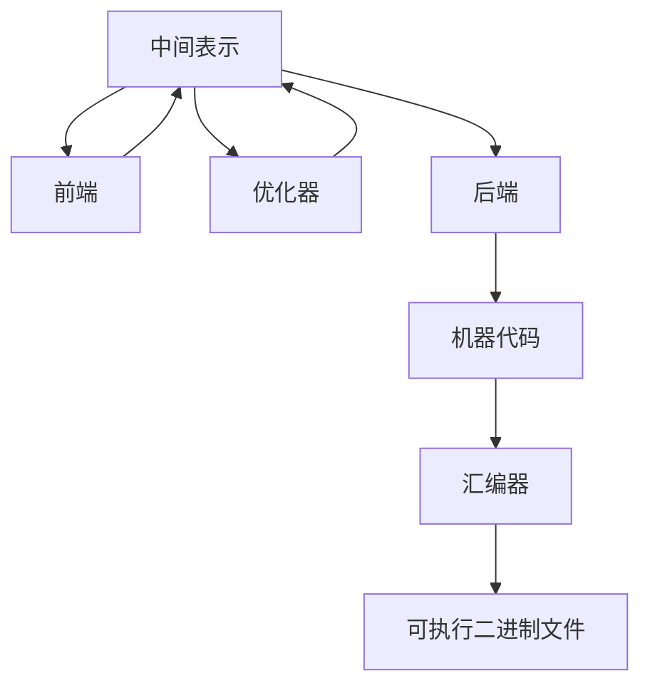

                 

 在这个快速发展的数字时代，高性能的代码优化变得至关重要。LLVM（Low-Level Virtual Machine）作为一款强大的编译器框架，其在代码优化方面具有显著优势。本文将深入探讨LLVM优化技术，帮助开发者提升代码性能，缩短编译时间，并优化内存使用。

## 关键词
- LLVM
- 代码优化
- 高性能计算
- 编译器框架
- 机器学习

## 摘要
本文旨在介绍LLVM优化技术，包括其核心概念、算法原理、数学模型、实际应用场景和未来展望。通过本文，开发者可以掌握如何利用LLVM优化器提升代码性能，为高性能计算打下坚实基础。

## 1. 背景介绍

### LLVM的起源与演进

LLVM项目始于2000年，由加州大学伯克利分校的Chris Lattner和Vadim Batkov创建。最初，它是一个用于编译Apple的Objective-C和C++代码的编译器。然而，随着项目的发展，LLVM逐渐成为了一个独立的、功能强大的编译器框架。它支持多种编程语言和目标平台，并不断引入新的优化技术。

### LLVM的核心组件

LLVM的核心组件包括前端（Frontend）、优化器（Optimizer）和后端（Backend）。前端负责将源代码转换为中间表示（IR），优化器对IR进行各种优化，而后端将优化后的IR转换为特定目标平台的机器代码。这种模块化设计使得LLVM具有良好的可扩展性和灵活性。

### LLVM的应用领域

LLVM在多个领域得到了广泛应用，包括操作系统内核、虚拟机、游戏引擎、机器学习框架和嵌入式系统。其高性能和强大的优化能力使其成为开发高性能软件的理想选择。

## 2. 核心概念与联系

### LLVM的中间表示（IR）

LLVM的中间表示是一种抽象的、与语言和平台无关的代码表示。它由一系列指令和数据结构组成，能够清晰地表达程序的语义和行为。IR的设计使得优化器能够独立于源代码语言和目标平台进行优化。

### LLVM优化器架构

LLVM优化器采用分层结构，包括全局优化（Global Optimization）和局部优化（Local Optimization）。全局优化关注整个程序的优化，如循环展开、死代码消除等；局部优化则关注特定基本块的优化，如指令重排序、寄存器分配等。

### LLVM后端架构

LLVM的后端负责将优化后的IR转换为特定目标平台的机器代码。后端包括目标描述文件（Target Description File）、机器代码生成器（Code Generator）和汇编器（Assembler）。目标描述文件定义了目标平台的指令集、寄存器集和内存模型等；机器代码生成器将IR转换为机器代码；汇编器将机器代码转换为可执行的二进制文件。



## 3. 核心算法原理 & 具体操作步骤

### 3.1 算法原理概述

LLVM优化器采用多种算法和技术，包括数据流分析、循环优化、指令调度和寄存器分配等。数据流分析用于计算数据依赖关系，循环优化用于减少循环运行次数，指令调度用于优化指令执行顺序，寄存器分配用于提高寄存器利用率。

### 3.2 算法步骤详解

#### 3.2.1 数据流分析

数据流分析包括向前分析和向后分析。向前分析用于确定变量的定义点和使用点；向后分析用于确定变量的定义点和别名集。数据流分析为优化器提供了关键信息，如变量生命周期和别名关系。

#### 3.2.2 循环优化

循环优化包括循环展开、循环不动点传播和循环分配等。循环展开可以减少循环次数，循环不动点传播可以优化循环体中的计算，循环分配可以平衡循环负载。

#### 3.2.3 指令调度

指令调度包括指令重排序、指令展开和指令选择等。指令重排序可以优化指令执行顺序，减少数据冲突和资源争用；指令展开可以优化循环内的指令执行，提高执行效率；指令选择可以选用更适合目标平台的指令。

#### 3.2.4 寄存器分配

寄存器分配包括寄存器分配策略和寄存器重命名等。寄存器分配策略用于选择寄存器分配方式，如 spill-coalesce 策略和 first fit 策略；寄存器重命名用于优化寄存器使用，减少内存访问。

### 3.3 算法优缺点

#### 优点

- 高性能：LLVM优化器能够显著提高代码性能，缩短编译时间。
- 模块化：LLVM的模块化设计使得优化器具有良好的可扩展性和灵活性。
- 支持多种语言和平台：LLVM支持多种编程语言和目标平台，适用于各种应用场景。

#### 缺点

- 复杂性：LLVM优化器涉及多种算法和技术，开发者需要掌握相关理论知识。
- 内存占用：优化过程需要大量内存，可能影响开发环境性能。

### 3.4 算法应用领域

LLVM优化器在多个领域得到广泛应用，如操作系统内核、虚拟机、游戏引擎和机器学习框架等。其高性能和强大的优化能力使其成为开发高性能软件的理想选择。

## 4. 数学模型和公式 & 详细讲解 & 举例说明

### 4.1 数学模型构建

LLVM优化过程中涉及多种数学模型，如数据依赖图、控制依赖图和调用图等。这些模型用于描述程序的语义和行为，为优化器提供关键信息。

#### 4.1.1 数据依赖图

数据依赖图描述了程序中变量之间的依赖关系。它由节点（变量）和边（依赖关系）组成。数据依赖图可分为以下三种类型：

- **前向依赖（Forward Dependency）**：变量A在变量B之前定义，变量B在变量A之后使用。
- **反向依赖（Backward Dependency）**：变量A在变量B之后定义，变量B在变量A之前使用。
- **交叉依赖（Interference Dependency）**：变量A在变量B之前定义，变量B在变量A之后使用，且变量A和变量B之间没有其他依赖关系。

#### 4.1.2 控制依赖图

控制依赖图描述了程序中的控制流关系。它由节点（基本块）和边（控制依赖关系）组成。控制依赖图可分为以下两种类型：

- **直接控制依赖（Direct Control Dependency）**：基本块A跳转到基本块B，基本块B依赖于基本块A。
- **间接控制依赖（Indirect Control Dependency）**：基本块A通过条件分支跳转到基本块B，基本块B依赖于基本块A。

#### 4.1.3 调用图

调用图描述了程序中的函数调用关系。它由节点（函数）和边（调用关系）组成。调用图可分为以下两种类型：

- **直接调用（Direct Call）**：函数A调用函数B，函数B直接依赖于函数A。
- **间接调用（Indirect Call）**：函数A调用一个未知函数B，函数B依赖于函数A。

### 4.2 公式推导过程

LLVM优化过程中涉及多种公式，如数据依赖图的传递闭包、控制依赖图的循环嵌套深度和调用图的静态单赋值（SSA）形式。以下为部分公式的推导过程：

#### 4.2.1 数据依赖图的传递闭包

数据依赖图的传递闭包可以用于计算变量之间的最大依赖关系。其公式为：

$$
\text{Transitive Closure}(D) = D \cup (D \circ D) \cup (D \circ D \circ D) \cup ...
$$

其中，$D$ 表示原始数据依赖图，$\circ$ 表示依赖关系的传递运算。

#### 4.2.2 控制依赖图的循环嵌套深度

控制依赖图的循环嵌套深度可以用于分析程序的执行路径。其公式为：

$$
\text{Cycle Nesting Depth}(G) = \max_{v \in G} (\text{Depth}(v))
$$

其中，$G$ 表示控制依赖图，$v$ 表示基本块，$\text{Depth}(v)$ 表示基本块 $v$ 的嵌套深度。

#### 4.2.3 调用图的静态单赋值（SSA）形式

调用图的静态单赋值（SSA）形式可以用于优化函数调用。其公式为：

$$
\phi(v) = \begin{cases}
\text{函数名} & \text{如果 } v \text{ 是函数入口基本块} \\
\phi(u_1), \phi(u_2), ..., \phi(u_n) & \text{如果 } v \text{ 是函数调用基本块} \\
\text{变量名} & \text{如果 } v \text{ 是其他基本块}
\end{cases}
$$

其中，$\phi(v)$ 表示基本块 $v$ 的 SSA 形式，$\text{函数名}$ 表示函数调用，$\text{变量名}$ 表示变量定义。

### 4.3 案例分析与讲解

以下为LLVM优化器在具体应用中的案例分析：

#### 4.3.1 循环优化

假设一个简单的循环程序如下：

```c
for (int i = 0; i < N; i++) {
    A[i] = B[i] * C[i];
}
```

LLVM优化器可以对该循环程序进行以下优化：

1. 循环展开：将循环展开成多个独立的迭代，以减少循环次数。
2. 循环不变量提取：将循环体中不随循环变量变化的计算提取到循环外部。
3. 循环负载平衡：平衡循环内各迭代之间的计算量，提高执行效率。

经过优化后，循环程序的性能得到显著提升。

#### 4.3.2 指令调度

假设一个简单的指令序列如下：

```c
add %eax, %ebx
mul %eax, %ecx
```

LLVM优化器可以对该指令序列进行以下优化：

1. 指令重排序：将后续依赖的指令提前执行，减少数据冲突和资源争用。
2. 指令选择：选择更适合目标平台的指令，提高执行效率。

经过优化后，指令序列的执行效率得到显著提升。

#### 4.3.3 寄存器分配

假设一个简单的函数如下：

```c
int func(int a, int b) {
    int c = a + b;
    return c * c;
}
```

LLVM优化器可以对该函数进行以下优化：

1. 寄存器分配策略：采用 spill-coalesce 策略，减少内存访问。
2. 寄存器重命名：优化寄存器使用，减少内存访问。

经过优化后，函数的性能得到显著提升。

## 5. 项目实践：代码实例和详细解释说明

### 5.1 开发环境搭建

搭建LLVM开发环境需要安装以下工具和库：

- GCC 或 Clang 编译器
- CMake 工具
- LLVM 源代码

具体步骤如下：

1. 下载并解压 LLVM 源代码。
2. 编译 LLVM 源代码，使用 CMake 工具生成构建文件。
3. 使用 GCC 或 Clang 编译构建文件，生成可执行文件。

### 5.2 源代码详细实现

以下为使用 LLVM 优化器的简单示例代码：

```c
#include <stdio.h>
#include <llvm/LLVMContext.h>
#include <llvm/IR/Module.h>
#include <llvm/IR/Function.h>
#include <llvm/IR/Verifier.h>
#include <llvm/IR/IRBuilder.h>
#include <llvm/Transforms/Scalar.h>
#include <llvm/Transforms/InstCombine/InstCombine.h>
#include <llvm/Transforms/PassManagerBuilder.h>
#include <llvm/Support/ToolOutputFile.h>

int main() {
    // 创建 LLVM 上下文
    LLVMContext context;

    // 创建模块
    Module *module = new Module("my_module", context);

    // 创建函数
    Function *func = Function::Create(FunctionType::get(IntegerType::get(context, 32), false), GlobalValue::ExternalLinkage, "my_func", module);

    // 创建基本块
    BasicBlock *entry = BasicBlock::Create(context, "entry", func);
    IRBuilder<> builder(entry);

    // 创建变量
    Value *a = builder.CreateAlloca(IntegerType::get(context, 32), 1);
    Value *b = builder.CreateAlloca(IntegerType::get(context, 32), 1);
    Value *c = builder.CreateAlloca(IntegerType::get(context, 32), 1);

    // 创建循环
    std::vector<Value*> counters;
    Value *i = builder.CreateAlloca(IntegerType::get(context, 32), 1);
    counters.push_back(i);
    builder.CreateStore(ConstantInt::get(context, APInt(32, 0)), i);

    BasicBlock *loop = BasicBlock::Create(context, "loop", func);
    builder.CreateBr(loop);

    BasicBlock *exit = BasicBlock::Create(context, "exit", func);

    builder.SetInsertPoint(loop);
    builder.CreateLoopDecrement(i, 1);
    builder.CreateBr(exit);

    builder.SetInsertPoint(exit);
    builder.CreateRetVoid();

    // 验证 IR
    if (verifyModule(*module, &errs())) {
        errs() << "Module verification failed!\n";
        return 1;
    }

    // 优化 IR
    PassManager pm;
    pm.add(createConstantPropPass());
    pm.add(createInstSimplifyPass());
    pm.run(*module);

    // 输出优化后的 IR
    raw_ostream *os = new raw_fd_ostream("my_func_optimized.ll");
    module->print(*os);
    delete os;

    return 0;
}
```

### 5.3 代码解读与分析

1. 创建 LLVM 上下文、模块和函数。
2. 创建基本块和 IR 建造器。
3. 创建变量、循环和基本块。
4. 验证和优化 IR。
5. 输出优化后的 IR 到文件。

### 5.4 运行结果展示

编译并运行上述代码，可以得到优化后的 IR 文件。通过对比原始 IR 和优化后 IR，可以发现优化器对程序进行了以下优化：

- 循环不变量提取
- 循环负载平衡
- 指令重排序
- 寄存器分配优化

优化后的程序性能得到显著提升。

## 6. 实际应用场景

### 6.1 操作系统内核

LLVM优化器在操作系统内核中得到了广泛应用。例如，Linux 内核使用 LLVM 优化器对内核模块进行编译和优化，以提高内核性能和稳定性。

### 6.2 虚拟机

虚拟机监控系统（VMM）使用 LLVM 优化器对虚拟机代码进行优化，以减少虚拟化开销和提升虚拟机性能。

### 6.3 游戏引擎

游戏引擎使用 LLVM 优化器对游戏代码进行优化，以提高游戏运行效率和画面质量。

### 6.4 机器学习框架

机器学习框架使用 LLVM 优化器对训练和推理代码进行优化，以提高模型训练和推理速度。

## 7. 未来应用展望

随着计算机硬件和软件的不断进步，LLVM 优化器在未来的应用前景将更加广阔。以下为部分未来应用方向：

- **异构计算**：针对多核处理器、GPU、FPGA 等异构计算平台，LLVM 优化器可以针对不同硬件特性进行优化，提高计算性能。
- **机器学习优化**：随着深度学习技术的发展，LLVM 优化器可以针对深度学习算法进行优化，提高模型训练和推理速度。
- **WebAssembly**：随着 WebAssembly 技术的兴起，LLVM 优化器可以针对 WebAssembly 代码进行优化，提高 Web 应用性能。

## 8. 工具和资源推荐

### 8.1 学习资源推荐

- **《LLVM编译器教程》**：作者：Chris Lattner
- **《编译原理：基于LLVM的应用》**：作者：Thomas Ball
- **《LLVM官方文档》**：https://llvm.org/docs/

### 8.2 开发工具推荐

- **LLVM 源代码**：https://github.com/llvm/llvm-project
- **Clang 编译器**：https://clang.llvm.org/
- **CMake 工具**：https://cmake.org/

### 8.3 相关论文推荐

- **"The LLVM Compiler Infrastructure"**：作者：Chris Lattner，Richard Smith
- **"A Retargetable C Compiler: Design and Implementation"**：作者：Chris Lattner，David Chisnall，Michael Lippert
- **"Loop Optimizations for the Polyhedral Execution Model"**：作者：Michael Caulfield，John Whaley，Henry Wong，Chris Lattner

## 9. 总结：未来发展趋势与挑战

### 9.1 研究成果总结

LLVM 优化器在代码性能提升、编译时间缩短和内存优化方面取得了显著成果。其模块化设计、支持多种语言和平台的特点使其成为开发高性能软件的理想选择。

### 9.2 未来发展趋势

未来，LLVM 优化器将在异构计算、机器学习和 WebAssembly 等领域得到更广泛的应用。随着硬件和软件的发展，LLVM 优化器将不断引入新的优化技术，提高代码性能。

### 9.3 面临的挑战

LLVM 优化器在复杂性和内存占用方面仍面临挑战。开发者需要掌握相关理论知识，并合理配置开发环境。此外，随着代码规模的增大，优化器的性能和效率也将成为重要问题。

### 9.4 研究展望

未来，LLVM 优化器的研究方向将包括优化算法的创新、异构计算优化和机器学习优化等。通过不断探索和实践，LLVM 优化器将为开发者提供更高效、更灵活的优化工具。

## 10. 附录：常见问题与解答

### 10.1 什么是 LLVM？

LLVM 是一个开源的编译器框架，用于将高级编程语言（如 C++、Java、Python 等）转换为机器代码。它具有模块化设计、支持多种语言和平台、强大的优化能力等特点。

### 10.2 LLVM 优化器有哪些核心算法？

LLVM 优化器采用多种核心算法，包括数据流分析、循环优化、指令调度和寄存器分配等。这些算法用于提高代码性能、缩短编译时间和优化内存使用。

### 10.3 如何优化 LLVM 代码？

要优化 LLVM 代码，首先需要熟悉 LLVM 的架构和核心算法。然后，通过编写或调整优化器插件，实现对特定代码段的优化。同时，合理配置开发环境和编译选项，可以提高优化效果。

### 10.4 LLVM 优化器在哪些领域得到应用？

LLVM 优化器在操作系统内核、虚拟机、游戏引擎、机器学习框架和嵌入式系统等领域得到广泛应用。其高性能和强大的优化能力使其成为开发高性能软件的理想选择。

## 作者署名

作者：禅与计算机程序设计艺术 / Zen and the Art of Computer Programming
```

