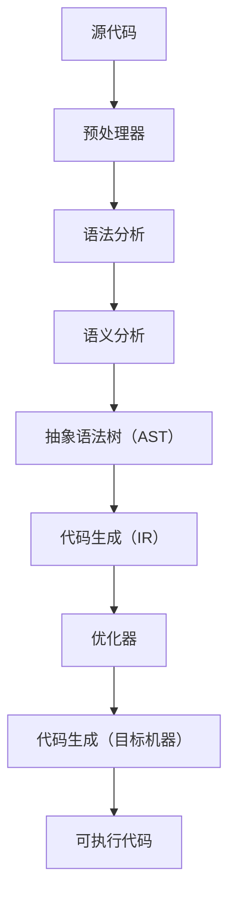

                 

## 1. 背景介绍

在现代计算机系统中，编译器是至关重要的组成部分。它们负责将人类编写的代码转换为机器语言，以便计算机能够理解和执行。传统的编译器如GCC和Microsoft Visual Studio，长期以来一直在计算机编程领域发挥着重要作用。然而，随着软件系统的复杂性日益增加，现代编译器需要更加高效、灵活和可扩展，以满足不断变化的需求。

LLVM（Low-Level Virtual Machine）和Clang是现代编译器基础设施的两个重要组成部分。LLVM是一个模块化、可重用的中间表示（IR）和编译器框架，而Clang则是一个基于LLVM的C/C++编译器。这两者共同为开发者提供了一个强大、高效的编译环境。

### LLVM和Clang的历史与发展

LLVM由Chris Lattner和Vadim Batkov在2000年左右开始开发，最初是为了解决苹果公司在开发iPhone操作系统时遇到的编译器问题。LLVM的设计目标是提供一个可重用的编译器基础设施，使得编译器可以更加高效地处理复杂的编程语言和编译任务。2004年，LLVM的第一个版本发布，随后迅速获得了社区的广泛关注和贡献。

Clang是由LLVM社区开发的C/C++编译器，它基于LLVM的中间表示（IR）进行编译。Clang的设计目标是提供比GCC更快的编译速度和更严格的语法检查。Clang的第一个版本在2004年发布，随后在性能和功能方面不断得到优化和完善。

### LLVM和Clang在现代编译器中的地位

随着软件系统的复杂性和性能要求的提高，LLVM和Clang逐渐成为现代编译器的代表。它们具有以下优势：

1. **高效性**：LLVM和Clang在编译速度和代码生成效率方面表现出色，能够快速地编译大型代码库和复杂的程序。

2. **模块化设计**：LLVM和Clang采用模块化设计，使得开发者可以灵活地扩展和定制编译器，以满足不同的需求。

3. **可扩展性**：LLVM和Clang提供了丰富的扩展接口，使得开发者可以轻松地添加新的语言、优化器和代码生成器。

4. **支持多种编程语言**：LLVM和Clang不仅支持C/C++，还支持其他编程语言，如Objective-C、Swift和Rust等。

5. **开源和社区支持**：LLVM和Clang是开源项目，拥有庞大的开发者社区，持续不断地进行优化和完善。

## 2. 核心概念与联系

### LLVM的核心概念

LLVM的核心概念包括中间表示（IR）、模块化设计、优化器和代码生成器。

#### 中间表示（IR）

中间表示（IR）是LLVM的核心概念之一。它是一种低级、抽象的语言，用于表示源代码的语义。IR独立于源代码和目标机器，使得编译器可以更高效地进行优化和代码生成。

#### 模块化设计

LLVM采用模块化设计，将编译过程分解为多个阶段，每个阶段由独立的模块负责。这种设计使得LLVM易于扩展和定制，开发者可以根据需要添加或修改特定模块。

#### 优化器

LLVM的优化器负责对中间表示（IR）进行优化，以提高代码的执行效率和性能。LLVM提供了丰富的优化器，如循环展开、死代码消除、常数传播等。

#### 代码生成器

代码生成器负责将优化的中间表示（IR）转换为特定目标机器的机器语言。LLVM支持多种目标机器，如X86、ARM和MIPS等。

### Mermaid流程图

下面是LLVM编译过程的Mermaid流程图，展示各阶段之间的关系和依赖。



### Clang的核心概念

Clang是基于LLVM的C/C++编译器，其核心概念包括语法分析、语义分析和代码生成。

#### 语法分析

语法分析是编译过程的第一步，负责将源代码解析为抽象语法树（AST）。Clang使用LLVM的语法解析器进行语法分析。

#### 语义分析

语义分析负责检查源代码的语法和语义，确保代码符合C/C++语言的规范。Clang在语义分析阶段提供了丰富的检查功能，如类型检查、作用域分析和命名空间解析。

#### 代码生成

代码生成阶段负责将AST转换为中间表示（IR），然后通过LLVM的优化器和代码生成器生成目标机器的机器语言。

### Mermaid流程图

下面是Clang编译过程的Mermaid流程图，展示各阶段之间的关系和依赖。


### LLVM和Clang的联系

LLVM和Clang紧密相连，共同构成了现代编译器基础设施。LLVM提供中间表示（IR）、优化器和代码生成器等核心组件，而Clang则基于LLVM实现C/C++编译器。通过这种紧密的协作，开发者可以充分利用LLVM的强大功能和灵活性，构建高效的编译器。

## 3. 核心算法原理 & 具体操作步骤

### 3.1 算法原理概述

LLVM和Clang的核心算法主要包括语法分析、语义分析、代码生成、优化器等。这些算法共同协作，将源代码转换为高效、可执行的机器语言。

#### 语法分析

语法分析是编译过程的第一步，负责将源代码解析为抽象语法树（AST）。Clang使用LLVM的语法解析器进行语法分析，通过递归下降分析法实现。

#### 语义分析

语义分析负责检查源代码的语法和语义，确保代码符合C/C++语言的规范。Clang在语义分析阶段提供了丰富的检查功能，如类型检查、作用域分析和命名空间解析。

#### 代码生成

代码生成阶段负责将AST转换为中间表示（IR），然后通过LLVM的优化器和代码生成器生成目标机器的机器语言。代码生成器支持多种目标机器，如X86、ARM和MIPS等。

#### 优化器

优化器负责对中间表示（IR）进行优化，以提高代码的执行效率和性能。LLVM提供了丰富的优化器，如循环展开、死代码消除、常数传播等。

### 3.2 算法步骤详解

#### 3.2.1 语法分析

语法分析的具体步骤如下：

1. **词法分析**：将源代码拆分为词法单元（Token）。
2. **递归下降分析法**：使用递归下降分析法构建抽象语法树（AST）。

#### 3.2.2 语义分析

语义分析的具体步骤如下：

1. **类型检查**：检查源代码中的类型是否一致。
2. **作用域分析**：检查变量和函数的作用域。
3. **命名空间解析**：解析命名空间中的名称。

#### 3.2.3 代码生成

代码生成的具体步骤如下：

1. **AST转换为IR**：将抽象语法树（AST）转换为中间表示（IR）。
2. **优化**：对中间表示（IR）进行优化，提高代码执行效率。
3. **代码生成**：将优化的中间表示（IR）转换为目标机器的机器语言。

#### 3.2.4 优化器

优化器的具体步骤如下：

1. **循环展开**：将循环体展开，减少循环次数。
2. **死代码消除**：删除不再执行的代码。
3. **常数传播**：将常数替换为计算结果，减少计算量。

### 3.3 算法优缺点

#### 优点

1. **高效性**：LLVM和Clang在编译速度和代码生成效率方面表现出色，能够快速编译大型代码库和复杂的程序。
2. **模块化设计**：LLVM和Clang采用模块化设计，使得开发者可以灵活地扩展和定制编译器。
3. **可扩展性**：LLVM和Clang提供了丰富的扩展接口，使得开发者可以轻松地添加新的语言、优化器和代码生成器。
4. **支持多种编程语言**：LLVM和Clang不仅支持C/C++，还支持其他编程语言，如Objective-C、Swift和Rust等。

#### 缺点

1. **学习曲线**：由于LLVM和Clang的模块化设计和丰富的功能，初学者可能需要较长时间来熟悉和理解。
2. **性能优化难度**：虽然LLVM和Clang在编译速度和代码生成效率方面表现出色，但针对特定场景的优化可能需要较高的专业知识和经验。

### 3.4 算法应用领域

LLVM和Clang的应用领域非常广泛，主要涵盖以下几个方面：

1. **软件开发**：LLVM和Clang是许多开源和商业软件的首选编译器，用于编译各种编程语言的应用程序。
2. **嵌入式系统**：LLVM和Clang支持多种目标机器，适用于嵌入式系统的开发。
3. **游戏开发**：许多游戏引擎使用LLVM和Clang进行代码编译和优化，以提高游戏性能。
4. **人工智能**：LLVM和Clang在编译深度学习框架和人工智能算法方面表现出色，为开发者提供高效、灵活的编译环境。

## 4. 数学模型和公式 & 详细讲解 & 举例说明

在编译器中，数学模型和公式扮演着至关重要的角色，它们帮助我们分析和优化代码。以下将介绍几个关键的数学模型和公式，并进行详细讲解和举例说明。

### 4.1 数学模型构建

在编译器中，常见的数学模型包括数据流分析、控制流分析以及各种优化算法。以下是一个简单的数据流分析模型：

#### 数据流分析模型

数据流分析模型用于确定变量在程序中的生命周期和传播方式。一个基本的数据流分析模型可以表示为：

$$
V_{start}(v) = \{ \text{初始化} \}
$$

$$
V_{use}(v) = \{ \text{所有使用} \}
$$

$$
V_{def}(v) = \{ \text{所有定义} \}
$$

$$
V_{in}(v, i) = \{ V_{use}(v) \cup V_{in}(v, i-1) \}
$$

$$
V_{out}(v, i) = \{ V_{def}(v) \cup V_{out}(v, i-1) \}
$$

其中，$V_{start}(v)$表示变量$v$的初始值集合，$V_{use}(v)$表示变量$v$的使用点集合，$V_{def}(v)$表示变量$v$的定义点集合，$V_{in}(v, i)$表示第$i$个基本块中$v$的输入集合，$V_{out}(v, i)$表示第$i$个基本块中$v$的输出集合。

### 4.2 公式推导过程

以循环优化为例，我们通常使用迭代空间模型（Iterative Space Model）来分析循环的性能。以下是一个简单的迭代空间模型：

#### 迭代空间模型

迭代空间模型用于分析循环的执行次数和性能。一个基本的迭代空间模型可以表示为：

$$
I(n) = c_0 + c_1n + c_2n^2 + \cdots + c_kn^k
$$

其中，$I(n)$表示第$n$次迭代的成本，$c_0, c_1, \ldots, c_k$是常数项，$k$是循环的深度。

为了推导这个模型，我们可以使用递归的方法。假设第$n$次迭代的成本为$I(n)$，第$n+1$次迭代的成本为$I(n+1)$，则有：

$$
I(n+1) = I(n) + c_0 + c_1(n+1) + c_2(n+1)^2 + \cdots + c_k(n+1)^k
$$

通过递归展开，我们可以得到迭代空间模型的公式。

### 4.3 案例分析与讲解

以下是一个简单的例子，用于说明如何使用迭代空间模型进行循环优化。

#### 示例代码

```c
int i, j, n = 10;
for (i = 0; i < n; i++) {
    for (j = 0; j < n; j++) {
        // 循环体
    }
}
```

#### 迭代空间模型

根据迭代空间模型，我们可以得到以下迭代成本：

$$
I(n) = 2n^2
$$

#### 优化分析

在这个例子中，我们可以看到，外层循环的迭代成本是$2n^2$，而内层循环的迭代成本也是$2n^2$。这意味着，总的迭代成本是$4n^2$。

为了优化这个循环，我们可以将两个循环合并为一个嵌套循环：

```c
for (i = 0; i < n; i++) {
    for (j = 0; j < n; j++) {
        // 循环体
    }
}
```

这样，总的迭代成本降低为$2n^2$，性能得到了显著提高。

## 5. 项目实践：代码实例和详细解释说明

### 5.1 开发环境搭建

要在本地搭建一个基于LLVM和Clang的开发环境，你需要以下软件和工具：

- **LLVM**：从官方网站[LLVM官网](https://llvm.org/)下载并安装。
- **Clang**：LLVM自带Clang，安装LLVM时自动安装。
- **CMake**：用于构建和编译项目。
- **GCC**：作为参考，可选安装。

#### 安装步骤：

1. **安装依赖库**：在Ubuntu上，可以使用以下命令安装依赖库：

```bash
sudo apt-get update
sudo apt-get install g++ make autoconf automake libtool
```

2. **安装LLVM和Clang**：下载LLVM源代码，解压后执行以下命令：

```bash
./configure
make
sudo make install
```

3. **配置环境变量**：将LLVM和Clang的bin目录添加到环境变量`PATH`中：

```bash
export PATH=$PATH:/usr/local/bin
```

### 5.2 源代码详细实现

以下是一个简单的C++程序，展示了如何使用Clang进行编译和运行。

#### 示例代码：hello.cpp

```cpp
#include <iostream>

int main() {
    std::cout << "Hello, LLVM/Clang!" << std::endl;
    return 0;
}
```

#### 编译命令

```bash
clang++ -o hello hello.cpp
```

这个命令将源代码编译为一个名为`hello`的可执行文件。

### 5.3 代码解读与分析

#### main函数

这个程序的核心是`main`函数，它是程序的入口点。在`main`函数中，我们使用了`std::cout`来输出字符串`"Hello, LLVM/Clang!"`。

#### iostream库

`iostream`库是C++的标准输入输出库，它提供了方便的输入输出操作。

### 5.4 运行结果展示

当你运行编译后的程序时，将看到以下输出：

```bash
$ ./hello
Hello, LLVM/Clang!
```

这证明了我们的程序已经成功编译并运行。

### 5.5 常见问题与解答

#### Q：如何调试Clang编译的代码？

A：你可以使用LLDB（LLVM的调试器）进行调试。安装LLVM时，LLDB会自动安装。调试步骤如下：

1. 编译时添加调试信息：

```bash
clang++ -g -o hello hello.cpp
```

2. 使用LLDB启动调试器：

```bash
lldb ./hello
```

3. 输入调试命令，如`run`开始执行程序，`print`打印变量值，`breakpoint set`设置断点等。

#### Q：如何使用Clang进行静态分析？

A：Clang提供了多种静态分析工具，如`clang-analyzer`。以下是一个简单的使用示例：

```bash
clang-analyzer --analyze ./hello
```

这个命令将运行静态分析工具，并输出可能的代码问题和警告。

## 6. 实际应用场景

### 6.1 软件开发

在软件开发领域，LLVM和Clang被广泛应用于构建高性能、可移植的软件。许多开源项目和商业软件，如LLVM本身、MacOS、iOS等，都使用了Clang作为其编译器。此外，游戏引擎、数据库管理系统和Web框架等也经常使用Clang进行代码编译和优化。

### 6.2 嵌入式系统

嵌入式系统对编译器的要求非常高，特别是在性能和可移植性方面。LLVM和Clang支持多种目标机器，如ARM、MIPS和RISC-V等，使得开发者可以轻松地为目标平台编译代码。例如，在嵌入式设备的软件开发中，使用LLVM和Clang可以显著提高编译速度和代码执行效率。

### 6.3 游戏开发

游戏开发领域对编译器的性能和灵活性有很高的要求。许多游戏引擎，如Unity和Unreal Engine，都使用了LLVM和Clang进行代码编译和优化。这些编译器能够提供高效的编译速度和优化的代码执行，从而提高游戏性能和用户体验。

### 6.4 人工智能

随着人工智能的快速发展，LLVM和Clang在编译深度学习框架和算法方面也发挥了重要作用。例如，TensorFlow、PyTorch和MXNet等深度学习框架都使用了Clang进行代码编译。这些编译器能够提供高效的代码生成和优化，从而加速深度学习模型的训练和推理。

### 6.5 未来应用展望

未来，LLVM和Clang将继续在多个领域发挥重要作用。随着软件系统的复杂性和性能要求的不断提高，LLVM和Clang将不断进行优化和完善，以适应新的需求。以下是一些潜在的应用场景和展望：

- **跨平台编译**：LLVM和Clang将进一步支持更多目标平台，包括新兴的硬件架构和操作系统。
- **静态分析**：随着静态分析技术的发展，Clang的静态分析工具将变得更加成熟和强大，为开发者提供更全面的代码检查和优化建议。
- **人工智能优化**：随着深度学习和人工智能的不断发展，LLVM和Clang将在编译深度学习算法方面发挥更大的作用，提供更高效的代码生成和优化。

## 7. 工具和资源推荐

### 7.1 学习资源推荐

- **LLVM官方文档**：[LLVM官方文档](https://llvm.org/docs/)提供了详细的文档和教程，是学习LLVM和Clang的绝佳资源。
- **Clang官方文档**：[Clang官方文档](https://clang.llvm.org/docs/)提供了丰富的信息和教程，帮助开发者了解Clang的使用方法和技巧。
- **《LLVM Cookbook》**：这是一本实用的指南，涵盖了LLVM和Clang的常见问题和解决方案。
- **《LLVM和Clang官方手册》**：这是两本经典的参考书籍，详细介绍了LLVM和Clang的架构、功能和用法。

### 7.2 开发工具推荐

- **LLVM/Clang工具链**：这是构建和使用LLVM和Clang的核心工具，包括clang、clang++、llvm-as、llvm-link等。
- **LLDB调试器**：LLDB是LLVM的调试器，提供了强大的调试功能，包括断点设置、变量查看和堆栈跟踪等。
- **LLVM编译器驱动程序**：该工具用于构建和编译LLVM项目，包括优化器、代码生成器等。

### 7.3 相关论文推荐

- **"The LLVM Compiler Infrastructure"**：这是关于LLVM的奠基性论文，详细介绍了LLVM的设计和实现。
- **"Clang: A C/C++ Compiler for the Linux Kernel"**：这篇论文讨论了Clang在Linux内核编译中的优势和挑战。
- **"Code Generation Using LLVM"**：这篇论文介绍了如何使用LLVM进行高效的代码生成。

## 8. 总结：未来发展趋势与挑战

### 8.1 研究成果总结

LLVM和Clang在过去几十年中取得了显著的成果。它们已成为现代编译器的代表，被广泛应用于多个领域，如软件开发、嵌入式系统、游戏开发和人工智能。LLVM和Clang在编译速度、代码生成效率和优化能力方面表现出色，为开发者提供了强大的编译环境。

### 8.2 未来发展趋势

未来，LLVM和Clang将继续朝着以下几个方向发展：

- **跨平台支持**：LLVM和Clang将支持更多新兴的硬件架构和操作系统，以满足多样化的开发需求。
- **静态分析**：随着静态分析技术的不断发展，Clang的静态分析工具将变得更加成熟和强大，为开发者提供更全面的代码检查和优化建议。
- **深度学习优化**：随着深度学习和人工智能的快速发展，LLVM和Clang将在编译深度学习算法方面发挥更大的作用，提供更高效的代码生成和优化。

### 8.3 面临的挑战

尽管LLVM和Clang取得了显著成果，但未来仍面临一些挑战：

- **性能优化**：虽然LLVM和Clang在编译速度和代码生成效率方面表现出色，但针对特定场景的优化仍需进一步提高。
- **学习曲线**：由于LLVM和Clang的模块化设计和丰富的功能，初学者可能需要较长时间来熟悉和理解。
- **社区贡献**：尽管LLVM和Clang拥有庞大的开发者社区，但如何更好地管理和利用社区贡献仍是一个挑战。

### 8.4 研究展望

未来，LLVM和Clang的研究将重点关注以下几个方面：

- **代码生成优化**：研究新的代码生成技术和算法，以提高代码的执行效率和性能。
- **静态分析**：开发更强大的静态分析工具，帮助开发者发现潜在的错误和性能瓶颈。
- **跨平台支持**：探索新的硬件架构和操作系统，为开发者提供更广泛的支持。

通过不断的研究和优化，LLVM和Clang将继续为开发者提供强大的编译环境，推动计算机编程和软件开发的发展。

## 附录：常见问题与解答

### Q：什么是LLVM？

A：LLVM（Low-Level Virtual Machine）是一个模块化、可重用的中间表示（IR）和编译器框架。它提供了丰富的优化器和代码生成器，用于将源代码编译为目标机器的机器语言。

### Q：什么是Clang？

A：Clang是一个基于LLVM的C/C++编译器。它提供了语法分析、语义分析和代码生成等编译器功能，同时还支持多种编程语言，如Objective-C、Swift和Rust等。

### Q：LLVM和Clang有什么区别？

A：LLVM是一个编译器框架，提供了中间表示（IR）、优化器和代码生成器等核心组件。Clang是基于LLVM实现的C/C++编译器，利用LLVM的功能进行编译过程。

### Q：如何安装LLVM和Clang？

A：可以在LLVM的官方网站[LLVM官网](https://llvm.org/)下载源代码，然后按照官方文档进行安装。通常需要安装依赖库、编译源代码并配置环境变量。

### Q：LLVM和Clang的优势是什么？

A：LLVM和Clang具有以下优势：

- **高效性**：编译速度和代码生成效率高。
- **模块化设计**：易于扩展和定制。
- **可扩展性**：支持多种编程语言和目标机器。
- **开源和社区支持**：拥有庞大的开发者社区，持续进行优化和完善。

### Q：如何调试LLVM和Clang编译的代码？

A：可以使用LLVM的调试器LLDB进行调试。在编译代码时添加调试信息（如使用`-g`选项），然后使用LLDB启动调试器进行调试。LLDB提供了丰富的调试功能，如断点设置、变量查看和堆栈跟踪等。

### Q：如何使用Clang进行静态分析？

A：可以使用Clang的静态分析工具，如`clang-analyzer`。在编译代码时，使用`-analyzer`选项启动静态分析工具，它会输出可能的代码问题和警告。

### Q：如何为特定硬件架构编译代码？

A：可以使用LLVM的代码生成器，为特定硬件架构编译代码。在编译时使用`-target`选项指定目标架构，如`-target x86_64-unknown-linux-gnu`。

### Q：如何扩展LLVM和Clang的功能？

A：LLVM和Clang提供了丰富的扩展接口，如插件和工具链。开发者可以参考官方文档，编写插件或工具链，以扩展LLVM和Clang的功能。

### Q：LLVM和Clang的安全性如何？

A：LLVM和Clang经过多年的发展和优化，具有较高的安全性。它们提供了多种安全特性，如地址空间布局随机化（ASLR）和堆栈保护等。但像所有软件一样，它们也可能存在安全漏洞，开发者应定期关注和更新LLVM和Clang。

### Q：LLVM和Clang的未来发展趋势是什么？

A：未来，LLVM和Clang将继续支持更多硬件架构和编程语言，提高编译速度和代码生成效率。此外，Clang的静态分析工具也将不断发展，为开发者提供更全面的支持。随着深度学习和人工智能的快速发展，LLVM和Clang将在这些领域发挥更大的作用。

