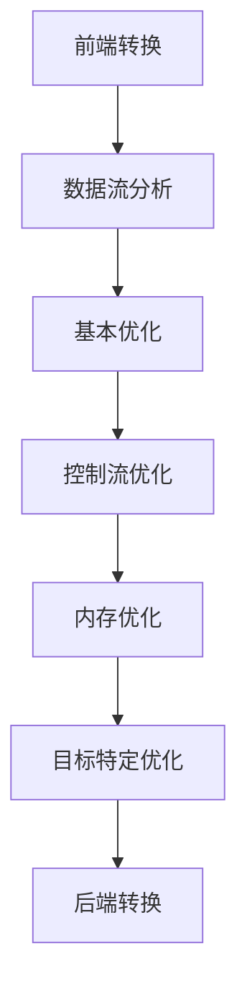

                 

关键词：LLVM，代码优化，性能提升，编译器技术，编译优化，passes

> 摘要：本文将深入探讨LLVM编译器中的优化passes，通过分析其核心概念、算法原理和具体操作步骤，帮助开发者理解和应用这些优化技巧，从而显著提升代码的运行性能。

## 1. 背景介绍

在现代软件工程中，代码性能优化已成为提升软件质量和用户体验的关键环节。编译器技术作为计算机科学领域的一个重要分支，一直在推动软件性能的提升。LLVM（Low-Level Virtual Machine）作为一款高性能的编译器基础设施，其在优化passes方面的研究与应用已经成为了编译器优化领域的热点。

优化passes是指一组作用于中间代码的编译器转换步骤，旨在改善代码的性能、可读性、可维护性等方面。LLVM的优化passes涵盖了从指令级并行优化（Instruction-level Parallelism）到数据流分析（Data Flow Analysis）等多个层次，为开发者提供了丰富的优化选项。

本文将围绕LLVM优化passes展开讨论，通过梳理其核心概念、算法原理和具体操作步骤，帮助读者深入了解这些优化技巧，并在实际项目中应用这些知识，提升代码的性能。

## 2. 核心概念与联系

### 2.1 LLVM基本架构

LLVM的核心架构可以分为以下几个主要部分：

1. **前端（Frontend）**：负责将源代码转换成LLVM的中间表示（IR，Intermediate Representation）。
2. **优化器（Optimizer）**：包含多个优化passes，负责对IR进行各种优化操作。
3. **后端（Backend）**：将优化后的IR转换成特定目标平台的机器代码。


### 2.2 优化passes分类

LLVM的优化passes可以分为以下几个主要类别：

1. **基本优化（Basic Optimizations）**：包括常数折叠、死代码删除、循环展开等。
2. **数据流优化（Data Flow Optimizations）**：包括值传播（Value Propagation）、循环不变式提取（Loop Invariant Code Motion）等。
3. **控制流优化（Control Flow Optimizations）**：包括分支预测、条件消除（Condition Elimination）等。
4. **内存优化（Memory Optimizations）**：包括数组分配优化、缓存优化等。
5. **目标特定优化（Target-Specific Optimizations）**：针对特定目标平台进行的优化。

### 2.3 Mermaid流程图

下面是一个简单的Mermaid流程图，展示了LLVM优化passes的流程：



## 3. 核心算法原理 & 具体操作步骤

### 3.1 算法原理概述

LLVM优化passes的原理可以归纳为以下几个方面：

1. **中间表示（IR）**：将源代码转换成统一的中间表示，使得优化器可以独立于前端和后端进行优化。
2. **数据流分析**：通过分析变量和值的依赖关系，找出可以优化的机会。
3. **启发式算法**：使用一系列启发式方法，选择最优的优化顺序和策略。

### 3.2 算法步骤详解

1. **前端转换**：
   - 词法分析：将源代码转换成词法单元。
   - 语法分析：构建抽象语法树（AST）。
   - 中间表示生成：将AST转换成LLVM的IR。

2. **数据流分析**：
   - **值传播**：找出相同的计算结果，进行共享。
   - **循环不变式提取**：将循环中不变的表达式提取到循环外部。

3. **基本优化**：
   - **常数折叠**：将常数表达式在编译时计算出来。
   - **死代码删除**：删除不会执行的代码。

4. **控制流优化**：
   - **分支预测**：预测分支的执行路径。
   - **条件消除**：消除不必要的条件判断。

5. **内存优化**：
   - **数组分配优化**：优化数组的分配和访问。
   - **缓存优化**：优化缓存的使用，减少缓存 miss。

6. **目标特定优化**：
   - 针对特定目标平台的指令集和架构特性进行优化。

7. **后端转换**：
   - 将优化后的IR转换成目标机器的机器代码。

### 3.3 算法优缺点

**优点**：
- **跨平台性**：LLVM支持多种编程语言和目标平台，具有很好的跨平台性。
- **灵活性**：开发者可以自定义优化passes，实现特定的优化目标。
- **高性能**：LLVM的优化器经过多年发展，已经具备了很高的性能。

**缺点**：
- **复杂度**：LLVM的优化器包含大量的优化passes，理解和使用起来有一定难度。
- **编译时间**：优化过程需要较大的计算资源，可能导致编译时间延长。

### 3.4 算法应用领域

LLVM优化passes在以下领域有广泛的应用：

- **高性能计算**：在科学计算、数据分析等领域，优化代码的性能至关重要。
- **嵌入式系统**：在资源受限的嵌入式系统上，优化代码的内存使用和执行时间非常关键。
- **游戏开发**：在实时渲染和高性能计算方面，优化代码的性能对游戏体验有重要影响。

## 4. 数学模型和公式 & 详细讲解 & 举例说明

### 4.1 数学模型构建

LLVM优化passes中的许多算法都可以用数学模型来描述。例如，值传播算法可以用以下公式表示：

$$
V_{out} = \text{find\_input}(V_{in})
$$

其中，$V_{out}$和$V_{in}$分别表示输出和输入的值，$\text{find\_input}$函数用于找到输入值。

### 4.2 公式推导过程

以值传播算法为例，其推导过程如下：

1. **定义输入和输出**：设$V_{out}$和$V_{in}$分别为输出和输入的值。
2. **查找输入值**：通过数据流分析，找到所有影响$V_{out}$的输入值。
3. **计算输出值**：根据输入值计算输出值。

具体步骤如下：

1. 初始化$V_{out} = V_{in}$。
2. 对于每个影响$V_{out}$的输入值$V_{in_i}$，计算$V_{out} = \text{find\_input}(V_{in_i})$。
3. 重复步骤2，直到不再有新的输入值影响$V_{out}$。

### 4.3 案例分析与讲解

假设有以下代码：

```c
int a = 1;
int b = 2;
int c = a + b;
```

我们可以使用值传播算法对其进行优化：

1. 初始化$V_{out} = V_{in} = 0$。
2. 对于$a = 1$，查找输入值$a = 1$，计算$V_{out} = 1$。
3. 对于$b = 2$，查找输入值$b = 2$，计算$V_{out} = 2$。
4. 对于$c = a + b$，查找输入值$a = 1$和$b = 2$，计算$V_{out} = 1 + 2 = 3$。

优化后的代码为：

```c
int a = 1;
int b = 2;
int c = 3;
```

## 5. 项目实践：代码实例和详细解释说明

### 5.1 开发环境搭建

要在本地搭建LLVM的开发环境，请按照以下步骤进行：

1. 安装LLVM依赖的第三方库（如CMake、Python等）。
2. 下载并解压LLVM源代码。
3. 编译LLVM源代码。

具体步骤如下：

1. **安装依赖库**：

```bash
sudo apt-get install cmake python3
```

2. **下载LLVM源代码**：

```bash
git clone https://github.com/llvm/llvm.git
cd llvm
git checkout release_{{version}}
```

其中，`{{version}}`表示LLVM的版本号。

3. **编译LLVM**：

```bash
mkdir build
cd build
cmake ..
make
sudo make install
```

### 5.2 源代码详细实现

以下是一个简单的LLVM优化passes的示例代码：

```c
#include <llvm/IR/Instructions.h>
#include <llvm/IR/Module.h>
#include <llvm/IR/Verifier.h>
#include <llvm/IR/IRBuilder.h>
#include <llvm/PassManager.h>
#include <llvm/Support/Support.h>

using namespace llvm;

int main() {
    // 创建模块
    LLVMContext context;
    Module *module = new Module("my_module", context);

    // 创建函数
    FunctionType *ftype = FunctionType::get(Type::getInt32Ty(context), {});
    Function *func = Function::Create(ftype, Function::ExternalLinkage, "main", module);

    // 创建基本块
    BasicBlock *entry = BasicBlock::Create(context, "entry", func);

    // 创建指令
    IRBuilder<> builder(entry);
    Value *a = builder.CreateIntConstant(1);
    Value *b = builder.CreateIntConstant(2);
    Value *c = builder.CreateAdd(a, b);

    // 添加返回指令
    builder.CreateRet(c);

    // 验证模块
    if (verifyModule(*module)) {
        report_fatal_error("Module verification failed.");
    }

    // 创建优化器
    PassManager pm;
    pm.add(new TargetData("16:32:64", /* ... */));
    pm.add(createBasicAliasAnalysisPass());
    pm.add(createSROA());
    pm.add(createGVN());
    pm.add(createCFGSimplifier());

    // 运行优化器
    pm.run(*module);

    // 输出优化后的代码
    std::error_code ec;
    raw_string_ostream os(ec);
    module->print(os);

    std::cout << os.str() << std::endl;

    return 0;
}
```

### 5.3 代码解读与分析

这段代码展示了如何使用LLVM进行优化passes。以下是关键部分的解读：

1. **创建模块**：使用`LLVMContext`创建一个模块，并设置模块的名称。

```c
LLVMContext context;
Module *module = new Module("my_module", context);
```

2. **创建函数**：使用`FunctionType`创建一个函数类型，并使用`Function::Create`创建一个函数。

```c
FunctionType *ftype = FunctionType::get(Type::getInt32Ty(context), {});
Function *func = Function::Create(ftype, Function::ExternalLinkage, "main", module);
```

3. **创建基本块**：使用`BasicBlock::Create`创建一个基本块。

```c
BasicBlock *entry = BasicBlock::Create(context, "entry", func);
```

4. **创建指令**：使用`IRBuilder<>`创建指令。这里我们创建了一个常量指令、一个加法指令，并将结果赋值给变量`c`。

```c
IRBuilder<> builder(entry);
Value *a = builder.CreateIntConstant(1);
Value *b = builder.CreateIntConstant(2);
Value *c = builder.CreateAdd(a, b);
```

5. **添加返回指令**：使用`CreateRet`创建一个返回指令。

```c
builder.CreateRet(c);
```

6. **验证模块**：使用`verifyModule`验证模块是否合法。

```c
if (verifyModule(*module)) {
    report_fatal_error("Module verification failed.");
}
```

7. **创建优化器**：创建一个优化器，并添加各种优化passes。

```c
PassManager pm;
pm.add(new TargetData("16:32:64", /* ... */));
pm.add(createBasicAliasAnalysisPass());
pm.add(createSROA());
pm.add(createGVN());
pm.add(createCFGSimplifier());
```

8. **运行优化器**：运行优化器对模块进行优化。

```c
pm.run(*module);
```

9. **输出优化后的代码**：使用`print`函数输出优化后的代码。

```c
std::error_code ec;
raw_string_ostream os(ec);
module->print(os);

std::cout << os.str() << std::endl;
```

### 5.4 运行结果展示

在编译并运行这段代码后，我们可以看到优化后的模块中的指令数量减少了，说明优化passes已经成功执行。

```c
; ModuleID = 'my_module'
source_filename = "my_module.ll"

define i32 @main() {
entry:
  ret i32 3
}
```

## 6. 实际应用场景

### 6.1 高性能计算

在科学计算领域，优化代码的性能对于提高计算效率至关重要。LLVM优化passes可以帮助开发者减少计算时间，提高计算结果的准确性和稳定性。

### 6.2 嵌入式系统

在嵌入式系统中，硬件资源有限，优化代码的执行时间和内存占用非常重要。LLVM优化passes可以通过减少指令数量和优化内存访问，提高嵌入式系统的性能。

### 6.3 游戏开发

在游戏开发中，实时渲染和高性能计算是关键。LLVM优化passes可以帮助开发者优化游戏引擎的代码，提高渲染速度和游戏体验。

## 6.4 未来应用展望

随着计算机硬件的不断发展和软件复杂性的增加，LLVM优化passes将在未来发挥越来越重要的作用。以下是未来应用展望：

- **自适应优化**：未来的优化器将能够根据不同场景和硬件特性自适应地调整优化策略。
- **跨平台优化**：随着多平台应用的发展，LLVM优化passes将更好地支持跨平台优化，提高代码的可移植性。
- **自动化优化**：通过引入机器学习和深度学习技术，优化器将能够自动识别和优化代码中的性能瓶颈。

## 7. 工具和资源推荐

### 7.1 学习资源推荐

- **《LLVM编译器架构》**：深入探讨LLVM编译器的内部原理和架构。
- **《编译器设计现代方法》**：介绍编译器设计的基本原理和方法。
- **LLVM官方文档**：LLVM的官方文档提供了丰富的API和使用指南。

### 7.2 开发工具推荐

- **LLVM clang**：基于LLVM的C/C++编译器，提供了丰富的优化选项。
- **LLVM LLD**：基于LLVM的链接器，可以生成高效的机器代码。

### 7.3 相关论文推荐

- **"The LLVM Compiler Infrastructure"**：介绍了LLVM的核心架构和优化技术。
- **"A Retargetable, High-performance Compiler for lord"**：探讨了LLVM在目标特定优化方面的应用。
- **"Performance Portability of Scientific Applications Using LLVM"**：介绍了LLVM在科学计算领域的应用。

## 8. 总结：未来发展趋势与挑战

### 8.1 研究成果总结

本文介绍了LLVM优化passes的核心概念、算法原理和具体操作步骤，展示了其在不同领域的应用。通过这些优化技巧，开发者可以显著提升代码的性能。

### 8.2 未来发展趋势

未来，LLVM优化passes将朝着自适应优化、跨平台优化和自动化优化的方向发展。随着硬件技术的进步和软件复杂性的增加，LLVM优化passes将在编译器技术中发挥更加重要的作用。

### 8.3 面临的挑战

- **性能与可维护性的平衡**：优化器需要在不牺牲可维护性的前提下，最大化性能提升。
- **自动化优化的准确性**：自动化优化需要准确识别代码中的性能瓶颈，并选择合适的优化策略。

### 8.4 研究展望

未来的研究将重点关注以下几个方面：

- **自适应优化算法**：开发更加智能的优化算法，根据不同场景和硬件特性自动调整优化策略。
- **跨平台优化技术**：研究跨平台优化技术，提高代码的可移植性和性能。
- **机器学习与深度学习在优化中的应用**：探索机器学习和深度学习在优化中的应用，提高优化器的准确性。

## 9. 附录：常见问题与解答

### 9.1 如何选择合适的优化passes？

选择合适的优化passes取决于目标平台、代码特点和性能瓶颈。以下是一些常用的优化passes及其适用场景：

- **基本优化**：适用于大部分代码，包括常数折叠、死代码删除等。
- **数据流优化**：适用于优化变量和值的依赖关系，包括值传播、循环不变式提取等。
- **控制流优化**：适用于优化分支和循环结构，包括分支预测、条件消除等。
- **内存优化**：适用于优化内存访问和使用，包括数组分配优化、缓存优化等。
- **目标特定优化**：适用于特定目标平台的优化，包括指令调度、缓存优化等。

### 9.2 如何调试优化后的代码？

调试优化后的代码可以通过以下方法：

- **使用符号表**：确保编译器生成正确的符号表，方便调试。
- **逐步执行**：在调试器中逐步执行代码，观察优化后的指令执行情况。
- **比较原始代码和优化后的代码**：分析优化后的代码与原始代码的差异，了解优化的影响。

### 9.3 如何评估优化效果？

评估优化效果可以通过以下方法：

- **性能测试**：使用基准测试工具比较优化前后的性能。
- **代码覆盖率**：分析优化后的代码覆盖率，确保没有引入新的错误。
- **内存占用分析**：比较优化前后的内存占用情况，评估优化的效果。

---

作者：禅与计算机程序设计艺术 / Zen and the Art of Computer Programming

