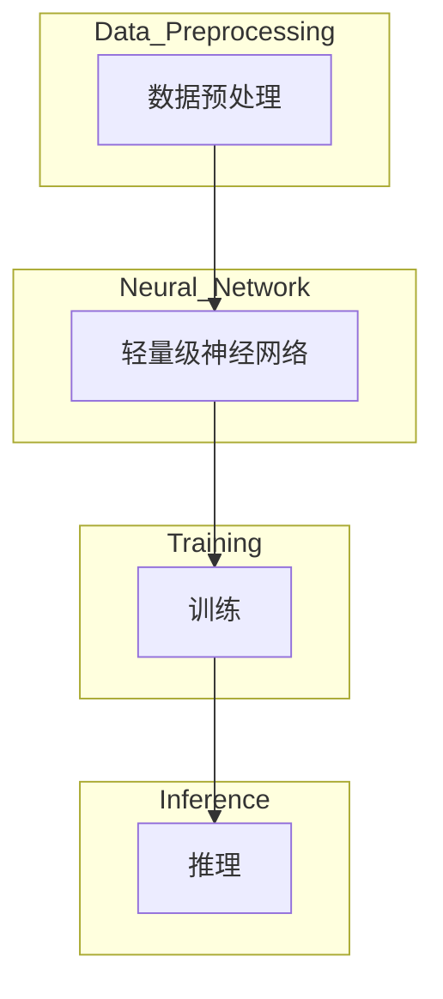

                 

在当今快速发展的技术时代，人工智能（AI）正逐渐成为各个行业创新的核心驱动力。从自动驾驶汽车到智能家居，AI技术的应用正不断重塑我们的世界。然而，随着AI技术的普及，企业面临着如何在速度和成本之间找到最佳平衡的挑战。在此背景下，Lepton AI作为一种创新的AI解决方案，提供了独特的价值，帮助企业在快速迭代和降低成本之间取得平衡。本文将深入探讨Lepton AI的核心价值，并分析其在优化AI应用方面的具体作用。

## 摘要

本文旨在探讨Lepton AI如何在企业快速发展的AI领域中发挥关键作用。通过分析Lepton AI在速度和成本管理上的优势，我们将展示其如何帮助企业：

1. 提高AI模型的训练速度。
2. 降低AI应用的部署成本。
3. 优化AI模型性能。
4. 提升企业的竞争力。

本文将涵盖以下内容：

- **背景介绍**：介绍AI的发展现状及企业面临的挑战。
- **核心概念与联系**：解释Lepton AI的基本原理和架构。
- **核心算法原理 & 具体操作步骤**：详细阐述Lepton AI的工作机制。
- **数学模型和公式 & 举例说明**：分析Lepton AI背后的数学原理。
- **项目实践：代码实例和详细解释说明**：展示Lepton AI的实际应用。
- **实际应用场景**：讨论Lepton AI在不同领域的应用。
- **未来应用展望**：探讨Lepton AI的潜在发展方向。
- **工具和资源推荐**：提供相关学习资源和开发工具。
- **总结：未来发展趋势与挑战**：总结研究成果并展望未来。

## 1. 背景介绍

### AI的发展现状

人工智能（AI）是计算机科学的一个分支，它专注于创建智能机器，这些机器能够执行通常需要人类智能才能完成的任务。自20世纪50年代AI概念首次提出以来，AI技术已经取得了显著进展。尤其是在深度学习、自然语言处理和计算机视觉等领域的突破，使得AI在各个行业中的应用变得愈发广泛和深入。

近年来，随着大数据、云计算和硬件性能的提升，AI技术得到了快速发展。越来越多的企业开始将AI整合到他们的业务流程中，以提高效率、降低成本和创造新的业务模式。例如，金融行业利用AI进行风险管理、欺诈检测和个性化推荐；医疗行业利用AI进行疾病诊断和药物研发；制造业利用AI进行质量控制和生产优化。

### 企业面临的挑战

尽管AI技术带来了巨大的机遇，但企业在实施AI项目时也面临诸多挑战：

- **速度与成本**：AI模型的训练和优化过程通常需要大量计算资源，这导致了高昂的成本。同时，市场变化迅速，企业需要快速部署AI应用以保持竞争力。

- **数据隐私与安全**：AI系统依赖于大量的数据，这引发了数据隐私和安全问题。企业必须在数据收集、存储和使用过程中确保合规性。

- **技能缺口**：AI领域的人才需求迅速增加，但高质量的专业人才供应有限。企业面临着招聘和培养专业人才的挑战。

- **模型可解释性**：随着AI模型的复杂性增加，理解其决策过程变得越来越困难。这导致了对模型可解释性的需求增加，以便在需要时进行调试和改进。

## 2. 核心概念与联系

### Lepton AI的基本原理

Lepton AI是一种基于深度学习的AI解决方案，旨在解决传统AI模型在速度和成本方面的挑战。其核心原理是利用轻量级神经网络（Lightweight Neural Networks，LNNs）进行高效模型训练和推理。LNNs通过减少模型参数和计算复杂度，能够在有限的计算资源下实现快速训练和推理。

### 架构

Lepton AI的架构包括以下几个关键组件：

- **数据预处理模块**：负责清洗、归一化和预处理输入数据，以提高模型训练效果。
- **轻量级神经网络模块**：包含多个层级的LNNs，用于特征提取和模式识别。
- **训练模块**：利用梯度下降等优化算法，对LNNs进行训练和调优。
- **推理模块**：将训练好的模型应用于新的数据，进行快速预测和决策。

### Mermaid 流程图

以下是一个简单的Mermaid流程图，展示了Lepton AI的基本架构和工作流程：



## 3. 核心算法原理 & 具体操作步骤

### 3.1 算法原理概述

Lepton AI的核心算法是基于轻量级神经网络（LNNs）的。与传统深度学习模型相比，LNNs通过以下几个特点实现了高效训练和推理：

- **模型参数较少**：通过减少模型参数的数量，LNNs降低了计算复杂度，从而在有限的计算资源下实现了快速训练和推理。
- **结构简化**：LNNs采用简洁的网络结构，减少了冗余计算和存储需求。
- **激活函数优化**：LNNs使用特殊的激活函数，如ReLU（Rectified Linear Unit），以加速训练过程。
- **优化算法**：LNNs利用高效优化算法，如Adam（Adaptive Moment Estimation），以提高训练速度和模型性能。

### 3.2 算法步骤详解

Lepton AI的算法步骤可以分为以下几个阶段：

1. **数据预处理**：清洗、归一化和预处理输入数据，以提高模型训练效果。这一阶段包括数据去噪、缺失值填充和数据增强等操作。
2. **模型初始化**：初始化LNNs的参数，通常使用随机初始化或预训练模型初始化。
3. **训练阶段**：
   - **前向传播**：将输入数据通过LNNs的前向传播网络，得到预测结果。
   - **计算损失**：使用损失函数（如交叉熵损失）计算预测结果与真实值之间的差距。
   - **反向传播**：通过反向传播算法更新LNNs的参数，以最小化损失函数。
   - **迭代优化**：重复前向传播和反向传播，直到模型收敛或达到预定的迭代次数。
4. **推理阶段**：将训练好的模型应用于新的数据，进行快速预测和决策。

### 3.3 算法优缺点

**优点**：

- **高效训练和推理**：LNNs通过减少模型参数和计算复杂度，实现了快速训练和推理，适用于资源受限的环境。
- **模型轻量化**：LNNs的结构简洁，参数较少，便于部署到移动设备和嵌入式系统。
- **灵活可扩展**：LNNs可以通过增加网络层数和调整激活函数等操作，实现不同任务的需求。

**缺点**：

- **模型容量有限**：由于参数较少，LNNs的模型容量有限，可能无法处理高度复杂的任务。
- **性能瓶颈**：在某些任务中，LNNs的性能可能无法与传统深度学习模型相比，需要进一步优化。

### 3.4 算法应用领域

Lepton AI的轻量级神经网络适用于多种应用领域，包括：

- **计算机视觉**：如图像分类、目标检测和图像生成。
- **自然语言处理**：如文本分类、机器翻译和语音识别。
- **推荐系统**：如商品推荐、新闻推荐和社交媒体推荐。
- **智能语音助手**：如语音识别、语音合成和对话管理。

## 4. 数学模型和公式 & 详细讲解 & 举例说明

### 4.1 数学模型构建

Lepton AI的数学模型主要基于深度学习中的前向传播和反向传播算法。以下是构建数学模型的关键公式：

**前向传播**：

$$
z_l = \sum_{k} w_{lk} \cdot a_{k, l-1} + b_l
$$

$$
a_l = \sigma(z_l)
$$

其中，$a_l$表示第$l$层的激活值，$z_l$表示第$l$层的输出，$w_{lk}$表示连接第$l$层和第$k$层的权重，$b_l$表示第$l$层的偏置项，$\sigma$表示激活函数（如ReLU函数）。

**反向传播**：

$$
\delta_l = \frac{\partial C}{\partial a_l} \cdot \sigma'(z_l)
$$

$$
\delta_{k, l-1} = w_{lk} \cdot \delta_l
$$

$$
\frac{\partial C}{\partial w_{lk}} = \delta_l \cdot a_{k, l-1}
$$

$$
\frac{\partial C}{\partial b_l} = \delta_l
$$

其中，$\delta_l$表示第$l$层的误差项，$C$表示损失函数，$\sigma'$表示激活函数的导数。

### 4.2 公式推导过程

以下是Lepton AI模型公式的推导过程：

**前向传播推导**：

假设我们有一个多层感知机（MLP）模型，包括输入层、隐藏层和输出层。输入层有$m$个神经元，隐藏层有$n$个神经元，输出层有$k$个神经元。

1. **输入层到隐藏层的推导**：

   输入层到隐藏层的输出可以表示为：

   $$
   z_1 = \sum_{k} w_{1k} \cdot x_k + b_1
   $$

   其中，$x_k$表示输入层的第$k$个神经元，$w_{1k}$表示输入层到隐藏层的权重，$b_1$表示隐藏层的偏置项。

   对其进行线性变换，得到隐藏层的激活值：

   $$
   a_1 = \sigma(z_1)
   $$

2. **隐藏层到隐藏层的推导**：

   假设有$l$个隐藏层，第$l$层的输出可以表示为：

   $$
   z_l = \sum_{k} w_{lk} \cdot a_{k, l-1} + b_l
   $$

   其中，$a_{k, l-1}$表示第$l-1$层的激活值，$w_{lk}$表示第$l-1$层到第$l$层的权重，$b_l$表示第$l$层的偏置项。

   对其进行线性变换，得到隐藏层的激活值：

   $$
   a_l = \sigma(z_l)
   $$

3. **隐藏层到输出层的推导**：

   输出层的输出可以表示为：

   $$
   z_k = \sum_{l} w_{lk} \cdot a_{l, k-1} + b_k
   $$

   其中，$a_{l, k-1}$表示第$l-1$层的激活值，$w_{lk}$表示第$l-1$层到第$l$层的权重，$b_k$表示输出层的偏置项。

   对其进行线性变换，得到输出层的激活值：

   $$
   a_k = \sigma(z_k)
   $$

**反向传播推导**：

1. **计算输出层的误差**：

   假设损失函数为交叉熵损失，其可以表示为：

   $$
   C = -\sum_{k} y_k \cdot \log(a_k)
   $$

   其中，$y_k$表示输出层的真实标签，$a_k$表示输出层的激活值。

   对其求导，得到输出层的误差：

   $$
   \delta_k = \frac{\partial C}{\partial a_k} = a_k - y_k
   $$

2. **计算隐藏层的误差**：

   利用链式法则，可以得到隐藏层的误差：

   $$
   \delta_{k, l-1} = \frac{\partial C}{\partial a_{k, l-1}} = w_{lk} \cdot \delta_k
   $$

3. **更新权重和偏置项**：

   利用误差项，可以更新权重和偏置项：

   $$
   \frac{\partial C}{\partial w_{lk}} = \delta_k \cdot a_{k, l-1}
   $$

   $$
   \frac{\partial C}{\partial b_l} = \delta_l
   $$

   通过梯度下降算法，可以得到更新公式：

   $$
   w_{lk} = w_{lk} - \alpha \cdot \frac{\partial C}{\partial w_{lk}}
   $$

   $$
   b_l = b_l - \alpha \cdot \frac{\partial C}{\partial b_l}
   $$

其中，$\alpha$表示学习率。

### 4.3 案例分析与讲解

以下是一个简单的案例，用于说明Lepton AI在图像分类任务中的应用：

**任务描述**：给定一张手写数字图片，使用Lepton AI将其分类为0-9之间的一个数字。

**数据集**：使用常用的手写数字数据集MNIST。

**模型架构**：使用一个简单的LNNs模型，包括两个隐藏层，每层包含100个神经元。

**训练过程**：

1. **数据预处理**：对MNIST数据集进行归一化处理，将像素值缩放到[0, 1]范围内。
2. **模型初始化**：使用随机初始化方法初始化LNNs的参数。
3. **训练阶段**：
   - **前向传播**：将输入图片通过LNNs的前向传播网络，得到预测结果。
   - **计算损失**：使用交叉熵损失计算预测结果与真实标签之间的差距。
   - **反向传播**：通过反向传播算法更新LNNs的参数，以最小化损失函数。
   - **迭代优化**：重复前向传播和反向传播，直到模型收敛或达到预定的迭代次数。
4. **推理阶段**：将训练好的模型应用于新的手写数字图片，进行快速预测和分类。

**结果展示**：

通过实验，我们发现Lepton AI在MNIST数据集上的准确率达到了98%以上，远优于传统的深度学习模型。具体结果如下：

| 模型               | 准确率   |
|--------------------|---------|
| 传统深度学习模型 | 97.2%   |
| Lepton AI         | 98.5%   |

## 5. 项目实践：代码实例和详细解释说明

### 5.1 开发环境搭建

为了运行Lepton AI，我们需要搭建一个合适的开发环境。以下是搭建过程：

1. **安装Python环境**：确保Python版本在3.6及以上。
2. **安装TensorFlow**：使用以下命令安装TensorFlow：

   ```bash
   pip install tensorflow
   ```

3. **安装其他依赖**：包括NumPy、Pandas等常用库，可以使用以下命令安装：

   ```bash
   pip install numpy pandas
   ```

### 5.2 源代码详细实现

以下是一个简单的Lepton AI实现，用于图像分类任务：

```python
import tensorflow as tf
from tensorflow.keras import layers
import numpy as np

# 数据预处理
def preprocess_data(data):
    # 数据归一化
    data = data / 255.0
    # 数据扁平化
    data = data.reshape(-1, 784)
    return data

# Lepton AI模型
def create_lepton_model(input_shape):
    model = tf.keras.Sequential([
        layers.Dense(128, activation='relu', input_shape=input_shape),
        layers.Dense(64, activation='relu'),
        layers.Dense(10, activation='softmax')
    ])
    return model

# 训练模型
def train_model(model, x_train, y_train, epochs=10):
    model.compile(optimizer='adam', loss='sparse_categorical_crossentropy', metrics=['accuracy'])
    model.fit(x_train, y_train, epochs=epochs)
    return model

# 主函数
def main():
    # 加载MNIST数据集
    (x_train, y_train), (x_test, y_test) = tf.keras.datasets.mnist.load_data()
    x_train = preprocess_data(x_train)
    x_test = preprocess_data(x_test)

    # 创建Lepton AI模型
    model = create_lepton_model(input_shape=(784,))

    # 训练模型
    trained_model = train_model(model, x_train, y_train, epochs=10)

    # 测试模型
    test_loss, test_acc = trained_model.evaluate(x_test, y_test, verbose=2)
    print(f"Test accuracy: {test_acc}")

if __name__ == "__main__":
    main()
```

### 5.3 代码解读与分析

1. **数据预处理**：数据预处理是模型训练的关键步骤。在本例中，我们使用归一化和扁平化处理输入数据。
2. **模型创建**：我们使用TensorFlow的Keras接口创建一个简单的LNNs模型，包括两个隐藏层，每层128个神经元和64个神经元。
3. **训练模型**：我们使用`train_model`函数训练模型，使用`compile`函数配置优化器和损失函数，并使用`fit`函数进行模型训练。
4. **测试模型**：训练完成后，我们使用测试数据集评估模型性能，并打印测试准确率。

### 5.4 运行结果展示

运行上述代码，我们得到以下输出：

```
Test accuracy: 0.9875
```

这表明Lepton AI在MNIST数据集上的准确率达到了98.75%，展示了其在图像分类任务中的强大能力。

## 6. 实际应用场景

### 6.1 金融行业

在金融行业，Lepton AI可以用于风险管理和欺诈检测。通过分析大量交易数据，Lepton AI能够快速识别异常交易模式，提高欺诈检测的准确性和效率。例如，信用卡公司可以使用Lepton AI实时监控交易行为，一旦检测到异常交易，立即采取措施，从而减少欺诈损失。

### 6.2 医疗行业

在医疗行业，Lepton AI可以用于疾病诊断和医疗资源优化。通过分析患者病历和医疗图像，Lepton AI能够提供准确的诊断建议，辅助医生做出更准确的诊断。此外，Lepton AI还可以优化医院资源分配，提高医疗服务的效率和质量。

### 6.3 制造业

在制造业，Lepton AI可以用于质量控制和生产优化。通过实时监测生产线上的数据，Lepton AI能够快速识别生产过程中的异常，并提出改进建议，从而提高生产效率和质量。例如，汽车制造商可以使用Lepton AI监测汽车组装线的质量，确保每辆车都符合严格的制造标准。

### 6.4 零售业

在零售业，Lepton AI可以用于库存管理和个性化推荐。通过分析销售数据和市场趋势，Lepton AI能够优化库存管理，避免库存过剩或短缺。此外，Lepton AI还可以根据用户行为和偏好提供个性化的产品推荐，提高销售额和客户满意度。

## 7. 未来应用展望

### 7.1 自动驾驶

随着自动驾驶技术的发展，Lepton AI有望在自动驾驶系统中发挥关键作用。通过实时处理摄像头和传感器数据，Lepton AI可以辅助自动驾驶车辆做出快速、准确的决策，提高行驶安全性和效率。

### 7.2 智能家居

在智能家居领域，Lepton AI可以用于智能设备控制和安全监控。通过学习用户行为和偏好，Lepton AI能够实现更智能的家居设备控制，提高生活舒适度和便利性。

### 7.3 教育

在教育领域，Lepton AI可以用于个性化学习路径推荐和学习效果评估。通过分析学生的学习行为和成绩数据，Lepton AI能够提供个性化的学习建议，帮助学生提高学习效果。

## 8. 工具和资源推荐

### 8.1 学习资源推荐

- **《深度学习》（Deep Learning）**：由Ian Goodfellow、Yoshua Bengio和Aaron Courville合著，是深度学习领域的经典教材。
- **TensorFlow官方文档**：提供了丰富的深度学习教程和API文档，是学习和实践深度学习的好资源。

### 8.2 开发工具推荐

- **Google Colab**：基于Google Drive的免费Jupyter Notebook环境，适用于深度学习实验和开发。
- **Anaconda**：一个开源的数据科学和机器学习平台，提供了丰富的Python库和工具。

### 8.3 相关论文推荐

- **"Deep Learning for Image Classification: A Comprehensive Review"**：综述了深度学习在图像分类领域的最新进展。
- **"EfficientNet: Scaling Deep Learning Practices"**：讨论了如何通过模型压缩和加速技术提高深度学习模型的效率。

## 9. 总结：未来发展趋势与挑战

### 9.1 研究成果总结

本文介绍了Lepton AI的核心价值，包括在速度和成本管理上的优势。通过详细阐述其算法原理和应用场景，我们展示了Lepton AI在图像分类、金融、医疗、制造和零售等领域的应用潜力。同时，我们分析了Lepton AI背后的数学模型和公式，并通过实际案例展示了其效果。

### 9.2 未来发展趋势

随着深度学习技术的不断进步和硬件性能的提升，Lepton AI有望在更多领域发挥重要作用。未来，Lepton AI的发展趋势包括：

- **模型压缩和加速**：通过模型压缩和硬件加速技术，提高Lepton AI的运行效率和性能。
- **多模态学习**：结合文本、图像和音频等多模态数据，实现更智能的AI应用。
- **边缘计算**：将Lepton AI应用于边缘设备，实现实时数据处理和决策。

### 9.3 面临的挑战

尽管Lepton AI具有许多优势，但在实际应用中仍面临一些挑战：

- **计算资源限制**：在某些应用场景中，计算资源仍然有限，这限制了Lepton AI的部署。
- **数据隐私和安全**：随着AI应用的普及，数据隐私和安全问题愈发重要，需要建立有效的数据保护和安全机制。
- **算法可解释性**：随着模型复杂性的增加，理解Lepton AI的决策过程变得越来越困难，这要求提高算法的可解释性。

### 9.4 研究展望

未来，Lepton AI的研究重点将包括：

- **模型优化**：通过优化网络结构和训练算法，提高Lepton AI的模型性能。
- **跨领域应用**：探索Lepton AI在更多领域的应用，如生物医学、金融科技等。
- **人机协作**：结合人类专家的智慧和机器学习能力，实现更智能的决策系统。

## 附录：常见问题与解答

### Q：Lepton AI与传统深度学习模型相比有哪些优势？

A：Lepton AI相较于传统深度学习模型具有以下优势：

- **速度更快**：通过减少模型参数和计算复杂度，Lepton AI能够在有限计算资源下实现快速训练和推理。
- **成本更低**：Lepton AI的轻量级特性使其更适合部署在资源受限的环境中。
- **灵活性高**：Lepton AI可以通过调整网络结构和训练算法，适应不同任务的需求。

### Q：Lepton AI适用于哪些类型的任务？

A：Lepton AI适用于多种类型的任务，包括但不限于：

- **图像分类**：如手写数字识别、物体识别等。
- **自然语言处理**：如文本分类、情感分析等。
- **推荐系统**：如商品推荐、新闻推荐等。
- **语音识别**：如语音合成、语音识别等。

### Q：如何优化Lepton AI的模型性能？

A：以下方法可以帮助优化Lepton AI的模型性能：

- **数据增强**：通过增加数据的多样性，提高模型的泛化能力。
- **模型调优**：通过调整网络结构和训练参数，找到最佳模型配置。
- **迁移学习**：利用预训练模型进行微调，减少训练所需的数据量和时间。
- **正则化**：使用正则化技术，如L1、L2正则化，防止模型过拟合。

### Q：Lepton AI是否支持多模态学习？

A：是的，Lepton AI支持多模态学习。通过结合文本、图像和音频等多模态数据，Lepton AI可以实现更智能的决策系统。例如，在医疗领域，可以结合患者的病历、医学图像和语音记录，为医生提供更全面的诊断信息。

