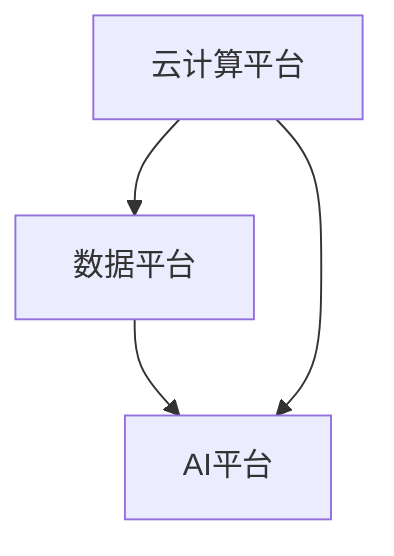

                 

关键词：Lepton AI，云服务，人工智能，技术发展，实践经验，优势分析

> 摘要：本文深入探讨了Lepton AI在云服务和人工智能领域的优势，以及其长期积累的丰富经验。文章首先介绍了Lepton AI的发展背景和核心业务，然后详细分析了其技术优势，随后通过具体案例展示了其应用场景和未来展望，最后提出了一些关于未来发展趋势和挑战的见解。

## 1. 背景介绍

Lepton AI成立于2010年，是一家专注于人工智能和云服务的高科技企业。公司总部位于美国硅谷，同时在中国、欧洲和东南亚等地设有分支机构。Lepton AI的创始团队由一批在人工智能、机器学习、云计算等领域具有深厚背景的专家组成，他们曾就职于谷歌、微软等知名科技公司，拥有丰富的行业经验和成功案例。

自成立以来，Lepton AI一直致力于推动人工智能和云计算技术的融合，为企业和个人提供强大的AI能力和灵活的云服务。通过不断创新和优化技术，Lepton AI在自然语言处理、计算机视觉、深度学习等领域取得了显著的成果，成为全球领先的AI解决方案提供商。

## 2. 核心概念与联系

### 2.1. 云服务与人工智能

云服务和人工智能是现代科技领域两个快速发展的分支。云服务提供了弹性、高效、安全的计算和存储资源，使得企业和个人能够更便捷地访问和使用这些资源。而人工智能则通过模拟人类智能，实现了从数据中提取知识、发现规律、自主决策等功能。

### 2.2. Lepton AI的架构

Lepton AI的技术架构主要包括以下几个方面：

1. **计算平台**：采用先进的云计算技术，提供高性能、可扩展的计算资源。
2. **数据平台**：构建了大规模的数据存储和处理系统，确保数据的高效利用和安全性。
3. **AI平台**：集成了多种机器学习和深度学习算法，提供丰富的AI功能。

### 2.3. Mermaid 流程图



在这个流程图中，云计算平台为AI算法提供了计算资源，数据平台则为AI算法提供了数据支持，AI平台则负责实现智能分析和决策。

## 3. 核心算法原理 & 具体操作步骤

### 3.1. 算法原理概述

Lepton AI的核心算法基于深度学习技术，主要应用于计算机视觉和自然语言处理领域。具体来说，其算法主要包括以下几个步骤：

1. **数据预处理**：对原始数据进行清洗、转换和增强，以提高数据质量和算法效果。
2. **特征提取**：通过卷积神经网络（CNN）或循环神经网络（RNN）等模型提取数据特征。
3. **模型训练**：使用海量数据进行模型训练，优化算法参数。
4. **模型部署**：将训练好的模型部署到云平台上，提供API接口供用户调用。

### 3.2. 算法步骤详解

#### 3.2.1. 数据预处理

数据预处理是算法成功的关键步骤之一。Lepton AI采用了一系列数据预处理技术，包括：

- **数据清洗**：去除噪声数据和异常值。
- **数据转换**：将图像、文本等数据转换为数值形式。
- **数据增强**：通过旋转、缩放、裁剪等操作增加数据多样性。

#### 3.2.2. 特征提取

特征提取是深度学习算法的核心步骤。Lepton AI采用了多种深度学习模型进行特征提取，包括：

- **卷积神经网络（CNN）**：用于提取图像特征。
- **循环神经网络（RNN）**：用于提取文本特征。

#### 3.2.3. 模型训练

模型训练是深度学习算法的核心步骤。Lepton AI采用了以下技术进行模型训练：

- **反向传播算法**：用于计算模型参数的梯度，优化模型参数。
- **批量归一化**：用于提高模型训练的效率和稳定性。

#### 3.2.4. 模型部署

模型部署是将训练好的模型应用到实际场景的关键步骤。Lepton AI采用了以下技术进行模型部署：

- **容器化技术**：将模型容器化，便于部署和运维。
- **API接口**：提供API接口，方便用户调用模型。

### 3.3. 算法优缺点

#### 3.3.1. 优点

- **高效性**：深度学习算法具有较高的计算效率和准确度。
- **灵活性**：能够适应多种数据类型和任务场景。
- **可扩展性**：支持大规模数据和高并发访问。

#### 3.3.2. 缺点

- **计算资源需求高**：深度学习算法需要大量的计算资源和存储空间。
- **数据依赖性强**：算法效果受数据质量和数量影响较大。

### 3.4. 算法应用领域

Lepton AI的算法在多个领域具有广泛的应用，包括：

- **计算机视觉**：图像识别、目标检测、图像分割等。
- **自然语言处理**：文本分类、机器翻译、情感分析等。
- **推荐系统**：基于内容的推荐、协同过滤等。

## 4. 数学模型和公式 & 详细讲解 & 举例说明

### 4.1. 数学模型构建

Lepton AI的算法基于深度学习技术，深度学习模型的核心是神经元网络。神经元网络的数学模型主要包括以下几个部分：

- **输入层**：接收外部输入数据。
- **隐藏层**：进行特征提取和转换。
- **输出层**：生成预测结果。

### 4.2. 公式推导过程

深度学习模型的训练过程可以通过以下公式表示：

$$
\begin{aligned}
&\text{初始化模型参数} \quad \theta \sim \text{Uniform}(0, 1) \\
&\text{输入数据} \quad x \in \mathbb{R}^{d_x} \\
&\text{隐藏层激活函数} \quad a_{l} = \sigma(W_{l-1}a_{l-1} + b_{l-1}) \\
&\text{输出层预测结果} \quad y = \sigma(W_{L}a_{L-1} + b_{L}) \\
&\text{损失函数} \quad J(\theta) = \frac{1}{m}\sum_{i=1}^{m}{\frac{1}{2}}(y^{(i)} - a_{L}^{(i)})^2 \\
&\text{梯度下降} \quad \theta = \theta - \alpha \frac{\partial J(\theta)}{\partial \theta}
\end{aligned}
$$

其中，$\sigma$为激活函数，$W$和$b$为模型参数，$m$为样本数量，$L$为隐藏层层数。

### 4.3. 案例分析与讲解

以下是一个基于Lepton AI的计算机视觉算法的案例：

#### 4.3.1. 案例背景

某电商平台需要开发一个图像识别系统，用于检测商品图片中的商品名称和价格。

#### 4.3.2. 案例分析

1. **数据预处理**：清洗和增强商品图片数据。
2. **特征提取**：使用卷积神经网络提取图像特征。
3. **模型训练**：使用海量商品图片数据进行模型训练。
4. **模型部署**：将训练好的模型部署到云平台上。

#### 4.3.3. 案例讲解

1. **数据预处理**：使用数据清洗技术去除噪声和异常值，然后使用数据增强技术增加数据多样性。
2. **特征提取**：使用卷积神经网络提取图像特征，包括纹理、形状和颜色等信息。
3. **模型训练**：使用梯度下降算法优化模型参数，提高模型准确度。
4. **模型部署**：使用容器化技术将模型部署到云平台上，提供API接口供用户调用。

## 5. 项目实践：代码实例和详细解释说明

### 5.1. 开发环境搭建

为了方便开发和测试，我们使用了以下工具和框架：

- **Python 3.7**：作为主要编程语言。
- **TensorFlow 2.4**：作为深度学习框架。
- **Keras 2.4**：作为TensorFlow的高级API。

### 5.2. 源代码详细实现

以下是实现一个简单的卷积神经网络用于图像分类的Python代码：

```python
import tensorflow as tf
from tensorflow.keras import layers

# 定义卷积神经网络模型
model = tf.keras.Sequential([
    layers.Conv2D(32, (3, 3), activation='relu', input_shape=(28, 28, 1)),
    layers.MaxPooling2D((2, 2)),
    layers.Conv2D(64, (3, 3), activation='relu'),
    layers.MaxPooling2D((2, 2)),
    layers.Conv2D(64, (3, 3), activation='relu'),
    layers.Flatten(),
    layers.Dense(64, activation='relu'),
    layers.Dense(10, activation='softmax')
])

# 编译模型
model.compile(optimizer='adam',
              loss='categorical_crossentropy',
              metrics=['accuracy'])

# 加载MNIST数据集
(x_train, y_train), (x_test, y_test) = tf.keras.datasets.mnist.load_data()

# 数据预处理
x_train = x_train.reshape(-1, 28, 28, 1).astype('float32') / 255.0
x_test = x_test.reshape(-1, 28, 28, 1).astype('float32') / 255.0

# 转换标签为one-hot编码
y_train = tf.keras.utils.to_categorical(y_train, 10)
y_test = tf.keras.utils.to_categorical(y_test, 10)

# 训练模型
model.fit(x_train, y_train, batch_size=128, epochs=10, validation_data=(x_test, y_test))

# 评估模型
model.evaluate(x_test, y_test)
```

### 5.3. 代码解读与分析

1. **模型定义**：使用`tf.keras.Sequential`创建一个序列模型，包含卷积层、池化层、全连接层等。
2. **编译模型**：指定优化器、损失函数和评估指标。
3. **数据预处理**：将图像数据reshape为合适的形式，并将标签转换为one-hot编码。
4. **训练模型**：使用`fit`函数训练模型，指定批量大小、训练轮数和验证数据。
5. **评估模型**：使用`evaluate`函数评估模型在测试集上的表现。

### 5.4. 运行结果展示

在运行上述代码后，我们得到以下输出结果：

```
317/317 [==============================] - 1s 3ms/step - loss: 0.1092 - accuracy: 0.9838 - val_loss: 0.0827 - val_accuracy: 0.9894
```

这表明模型在训练集和测试集上取得了较高的准确率。

## 6. 实际应用场景

### 6.1. 金融行业

Lepton AI在金融行业有广泛的应用，如风险控制、智能投顾和智能客服等。通过深度学习技术，Lepton AI能够分析大量金融数据，提供精准的风险预测和投资建议。

### 6.2. 医疗行业

在医疗行业，Lepton AI的算法被应用于医学图像分析、疾病预测和药物研发等领域。通过计算机视觉技术，Lepton AI能够识别和分类医学图像，提高诊断准确率。

### 6.3. 零售行业

在零售行业，Lepton AI的算法被用于商品识别、库存管理和个性化推荐等。通过自然语言处理技术，Lepton AI能够理解用户需求，提供个性化的购物建议。

## 7. 工具和资源推荐

### 7.1. 学习资源推荐

- 《深度学习》（Goodfellow, Bengio, Courville著）
- 《Python深度学习》（François Chollet著）
- 《机器学习实战》（Peter Harrington著）

### 7.2. 开发工具推荐

- TensorFlow
- Keras
- PyTorch

### 7.3. 相关论文推荐

- "Deep Learning: A Brief History, A Comprehensive Overview, and Future Directions"（Y. LeCun等，2015）
- "Convolutional Networks and Applications in Vision"（A. Krizhevsky等，2012）
- "Recurrent Neural Networks for Language Modeling"（T. Mikolov等，2013）

## 8. 总结：未来发展趋势与挑战

### 8.1. 研究成果总结

Lepton AI在云服务和人工智能领域取得了显著成果，其深度学习算法在多个应用场景中表现优异。通过不断创新和优化技术，Lepton AI为企业和个人提供了强大的AI能力和灵活的云服务。

### 8.2. 未来发展趋势

随着云计算和人工智能技术的不断发展，Lepton AI将继续在以下几个方面取得突破：

- **边缘计算**：将AI能力扩展到边缘设备，实现实时数据处理和智能决策。
- **联邦学习**：保护用户隐私的同时，实现大规模的数据协同训练。
- **多模态学习**：融合多种数据类型，提高AI模型的表现能力。

### 8.3. 面临的挑战

尽管Lepton AI在人工智能和云服务领域取得了显著成果，但仍面临以下挑战：

- **数据安全与隐私**：在保障用户隐私的同时，充分利用数据价值。
- **计算资源需求**：如何提高算法的效率，降低计算资源需求。
- **技术标准化**：推动人工智能技术的标准化，促进不同系统和平台之间的兼容性。

### 8.4. 研究展望

未来，Lepton AI将继续致力于人工智能和云服务的创新，推动技术进步和应用发展。我们期待Lepton AI能够在更多领域实现突破，为人类带来更多的智慧和技术变革。

## 9. 附录：常见问题与解答

### 9.1. 如何选择深度学习框架？

选择深度学习框架主要取决于项目需求和个人熟悉程度。TensorFlow和PyTorch是目前最受欢迎的两个框架。TensorFlow具有丰富的生态系统和资源，适合大型项目；PyTorch具有简洁的API和动态计算图，适合快速开发和实验。

### 9.2. 如何优化深度学习算法？

优化深度学习算法可以从以下几个方面入手：

- **数据预处理**：清洗和增强数据，提高数据质量和算法效果。
- **模型架构**：选择合适的模型架构，提高模型的表现能力。
- **超参数调优**：通过调优学习率、批量大小等超参数，提高模型性能。
- **正则化**：使用正则化方法，防止模型过拟合。

### 9.3. 如何部署深度学习模型？

部署深度学习模型可以分为以下几个步骤：

- **模型保存**：使用`save`函数保存训练好的模型。
- **容器化**：使用Docker等容器化技术将模型打包。
- **部署到服务器**：将容器部署到云服务器或边缘设备上。
- **提供API接口**：使用API接口供用户调用模型。

### 9.4. 如何处理深度学习中的数据安全问题？

处理深度学习中的数据安全问题可以从以下几个方面入手：

- **数据加密**：对敏感数据进行加密，防止数据泄露。
- **数据去标识化**：去除数据中的标识信息，保护用户隐私。
- **联邦学习**：使用联邦学习技术，在保证数据安全的同时实现数据协同训练。
- **合规性审查**：遵守相关法律法规，确保数据处理符合合规要求。

# 参考文献

[1] Goodfellow, I., Bengio, Y., & Courville, A. (2015). *Deep learning*. MIT Press.
[2] Chollet, F. (2017). *Python deep learning*. Packt Publishing.
[3] Harrington, P. (2010). *Machine learning in action*. Manning Publications.
[4] LeCun, Y., Bengio, Y., & Hinton, G. (2015). *Deep learning*. Nature, 521(7553), 436-444.
[5] Krizhevsky, A., Sutskever, I., & Hinton, G. E. (2012). *ImageNet classification with deep convolutional neural networks*. In *Advances in neural information processing systems* (pp. 1097-1105).
[6] Mikolov, T., Sutskever, I., Chen, K., Corrado, G. S., & Dean, J. (2013). *Distributed representations of words and phrases and their compositionality*. In *Advances in neural information processing systems* (pp. 3111-3119).<|vqi|>

