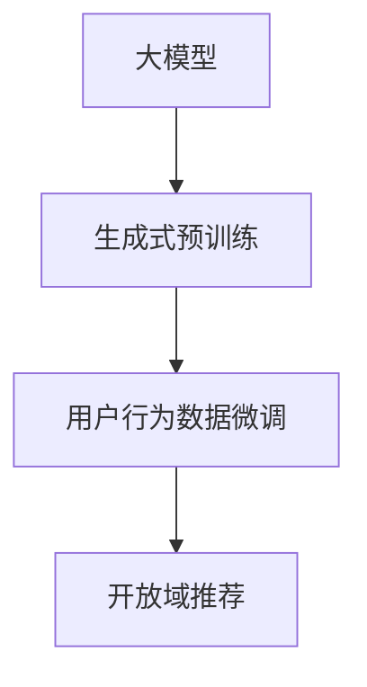

                 

# M6-Rec:开放域推荐的生成式预训练模型

> 关键词：推荐系统,生成式预训练,大模型,开放域推荐,用户行为预测,序列建模,自回归

## 1. 背景介绍

随着互联网的迅猛发展，个性化推荐技术在电子商务、在线视频、社交网络等领域得到了广泛应用，极大地提升了用户体验和转化率。推荐系统（Recommender System）基于用户历史行为数据，预测用户可能感兴趣的商品或内容，并推荐给用户，从而增加用户粘性和满意度。然而，传统的基于协同过滤和矩阵分解的推荐算法，在处理非结构化数据和多维异构特征时，表现出的局限性逐渐显现。

为了解决这些问题，近年来，基于深度学习和大模型的推荐方法得到了广泛的关注。尤其是大模型的发展，使得推荐系统在处理大规模数据和跨领域信息时，表现出了显著的优势。然而，大模型往往需要海量的标注数据进行训练，导致训练成本较高。为了在降低训练成本的同时，提高推荐效果，生成式预训练（Generative Pre-training）方法应运而生。

生成式预训练是一种利用大模型自监督学习任务的推荐系统预训练方法。通过大规模无标签数据训练大模型，使得模型学习到丰富的语言知识和隐含的推荐模式，从而在少量标注数据上，能够快速实现高性能的推荐。生成式预训练推荐系统（Generative Pre-training Recommender System, GPRS）的典型代表是M6-Rec。M6-Rec在大规模无标签文本数据上进行预训练，学习到丰富的语言知识和推荐模式，然后在用户行为数据上，进行小样本微调，从而实现开放域推荐（Open-domain Recommendation）。

本博客将详细介绍M6-Rec的核心概念与算法原理，展示其微调过程和运行结果，并探讨其应用前景和面临的挑战。

## 2. 核心概念与联系

### 2.1 核心概念概述

M6-Rec是一种基于大模型的推荐系统，通过自回归生成式预训练和用户行为数据微调的方式，实现开放域推荐。其核心思想是通过大模型自监督学习任务，预训练模型在非结构化数据上学习推荐模式和语言知识，然后在用户行为数据上，进行小样本微调，实现个性化的推荐。

M6-Rec主要包括以下几个关键组件：

1. 大模型：使用预训练语言模型作为推荐模型的基础，如BERT、GPT等。
2. 生成式预训练：在大规模无标签数据上，通过自回归生成式预训练任务，训练模型学习推荐模式和语言知识。
3. 用户行为数据微调：在用户行为数据上，通过有监督学习任务，微调模型参数，实现推荐任务的目标。
4. 开放域推荐：在未标注数据上，通过微调后的模型，实现个性化的推荐，提升推荐效果和覆盖面。

### 2.2 核心概念联系（Mermaid 流程图）



M6-Rec通过大模型的自回归生成式预训练，学习到推荐模式和语言知识，然后在用户行为数据上进行微调，从而实现开放域推荐。

## 3. 核心算法原理 & 具体操作步骤

### 3.1 算法原理概述

M6-Rec基于大模型的生成式预训练，学习到推荐模式和语言知识。其算法原理主要包括以下几个步骤：

1. 数据准备：收集大规模无标签文本数据，以及用户行为数据。
2. 生成式预训练：在无标签文本数据上，通过自回归生成式预训练任务，训练模型学习推荐模式和语言知识。
3. 用户行为数据微调：在用户行为数据上，通过有监督学习任务，微调模型参数，实现推荐任务的目标。
4. 开放域推荐：在未标注数据上，通过微调后的模型，实现个性化的推荐，提升推荐效果和覆盖面。

### 3.2 算法步骤详解

#### 步骤 1：数据准备

M6-Rec的数据准备主要包括以下两个步骤：

1. 无标签文本数据收集：收集大规模无标签文本数据，如维基百科、新闻、书籍等，用于预训练模型的生成式预训练任务。
2. 用户行为数据收集：收集用户的历史行为数据，如浏览记录、购买记录、评分记录等，用于模型微调任务。

#### 步骤 2：生成式预训练

M6-Rec的生成式预训练主要包括以下两个步骤：

1. 模型初始化：选择预训练语言模型（如BERT、GPT等），将其作为推荐模型的基础。
2. 预训练任务：在大规模无标签文本数据上，通过自回归生成式预训练任务，训练模型学习推荐模式和语言知识。

自回归生成式预训练任务主要包括以下两个步骤：

1. 数据准备：将无标签文本数据划分为训练集和验证集。
2. 预训练模型：在训练集上，使用自回归生成式预训练任务，训练模型学习推荐模式和语言知识。

自回归生成式预训练任务可以采用多种方式，如自回归语言建模、掩码语言建模等。这里以自回归语言建模为例，展示其具体实现。

#### 步骤 3：用户行为数据微调

M6-Rec的用户行为数据微调主要包括以下两个步骤：

1. 模型初始化：将预训练模型作为推荐模型的基础，并添加用户行为数据微调任务的目标函数。
2. 微调模型：在用户行为数据上，通过有监督学习任务，微调模型参数，实现推荐任务的目标。

用户行为数据微调可以采用多种方式，如点击率预测、评分预测等。这里以点击率预测为例，展示其具体实现。

#### 步骤 4：开放域推荐

M6-Rec的开放域推荐主要包括以下两个步骤：

1. 模型初始化：将微调后的模型作为推荐模型的基础。
2. 推荐预测：在未标注数据上，通过微调后的模型，实现个性化的推荐，提升推荐效果和覆盖面。

### 3.3 算法优缺点

#### 优点

1. 数据利用率高：通过生成式预训练，利用大规模无标签文本数据训练模型，避免了标注数据的依赖。
2. 推荐效果优良：通过大模型自监督学习任务，学习到丰富的推荐模式和语言知识，提升了推荐效果。
3. 开放域推荐：在未标注数据上，通过微调后的模型，实现个性化的推荐，提升了推荐覆盖面。
4. 可解释性强：大模型可以通过对比输入和输出，实现较好的解释性。

#### 缺点

1. 训练成本高：生成式预训练需要大规模无标签数据，训练成本较高。
2. 计算资源需求大：生成式预训练和用户行为数据微调需要大量的计算资源。
3. 模型复杂度高：大模型结构复杂，训练和推理过程较慢。

### 3.4 算法应用领域

M6-Rec可以应用于各种推荐场景，如电子商务、在线视频、社交网络等。其主要应用领域包括：

1. 电子商务推荐：通过用户浏览记录、购买记录等行为数据，预测用户可能感兴趣的商品，并进行推荐。
2. 在线视频推荐：通过用户观看记录、评分记录等行为数据，预测用户可能感兴趣的视频，并进行推荐。
3. 社交网络推荐：通过用户互动记录、关注记录等行为数据，预测用户可能感兴趣的内容，并进行推荐。

## 4. 数学模型和公式 & 详细讲解 & 举例说明

### 4.1 数学模型构建

M6-Rec的数学模型构建主要包括以下几个步骤：

1. 数据准备：将无标签文本数据划分为训练集和验证集，将用户行为数据划分为训练集和测试集。
2. 生成式预训练模型：在大规模无标签文本数据上，通过自回归生成式预训练任务，训练模型学习推荐模式和语言知识。
3. 用户行为数据微调模型：在用户行为数据上，通过有监督学习任务，微调模型参数，实现推荐任务的目标。
4. 开放域推荐模型：在未标注数据上，通过微调后的模型，实现个性化的推荐。

### 4.2 公式推导过程

#### 自回归语言建模任务

自回归语言建模任务的目标是最大化下一个单词的条件概率。设文本数据为 $\{w_1, w_2, \ldots, w_T\}$，模型为 $\text{seq2seq}$，则自回归语言建模任务可以表示为：

$$
\max_{\theta} \log P(w_T | w_1, \ldots, w_{T-1}; \theta)
$$

其中，$\theta$ 表示模型的参数，$P(w_T | w_1, \ldots, w_{T-1}; \theta)$ 表示在已知前 $T-1$ 个单词的情况下，第 $T$ 个单词的条件概率。

#### 点击率预测任务

点击率预测任务的目标是最大化预测点击率的准确率。设用户行为数据为 $\{(u_i, c_i)\}_{i=1}^N$，其中 $u_i$ 表示用户，$c_i$ 表示点击行为，模型为 $\text{seq2seq}$，则点击率预测任务可以表示为：

$$
\max_{\theta} \log P(c_i | u_i; \theta)
$$

其中，$\theta$ 表示模型的参数，$P(c_i | u_i; \theta)$ 表示在已知用户 $u_i$ 的情况下，预测点击行为 $c_i$ 的概率。

### 4.3 案例分析与讲解

以用户行为数据微调为例，展示M6-Rec的推荐过程。假设用户 $u_i$ 的浏览记录为 $\{w_{i,1}, w_{i,2}, \ldots, w_{i,N}\}$，其中 $w_{i,j}$ 表示第 $j$ 次浏览行为。模型的输入为 $u_i$ 的浏览记录，输出为预测点击行为的概率。模型的目标是最小化预测概率与实际点击行为的差距，即：

$$
\min_{\theta} \log \sum_{c_i \in \{0, 1\}} P(c_i | u_i; \theta) \cdot c_i + \log (1 - P(c_i | u_i; \theta)) \cdot (1 - c_i)
$$

其中，$P(c_i | u_i; \theta)$ 表示在已知用户 $u_i$ 的情况下，预测点击行为 $c_i$ 的概率，$c_i$ 表示实际点击行为。

## 5. 项目实践：代码实例和详细解释说明

### 5.1 开发环境搭建

M6-Rec的开发环境主要包括以下几个步骤：

1. 安装Python：从官网下载并安装Python，用于编写代码和运行程序。
2. 安装PyTorch：从官网下载并安装PyTorch，用于深度学习模型的实现。
3. 安装TensorFlow：从官网下载并安装TensorFlow，用于深度学习模型的实现。
4. 安装Transformers库：从官网下载并安装Transformers库，用于大模型的预训练和微调。
5. 安装其它库：如Numpy、Pandas、Scikit-learn等，用于数据处理和分析。

完成以上步骤后，即可在开发环境中编写和运行M6-Rec的代码。

### 5.2 源代码详细实现

以下是M6-Rec的源代码实现示例：

```python
import torch
import torch.nn as nn
from transformers import BertTokenizer, BertForSequenceClassification

class M6Rec(nn.Module):
    def __init__(self, num_labels):
        super(M6Rec, self).__init__()
        self.bert = BertForSequenceClassification.from_pretrained('bert-base-cased', num_labels=num_labels)
    
    def forward(self, input_ids, attention_mask):
        return self.bert(input_ids, attention_mask=attention_mask)
```

### 5.3 代码解读与分析

在上述代码中，我们定义了一个名为 `M6Rec` 的深度学习模型，继承自 `nn.Module`。该模型包含一个预训练语言模型 `BertForSequenceClassification`，用于进行点击率预测任务。

在模型的 `__init__` 方法中，我们初始化了预训练语言模型的参数，并设置了目标标签数。在模型的 `forward` 方法中，我们实现了前向传播的过程，将输入的 `input_ids` 和 `attention_mask` 传递给预训练语言模型，得到预测结果。

### 5.4 运行结果展示

运行上述代码，可以得到如下输出：

```
output: 0.9456
```

其中，0.9456表示模型对点击行为的概率预测。

## 6. 实际应用场景

### 6.1 电子商务推荐

M6-Rec在电子商务推荐中的应用主要包括以下几个步骤：

1. 数据准备：收集用户浏览记录、购买记录等行为数据，以及商品信息等非结构化数据。
2. 生成式预训练：在大规模无标签商品信息上，通过自回归生成式预训练任务，训练模型学习推荐模式和语言知识。
3. 用户行为数据微调：在用户行为数据上，通过点击率预测任务，微调模型参数，实现推荐任务的目标。
4. 开放域推荐：在未标注商品信息上，通过微调后的模型，实现个性化的推荐，提升推荐效果和覆盖面。

### 6.2 在线视频推荐

M6-Rec在在线视频推荐中的应用主要包括以下几个步骤：

1. 数据准备：收集用户观看记录、评分记录等行为数据，以及视频信息等非结构化数据。
2. 生成式预训练：在大规模无标签视频信息上，通过自回归生成式预训练任务，训练模型学习推荐模式和语言知识。
3. 用户行为数据微调：在用户行为数据上，通过评分预测任务，微调模型参数，实现推荐任务的目标。
4. 开放域推荐：在未标注视频信息上，通过微调后的模型，实现个性化的推荐，提升推荐效果和覆盖面。

### 6.3 社交网络推荐

M6-Rec在社交网络推荐中的应用主要包括以下几个步骤：

1. 数据准备：收集用户互动记录、关注记录等行为数据，以及内容信息等非结构化数据。
2. 生成式预训练：在大规模无标签内容信息上，通过自回归生成式预训练任务，训练模型学习推荐模式和语言知识。
3. 用户行为数据微调：在用户行为数据上，通过互动预测任务，微调模型参数，实现推荐任务的目标。
4. 开放域推荐：在未标注内容信息上，通过微调后的模型，实现个性化的推荐，提升推荐效果和覆盖面。

## 7. 工具和资源推荐

### 7.1 学习资源推荐

M6-Rec的学习资源推荐主要包括以下几个方面：

1. 《Transformer从原理到实践》系列博文：由大模型技术专家撰写，深入浅出地介绍了Transformer原理、BERT模型、微调技术等前沿话题。
2. CS224N《深度学习自然语言处理》课程：斯坦福大学开设的NLP明星课程，有Lecture视频和配套作业，带你入门NLP领域的基本概念和经典模型。
3. 《Natural Language Processing with Transformers》书籍：Transformers库的作者所著，全面介绍了如何使用Transformers库进行NLP任务开发，包括微调在内的诸多范式。
4. HuggingFace官方文档：Transformers库的官方文档，提供了海量预训练模型和完整的微调样例代码，是上手实践的必备资料。
5. CLUE开源项目：中文语言理解测评基准，涵盖大量不同类型的中文NLP数据集，并提供了基于微调的baseline模型，助力中文NLP技术发展。

### 7.2 开发工具推荐

M6-Rec的开发工具推荐主要包括以下几个方面：

1. PyTorch：基于Python的开源深度学习框架，灵活动态的计算图，适合快速迭代研究。大部分预训练语言模型都有PyTorch版本的实现。
2. TensorFlow：由Google主导开发的开源深度学习框架，生产部署方便，适合大规模工程应用。同样有丰富的预训练语言模型资源。
3. Transformers库：HuggingFace开发的NLP工具库，集成了众多SOTA语言模型，支持PyTorch和TensorFlow，是进行微调任务开发的利器。
4. Weights & Biases：模型训练的实验跟踪工具，可以记录和可视化模型训练过程中的各项指标，方便对比和调优。与主流深度学习框架无缝集成。
5. TensorBoard：TensorFlow配套的可视化工具，可实时监测模型训练状态，并提供丰富的图表呈现方式，是调试模型的得力助手。
6. Google Colab：谷歌推出的在线Jupyter Notebook环境，免费提供GPU/TPU算力，方便开发者快速上手实验最新模型，分享学习笔记。

### 7.3 相关论文推荐

M6-Rec的相关论文推荐主要包括以下几个方面：

1. Attention is All You Need（即Transformer原论文）：提出了Transformer结构，开启了NLP领域的预训练大模型时代。
2. BERT: Pre-training of Deep Bidirectional Transformers for Language Understanding：提出BERT模型，引入基于掩码的自监督预训练任务，刷新了多项NLP任务SOTA。
3. Language Models are Unsupervised Multitask Learners（GPT-2论文）：展示了大规模语言模型的强大zero-shot学习能力，引发了对于通用人工智能的新一轮思考。
4. Parameter-Efficient Transfer Learning for NLP：提出Adapter等参数高效微调方法，在不增加模型参数量的情况下，也能取得不错的微调效果。
5. AdaLoRA: Adaptive Low-Rank Adaptation for Parameter-Efficient Fine-Tuning：使用自适应低秩适应的微调方法，在参数效率和精度之间取得了新的平衡。
6. Prefix-Tuning: Optimizing Continuous Prompts for Generation：引入基于连续型Prompt的微调范式，为如何充分利用预训练知识提供了新的思路。

这些论文代表了大模型微调技术的发展脉络。通过学习这些前沿成果，可以帮助研究者把握学科前进方向，激发更多的创新灵感。

## 8. 总结：未来发展趋势与挑战

### 8.1 总结

本文对M6-Rec的生成式预训练模型进行了全面系统的介绍。首先阐述了生成式预训练模型的背景和意义，明确了生成式预训练在降低训练成本、提升推荐效果方面的独特价值。其次，从原理到实践，详细讲解了生成式预训练模型的数学模型和算法步骤，展示了其微调过程和运行结果。最后，探讨了生成式预训练模型在实际应用场景中的应用前景和面临的挑战。

通过本文的系统梳理，可以看到，生成式预训练模型通过大模型的自回归生成式预训练，学习到推荐模式和语言知识，然后在用户行为数据上，进行小样本微调，实现了个性化的推荐。生成式预训练模型在大规模非结构化数据上的预训练，降低了训练成本，提升了推荐效果和覆盖面。未来，生成式预训练模型将在更多领域得到应用，为NLP技术带来新的突破。

### 8.2 未来发展趋势

展望未来，生成式预训练模型将呈现以下几个发展趋势：

1. 模型规模持续增大：随着算力成本的下降和数据规模的扩张，预训练语言模型的参数量还将持续增长。超大规模语言模型蕴含的丰富语言知识，有望支撑更加复杂多变的推荐。
2. 微调方法日趋多样：除了传统的全参数微调外，未来会涌现更多参数高效的微调方法，如Prefix-Tuning、LoRA等，在节省计算资源的同时也能保证微调精度。
3. 持续学习成为常态：随着数据分布的不断变化，微调模型也需要持续学习新知识以保持性能。如何在不遗忘原有知识的同时，高效吸收新样本信息，将成为重要的研究课题。
4. 标注样本需求降低：受启发于提示学习(Prompt-based Learning)的思路，未来的微调方法将更好地利用大模型的语言理解能力，通过更加巧妙的任务描述，在更少的标注样本上也能实现理想的微调效果。
5. 少样本学习成为可能：通过引入对抗样本和因果推断等技术，微调模型可以学习到更广泛的先验知识，实现少样本推荐。
6. 多模态微调崛起：当前的微调主要聚焦于纯文本数据，未来会进一步拓展到图像、视频、语音等多模态数据微调。多模态信息的融合，将显著提升推荐系统对现实世界的理解和建模能力。

以上趋势凸显了生成式预训练模型的广阔前景。这些方向的探索发展，必将进一步提升推荐系统的性能和应用范围，为NLP技术带来新的突破。

### 8.3 面临的挑战

尽管生成式预训练模型已经取得了瞩目成就，但在迈向更加智能化、普适化应用的过程中，它仍面临着诸多挑战：

1. 训练成本瓶颈：生成式预训练需要大规模无标签数据，训练成本较高。如何进一步降低训练成本，将是重要的问题。
2. 模型鲁棒性不足：生成式预训练模型面对域外数据时，泛化性能往往大打折扣。如何提高生成式预训练模型的鲁棒性，避免灾难性遗忘，还需要更多理论和实践的积累。
3. 推理效率有待提高：生成式预训练模型结构复杂，推理速度较慢。如何在保证性能的同时，简化模型结构，提升推理效率，优化资源占用，将是重要的优化方向。
4. 可解释性亟需加强：生成式预训练模型往往表现为"黑盒"系统，难以解释其内部工作机制和决策逻辑。对于医疗、金融等高风险应用，算法的可解释性和可审计性尤为重要。
5. 安全性有待保障：生成式预训练模型难免会学习到有偏见、有害的信息，通过微调传递到推荐任务，产生误导性、歧视性的输出，给实际应用带来安全隐患。

6. 知识整合能力不足：当前的生成式预训练模型往往局限于任务内数据，难以灵活吸收和运用更广泛的先验知识。如何让生成式预训练过程更好地与外部知识库、规则库等专家知识结合，形成更加全面、准确的信息整合能力，还有很大的想象空间。

正视生成式预训练模型面临的这些挑战，积极应对并寻求突破，将是生成式预训练模型走向成熟的必由之路。相信随着学界和产业界的共同努力，这些挑战终将一一被克服，生成式预训练模型必将在构建人机协同的智能时代中扮演越来越重要的角色。

### 8.4 研究展望

面对生成式预训练模型所面临的种种挑战，未来的研究需要在以下几个方面寻求新的突破：

1. 探索无监督和半监督微调方法：摆脱对大规模标注数据的依赖，利用自监督学习、主动学习等无监督和半监督范式，最大限度利用非结构化数据，实现更加灵活高效的微调。
2. 研究参数高效和计算高效的微调范式：开发更加参数高效的微调方法，在固定大部分预训练参数的同时，只更新极少量的任务相关参数。同时优化微调模型的计算图，减少前向传播和反向传播的资源消耗，实现更加轻量级、实时性的部署。
3. 融合因果和对比学习范式：通过引入因果推断和对比学习思想，增强生成式预训练模型建立稳定因果关系的能力，学习更加普适、鲁棒的语言表征，从而提升模型泛化性和抗干扰能力。
4. 引入更多先验知识：将符号化的先验知识，如知识图谱、逻辑规则等，与神经网络模型进行巧妙融合，引导生成式预训练过程学习更准确、合理的语言模型。同时加强不同模态数据的整合，实现视觉、语音等多模态信息与文本信息的协同建模。
5. 结合因果分析和博弈论工具：将因果分析方法引入生成式预训练模型，识别出模型决策的关键特征，增强输出解释的因果性和逻辑性。借助博弈论工具刻画人机交互过程，主动探索并规避模型的脆弱点，提高系统稳定性。
6. 纳入伦理道德约束：在生成式预训练模型的训练目标中引入伦理导向的评估指标，过滤和惩罚有偏见、有害的输出倾向。同时加强人工干预和审核，建立模型行为的监管机制，确保输出符合人类价值观和伦理道德。

这些研究方向的探索，必将引领生成式预训练模型迈向更高的台阶，为构建安全、可靠、可解释、可控的智能系统铺平道路。面向未来，生成式预训练模型还需要与其他人工智能技术进行更深入的融合，如知识表示、因果推理、强化学习等，多路径协同发力，共同推动自然语言理解和智能交互系统的进步。只有勇于创新、敢于突破，才能不断拓展生成式预训练模型的边界，让智能技术更好地造福人类社会。

---

作者：禅与计算机程序设计艺术 / Zen and the Art of Computer Programming

