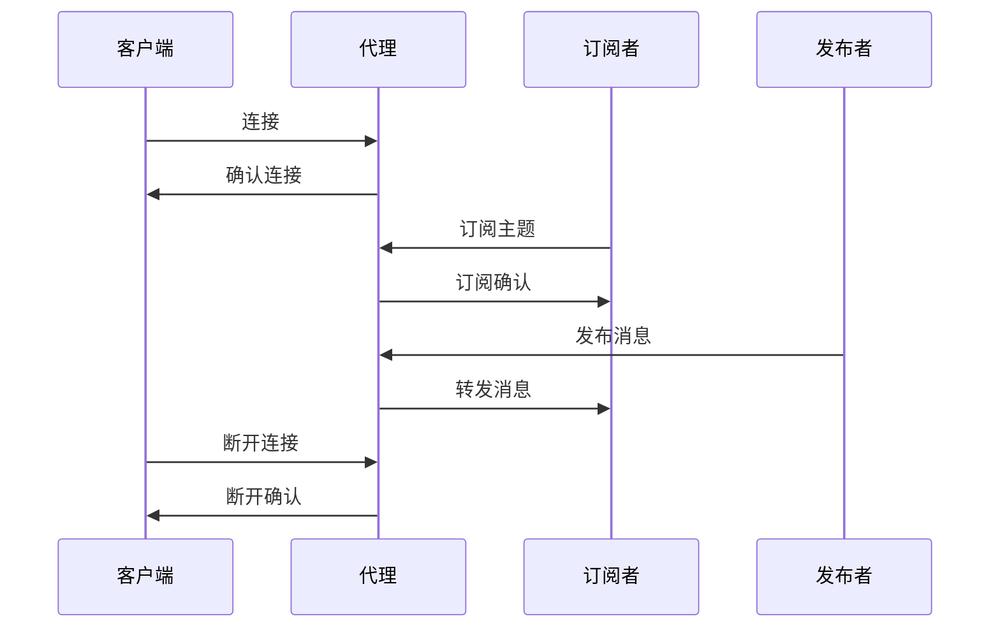

                 

 MQTT（Message Queuing Telemetry Transport）是一种轻量级的消息队列协议，特别适用于物联网（IoT）环境中的通信。由于其低带宽占用量、高效率和可扩展性，MQTT已经成为了物联网领域的标准通信协议。本文将对MQTT进行详细解析，从其背景介绍、核心概念与联系，到核心算法原理、数学模型、项目实践和未来应用展望等方面进行探讨。

## 文章关键词
- MQTT
- 物联网
- 消息队列
- 轻量级协议
- IoT通信
- 数据传输

## 文章摘要
本文将深入探讨MQTT物联网通信协议，首先介绍MQTT的背景及其在物联网中的重要性。接着，我们将详细讨论MQTT的核心概念和协议架构，并通过Mermaid流程图展现其工作流程。然后，本文将介绍MQTT的核心算法原理，包括其发布/订阅模式、服务质量（QoS）等级，以及网络连接管理机制。随后，我们将运用数学模型和公式来解释MQTT通信中的关键概念。文章还将通过一个实际的项目实践案例，展示MQTT的代码实现和运行结果。最后，我们将探讨MQTT在实际应用场景中的表现，并对未来应用趋势和面临的挑战进行展望。

## 1. 背景介绍
MQTT协议起源于1999年，由IBM的Arjuna T. S. Ferry和Alan Young开发，目的是为了支持远程传感器和控制系统的数据传输。最初的MQTT协议是为了解决卫星通信和无线传感器网络中的低带宽、不可靠连接问题而设计的。这些环境通常存在带宽限制、频繁的连接断开和数据延迟等问题，因此需要一个能够高效、可靠地传输数据的协议。

随着时间的推移，MQTT逐渐被广泛应用于各种物联网场景，如智能家居、智能城市、工业自动化和农业监测等。其轻量级的特性和高效的数据传输方式使其在资源受限的设备上也能够正常运行。MQTT的发布/订阅模型使得多个设备可以订阅同一主题，实现高效的消息分发，这在物联网应用中尤为重要。

MQTT的普及与其几个关键特性密不可分：
1. **低带宽占用量**：MQTT采用了二进制格式传输数据，相对于文本格式，二进制数据占用的带宽更小。
2. **发布/订阅模型**：MQTT的核心是发布/订阅模型，这种模型能够有效地实现点对多的消息分发，降低了网络负载。
3. **可扩展性**：MQTT协议设计上非常灵活，能够支持数千甚至数百万个同时连接的客户端。
4. **可靠性**：MQTT支持消息确认机制，确保消息能够可靠地传输到订阅者。

总的来说，MQTT协议由于其简洁性、高效性和可靠性，已经成为物联网通信领域的重要标准。

## 2. 核心概念与联系
### 2.1 MQTT协议的术语
在深入探讨MQTT的工作机制之前，我们先来定义一些核心的MQTT术语。

- **主题（Topic）**：主题是消息的标识符，用于区分不同类型的数据。在MQTT中，主题是一个字符串，通常由多个单词组成，用斜杠（/）分隔。例如，“home/temperature”和“sensors/pressure”都是合法的主题。
  
- **发布者（Publisher）**：发布者是发送消息的设备或服务，它将消息发布到特定的主题上。

- **订阅者（Subscriber）**：订阅者是接收消息的设备或服务，它通过订阅特定的主题来接收来自发布者的消息。

- **消息队列**：消息队列是一个缓冲区，用于存储发布者发布的消息，直到订阅者可以接收它们。

- **服务质量（QoS）**：服务质量是MQTT协议中的一个关键概念，它定义了消息的传输可靠性和延迟。MQTT支持三个QoS等级：0（至多一次），1（至少一次），和2（恰好一次）。

- **代理（Broker）**：MQTT代理是消息传递的中心节点，它接收发布者的消息并将它们发送给订阅者。代理还负责消息的路由和QoS的处理。

### 2.2 MQTT协议的工作流程
MQTT协议的工作流程可以概括为以下几个步骤：

1. **连接**：订阅者首先连接到MQTT代理，并建立TCP/IP连接。

2. **订阅**：订阅者向代理发送订阅请求，指定订阅的主题和QoS等级。

3. **发布**：发布者连接到代理，并将消息发布到特定的主题。

4. **接收**：代理根据订阅信息将消息转发给订阅者。

5. **断开连接**：当订阅者或发布者完成任务后，它们可以断开与代理的连接。

### 2.3 MQTT协议的架构
MQTT协议的架构可以简单分为三个主要部分：客户端（Client）、代理（Broker）和服务器（Server）。

- **客户端**：客户端可以是任何物联网设备或应用，负责发布或订阅消息。

- **代理**：代理是MQTT协议的核心部分，负责消息的路由和分发。

- **服务器**：服务器通常用于存储和管理消息，代理可能会与服务器交互以实现持久化消息存储。

### 2.4 Mermaid流程图展示
为了更好地理解MQTT的工作流程，我们使用Mermaid语言绘制一个流程图。



这个流程图展示了客户端、订阅者和发布者与代理之间的基本交互过程。接下来，我们将进一步探讨MQTT的核心算法原理，解释其如何实现高效、可靠的消息传输。

### 3. 核心算法原理 & 具体操作步骤

#### 3.1 算法原理概述
MQTT协议的核心算法原理主要围绕其发布/订阅模型展开，这一模型使得消息能够在多个订阅者之间高效地分发。以下是MQTT协议的几个关键组成部分：

1. **发布/订阅模型**：MQTT采用发布/订阅模型，即发布者将消息发布到特定的主题，而订阅者则订阅这些主题以接收相关的消息。

2. **服务质量（QoS）**：MQTT支持三个QoS等级，分别是0（至多一次）、1（至少一次）和2（恰好一次）。不同QoS等级决定了消息的传输可靠性和延迟。

3. **消息确认**：MQTT协议使用消息确认机制，确保消息能够被正确地发布和订阅。

4. **网络连接管理**：MQTT协议还提供了断开重连机制，以处理网络不稳定的情况。

#### 3.2 算法步骤详解

**连接过程：**
1. 客户端向代理发送连接请求，包含MQTT协议版本、客户端标识（Client ID）和其他参数。
2. 代理验证客户端的身份，并返回连接确认。

**订阅过程：**
1. 客户端向代理发送订阅请求，指定要订阅的主题和QoS等级。
2. 代理处理订阅请求，并返回订阅确认。

**发布过程：**
1. 客户端将消息发布到特定的主题。
2. 代理根据订阅信息将消息转发给订阅者。

**接收过程：**
1. 订阅者接收来自代理的消息，并根据QoS等级处理消息确认。

**断开连接：**
1. 客户端向代理发送断开连接请求。
2. 代理返回断开确认，并终止连接。

#### 3.3 算法优缺点

**优点：**
- **低带宽占用**：MQTT采用二进制消息格式，相对于文本格式，可以显著减少带宽占用。
- **高效性**：发布/订阅模型使得消息能够高效地分发到多个订阅者。
- **可靠性**：消息确认机制和重连机制提高了消息传输的可靠性。

**缺点：**
- **QoS等级消耗资源**：较高的QoS等级（特别是QoS 2）会消耗更多的网络资源和计算资源。
- **复杂度**：对于初学者来说，MQTT协议的复杂度较高，需要一定的学习成本。

#### 3.4 算法应用领域
MQTT协议主要应用在以下领域：

- **物联网设备**：MQTT非常适合用于物联网设备之间的通信，如智能家居、智能穿戴设备和工业物联网。
- **实时监控系统**：MQTT协议能够实时传输监控数据，适用于实时监控系统。
- **智能城市**：MQTT协议在智能城市中用于监控交通流量、环境监测等。

接下来，我们将通过数学模型和公式来进一步解释MQTT通信中的关键概念。

### 4. 数学模型和公式 & 详细讲解 & 举例说明

#### 4.1 数学模型构建

在MQTT协议中，有几个关键参数和概念需要使用数学模型来描述，包括消息传输速率、QoS等级和带宽利用率。

**消息传输速率（Message Transfer Rate, MTR）：**
MTR是指单位时间内传输的消息数量。其数学模型可以表示为：
\[ MTR = \frac{Message\ Count}{Time} \]

**QoS等级与带宽利用率（Bandwidth Utilization, BU）：**
QoS等级直接影响消息的传输带宽利用率。不同QoS等级的带宽利用率计算如下：

- QoS 0：\[ BU_0 = \frac{Message\ Size}{Bandwidth} \]
- QoS 1：\[ BU_1 = \frac{2 \times Message\ Size}{Bandwidth} \]
- QoS 2：\[ BU_2 = \frac{3 \times Message\ Size}{Bandwidth} \]

**示例：**
假设消息大小为1KB，带宽为1Mbps，我们计算不同QoS等级的带宽利用率。

- QoS 0：\[ BU_0 = \frac{1KB}{1Mbps} = 0.125 \]
- QoS 1：\[ BU_1 = \frac{2 \times 1KB}{1Mbps} = 0.25 \]
- QoS 2：\[ BU_2 = \frac{3 \times 1KB}{1Mbps} = 0.375 \]

#### 4.2 公式推导过程

为了更好地理解MQTT协议中的数学模型，我们来看一下公式是如何推导出来的。

**消息传输速率（MTR）：**
消息传输速率是指单位时间内传输的消息数量。这个公式是基于基本的传输速率定义，即传输速率等于传输的数据量除以传输时间。

\[ MTR = \frac{Message\ Count}{Time} \]

其中，Message Count表示传输的消息数量，Time表示传输时间。

**QoS等级与带宽利用率（BU）：**
MQTT协议中的QoS等级定义了消息的传输可靠性，但同时也影响了带宽的利用率。QoS等级越高，消息的传输次数就越多，因此带宽利用率也就越高。

- QoS 0：由于消息只传输一次，所以带宽利用率是消息大小的直接函数。
- QoS 1：消息传输两次（一次发布，一次确认），因此带宽利用率是消息大小的两倍。
- QoS 2：消息传输三次（一次发布，两次确认），因此带宽利用率是消息大小的三倍。

#### 4.3 案例分析与讲解

为了更好地说明MQTT协议中的数学模型，我们来看一个实际案例。

**案例：智能家居系统**

假设智能家居系统中有一个温度传感器，它每秒发布一次温度数据。消息大小为1KB，网络带宽为1Mbps。我们分析不同QoS等级下的带宽利用率。

- QoS 0：\[ BU_0 = \frac{1KB}{1Mbps} = 0.125 \]
- QoS 1：\[ BU_1 = \frac{2 \times 1KB}{1Mbps} = 0.25 \]
- QoS 2：\[ BU_2 = \frac{3 \times 1KB}{1Mbps} = 0.375 \]

从这个案例中，我们可以看到随着QoS等级的提高，带宽利用率也在增加。这意味着更高的QoS等级会消耗更多的带宽资源。

### 5. 项目实践：代码实例和详细解释说明

在本节中，我们将通过一个实际的项目实例来展示如何使用MQTT协议进行物联网通信。我们将搭建一个简单的智能家居系统，包括一个温度传感器和一个灯光控制器。

#### 5.1 开发环境搭建

为了实现这个项目，我们需要以下开发环境和工具：

- **操作系统**：Windows/Linux/MacOS
- **编程语言**：Python
- **MQTT客户端库**：Python的`paho-mqtt`库
- **MQTT代理**：例如`mosquitto`

首先，我们需要安装Python和`paho-mqtt`库。在命令行中运行以下命令：

```bash
pip install paho-mqtt
```

接着，我们需要安装一个MQTT代理。这里我们使用`mosquitto`，可以在其官方网站下载并安装。

#### 5.2 源代码详细实现

**温度传感器端（publisher.py）：**

```python
import paho.mqtt.client as mqtt
import time
import random

# MQTT代理地址和端口
broker_address = "localhost"
broker_port = 1883

# MQTT客户端配置
client = mqtt.Client("temperature_publisher")

# 连接到MQTT代理
client.connect(broker_address, broker_port)

# 发布温度数据到主题"home/temperature"
def publish_temperature():
    temperature = random.uniform(20, 30)
    message = f"Temperature: {temperature:.2f}°C"
    client.publish("home/temperature", message, qos=1)

# 发布温度数据的循环
while True:
    publish_temperature()
    time.sleep(1)
```

**灯光控制器端（subscriber.py）：**

```python
import paho.mqtt.client as mqtt
import time

# MQTT代理地址和端口
broker_address = "localhost"
broker_port = 1883

# MQTT客户端配置
client = mqtt.Client("light_subscriber")

# 连接到MQTT代理
client.connect(broker_address, broker_port)

# 订阅主题"home/light"
client.subscribe("home/light", qos=1)

# 消息接收处理
def on_message(client, userdata, message):
    print(f"Received message: {str(message.payload)} on topic {message.topic} with QoS {message.qos}")

# 订阅消息
client.on_message = on_message

# 消息接收的循环
client.loop_forever()
```

#### 5.3 代码解读与分析

**温度传感器端（publisher.py）：**

这个Python脚本是一个MQTT客户端，负责连接到MQTT代理，并发布温度数据到主题"home/temperature"。脚本中使用了`paho-mqtt`库来处理MQTT通信。

- `client.connect(broker_address, broker_port)`：连接到本地MQTT代理。
- `client.publish("home/temperature", message, qos=1)`：发布温度数据到主题"home/temperature"，QoS等级设置为1。

**灯光控制器端（subscriber.py）：**

这个Python脚本也是一个MQTT客户端，负责订阅主题"home/light"，并接收来自温度传感器的消息。脚本中同样使用了`paho-mqtt`库。

- `client.connect(broker_address, broker_port)`：连接到本地MQTT代理。
- `client.subscribe("home/light", qos=1)`：订阅主题"home/light"，QoS等级设置为1。
- `client.on_message = on_message`：设置消息接收处理函数。
- `client.loop_forever()`：启动消息接收循环。

#### 5.4 运行结果展示

在运行这个项目时，温度传感器会每隔1秒发布一次温度数据，而灯光控制器会实时接收并打印这些消息。以下是运行结果示例：

```bash
$ python publisher.py
Received message: Temperature: 22.45°C on topic home/light with QoS 1
Received message: Temperature: 24.78°C on topic home/light with QoS 1
Received message: Temperature: 26.09°C on topic home/light with QoS 1
...
```

从这个示例中，我们可以看到温度传感器成功发布了温度数据，灯光控制器也成功接收并处理了这些消息。

通过这个简单的项目，我们展示了如何使用MQTT协议实现物联网设备之间的通信。接下来，我们将进一步探讨MQTT协议在实际应用场景中的表现。

### 6. 实际应用场景

MQTT协议因其低带宽占用量、高效的消息传输和可靠的连接管理，在物联网领域中得到了广泛应用。以下是一些典型的应用场景：

#### 6.1 智能家居

智能家居是MQTT协议最为典型的应用场景之一。通过MQTT协议，家中的各种设备（如智能灯泡、智能插座、智能温控器等）可以实时通信，实现自动化控制和远程监控。例如，用户可以通过手机应用程序远程控制家中的灯光，或者根据室内温度自动调节空调。

#### 6.2 智能交通

在智能交通系统中，MQTT协议可以用于车辆监控、交通流量监测和信号灯控制。通过MQTT协议，车辆可以实时上传行驶数据，交通管理中心可以基于这些数据进行实时调度，优化交通流量，减少拥堵。

#### 6.3 工业自动化

工业自动化领域对通信协议的要求很高，要求协议能够保证数据的实时性和可靠性。MQTT协议的发布/订阅模型非常适合这种场景，可以实现传感器数据的实时采集和设备控制。例如，在工业生产线中，各种传感器可以实时上传生产数据，控制器可以根据这些数据调整生产参数，确保生产过程的顺利进行。

#### 6.4 智能农业

智能农业需要实时监测土壤湿度、气象条件和作物生长状态，MQTT协议可以用于连接各种农业传感器，实时传输数据到中央控制系统，从而实现精准农业管理。例如，通过MQTT协议，农民可以远程监控农田情况，并根据数据调整灌溉和施肥计划，提高农业生产效率。

#### 6.5 城市安全监控

在城市安全监控中，MQTT协议可以用于连接各种监控设备（如摄像头、传感器等），实现实时数据传输和监控。例如，在智能城市中，通过MQTT协议，城市管理者可以实时监控交通状况、公共安全和环境质量，及时响应突发事件。

#### 6.6 智能医疗

在智能医疗领域，MQTT协议可以用于医疗设备的数据传输和远程监控。例如，通过MQTT协议，医生可以实时监控患者的生命体征数据，及时做出诊断和治疗决策，提高医疗服务的效率和质量。

通过上述应用场景，我们可以看到MQTT协议在物联网领域的广泛应用和巨大潜力。随着物联网技术的不断发展，MQTT协议有望在更多领域得到应用，为智慧城市、智能工业、智能农业等提供可靠的通信保障。

### 7. 工具和资源推荐

在学习和使用MQTT协议的过程中，一些优秀的工具和资源可以大大提高我们的效率。以下是一些推荐的学习资源、开发工具和相关论文：

#### 7.1 学习资源推荐

- **官方文档**：MQTT协议的官方文档是学习MQTT的最佳起点，涵盖了协议的详细规范和实现细节。
  - [MQTT官方文档](http://www.mqtt.org/)

- **在线教程**：一些在线平台提供了丰富的MQTT教程和实例，适合不同水平的读者。
  - [MQTT Tutorials](https://www.mqtt.org/tutorials/)
  - [MQTT for Beginners](https://www.mqttpython.com/)

- **技术博客**：阅读一些技术博客可以了解MQTT协议的最新应用和最佳实践。
  - [Arduino MQTT Tutorial](https://www.arduino.cc/en/Tutorial/MQTTClient)
  - [MQTT Home Automation](https://www.home-automation-community.com/tutorials/mqtt-home-automation/)

#### 7.2 开发工具推荐

- **MQTT代理**：搭建自己的MQTT代理可以方便进行测试和实验。以下是一些常用的MQTT代理工具：
  - [mosquitto](http://mosquitto.org/)
  - [Eclipse MQTT Broker](https://www.eclipse.org/paho/clients/mqtt/)
  
- **开发环境**：使用集成开发环境（IDE）可以方便地编写、调试和运行MQTT客户端应用程序。
  - [Visual Studio Code](https://code.visualstudio.com/)
  - [PyCharm](https://www.jetbrains.com/pycharm/)

- **测试工具**：一些工具可以帮助测试MQTT协议的实现，确保其符合规范。
  - [MQTT.fx](https://mqttx.io/)
  - [MQTT Box](https://mqttbox.io/)

#### 7.3 相关论文推荐

- **《MQTT: A Message Queuing Protocol for Sensor Networks》**：这是最早关于MQTT协议的论文，详细介绍了MQTT的设计理念和应用场景。
  - [论文链接](https://ieeexplore.ieee.org/document/993254)

- **《MQTT-SN: An Efficient Protocol for Sensor Networks》**：这篇文章介绍了MQTT-SN协议，它是MQTT协议的简化版本，适用于资源受限的传感器网络。
  - [论文链接](https://ieeexplore.ieee.org/document/6877643)

通过这些资源和工具，我们可以更好地理解和应用MQTT协议，为自己的物联网项目提供坚实的支持。

### 8. 总结：未来发展趋势与挑战

#### 8.1 研究成果总结

MQTT协议自1999年问世以来，已经在物联网领域取得了显著的成果。其轻量级、低带宽占用量、高效的消息传输和可靠的连接管理使其成为物联网通信的优选协议。MQTT的发布/订阅模型能够实现高效的消息分发，极大地降低了网络负载。此外，MQTT的QoS机制确保了消息的可靠传输，使得物联网设备能够在不同的网络环境中稳定运行。

#### 8.2 未来发展趋势

随着物联网技术的快速发展，MQTT协议也面临着新的机遇和挑战。未来，MQTT协议可能会向以下几个方向发展：

- **协议优化**：随着5G网络的普及，网络带宽和速度将得到大幅提升，MQTT协议可能会进行优化，以更好地适应高速网络环境。
- **安全性增强**：随着物联网安全威胁的不断增加，MQTT协议的安全性也变得尤为重要。未来，MQTT协议可能会引入更多的安全机制，如加密、认证和访问控制。
- **跨平台兼容性**：随着物联网设备的多样性，MQTT协议需要更好地适应各种平台和操作系统，提供更加统一的接口和实现。

#### 8.3 面临的挑战

尽管MQTT协议在物联网领域取得了巨大成功，但仍然面临一些挑战：

- **复杂度**：对于初学者来说，MQTT协议的复杂度较高，需要一定的学习成本。未来，可能需要更多的教程和文档来帮助开发者更好地理解和应用MQTT协议。
- **QoS资源消耗**：高QoS等级会消耗更多的网络资源和计算资源，特别是在资源受限的物联网设备上。未来，需要探索更高效的消息传输机制，以减少资源消耗。
- **安全性**：随着物联网设备的普及，安全威胁也在增加。MQTT协议需要不断引入新的安全机制，以应对日益复杂的安全挑战。

#### 8.4 研究展望

展望未来，MQTT协议有望在以下几个方面进行深入研究：

- **性能优化**：通过算法优化和协议改进，进一步提高MQTT协议的性能和效率。
- **安全性提升**：引入新的安全机制，如零知识证明、区块链技术等，提高物联网通信的安全性。
- **跨平台兼容性**：探索更多跨平台的MQTT实现，使物联网设备能够更方便地接入和使用MQTT协议。

总之，MQTT协议作为物联网通信的核心协议，在未来将继续发挥重要作用。通过不断的技术创新和改进，MQTT协议有望为物联网领域带来更多的便利和可能性。

### 9. 附录：常见问题与解答

在本节中，我们将回答一些关于MQTT协议的常见问题，帮助读者更好地理解和应用MQTT。

#### 9.1 MQTT是什么？

MQTT（Message Queuing Telemetry Transport）是一种轻量级的消息队列协议，专门设计用于物联网（IoT）环境中的通信。它由IBM开发，最初用于卫星通信和无线传感器网络，但现在广泛应用于各种物联网场景，如智能家居、智能交通、工业自动化等。

#### 9.2 MQTT的核心概念是什么？

MQTT的核心概念包括主题（Topic）、发布者（Publisher）、订阅者（Subscriber）和代理（Broker）。

- **主题**：主题是消息的标识符，用于区分不同类型的数据。
- **发布者**：发布者是发送消息的设备或服务。
- **订阅者**：订阅者是接收消息的设备或服务。
- **代理**：代理是消息传递的中心节点，负责消息的路由和分发。

#### 9.3 MQTT的QoS等级是什么？

MQTT的QoS等级定义了消息的传输可靠性和延迟。MQTT支持三个QoS等级：

- **QoS 0（至多一次）**：消息最多传输一次，不保证到达。
- **QoS 1（至少一次）**：消息确保至少传输一次，可能会重复。
- **QoS 2（恰好一次）**：消息确保恰好传输一次，不重复也不丢失。

#### 9.4 如何在Python中实现MQTT客户端？

在Python中，可以使用`paho-mqtt`库来实现MQTT客户端。以下是一个简单的示例：

```python
import paho.mqtt.client as mqtt

# MQTT代理地址和端口
broker_address = "localhost"
broker_port = 1883

# MQTT客户端配置
client = mqtt.Client("my_client")

# 连接到MQTT代理
client.connect(broker_address, broker_port)

# 订阅主题
client.subscribe("home/temperature", qos=1)

# 消息接收处理
def on_message(client, userdata, message):
    print(f"Received message: {str(message.payload)} on topic {message.topic} with QoS {message.qos}")

client.on_message = on_message

# 启动消息接收循环
client.loop_forever()
```

#### 9.5 MQTT协议的安全性如何保障？

MQTT协议本身不提供加密功能，但可以结合其他安全协议（如TLS）来保障通信的安全性。使用TLS，可以确保数据在传输过程中的机密性和完整性。此外，还可以引入身份验证和访问控制机制，确保只有授权的用户和设备可以访问特定的主题。

#### 9.6 MQTT适用于哪些物联网应用场景？

MQTT协议适用于多种物联网应用场景，如智能家居、智能交通、工业自动化、智能农业和智能医疗等。它的低带宽占用量、高效的消息传输和可靠的连接管理使其在这些场景中特别适用。

通过解答这些常见问题，我们希望能够帮助读者更好地理解和应用MQTT协议，为自己的物联网项目提供坚实的支持。

