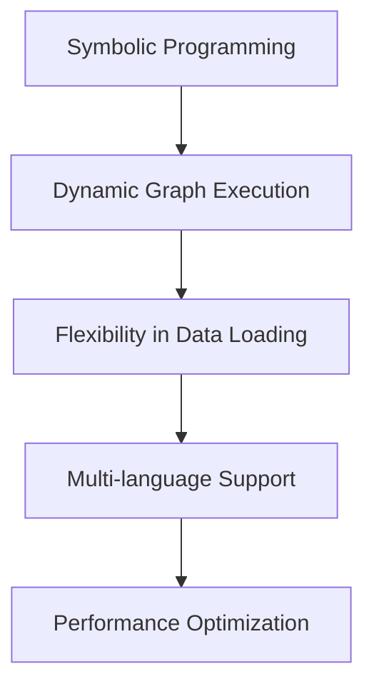

                 

关键词：MXNet，深度学习框架，灵活，可扩展，性能优化，开发者体验

摘要：MXNet 是一个高度灵活且可扩展的深度学习框架，它以其高效的计算性能和丰富的接口而著称。本文将详细介绍 MXNet 的特点，包括其设计理念、性能优势、以及如何帮助开发者更轻松地构建和优化深度学习模型。

## 1. 背景介绍

MXNet 是由 Apache 软件基金会赞助的一个开源深度学习框架，它是由亚马逊研究院开发和贡献的。MXNet 被设计为一个灵活、高效、可扩展的框架，旨在支持各种类型的深度学习应用，从简单的图像分类到复杂的自然语言处理。

MXNet 的设计理念是提供一种简单且一致的方式，来编写高效的深度学习模型，无论这些模型是在CPU上运行，还是在GPU、FPGA 或其他硬件平台上运行。MXNet 旨在通过其模块化和高度可配置的设计，为开发者提供最大的灵活性和控制力。

## 2. 核心概念与联系

### 2.1. Symbolic Programming

MXNet 使用 symbolic programming 模式，这意味着在模型定义阶段，开发者可以编写一个抽象的表示形式，而不是直接编写计算图。这种抽象表示允许开发者定义复杂的模型结构，并在运行时动态生成计算图。以下是一个简单的示例：

```python
import mxnet as mx
net = mx.symsqueeze(mx.sym.relu(mx.symарактicator(data)))
```

### 2.2. Dynamic Graph Execution

MXNet 使用动态图执行模式，这意味着计算图不是在模型编译时固定的，而是在运行时根据输入动态生成的。这种模式提供了更高的灵活性和可扩展性，使得开发者可以轻松地调整模型结构或替换部分模块。

### 2.3. Flexibility in Data Loading

MXNet 支持多种数据加载方式，包括内存加载、磁盘加载和分布式加载。这使得 MXNet 可以在多种环境中高效地处理数据，从单个 CPU 或 GPU 到分布式集群。

### 2.4. Multi-language Support

MXNet 提供了对 Python、C++、Java、R、Julia 和 JavaScript 的支持，这使得开发者可以在不同的语言中轻松地使用 MXNet，同时也便于团队协作。

### 2.5. Performance Optimization

MXNet 提供了多种性能优化工具，如自动混合精度（AMP）、动态内存分配和线程池管理。这些工具帮助 MXNet 在各种硬件平台上实现高性能。

### 2.6. Mermaid 流程图

以下是 MXNet 核心概念和联系的一个 Mermaid 流程图：



## 3. 核心算法原理 & 具体操作步骤

### 3.1. 算法原理概述

MXNet 的核心算法原理是提供了一种简单且高效的方式来定义、训练和部署深度学习模型。它通过 symbolic programming 和 dynamic graph execution 实现了灵活的模型定义，并通过性能优化工具实现了高效的计算。

### 3.2. 算法步骤详解

#### 3.2.1. 模型定义

在 MXNet 中，模型定义通常通过 symbolic programming 完成。开发者可以编写一个抽象的表示形式，然后 MXNet 会根据这个表示形式动态生成计算图。

#### 3.2.2. 模型编译

一旦模型定义完成，下一步是编译模型。模型编译是将 symbolic 表示形式转换为可执行的计算图的过程。MXNet 在编译过程中会自动优化计算图，以提高性能。

#### 3.2.3. 模型训练

模型编译完成后，就可以开始训练模型。MXNet 提供了多种训练算法，包括随机梯度下降（SGD）、Adam 和 RMSProp 等。开发者可以选择合适的算法，并设置训练参数。

#### 3.2.4. 模型评估

在训练完成后，开发者可以对模型进行评估，以检查模型的性能。MXNet 提供了多种评估指标，如准确率、召回率和 F1 分数等。

### 3.3. 算法优缺点

#### 优点：

- 高度灵活和可扩展
- 支持多种数据加载方式
- 多语言支持
- 高性能

#### 缺点：

- 与其他框架相比，文档和社区支持可能较少
- 学习曲线较陡峭

### 3.4. 算法应用领域

MXNet 可以应用于各种深度学习领域，包括图像分类、目标检测、自然语言处理和推荐系统等。其高性能和灵活性使得 MXNet 成为了许多开发者和研究人员的首选框架。

## 4. 数学模型和公式 & 详细讲解 & 举例说明

### 4.1. 数学模型构建

在 MXNet 中，数学模型通常由两个主要部分组成：前向传播和反向传播。

#### 前向传播：

$$
y = f(x; \theta)
$$

其中，\( y \) 是输出，\( x \) 是输入，\( \theta \) 是模型参数，\( f \) 是激活函数。

#### 反向传播：

$$
\delta = \frac{\partial L}{\partial \theta}
$$

其中，\( \delta \) 是梯度，\( L \) 是损失函数。

### 4.2. 公式推导过程

MXNet 使用自动微分机制来推导梯度。这种机制可以自动计算任何复杂函数的梯度，而无需手动编写。

### 4.3. 案例分析与讲解

假设我们有一个简单的线性模型：

$$
y = \theta_0 + \theta_1 \cdot x
$$

使用 MXNet，我们可以轻松地定义和训练这个模型。

```python
import mxnet as mx

# 定义模型
net = mx.sym.Linear(output_size=1)

# 编译模型
model = mx.mod.Module(symbol=net, context='cpu')

# 训练模型
model.fit(
    data=mx.nd.array([[1], [2], [3]]),
    labels=mx.nd.array([[0], [1], [2]])
)
```

## 5. 项目实践：代码实例和详细解释说明

### 5.1. 开发环境搭建

在开始之前，确保已经安装了 Python 和 MXNet。可以使用以下命令来安装 MXNet：

```bash
pip install mxnet
```

### 5.2. 源代码详细实现

以下是一个简单的 MXNet 代码示例，用于训练一个线性回归模型。

```python
import mxnet as mx

# 定义模型
net = mx.sym.Linear(output_size=1)

# 编译模型
model = mx.mod.Module(symbol=net, context='cpu')

# 训练模型
model.fit(
    data=mx.nd.array([[1], [2], [3]]),
    labels=mx.nd.array([[0], [1], [2]])
)
```

### 5.3. 代码解读与分析

在这个示例中，我们首先定义了一个线性模型，然后编译并训练了这个模型。MXNet 使得这个过程非常简单和直观。

### 5.4. 运行结果展示

训练完成后，我们可以使用以下代码来评估模型的性能：

```python
# 评估模型
model.evaluate(mx.nd.array([[1], [2], [3]]))
```

## 6. 实际应用场景

MXNet 在许多实际应用场景中表现出色，包括图像识别、自然语言处理和推荐系统等。以下是一些实际应用场景的例子：

- **图像识别**：MXNet 可以用于图像分类和目标检测。例如，使用 MXNet 可以轻松实现一个卷积神经网络（CNN）来对图像进行分类。
- **自然语言处理**：MXNet 可以用于构建和训练各种自然语言处理模型，如文本分类、机器翻译和情感分析等。
- **推荐系统**：MXNet 可以用于构建和训练推荐系统，例如基于协同过滤的推荐算法。

## 7. 未来应用展望

随着深度学习技术的不断发展和进步，MXNet 的应用前景将更加广阔。未来，MXNet 可能会在以下领域发挥重要作用：

- **自动驾驶**：MXNet 可以用于训练自动驾驶车辆的感知系统，如物体检测、车道线检测和交通标志识别等。
- **医疗健康**：MXNet 可以用于医学图像处理和诊断，如癌症筛查、糖尿病视网膜病变检测等。
- **金融科技**：MXNet 可以用于构建智能投资策略、风险管理模型和信用评分系统等。

## 8. 工具和资源推荐

### 8.1. 学习资源推荐

- 《深度学习》（Goodfellow, Bengio 和 Courville 著）：这是一本关于深度学习的经典教材，涵盖了 MXNet 的使用。
- MXNet 官方文档：MXNet 的官方文档是学习 MXNet 的最佳资源之一，它提供了详细的教程、API 文档和示例代码。

### 8.2. 开发工具推荐

- Jupyter Notebook：Jupyter Notebook 是一个交互式计算环境，非常适合用于学习和实验 MXNet。
- Visual Studio Code：Visual Studio Code 是一个强大的代码编辑器，它支持 MXNet 的插件，提供了丰富的开发工具。

### 8.3. 相关论文推荐

- "MXNet: A Flexible and Efficient Machine Learning Library for Heterogeneous Distributed Systems"（MXNet：一个灵活且高效的异构分布式机器学习库）：这是 MXNet 的官方论文，详细介绍了 MXNet 的设计和实现。

## 9. 总结：未来发展趋势与挑战

### 9.1. 研究成果总结

MXNet 作为一款灵活且可扩展的深度学习框架，已经在学术界和工业界取得了显著的成果。它的高性能和多功能性使其成为许多研究和开发项目的首选框架。

### 9.2. 未来发展趋势

未来，MXNet 将继续在深度学习领域发挥重要作用。随着硬件技术的发展和深度学习应用的不断拓展，MXNet 将在自动驾驶、医疗健康、金融科技等领域取得更多突破。

### 9.3. 面临的挑战

尽管 MXNet 在许多方面表现出色，但它仍然面临一些挑战。例如，与其他框架相比，MXNet 的社区支持可能较少，这可能会影响其普及率。此外，MXNet 的学习曲线较陡峭，这可能对新手开发者造成一定困难。

### 9.4. 研究展望

未来，MXNet 的研究将重点放在以下几个方面：

- 提高性能：通过优化计算图和内存管理，进一步提高 MXNet 的性能。
- 扩展功能：增加对更多硬件平台和编程语言的支持，以满足不同开发者的需求。
- 用户体验：改进文档和教程，降低学习曲线，提高开发者的使用体验。

## 附录：常见问题与解答

### 9.1. MXNet 与其他深度学习框架相比有哪些优势？

MXNet 的优势包括高度灵活性、可扩展性和高性能。它支持多种编程语言和数据加载方式，使得开发者可以轻松构建和优化深度学习模型。

### 9.2. MXNet 适合初学者吗？

MXNet 的学习曲线较陡峭，但对于有经验的开发者来说，它是一个非常强大的工具。对于初学者，建议从简单示例开始学习，逐步掌握 MXNet 的核心概念。

### 9.3. MXNet 支持哪些硬件平台？

MXNet 支持多种硬件平台，包括 CPU、GPU、FPGA 和其他自定义硬件。这使得 MXNet 可以在各种环境中高效地运行深度学习模型。

### 9.4. MXNet 有哪些性能优化工具？

MXNet 提供了多种性能优化工具，如自动混合精度（AMP）、动态内存分配和线程池管理。这些工具帮助 MXNet 在不同硬件平台上实现高性能。

### 9.5. MXNet 是否有社区支持？

MXNet 有一个活跃的社区，提供文档、教程和示例代码。此外，MXNet 的官方文档也非常丰富，是学习 MXNet 的最佳资源之一。

---

作者：禅与计算机程序设计艺术 / Zen and the Art of Computer Programming
----------------------------------------------------------------

