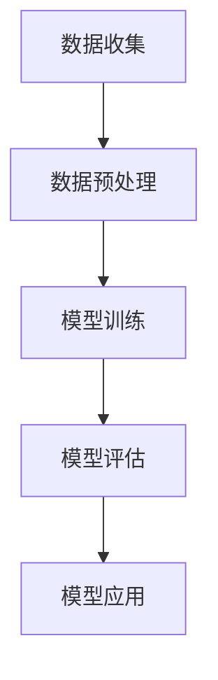

                 

关键词：自然语言处理，大模型，标准，算法，深度学习，数学模型，应用场景

> 摘要：本文将深入探讨NLP领域的大模型标准，包括其背景、核心概念、算法原理、数学模型及其在实际应用中的表现。通过对NLP大模型的深入分析，旨在为研究人员和开发者提供有价值的参考，推动NLP技术的不断进步。

## 1. 背景介绍

自然语言处理（NLP）是人工智能领域的一个重要分支，旨在使计算机能够理解、生成和处理人类语言。随着深度学习技术的不断发展，NLP领域的研究取得了显著的进展。尤其是大模型的兴起，如GPT、BERT等，已经颠覆了传统的NLP方法，成为当前研究的热点。

大模型的标准通常包括模型规模、计算资源、数据处理能力等多个方面。在这些标准下，大模型能够处理更复杂的语言现象，提供更精准的语言理解和生成能力。然而，大模型的研究和应用也面临诸多挑战，如训练成本、推理效率、数据隐私等。

本文将围绕NLP领域的大模型标准，详细分析其核心概念、算法原理、数学模型及其在实际应用中的表现，为相关研究和开发提供指导。

## 2. 核心概念与联系

### 2.1 模型规模

模型规模是衡量大模型的重要指标之一。通常，模型规模越大，其参数数量越多，能够捕捉的语言特征也越丰富。例如，GPT-3拥有1750亿个参数，而BERT-base拥有1.1亿个参数。

### 2.2 计算资源

大模型的训练和推理通常需要大量的计算资源。这包括高性能的CPU、GPU以及分布式计算框架。例如，GPT-3的训练需要数百个TPU节点。

### 2.3 数据处理能力

大模型需要处理大规模的语料库，以获取丰富的语言知识。例如，BERT的训练数据来自数十亿网页的语料库。

### 2.4 Mermaid 流程图

以下是一个简化的NLP大模型架构的Mermaid流程图：



## 3. 核心算法原理 & 具体操作步骤

### 3.1 算法原理概述

NLP大模型的核心算法通常基于深度学习，特别是自注意力机制（Self-Attention）。自注意力机制允许模型在处理每个输入时，自动关注输入序列中的其他部分，从而捕捉长距离依赖关系。

### 3.2 算法步骤详解

1. **数据预处理**：包括分词、词汇表构建、序列填充等。
2. **模型训练**：使用大规模语料库进行训练，优化模型参数。
3. **模型评估**：通过测试集评估模型性能。
4. **模型应用**：在NLP任务中，如文本分类、机器翻译等，应用大模型进行预测。

### 3.3 算法优缺点

- **优点**：能够捕捉复杂的长距离依赖关系，提高NLP任务的性能。
- **缺点**：训练成本高，对计算资源要求大。

### 3.4 算法应用领域

NLP大模型广泛应用于多个领域，如：

- **文本分类**：对大量文本进行分类，如情感分析、新闻分类等。
- **机器翻译**：将一种语言翻译成另一种语言。
- **问答系统**：回答用户提出的问题。

## 4. 数学模型和公式 & 详细讲解 & 举例说明

### 4.1 数学模型构建

NLP大模型的数学基础通常包括多层感知机（MLP）、循环神经网络（RNN）、长短时记忆网络（LSTM）和Transformer等。

### 4.2 公式推导过程

以下是一个简化的Transformer模型的公式推导过程：

$$
\text{Attention}(Q, K, V) = \frac{1}{\sqrt{d_k}} \text{softmax}\left(\text{QK}^T/\text{diag}(d_k)\right) V
$$

其中，Q、K、V分别为查询向量、键向量和值向量，d_k为键向量的维度。

### 4.3 案例分析与讲解

以BERT模型为例，我们分析其如何处理一个文本分类任务。

1. **数据预处理**：将文本分词，转换为ID序列。
2. **模型输入**：将ID序列输入BERT模型。
3. **模型输出**：通过模型输出层得到文本的表示向量。
4. **分类**：使用文本表示向量进行分类。

## 5. 项目实践：代码实例和详细解释说明

### 5.1 开发环境搭建

- Python版本：3.8
- 深度学习框架：TensorFlow 2.x
- GPU：NVIDIA Tesla V100

### 5.2 源代码详细实现

以下是一个简单的BERT文本分类任务的代码实现：

```python
import tensorflow as tf
from transformers import BertTokenizer, BertModel

tokenizer = BertTokenizer.from_pretrained('bert-base-uncased')
model = BertModel.from_pretrained('bert-base-uncased')

inputs = tokenizer("Hello, my dog is cute", return_tensors='tf')
outputs = model(inputs)

logits = outputs.logits
predicted_class = tf.argmax(logits, axis=1)
```

### 5.3 代码解读与分析

- **Tokenization**：将文本分词，转换为ID序列。
- **Model Inference**：将ID序列输入BERT模型，获取文本的表示向量。
- **Classification**：通过模型输出层得到文本的表示向量，进行分类。

### 5.4 运行结果展示

```python
print(predicted_class.numpy())
```

## 6. 实际应用场景

NLP大模型在实际应用中表现出色，例如：

- **搜索引擎**：通过大模型对搜索结果进行排序，提高搜索质量。
- **问答系统**：使用大模型回答用户的问题，提供智能客服。
- **文本生成**：利用大模型生成文章、诗歌等。

## 7. 工具和资源推荐

### 7.1 学习资源推荐

- **书籍**：《深度学习》（Goodfellow, Bengio, Courville）
- **论文**：BERT: Pre-training of Deep Bidirectional Transformers for Language Understanding

### 7.2 开发工具推荐

- **TensorFlow**：用于深度学习开发的强大框架。
- **Hugging Face**：提供丰富的预训练模型和工具。

### 7.3 相关论文推荐

- **BERT**：A Pre-Trained Language Model for Next-Generation Natural Language Processing
- **GPT-3**：Language Models are Few-Shot Learners

## 8. 总结：未来发展趋势与挑战

NLP大模型已经成为NLP领域的重要力量，未来发展趋势包括：

- **模型压缩**：降低模型大小和计算成本。
- **跨模态学习**：结合文本、图像、音频等多模态信息。

然而，NLP大模型也面临以下挑战：

- **数据隐私**：如何保护用户数据隐私。
- **伦理问题**：如何确保模型公平、无偏见。

## 9. 附录：常见问题与解答

### 9.1 什么是BERT？

BERT是一种预训练的语言表示模型，基于Transformer架构，能够对文本进行高效表示，广泛应用于NLP任务。

### 9.2 如何训练一个BERT模型？

训练BERT模型通常需要大量的计算资源和时间。可以使用预训练好的BERT模型，也可以从头开始训练。

----------------------------------------------------------------

以上便是本文的完整内容，希望对您在NLP领域的研究和工作有所帮助。作者：禅与计算机程序设计艺术 / Zen and the Art of Computer Programming。

