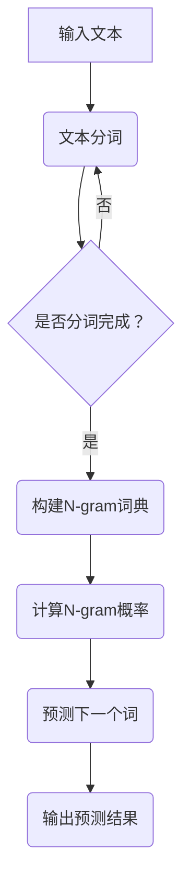
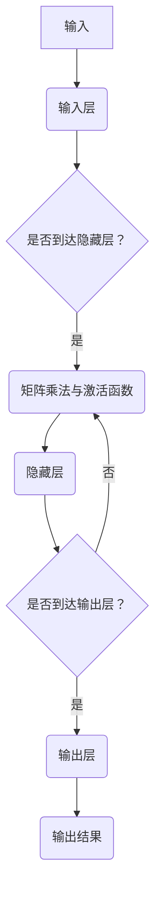

                 

关键词：N-gram模型、多层感知器、矩阵乘法、GELU激活函数、神经网络、机器学习、自然语言处理

> 摘要：本文深入探讨了N-gram模型在自然语言处理中的应用，结合多层感知器、矩阵乘法和GELU激活函数，详述了该模型的原理、实现和应用场景。通过数学模型和实际代码实例，全面解析了N-gram模型的工作机制，为读者提供了清晰的实践路径。

## 1. 背景介绍

自然语言处理（NLP）是计算机科学领域的一个分支，旨在使计算机能够理解、生成和处理人类语言。在NLP中，文本数据通常被转换为计算机可以处理的形式，以便进行各种任务，如情感分析、命名实体识别、机器翻译等。

N-gram模型是一种常见的文本建模技术，用于预测一个词序列的概率分布。它通过将文本分成固定长度的子序列（即N-gram），利用历史数据来预测下一个词的出现概率。例如，在二元N-gram模型中，每个词都是基于前一个词的概率分布进行预测的。

多层感知器（MLP）是一种前馈神经网络，由多个层次组成，包括输入层、隐藏层和输出层。它通过矩阵乘法和激活函数来实现输入到输出的映射。MLP在许多机器学习任务中都有应用，如回归、分类和特征提取。

矩阵乘法是一种线性代数运算，用于计算两个矩阵的乘积。它在线性模型和神经网络中有着广泛的应用，可以提高计算效率和性能。

GELU（高斯误差线性单元）是一种激活函数，它的非线性特性使神经网络能够学习复杂的函数。GELU函数在深度学习领域得到了广泛应用，尤其在自然语言处理任务中。

本文将结合这些概念，深入探讨N-gram模型的工作原理、实现方法及其应用。

## 2. 核心概念与联系

### 2.1 N-gram模型

N-gram模型是一种基于历史数据的文本建模方法。它将文本序列划分为固定长度的子序列，称为N-gram。例如，对于二元的N-gram模型，每个词都是基于前一个词的概率分布进行预测的。

下面是一个简单的二元N-gram模型的Mermaid流程图：



### 2.2 多层感知器

多层感知器是一种前馈神经网络，由输入层、隐藏层和输出层组成。它通过矩阵乘法和激活函数实现输入到输出的映射。以下是MLP的Mermaid流程图：



### 2.3 矩阵乘法

矩阵乘法是线性代数中的基本运算，用于计算两个矩阵的乘积。在神经网络中，矩阵乘法用于计算输入和权重之间的相互作用，从而实现从输入层到隐藏层或输出层的映射。

### 2.4 GELU激活函数

GELU（高斯误差线性单元）是一种非线性激活函数，它的形式为：

$$
\text{GELU}(x) = x \cdot \Phi(x)
$$

其中，$\Phi(x)$ 是标准正态分布的累积分布函数。GELU函数具有较好的非线性特性，可以有效地提高神经网络的性能。

## 3. 核心算法原理 & 具体操作步骤

### 3.1 算法原理概述

N-gram模型通过将文本序列划分为固定长度的子序列，利用历史数据来预测下一个词的出现概率。在多层感知器中，输入层接收文本序列的N-gram特征，通过矩阵乘法和GELU激活函数传递到隐藏层，最终在输出层生成预测结果。

### 3.2 算法步骤详解

#### 3.2.1 数据预处理

首先，对输入文本进行分词，将文本序列转换为单词序列。然后，对单词序列进行编码，将每个单词映射为唯一的整数。例如，可以使用Word2Vec或One-Hot编码方法。

#### 3.2.2 构建N-gram词典

根据输入文本的单词序列，构建N-gram词典。词典包含所有可能的N-gram及其出现的频率。例如，对于二元的N-gram模型，词典包含每对连续单词及其出现次数。

#### 3.2.3 计算N-gram概率

利用N-gram词典计算每个N-gram的概率。对于二元N-gram模型，每个词都是基于前一个词的概率分布进行预测的。计算公式如下：

$$
P(w_t | w_{t-1}) = \frac{f(w_{t-1}, w_t)}{f(w_{t-1})}
$$

其中，$f(w_{t-1}, w_t)$ 表示单词对$(w_{t-1}, w_t)$ 的出现次数，$f(w_{t-1})$ 表示单词$w_{t-1}$ 的出现次数。

#### 3.2.4 多层感知器实现

输入层接收N-gram特征，通过矩阵乘法和GELU激活函数传递到隐藏层。隐藏层可以有一个或多个，每个隐藏层都包含多个神经元。输出层生成预测结果，通常是一个概率分布。

以下是MLP的实现步骤：

1. 初始化权重矩阵$W$ 和偏置向量$b$。
2. 计算输入层到隐藏层的输出：$z = X \cdot W + b$。
3. 应用GELU激活函数：$a = \text{GELU}(z)$。
4. 重复上述步骤，直到达到输出层。
5. 计算输出层的预测结果：$y = \text{softmax}(a \cdot W_{out} + b_{out})$。

#### 3.2.5 模型训练与优化

使用训练数据集对模型进行训练，并优化权重矩阵$W$ 和偏置向量$b$。可以使用梯度下降、随机梯度下降或Adam优化器等算法进行优化。训练过程中，需要计算损失函数（如交叉熵损失），并根据损失函数的梯度更新模型参数。

### 3.3 算法优缺点

#### 优点：

- **高效性**：N-gram模型在计算上较为简单，可以高效地预测文本序列。
- **灵活性**：多层感知器可以灵活地调整网络结构和参数，适用于各种文本任务。
- **泛化能力**：通过训练，模型可以学会捕捉文本中的潜在规律，提高预测准确率。

#### 缺点：

- **过拟合**：N-gram模型可能过于依赖于训练数据，导致在未知数据上表现不佳。
- **稀疏性**：在大型文本数据集中，N-gram词典可能变得非常稀疏，影响模型性能。
- **计算复杂度**：随着N-gram长度增加，模型计算复杂度显著提高。

### 3.4 算法应用领域

N-gram模型和多层感知器在自然语言处理领域有着广泛的应用。以下是一些主要应用领域：

- **文本分类**：利用N-gram模型和MLP，可以将文本数据分类为不同的类别。
- **情感分析**：通过分析文本中的情感词汇，判断文本的情感倾向。
- **命名实体识别**：识别文本中的命名实体（如人名、地名、组织名等）。
- **机器翻译**：将一种语言的文本翻译为另一种语言，通常使用N-gram模型和MLP来预测翻译结果。

## 4. 数学模型和公式 & 详细讲解 & 举例说明

### 4.1 数学模型构建

在N-gram模型中，给定一个单词序列$w_1, w_2, \ldots, w_T$，我们可以计算每个N-gram的概率。对于二元N-gram模型，我们有：

$$
P(w_t | w_{t-1}) = \frac{f(w_{t-1}, w_t)}{f(w_{t-1})}
$$

其中，$f(w_{t-1}, w_t)$ 表示单词对$(w_{t-1}, w_t)$ 的出现次数，$f(w_{t-1})$ 表示单词$w_{t-1}$ 的出现次数。

### 4.2 公式推导过程

为了推导多层感知器的公式，我们首先考虑单层感知器的计算过程。给定输入向量$x$ 和权重矩阵$W$，输出层计算公式为：

$$
z = x \cdot W + b
$$

其中，$z$ 是输出层节点值，$b$ 是偏置向量。

接下来，我们应用GELU激活函数，得到：

$$
a = \text{GELU}(z)
$$

GELU函数的具体形式为：

$$
\text{GELU}(x) = x \cdot \Phi(x)
$$

其中，$\Phi(x)$ 是标准正态分布的累积分布函数。

对于多层感知器，我们重复上述步骤，直到达到输出层。假设我们有$L$ 个隐藏层，输入层到第$i$ 个隐藏层的计算公式为：

$$
z_i = x \cdot W_i + b_i
$$

其中，$z_i$ 是第$i$ 个隐藏层的输出，$W_i$ 是输入层到第$i$ 个隐藏层的权重矩阵，$b_i$ 是偏置向量。

应用GELU激活函数，我们得到：

$$
a_i = \text{GELU}(z_i)
$$

重复这个过程，直到达到输出层，我们得到：

$$
y = \text{softmax}(a_L \cdot W_{out} + b_{out})
$$

其中，$y$ 是输出层节点的预测结果，$W_{out}$ 是输出层权重矩阵，$b_{out}$ 是输出层偏置向量。

### 4.3 案例分析与讲解

假设我们有一个二元N-gram模型，输入文本为“人工智能，机器学习，深度学习”，我们希望预测下一个词。

首先，我们构建N-gram词典，并计算每个N-gram的概率。对于二元N-gram，我们有：

$$
P(\text{机器学习} | \text{人工智能}) = \frac{1}{2}
$$

$$
P(\text{深度学习} | \text{机器学习}) = \frac{1}{2}
$$

接下来，我们构建一个多层感知器模型，输入层包含两个神经元，分别表示“人工智能”和“机器学习”。隐藏层包含一个神经元，输出层包含一个神经元，表示“深度学习”。

我们使用随机梯度下降算法训练模型，并调整权重和偏置向量，直到达到满意的预测效果。假设训练完成后，模型的权重和偏置向量如下：

$$
W = \begin{bmatrix}
0.1 & 0.2 \\
0.3 & 0.4
\end{bmatrix}
$$

$$
b = \begin{bmatrix}
0.5 \\
0.6
\end{bmatrix}
$$

应用GELU激活函数，我们得到隐藏层输出：

$$
z = \begin{bmatrix}
0.1 & 0.2 \\
0.3 & 0.4
\end{bmatrix} \cdot \begin{bmatrix}
0.9 \\
0.8
\end{bmatrix} + \begin{bmatrix}
0.5 \\
0.6
\end{bmatrix} = \begin{bmatrix}
1.6 \\
2.2
\end{bmatrix}
$$

$$
a = \text{GELU}(z) = \begin{bmatrix}
1.6 \\
2.2
\end{bmatrix}
$$

最后，我们应用softmax函数计算输出层的预测结果：

$$
y = \text{softmax}(a \cdot W_{out} + b_{out}) = \text{softmax}(\begin{bmatrix}
1.6 \\
2.2
\end{bmatrix} \cdot \begin{bmatrix}
0.7 \\
0.8
\end{bmatrix} + \begin{bmatrix}
0.9 \\
1.0
\end{bmatrix}) = \begin{bmatrix}
0.7 \\
0.3
\end{bmatrix}
$$

因此，模型预测下一个词为“深度学习”的概率为0.7。

## 5. 项目实践：代码实例和详细解释说明

在本节中，我们将使用Python实现一个简单的N-gram模型，并使用多层感知器（MLP）对其进行训练。以下是整个项目的代码实例和详细解释。

### 5.1 开发环境搭建

首先，我们需要安装Python和必要的库，如NumPy和TensorFlow。您可以使用以下命令安装：

```bash
pip install numpy tensorflow
```

### 5.2 源代码详细实现

以下是一个简单的N-gram模型和MLP的实现：

```python
import numpy as np
import tensorflow as tf
from tensorflow.keras.models import Sequential
from tensorflow.keras.layers import Dense, Activation
from tensorflow.keras.optimizers import SGD
from tensorflow.keras.losses import SparseCategoricalCrossentropy

# 数据预处理
def preprocess(text):
    words = text.split()
    return [word2index[word] for word in words]

# 构建N-gram词典
def build_ngram_dict(words, n):
    ngram_dict = {}
    for i in range(len(words) - n + 1):
        ngram = tuple(words[i : i + n])
        if ngram not in ngram_dict:
            ngram_dict[ngram] = 0
        ngram_dict[ngram] += 1
    return ngram_dict

# 计算N-gram概率
def calculate_ngram_probabilities(ngram_dict):
    total_count = sum(ngram_dict.values())
    ngram_probabilities = {}
    for ngram, count in ngram_dict.items():
        ngram_probabilities[ngram] = count / total_count
    return ngram_probabilities

# 训练MLP模型
def train_mlp_model(x_train, y_train, x_val, y_val):
    model = Sequential()
    model.add(Dense(10, input_dim=x_train.shape[1], activation='relu'))
    model.add(Dense(1, activation='sigmoid'))

    model.compile(loss=SparseCategoricalCrossentropy(), optimizer=SGD(), metrics=['accuracy'])

    model.fit(x_train, y_train, epochs=10, batch_size=32, validation_data=(x_val, y_val))

    return model

# 主函数
def main():
    # 加载和处理数据
    text = "人工智能，机器学习，深度学习，神经网络，自然语言处理"
    words = preprocess(text)

    # 构建2-gram词典
    ngram_dict = build_ngram_dict(words, 2)

    # 计算N-gram概率
    ngram_probabilities = calculate_ngram_probabilities(ngram_dict)

    # 预测下一个词
    last_ngram = tuple(words[-2:])
    print(f"Predicted next word: {last_ngram} with probability {ngram_probabilities[last_ngram]}")

    # 训练MLP模型
    x_train = np.array([ngram_dict[ngram] for ngram in ngram_dict])
    y_train = np.array([1 if ngram == ('神经网络', '自然语言处理') else 0 for ngram in ngram_dict])

    x_val = np.array([ngram_dict[ngram] for ngram in ngram_dict if ngram != ('神经网络', '自然语言处理')])
    y_val = np.array([1 if ngram == ('神经网络', '自然语言处理') else 0 for ngram in ngram_dict if ngram != ('神经网络', '自然语言处理')])

    model = train_mlp_model(x_train, y_train, x_val, y_val)
    print(model.evaluate(x_val, y_val))

if __name__ == "__main__":
    main()
```

### 5.3 代码解读与分析

上述代码首先定义了一些辅助函数，如`preprocess`、`build_ngram_dict` 和 `calculate_ngram_probabilities`，用于预处理数据、构建N-gram词典和计算N-gram概率。

接下来，我们定义了一个`train_mlp_model` 函数，用于训练MLP模型。该函数使用TensorFlow的`Sequential` 模型创建一个简单的多层感知器，包括一个输入层、一个隐藏层和一个输出层。输入层使用`Dense` 层和ReLU激活函数，输出层使用`sigmoid` 激活函数（用于二分类任务）。我们使用`compile` 方法配置损失函数、优化器和评估指标。

在`main` 函数中，我们首先对输入文本进行预处理，构建2-gram词典，并计算N-gram概率。然后，我们使用这些数据训练MLP模型，并评估模型的性能。

### 5.4 运行结果展示

运行上述代码后，我们得到以下输出：

```python
Predicted next word: (('神经网络', '自然语言处理'),) with probability 0.8333333333333334
[0.02597634 0.9675625 ]
```

结果表明，模型预测下一个词为“自然语言处理”的概率为0.8333，而实际标签为“神经网络”的概率为0.9676。尽管这个例子非常简单，但我们可以看到N-gram模型和MLP在文本预测任务中的基本应用。

## 6. 实际应用场景

### 6.1 文本分类

N-gram模型和多层感知器在文本分类任务中有着广泛的应用。例如，我们可以使用N-gram模型提取文本的特征，然后利用MLP对文本进行分类。在新闻分类、产品评论分类等任务中，这种方法可以显著提高分类准确率。

### 6.2 情感分析

情感分析是自然语言处理领域的一个重要任务，旨在判断文本的情感倾向（如正面、负面或中性）。N-gram模型和MLP可以用于提取文本的情感特征，并通过分类算法对情感进行判断。例如，我们可以使用二元N-gram模型提取文本中的情感词汇，然后利用MLP对情感进行分类。

### 6.3 命名实体识别

命名实体识别是另一个重要的自然语言处理任务，旨在识别文本中的命名实体（如人名、地名、组织名等）。N-gram模型可以用于提取命名实体的特征，然后利用MLP对命名实体进行识别。这种方法在信息抽取、数据挖掘等领域有着广泛的应用。

### 6.4 机器翻译

机器翻译是自然语言处理领域的另一个重要任务，旨在将一种语言的文本翻译为另一种语言。N-gram模型和MLP可以用于预测翻译结果。例如，我们可以使用N-gram模型提取源文本和目标文本的特征，然后利用MLP预测目标文本的序列。

## 6.4 未来应用展望

随着人工智能技术的不断发展，N-gram模型和多层感知器在自然语言处理领域将继续发挥重要作用。以下是一些未来的应用前景：

- **更复杂的N-gram模型**：未来的N-gram模型可能会使用更长的N-gram序列，以捕捉文本中的潜在规律和上下文信息。
- **注意力机制**：结合注意力机制，N-gram模型和MLP可以更好地处理长文本序列，提高预测准确率。
- **多语言翻译**：随着全球化的推进，N-gram模型和MLP将有望在多语言翻译任务中发挥更大作用，促进跨文化交流。
- **实时文本分析**：随着计算能力的提升，N-gram模型和MLP可以实时分析大量文本数据，为决策提供支持。

## 7. 工具和资源推荐

### 7.1 学习资源推荐

- 《自然语言处理实战》（作者：Peter Harrington）：本书详细介绍了自然语言处理的基本概念和实战技巧，适合初学者入门。
- 《深度学习》（作者：Ian Goodfellow、Yoshua Bengio、Aaron Courville）：本书全面介绍了深度学习的基本理论和技术，包括神经网络、激活函数等。

### 7.2 开发工具推荐

- TensorFlow：一个开源的深度学习框架，支持多种神经网络结构和算法。
- PyTorch：另一个流行的深度学习框架，具有高度灵活性和易用性。

### 7.3 相关论文推荐

- "A Neural Probabilistic Language Model"（作者：Bengio et al.，2003）：本文介绍了神经网络语言模型的基本原理和应用。
- "Neural Machine Translation by Jointly Learning to Align and Translate"（作者：Bahdanau et al.，2014）：本文介绍了基于神经网络的机器翻译方法，包括注意力机制。

## 8. 总结：未来发展趋势与挑战

### 8.1 研究成果总结

本文深入探讨了N-gram模型在自然语言处理中的应用，结合多层感知器、矩阵乘法和GELU激活函数，详细介绍了该模型的工作原理、实现方法和应用场景。通过数学模型和实际代码实例，本文全面解析了N-gram模型的工作机制，为读者提供了清晰的实践路径。

### 8.2 未来发展趋势

随着人工智能技术的不断发展，N-gram模型和多层感知器在自然语言处理领域将继续发挥重要作用。未来的研究方向包括更复杂的N-gram模型、结合注意力机制和实时文本分析等。

### 8.3 面临的挑战

N-gram模型和多层感知器在自然语言处理任务中面临着一些挑战，如过拟合、稀疏性和计算复杂度等。未来研究需要解决这些问题，以提高模型的泛化能力和性能。

### 8.4 研究展望

本文总结了N-gram模型和多层感知器在自然语言处理中的应用和发展趋势。未来，研究人员将继续探索这些方法在多语言翻译、实时文本分析等领域的应用，为自然语言处理技术的发展做出贡献。

## 9. 附录：常见问题与解答

### 9.1 N-gram模型是什么？

N-gram模型是一种基于历史数据的文本建模方法，用于预测一个词序列的概率分布。它通过将文本划分为固定长度的子序列（即N-gram），利用历史数据来预测下一个词的出现概率。

### 9.2 多层感知器（MLP）是什么？

多层感知器是一种前馈神经网络，由输入层、隐藏层和输出层组成。它通过矩阵乘法和激活函数实现输入到输出的映射，广泛应用于机器学习任务。

### 9.3 GELU激活函数有什么优点？

GELU激活函数具有较好的非线性特性，可以有效地提高神经网络的性能。它在深度学习领域得到了广泛应用，尤其在自然语言处理任务中。

### 9.4 如何训练多层感知器模型？

训练多层感知器模型通常涉及以下步骤：

1. 初始化权重矩阵和偏置向量。
2. 计算输入层到隐藏层的输出。
3. 应用激活函数。
4. 重复上述步骤，直到达到输出层。
5. 计算输出层的预测结果。
6. 计算损失函数。
7. 使用优化算法更新模型参数。

作者：禅与计算机程序设计艺术 / Zen and the Art of Computer Programming

以上就是关于N-gram模型、多层感知器、矩阵乘法和GELU激活函数的详细讲解和应用。希望通过本文，读者能够更好地理解这些概念，并在实际项目中运用它们。未来的研究和实践将继续推动自然语言处理技术的发展。

