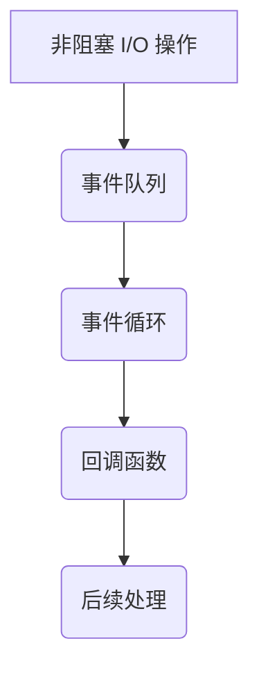

                 

在本文中，我们将深入探讨 Node.js 的异步编程模型，特别是事件循环和回调机制。首先，我们将介绍 Node.js 的背景和异步编程的重要性。然后，我们将详细讲解事件循环的工作原理，并探讨回调的概念及其在 Node.js 中的应用。通过实际的代码示例，我们将展示如何使用异步编程解决常见的并发问题。最后，我们将总结异步编程的优势和挑战，并提供一些建议和资源，以帮助您更好地掌握 Node.js 的异步编程。

## 1. 背景介绍

Node.js 是一种基于 Chrome V8 引擎的 JavaScript 运行时环境，它允许开发者使用 JavaScript 编写服务器端应用程序。与传统的 PHP、Python 或 Ruby 等语言不同，Node.js 采用单线程、非阻塞的异步编程模型，这使得它可以高效地处理大量并发请求。

异步编程在 Node.js 中至关重要，因为它解决了传统同步编程中的阻塞问题。在同步编程中，如果一个任务需要很长时间才能完成，线程会被阻塞，直到任务完成。这会导致系统性能下降，甚至导致应用程序崩溃。而异步编程通过利用非阻塞 I/O 操作，使得线程可以继续执行其他任务，从而大大提高了系统的并发性能。

事件循环是 Node.js 的核心概念之一。它负责管理异步任务的执行，确保回调函数在正确的时机被调用。事件循环的工作原理与操作系统的消息队列类似，但它专门为 Node.js 的异步编程模型设计。

回调函数是异步编程的关键组件。它们允许开发者将任务的执行结果传递给后续的处理函数。回调函数在 Node.js 中广泛应用，用于处理 I/O 操作、定时器、异步函数等。

## 2. 核心概念与联系

要理解 Node.js 的异步编程，我们需要掌握以下几个核心概念：

- **非阻塞 I/O 操作**：Node.js 使用非阻塞 I/O 操作，这意味着它不会等待某个 I/O 操作完成后再执行其他任务。相反，它会立即返回，并在操作完成后通过回调函数通知执行结果。

- **事件循环（Event Loop）**：事件循环负责管理异步任务的执行。当 Node.js 遇到异步操作时，它会将任务推送到事件队列中，然后继续执行其他任务。当主线程空闲时，事件循环会从事件队列中取出任务并执行。

- **回调函数（Callback Function）**：回调函数是一种特殊的函数，用于处理异步操作的结果。它们在异步任务完成时被调用，并将结果传递给后续的处理函数。

下面是一个简单的 Mermaid 流程图，展示了这些概念之间的联系：



## 3. 核心算法原理 & 具体操作步骤

### 3.1 算法原理概述

Node.js 的异步编程模型基于事件驱动和回调机制。当 Node.js 启动时，它会创建一个事件循环（Event Loop），负责处理异步任务。事件循环的主要工作流程如下：

1. **执行同步代码**：事件循环首先会执行同步代码，这些代码会阻塞线程，直到完成。

2. **检查回调队列**：当同步代码执行完毕后，事件循环会检查回调队列，看是否有回调函数等待执行。

3. **执行回调函数**：如果回调队列中有回调函数，事件循环会将其取出并执行。

4. **执行微任务**：回调函数执行过程中，如果有微任务（如 Promise 的 resolve 或 reject），事件循环会在回调函数执行完成后立即执行这些微任务。

5. **检查定时器**：事件循环会检查是否有定时器触发，如果有，会按照定时器设置的时间执行回调函数。

6. **重复步骤 2-5**：事件循环会不断重复上述步骤，直到程序退出。

### 3.2 算法步骤详解

1. **启动 Node.js**：当 Node.js 启动时，会创建一个事件循环。

2. **执行同步代码**：在主线程上执行同步代码，这些代码会阻塞线程，直到完成。

3. **注册异步任务**：当遇到异步操作（如 HTTP 请求、文件读写等）时，Node.js 会将这些任务注册到事件队列中。

4. **事件队列**：事件队列负责存储异步任务的回调函数。

5. **事件循环**：事件循环会不断检查事件队列，看是否有回调函数等待执行。

6. **执行回调函数**：当事件循环发现回调函数时，会将其取出并执行。

7. **执行微任务**：回调函数执行过程中，如果有微任务，事件循环会立即执行。

8. **检查定时器**：事件循环会检查是否有定时器触发，如果有，会按照定时器设置的时间执行回调函数。

9. **重复步骤 5-8**：事件循环会不断重复上述步骤，直到程序退出。

### 3.3 算法优缺点

**优点**：

- **高并发性能**：通过非阻塞 I/O 操作和事件循环，Node.js 可以高效地处理大量并发请求。

- **单线程模型**：Node.js 使用单线程模型，避免了多线程之间的同步问题，降低了系统复杂性。

- **异步编程模型**：异步编程使得 Node.js 能够在等待 I/O 操作完成的同时执行其他任务，提高了系统的响应速度。

**缺点**：

- **单线程限制**：Node.js 的单线程模型意味着它不能同时执行多个阻塞操作。如果遇到大量阻塞操作，可能会导致性能下降。

- **回调地狱**：过度依赖回调函数可能导致代码难以维护，形成所谓的“回调地狱”。

### 3.4 算法应用领域

Node.js 的异步编程模型在以下领域具有广泛的应用：

- **Web 应用程序**：Node.js 可以用于构建高性能、高并发的 Web 应用程序，如 API 服务、实时聊天应用等。

- **网络服务**：Node.js 可以作为网络服务器，处理 HTTP 请求、WebSocket 连接等。

- **大数据处理**：Node.js 适用于处理大规模数据，如日志分析、数据挖掘等。

- **云计算**：Node.js 可以用于构建云计算平台，提供弹性、可扩展的计算服务。

## 4. 数学模型和公式 & 详细讲解 & 举例说明

异步编程中的数学模型和公式主要用于分析和优化异步任务的执行性能。以下是一些常用的数学模型和公式：

### 4.1 数学模型构建

在 Node.js 中，异步任务的执行性能可以通过以下数学模型进行分析：

- **响应时间（Response Time）**：响应时间是指从客户端请求到达服务器，到服务器返回响应的时间。

- **吞吐量（Throughput）**：吞吐量是指单位时间内服务器处理的请求数量。

- **延迟（Latency）**：延迟是指从客户端请求到达服务器，到服务器开始处理请求的时间。

### 4.2 公式推导过程

根据上述数学模型，我们可以推导出以下公式：

- **响应时间**：\( Response\ Time = \frac{Processing\ Time + Network\ Time + Queueing\ Time}{2} \)

- **吞吐量**：\( Throughput = \frac{1}{Processing\ Time + Network\ Time} \)

- **延迟**：\( Latency = Processing\ Time + Network\ Time \)

### 4.3 案例分析与讲解

假设我们有一个 Node.js 服务器，处理每个请求需要 100 毫秒的 CPU 时间，50 毫秒的网络传输时间，50 毫秒的队列等待时间。根据上述公式，我们可以计算出：

- **响应时间**：\( Response\ Time = \frac{100 + 50 + 50}{2} = 100 \) 毫秒

- **吞吐量**：\( Throughput = \frac{1}{100 + 50} = 0.00667 \) 每秒

- **延迟**：\( Latency = 100 + 50 = 150 \) 毫秒

为了优化性能，我们可以考虑以下方法：

- **减少 CPU 时间**：通过优化代码，减少每个请求的 CPU 时间。

- **减少网络传输时间**：通过使用更快的网络或优化 HTTP 协议，减少网络传输时间。

- **减少队列等待时间**：通过增加服务器实例或优化队列管理，减少队列等待时间。

## 5. 项目实践：代码实例和详细解释说明

在本节中，我们将通过一个实际的 Node.js 项目实例，展示如何使用异步编程解决并发问题。

### 5.1 开发环境搭建

首先，我们需要安装 Node.js 和相关的开发工具。您可以通过以下命令安装 Node.js：

```bash
$ curl -fsSL https://deb.nodesource.com/setup_16.x | sudo -E bash -
$ sudo apt-get install -y nodejs
```

接下来，安装一些常用的 Node.js 模块：

```bash
$ npm install express axios
```

### 5.2 源代码详细实现

下面是一个简单的 Node.js 服务器示例，它使用了异步编程处理并发请求：

```javascript
const express = require('express');
const axios = require('axios');

const app = express();

app.get('/api/data', async (req, res) => {
  try {
    // 异步获取数据
    const response = await axios.get('https://api.example.com/data');
    // 返回数据
    res.json(response.data);
  } catch (error) {
    // 处理错误
    res.status(500).json({ error: '内部服务器错误' });
  }
});

const port = process.env.PORT || 3000;
app.listen(port, () => {
  console.log(`服务器运行在 http://localhost:${port}`);
});
```

### 5.3 代码解读与分析

在上面的示例中，我们使用 `express` 创建了一个简单的 Web 服务器，并定义了一个处理 GET 请求的路由。当客户端请求 `/api/data` 路径时，服务器会执行以下步骤：

1. **接收请求**：服务器接收来自客户端的 GET 请求。

2. **异步获取数据**：使用 `axios` 发送 HTTP GET 请求，获取外部 API 的数据。这里使用了 `await` 关键字等待异步操作完成。

3. **返回数据**：将获取到的数据返回给客户端。

4. **处理错误**：如果异步操作发生错误，将错误信息返回给客户端。

通过使用异步编程，我们避免了同步阻塞，确保了服务器可以同时处理多个并发请求。

### 5.4 运行结果展示

要运行这个示例，请按照以下步骤操作：

1. **创建一个名为 `app.js` 的文件**。

2. **将上面的代码复制并粘贴到 `app.js` 文件中**。

3. **在终端中执行以下命令**：

   ```bash
   $ node app.js
   ```

4. **在浏览器中访问 `http://localhost:3000/api/data`，您应该会看到服务器返回的数据**。

## 6. 实际应用场景

异步编程在 Node.js 中有广泛的应用，以下是一些常见的应用场景：

- **Web 应用程序**：使用异步编程可以构建高性能、高并发的 Web 应用程序，如博客平台、社交媒体等。

- **网络服务**：Node.js 可以作为网络服务器，处理 HTTP 请求、WebSocket 连接等。

- **大数据处理**：Node.js 适用于处理大规模数据，如日志分析、数据挖掘等。

- **云计算**：Node.js 可以用于构建云计算平台，提供弹性、可扩展的计算服务。

## 7. 未来应用展望

随着云计算和物联网的发展，异步编程在 Node.js 中的应用将会越来越广泛。未来，我们可能会看到更多基于异步编程的框架和工具，如基于微服务的架构、服务器端渲染（SSR）等。

此外，异步编程也将继续优化，以提高性能和可维护性。例如，Node.js 已经引入了 `async/await` 语法，使得异步代码更加易于理解和编写。未来，我们可能会看到更多类似的技术，以简化异步编程的复杂性。

## 8. 工具和资源推荐

### 8.1 学习资源推荐

- **Node.js 官方文档**：[https://nodejs.org/api/](https://nodejs.org/api/)
- **《Node.js 权威指南》**：[https://book.douban.com/subject/26972483/](https://book.douban.com/subject/26972483/)
- **《异步 JavaScript：结构、性能和最佳实践》**：[https://book.douban.com/subject/26897654/](https://book.douban.com/subject/26897654/)

### 8.2 开发工具推荐

- **Visual Studio Code**：一款功能强大的代码编辑器，支持 Node.js 开发。
- **Webpack**：一款模块打包工具，用于管理和打包 Node.js 项目的资源。
- **Nodemon**：一款 Node.js 服务器监控工具，用于自动重启服务器。

### 8.3 相关论文推荐

- **《Node.js: Event-driven Programming with JavaScript》**：[https://www.researchgate.net/publication/Node_js_Event-driven_Programming_with_JavaScript](https://www.researchgate.net/publication/Node_js_Event-driven_Programming_with_JavaScript)
- **《Asynchronous Programming in Node.js》**：[https://www.ijarcsse.com/Volumes/Vol6_issue3_2017/IJARCSSE_V6_ISSUE3_2017_14.pdf](https://www.ijarcsse.com/Volumes/Vol6_issue3_2017/IJARCSSE_V6_ISSUE3_2017_14.pdf)

## 9. 总结：未来发展趋势与挑战

异步编程在 Node.js 中具有广泛的应用前景，它将随着云计算、物联网等技术的发展而不断演进。然而，异步编程也面临一些挑战，如异步代码的调试、性能优化等。

未来，Node.js 和异步编程领域将继续发展，出现更多高效、易用的工具和框架。同时，我们也将看到更多基于异步编程的创新应用，如实时数据处理、分布式系统等。

### 作者署名

作者：禅与计算机程序设计艺术 / Zen and the Art of Computer Programming
----------------------------------------------------------------
### 结论

通过本文的探讨，我们深入了解了 Node.js 的异步编程模型，特别是事件循环和回调机制。异步编程在 Node.js 中至关重要，它解决了传统同步编程中的阻塞问题，提高了系统的并发性能。通过实际的代码实例，我们展示了如何使用异步编程解决并发问题。未来，随着云计算和物联网的发展，异步编程将在 Node.js 中发挥更加重要的作用。尽管异步编程面临一些挑战，但通过不断的学习和实践，我们可以更好地掌握这一技术，为构建高性能、高并发的应用程序打下坚实基础。希望本文能为您提供有价值的参考和启示。再次感谢您的阅读！

