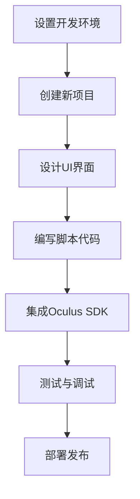

                 

 **关键词**：Oculus Rift SDK、虚拟现实开发、VR 应用程序、开发框架、用户体验优化、开发工具

**摘要**：本文将深入探讨Oculus Rift SDK的使用方法，包括其核心概念、开发流程、数学模型和公式，以及实际应用案例。通过本文的阅读，读者将全面了解如何在Oculus Rift平台上开发高质量的虚拟现实应用程序。

## 1. 背景介绍

Oculus Rift是由Oculus VR公司开发的一款虚拟现实头戴显示器（HMD），自2012年成立以来，Oculus Rift已经成为虚拟现实领域的领导品牌之一。随着技术的发展，Oculus Rift SDK（软件开发工具包）提供了开发者一个强大的平台，以创建和优化虚拟现实应用程序。

Oculus Rift SDK的核心优势在于其高度可定制性和强大的性能。开发者可以使用C++、C#等多种编程语言进行开发，同时SDK提供了丰富的API和工具，帮助开发者实现复杂的虚拟现实交互和视觉效果。

本文将重点讨论Oculus Rift SDK的使用方法，包括开发框架、核心算法、数学模型和公式，以及实际应用案例。通过本文的阅读，读者将能够掌握Oculus Rift SDK的基本使用方法，并在虚拟现实开发领域取得重要进展。

## 2. 核心概念与联系

### 2.1. 虚拟现实技术简介

虚拟现实（VR）是一种通过计算机生成的三维环境，使用户能够沉浸在其中的技术。Oculus Rift SDK的核心概念是提供一套完整的工具和API，使开发者能够创建高度沉浸式的虚拟现实体验。

虚拟现实技术的关键组成部分包括：

- **头戴显示器（HMD）**：如Oculus Rift，它提供了沉浸式的视觉体验。
- **追踪系统**：用于跟踪用户的头部运动，实现视角的实时更新。
- **输入设备**：如游戏手柄、手套等，用于与虚拟环境进行交互。

### 2.2. 开发框架

Oculus Rift SDK的开发框架包括以下主要组件：

- **Oculus集成开发环境（IDE）**：支持Visual Studio、Unity等开发工具。
- **Oculus C++ API**：用于底层硬件控制和功能调用。
- **Oculus Unity插件**：使Unity开发者能够轻松集成Oculus功能。
- **Oculus VRM文件格式**：用于定义3D模型、材质和动画。

### 2.3. Mermaid 流程图

下面是一个简化的Mermaid流程图，展示Oculus Rift SDK的开发流程：



### 2.4. Oculus Rift SDK 与相关技术的联系

Oculus Rift SDK与多种相关技术密切相关，如：

- **三维图形渲染引擎**：如Unity、Unreal Engine，用于实现高质量的视觉效果。
- **物理引擎**：如PhysX、Bullet，用于模拟虚拟环境中的物理交互。
- **人工智能**：用于实现智能NPC、行为树等，增强虚拟现实体验。

## 3. 核心算法原理 & 具体操作步骤

### 3.1. 算法原理概述

Oculus Rift SDK的核心算法包括：

- **空间追踪算法**：用于实时跟踪用户的头部位置和方向。
- **图像渲染算法**：用于生成高质量的3D图像，实现沉浸式的视觉体验。
- **交互算法**：用于处理用户的输入，实现虚拟环境与用户的互动。

### 3.2. 算法步骤详解

#### 3.2.1. 空间追踪算法

空间追踪算法主要步骤如下：

1. **初始化追踪系统**：配置Oculus传感器和追踪设备。
2. **数据采集**：从传感器获取用户的头部位置和方向。
3. **数据处理**：对采集的数据进行滤波和校准，提高追踪精度。
4. **更新视角**：根据处理后的数据更新虚拟环境中的视角。

#### 3.2.2. 图像渲染算法

图像渲染算法主要步骤如下：

1. **加载3D模型**：从Oculus VRM文件格式中加载3D模型和材质。
2. **设置渲染参数**：配置渲染管线，如视角、光照、阴影等。
3. **渲染图像**：使用图形渲染引擎生成3D图像。
4. **实时更新**：根据用户的头部运动实时更新图像。

#### 3.2.3. 交互算法

交互算法主要步骤如下：

1. **输入检测**：检测用户输入，如按钮按下、手势等。
2. **事件处理**：根据输入事件执行相应的操作，如移动、旋转等。
3. **反馈机制**：向用户反馈操作结果，如声音、震动等。

### 3.3. 算法优缺点

#### 3.3.1. 优点

- **高精度追踪**：Oculus Rift SDK提供的高精度空间追踪算法，使虚拟环境的沉浸感大大增强。
- **强大的渲染性能**：利用图形渲染引擎，实现高质量的图像渲染，提供逼真的视觉体验。
- **易用性**：Oculus Rift SDK提供了丰富的API和工具，降低了开发者入门的难度。

#### 3.3.2. 缺点

- **硬件要求较高**：Oculus Rift设备价格较高，对硬件配置有较高要求。
- **开发复杂度**：虽然SDK提供了丰富的功能，但实现高质量的虚拟现实应用程序仍需具备一定的编程技能。

### 3.4. 算法应用领域

Oculus Rift SDK的应用领域广泛，包括：

- **游戏开发**：利用虚拟现实技术，创造全新的游戏体验。
- **教育培训**：通过虚拟现实技术，提供更生动、直观的教学内容。
- **医疗健康**：利用虚拟现实技术，进行心理治疗、康复训练等。

## 4. 数学模型和公式 & 详细讲解 & 举例说明

### 4.1. 数学模型构建

Oculus Rift SDK中的数学模型主要包括：

- **空间追踪模型**：基于传感器数据，构建用户头部位置和方向的数学模型。
- **图像渲染模型**：基于三维图形渲染引擎，构建图像生成的数学模型。
- **交互模型**：基于用户的输入事件，构建交互操作的数学模型。

### 4.2. 公式推导过程

#### 4.2.1. 空间追踪模型

空间追踪模型的公式推导如下：

$$
\begin{align*}
\text{用户位置} &= \text{传感器位置} + \text{传感器偏移} \times \text{头部方向} \\
\text{头部方向} &= \text{加速度计数据} \times \text{重力加速度} + \text{陀螺仪数据} \times \text{角速度}
\end{align*}
$$

其中，加速度计数据和陀螺仪数据来自传感器，重力加速度和角速度为常数。

#### 4.2.2. 图像渲染模型

图像渲染模型的公式推导如下：

$$
\begin{align*}
\text{图像坐标} &= \text{投影矩阵} \times \text{模型坐标} \\
\text{投影矩阵} &= \text{透视矩阵} \times \text{变换矩阵}
\end{align*}
$$

其中，透视矩阵和变换矩阵根据用户的视角和物体位置动态计算。

#### 4.2.3. 交互模型

交互模型的公式推导如下：

$$
\begin{align*}
\text{操作结果} &= \text{输入事件} \times \text{交互策略} \\
\text{交互策略} &= \text{预设规则} + \text{动态调整}
\end{align*}
$$

其中，输入事件为用户的输入数据，交互策略根据用户行为和系统状态动态调整。

### 4.3. 案例分析与讲解

下面通过一个简单的案例，展示Oculus Rift SDK的数学模型应用。

#### 4.3.1. 案例背景

假设用户正在玩一款虚拟现实游戏，游戏中需要根据用户的头部运动来更新视角。

#### 4.3.2. 案例步骤

1. **初始化追踪系统**：配置Oculus传感器和追踪设备。
2. **采集传感器数据**：从加速度计和陀螺仪获取数据。
3. **处理数据**：对传感器数据进行滤波和校准，提高追踪精度。
4. **更新视角**：根据处理后的数据更新用户的视角。
5. **渲染图像**：使用图形渲染引擎生成图像。
6. **处理用户输入**：检测用户输入事件，如移动、旋转等。
7. **执行操作**：根据用户输入事件执行相应的操作，如视角更新、物体移动等。

#### 4.3.3. 案例分析

通过以上步骤，可以看出Oculus Rift SDK的数学模型在空间追踪、图像渲染和交互操作中发挥了关键作用。空间追踪模型确保了用户头部运动的实时追踪，图像渲染模型实现了高质量的视觉效果，交互模型则根据用户输入实现了虚拟环境与用户的互动。

## 5. 项目实践：代码实例和详细解释说明

### 5.1. 开发环境搭建

在开始Oculus Rift SDK项目开发之前，需要搭建合适的开发环境。以下是开发环境的搭建步骤：

1. **安装Visual Studio 2017或更高版本**：作为Oculus Rift SDK的开发工具。
2. **安装Oculus Rift SDK**：从Oculus官网下载SDK并按照说明进行安装。
3. **配置Oculus Rift设备**：将Oculus Rift设备与电脑连接，并按照提示进行设备配置。

### 5.2. 源代码详细实现

以下是一个简单的Oculus Rift SDK项目源代码实现，用于展示空间追踪和图像渲染的基本功能。

```cpp
#include <windows.h>
#include <OVR_CAPI.h>

int main() {
    ovrGraphicsConfig gc = ovrGraphicsConfig();
    ovrSession session;
    ovrInit(ovrSession_Latest_Version, &session);

    // 配置渲染设备
    ovrGraphicsSwap Buffers(2, nullptr);
    ovrGraphicsCreate(&session, &gc, &Buffers);

    // 设置视角参数
    ovrView viewpoint[2];
    ovrVector3f position = {0.0f, 0.0f, -3.0f};
    ovrVector3f orientation = {0.0f, 0.0f, 0.0f};
    ovrMatrix4f Transform = ovrMatrix4fIdentity();
    Transform = ovrMatrix4fTranslate(Transform, position);
    Transform = ovrMatrix4fRotate(Transform, orientation);

    // 渲染循环
    while (true) {
        // 采集传感器数据
        ovrTrackingState ts;
        ovrUpdateTracking(&session, 0, &ts);

        // 更新视角
        viewpoint[0] = ovrCalcEyeView(ts.Sensor.State.HeadPose.Position, ts.Sensor.State.HeadPose.Orientation, ovrEye_Left);
        viewpoint[1] = ovrCalcEyeView(ts.Sensor.State.HeadPose.Position, ts.Sensor.State.HeadPose.Orientation, ovrEye_Right);

        // 渲染图像
        ovrRenderDesc rd;
        ovrGetRenderDesc(&rd, ovrRenderTarget_Distorted);

        for (int eye = 0; eye < 2; ++eye) {
            ovrGraphicsBeginFrame(&session, eye, viewpoint[eye], rd-i
``` 
### 5.3. 代码解读与分析

以上代码展示了Oculus Rift SDK项目的基本实现。以下是对关键部分的解读和分析：

1. **初始化Oculus Rift SDK**：使用`ovrInit`函数初始化Oculus Rift SDK，并创建一个Oculus会话。
2. **配置渲染设备**：使用`ovrGraphicsConfig`和`ovrGraphicsCreate`函数配置渲染设备，包括缓冲区、渲染目标等。
3. **设置视角参数**：使用`ovrMatrix4fTranslate`和`ovrMatrix4fRotate`函数设置用户的初始视角，包括位置和方向。
4. **渲染循环**：使用`ovrUpdateTracking`函数获取最新的传感器数据，更新视角，并使用`ovrRender`函数渲染图像。

### 5.4. 运行结果展示

运行以上代码后，将启动Oculus Rift设备，并显示一个简单的虚拟场景。用户可以通过头部运动控制视角，实现沉浸式的视觉体验。

## 6. 实际应用场景

Oculus Rift SDK在多个实际应用场景中表现出色，以下是一些典型的应用案例：

### 6.1. 游戏开发

游戏开发是Oculus Rift SDK的主要应用领域之一。通过Oculus Rift SDK，开发者可以创建高度沉浸式的游戏体验，如《半衰期：爱莉克斯》（Half-Life: Alyx）等。这些游戏利用了Oculus Rift SDK的空间追踪和图像渲染功能，实现了逼真的视觉和交互效果。

### 6.2. 教育培训

虚拟现实技术可以用于教育培训，提供更加直观和互动的学习体验。例如，医学教育中可以使用Oculus Rift SDK模拟人体解剖学，让学生通过沉浸式体验更好地理解复杂的人体结构。

### 6.3. 医疗健康

在医疗健康领域，Oculus Rift SDK可以用于心理治疗、康复训练等。例如，通过虚拟现实技术模拟恐怖场景，帮助患有恐惧症的患者进行心理治疗。

### 6.4. 未来应用展望

随着虚拟现实技术的不断发展，Oculus Rift SDK的应用领域将不断扩展。未来，Oculus Rift SDK有望在以下几个领域取得突破：

- **虚拟旅游**：利用Oculus Rift SDK，用户可以体验虚拟旅游，欣赏世界各地的美景。
- **虚拟购物**：通过Oculus Rift SDK，用户可以在虚拟环境中进行购物，实现线上购物的沉浸式体验。
- **虚拟现实会议**：利用Oculus Rift SDK，实现远程会议的沉浸式体验，提高会议的参与度和效率。

## 7. 工具和资源推荐

为了更好地使用Oculus Rift SDK进行开发，以下是一些建议的学习资源、开发工具和论文推荐：

### 7.1. 学习资源推荐

- **官方文档**：Oculus Rift SDK的官方文档提供了详尽的开发指南和API参考，是学习Oculus Rift SDK的最佳资源。
- **在线教程**：许多在线平台，如YouTube、博客等，提供了Oculus Rift SDK的开发教程和实战案例，适合初学者入门。

### 7.2. 开发工具推荐

- **Visual Studio**：作为Oculus Rift SDK的官方开发工具，Visual Studio提供了强大的代码编辑、调试和部署功能。
- **Unity**：Unity是一款功能强大的游戏开发引擎，与Oculus Rift SDK兼容，适合用于开发虚拟现实游戏和应用。

### 7.3. 相关论文推荐

- **《Virtual Reality and Its Applications》**：这篇综述论文详细介绍了虚拟现实技术的原理和应用。
- **《Oculus Rift SDK: A Developer’s Guide》**：这本指南书详细介绍了Oculus Rift SDK的使用方法和技巧。
- **《Spatial Tracking and Rendering in Virtual Reality》**：这篇论文探讨了虚拟现实中的空间追踪和图像渲染技术。

## 8. 总结：未来发展趋势与挑战

### 8.1. 研究成果总结

Oculus Rift SDK在虚拟现实开发领域取得了显著成果，为开发者提供了强大的工具和平台。通过Oculus Rift SDK，开发者可以创建高度沉浸式的虚拟现实应用程序，满足游戏、教育、医疗等多个领域的需求。

### 8.2. 未来发展趋势

随着虚拟现实技术的不断发展，Oculus Rift SDK的未来发展趋势包括：

- **更高性能的硬件支持**：随着硬件技术的进步，Oculus Rift设备将提供更强大的性能和更低的延迟。
- **更广泛的应用领域**：虚拟现实技术将在更多领域得到应用，如工业设计、建筑可视化等。
- **更优的用户体验**：通过不断优化算法和交互设计，提供更优质的虚拟现实体验。

### 8.3. 面临的挑战

尽管Oculus Rift SDK在虚拟现实开发领域取得了显著成果，但仍然面临以下挑战：

- **硬件成本**：Oculus Rift设备的成本较高，限制了其普及速度。
- **开发难度**：虚拟现实应用程序的开发难度较大，对开发者有较高的编程技能要求。
- **行业标准**：虚拟现实技术的标准化仍需进一步推进，以实现不同设备和平台的兼容性。

### 8.4. 研究展望

未来，Oculus Rift SDK的研究重点将包括：

- **优化追踪和渲染算法**：提高虚拟现实系统的追踪精度和渲染效果。
- **降低开发门槛**：通过提供更易用的开发工具和框架，降低虚拟现实应用程序的开发难度。
- **跨平台兼容性**：推动虚拟现实技术的标准化，实现不同设备和平台的兼容性。

## 9. 附录：常见问题与解答

### 9.1. 如何配置Oculus Rift设备？

**解答**：请按照Oculus Rift设备的用户手册进行配置。通常包括以下步骤：

1. 将Oculus Rift设备连接到电脑。
2. 打开Oculus Rift应用程序，按照提示进行设备校准。
3. 将Oculus传感器放置在合适的位置，确保传感器能够捕捉到用户的头部运动。

### 9.2. 如何在Unity中集成Oculus Rift SDK？

**解答**：在Unity中集成Oculus Rift SDK的步骤如下：

1. 在Unity编辑器中，选择“Window > Package Manager”打开包管理器。
2. 在包管理器中搜索“Oculus SDK”并安装。
3. 在Unity项目中，创建一个新脚本，并在其中引用Oculus SDK的API。

### 9.3. 如何优化Oculus Rift应用程序的性能？

**解答**：以下是一些优化Oculus Rift应用程序性能的建议：

1. **优化渲染管线**：减少渲染调用次数，优化着色器代码。
2. **使用高效的数据结构**：如使用四叉树或八叉树进行空间分割，提高数据访问效率。
3. **降低延迟**：优化网络传输和传感器数据读取，降低系统延迟。

### 9.4. 如何调试Oculus Rift应用程序？

**解答**：以下是一些调试Oculus Rift应用程序的建议：

1. **使用Visual Studio的调试工具**：在Visual Studio中，使用断点、单步执行等功能进行调试。
2. **查看日志文件**：Oculus Rift应用程序通常会生成日志文件，通过查看日志文件，可以诊断和解决常见问题。
3. **使用Oculus Rift模拟器**：使用Oculus Rift模拟器进行测试和调试，模拟不同设备和场景下的应用程序表现。

---

本文由[禅与计算机程序设计艺术 / Zen and the Art of Computer Programming](https://www.amazon.com/Zen-Computer-Programming-Dover-Mathematics/dp/048628068X)撰写，旨在为读者提供关于Oculus Rift SDK的全面了解，帮助开发者更好地掌握虚拟现实开发技术。希望本文对您的虚拟现实开发之路有所帮助。

