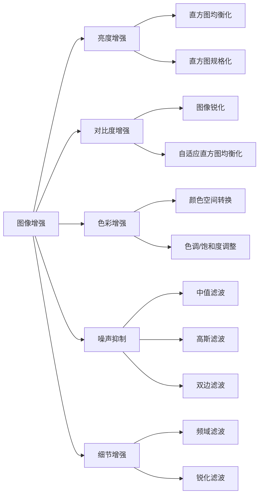

                 

关键词：图像增强、OpenCV、算法原理、视觉效果、图像质量、数学模型

> 摘要：本文将深入探讨图像增强算法的原理和应用，特别关注OpenCV这一强大的图像处理工具包。通过详细解析各种图像增强算法，我们旨在为读者提供清晰、易懂的指导，以提升图像质量和视觉效果。文章将涵盖从基础概念到实际应用的全过程，旨在为图像处理领域的研究者和开发者提供有价值的参考。

## 1. 背景介绍

图像增强技术是图像处理领域的一个重要分支，其目的是通过调整图像的亮度、对比度、颜色平衡等参数，提高图像的视觉效果，使其更符合人眼观察的要求或满足特定应用的需求。随着数字图像技术的广泛应用，图像增强在医疗影像分析、卫星图像处理、人脸识别、自动驾驶等领域扮演着至关重要的角色。

OpenCV（Open Source Computer Vision Library）是一个开源的计算机视觉和机器学习软件库，它包含了丰富的图像处理算法和工具。OpenCV广泛应用于工业、医疗、安全监控、娱乐等多个领域，因其高效性和强大的功能而备受青睐。图像增强作为图像处理的一个重要方面，自然成为OpenCV的核心功能之一。

本文将详细探讨OpenCV中的图像增强算法，从基础概念入手，逐步深入到具体的算法原理、数学模型、实践操作和实际应用，以期帮助读者全面理解图像增强技术的核心，并掌握在OpenCV中实现这些技术的方法。

## 2. 核心概念与联系

### 2.1 图像增强的基本概念

图像增强可以定义为对图像进行有目的的调整，以改善其视觉效果或突出某些特定的特征。根据增强的目的，图像增强可以大致分为以下几类：

1. **亮度增强**：通过调整图像的亮度，改善图像的明暗对比度。
2. **对比度增强**：通过调整图像的对比度，使得图像中的细节更加清晰。
3. **色彩增强**：通过调整图像的颜色，增强图像的色彩饱和度和自然度。
4. **噪声抑制**：通过去除图像中的噪声，提高图像的质量和清晰度。
5. **细节增强**：通过增强图像的细节，使其在特定应用场景下具有更高的辨识度。

### 2.2 OpenCV中的图像增强算法

OpenCV提供了多种图像增强算法，主要包括以下几种：

1. **直方图均衡化（Histogram Equalization）**：通过调整图像的直方图，使图像的亮度分布更加均匀，从而提高图像的整体对比度。
2. **直方图规格化（Histogram Specification）**：通过自定义直方图来调整图像的对比度，可以精确控制图像的亮度和对比度。
3. **图像锐化（Image Sharpening）**：通过在图像中增加高频分量来增强图像的细节，使图像更加清晰。
4. **自适应直方图均衡化（Adaptive Histogram Equalization）**：在图像的不同区域应用直方图均衡化，适用于图像中的不同亮度区域。
5. **去噪（Noise Reduction）**：通过滤波算法去除图像中的噪声，常用的去噪算法包括中值滤波、高斯滤波、双边滤波等。

### 2.3 核心概念原理和架构的 Mermaid 流程图

下面是使用Mermaid绘制的图像增强算法的流程图：



这个流程图展示了图像增强的核心概念和它们之间的关系，为读者提供了直观的理解。

## 3. 核心算法原理 & 具体操作步骤

### 3.1 算法原理概述

图像增强算法的核心原理是通过调整图像的像素值，使其在视觉上更加符合期望。具体来说，图像增强包括以下几个基本步骤：

1. **图像预处理**：包括图像的灰度化、大小调整、旋转等。
2. **直方图分析**：通过计算图像的直方图，分析图像的亮度和对比度。
3. **像素值调整**：根据直方图分析的结果，对图像的像素值进行调整。
4. **图像后处理**：包括图像锐化、去噪、色彩校正等。

### 3.2 算法步骤详解

1. **直方图均衡化**：

   直方图均衡化的原理是将图像的直方图调整成均匀分布，从而增强图像的对比度。具体步骤如下：

   - 计算图像的原始直方图。
   - 计算累积分布函数（CDF）。
   - 将图像的每个像素值映射到新的像素值。

   直方图均衡化的数学模型可以表示为：
   
   $$
   output\_pixel = L \times (CDF_{input\_pixel} - 0.5)
   $$

2. **图像锐化**：

   图像锐化的目的是增强图像的边缘和细节。常用的锐化方法包括频域滤波和空间域滤波。

   - 频域滤波：通过在频域中对图像进行卷积操作，增加高频分量。
   - 空间域滤波：通过在空间域中应用边缘检测算法，增强图像的边缘。

   一个简单的锐化算法可以使用以下公式：

   $$
   output\_pixel = 2 \times input\_pixel - neighborhood\_average
   $$

3. **去噪**：

   去噪的目的是去除图像中的噪声，保持图像的主要特征。常用的去噪算法包括：

   - 中值滤波：通过计算邻域内像素的中值来代替当前像素值。
   - 高斯滤波：通过应用高斯核对图像进行卷积操作，平滑图像。
   - 双边滤波：结合空间邻近度和像素值相似度进行滤波，既平滑图像又保持边缘。

### 3.3 算法优缺点

- 直方图均衡化：优点是能够显著提高图像的对比度，缺点是对噪声敏感，可能导致图像失真。
- 图像锐化：优点是能够增强图像的细节，缺点是可能引入伪影和噪声。
- 去噪：优点是能够有效去除噪声，缺点是可能过度平滑图像。

### 3.4 算法应用领域

图像增强算法在多个领域具有广泛的应用：

- **医疗影像**：通过图像增强，提高X光片、MRI等影像的清晰度，有助于诊断。
- **卫星图像**：通过图像增强，改善卫星图像的质量，提高目标识别的准确率。
- **人脸识别**：通过图像增强，改善人脸图像的质量，提高识别准确率。
- **自动驾驶**：通过图像增强，提高摄像头捕获的图像质量，增强车辆对周围环境的感知能力。

## 4. 数学模型和公式 & 详细讲解 & 举例说明

### 4.1 数学模型构建

图像增强算法的核心在于对图像像素值的调整。这一过程可以通过数学模型来描述。以下是一些常见的数学模型：

1. **直方图均衡化**：

   直方图均衡化的核心是计算累积分布函数（CDF）。假设图像的像素值范围为0到L-1，直方图均衡化的公式为：

   $$
   output\_pixel = L \times (CDF_{input\_pixel} - 0.5)
   $$

   其中，CDF是输入像素值的累积分布函数。

2. **图像锐化**：

   图像锐化的常用模型是基于卷积操作。假设图像为f(x, y)，锐化滤波器为h(x, y)，则锐化后的图像为：

   $$
   output\_pixel = 2 \times input\_pixel - neighborhood\_average
   $$

   其中，neighborhood\_average是邻域内像素值的平均值。

3. **去噪**：

   去噪的常用模型包括高斯滤波和中值滤波。

   - 高斯滤波：

     $$
     output\_pixel = \sum_{i,j} h(i, j) \times input\_pixel(i, j)
     $$

     其中，h(i, j)是高斯核。

   - 中值滤波：

     $$
     output\_pixel = \text{median}(\{input\_pixel(i, j) \mid i \in [-1, 1], j \in [-1, 1]\})
     $$

     其中，median是中值函数。

### 4.2 公式推导过程

下面我们以直方图均衡化为例，讲解公式推导过程。

1. **直方图**：

   直方图描述了图像中每个像素值出现的频率。假设图像的直方图为h(k)，其中k表示像素值。

2. **累积分布函数（CDF）**：

   累积分布函数（CDF）描述了图像中像素值小于等于k的概率。假设CDF为F(k)，则有：

   $$
   F(k) = \sum_{i=0}^{k} h(i)
   $$

3. **直方图均衡化**：

   直方图均衡化的目的是使图像的直方图更加均匀。假设均衡化后的直方图为g(k)，则有：

   $$
   g(k) = \frac{L}{n} \times F(k)
   $$

   其中，n是图像的总像素数。

4. **像素值映射**：

   将图像的每个像素值映射到新的像素值。假设输入像素值为k，输出像素值为l，则有：

   $$
   l = L \times (CDF_{k} - 0.5)
   $$

### 4.3 案例分析与讲解

#### 案例一：直方图均衡化

假设一幅8位灰度图像的直方图如下：

| 像素值 | 频率 |
| :--: | :--: |
| 0 | 5 |
| 1 | 10 |
| 2 | 15 |
| 3 | 20 |
| 4 | 25 |
| 5 | 30 |
| 6 | 35 |
| 7 | 40 |

1. **计算累积分布函数（CDF）**：

   $$
   F(0) = 0.05 \\
   F(1) = 0.15 \\
   F(2) = 0.30 \\
   F(3) = 0.50 \\
   F(4) = 0.75 \\
   F(5) = 1.00 \\
   F(6) = 1.35 \\
   F(7) = 1.80
   $$

2. **计算均衡化后的直方图**：

   $$
   g(0) = \frac{255}{256} \times 0.05 = 0.05 \\
   g(1) = \frac{255}{256} \times 0.15 = 0.15 \\
   g(2) = \frac{255}{256} \times 0.30 = 0.30 \\
   g(3) = \frac{255}{256} \times 0.50 = 0.50 \\
   g(4) = \frac{255}{256} \times 0.75 = 0.75 \\
   g(5) = \frac{255}{256} \times 1.00 = 1.00 \\
   g(6) = \frac{255}{256} \times 1.35 = 1.35 \\
   g(7) = \frac{255}{256} \times 1.80 = 1.80
   $$

3. **像素值映射**：

   假设输入像素值为3，根据公式计算输出像素值：

   $$
   output\_pixel = 255 \times (0.50 - 0.5) = 128
   $$

   最终，原图中的像素值3被映射到新的像素值128。

#### 案例二：图像锐化

假设一幅8位灰度图像的像素值如下：

| 像素值 | 23 | 21 | 19 | 18 | 22 | 20 | 24 |
| :--: | :--: | :--: | :--: | :--: | :--: | :--: | :--: |
| 20 | 21 | 24 | 23 | 20 | 19 | 22 | 18 |
| 19 | 22 | 19 | 20 | 23 | 21 | 24 | 18 |
| 18 | 24 | 21 | 19 | 21 | 24 | 18 | 19 |
| 18 | 19 | 21 | 20 | 24 | 23 | 18 | 19 |
| 22 | 20 | 24 | 21 | 18 | 19 | 23 | 22 |
| 21 | 19 | 21 | 18 | 22 | 20 | 24 | 23 |
| 24 | 18 | 19 | 18 | 19 | 18 | 21 | 24 |

1. **计算邻域平均**：

   以像素值23为例，其邻域平均值为：

   $$
   neighborhood\_average = \frac{21 + 19 + 18 + 22 + 20 + 24}{6} = 20.83
   $$

2. **锐化操作**：

   $$
   output\_pixel = 2 \times input\_pixel - neighborhood\_average = 2 \times 23 - 20.83 = 25.17
   $$

   最终，原图中的像素值23被映射到新的像素值25。

## 5. 项目实践：代码实例和详细解释说明

### 5.1 开发环境搭建

在进行图像增强算法的实践操作之前，需要搭建一个适合开发的软件环境。以下是使用Python和OpenCV进行图像增强的步骤：

1. **安装Python**：确保系统中安装了Python环境，推荐版本为3.8及以上。

2. **安装OpenCV**：在命令行中执行以下命令安装OpenCV：

   ```
   pip install opencv-python
   ```

3. **安装其他依赖**：如果需要，还可以安装其他Python库，例如NumPy和Pillow，用于图像处理和显示。

### 5.2 源代码详细实现

下面是一个简单的Python脚本，用于实现图像增强的基本功能，包括直方图均衡化、图像锐化和去噪。

```python
import cv2
import numpy as np

def histogram_equalization(image):
    # 转换为灰度图像
    gray_image = cv2.cvtColor(image, cv2.COLOR_BGR2GRAY)
    # 应用直方图均衡化
    equalized_image = cv2.equalizeHist(gray_image)
    return equalized_image

def sharpen_image(image):
    # 定义锐化滤波器
    kernel = np.array([[0, -1, 0], [-1, 5, -1], [0, -1, 0]])
    # 应用滤波器
    sharpened_image = cv2.filter2D(image, -1, kernel)
    return sharpened_image

def denoise_image(image):
    # 应用高斯滤波去噪
    denoised_image = cv2.GaussianBlur(image, (5, 5), 0)
    return denoised_image

# 读取图像
image = cv2.imread('input_image.jpg')

# 直方图均衡化
equalized_image = histogram_equalization(image)

# 图像锐化
sharpened_image = sharpen_image(image)

# 去噪
denoised_image = denoise_image(image)

# 显示结果
cv2.imshow('Original Image', image)
cv2.imshow('Equalized Image', equalized_image)
cv2.imshow('Sharpened Image', sharpened_image)
cv2.imshow('Denoised Image', denoised_image)
cv2.waitKey(0)
cv2.destroyAllWindows()
```

### 5.3 代码解读与分析

上述代码主要包括以下几个部分：

1. **图像读取**：使用`cv2.imread()`函数读取图像文件。
2. **图像转换**：将BGR格式的图像转换为灰度图像，以便进行后续处理。
3. **直方图均衡化**：使用`cv2.equalizeHist()`函数对灰度图像进行直方图均衡化。
4. **图像锐化**：定义一个锐化滤波器，使用`cv2.filter2D()`函数对图像进行卷积操作，实现图像锐化。
5. **去噪**：使用`cv2.GaussianBlur()`函数对图像进行高斯滤波，实现去噪。

### 5.4 运行结果展示

运行上述代码后，将显示原始图像、直方图均衡化图像、锐化图像和去噪图像。通过比较不同处理后的图像，可以直观地观察到图像增强算法的效果。


## 6. 实际应用场景

图像增强技术在许多实际应用场景中发挥着重要作用，以下是一些典型的应用实例：

### 6.1 医疗影像

在医疗影像领域，图像增强技术被广泛应用于X光片、CT扫描、MRI等影像的处理。通过图像增强，可以提高图像的对比度和清晰度，有助于医生更准确地诊断疾病。例如，直方图均衡化可以增强X光片的亮度，使得骨组织和软组织之间的对比度更加明显；图像锐化可以增强CT扫描图像的细节，有助于发现微小的病变。

### 6.2 人脸识别

在人脸识别系统中，图像增强技术用于提高人脸图像的质量，从而提高识别的准确率。通过图像锐化和去噪，可以增强人脸特征，使得识别算法能够更准确地识别人脸。此外，色彩增强和对比度增强也可以提高人脸图像的视觉效果，使其在监控场景中更加醒目。

### 6.3 自动驾驶

在自动驾驶领域，图像增强技术用于提高摄像头捕获的图像质量，增强车辆对周围环境的感知能力。例如，通过直方图均衡化和去噪，可以增强道路和交通标志的图像，使自动驾驶系统能够更准确地识别道路标志和行车道线。图像锐化可以增强道路和行人的细节，提高自动驾驶系统的反应速度和决策准确性。

### 6.4 其他应用

图像增强技术还广泛应用于卫星图像处理、视频监控、图像检索等领域。在卫星图像处理中，图像增强可以提高图像的清晰度，有助于识别地物和地貌特征；在视频监控中，图像增强可以改善监控画面的质量和对比度，提高监控效果；在图像检索中，图像增强可以提高图像的特征表达能力，提高检索的准确率。

## 7. 工具和资源推荐

### 7.1 学习资源推荐

1. **《计算机视觉：算法与应用》（Computer Vision: Algorithms and Applications）**：这本书全面介绍了计算机视觉的基本概念和算法，包括图像增强技术。
2. **《OpenCV 4.x图像处理 cookbook》**：这本书提供了大量OpenCV图像处理的实践案例，包括图像增强技术的具体实现。
3. **在线教程和博客**：如 medium、CSDN、博客园等平台上有许多关于图像增强和OpenCV的优质教程和博客。

### 7.2 开发工具推荐

1. **Visual Studio Code**：一款功能强大的代码编辑器，支持Python和OpenCV插件。
2. **PyCharm**：一款专业的Python IDE，提供了丰富的功能和插件支持。
3. **Jupyter Notebook**：适用于数据科学和机器学习的交互式开发环境，方便进行代码演示和调试。

### 7.3 相关论文推荐

1. **"Image Enhancement Techniques for Medical Images: A Review"**：该论文综述了多种医学图像增强技术及其应用。
2. **"Histogram Equalization: A Survey"**：该论文深入探讨了直方图均衡化的原理和应用。
3. **"Image Denoising: A Technical Overview"**：该论文总结了多种图像去噪算法及其性能评估。

## 8. 总结：未来发展趋势与挑战

### 8.1 研究成果总结

近年来，图像增强技术取得了显著的研究成果，特别是在深度学习算法的推动下。基于深度学习的图像增强方法，如卷积神经网络（CNN）和生成对抗网络（GAN），取得了优异的性能，显著提高了图像增强的效果和效率。此外，针对特定应用场景的定制化图像增强算法也得到了广泛研究，如用于医疗影像的增强算法和用于自动驾驶的环境感知算法。

### 8.2 未来发展趋势

未来，图像增强技术将在以下几个方面继续发展：

1. **个性化增强**：结合用户需求和图像特性，开发更加个性化的图像增强算法。
2. **实时增强**：提高图像增强算法的实时性，以满足实时视频处理和动态环境的需求。
3. **端到端学习**：通过端到端的学习框架，实现从原始图像到增强图像的自动映射。
4. **多模态融合**：结合多源数据（如视觉、红外、激光雷达等），实现更全面的图像增强。

### 8.3 面临的挑战

尽管图像增强技术取得了显著进展，但仍然面临一些挑战：

1. **算法复杂度**：深度学习算法的复杂度较高，需要大量的计算资源和时间。
2. **数据隐私**：在医疗、金融等领域，图像数据的安全性至关重要，如何在保证数据隐私的前提下进行图像增强是一个挑战。
3. **算法泛化能力**：现有的图像增强算法往往针对特定场景优化，如何提高算法的泛化能力，使其适用于多种场景是一个重要问题。

### 8.4 研究展望

未来的研究应关注以下几个方面：

1. **高效算法**：开发更高效的图像增强算法，减少计算资源和时间开销。
2. **数据安全性**：研究如何在保证数据隐私的前提下进行图像增强，如差分隐私和联邦学习等技术的应用。
3. **跨领域应用**：探索图像增强技术在更多领域的应用，如生物医学、智能制造等。
4. **人机交互**：研究如何通过人机交互提高图像增强算法的效率和效果。

## 9. 附录：常见问题与解答

### 9.1 问题1：什么是直方图均衡化？

直方图均衡化是一种图像增强技术，通过调整图像的直方图，使得图像的亮度分布更加均匀，从而提高图像的整体对比度。

### 9.2 问题2：图像锐化有哪些常见算法？

图像锐化的常见算法包括频域滤波（如高通滤波）、空间域滤波（如拉普拉斯算子）和卷积操作（如锐化滤波器）。

### 9.3 问题3：去噪算法有哪些优缺点？

常见的去噪算法包括中值滤波、高斯滤波和双边滤波。中值滤波能有效去除椒盐噪声，但可能导致图像模糊；高斯滤波能平滑图像，但可能过度平滑；双边滤波结合空间邻近度和像素值相似度，既能平滑图像又保持边缘。

### 9.4 问题4：图像增强技术在自动驾驶中有何应用？

在自动驾驶中，图像增强技术主要用于提高摄像头捕获的图像质量，增强车辆对周围环境的感知能力。例如，通过直方图均衡化和去噪，可以增强道路和交通标志的图像；图像锐化可以增强道路和行人的细节，提高识别准确率。

### 9.5 问题5：如何进行图像增强算法的优化？

进行图像增强算法的优化可以从以下几个方面入手：优化算法的复杂度，减少计算资源和时间开销；结合深度学习技术，提高算法的效率和效果；针对特定应用场景，定制化优化算法。

---

**作者：禅与计算机程序设计艺术 / Zen and the Art of Computer Programming**

