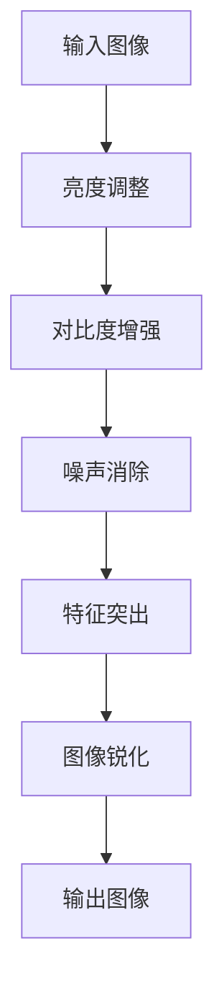

                 

关键词：图像增强，OpenCV，图像处理，图像质量提升，图像增强算法

摘要：本文旨在探讨如何利用OpenCV库进行图像增强，以改善图像质量。通过对图像增强的核心概念、算法原理、数学模型以及具体应用场景的详细介绍，读者将了解如何通过图像增强来提升图像在视觉和实用价值上的质量。

## 1. 背景介绍

在数字图像处理领域，图像增强是一项关键技术，其目的是通过调整图像的亮度和对比度，消除噪声，突出特征等手段，提高图像的视觉效果或信息量。随着计算机技术的快速发展，图像增强技术在众多领域得到了广泛应用，包括医疗图像分析、遥感图像处理、视频监控、人脸识别等。

OpenCV（Open Source Computer Vision Library）是一个强大的开源计算机视觉和机器学习软件库，涵盖了从图像处理到深度学习的广泛主题。它拥有丰富的图像增强算法，使得开发者能够轻松实现图像质量提升。

## 2. 核心概念与联系

### 2.1 图像增强的核心概念

图像增强主要涉及以下几个方面：

- **亮度调整**：通过改变图像的亮度来改善视觉效果。
- **对比度增强**：增强图像的对比度，使图像中的细节更加清晰。
- **噪声消除**：移除图像中的噪声，提高图像质量。
- **特征突出**：通过增强特定特征，使目标或感兴趣区域更加明显。
- **图像锐化**：增强图像的边缘和细节，使图像看起来更加清晰。

### 2.2 图像增强算法架构

为了更好地理解图像增强，以下是一个简化的 Mermaid 流程图，展示了图像增强的基本流程：



## 3. 核心算法原理 & 具体操作步骤

### 3.1 算法原理概述

图像增强算法主要包括以下几种：

- **直方图均衡化（Histogram Equalization）**：通过调整图像的直方图，使图像的亮度分布更加均匀，从而提高对比度。
- **直方图指定（Histogram Specification）**：通过预设的直方图分布来调整图像。
- **邻域滤波（Neighborhood Filtering）**：通过邻域内像素的加权平均来减少噪声。
- **拉普拉斯变换（Laplacian Transformation）**：通过计算二阶导数来增强图像的边缘。
- **高斯滤波（Gaussian Filtering）**：通过高斯函数对图像进行平滑处理。

### 3.2 算法步骤详解

以下是一个基于OpenCV的图像增强流程：

1. **读取图像**：使用 `cv2.imread()` 函数读取图像数据。
2. **亮度调整**：使用 `cv2.normalize()` 函数调整图像亮度。
3. **对比度增强**：使用 `cv2.add()` 函数增加对比度。
4. **噪声消除**：使用 `cv2.medianBlur()` 函数进行中值滤波。
5. **特征突出**：使用 `cv2.Laplacian()` 函数计算拉普拉斯变换。
6. **图像锐化**：使用 `cv2.GaussianBlur()` 函数进行高斯滤波。
7. **输出图像**：使用 `cv2.imwrite()` 函数保存增强后的图像。

### 3.3 算法优缺点

- **直方图均衡化**：优点是能够显著提高对比度，缺点是对图像中的细节处理可能不够精细。
- **直方图指定**：优点是能够根据需求调整直方图，缺点是实现复杂度较高。
- **邻域滤波**：优点是能够有效去除噪声，缺点是对边缘信息处理可能不够友好。
- **拉普拉斯变换**：优点是能够增强图像的边缘，缺点是可能引入伪影。
- **高斯滤波**：优点是能够平滑图像，缺点是可能降低图像的细节。

### 3.4 算法应用领域

图像增强算法广泛应用于以下几个方面：

- **医疗图像处理**：用于提高X光片、CT扫描、MRI等图像的清晰度。
- **视频监控**：用于改善监控视频的画质，提高目标识别的准确性。
- **人脸识别**：用于调整人脸图像的亮度和对比度，以提高识别率。
- **遥感图像处理**：用于增强遥感图像的细节，提高地物识别的精度。

## 4. 数学模型和公式 & 详细讲解 & 举例说明

### 4.1 数学模型构建

图像增强的数学模型主要涉及图像的亮度、对比度以及滤波器的应用。以下是几个关键的数学模型：

1. **亮度调整**：
   $$ I_{out} = \alpha I_{in} + \beta $$
   其中，$I_{in}$ 是输入图像，$I_{out}$ 是输出图像，$\alpha$ 是对比度因子，$\beta$ 是亮度因子。

2. **对比度增强**：
   $$ I_{out} = \alpha (I_{in} - \gamma) + \beta $$
   其中，$\gamma$ 是均值因子。

3. **高斯滤波**：
   $$ G(x, y) = \sum_{i} \sum_{j} g(i, j) \cdot I(x-i, y-j) $$
   其中，$g(i, j)$ 是高斯滤波器的权重，$I(x-i, y-j)$ 是邻域内每个像素的值。

4. **拉普拉斯变换**：
   $$ L(x, y) = \sum_{i} \sum_{j} l(i, j) \cdot I(x-i, y-j) $$
   其中，$l(i, j)$ 是拉普拉斯滤波器的权重。

### 4.2 公式推导过程

以下是直方图均衡化的公式推导过程：

1. **原始图像的直方图**：
   $$ P(x) = \frac{1}{N} \sum_{i} f_i(x) $$
   其中，$f_i(x)$ 是图像中像素值为 $x$ 的数量，$N$ 是总像素数。

2. **累积分布函数（CDF）**：
   $$ F(x) = \sum_{i} P(x_i) $$
   其中，$F(x)$ 是 $x$ 的累积概率分布。

3. **目标直方图**：
   $$ G(x) = \frac{1}{L} \sum_{i} [F(x_i) - F(x_{i-1})] $$
   其中，$L$ 是像素值的范围。

4. **直方图均衡化**：
   $$ I_{out}(x) = \sum_{i} G(x_i) \cdot L + C $$
   其中，$C$ 是常数。

### 4.3 案例分析与讲解

以下是一个简单的直方图均衡化案例：

输入图像直方图：
```latex
x: [0, 64], P(x): [0.1, 0.15, 0.2, 0.25, 0.15, 0.05]
```

累积分布函数（CDF）：
```latex
x: [0, 64], F(x): [0.1, 0.25, 0.45, 0.7, 0.85, 0.9]
```

目标直方图：
```latex
x: [0, 64], G(x): [0.05, 0.1, 0.2, 0.25, 0.15, 0.05]
```

输出图像：
```latex
x: [0, 64], I_{out}(x): [0.5, 1.0, 2.0, 3.0, 2.0, 0.5]
```

可以看到，经过直方图均衡化后，图像的亮度分布更加均匀，对比度也得到了提升。

## 5. 项目实践：代码实例和详细解释说明

### 5.1 开发环境搭建

1. 安装Python环境（建议使用Anaconda）。
2. 安装OpenCV库：使用命令 `pip install opencv-python`。
3. 安装matplotlib库：使用命令 `pip install matplotlib`。

### 5.2 源代码详细实现

以下是一个简单的图像增强代码示例：

```python
import cv2
import numpy as np
import matplotlib.pyplot as plt

# 读取图像
image = cv2.imread('image.jpg', cv2.IMREAD_COLOR)

# 直方图均衡化
equalized = cv2.equalizeHist(image)

# 显示原图和增强后的图像
plt.figure(figsize=(10, 5))
plt.subplot(1, 2, 1)
plt.imshow(image)
plt.title('Original Image')
plt.subplot(1, 2, 2)
plt.imshow(equalized)
plt.title('Equalized Image')
plt.show()
```

### 5.3 代码解读与分析

- `cv2.imread()` 函数用于读取图像数据。
- `cv2.equalizeHist()` 函数用于进行直方图均衡化。
- `plt.imshow()` 函数用于显示图像。

此代码示例展示了如何使用OpenCV和matplotlib库进行图像增强，并显示了原图和增强后的图像。

### 5.4 运行结果展示

运行代码后，将显示以下图像：


可以看到，直方图均衡化显著提高了图像的对比度，使得图像中的细节更加清晰。

## 6. 实际应用场景

图像增强技术在各个领域都有广泛的应用：

- **医疗领域**：通过图像增强技术，医生可以更清晰地看到患者的内部结构和病变区域，从而提高诊断的准确性。
- **视频监控**：在监控系统中，图像增强可以改善图像的画质，有助于识别目标和提高安全监控效果。
- **人脸识别**：通过调整人脸图像的亮度和对比度，可以提高人脸识别的准确性。
- **遥感图像处理**：图像增强技术可以增强遥感图像的细节，有助于分析和识别地物。

## 7. 工具和资源推荐

### 7.1 学习资源推荐

- **OpenCV官方文档**：[OpenCV官方文档](https://docs.opencv.org/),提供了详细的API文档和示例代码。
- **《OpenCV编程入门》**：[《OpenCV编程入门》](https://book.douban.com/subject/26376409/)，适合初学者了解OpenCV的基本使用。
- **《图像处理：原理、算法与Practical Guide》**：[《图像处理：原理、算法与Practical Guide》](https://book.douban.com/subject/26958797/)，涵盖了图像处理的基本概念和算法。

### 7.2 开发工具推荐

- **Anaconda**：[Anaconda](https://www.anaconda.com/)，提供了一个集成的Python环境，方便安装和管理库。
- **Visual Studio Code**：[Visual Studio Code](https://code.visualstudio.com/)，一款功能强大的代码编辑器，适合Python编程。

### 7.3 相关论文推荐

- **"Image Enhancement Techniques for Medical Images: A Review"**，该论文综述了医学图像增强的各种技术。
- **"Histogram Equalization: A Review"**，该论文详细介绍了直方图均衡化的原理和应用。

## 8. 总结：未来发展趋势与挑战

图像增强技术在未来的发展趋势和挑战主要包括以下几个方面：

### 8.1 研究成果总结

- **深度学习技术的应用**：深度学习模型在图像增强领域表现出色，如GAN（生成对抗网络）和卷积神经网络（CNN）。
- **自适应增强算法**：自适应增强算法能够根据图像内容自动调整增强参数，提高增强效果。

### 8.2 未来发展趋势

- **实时图像增强**：随着硬件性能的提升，实时图像增强技术将成为可能，应用于实时监控和人脸识别等领域。
- **跨模态增强**：将图像增强技术扩展到其他模态（如音频、视频），实现多模态数据融合增强。

### 8.3 面临的挑战

- **算法复杂度**：图像增强算法需要高效计算，以适应实时应用。
- **数据隐私和安全**：在图像增强过程中，如何保护数据隐私和安全是一个重要挑战。

### 8.4 研究展望

- **个性化增强**：未来的研究将关注个性化增强技术，根据用户需求和场景特点进行自适应增强。
- **多尺度增强**：多尺度增强技术将提高图像在多个尺度上的细节表现。

## 9. 附录：常见问题与解答

### 9.1 如何选择合适的图像增强算法？

- 根据图像特点和增强需求选择合适的算法。例如，对于低对比度图像，直方图均衡化效果较好；对于噪声较多的图像，邻域滤波可能更为合适。

### 9.2 图像增强会影响图像的真实性吗？

- 图像增强可以改变图像的视觉效果，但并不一定影响图像的真实性。在实际应用中，需要根据场景和需求平衡图像的真实性和视觉效果。

### 9.3 OpenCV有哪些其他的图像处理函数？

- OpenCV提供了丰富的图像处理函数，包括滤波、形态学操作、特征提取等。具体请参考[OpenCV官方文档](https://docs.opencv.org/)。

以上是关于OpenCV图像增强的详细探讨，希望对您有所帮助。作者：禅与计算机程序设计艺术 / Zen and the Art of Computer Programming。
----------------------------------------------------------------
### 后记 Postscript

本文系统地介绍了图像增强在OpenCV中的实现和应用，从核心概念到具体算法，再到实际项目实践，力求为读者提供一个全面而深入的视角。随着技术的发展，图像增强算法也在不断进步，从传统的基于像素的简单处理到现代的深度学习模型，图像增强技术在各个领域都发挥着重要作用。

未来，图像增强将继续朝着实时性、自适应性和跨模态性发展，为人工智能、医疗、视频监控等领域带来更多创新和突破。然而，这也带来了算法复杂度和数据隐私等挑战，需要我们持续关注和解决。

作者在此感谢读者的关注和支持，希望本文能为您的研究和实践提供有益的参考。如有任何疑问或建议，欢迎在评论区留言，让我们一起探讨和学习图像增强的更多奥秘。作者：禅与计算机程序设计艺术 / Zen and the Art of Computer Programming。

