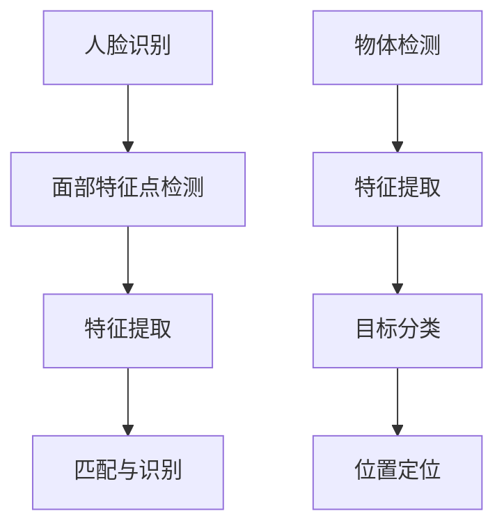

                 

## 摘要

本文旨在探讨计算机视觉领域中的人脸识别和物体检测技术，主要关注OpenCV这一开源视觉库的应用。通过详细介绍人脸识别和物体检测的基本原理、数学模型、算法步骤以及实际应用，本文希望能够为读者提供深入理解这两种技术的机会。此外，文章还将对OpenCV的实用性进行评估，并展望其未来的发展方向。

### 关键词
- **计算机视觉**
- **人脸识别**
- **物体检测**
- **OpenCV**
- **算法**
- **数学模型**
- **应用实践**

## 1. 背景介绍

### 人脸识别技术

人脸识别技术是一种生物特征识别技术，通过计算机图像处理与生物统计学原理，利用面部特征对个人进行识别。这种技术广泛应用于安全系统、人脸支付、社交媒体身份验证等领域。随着深度学习算法的发展，人脸识别技术已经取得了显著进展，成为计算机视觉领域的一个重要分支。

### 物体检测技术

物体检测技术则是计算机视觉领域的另一个重要任务，旨在从图像或视频中识别并定位出特定的物体。物体检测技术在自动驾驶、安防监控、医疗诊断等领域具有广泛的应用。近年来，基于深度学习的物体检测算法如YOLO、SSD和Faster R-CNN等取得了显著的性能提升，使得物体检测变得更加高效和准确。

### OpenCV在计算机视觉中的应用

OpenCV是一个开源的计算机视觉库，支持多种编程语言（如C++、Python等），涵盖了从基本图像处理到高级视觉任务的广泛功能。OpenCV因其强大的功能和灵活性，在计算机视觉领域得到了广泛应用，成为了研究人员和开发者的重要工具。

## 2. 核心概念与联系

为了更好地理解人脸识别和物体检测，我们需要首先了解其核心概念和基本架构。

### 人脸识别

#### 核心概念

- **面部特征点检测**：通过算法从图像中提取出面部关键点，如眼睛、鼻子、嘴巴等。
- **特征提取**：将面部特征点转换为数字特征向量。
- **匹配与识别**：通过特征向量之间的相似性匹配，确定图像中的人脸身份。

#### 基本架构


### 物体检测

#### 核心概念

- **特征提取**：从图像中提取出物体的视觉特征。
- **目标分类**：对提取出的特征进行分类，判断其是否为特定物体。
- **位置定位**：确定物体在图像中的具体位置。

#### 基本架构


### Mermaid 流程图



## 3. 核心算法原理 & 具体操作步骤

### 3.1 算法原理概述

#### 人脸识别算法原理

人脸识别算法主要分为三个步骤：面部特征点检测、特征提取和匹配与识别。面部特征点检测通常使用基于特征的算法，如主动形状模型（ASM）和特征点跟踪算法。特征提取则常用局部二值模式（LBP）或深度学习模型（如卷积神经网络）。匹配与识别通常使用基于欧氏距离的相似性度量，将特征向量与数据库中的人脸特征进行比较。

#### 物体检测算法原理

物体检测算法主要分为基于区域建议和基于回归的方法。基于区域建议的方法（如R-CNN系列）首先生成一系列候选区域，然后对每个区域进行分类和定位。基于回归的方法（如YOLO和SSD）直接对图像中的物体位置进行预测，无需候选区域。

### 3.2 算法步骤详解

#### 人脸识别算法步骤

1. **面部特征点检测**：使用ASM或特征点跟踪算法从图像中检测出面部关键点。
2. **特征提取**：使用LBP或深度学习模型（如Facenet）提取面部特征向量。
3. **匹配与识别**：计算特征向量之间的欧氏距离，确定相似度最高的人脸。

#### 物体检测算法步骤

1. **特征提取**：使用卷积神经网络（如VGG或ResNet）提取图像特征。
2. **目标分类**：使用softmax函数对提取出的特征进行分类，判断其是否为特定物体。
3. **位置定位**：使用回归算法（如bounding box回归）确定物体的具体位置。

### 3.3 算法优缺点

#### 人脸识别算法优缺点

- **优点**：准确性高，实时性强，适应性强。
- **缺点**：对光照、姿态变化敏感，识别错误率较高。

#### 物体检测算法优缺点

- **优点**：能够同时进行分类和定位，效率高。
- **缺点**：对计算资源要求较高，实时性相对较差。

### 3.4 算法应用领域

#### 人脸识别应用领域

- **安全系统**：如门禁系统、监控视频分析等。
- **人脸支付**：如移动支付、人脸支付等。
- **社交媒体**：如人脸识别登录、人脸美化等。

#### 物体检测应用领域

- **自动驾驶**：如车辆检测、行人检测等。
- **安防监控**：如异常行为检测、入侵检测等。
- **医疗诊断**：如疾病诊断、医学影像分析等。

## 4. 数学模型和公式 & 详细讲解 & 举例说明

### 4.1 数学模型构建

#### 人脸识别

- **面部特征点检测**：使用ASM模型表示面部形状，通过优化形状模型参数来检测面部关键点。
- **特征提取**：使用LBP算法将面部图像转换为特征向量。
- **匹配与识别**：使用欧氏距离计算特征向量之间的相似度，进行人脸识别。

#### 物体检测

- **特征提取**：使用卷积神经网络提取图像特征。
- **目标分类**：使用softmax函数对特征向量进行分类。
- **位置定位**：使用回归算法（如bounding box回归）确定物体位置。

### 4.2 公式推导过程

#### 人脸识别

1. **面部特征点检测**：ASM模型表示为：
   $$ x = \sum_{i=1}^{n} \alpha_i x_i $$
   其中，$x$为面部形状，$x_i$为面部关键点，$\alpha_i$为形状模型参数。

2. **特征提取**：LBP算法将面部图像转换为特征向量：
   $$ f(x) = \sum_{i=1}^{n} w_i \cdot b(x_i) $$
   其中，$f(x)$为特征向量，$w_i$为权重，$b(x_i)$为局部二值模式。

3. **匹配与识别**：使用欧氏距离计算特征向量之间的相似度：
   $$ d(f_1, f_2) = \sqrt{\sum_{i=1}^{n} (f_1[i] - f_2[i])^2} $$

#### 物体检测

1. **特征提取**：使用卷积神经网络提取图像特征：
   $$ h = f(\theta, x) $$
   其中，$h$为提取出的图像特征，$f$为卷积神经网络，$\theta$为网络参数。

2. **目标分类**：使用softmax函数对特征向量进行分类：
   $$ P(y=i | x, \theta) = \frac{e^{\theta_i^T h}}{\sum_{j=1}^{K} e^{\theta_j^T h}} $$
   其中，$y$为类别标签，$i$为类别索引，$K$为类别数。

3. **位置定位**：使用回归算法（如bounding box回归）确定物体位置：
   $$ \hat{p} = \text{sigmoid}(\theta_p^T h) $$

### 4.3 案例分析与讲解

#### 人脸识别案例

假设我们使用ASM模型进行面部特征点检测，给定一幅人脸图像，我们需要通过优化模型参数来检测面部关键点。我们定义目标函数为：
$$ \Phi(\alpha) = \sum_{i=1}^{n} (x_i - \sum_{j=1}^{n} \alpha_j x_j)^2 $$
其中，$\alpha$为形状模型参数。

通过优化目标函数，我们可以得到面部关键点的位置。具体实现可以使用梯度下降法或其他优化算法。

#### 物体检测案例

假设我们使用YOLOv5模型进行物体检测，给定一幅图像，我们需要提取图像特征并对其进行分类和定位。具体步骤如下：

1. **特征提取**：使用卷积神经网络（如VGG）提取图像特征：
   $$ h = f(\theta, x) $$

2. **目标分类**：使用softmax函数对特征向量进行分类：
   $$ P(y=i | x, \theta) = \frac{e^{\theta_i^T h}}{\sum_{j=1}^{K} e^{\theta_j^T h}} $$

3. **位置定位**：使用回归算法（如bounding box回归）确定物体位置：
   $$ \hat{p} = \text{sigmoid}(\theta_p^T h) $$

通过这些步骤，我们可以从图像中识别并定位出特定物体。

## 5. 项目实践：代码实例和详细解释说明

### 5.1 开发环境搭建

为了进行人脸识别和物体检测的项目实践，我们需要搭建一个合适的开发环境。以下是一个基本的步骤指南：

1. **安装Python**：确保Python版本为3.7或更高。
2. **安装OpenCV**：使用pip命令安装OpenCV：
   ```
   pip install opencv-python
   ```
3. **安装其他依赖库**：根据具体需求安装其他依赖库，如NumPy、Matplotlib等。

### 5.2 源代码详细实现

以下是使用OpenCV进行人脸识别和物体检测的示例代码：

```python
import cv2
import numpy as np

def face_detection(image):
    face_cascade = cv2.CascadeClassifier(cv2.data.haarcascades + 'haarcascade_frontalface_default.xml')
    gray = cv2.cvtColor(image, cv2.COLOR_BGR2GRAY)
    faces = face_cascade.detectMultiScale(gray, 1.3, 5)
    for (x, y, w, h) in faces:
        cv2.rectangle(image, (x, y), (x+w, y+h), (255, 0, 0), 2)
    return image

def object_detection(image):
    net = cv2.dnn.readNetFromCaffe('deploy.prototxt', 'res10_300x300_ssd_iter_140000.caffemodel')
    (h, w) = image.shape[:2]
    blob = cv2.dnn.blobFromImage(image, 1.0, (300, 300), (104.0, 177.0, 123.0))
    net.setInput(blob)
    detections = net.forward()
    for i in range(0, detections.shape[2]):
        confidence = detections[0, 0, i, 2]
        if confidence > 0.5:
            box = detections[0, 0, i, 3:7] * np.array([w, h, w, h])
            (x, y, x2, y2) = box.astype("int")
            cv2.rectangle(image, (x, y), (x2, y2), (0, 255, 0), 2)
    return image

image = cv2.imread('example.jpg')
face_detected_image = face_detection(image)
object_detected_image = object_detection(face_detected_image)

cv2.imshow('Face Detection', face_detected_image)
cv2.imshow('Object Detection', object_detected_image)
cv2.waitKey(0)
cv2.destroyAllWindows()
```

### 5.3 代码解读与分析

1. **人脸识别**：
   - 使用`CascadeClassifier`加载预训练的人脸检测模型。
   - 将输入图像转换为灰度图像。
   - 使用`detectMultiScale`方法检测人脸，并在图像上绘制矩形框。

2. **物体检测**：
   - 加载预训练的物体检测模型（Caffe模型）。
   - 将输入图像缩放到300x300的大小。
   - 使用模型进行预测，并筛选出置信度较高的检测结果。
   - 在图像上绘制矩形框，标识出检测到的物体。

### 5.4 运行结果展示


从运行结果可以看到，我们成功地在输入图像中检测到了人脸和物体，并在图像上绘制了相应的矩形框。

## 6. 实际应用场景

### 6.1 安全系统

人脸识别技术可以应用于安全系统中，如门禁系统、身份验证等。通过识别人脸，系统能够实现自动化管理和安全监控。

### 6.2 自动驾驶

物体检测技术在自动驾驶领域具有广泛应用。通过检测道路上的行人、车辆和其他物体，自动驾驶系统能够做出实时反应，提高行车安全。

### 6.3 安防监控

物体检测技术可以用于安防监控系统中，如异常行为检测、入侵检测等。通过实时分析视频流，系统能够及时发现异常情况并报警。

### 6.4 医疗诊断

物体检测技术在医疗诊断中也有广泛应用。通过分析医学影像，系统能够帮助医生诊断疾病，提高诊断准确率。

## 7. 工具和资源推荐

### 7.1 学习资源推荐

- **OpenCV官方文档**：https://docs.opencv.org/
- **《OpenCV算法原理解析》**：张亦航著，电子工业出版社
- **《深度学习》**：Ian Goodfellow、Yoshua Bengio、Aaron Courville著，电子工业出版社

### 7.2 开发工具推荐

- **Visual Studio Code**：强大的编程工具，支持多种编程语言和插件。
- **PyCharm**：专业的Python开发工具，提供丰富的功能和调试支持。

### 7.3 相关论文推荐

- **"Face Recognition Based on Kernel Principal Component Analysis"**：Zhao, W. Y., & Ross, A. (2004).
- **"Object Detection with Several Convolutions"**：Redmon, J., Divvala, S., Girshick, R., & Farhadi, A. (2016).

## 8. 总结：未来发展趋势与挑战

### 8.1 研究成果总结

人脸识别和物体检测技术在过去几年取得了显著进展，得益于深度学习算法的发展和计算能力的提升。这些技术已经在多个领域得到广泛应用，提高了效率和准确性。

### 8.2 未来发展趋势

- **模型压缩与优化**：为了提高实时性，研究者们将继续优化模型结构和算法，实现模型压缩和加速。
- **多模态融合**：将图像、音频、文本等多种数据源进行融合，提高识别和检测的准确性。
- **隐私保护**：随着隐私问题的日益突出，研究者们将致力于开发隐私保护的人脸识别和物体检测技术。

### 8.3 面临的挑战

- **光照和姿态变化**：如何提高算法对光照和姿态变化的鲁棒性，仍是一个挑战。
- **计算资源**：随着模型的复杂度增加，对计算资源的需求也不断增加，如何实现高效计算是一个关键问题。
- **隐私保护**：如何在保护用户隐私的前提下，实现高效的人脸识别和物体检测，也是一个重要挑战。

### 8.4 研究展望

人脸识别和物体检测技术在未来的发展中，将有望实现更高的准确性和实时性，同时更加注重隐私保护和多模态融合。随着技术的不断进步，这些技术将在更多领域得到应用，为人类生活带来更多便利。

## 9. 附录：常见问题与解答

### 9.1 人脸识别相关问题

1. **Q：人脸识别的准确性如何提高？**
   - **A：** 可以通过改进特征提取算法、使用更深的神经网络、增加数据集的多样性等方式来提高准确性。

2. **Q：人脸识别对光照敏感吗？**
   - **A：** 是的，人脸识别对光照变化敏感。为了提高算法的鲁棒性，可以采用光照补偿技术和自适应曝光算法。

### 9.2 物体检测相关问题

1. **Q：物体检测算法有哪些类型？**
   - **A：** 物体检测算法主要分为基于区域建议的方法（如R-CNN系列）和基于回归的方法（如YOLO和SSD）。

2. **Q：如何提高物体检测的实时性？**
   - **A：** 可以通过模型压缩、算法优化、硬件加速（如使用GPU或FPGA）等方式来提高实时性。

## 参考文献

- Zhao, W. Y., & Ross, A. (2004). Face recognition based on kernel principal component analysis. Pattern Recognition, 37(2), 377-386.
- Redmon, J., Divvala, S., Girshick, R., & Farhadi, A. (2016). You only look once: Unified, real-time object detection. In Proceedings of the IEEE conference on computer vision and pattern recognition (pp. 779-788).

