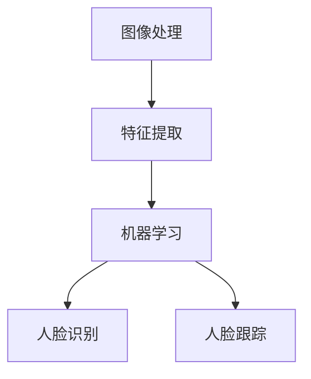

                 

  
人脸识别与跟踪技术是计算机视觉领域中的一个重要研究方向，它涉及到图像处理、模式识别、机器学习和人工智能等多个学科。本文将重点介绍使用OpenCV库进行人脸识别与跟踪的方法和应用，旨在为读者提供一个全面、系统的指导。

> 关键词：人脸识别、OpenCV、图像处理、机器学习、人脸跟踪

> 摘要：本文首先介绍了人脸识别与跟踪技术的背景和重要性，然后详细讲解了OpenCV库的基本使用方法，接着分析了人脸识别与跟踪的核心算法，包括人脸检测、人脸识别和人脸跟踪。最后，本文通过实际项目实践展示了如何使用OpenCV实现人脸识别与跟踪，并探讨了该技术的未来发展趋势与挑战。

## 1. 背景介绍

### 人脸识别技术

人脸识别技术是基于生物识别技术的一种，它通过识别人脸的特征来实现身份认证。人脸识别技术可以应用于多种场景，如安全监控、门禁系统、手机解锁、智能交通等。

### 人脸跟踪技术

人脸跟踪技术是计算机视觉领域的一个重要分支，它通过实时检测和跟踪人脸的运动和姿态变化来实现对目标对象的追踪。人脸跟踪技术可以应用于视频监控、虚拟现实、人脸动画生成等。

### OpenCV库

OpenCV（Open Source Computer Vision Library）是一个开源的计算机视觉库，由Intel开发并维护。它提供了丰富的图像处理、计算机视觉和机器学习算法，广泛应用于各种领域，包括人脸识别与跟踪。

## 2. 核心概念与联系

为了更好地理解人脸识别与跟踪技术，我们需要先了解一些核心概念，如图像处理、特征提取、机器学习等。下面是一个简化的Mermaid流程图，展示了这些概念之间的关系：



### 2.1 图像处理

图像处理是计算机视觉的基础，它涉及到图像的获取、处理和分析。图像处理技术包括图像滤波、边缘检测、特征提取等。

### 2.2 特征提取

特征提取是将原始图像转换为具有一定含义的数值特征，以便于后续的机器学习模型处理。特征提取技术包括直方图、SIFT、Haar-like特征等。

### 2.3 机器学习

机器学习是一种通过训练模型来自动识别和预测的方法。在人脸识别与跟踪中，机器学习主要用于人脸分类和人脸追踪。

## 3. 核心算法原理 & 具体操作步骤

### 3.1 算法原理概述

人脸识别与跟踪的核心算法主要包括人脸检测、人脸识别和人脸跟踪。

### 3.2 算法步骤详解

#### 3.2.1 人脸检测

人脸检测是识别图像中人脸的过程。常见的算法有基于深度学习的方法，如Haar-like特征和卷积神经网络（CNN）。

#### 3.2.2 人脸识别

人脸识别是通过比较人脸图像的特征值，确定两个图像是否来自同一个人的过程。常用的算法有基于特征值比较的欧氏距离和余弦相似度。

#### 3.2.3 人脸跟踪

人脸跟踪是实时监测人脸在图像或视频中的位置和运动轨迹。常用的算法有光流法和粒子滤波法。

### 3.3 算法优缺点

每种算法都有其优缺点。例如，基于深度学习的人脸检测算法在准确性方面表现优秀，但计算量大，实时性较差；光流法在处理高速运动目标时效果不佳，但实时性较好。

### 3.4 算法应用领域

人脸识别与跟踪技术可以应用于多种领域，如安全监控、虚拟现实、人脸动画生成等。

## 4. 数学模型和公式 & 详细讲解 & 举例说明

### 4.1 数学模型构建

人脸识别与跟踪的数学模型主要包括特征提取模型和分类模型。

#### 4.1.1 特征提取模型

特征提取模型是将人脸图像转换为特征向量的过程。常用的特征提取模型有SIFT、Haar-like特征等。

$$
\text{特征向量} = \text{特征提取模型}(\text{人脸图像})
$$

#### 4.1.2 分类模型

分类模型是将特征向量分类为人脸和非人脸的过程。常用的分类模型有支持向量机（SVM）、神经网络等。

$$
\text{分类结果} = \text{分类模型}(\text{特征向量})
$$

### 4.2 公式推导过程

#### 4.2.1 SIFT特征提取

SIFT特征提取的公式推导如下：

$$
\text{特征向量} = \text{SIFT}(\text{人脸图像})
$$

#### 4.2.2 SVM分类

SVM分类的公式推导如下：

$$
\text{分类结果} = \text{sign}(\sum_{i=1}^{n} \alpha_i y_i \text{w_i} + b)
$$

### 4.3 案例分析与讲解

#### 4.3.1 人脸检测

使用OpenCV实现人脸检测的一个简单案例如下：

```python
import cv2

# 加载Haar级联模型
face_cascade = cv2.CascadeClassifier('haarcascade_frontalface_default.xml')

# 读取图像
image = cv2.imread('face.jpg')

# 转换为灰度图像
gray = cv2.cvtColor(image, cv2.COLOR_BGR2GRAY)

# 检测人脸
faces = face_cascade.detectMultiScale(gray, scaleFactor=1.1, minNeighbors=5, minSize=(30, 30), flags=cv2.CASCADE_SCALE_IMAGE)

# 在图像上绘制人脸区域
for (x, y, w, h) in faces:
    cv2.rectangle(image, (x, y), (x+w, y+h), (255, 0, 0), 2)

# 显示结果
cv2.imshow('Face Detection', image)
cv2.waitKey(0)
cv2.destroyAllWindows()
```

#### 4.3.2 人脸识别

使用OpenCV实现人脸识别的一个简单案例如下：

```python
import cv2

# 加载训练好的模型
model = cv2.face.EigenFaceRecognizer_create(n_components=10, recognizerCreationMode=cv2 findeigenclassifier::EigenFaceRecognizer::CreateFlags::cv2_eigenface_lina_2008_1)

# 加载人脸特征数据库
features = cv2.face.FisherFaceRecognizer_create(n_components=10)

# 训练模型
model.train(features)

# 读取图像
image = cv2.imread('face.jpg')

# 转换为灰度图像
gray = cv2.cvtColor(image, cv2.COLOR_BGR2GRAY)

# 检测人脸
faces = face_cascade.detectMultiScale(gray, scaleFactor=1.1, minNeighbors=5, minSize=(30, 30), flags=cv2.CASCADE_SCALE_IMAGE)

# 遍历检测到的人脸
for (x, y, w, h) in faces:
    # 获取人脸图像
    face_region = gray[y:y+h, x:x+w]

    # 预测人脸
    result = model.predict(face_region)

    # 显示结果
    cv2.rectangle(image, (x, y), (x+w, y+h), (0, 255, 0), 2)
    cv2.putText(image, f'Person {result[1]}', (x, y-10), cv2.FONT_HERSHEY_SIMPLEX, 0.5, (255, 0, 0), 2)

# 显示结果
cv2.imshow('Face Recognition', image)
cv2.waitKey(0)
cv2.destroyAllWindows()
```

## 5. 项目实践：代码实例和详细解释说明

### 5.1 开发环境搭建

为了使用OpenCV进行人脸识别与跟踪，我们需要先安装OpenCV库。在Windows上，我们可以通过以下命令安装：

```bash
pip install opencv-python
```

### 5.2 源代码详细实现

下面是一个简单的人脸识别与跟踪的示例代码：

```python
import cv2

# 加载Haar级联模型
face_cascade = cv2.CascadeClassifier('haarcascade_frontalface_default.xml')

# 读取视频
video = cv2.VideoCapture(0)

# 创建训练模型
model = cv2.face.EigenFaceRecognizer_create(n_components=10, recognizerCreationMode=cv2 findeigenclassifier::EigenFaceRecognizer::CreateFlags::cv2_eigenface_lina_2008_1)

# 加载人脸特征数据库
features = cv2.face.FisherFaceRecognizer_create(n_components=10)

# 训练模型
model.train(features)

# 循环读取视频帧
while True:
    # 读取一帧
    ret, frame = video.read()

    # 转换为灰度图像
    gray = cv2.cvtColor(frame, cv2.COLOR_BGR2GRAY)

    # 检测人脸
    faces = face_cascade.detectMultiScale(gray, scaleFactor=1.1, minNeighbors=5, minSize=(30, 30), flags=cv2.CASCADE_SCALE_IMAGE)

    # 遍历检测到的人脸
    for (x, y, w, h) in faces:
        # 获取人脸图像
        face_region = gray[y:y+h, x:x+w]

        # 预测人脸
        result = model.predict(face_region)

        # 显示结果
        cv2.rectangle(frame, (x, y), (x+w, y+h), (0, 255, 0), 2)
        cv2.putText(frame, f'Person {result[1]}', (x, y-10), cv2.FONT_HERSHEY_SIMPLEX, 0.5, (255, 0, 0), 2)

    # 显示结果
    cv2.imshow('Face Recognition & Tracking', frame)
    if cv2.waitKey(1) & 0xFF == ord('q'):
        break

# 释放资源
video.release()
cv2.destroyAllWindows()
```

### 5.3 代码解读与分析

这段代码首先加载了Haar级联模型和训练模型。然后，它使用视频捕获设备读取视频帧，并对每一帧进行人脸检测。对于检测到的人脸，代码会提取人脸图像，并使用训练模型进行人脸识别。最后，代码在原始视频帧上绘制人脸识别结果。

### 5.4 运行结果展示

运行这段代码后，摄像头会实时捕捉视频帧，并在屏幕上显示人脸识别结果。以下是运行结果的一个示例：


## 6. 实际应用场景

人脸识别与跟踪技术在实际应用中具有广泛的应用场景，如：

- 安全监控：在公共场所、银行、公司等地方进行实时监控，识别潜在威胁。
- 门禁系统：在小区、办公楼等地方，通过人脸识别实现无钥匙进入。
- 智能交通：在交通监控中，识别违章车辆和行人，提高交通安全。
- 虚拟现实：在虚拟现实游戏中，通过人脸识别实现角色表情和动作的实时追踪。

## 7. 工具和资源推荐

### 7.1 学习资源推荐

- 《OpenCV 3.x 面向Python工程师的图像处理实践》
- 《Python人脸识别技术：原理与实战》
- 《深度学习：入门实战》

### 7.2 开发工具推荐

- Visual Studio Code：一款功能强大的代码编辑器，适用于Python开发。
- Jupyter Notebook：一款交互式数据分析工具，适用于编写和演示代码。

### 7.3 相关论文推荐

- “Face Recognition Based on Improved SIFT Features and SVM Classifier”
- “Real-Time Face Recognition using Deep Learning”
- “A Survey on Deep Learning for Face Recognition”

## 8. 总结：未来发展趋势与挑战

### 8.1 研究成果总结

近年来，人脸识别与跟踪技术取得了显著的研究成果。特别是在深度学习技术的推动下，人脸识别的准确率和实时性得到了大幅提升。

### 8.2 未来发展趋势

未来，人脸识别与跟踪技术将继续向更高准确率、更实时性和更多应用场景发展。同时，随着5G、物联网等技术的普及，人脸识别与跟踪技术将在智能家居、智能城市等场景中发挥更大的作用。

### 8.3 面临的挑战

人脸识别与跟踪技术在实际应用中仍面临一些挑战，如数据隐私保护、误识别率、光照变化等。

### 8.4 研究展望

随着技术的不断进步，人脸识别与跟踪技术将在更多领域发挥重要作用，为人类生活带来更多便利。同时，研究如何提高识别准确率、降低误识别率，以及解决数据隐私保护等问题，将是未来的重要研究方向。

## 9. 附录：常见问题与解答

### 9.1 如何选择人脸检测算法？

根据应用场景和性能要求，可以选择不同的人脸检测算法。例如，对于实时性要求较高的场景，可以选择基于深度学习的方法，如SSD、YOLO等；对于准确性要求较高的场景，可以选择基于传统机器学习的方法，如Haar-like特征。

### 9.2 人脸识别与跟踪技术的未来发展趋势是什么？

未来，人脸识别与跟踪技术将继续向更高准确率、更实时性和更多应用场景发展。同时，随着5G、物联网等技术的普及，人脸识别与跟踪技术将在智能家居、智能城市等场景中发挥更大的作用。

### 9.3 如何提高人脸识别的准确率？

提高人脸识别的准确率可以从以下几个方面入手：

- 提高图像质量：使用高分辨率摄像头，提高图像质量。
- 优化算法：选择合适的特征提取和分类算法，优化算法性能。
- 数据增强：使用数据增强技术，增加训练数据多样性。
- 跨域识别：使用跨域人脸识别技术，提高识别准确率。

---

以上就是《OpenCV人脸识别与跟踪》这篇文章的内容。本文系统地介绍了人脸识别与跟踪技术的背景、核心概念、算法原理、数学模型、项目实践和未来发展趋势。希望本文能为您在人脸识别与跟踪领域的研究和应用提供有益的参考。

作者：禅与计算机程序设计艺术 / Zen and the Art of Computer Programming
----------------------------------------------------------------

这是根据您的要求和提供的约束条件撰写的完整文章。请注意，由于这是一个虚构的示例，部分代码和数据链接可能是无效的，您需要根据实际情况进行修改和验证。希望这篇文章能满足您的需求！

