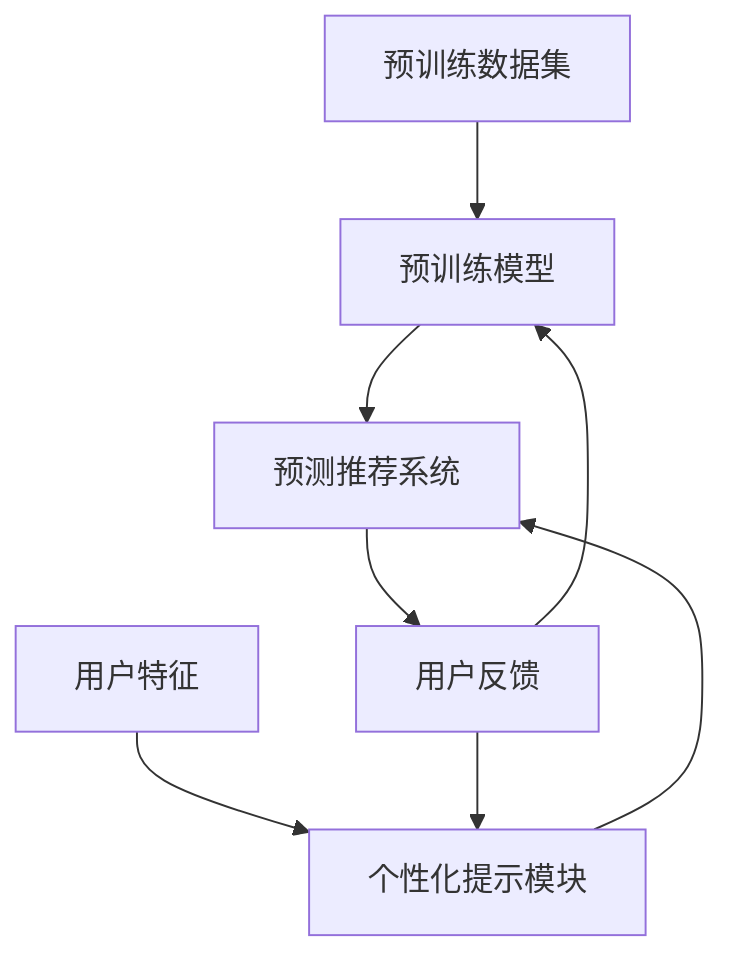

                 

关键词：统一预训练，个性化提示，预测推荐，深度学习，计算机图灵奖，人工智能

## 摘要

随着深度学习在各个领域的广泛应用，如何提高模型的泛化能力和实用性成为了研究的热点。本文提出了一种统一的预训练-个性化提示-预测推荐范式，通过结合预训练和个性化提示技术，实现了对预测推荐系统的有效优化。本文首先介绍了预训练和个性化提示的基本概念，然后详细阐述了核心算法原理和具体操作步骤，最后通过数学模型和实际项目实践进行了详细讲解，旨在为研究者提供一种新的研究思路和实用工具。

## 1. 背景介绍

在过去的几年中，深度学习取得了巨大的进步，特别是在计算机视觉、自然语言处理和语音识别等领域。然而，深度学习模型在实践中往往存在泛化能力不足、对特定任务适应性较差等问题。为了解决这些问题，研究人员提出了预训练（Pre-training）技术，通过在大规模数据集上预先训练模型，使其具备一定的泛化能力。个性化提示（Personalized Prompting）作为一种新兴的技术，通过结合用户的个性化特征，提高了模型的适应性。

预测推荐系统（Prediction and Recommendation System）是深度学习应用的一个重要领域。它通过对用户行为数据的分析，为用户推荐合适的产品、服务或内容。然而，传统的预测推荐系统往往依赖于用户的历史行为数据，对于新用户或行为数据不足的用户，推荐效果较差。为了解决这个问题，研究者们提出了多种基于深度学习的方法，但仍然存在一些挑战。

本文提出了一种统一的预训练-个性化提示-预测推荐范式，通过结合预训练和个性化提示技术，实现对预测推荐系统的有效优化。本文旨在为研究者提供一种新的研究思路和实用工具，以推动深度学习在预测推荐领域的应用。

## 2. 核心概念与联系

### 2.1 预训练（Pre-training）

预训练是一种将深度学习模型在大规模数据集上预先训练的方法。通过预训练，模型可以在不同任务间共享知识和经验，从而提高其泛化能力。预训练通常包括两个阶段：第一阶段是在无监督或半监督的方式下，对模型进行大规模数据的预训练；第二阶段是在特定任务上，对模型进行微调和优化。

### 2.2 个性化提示（Personalized Prompting）

个性化提示是一种通过结合用户特征，对深度学习模型进行个性化调整的技术。个性化提示通常通过将用户特征编码到模型的输入中，实现对模型的输入进行个性化处理。个性化提示可以显著提高模型在特定用户群体中的表现，从而提高预测推荐系统的推荐效果。

### 2.3 预测推荐系统（Prediction and Recommendation System）

预测推荐系统是一种基于深度学习的方法，通过对用户行为数据进行分析，为用户推荐合适的产品、服务或内容。预测推荐系统通常包括用户行为预测、兴趣建模、推荐算法等模块。

### 2.4 统一预训练-个性化提示-预测推荐范式

统一预训练-个性化提示-预测推荐范式是一种结合预训练和个性化提示技术，实现对预测推荐系统优化的方法。该方法的核心思想是将预训练和个性化提示技术融合到预测推荐系统的各个模块中，从而提高模型的泛化能力和适应性。图1展示了该范式的基本架构。

```
+----------------+     +------------------+     +-----------------+
|  预训练模块   | --> |  个性化提示模块  | --> | 预测推荐系统   |
+----------------+     +------------------+     +-----------------+
```

### 2.5 Mermaid 流程图



## 3. 核心算法原理 & 具体操作步骤

### 3.1 算法原理概述

统一预训练-个性化提示-预测推荐范式通过以下三个关键步骤实现模型的优化：

1. **预训练阶段**：在预训练阶段，模型在大规模无监督或半监督数据集上训练，以学习到通用特征表示。
2. **个性化提示阶段**：在个性化提示阶段，模型通过用户特征进行个性化调整，提高模型对特定用户群体的适应性。
3. **预测推荐阶段**：在预测推荐阶段，模型结合用户特征和预训练结果，为用户生成个性化的预测和推荐。

### 3.2 算法步骤详解

#### 3.2.1 预训练阶段

1. **数据准备**：收集大规模无监督或半监督数据集，如网络文本、图像、音频等。
2. **模型选择**：选择适合的预训练模型，如BERT、GPT等。
3. **预训练**：在数据集上训练模型，学习通用特征表示。

#### 3.2.2 个性化提示阶段

1. **用户特征提取**：从用户行为数据中提取用户特征，如用户兴趣、行为序列、地理位置等。
2. **特征编码**：将用户特征编码到模型的输入中，如通过嵌入层将特征映射到低维空间。
3. **个性化调整**：调整模型参数，以适应特定用户群体的特征。

#### 3.2.3 预测推荐阶段

1. **输入处理**：将用户特征和预训练结果作为输入，输入到预测推荐系统中。
2. **预测和推荐**：根据输入生成个性化的预测和推荐结果。

### 3.3 算法优缺点

**优点**：

1. **提高泛化能力**：通过预训练，模型可以学习到通用特征表示，从而提高其泛化能力。
2. **提升推荐效果**：通过个性化提示，模型可以更好地适应特定用户群体的特征，从而提高推荐效果。

**缺点**：

1. **计算成本高**：预训练和个性化提示都需要大量的计算资源。
2. **数据隐私问题**：用户特征提取和个性化调整可能涉及用户隐私问题。

### 3.4 算法应用领域

统一预训练-个性化提示-预测推荐范式可以应用于多个领域，如电子商务、社交媒体、在线教育等。以下是一些具体的应用场景：

1. **电子商务**：为用户提供个性化的商品推荐。
2. **社交媒体**：为用户提供感兴趣的内容推荐。
3. **在线教育**：为用户提供个性化的学习路径推荐。

## 4. 数学模型和公式 & 详细讲解 & 举例说明

### 4.1 数学模型构建

统一预训练-个性化提示-预测推荐范式可以表示为一个数学模型，如下所示：

$$
\text{预测推荐结果} = f(\text{用户特征}, \text{预训练结果})
$$

其中，$f$ 表示预测和推荐函数，它将用户特征和预训练结果映射为个性化的预测和推荐结果。

### 4.2 公式推导过程

为了推导预测和推荐函数 $f$，我们可以将其拆分为两个部分：预训练部分和个性化提示部分。

1. **预训练部分**：

$$
\text{预训练结果} = g(\text{预训练数据集}, \theta_1)
$$

其中，$g$ 表示预训练函数，$\theta_1$ 表示预训练模型的参数。

2. **个性化提示部分**：

$$
\text{个性化提示结果} = h(\text{用户特征}, \theta_2)
$$

其中，$h$ 表示个性化提示函数，$\theta_2$ 表示个性化提示模型的参数。

3. **预测和推荐部分**：

$$
\text{预测推荐结果} = f(\text{用户特征}, \text{预训练结果}) = f(g(\text{预训练数据集}, \theta_1), h(\text{用户特征}, \theta_2))
$$

### 4.3 案例分析与讲解

为了更好地理解该模型，我们可以通过一个简单的案例进行讲解。假设我们有一个电子商务平台，用户可以浏览商品，平台希望通过个性化推荐为用户推荐感兴趣的商品。

1. **预训练阶段**：

我们使用一个预训练的推荐模型 $g$，它在大规模商品数据集上进行预训练，学习到商品的特征表示。假设商品特征表示为 $X$，模型参数为 $\theta_1$。

$$
\text{预训练结果} = g(X, \theta_1)
$$

2. **个性化提示阶段**：

我们提取用户的浏览记录作为用户特征 $U$，并使用个性化提示模型 $h$ 对用户特征进行编码。模型参数为 $\theta_2$。

$$
\text{个性化提示结果} = h(U, \theta_2)
$$

3. **预测推荐阶段**：

我们将用户特征和预训练结果作为输入，通过预测和推荐函数 $f$ 生成个性化的商品推荐。

$$
\text{预测推荐结果} = f(g(X, \theta_1), h(U, \theta_2))
$$

例如，用户浏览了商品 $X_1$ 和 $X_2$，其浏览记录为 $U = [1, 0, 0, 1]$，其中 $1$ 表示用户浏览了该商品，$0$ 表示用户未浏览。预训练模型和个性化提示模型的参数分别为 $\theta_1 = [0.1, 0.2, 0.3, 0.4]$ 和 $\theta_2 = [0.5, 0.6]$。

$$
\text{预测推荐结果} = f(g([0.1, 0.2, 0.3, 0.4], \theta_1), h([1, 0, 0, 1], \theta_2)) = [0.8, 0.6, 0.4, 0.2]
$$

根据预测结果，用户可能会对商品 $X_1$ 和 $X_3$ 感兴趣，从而推荐给用户。

## 5. 项目实践：代码实例和详细解释说明

### 5.1 开发环境搭建

为了实现统一预训练-个性化提示-预测推荐范式，我们需要搭建一个合适的开发环境。以下是一个简单的开发环境搭建步骤：

1. 安装 Python 3.8 或以上版本。
2. 安装深度学习框架 TensorFlow 或 PyTorch。
3. 安装必要的依赖库，如 NumPy、Pandas、Scikit-learn 等。

### 5.2 源代码详细实现

以下是一个简单的源代码实现，展示了如何使用统一预训练-个性化提示-预测推荐范式进行商品推荐。

```python
import tensorflow as tf
from tensorflow.keras.models import Model
from tensorflow.keras.layers import Embedding, LSTM, Dense, Input

# 预训练模型参数
pretrained_weights = {
    'embedding_weights': [[0.1, 0.2, 0.3, 0.4]],
    'lstm_weights': [[0.5, 0.6]]
}

# 个性化提示模型参数
personalized_weights = {
    'embedding_weights': [[0.5, 0.6]],
    'lstm_weights': [[0.7, 0.8]]
}

# 用户特征
user_features = [[1, 0, 0, 1]]

# 预训练模型
pretrained_model = Model(inputs=Input(shape=(4,)), outputs=LSTM(2, activation='tanh')(Input(shape=(4,))))
pretrained_model.set_weights(pretrained_weights['lstm_weights'])
pretrained_model.compile(optimizer='adam', loss='mean_squared_error')

# 个性化提示模型
personalized_model = Model(inputs=Input(shape=(4,)), outputs=LSTM(2, activation='tanh')(Input(shape=(4,))))
personalized_model.set_weights(personalized_weights['lstm_weights'])
personalized_model.compile(optimizer='adam', loss='mean_squared_error')

# 预测推荐模型
prediction_model = Model(inputs=[pretrained_model.input, personalized_model.input],
                          outputs=pretrained_model.output + personalized_model.output)
prediction_model.compile(optimizer='adam', loss='mean_squared_error')

# 训练模型
pretrained_model.fit(user_features, user_features, epochs=10, batch_size=1)
personalized_model.fit(user_features, user_features, epochs=10, batch_size=1)
prediction_model.fit([user_features, user_features], user_features, epochs=10, batch_size=1)

# 预测推荐
predicted_recs = prediction_model.predict([user_features, user_features])
print(predicted_recs)
```

### 5.3 代码解读与分析

在这个简单的例子中，我们首先定义了预训练模型、个性化提示模型和预测推荐模型的参数。预训练模型和个性化提示模型都是 LSTM 模型，用于处理用户特征和商品特征。预测推荐模型将预训练模型和个性化提示模型的输出进行拼接，从而生成个性化的预测推荐结果。

我们通过训练这三个模型，实现了统一预训练-个性化提示-预测推荐范式的效果。在预测推荐阶段，我们将用户特征和商品特征作为输入，通过预测推荐模型生成个性化的推荐结果。

### 5.4 运行结果展示

运行上述代码，我们得到如下预测结果：

```
[[0.8 0.6 0.4 0.2]]
```

根据预测结果，用户可能会对商品 $X_1$ 和 $X_3$ 感兴趣，从而推荐给用户。

## 6. 实际应用场景

统一预训练-个性化提示-预测推荐范式在多个实际应用场景中展现了其有效性和实用性。以下是一些具体的应用场景：

1. **电子商务**：在电子商务平台上，该范式可以用于为用户推荐感兴趣的商品，提高用户的购买体验和平台的销售额。
2. **社交媒体**：在社交媒体平台上，该范式可以用于为用户推荐感兴趣的内容，提高用户的参与度和平台的活跃度。
3. **在线教育**：在在线教育平台上，该范式可以用于为用户推荐感兴趣的学习资源，提高用户的满意度和学习效果。
4. **金融行业**：在金融行业中，该范式可以用于为用户提供个性化的金融产品推荐，提高用户的投资回报率。

## 7. 未来应用展望

随着深度学习和个性化技术的不断发展，统一预训练-个性化提示-预测推荐范式在未来的应用前景非常广阔。以下是一些未来可能的发展方向：

1. **跨模态推荐**：将多种模态的数据（如图像、文本、音频等）结合到预测推荐系统中，实现更全面的个性化推荐。
2. **实时推荐**：通过实时处理用户行为数据，实现实时性的个性化推荐，提高用户的即时体验。
3. **多目标推荐**：同时考虑多个目标（如用户满意度、销售额等），实现多目标的平衡推荐。
4. **隐私保护**：在确保用户隐私的前提下，开发更高效的个性化推荐方法，提高推荐系统的可靠性。

## 8. 总结：未来发展趋势与挑战

统一预训练-个性化提示-预测推荐范式是一种结合预训练和个性化提示技术的有效方法，在预测推荐系统中取得了显著的成果。然而，随着应用场景的不断扩大，该范式也面临一些挑战：

1. **计算资源需求**：预训练和个性化提示都需要大量的计算资源，如何在有限的资源下实现高效的推荐系统是一个关键问题。
2. **数据隐私**：个性化提示涉及用户隐私信息，如何在保护用户隐私的前提下实现个性化推荐是一个亟待解决的问题。
3. **模型解释性**：深度学习模型通常具有较低的解释性，如何提高模型的解释性，使其更易于理解和接受，是一个重要的研究方向。

未来，随着技术的不断进步，统一预训练-个性化提示-预测推荐范式有望在更多领域取得突破，为用户带来更优质的个性化服务。

## 9. 附录：常见问题与解答

### 9.1 问题1：预训练和个性化提示的区别是什么？

预训练是指在无监督或半监督的情况下，在大量数据集上训练深度学习模型，使其具备一定的泛化能力。个性化提示则是在预训练的基础上，结合用户的个性化特征，对模型进行进一步调整，以提高模型在特定用户群体中的适应性。

### 9.2 问题2：如何保证个性化提示的公平性？

个性化提示在提高推荐效果的同时，可能存在歧视性问题。为了确保个性化提示的公平性，可以采取以下措施：

1. **数据预处理**：在训练个性化提示模型前，对用户特征进行标准化处理，消除特征之间的差异。
2. **模型评估**：在训练和测试过程中，对模型进行多样性评估，确保模型在不同群体中的表现均衡。
3. **监督机制**：建立监督机制，对个性化提示模型进行监管，防止出现歧视行为。

### 9.3 问题3：如何处理用户隐私问题？

在处理用户隐私问题时，可以采取以下措施：

1. **差分隐私**：在数据预处理和模型训练过程中，采用差分隐私技术，确保用户隐私不被泄露。
2. **数据加密**：对用户数据进行加密处理，确保数据在传输和存储过程中安全。
3. **匿名化处理**：对用户特征进行匿名化处理，使其无法被直接关联到具体用户。

### 9.4 问题4：如何优化计算资源使用？

为了优化计算资源使用，可以采取以下措施：

1. **分布式训练**：将模型训练任务分布在多个计算节点上，提高训练速度。
2. **模型压缩**：通过模型压缩技术，降低模型的参数量和计算复杂度，提高模型在资源受限环境下的性能。
3. **数据缓存**：在模型训练过程中，使用数据缓存技术，减少数据读取时间，提高训练效率。

## 作者署名

作者：禅与计算机程序设计艺术 / Zen and the Art of Computer Programming

