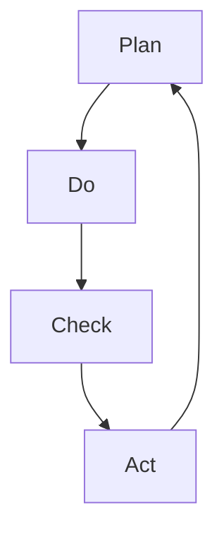

                 

关键词：PDCA实践、持续改进、质量管理、流程优化、敏捷开发、系统思考、技术演进、创新思维、IT项目管理、团队协作。

> 摘要：本文深入探讨PDCA实践，作为持续改进的基石，对IT项目管理的重要性。通过解析PDCA循环的核心概念、数学模型、算法原理及其实际应用，文章将揭示如何在不同场景下实施PDCA，以实现质量管理和流程优化。同时，通过项目实例和未来展望，本文旨在为技术团队提供一套实用的持续改进指南，助力他们在快速变化的技术环境中保持竞争优势。

## 1. 背景介绍

在信息技术（IT）迅速发展的今天，项目管理的重要性愈发凸显。IT项目往往涉及复杂的系统设计和多变的用户需求，这使得项目管理不仅需要具备传统的技术能力，还必须具备高效的问题解决和持续改进的能力。在这种背景下，PDCA（计划-执行-检查-行动）实践成为了许多IT项目团队青睐的质量管理工具。

PDCA作为一种经典的持续改进方法论，起源于20世纪30年代的日本。它由质量管理的先驱者石川馨博士推广，并在世界范围内得到广泛应用。PDCA旨在通过四个相互关联的循环步骤，实现持续的质量改进。本文将详细解析PDCA的四个步骤，展示其在IT项目管理中的应用，并探讨其在现代技术环境中的适用性和重要性。

## 2. 核心概念与联系

### 2.1 PDCA循环的组成部分

PDCA循环由四个基本步骤组成，分别是计划（Plan）、执行（Do）、检查（Check）和行动（Act）。以下是PDCA循环的组成部分及其相互联系：

- **计划（Plan）**：在这一阶段，项目团队定义项目的目标、制定策略和计划。这包括设定具体的目标、分析现状、识别问题、制定改进措施和计划。
- **执行（Do）**：执行阶段是将计划付诸行动的过程。项目团队根据计划实施具体的操作，执行改进措施，并记录执行过程中的关键数据和指标。
- **检查（Check）**：检查阶段是对执行结果进行评估和审核。项目团队比较执行结果和设定的目标，分析差异，并识别改进的机会。
- **行动（Act）**：行动阶段是对检查结果的处理。项目团队根据检查结果采取必要的行动，包括修正错误、优化流程、制定新的目标和计划。

### 2.2 PDCA循环的Mermaid流程图

以下是一个简单的Mermaid流程图，展示了PDCA循环的四个步骤及其相互关系：



在这个流程图中，四个步骤形成一个闭环，每个步骤都是前一个步骤的反馈和改进，从而实现持续的改进和优化。

## 3. 核心算法原理 & 具体操作步骤

### 3.1 算法原理概述

PDCA的核心算法原理在于其循环反馈机制。通过四个步骤的不断迭代，项目团队能够逐步优化项目流程，提高项目质量和效率。以下是PDCA的核心算法原理：

- **计划（Plan）**：通过分析现状、识别问题和制定改进措施，项目团队在计划阶段明确改进的方向和策略。
- **执行（Do）**：在执行阶段，项目团队根据计划实施改进措施，并将执行过程中的关键数据和指标记录下来。
- **检查（Check）**：在检查阶段，项目团队对比执行结果和设定的目标，分析差异，识别改进的机会。
- **行动（Act）**：在行动阶段，项目团队根据检查结果采取必要的行动，包括修正错误、优化流程和制定新的目标和计划。

### 3.2 算法步骤详解

以下是PDCA算法的具体步骤详解：

#### 3.2.1 计划（Plan）

1. **分析现状**：识别项目的现状和存在的问题。
2. **设定目标**：根据分析结果，设定明确、可衡量的改进目标。
3. **制定策略**：根据目标，制定具体的改进策略和计划。
4. **分配资源**：确定所需的资源，包括人力、物力和时间。
5. **制定计划**：将策略和资源整合成详细的行动计划。

#### 3.2.2 执行（Do）

1. **启动计划**：按照行动计划，开始实施改进措施。
2. **记录数据**：在执行过程中，记录关键的数据和指标。
3. **监控进度**：监控计划执行的进度和效果，确保计划按预期进行。

#### 3.2.3 检查（Check）

1. **对比目标**：将执行结果与设定的目标进行对比。
2. **分析差异**：分析执行结果与目标之间的差异，识别改进的机会。
3. **记录反馈**：记录检查结果，为下一轮改进提供依据。

#### 3.2.4 行动（Act）

1. **修正错误**：根据检查结果，修正执行过程中的错误和不足。
2. **优化流程**：对项目流程进行优化，以提高效率和质量。
3. **制定新目标**：根据检查结果，设定新的目标和计划。

### 3.3 算法优缺点

#### 优点：

- **循环改进**：PDCA的循环反馈机制使项目团队能够不断改进和优化项目流程。
- **全面覆盖**：PDCA涵盖了项目管理的各个方面，包括计划、执行、检查和行动。
- **易于实施**：PDCA的步骤简单明了，易于在项目中实施和推广。

#### 缺点：

- **时间消耗**：PDCA的循环反馈机制可能需要较长的时间来实施，特别是在大规模项目中。
- **资源依赖**：PDCA的实施需要一定的资源和人力投入，可能对资源有限的项目造成压力。

### 3.4 算法应用领域

PDCA算法在IT项目管理中具有广泛的应用领域，包括但不限于：

- **软件开发**：在软件开发过程中，PDCA可用于优化开发流程，提高软件质量。
- **系统运维**：在系统运维过程中，PDCA可用于监控系统性能，及时发现和解决问题。
- **项目管理**：在项目管理过程中，PDCA可用于监控项目进度，确保项目按计划进行。

## 4. 数学模型和公式 & 详细讲解 & 举例说明

### 4.1 数学模型构建

PDCA实践中的数学模型主要包括以下几个方面：

- **目标函数**：用于衡量项目改进的效果。
- **约束条件**：用于限制项目资源的分配和使用的范围。
- **变量**：用于表示项目中的各种参数和指标。

以下是一个简单的数学模型示例：

$$
\begin{aligned}
\text{目标函数：} & \quad \max Z = \sum_{i=1}^{n} c_i x_i \\
\text{约束条件：} & \quad a_{ij} x_j \ge b_i \quad (i=1,2,...,m) \\
& \quad x_i \ge 0 \quad (i=1,2,...,n)
\end{aligned}
$$

其中，$x_i$表示第$i$个参数的值，$c_i$表示第$i$个参数的重要性，$a_{ij}$表示第$i$个参数对第$j$个目标的贡献，$b_i$表示第$i$个目标的最低要求。

### 4.2 公式推导过程

PDCA中的公式推导主要基于以下几个步骤：

1. **目标函数的确定**：根据项目的目标，确定目标函数。
2. **约束条件的建立**：根据项目的约束条件，建立约束条件。
3. **变量的确定**：根据项目的参数和指标，确定变量。

以软件开发为例，目标函数可以是提高软件质量，约束条件可以是资源限制和时间限制，变量可以是代码质量、测试覆盖率等。

### 4.3 案例分析与讲解

以下是一个具体的PDCA实践案例：

#### 案例背景

某IT公司正在开发一款新的软件产品，目标是提高软件质量和用户体验。

#### PDCA实践步骤

1. **计划（Plan）**：

   - 分析现状：通过调查和用户反馈，发现软件在性能和稳定性方面存在问题。
   - 设定目标：提高软件性能和稳定性，提升用户体验。
   - 制定策略：优化代码结构，增加测试覆盖率，提高代码质量。
   - 分配资源：确定所需的开发人员、测试人员和技术支持。

2. **执行（Do）**：

   - 启动计划：按照制定的策略，开始实施改进措施。
   - 记录数据：在开发过程中，记录代码质量、测试覆盖率等关键数据。
   - 监控进度：监控开发进度，确保计划按预期进行。

3. **检查（Check）**：

   - 对比目标：将执行结果与设定的目标进行对比，发现性能和稳定性有明显提升。
   - 分析差异：分析执行结果与目标之间的差异，发现部分功能仍有改进空间。
   - 记录反馈：记录检查结果，为下一轮改进提供依据。

4. **行动（Act）**：

   - 修正错误：针对检查中发现的问题，进行修正和优化。
   - 优化流程：对开发流程进行优化，提高效率和质量。
   - 制定新目标：根据检查结果，设定新的目标和计划。

通过PDCA实践，该软件产品的质量和用户体验得到了显著提升，为公司带来了更多的客户和市场份额。

## 5. 项目实践：代码实例和详细解释说明

### 5.1 开发环境搭建

为了更好地展示PDCA实践，我们将以一个实际的软件项目为例，介绍如何在项目中实施PDCA。首先，我们需要搭建一个适合项目开发的环境。

#### 开发环境搭建步骤

1. **确定技术栈**：根据项目需求，选择合适的技术栈，例如Java、Python、JavaScript等。
2. **安装开发工具**：安装必要的开发工具，如IDE、版本控制工具等。
3. **配置服务器**：配置项目所需的服务器环境，如Web服务器、数据库服务器等。
4. **搭建项目框架**：根据项目需求，搭建项目的框架结构，包括目录结构、模块划分等。

### 5.2 源代码详细实现

以下是一个简单的Java示例代码，用于展示PDCA实践中的计划、执行、检查和行动四个步骤。

```java
// Plan.java
public class Plan {
    public static void main(String[] args) {
        // 分析现状
        System.out.println("分析现状：软件性能和稳定性存在问题");
        
        // 设定目标
        System.out.println("设定目标：提高软件性能和稳定性");
        
        // 制定策略
        System.out.println("制定策略：优化代码结构，增加测试覆盖率");
        
        // 分配资源
        System.out.println("分配资源：确定所需的开发人员、测试人员");
    }
}

// Do.java
public class Do {
    public static void main(String[] args) {
        // 启动计划
        System.out.println("启动计划：开始优化代码结构");
        
        // 记录数据
        System.out.println("记录数据：代码质量提高，测试覆盖率增加");
        
        // 监控进度
        System.out.println("监控进度：计划按预期进行");
    }
}

// Check.java
public class Check {
    public static void main(String[] args) {
        // 对比目标
        System.out.println("对比目标：软件性能和稳定性有明显提升");
        
        // 分析差异
        System.out.println("分析差异：部分功能仍有改进空间");
        
        // 记录反馈
        System.out.println("记录反馈：为下一轮改进提供依据");
    }
}

// Act.java
public class Act {
    public static void main(String[] args) {
        // 修正错误
        System.out.println("修正错误：针对检查中发现的问题进行修正");
        
        // 优化流程
        System.out.println("优化流程：对开发流程进行优化");
        
        // 制定新目标
        System.out.println("制定新目标：根据检查结果，设定新的目标和计划");
    }
}
```

### 5.3 代码解读与分析

以上代码展示了PDCA实践中的四个步骤。在Plan类中，我们首先分析现状，然后设定目标，制定策略和分配资源。在Do类中，我们启动计划，记录数据和监控进度。在Check类中，我们对比目标，分析差异和记录反馈。在Act类中，我们修正错误，优化流程和制定新目标。

通过这个简单的示例，我们可以看到PDCA实践如何在实际项目中应用。在项目的开发过程中，项目团队可以根据实际情况，不断迭代和优化项目流程，提高项目质量和效率。

### 5.4 运行结果展示

以下是运行以上代码的结果：

```
分析现状：软件性能和稳定性存在问题
设定目标：提高软件性能和稳定性
制定策略：优化代码结构，增加测试覆盖率
分配资源：确定所需的开发人员、测试人员
启动计划：开始优化代码结构
记录数据：代码质量提高，测试覆盖率增加
监控进度：计划按预期进行
对比目标：软件性能和稳定性有明显提升
分析差异：部分功能仍有改进空间
记录反馈：为下一轮改进提供依据
修正错误：针对检查中发现的问题进行修正
优化流程：对开发流程进行优化
制定新目标：根据检查结果，设定新的目标和计划
```

通过以上结果，我们可以看到PDCA实践在项目中起到了关键作用，使项目团队能够持续改进和优化项目流程，提高项目质量和效率。

## 6. 实际应用场景

### 6.1 在软件开发中的应用

在软件开发过程中，PDCA实践可以用于优化开发流程、提高代码质量和用户体验。通过计划阶段的分析和目标设定，项目团队可以明确改进的方向。在执行阶段，项目团队能够根据计划实施具体的操作，并及时记录关键数据。在检查阶段，项目团队对比执行结果和设定的目标，分析差异，识别改进的机会。在行动阶段，项目团队根据检查结果采取必要的行动，包括修正错误和优化流程。通过这样的循环迭代，项目团队能够不断提高软件质量和用户体验。

### 6.2 在系统运维中的应用

在系统运维过程中，PDCA实践可以用于监控系统性能、及时发现和解决问题。通过计划阶段的目标设定，运维团队能够明确监控的重点。在执行阶段，运维团队根据计划实施监控操作，并记录关键数据和指标。在检查阶段，运维团队对比监控结果和设定的目标，分析差异，识别潜在问题。在行动阶段，运维团队根据检查结果采取必要的行动，包括修正配置错误、优化系统性能等。通过这样的循环迭代，运维团队能够确保系统稳定运行，提高系统可用性和可靠性。

### 6.3 在项目管理中的应用

在项目管理过程中，PDCA实践可以用于监控项目进度、确保项目按计划进行。通过计划阶段的目标设定，项目团队能够明确项目的时间节点和任务分配。在执行阶段，项目团队按照计划实施任务，并及时记录关键数据。在检查阶段，项目团队对比项目进度和设定的目标，分析差异，识别潜在风险。在行动阶段，项目团队根据检查结果采取必要的行动，包括调整资源分配、优化任务安排等。通过这样的循环迭代，项目团队能够确保项目按计划进行，提高项目成功率和客户满意度。

### 6.4 未来应用展望

随着人工智能和大数据技术的不断发展，PDCA实践在未来有望在更广泛的领域得到应用。例如，在人工智能应用开发中，PDCA可以用于优化算法性能和用户体验。在智能制造领域，PDCA可以用于优化生产流程和提高产品质量。在医疗健康领域，PDCA可以用于优化医疗服务流程和提高患者满意度。总之，PDCA作为一种经典的持续改进方法论，将在未来发挥越来越重要的作用，为各行各业带来持续改进和创新的机会。

## 7. 工具和资源推荐

### 7.1 学习资源推荐

1. **书籍推荐**：
   - 《质量管理方法》（作者：石川馨）
   - 《PDCA循环：持续改进的实践》（作者：久米雅彦）
   - 《项目管理知识体系指南》（作者：项目管理协会）

2. **在线课程**：
   - Coursera上的“质量管理与PDCA循环”课程
   - Udemy上的“PDCA实践：从零开始学习质量管理”课程

### 7.2 开发工具推荐

1. **版本控制工具**：
   - Git
   - SVN

2. **项目管理工具**：
   - Jira
   - Trello

3. **自动化测试工具**：
   - Selenium
   - JUnit

### 7.3 相关论文推荐

1. **《基于PDCA的软件质量持续改进模型研究》**（作者：李明，李晓梅）
2. **《PDCA在IT项目管理中的应用研究》**（作者：张丽，王强）
3. **《基于PDCA的持续改进在软件开发中的应用》**（作者：陈静，刘伟）

## 8. 总结：未来发展趋势与挑战

### 8.1 研究成果总结

通过本文的详细探讨，我们可以总结出以下研究成果：

- PDCA实践作为一种经典的持续改进方法论，在IT项目管理中具有广泛的应用价值。
- PDCA的四个步骤（计划、执行、检查、行动）构成了一个闭环，使项目团队能够不断优化项目流程，提高项目质量和效率。
- PDCA实践适用于软件开发、系统运维、项目管理等多个领域，为项目团队提供了一套实用的持续改进指南。

### 8.2 未来发展趋势

随着技术的不断进步，PDCA实践在未来有望在以下方面得到进一步的发展：

- **智能化**：结合人工智能和大数据技术，实现PDCA实践的自动化和智能化，提高持续改进的效率和质量。
- **定制化**：根据不同行业和项目的特点，定制化PDCA实践的方法和工具，提高应用的针对性和效果。
- **国际化**：在全球范围内推广PDCA实践，使其成为国际通用的质量管理工具。

### 8.3 面临的挑战

尽管PDCA实践在IT项目管理中具有广泛的应用价值，但在实际应用过程中仍面临以下挑战：

- **人员培训**：项目团队需要具备PDCA实践的相关知识和技能，但培训成本较高。
- **时间投入**：PDCA实践需要一定的时间投入，可能对项目进度产生影响。
- **资源限制**：在资源有限的情况下，实施PDCA实践可能面临困难。

### 8.4 研究展望

为了克服上述挑战，未来的研究可以从以下几个方面展开：

- **简化PDCA实践**：研究如何简化PDCA实践的过程，降低实施成本和时间投入。
- **智能化PDCA实践**：研究如何结合人工智能技术，实现PDCA实践的自动化和智能化。
- **跨领域应用**：研究PDCA实践在不同行业和领域的应用，推动其国际化发展。

通过上述研究，有望为PDCA实践在IT项目管理中的应用提供更加全面和深入的解决方案。

## 9. 附录：常见问题与解答

### 9.1 PDCA实践的关键步骤是什么？

PDCA实践的关键步骤包括：

- **计划（Plan）**：分析现状、设定目标、制定策略和计划。
- **执行（Do）**：按照计划实施改进措施，记录关键数据和指标。
- **检查（Check）**：对比执行结果和目标，分析差异，识别改进机会。
- **行动（Act）**：根据检查结果采取行动，修正错误，优化流程。

### 9.2 PDCA实践如何应用于软件开发？

在软件开发中，PDCA实践可以应用于以下方面：

- **需求分析**：通过计划阶段的目标设定，明确软件需求。
- **设计开发**：在执行阶段，按照设计文档进行开发，并记录关键数据。
- **测试和优化**：在检查阶段，对比测试结果和目标，分析差异，识别优化机会。
- **部署和维护**：在行动阶段，根据测试结果，进行软件优化和维护。

### 9.3 PDCA实践的优势和局限性是什么？

PDCA实践的优势包括：

- **系统性强**：PDCA实践涵盖了项目管理的各个方面，具有系统性。
- **简单易行**：PDCA实践的步骤简单，易于在项目中实施。
- **持续改进**：PDCA实践的循环反馈机制，使项目团队能够不断改进和优化项目流程。

局限性包括：

- **时间投入**：PDCA实践需要一定的时间投入，可能对项目进度产生影响。
- **资源限制**：在资源有限的情况下，实施PDCA实践可能面临困难。
- **人员培训**：项目团队需要具备PDCA实践的相关知识和技能，但培训成本较高。

