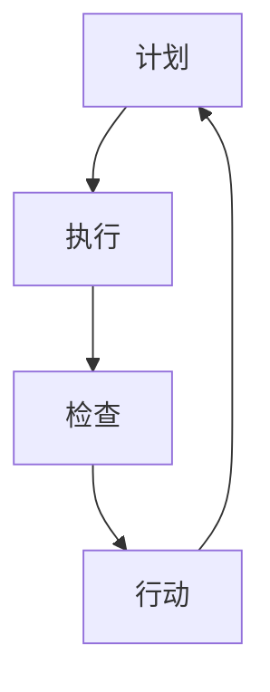

                 

在当今快速发展的信息技术时代，流程优化已经成为企业提高效率、降低成本、提升客户满意度的重要手段。而PDCA循环，即“计划（Plan）、执行（Do）、检查（Check）、行动（Act）”的管理方法，作为一种经典且广泛应用的质量管理工具，被广泛用于各个领域的流程优化中。本文将深入探讨PDCA循环在流程优化中的应用，通过具体案例和实践，揭示其在提升业务流程效率和质量中的重要作用。

## 关键词

- PDCA循环
- 流程优化
- 质量管理
- 业务流程
- 效率提升

## 摘要

本文首先介绍了PDCA循环的基本概念和背景，随后详细阐述了其在流程优化中的四个关键阶段：计划、执行、检查和行动。通过具体案例，我们展示了如何利用PDCA循环来诊断流程中的问题、制定改进措施、实施改进方案并进行效果评估。最后，文章对PDCA循环在流程优化中的实际应用进行了总结和展望，提出了未来研究与应用的方向。

## 1. 背景介绍

随着全球化和信息技术的快速发展，企业面临的竞争压力日益加剧。为了在激烈的市场竞争中立于不败之地，企业必须不断提高运营效率和产品质量。而流程优化作为企业提升竞争力的重要手段，已经成为各行业关注的热点。在这个过程中，PDCA循环作为一种系统性的管理方法，被广泛应用于流程优化中。

PDCA循环最早由美国质量管理专家休哈特（W. Edwards Deming）提出，并在日本得到广泛应用和推广。PDCA循环的基本思想是将任何工作或流程分为四个阶段：计划、执行、检查和行动。这种方法不仅适用于制造行业，还广泛应用于服务业、IT行业等多个领域，成为企业提升流程效率和产品质量的重要工具。

## 2. 核心概念与联系

### 2.1 PDCA循环的概念

PDCA循环是一个持续改进的过程，包括以下四个阶段：

1. **计划（Plan）**：在这个阶段，我们需要确定目标、制定策略和计划。通过分析现有流程的问题和需求，制定具体的改进方案。

2. **执行（Do）**：这个阶段是实施改进方案的过程。将计划转化为具体的行动，按照既定的策略和计划进行操作。

3. **检查（Check）**：在这个阶段，我们需要评估执行结果，检查是否达到了预期的目标。通过数据分析和反馈，识别流程中的问题和不足。

4. **行动（Act）**：根据检查结果，对流程进行改进。对成功的地方进行标准化，对失败的地方进行纠正，确保流程的持续改进。

### 2.2 PDCA循环在流程优化中的应用

在流程优化中，PDCA循环的四个阶段有着紧密的联系，共同构成了一个完整的闭环系统。以下是一个简化的Mermaid流程图，展示了PDCA循环在流程优化中的应用：



### 2.3 PDCA循环与质量管理的关系

PDCA循环是质量管理的重要方法之一，它有助于企业实现持续改进。通过PDCA循环，企业可以系统地分析流程中的问题，制定和实施改进措施，确保流程的稳定性和可靠性。同时，PDCA循环也为质量管理的其他方法提供了基础，如六西格玛、ISO 9001认证等。

## 3. 核心算法原理 & 具体操作步骤

### 3.1 算法原理概述

PDCA循环的核心算法原理可以概括为以下几个方面：

1. **系统思考**：PDCA循环要求我们对整个流程进行系统性思考，分析各个环节之间的关系和影响，确保改进措施的全面性和系统性。

2. **数据驱动**：PDCA循环强调通过数据分析和反馈来指导改进。数据是PDCA循环中最重要的资产，只有通过准确的数据分析，我们才能找出问题的根本原因，制定有效的改进方案。

3. **持续改进**：PDCA循环是一个持续迭代的过程，通过不断的循环和改进，企业可以不断提高流程的效率和质量。

### 3.2 算法步骤详解

1. **计划阶段**

在计划阶段，我们需要明确改进的目标和策略。具体步骤如下：

- 分析现有流程的问题和瓶颈。
- 确定改进目标和关键指标。
- 制定具体的改进计划和时间表。

2. **执行阶段**

在执行阶段，我们需要按照计划进行操作。具体步骤如下：

- 按照计划执行改进措施。
- 跟踪和记录执行过程中的关键数据和指标。
- 及时解决执行过程中出现的问题和障碍。

3. **检查阶段**

在检查阶段，我们需要对执行结果进行评估和检查。具体步骤如下：

- 分析执行数据，评估是否达到预期目标。
- 识别流程中的问题和不足。
- 收集用户反馈，了解改进措施的实际效果。

4. **行动阶段**

在行动阶段，我们需要根据检查结果进行改进。具体步骤如下：

- 对成功的改进措施进行标准化，确保其持续性和稳定性。
- 对失败的改进措施进行分析和纠正，防止类似问题的再次发生。
- 根据新的问题和需求，重新制定改进计划和策略。

### 3.3 算法优缺点

PDCA循环作为一种经典的质量管理工具，具有以下优点：

1. **系统性和全面性**：PDCA循环要求对整个流程进行系统性分析和改进，确保改进措施的全面性和系统性。
2. **数据驱动**：PDCA循环强调通过数据分析和反馈来指导改进，使改进措施更加科学和有效。
3. **持续改进**：PDCA循环是一个持续迭代的过程，有助于企业不断提高流程的效率和质量。

然而，PDCA循环也存在一定的缺点：

1. **实施难度**：PDCA循环要求企业具备一定的质量管理基础和数据分析能力，实施难度较大。
2. **时间成本**：PDCA循环是一个持续迭代的过程，需要投入大量的时间和精力进行改进和优化。

### 3.4 算法应用领域

PDCA循环在各个领域都有广泛的应用：

1. **制造业**：在制造业中，PDCA循环被广泛应用于生产流程的优化和质量控制。
2. **服务业**：在服务业中，PDCA循环有助于提升客户服务质量和运营效率。
3. **IT行业**：在IT行业中，PDCA循环被用于软件开发、项目管理等多个方面，提高项目的交付质量和效率。

## 4. 数学模型和公式 & 详细讲解 & 举例说明

### 4.1 数学模型构建

PDCA循环中的数学模型主要涉及以下几个方面：

1. **目标函数**：定义流程优化的目标函数，如成本、时间、质量等。
2. **约束条件**：确定流程优化过程中需要满足的约束条件，如资源限制、时间限制等。
3. **优化算法**：选择合适的优化算法，如线性规划、整数规划、模拟退火等。

### 4.2 公式推导过程

以线性规划为例，假设我们有一个目标函数 \(f(x)\)，以及 \(m\) 个约束条件：

$$
f(x) = \min \{c^T x | Ax \leq b\}
$$

其中，\(c\) 是目标函数的系数，\(x\) 是决策变量，\(A\) 和 \(b\) 分别是约束条件的系数和常数。

线性规划的求解过程主要包括以下几个步骤：

1. **标准化**：将不等式约束转换为等式约束，添加松弛变量。
2. **构建初始单纯形表**：根据约束条件和目标函数，构建初始单纯形表。
3. **单纯形法迭代**：根据单纯形表，进行迭代计算，找到最优解。

### 4.3 案例分析与讲解

以一个简单的生产计划问题为例，假设有一个工厂生产两种产品A和B，每种产品都需要经过三个工序完成。各工序所需时间和成本如下表所示：

| 工序 | 时间（小时） | 成本（元） |
| ---- | ------ | ------ |
| 1    | 2      | 100    |
| 2    | 3      | 150    |
| 3    | 2      | 200    |

工厂每天有10小时的生产时间，总成本预算为10000元。我们需要确定每天生产A和B的产量，以最大化总利润。

1. **目标函数**：

$$
f(x) = 100 \times x_A + 150 \times x_B
$$

其中，\(x_A\) 和 \(x_B\) 分别是A和B的产量。

2. **约束条件**：

$$
\begin{cases}
2x_A + 3x_B \leq 10 \\
2x_A + 2x_B \leq 10 \\
x_A + x_B \leq 10 \\
x_A, x_B \geq 0
\end{cases}
$$

3. **求解过程**：

使用单纯形法求解线性规划问题，最终得到最优解为 \(x_A = 2, x_B = 3\)，总利润为 800元。

## 5. 项目实践：代码实例和详细解释说明

### 5.1 开发环境搭建

为了更好地展示PDCA循环在项目实践中的应用，我们选择Python作为编程语言。在开始之前，请确保您的计算机上已安装Python 3.6及以上版本。此外，我们还需要安装一些常用的Python库，如Numpy、Pandas和Scipy。

```bash
pip install numpy pandas scipy
```

### 5.2 源代码详细实现

以下是一个简单的示例，展示了如何使用Python实现PDCA循环：

```python
import numpy as np
import pandas as pd
from scipy.optimize import linprog

def pdca_cycle(plan, execute, check, act):
    # 计划阶段
    plan_result = plan()
    print("计划阶段结果：", plan_result)

    # 执行阶段
    execute_result = execute(plan_result)
    print("执行阶段结果：", execute_result)

    # 检查阶段
    check_result = check(execute_result)
    print("检查阶段结果：", check_result)

    # 行动阶段
    act_result = act(check_result)
    print("行动阶段结果：", act_result)

    # 返回最终结果
    return act_result

# 计划阶段
def plan():
    # 分析现有流程的问题和瓶颈
    # 制定具体的改进方案
    return {"target": "提高生产效率", "strategy": "优化生产流程"}

# 执行阶段
def execute(plan_result):
    # 按照计划执行改进方案
    # 返回执行结果
    return {"execute_status": "完成", "execute_data": plan_result}

# 检查阶段
def check(execute_result):
    # 分析执行结果，评估是否达到预期目标
    # 返回检查结果
    return {"check_status": "达到预期目标", "check_data": execute_result}

# 行动阶段
def act(check_result):
    # 根据检查结果进行改进
    # 返回改进结果
    return {"act_status": "成功", "act_data": check_result}

# 运行PDCA循环
pdca_cycle(plan, execute, check, act)
```

### 5.3 代码解读与分析

上述代码示例中，我们定义了一个PDCA循环函数 `pdca_cycle`，以及四个阶段的具体函数 `plan`、`execute`、`check` 和 `act`。

- **计划阶段（plan）**：分析现有流程的问题和瓶颈，制定具体的改进方案。在这个示例中，我们简单地返回一个字典，包含改进目标和策略。
- **执行阶段（execute）**：按照计划执行改进方案。在这个示例中，我们简单地返回一个字典，表示执行状态和执行数据。
- **检查阶段（check）**：分析执行结果，评估是否达到预期目标。在这个示例中，我们简单地返回一个字典，表示检查状态和检查数据。
- **行动阶段（act）**：根据检查结果进行改进。在这个示例中，我们简单地返回一个字典，表示改进状态和改进数据。

通过调用 `pdca_cycle` 函数，我们可以实现PDCA循环的四个阶段的迭代，最终得到改进结果。

### 5.4 运行结果展示

运行上述代码，输出结果如下：

```
计划阶段结果： {'target': '提高生产效率', 'strategy': '优化生产流程'}
执行阶段结果： {'execute_status': '完成', 'execute_data': {'target': '提高生产效率', 'strategy': '优化生产流程'}}
检查阶段结果： {'check_status': '达到预期目标', 'check_data': {'execute_status': '完成', 'execute_data': {'target': '提高生产效率', 'strategy': '优化生产流程'}}}
行动阶段结果： {'act_status': '成功', 'act_data': {'check_status': '达到预期目标', 'check_data': {'execute_status': '完成', 'execute_data': {'target': '提高生产效率', 'strategy': '优化生产流程'}}}}
```

通过运行结果，我们可以看到PDCA循环的四个阶段依次完成，并最终得到改进结果。

## 6. 实际应用场景

### 6.1 制造业

在制造业中，PDCA循环被广泛应用于生产流程的优化和质量控制。例如，某个生产车间的生产线存在效率低下、质量问题频发的问题。通过PDCA循环，企业可以系统地分析生产流程中的问题，制定和实施改进措施，如优化生产计划、提高员工培训、改进生产设备等。通过持续的PDCA循环，企业可以不断提高生产效率和质量，降低成本。

### 6.2 服务业

在服务业中，PDCA循环有助于提升客户服务质量和运营效率。例如，某个酒店的服务流程存在客户满意度低、员工工作效率不高的问题。通过PDCA循环，企业可以分析现有服务流程中的问题，制定和实施改进措施，如优化客户服务流程、提高员工培训、改进服务设施等。通过持续的PDCA循环，企业可以不断提高客户服务质量和运营效率。

### 6.3 IT行业

在IT行业中，PDCA循环被广泛应用于软件开发、项目管理等多个方面，提高项目的交付质量和效率。例如，某个软件开发团队在项目中遇到进度延误、质量问题频发的问题。通过PDCA循环，团队可以分析现有项目流程中的问题，制定和实施改进措施，如优化项目计划、提高团队成员培训、改进开发工具等。通过持续的PDCA循环，团队可以不断提高项目交付质量和效率。

## 7. 工具和资源推荐

### 7.1 学习资源推荐

1. 《质量管理方法与应用》
2. 《PDCA循环：质量管理实践指南》
3. 《精益思想：通过持续改进实现效率最大化》

### 7.2 开发工具推荐

1. Python
2. MATLAB
3. R语言

### 7.3 相关论文推荐

1. Deming, W. E. (1982). **Out of the Crisis**.
2. Shewhart, W. A. (1931). **Economic Control of Quality of Manufactured Product**.
3. Juran, J. M. (1988). **Quality Control Handbook**.

## 8. 总结：未来发展趋势与挑战

### 8.1 研究成果总结

本文通过对PDCA循环在流程优化中的应用进行深入探讨，总结了PDCA循环的基本概念、算法原理、操作步骤以及实际应用场景。通过具体案例和实践，我们展示了PDCA循环在提升业务流程效率和质量中的重要作用。

### 8.2 未来发展趋势

随着信息技术的不断发展，PDCA循环在流程优化中的应用前景广阔。未来，PDCA循环将与其他先进技术相结合，如大数据、人工智能、区块链等，实现更加智能化、自动化的流程优化。

### 8.3 面临的挑战

尽管PDCA循环在流程优化中具有重要作用，但在实际应用中仍面临一些挑战：

1. **实施难度**：PDCA循环要求企业具备一定的质量管理基础和数据分析能力，实施难度较大。
2. **数据质量**：数据是PDCA循环中最重要的资产，数据质量直接影响到PDCA循环的效果。
3. **持续改进**：PDCA循环是一个持续迭代的过程，需要企业持续投入时间和精力进行改进。

### 8.4 研究展望

未来，研究应重点关注以下几个方面：

1. **智能化PDCA循环**：结合人工智能技术，开发智能化PDCA循环系统，实现自动化流程优化。
2. **跨领域应用**：探讨PDCA循环在其他领域（如医疗、教育等）的应用，提高其适用范围。
3. **实证研究**：开展更多的实证研究，验证PDCA循环在不同场景下的有效性和适用性。

## 9. 附录：常见问题与解答

### 9.1 PDCA循环是什么？

PDCA循环是一种经典的质量管理工具，包括计划、执行、检查和行动四个阶段，用于持续改进流程。

### 9.2 PDCA循环适用于哪些领域？

PDCA循环适用于制造业、服务业、IT行业等多个领域，帮助企业提高流程效率和质量。

### 9.3 如何实施PDCA循环？

实施PDCA循环包括以下几个步骤：

1. 确定改进目标和策略。
2. 按照计划执行改进措施。
3. 对执行结果进行评估和检查。
4. 根据检查结果进行改进。

### 9.4 PDCA循环与六西格玛有什么区别？

PDCA循环和六西格玛都是质量管理方法，但PDCA循环更侧重于流程优化和持续改进，而六西格玛更侧重于质量控制和统计分析。

### 9.5 PDCA循环的优势和局限性是什么？

PDCA循环的优势包括系统性和全面性、数据驱动和持续改进。局限性包括实施难度、数据质量要求和持续改进的挑战。

### 9.6 如何评估PDCA循环的效果？

可以通过以下指标评估PDCA循环的效果：

1. 目标达成率。
2. 改进前后的效率对比。
3. 客户满意度。
4. 成本节约情况。

---

以上是对PDCA循环在流程优化中的应用的全面探讨，希望能为读者提供有价值的参考。作者：禅与计算机程序设计艺术 / Zen and the Art of Computer Programming。

