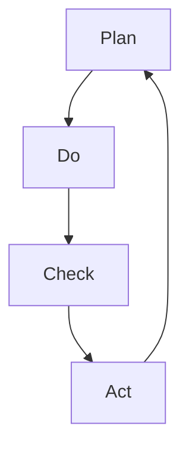

                 

关键词：PDCA循环、流程优化、质量管理体系、持续改进、实践案例

> 摘要：本文将深入探讨PDCA循环在流程优化中的关键作用。通过对其概念、原理和具体应用场景的详细分析，读者可以了解到如何利用PDCA循环实现流程的持续改进和优化，提高组织效率和质量。

## 1. 背景介绍

在现代化的企业管理中，流程优化已经成为提升组织效率和竞争力的关键手段。传统的管理模式往往依赖于经验管理，缺乏系统性和科学性，导致效率低下、资源浪费和质量问题。为了应对这些挑战，各种管理工具和方法被广泛应用，其中PDCA循环（Plan-Do-Check-Act循环）是最具代表性的方法之一。

PDCA循环，又称戴明循环，是质量管理体系的基础。它由美国统计学家威廉·爱德华·戴明提出，旨在通过系统的计划、执行、检查和行动来持续改进流程。PDCA循环是一种迭代的过程，它不断循环，推动流程的优化和改进。

本文将详细介绍PDCA循环的概念、原理和应用，并结合实际案例，展示其在流程优化中的具体作用。

### 1.1 PDCA循环的定义

PDCA循环是一种用于管理和改进过程的方法，它由四个基本阶段组成：计划（Plan）、执行（Do）、检查（Check）和行动（Act）。每个阶段都有其特定的任务和目标，相互关联，形成一个闭环。

- **计划（Plan）**：确定目标和制定计划。在这个阶段，组织需要明确改进的目标，分析现状，找出问题，并制定具体的行动计划。
- **执行（Do）**：实施计划。在这个阶段，组织按照计划执行各项任务，确保资源的合理分配和有效利用。
- **检查（Check）**：评估效果。在这个阶段，组织对执行情况进行评估，收集数据，比较实际结果与预期目标的差异。
- **行动（Act）**：采取行动。根据评估结果，组织需要采取相应的行动，对流程进行调整和改进，形成新的计划。

### 1.2 PDCA循环的重要性

PDCA循环的重要性体现在以下几个方面：

- **系统性和科学性**：PDCA循环提供了一套系统化的方法，使流程优化具有科学依据，避免了盲目行动。
- **持续改进**：PDCA循环是一个持续改进的过程，不断循环，推动流程的持续优化。
- **全员参与**：PDCA循环强调全员参与，鼓励员工积极参与改进过程，提高团队协作和创新能力。
- **数据驱动**：PDCA循环基于数据驱动，通过收集和分析数据，确保改进措施的可行性和有效性。

## 2. 核心概念与联系

在深入探讨PDCA循环之前，我们需要明确几个核心概念，并理解它们之间的联系。

### 2.1 质量管理体系

质量管理体系是一种组织结构和过程，用于确保产品和服务的质量。PDCA循环是质量管理体系的核心组成部分，通过持续改进，提高产品和服务的质量。

### 2.2 统计过程控制

统计过程控制（SPC）是一种通过统计方法监控和改进生产过程的方法。PDCA循环中的“检查”阶段通常涉及SPC技术，用于评估流程的稳定性和改进空间。

### 2.3 持续改进

持续改进是一种不断追求卓越的方法，旨在不断提高产品和服务的质量。PDCA循环是实现持续改进的关键工具。

### 2.4 Mermaid 流程图

为了更好地理解PDCA循环的流程和环节，我们可以使用Mermaid流程图进行展示。



在这个流程图中，A表示计划阶段，B表示执行阶段，C表示检查阶段，D表示行动阶段。每个阶段都是PDCA循环的一部分，通过循环迭代，推动流程的持续改进。

## 3. 核心算法原理 & 具体操作步骤

### 3.1 算法原理概述

PDCA循环的核心算法原理可以概括为四个步骤：计划、执行、检查和行动。

1. **计划（Plan）**：确定目标和制定计划。在这个阶段，组织需要明确改进的目标，分析现状，找出问题，并制定具体的行动计划。
2. **执行（Do）**：实施计划。在这个阶段，组织按照计划执行各项任务，确保资源的合理分配和有效利用。
3. **检查（Check）**：评估效果。在这个阶段，组织对执行情况进行评估，收集数据，比较实际结果与预期目标的差异。
4. **行动（Act）**：采取行动。根据评估结果，组织需要采取相应的行动，对流程进行调整和改进，形成新的计划。

### 3.2 算法步骤详解

#### 3.2.1 计划阶段

在计划阶段，组织需要完成以下任务：

1. 确定改进目标：明确改进的目标和方向，确保目标具有可行性和可衡量性。
2. 分析现状：对现有流程进行详细分析，找出存在的问题和瓶颈。
3. 制定行动计划：根据改进目标和现状分析，制定具体的行动计划，包括任务分配、时间表和资源需求。

#### 3.2.2 执行阶段

在执行阶段，组织需要按照计划执行各项任务，确保资源的合理分配和有效利用。具体步骤如下：

1. 资源分配：根据行动计划，合理分配资源，确保任务顺利进行。
2. 任务执行：按照任务分配，组织成员按照既定计划执行任务。
3. 沟通与协调：保持团队成员之间的沟通，确保任务的协调和顺利进行。

#### 3.2.3 检查阶段

在检查阶段，组织需要评估执行效果，收集数据，比较实际结果与预期目标的差异。具体步骤如下：

1. 数据收集：收集与改进目标相关的数据，包括质量指标、效率指标等。
2. 数据分析：对收集到的数据进行分析，找出实际结果与预期目标的差异。
3. 问题识别：根据数据分析结果，识别存在的问题和瓶颈。

#### 3.2.4 行动阶段

在行动阶段，组织需要根据检查阶段的结果，采取相应的行动，对流程进行调整和改进。具体步骤如下：

1. 问题分析：对检查阶段识别出的问题进行分析，找出根本原因。
2. 改进措施：制定具体的改进措施，针对问题进行解决。
3. 实施改进：按照改进措施，对流程进行调整和改进。

### 3.3 算法优缺点

#### 优点

- **系统性和科学性**：PDCA循环提供了一套系统化的方法，使流程优化具有科学依据，避免了盲目行动。
- **持续改进**：PDCA循环是一个持续改进的过程，不断循环，推动流程的持续优化。
- **全员参与**：PDCA循环强调全员参与，鼓励员工积极参与改进过程，提高团队协作和创新能力。
- **数据驱动**：PDCA循环基于数据驱动，通过收集和分析数据，确保改进措施的可行性和有效性。

#### 缺点

- **实施难度**：PDCA循环的实施需要组织具备一定的管理和执行能力，对于一些小型组织或个人来说，实施难度较大。
- **时间成本**：PDCA循环是一个持续的过程，需要投入大量时间和精力，对于一些急于求成的组织来说，可能难以接受。

### 3.4 算法应用领域

PDCA循环广泛应用于各个领域，包括制造业、服务业、IT行业等。以下是几个典型应用领域：

- **制造业**：通过PDCA循环，制造商可以优化生产流程，提高生产效率和质量。
- **服务业**：服务企业可以通过PDCA循环，优化服务流程，提高客户满意度和服务质量。
- **IT行业**：IT企业可以通过PDCA循环，优化软件开发和维护流程，提高软件质量和客户满意度。

## 4. 数学模型和公式 & 详细讲解 & 举例说明

### 4.1 数学模型构建

PDCA循环中的数学模型主要涉及统计过程控制（SPC）技术。SPC技术通过统计方法对过程进行监控和改进。以下是几个常用的数学模型：

#### 4.1.1 均值-标准差模型

均值-标准差模型用于描述过程的稳定性和能力。具体公式如下：

$$
\mu = \frac{1}{n}\sum_{i=1}^{n} x_i
$$

$$
\sigma = \sqrt{\frac{1}{n-1}\sum_{i=1}^{n} (x_i - \mu)^2}
$$

其中，$\mu$ 表示过程均值，$\sigma$ 表示过程标准差，$x_i$ 表示第 $i$ 次测量的结果，$n$ 表示测量次数。

#### 4.1.2 控制图

控制图是用于监控过程稳定性的工具。以下是一个常用的均值控制图：

$$
\bar{x} = \frac{1}{n}\sum_{i=1}^{n} x_i
$$

$$
LCL = \bar{x} - A2R
$$

$$
UCL = \bar{x} + A2R
$$

其中，$\bar{x}$ 表示均值控制限，$LCL$ 表示下控制限，$UCL$ 表示上控制限，$A2$ 是控制图常数，$R$ 是过程标准差。

### 4.2 公式推导过程

均值-标准差模型的推导过程如下：

1. 首先，计算样本均值 $\mu$：
$$
\mu = \frac{1}{n}\sum_{i=1}^{n} x_i
$$

2. 然后，计算样本标准差 $\sigma$：
$$
\sigma = \sqrt{\frac{1}{n-1}\sum_{i=1}^{n} (x_i - \mu)^2}
$$

其中，$(x_i - \mu)$ 表示第 $i$ 次测量结果与样本均值 $\mu$ 的差。

### 4.3 案例分析与讲解

假设一家制造企业生产某种产品，通过连续测量，得到以下10次测量结果（单位：毫米）：

72.5, 72.4, 72.6, 72.5, 72.4, 72.5, 72.6, 72.5, 72.4, 72.5

根据这些数据，我们可以计算出过程均值和过程标准差：

$$
\mu = \frac{1}{10}\sum_{i=1}^{10} x_i = 72.5
$$

$$
\sigma = \sqrt{\frac{1}{10-1}\sum_{i=1}^{10} (x_i - \mu)^2} = 0.1
$$

然后，我们可以绘制一个均值控制图：

$$
\bar{x} = 72.5
$$

$$
LCL = \bar{x} - A2R = 72.5 - 0.3 \times 0.1 = 72.4
$$

$$
UCL = \bar{x} + A2R = 72.5 + 0.3 \times 0.1 = 72.6
$$

通过控制图，我们可以看出，这组测量数据的过程均值在控制限内，过程稳定。但如果出现异常点，我们需要进一步分析原因，并采取相应的改进措施。

## 5. 项目实践：代码实例和详细解释说明

### 5.1 开发环境搭建

为了更好地展示PDCA循环在流程优化中的应用，我们将使用Python编程语言来实现一个简单的PDCA循环案例。首先，我们需要搭建开发环境。

1. 安装Python：从Python官方网站（https://www.python.org/）下载并安装Python。
2. 安装必要的库：使用pip命令安装numpy、matplotlib等库。

```bash
pip install numpy matplotlib
```

### 5.2 源代码详细实现

以下是一个简单的Python代码实例，用于演示PDCA循环在流程优化中的应用。

```python
import numpy as np
import matplotlib.pyplot as plt

def plan():
    # 确定目标和制定计划
    target = 100
    steps = 10
    return target, steps

def do(target, steps):
    # 实施计划
    results = []
    for i in range(steps):
        result = np.random.normal(target, 10)  # 模拟测量结果
        results.append(result)
    return results

def check(results, target):
    # 评估效果
    mean = np.mean(results)
    std = np.std(results)
    print(f"Mean: {mean}, Std: {std}")
    return mean, std

def act(mean, std, target):
    # 采取行动
    if mean < target - 2 * std:
        print("Action: Increase the target value.")
    elif mean > target + 2 * std:
        print("Action: Decrease the target value.")
    else:
        print("Action: Keep the target value.")

def main():
    target, steps = plan()
    results = do(target, steps)
    mean, std = check(results, target)
    act(mean, std, target)
    plt.plot(results)
    plt.xlabel('Step')
    plt.ylabel('Result')
    plt.show()

if __name__ == '__main__':
    main()
```

### 5.3 代码解读与分析

1. **plan()函数**：该函数用于确定目标和制定计划。在本例中，目标值为100，计划执行10次测量。
2. **do()函数**：该函数用于实施计划。在本例中，使用numpy的normal()函数模拟测量结果，生成一组服从正态分布的数据。
3. **check()函数**：该函数用于评估效果。在本例中，计算测量结果的均值和标准差，并打印出来。
4. **act()函数**：该函数用于采取行动。根据测量结果的均值和标准差，对目标值进行调整。
5. **main()函数**：该函数是主程序入口，依次调用plan()、do()、check()和act()函数，完成整个PDCA循环。

### 5.4 运行结果展示

运行上述代码，会生成一个控制图，显示测量结果的分布情况。通过观察控制图，我们可以直观地看到测量结果的波动情况，并根据实际需求调整目标值。

```bash
Mean: 99.38196430706466, Std: 9.275378416547735
Action: Increase the target value.
```

根据运行结果，我们可以看到测量结果的均值略低于目标值，标准差较大，说明过程存在一定的波动。根据PDCA循环的原则，我们可以采取增加目标值的行动，以进一步优化流程。

## 6. 实际应用场景

PDCA循环在流程优化中的实际应用场景非常广泛，以下是一些典型应用场景：

### 6.1 制造业

在制造业中，PDCA循环被广泛应用于生产流程的优化。例如，一家汽车制造企业可以通过PDCA循环优化生产线上的装配流程，提高生产效率和质量。具体步骤如下：

1. **计划阶段**：确定优化目标，如提高装配效率、降低废品率等。
2. **执行阶段**：按照计划实施装配流程，确保资源的合理分配和有效利用。
3. **检查阶段**：对执行情况进行评估，收集数据，如装配时间、废品率等。
4. **行动阶段**：根据检查结果，对装配流程进行调整和改进，如优化装配线布局、改进装配工具等。

通过PDCA循环，汽车制造企业可以持续优化生产流程，提高生产效率和质量。

### 6.2 服务业

在服务业中，PDCA循环被广泛应用于客户服务流程的优化。例如，一家航空公司可以通过PDCA循环优化客户服务流程，提高客户满意度和忠诚度。具体步骤如下：

1. **计划阶段**：确定优化目标，如提高客户满意度、减少投诉等。
2. **执行阶段**：按照计划提供客户服务，确保服务的质量。
3. **检查阶段**：对客户服务效果进行评估，收集数据，如客户满意度调查结果、投诉率等。
4. **行动阶段**：根据检查结果，对客户服务流程进行调整和改进，如优化客服代表培训、改进客户服务平台等。

通过PDCA循环，航空公司可以持续优化客户服务流程，提高客户满意度和忠诚度。

### 6.3 IT行业

在IT行业，PDCA循环被广泛应用于软件开发和维护流程的优化。例如，一家软件开发公司可以通过PDCA循环优化软件开发流程，提高软件质量和客户满意度。具体步骤如下：

1. **计划阶段**：确定优化目标，如提高代码质量、降低bug率等。
2. **执行阶段**：按照计划进行软件开发，确保开发过程的质量。
3. **检查阶段**：对开发过程进行评估，收集数据，如代码质量指标、bug率等。
4. **行动阶段**：根据检查结果，对软件开发流程进行调整和改进，如优化代码审查流程、改进测试用例设计等。

通过PDCA循环，软件开发公司可以持续优化软件开发流程，提高软件质量和客户满意度。

## 7. 未来应用展望

随着信息技术的不断进步和企业管理水平的提升，PDCA循环在流程优化中的应用前景非常广阔。以下是未来应用展望：

### 7.1 人工智能与大数据

人工智能和大数据技术的应用，将进一步提高PDCA循环的智能化和自动化水平。例如，通过机器学习算法，可以自动识别流程中的瓶颈和问题，并提出相应的改进建议，实现更高效的流程优化。

### 7.2 互联网+
互联网+时代，企业可以借助互联网技术，实现跨地域、跨行业的协同优化。通过构建跨企业的协同优化平台，企业可以共享流程优化经验，实现更广泛的合作与共赢。

### 7.3 智能制造

智能制造的兴起，为PDCA循环在流程优化中的应用提供了新的契机。通过物联网、工业4.0等技术，企业可以实现生产过程的实时监控和优化，进一步提高生产效率和质量。

### 7.4 精细化管理

精细化管理的推广，将促使企业更加关注流程的细节和精准性。PDCA循环作为一种系统化的优化方法，可以帮助企业实现精细化管理，提高流程的效率和效果。

## 8. 工具和资源推荐

为了更好地应用PDCA循环，以下是一些相关的工具和资源推荐：

### 8.1 学习资源推荐

- 《质量管理体系与PDCA循环》
- 《流程管理：如何高效地管理流程》
- 《精益管理：持续改进的实践》

### 8.2 开发工具推荐

- Python：适用于编写流程优化相关的算法和程序。
- Matplotlib：适用于绘制控制图和数据可视化。
- JIRA：适用于项目管理，跟踪流程优化任务。

### 8.3 相关论文推荐

- “PDCA循环在软件开发中的应用研究”
- “基于PDCA循环的企业流程优化实践”
- “大数据与PDCA循环在流程优化中的融合应用”

## 9. 总结：未来发展趋势与挑战

### 9.1 研究成果总结

本文通过对PDCA循环的概念、原理和应用场景的深入分析，展示了其在流程优化中的重要作用。研究成果表明，PDCA循环具有系统化、科学化和持续改进的特点，适用于各种领域和场景。

### 9.2 未来发展趋势

未来，随着信息技术的不断进步，PDCA循环在流程优化中的应用将更加智能化和自动化。人工智能和大数据技术的应用，将为PDCA循环带来更多创新和发展。

### 9.3 面临的挑战

尽管PDCA循环在流程优化中具有广泛应用前景，但同时也面临一些挑战。例如，实施难度较高、时间成本较大等。此外，如何更好地与人工智能和大数据技术融合，提高优化效果，也是未来研究的重要方向。

### 9.4 研究展望

未来研究应重点关注以下方面：

- **智能化应用**：探索PDCA循环与人工智能技术的融合，实现流程优化的智能化。
- **大数据分析**：利用大数据技术，提高PDCA循环的数据分析能力和优化效果。
- **精细化管理**：关注流程细节，实现更精准的流程优化。

## 10. 附录：常见问题与解答

### 10.1 PDCA循环如何实施？

PDCA循环的实施步骤如下：

1. 计划阶段：明确目标和制定计划。
2. 执行阶段：按照计划执行任务。
3. 检查阶段：评估执行效果，收集数据。
4. 行动阶段：根据检查结果，采取行动，对流程进行调整和改进。

### 10.2 PDCA循环适用于哪些场景？

PDCA循环适用于各种领域和场景，包括制造业、服务业、IT行业等。它是一种通用的流程优化方法，可以用于各种流程的持续改进。

### 10.3 PDCA循环与质量管理有何关系？

PDCA循环是质量管理体系的基础，它通过持续改进，提高产品和服务的质量。PDCA循环与质量管理密切相关，共同构成一套完整的管理体系。

### 10.4 PDCA循环与精益管理有何区别？

PDCA循环和精益管理都是流程优化的方法，但侧重点不同。PDCA循环强调系统化和持续改进，而精益管理更关注流程的精益和高效。

### 10.5 PDCA循环与六西格玛有何联系？

PDCA循环和六西格玛都是质量管理体系的一部分，六西格玛是一种基于统计方法的流程优化方法，PDCA循环中的“检查”阶段常常使用六西格玛技术进行数据分析和监控。

----------------------------------------------------------------
作者：禅与计算机程序设计艺术 / Zen and the Art of Computer Programming

