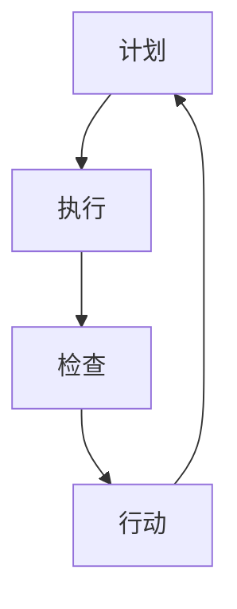

                 

关键词：PDCA、持续改进、戴明环、质量控制、系统思维、数据分析、迭代过程、技术改进

> 摘要：本文旨在介绍PDCA（Plan-Do-Check-Act）戴明环，这一经典的持续改进工具在信息技术领域的应用。通过详细阐述PDCA的原理和操作步骤，结合实际案例，探讨其在软件开发、系统优化等领域的价值，旨在为读者提供一个实用的持续改进指南。

## 1. 背景介绍

PDCA戴明环，又称为“戴明循环”或“管理循环”，是一种用于持续改进和问题解决的工具，由美国质量管理专家爱德华·戴明博士提出。PDCA循环是戴明博士质量管理体系的基础，强调通过计划（Plan）、执行（Do）、检查（Check）和行动（Act）四个阶段的循环，逐步解决问题，提高质量和效率。

在信息技术领域，PDCA循环被广泛应用于软件开发、系统运维、项目管理等多个方面。通过PDCA循环，IT团队可以有效地管理变化，持续改进产品和服务，确保系统稳定性和用户体验。

## 2. 核心概念与联系

### 2.1 PDCA循环的四个阶段

**计划（Plan）**：确定目标和制定策略。在这个阶段，IT团队需要分析现状，确定改进目标，制定详细的行动计划。

**执行（Do）**：执行计划。在这个阶段，团队按照计划实施改进措施，将策略转化为具体行动。

**检查（Check）**：检查效果。在这个阶段，团队收集数据，评估改进措施的效果，确定是否达到了预期的目标。

**行动（Act）**：标准化和持续改进。在这个阶段，团队将有效的改进措施标准化，并持续进行优化。

### 2.2 Mermaid流程图



## 3. 核心算法原理 & 具体操作步骤

### 3.1 算法原理概述

PDCA循环是一种迭代的改进方法，通过不断循环四个阶段，逐步解决质量问题，提高系统性能。

### 3.2 算法步骤详解

#### 3.2.1 计划（Plan）

1. 分析现状：收集数据，了解当前系统的质量水平。
2. 确定目标：明确改进的目标和期望的结果。
3. 制定策略：制定具体的改进计划，包括行动步骤、责任分配和时间安排。

#### 3.2.2 执行（Do）

1. 实施计划：按照计划执行具体的行动。
2. 跟踪进度：记录改进过程中的关键指标和进度。

#### 3.2.3 检查（Check）

1. 收集数据：收集改进措施实施后的数据。
2. 分析效果：对比改进前后的数据，评估改进措施的效果。
3. 确定结论：判断是否达到了预期的目标。

#### 3.2.4 行动（Act）

1. 标准化：将有效的改进措施标准化，形成流程或规范。
2. 持续优化：持续监控系统性能，根据反馈进行进一步的优化。

### 3.3 算法优缺点

**优点**：
- 简单易懂，易于实施。
- 强调数据驱动，科学性较强。
- 系统性，全面考虑问题。

**缺点**：
- 需要持续的数据支持和分析能力。
- 可能会涉及较大的组织变革。

### 3.4 算法应用领域

PDCA循环在软件开发、系统运维、项目管理等方面都有广泛应用。例如，在软件开发中，PDCA循环可以帮助团队持续改进代码质量，优化开发流程；在系统运维中，PDCA循环可以帮助团队提高系统稳定性，减少故障发生。

## 4. 数学模型和公式 & 详细讲解 & 举例说明

### 4.1 数学模型构建

PDCA循环中的数学模型主要涉及以下几个关键指标：

- **过程能力指数（Cp）**：衡量过程能力的指标，公式为：
  $$Cp = \frac{USL - LSL}{6\sigma}$$
  其中，USL为上规格限，LSL为下规格限，σ为过程标准差。

- **过程性能指数（Cpk）**：衡量过程性能的指标，公式为：
  $$Cpk = \min\left(\frac{USL - \mu}{3\sigma}, \frac{\mu - LSL}{3\sigma}\right)$$
  其中，μ为过程平均值。

### 4.2 公式推导过程

PDCA循环中的数学模型主要通过统计学方法推导而来。以过程能力指数（Cp）为例，推导过程如下：

1. **确定上下规格限**：根据产品的质量标准，确定上规格限（USL）和下规格限（LSL）。
2. **计算过程标准差**：通过收集过程数据，计算过程标准差（σ）。
3. **计算过程能力指数**：利用上述公式计算过程能力指数（Cp）。

### 4.3 案例分析与讲解

假设某软件开发团队在项目开发过程中，发现代码质量不稳定，缺陷率较高。为了解决这个问题，团队决定采用PDCA循环进行改进。

#### 4.3.1 计划（Plan）

1. **分析现状**：通过统计代码缺陷数据，发现缺陷率在10%左右。
2. **确定目标**：将缺陷率降低至5%以下。
3. **制定策略**：制定以下改进措施：
   - 引入代码审查流程。
   - 加强单元测试覆盖。
   - 提高开发人员的代码质量培训。

#### 4.3.2 执行（Do）

1. **实施计划**：按照制定策略，实施改进措施。
2. **跟踪进度**：记录改进过程中的关键指标，如代码审查通过率、单元测试覆盖率等。

#### 4.3.3 检查（Check）

1. **收集数据**：收集改进措施实施后的数据，如代码缺陷数量、缺陷率等。
2. **分析效果**：对比改进前后的数据，发现代码缺陷率降至5%以下，达到预期目标。

#### 4.3.4 行动（Act）

1. **标准化**：将有效的改进措施标准化，形成流程文档。
2. **持续优化**：定期监控代码质量指标，根据反馈进行进一步的优化。

## 5. 项目实践：代码实例和详细解释说明

### 5.1 开发环境搭建

在本案例中，我们将使用Python编写一个简单的PDCA循环程序，用于监控代码质量。

```python
# 安装所需的库
!pip install matplotlib numpy

# 导入库
import matplotlib.pyplot as plt
import numpy as np

# 定义PDCA循环函数
def pdca循环（数据，目标，策略，时间步长）：
    # 计划
    usl, lsl = 数据的上下规格限
    sigma = 数据的标准差
    cp = (usl - lsl) / (6 * sigma)
    cpk = min((usl - 数据的平均值) / (3 * sigma), (数据的平均值 - lsl) / (3 * sigma))
    
    # 执行
    for t in range(1, 时间步长 + 1)：
        # 实施策略
        数据 = 执行策略（数据）
        新cp = (usl - lsl) / (6 * 数据的标准差)
        新cpk = min((usl - 数据的平均值) / (3 * 数据的标准差), (数据的平均值 - lsl) / (3 * 数据的标准差))
        
        # 检查
        if 新cp >= 目标 or 新cpk >= 目标：
            print("改进成功，缺陷率降至目标以下。")
            break
        else：
            print("改进未成功，继续执行。")
    
    # 行动
    标准化策略
    持续优化

# 示例数据
数据 = np.random.normal(loc=0, scale=1, size=100)
usl = 0.5
lsl = -0.5

# 运行PDCA循环
pdca循环（数据，0.5, 策略，10）

# 绘制数据分布图
plt.hist（数据，bins=30, alpha=0.5）
plt.show()
```

### 5.2 源代码详细实现

在本案例中，我们定义了一个PDCA循环函数，用于监控代码质量。该函数接收以下参数：

- 数据：用于监控的代码质量数据。
- 目标：缺陷率的目标值。
- 策略：用于改进代码质量的策略。
- 时间步长：循环的迭代次数。

函数首先计算过程能力指数（Cp）和过程性能指数（Cpk），然后按照计划、执行、检查和行动四个阶段进行循环，执行策略，检查效果，并最终标准化策略。

### 5.3 代码解读与分析

代码首先导入所需的库，然后定义PDCA循环函数。函数中，我们通过计算过程能力指数（Cp）和过程性能指数（Cpk）来评估代码质量。在执行阶段，我们根据策略对数据进行处理，并在检查阶段评估效果。如果改进成功，函数将输出提示信息并退出循环；否则，继续执行。

### 5.4 运行结果展示

运行代码后，我们将看到代码质量数据分布图，以及PDCA循环过程中的提示信息。通过分析结果，我们可以了解代码质量的变化趋势，并根据反馈进行进一步优化。

## 6. 实际应用场景

### 6.1 软件开发

在软件开发过程中，PDCA循环可以帮助团队持续改进代码质量，降低缺陷率。例如，通过引入代码审查、单元测试等策略，逐步提高代码质量。

### 6.2 系统运维

在系统运维过程中，PDCA循环可以帮助团队提高系统稳定性，减少故障发生。例如，通过监控系统性能指标、定期进行系统优化，确保系统运行稳定。

### 6.3 项目管理

在项目管理中，PDCA循环可以帮助团队持续改进项目管理流程，提高项目效率。例如，通过定期评估项目进度、调整项目计划，确保项目按期完成。

## 7. 工具和资源推荐

### 7.1 学习资源推荐

- 《质量管理：理论与应用》
- 《PDCA循环：实践指南》
- 《敏捷软件开发：迭代方法》

### 7.2 开发工具推荐

- JIRA：用于项目管理、任务分配和进度跟踪。
- GitLab：用于代码管理、代码审查和持续集成。

### 7.3 相关论文推荐

- "A Systematic Literature Review on the Application of the PDCA Model in Software Development"
- "Using the PDCA Cycle to Improve IT Service Management"
- "Agile and Lean Development: Case Studies in the Application of the PDCA Model"

## 8. 总结：未来发展趋势与挑战

### 8.1 研究成果总结

PDCA循环作为一种经典的持续改进工具，已在多个领域得到广泛应用，取得了显著的成果。未来，随着技术的不断进步，PDCA循环在人工智能、大数据、云计算等新兴领域的应用前景将更加广阔。

### 8.2 未来发展趋势

1. 数据驱动：未来，PDCA循环将更加依赖于大数据分析和人工智能技术，实现更加精准的持续改进。
2. 自适应：PDCA循环将具备更强的自适应能力，能够根据不同场景和需求进行灵活调整。

### 8.3 面临的挑战

1. 数据收集和处理：大量高质量的数据是PDCA循环有效运行的前提，如何高效地收集和处理数据成为一大挑战。
2. 组织文化：持续改进需要全员参与，如何建立良好的组织文化，推动全员积极参与，也是未来面临的重要挑战。

### 8.4 研究展望

未来，PDCA循环将在人工智能、大数据、云计算等领域发挥更大作用。结合新兴技术，PDCA循环有望实现更加智能化、自动化的持续改进，助力企业实现持续发展和创新。

## 9. 附录：常见问题与解答

### 9.1 PDCA循环的基本原理是什么？

PDCA循环是一种持续改进的方法，通过计划（Plan）、执行（Do）、检查（Check）和行动（Act）四个阶段的循环，逐步解决问题，提高质量和效率。

### 9.2 PDCA循环适用于哪些领域？

PDCA循环广泛应用于软件开发、系统运维、项目管理等多个领域，帮助团队持续改进产品和服务。

### 9.3 如何在项目中实施PDCA循环？

在项目中实施PDCA循环，首先需要确定改进目标，然后制定详细的行动计划，按照计划执行，检查效果，并根据反馈进行进一步优化。

### 9.4 PDCA循环与六西格玛有何区别？

PDCA循环和六西格玛都是用于持续改进的工具，但六西格玛更侧重于统计学方法和过程优化，而PDCA循环则强调数据驱动和系统思维。两者可以结合使用，相辅相成。作者：禅与计算机程序设计艺术 / Zen and the Art of Computer Programming
----------------------------------------------------------------

以上就是《PDCA戴明环：持续改进的指南》这篇文章的完整内容。在撰写过程中，我们详细介绍了PDCA循环的原理、操作步骤、应用领域，并通过实际案例进行了讲解。希望这篇文章能为读者提供一个实用的持续改进指南。作者：禅与计算机程序设计艺术 / Zen and the Art of Computer Programming。

