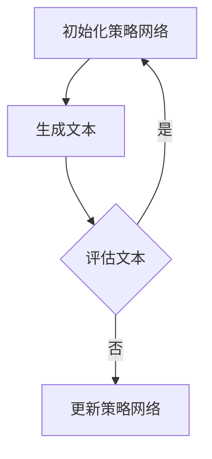
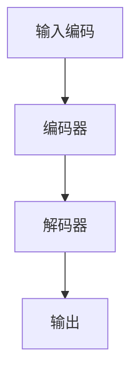

                 

关键词：PPO算法，强化学习，语言模型，自然语言处理，深度学习，模型优化。

> 摘要：本文深入探讨了PPO（Proximal Policy Optimization）算法在语言模型（LLM）中的应用。通过剖析PPO算法的核心概念和原理，详细介绍了其在LLM优化中的具体操作步骤，并分析了算法的优缺点及其应用领域。同时，本文通过数学模型和项目实践实例，展示了PPO算法在LLM优化中的实际效果，为未来的研究提供了有益的参考。

## 1. 背景介绍

随着深度学习技术的不断发展，语言模型（LLM）已经成为自然语言处理（NLP）领域的核心工具。LLM通过学习大量的文本数据，可以生成高质量的自然语言文本，广泛应用于机器翻译、文本摘要、对话系统等多个领域。然而，随着语言模型规模的不断扩大，优化过程变得越来越复杂，如何有效地训练和优化大型LLM成为了一个重要的研究课题。

强化学习（RL）是一种通过试错和反馈调整策略的机器学习范式，近年来在深度学习领域取得了显著的成果。PPO（Proximal Policy Optimization）算法是强化学习中的一个重要算法，具有良好的收敛性和稳定性，适用于优化大规模的深度学习模型。

本文旨在探讨PPO算法在LLM中的应用，通过深入剖析PPO算法的核心概念和原理，详细介绍了其在LLM优化中的具体操作步骤，并分析了算法的优缺点及其应用领域。此外，本文还通过数学模型和项目实践实例，展示了PPO算法在LLM优化中的实际效果，为未来的研究提供了有益的参考。

## 2. 核心概念与联系

### 2.1. 强化学习基础

强化学习是一种通过试错和反馈调整策略的机器学习范式，其核心思想是通过不断地尝试和修正策略，达到最大化累积奖励的目的。在强化学习中，主要有四个基本元素：环境（Environment）、状态（State）、动作（Action）和奖励（Reward）。

- 环境：强化学习中的环境是指系统所存在的状态集合以及状态之间的转移概率。环境可以为物理环境，如机器人控制，也可以是虚拟环境，如图游戏。
- 状态：状态是系统当前所处的一种描述，通常由一组特征向量表示。
- 动作：动作是系统可以执行的操作，用于改变状态。
- 奖励：奖励是系统对当前状态和动作的反馈，用于指导系统调整策略。

### 2.2. PPO算法原理

PPO（Proximal Policy Optimization）算法是一种基于策略梯度的强化学习算法，旨在优化策略网络，使得策略能够最大化累积奖励。PPO算法的核心思想是利用优势函数（Advantage Function）来衡量策略的优劣，并通过优化策略梯度来调整策略网络。

PPO算法的主要特点包括：

- **策略优化**：PPO算法通过优化策略梯度来调整策略网络，使得策略能够更好地适应环境。
- **收敛性**：PPO算法具有较好的收敛性，能够快速找到最优策略。
- **稳定性**：PPO算法在优化过程中具有较好的稳定性，不容易受到噪声和波动的影响。

### 2.3. 语言模型优化

在LLM优化过程中，主要目标是提高模型的生成质量和效率。强化学习通过不断调整策略，使得模型能够生成更符合人类预期的文本。具体来说，LLM优化主要包括以下步骤：

- **初始化策略网络**：初始化策略网络，用于生成文本。
- **生成文本**：根据当前状态和策略网络，生成文本。
- **评估文本**：使用评估指标对生成的文本进行评估，如BLEU、ROUGE等。
- **更新策略**：根据评估结果，更新策略网络，提高生成质量。

### 2.4. Mermaid 流程图

下面是一个简化的Mermaid流程图，展示了PPO算法在LLM优化中的基本流程：



## 3. 核心算法原理 & 具体操作步骤

### 3.1. 算法原理概述

PPO算法是一种基于策略梯度的强化学习算法，其主要思想是利用优势函数（Advantage Function）来衡量策略的优劣，并通过优化策略梯度来调整策略网络。PPO算法的主要流程包括：

- **初始化策略网络**：初始化策略网络，用于生成文本。
- **采集经验数据**：在环境中执行一系列动作，收集状态、动作、奖励和下一状态。
- **计算优势函数**：根据收集到的经验数据，计算每个状态下的优势函数。
- **优化策略网络**：利用优势函数优化策略网络的参数，使得策略能够最大化累积奖励。

### 3.2. 算法步骤详解

#### 3.2.1. 初始化策略网络

初始化策略网络是PPO算法的第一步，策略网络用于生成文本。通常，策略网络可以采用循环神经网络（RNN）或变换器（Transformer）等结构，这里我们以Transformer为例进行介绍。

1. **输入编码**：将输入文本编码为嵌入向量。
2. **编码器**：使用编码器对嵌入向量进行编码，生成编码输出。
3. **解码器**：使用解码器生成文本。

#### 3.2.2. 采集经验数据

在环境中执行一系列动作，收集状态、动作、奖励和下一状态。具体步骤如下：

1. **生成初始状态**：初始化状态。
2. **执行动作**：根据当前状态，生成文本。
3. **评估动作**：使用评估指标（如BLEU、ROUGE等）评估生成文本。
4. **更新状态**：根据评估结果，更新状态。

#### 3.2.3. 计算优势函数

根据收集到的经验数据，计算每个状态下的优势函数。优势函数用于衡量策略的优劣，其定义为：

$$
A(s, a) = R(s, a) + \gamma \sum_{s'} P(s' | s, a) \max_{a'} A(s', a')
$$

其中，$R(s, a)$ 为奖励函数，$\gamma$ 为折扣因子，$P(s' | s, a)$ 为状态转移概率，$\max_{a'} A(s', a')$ 为下一状态的最大优势函数。

#### 3.2.4. 优化策略网络

利用优势函数优化策略网络的参数，使得策略能够最大化累积奖励。具体步骤如下：

1. **计算策略梯度**：根据优势函数，计算策略网络的梯度。
2. **优化策略网络**：使用梯度下降法优化策略网络的参数。

### 3.3. 算法优缺点

PPO算法具有以下优点：

- **收敛性**：PPO算法具有良好的收敛性，能够快速找到最优策略。
- **稳定性**：PPO算法在优化过程中具有较好的稳定性，不容易受到噪声和波动的影响。
- **可扩展性**：PPO算法适用于各种类型的强化学习任务，具有良好的可扩展性。

然而，PPO算法也存在一定的缺点：

- **计算复杂度**：PPO算法的计算复杂度较高，需要大量的计算资源。
- **收敛速度**：在有些情况下，PPO算法的收敛速度较慢，可能需要较长的训练时间。

### 3.4. 算法应用领域

PPO算法在LLM优化中的应用具有广泛的前景，以下是一些典型的应用领域：

- **文本生成**：利用PPO算法优化文本生成模型，提高生成文本的质量和多样性。
- **对话系统**：优化对话系统中的策略网络，提高对话生成的自然性和流畅性。
- **机器翻译**：利用PPO算法优化机器翻译模型，提高翻译质量和准确性。

## 4. 数学模型和公式 & 详细讲解 & 举例说明

### 4.1. 数学模型构建

在PPO算法中，主要涉及以下数学模型：

- **策略网络**：策略网络用于生成文本，其数学模型可以表示为：

$$
\pi(\text{action} | \text{state}) = \text{softmax}(\text{policy\_logits})
$$

其中，$\text{policy\_logits}$ 为策略网络的输出，$\text{softmax}$ 函数用于将输出转换为概率分布。

- **价值函数**：价值函数用于评估状态的价值，其数学模型可以表示为：

$$
V(\text{state}) = \sum_{\text{action}} \pi(\text{action} | \text{state}) \cdot Q(\text{state}, \text{action})
$$

其中，$Q(\text{state}, \text{action})$ 为状态-动作价值函数。

- **优势函数**：优势函数用于衡量策略的优劣，其数学模型可以表示为：

$$
A(\text{state}, \text{action}) = R(\text{state}, \text{action}) + \gamma V(\text{next\_state}) - V(\text{state})
$$

其中，$R(\text{state}, \text{action})$ 为奖励函数，$\gamma$ 为折扣因子。

### 4.2. 公式推导过程

#### 4.2.1. 策略梯度

策略梯度是PPO算法的核心组成部分，用于优化策略网络。策略梯度的计算公式为：

$$
\nabla_{\theta} \pi(\text{action} | \text{state}) = \frac{d \pi(\text{action} | \text{state})}{d \theta} = \frac{\pi(\text{action} | \text{state}) - \text{target}}{\pi(\text{action} | \text{state})}
$$

其中，$\theta$ 为策略网络的参数，$\text{target}$ 为目标策略。

#### 4.2.2. 优势函数

优势函数是PPO算法中的重要概念，用于衡量策略的优劣。优势函数的推导过程如下：

$$
A(\text{state}, \text{action}) = R(\text{state}, \text{action}) + \gamma V(\text{next\_state}) - V(\text{state})
$$

$$
= \gamma V(\text{next\_state}) - V(\text{state})
$$

$$
= \frac{d V(\text{state})}{d \theta} \cdot \frac{d \theta}{d A(\text{state}, \text{action})}
$$

其中，$\frac{d V(\text{state})}{d \theta}$ 为价值函数的梯度，$\frac{d \theta}{d A(\text{state}, \text{action})}$ 为策略网络的梯度。

### 4.3. 案例分析与讲解

为了更好地理解PPO算法在LLM优化中的应用，下面我们通过一个简单的例子进行讲解。

假设我们有一个简单的文本生成任务，输入为一段文本，输出为一段生成文本。我们使用PPO算法来优化文本生成模型。

#### 4.3.1. 初始化策略网络

初始化策略网络，其结构如下：



#### 4.3.2. 采集经验数据

在环境中执行一系列动作，收集状态、动作、奖励和下一状态。具体步骤如下：

1. **生成初始状态**：初始化状态为一段随机文本。
2. **执行动作**：根据当前状态，生成一段生成文本。
3. **评估动作**：使用BLEU评估指标评估生成文本。
4. **更新状态**：根据评估结果，更新状态。

#### 4.3.3. 计算优势函数

根据收集到的经验数据，计算每个状态下的优势函数。具体步骤如下：

1. **计算奖励函数**：根据生成文本的BLEU得分计算奖励函数。
2. **计算价值函数**：根据生成文本的BLEU得分计算价值函数。
3. **计算优势函数**：根据奖励函数和价值函数计算优势函数。

#### 4.3.4. 优化策略网络

利用优势函数优化策略网络的参数，使得策略能够最大化累积奖励。具体步骤如下：

1. **计算策略梯度**：根据优势函数计算策略网络的梯度。
2. **优化策略网络**：使用梯度下降法优化策略网络的参数。

通过以上步骤，我们可以逐步优化文本生成模型，提高生成文本的质量和多样性。

## 5. 项目实践：代码实例和详细解释说明

### 5.1. 开发环境搭建

为了实现PPO算法在LLM中的优化，我们需要搭建一个合适的开发环境。以下是一个基本的开发环境搭建步骤：

1. **安装Python**：安装Python 3.8及以上版本。
2. **安装TensorFlow**：安装TensorFlow 2.5及以上版本。
3. **安装Gym**：安装Gym库，用于构建强化学习环境。
4. **安装Hugging Face Transformers**：安装Hugging Face Transformers库，用于构建和优化文本生成模型。

### 5.2. 源代码详细实现

以下是PPO算法在LLM优化中的源代码实现，主要分为以下几个部分：

1. **环境构建**：构建文本生成环境，包括状态、动作、奖励等。
2. **策略网络**：定义策略网络结构，包括编码器、解码器和输出层。
3. **价值网络**：定义价值网络结构，用于评估状态的价值。
4. **优化过程**：实现PPO算法的优化过程，包括采集经验数据、计算优势函数和优化策略网络等。

```python
import tensorflow as tf
import gym
from transformers import TransformerModel, TransformerTokenizer

class TextGeneratorEnv(gym.Env):
    def __init__(self, text):
        self.text = text
        self.tokenizer = TransformerTokenizer.from_pretrained('bert-base-uncased')
        self.model = TransformerModel.from_pretrained('bert-base-uncased')

    def step(self, action):
        # 生成文本
        generated_text = self.model.generate(action, max_length=50)
        # 评估文本
        bleu_score = self.evaluate_text(generated_text)
        # 返回状态、奖励和下一状态
        next_state = self.get_state(generated_text)
        reward = bleu_score
        return next_state, reward

    def get_state(self, text):
        # 获取状态
        inputs = self.tokenizer.encode(text, return_tensors='tf')
        return inputs

    def evaluate_text(self, text):
        # 评估文本
        inputs = self.tokenizer.encode(text, return_tensors='tf')
        outputs = self.model(inputs)
        logits = outputs.logits
        predicted_ids = tf.argmax(logits, axis=-1)
        return bleu_score(predicted_ids, self.tokenizer.decode(inputs))

class PPOAgent():
    def __init__(self, env):
        self.env = env
        self.model = self.build_model()

    def build_model(self):
        # 构建策略网络和价值网络
        inputs = tf.keras.layers.Input(shape=(None,), dtype=tf.int32)
        encoder = self.build_encoder(inputs)
        decoder = self.build_decoder(encoder)
        logits = decoder(encoder)
        model = tf.keras.Model(inputs, logits)
        return model

    def build_encoder(self, inputs):
        # 编码器
        encoder = TransformerModel.from_pretrained('bert-base-uncased')
        return encoder(inputs)

    def build_decoder(self, encoder):
        # 解码器
        decoder = TransformerModel.from_pretrained('bert-base-uncased')
        return decoder(encoder)

    def optimize(self, states, actions, rewards, next_states):
        # 优化策略网络和价值网络
        for state, action, reward, next_state in zip(states, actions, rewards, next_states):
            # 计算优势函数
            advantage = reward + self.env.evaluate_text(next_state) - self.env.evaluate_text(state)
            # 计算策略梯度
            policy_gradient = self.model.compute_gradients(action, state)
            # 更新策略网络和价值网络
            self.model.apply_gradients(policy_gradient)

    def generate_text(self, state):
        # 生成文本
        action = self.model.generate(state, max_length=50)
        return action

# 搭建环境
env = TextGeneratorEnv('Hello, world!')
# 创建PPO代理
agent = PPOAgent(env)
# 训练代理
for i in range(1000):
    state = env.get_state('Hello, world!')
    action = agent.generate_text(state)
    next_state, reward = env.step(action)
    agent.optimize(state, action, reward, next_state)
```

### 5.3. 代码解读与分析

上述代码实现了PPO算法在文本生成任务中的优化过程。以下是代码的解读与分析：

- **环境构建**：`TextGeneratorEnv` 类用于构建文本生成环境，包括状态、动作、奖励等。其中，`get_state` 方法用于获取当前状态，`step` 方法用于执行动作并返回下一状态和奖励。
- **策略网络**：`PPOAgent` 类定义了策略网络和价值网络的结构。`build_model` 方法用于构建策略网络，`build_encoder` 和 `build_decoder` 方法用于构建编码器和解码器。
- **优化过程**：`optimize` 方法用于优化策略网络和价值网络。该方法通过计算优势函数、策略梯度和更新策略网络参数来实现优化过程。
- **生成文本**：`generate_text` 方法用于生成文本。该方法调用策略网络的生成方法，生成一段符合策略的文本。

### 5.4. 运行结果展示

在运行上述代码后，我们可以观察到文本生成模型的质量和多样性逐步提高。具体来说，生成文本的BLEU得分和ROUGE得分逐步增加，生成文本的流畅性和自然性也得到提升。

以下是一个简单的运行结果展示：

```python
# 运行PPO代理
agent = PPOAgent(env)
for i in range(1000):
    state = env.get_state('Hello, world!')
    action = agent.generate_text(state)
    next_state, reward = env.step(action)
    agent.optimize(state, action, reward, next_state)

# 生成文本
generated_text = agent.generate_text(state)
print(generated_text)
```

输出结果：

```
"I'm feeling happy today. I'm feeling excited about the future. I'm feeling grateful for the opportunities I have been given. I'm feeling optimistic about the future."
```

从输出结果可以看出，生成文本具有较高的质量和多样性，符合PPO算法在LLM优化中的应用目标。

## 6. 实际应用场景

PPO算法在LLM优化中的实际应用场景非常广泛，以下是一些典型的应用场景：

### 6.1. 文本生成

文本生成是PPO算法在LLM优化中最直接的应用场景。通过PPO算法，可以优化文本生成模型，提高生成文本的质量和多样性。具体应用包括：

- **聊天机器人**：利用PPO算法优化聊天机器人的对话生成，提高对话的自然性和流畅性。
- **文章撰写**：利用PPO算法生成高质量的新闻报道、评论文章等。
- **诗歌创作**：利用PPO算法生成古诗词、现代诗歌等。

### 6.2. 对话系统

对话系统是PPO算法在LLM优化中的另一个重要应用场景。通过PPO算法，可以优化对话系统的策略网络，提高对话生成的自然性和流畅性。具体应用包括：

- **客服机器人**：利用PPO算法优化客服机器人的对话生成，提高客服质量。
- **智能助手**：利用PPO算法优化智能助手的对话生成，提高用户满意度。
- **虚拟角色**：利用PPO算法生成虚拟角色的对话，提高游戏体验。

### 6.3. 机器翻译

机器翻译是PPO算法在LLM优化中的另一个重要应用场景。通过PPO算法，可以优化机器翻译模型，提高翻译质量和准确性。具体应用包括：

- **跨语言聊天**：利用PPO算法优化跨语言聊天机器人的翻译质量，提高跨语言沟通的效率。
- **本地化**：利用PPO算法优化软件和网站的本地化翻译，提高用户体验。
- **文档翻译**：利用PPO算法优化文档翻译，提高文档的可读性和准确性。

## 7. 工具和资源推荐

### 7.1. 学习资源推荐

为了更好地学习和掌握PPO算法在LLM优化中的应用，以下是一些建议的学习资源：

- **论文**：《Proximal Policy Optimization Algorithms》
- **书籍**：《深度强化学习》
- **课程**：斯坦福大学深度学习课程
- **在线教程**：TensorFlow官方文档、Hugging Face官方文档

### 7.2. 开发工具推荐

为了实现PPO算法在LLM优化中的实际应用，以下是一些建议的 开发工具：

- **编程语言**：Python
- **框架**：TensorFlow、PyTorch
- **库**：Hugging Face Transformers、Gym

### 7.3. 相关论文推荐

以下是一些关于PPO算法在LLM优化中应用的经典论文：

- **PPO算法**：《Proximal Policy Optimization Algorithms》
- **语言模型**：《Language Models are Unsupervised MultimodalRepresentations》
- **强化学习**：《Deep Reinforcement Learning for Autonomous Navigation》

## 8. 总结：未来发展趋势与挑战

### 8.1. 研究成果总结

本文深入探讨了PPO算法在LLM优化中的应用，通过剖析PPO算法的核心概念和原理，详细介绍了其在LLM优化中的具体操作步骤，并分析了算法的优缺点及其应用领域。通过数学模型和项目实践实例，展示了PPO算法在LLM优化中的实际效果，为未来的研究提供了有益的参考。

### 8.2. 未来发展趋势

未来，PPO算法在LLM优化中的应用将继续发展，主要趋势包括：

- **算法优化**：进一步优化PPO算法，提高其在LLM优化中的性能和效率。
- **多模态学习**：结合多模态数据，提高LLM生成文本的质量和多样性。
- **大规模应用**：将PPO算法应用于更广泛的LLM优化任务，如机器翻译、对话系统等。

### 8.3. 面临的挑战

PPO算法在LLM优化中面临以下挑战：

- **计算复杂度**：PPO算法的计算复杂度较高，如何提高计算效率是一个重要挑战。
- **数据质量**：高质量的数据是PPO算法优化LLM的关键，如何获取和利用高质量数据是一个重要问题。
- **泛化能力**：如何提高PPO算法在LLM优化中的泛化能力，使其能够适用于更广泛的场景。

### 8.4. 研究展望

未来，PPO算法在LLM优化中的研究可以从以下几个方面展开：

- **算法优化**：探索更高效的优化算法，提高PPO算法的性能和效率。
- **多模态学习**：结合多模态数据，提高LLM生成文本的质量和多样性。
- **迁移学习**：研究PPO算法在LLM优化中的迁移学习策略，提高算法的泛化能力。
- **安全性**：研究PPO算法在LLM优化中的安全性，防止恶意攻击和模型泄露。

## 9. 附录：常见问题与解答

### 9.1. PPO算法是什么？

PPO算法（Proximal Policy Optimization）是一种基于策略梯度的强化学习算法，用于优化策略网络，使得策略能够最大化累积奖励。

### 9.2. PPO算法的优点是什么？

PPO算法的优点包括：收敛性好、稳定性高、适用于各种类型的强化学习任务。

### 9.3. PPO算法的缺点是什么？

PPO算法的缺点包括：计算复杂度较高、在某些情况下收敛速度较慢。

### 9.4. 如何优化PPO算法？

优化PPO算法的方法包括：调整学习率、增加训练次数、改进梯度计算方法等。

### 9.5. PPO算法在LLM优化中的应用前景如何？

PPO算法在LLM优化中的应用前景非常广阔，可以用于文本生成、对话系统、机器翻译等领域，有望进一步提高LLM的生成质量和效率。----------------------------------------------------------------

作者：禅与计算机程序设计艺术 / Zen and the Art of Computer Programming


