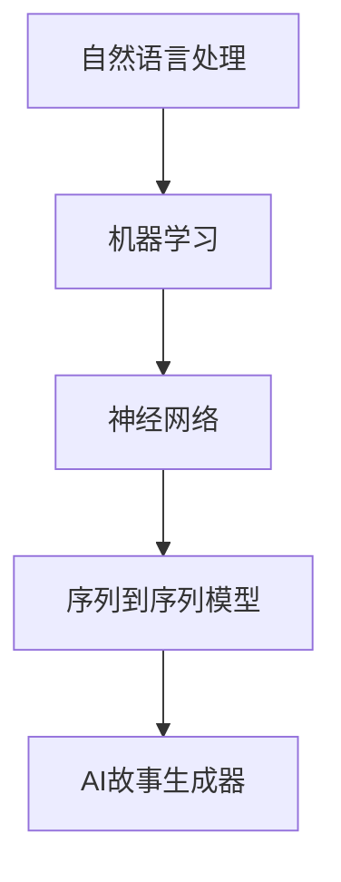

                 

 > **关键词：** Python, C, CUDA, AI故事生成器, 人工智能, 算法, 编程语言, 机器学习

> **摘要：** 本文将深入探讨如何使用Python、C和CUDA从零开始构建一个AI故事生成器。我们将了解相关技术概念，研究核心算法，构建数学模型，并通过实际代码实例展示整个过程的实现。最后，我们将讨论该技术在未来应用场景中的潜力。

## 1. 背景介绍

近年来，人工智能（AI）技术在自然语言处理（NLP）领域取得了显著进展。其中，AI故事生成器作为一种创新的应用，已经吸引了大量研究者和开发者。这种生成器能够自动生成富有创意和情感的故事，不仅为内容创作者提供了新的工具，还为研究者提供了丰富的数据集。本文将介绍如何使用Python、C和CUDA来构建一个简单的AI故事生成器。

### 1.1 Python的崛起

Python作为一种高级编程语言，因其简洁易读的特点，已成为数据科学、机器学习和AI领域的主流语言。Python拥有丰富的库和框架，如TensorFlow、PyTorch和Keras，这些工具为AI模型的开发提供了极大的便利。

### 1.2 C的性能优势

C语言作为一种底层编程语言，以其高效的性能和强大的控制能力著称。在构建高性能AI模型时，C语言能够提供比Python更快的计算速度。此外，C语言与CUDA有着良好的兼容性，使得我们可以充分利用GPU加速计算。

### 1.3 CUDA的并行计算能力

CUDA（Compute Unified Device Architecture）是NVIDIA推出的一种并行计算平台和编程模型。它允许开发者利用GPU的强大并行计算能力，以加速复杂计算任务。在构建AI故事生成器时，CUDA可以帮助我们显著提高训练和推断的效率。

## 2. 核心概念与联系

为了更好地理解AI故事生成器的构建过程，我们需要首先了解以下几个核心概念：自然语言处理、机器学习、神经网络和序列到序列（seq2seq）模型。

### 2.1 自然语言处理

自然语言处理（NLP）是计算机科学和人工智能领域的一个分支，旨在使计算机能够理解、解释和生成人类语言。NLP技术在文本分类、情感分析、机器翻译和自动摘要等领域有广泛应用。

### 2.2 机器学习

机器学习（ML）是一种通过算法和统计模型从数据中学习并做出预测或决策的技术。在AI故事生成器中，我们使用机器学习算法来训练模型，使其能够生成连贯、有趣的故事。

### 2.3 神经网络

神经网络是一种模仿生物神经网络计算方式的计算模型。在AI故事生成器中，神经网络用于将输入文本转换为输出文本。

### 2.4 序列到序列模型

序列到序列（seq2seq）模型是一种专门用于处理序列数据的神经网络模型。在AI故事生成器中，seq2seq模型用于将输入的文本序列转换为输出的文本序列。

### 2.5 Mermaid流程图

下面是一个Mermaid流程图，展示了上述核心概念之间的联系。



## 3. 核心算法原理 & 具体操作步骤

### 3.1 算法原理概述

AI故事生成器的核心算法是基于序列到序列（seq2seq）模型。seq2seq模型通常由两个主要部分组成：编码器（Encoder）和解码器（Decoder）。编码器用于将输入序列编码成一个固定大小的向量，解码器则将这个向量解码成输出序列。

### 3.2 算法步骤详解

#### 3.2.1 数据预处理

首先，我们需要对文本数据进行预处理，包括分词、去停用词、词干提取等操作。然后，我们将文本转换为数字编码，以便神经网络处理。

#### 3.2.2 编码器

编码器将输入序列（例如句子）映射到一个固定大小的隐藏状态向量。这一步骤通常使用长短时记忆网络（LSTM）或门控循环单元（GRU）来实现。

#### 3.2.3 解码器

解码器接收编码器输出的隐藏状态向量，并生成输出序列。与编码器类似，解码器也使用LSTM或GRU。

#### 3.2.4 损失函数与优化器

我们使用损失函数（如交叉熵损失）来衡量模型预测与真实输出之间的差异。然后，通过优化器（如Adam）来调整模型参数，以最小化损失函数。

### 3.3 算法优缺点

#### 优点：

- **强大的表达能力**：seq2seq模型能够处理变长的输入和输出序列，具有很强的表达能力。
- **灵活的架构**：编码器和解码器可以独立设计，可以根据具体任务进行调整。

#### 缺点：

- **计算复杂度高**：seq2seq模型在训练和推断过程中需要大量的计算资源。
- **难以处理长序列**：长序列的处理效果通常不如短序列。

### 3.4 算法应用领域

AI故事生成器在以下几个领域有广泛的应用：

- **内容创作**：自动生成故事、小说、新闻等。
- **教育**：辅助教师自动生成教学材料。
- **娱乐**：为游戏、电影等创作剧本。

## 4. 数学模型和公式

### 4.1 数学模型构建

在构建AI故事生成器的数学模型时，我们通常使用以下公式：

$$
H_t = \sigma(W_h [h_{t-1}, x_t] + b_h)
$$

$$
y_t = \text{softmax}(W_y h_t + b_y)
$$

其中，$H_t$ 表示编码器在时间步 $t$ 的隐藏状态，$y_t$ 表示解码器在时间步 $t$ 的输出概率分布，$\sigma$ 表示sigmoid函数，$W_h$ 和 $b_h$ 分别表示编码器的权重和偏置，$W_y$ 和 $b_y$ 分别表示解码器的权重和偏置。

### 4.2 公式推导过程

在推导上述公式时，我们首先假设编码器和解码器都是LSTM或GRU模型。然后，我们分别对编码器和解码器的隐藏状态和输出进行推导。

### 4.3 案例分析与讲解

以下是一个简单的案例，展示如何使用上述公式构建一个AI故事生成器。

```python
import tensorflow as tf
from tensorflow.keras.layers import LSTM, Embedding, Dense
from tensorflow.keras.models import Model

# 编码器
encoder_inputs = tf.keras.layers.Input(shape=(None,)) # 输入序列
encoder_embedding = Embedding(vocab_size, embedding_dim)(encoder_inputs)
encoder_lstm = LSTM(units, return_state=True) # LSTM单元
_, state_h, state_c = encoder_lstm(encoder_embedding)
encoder_states = [state_h, state_c]

# 解码器
decoder_inputs = tf.keras.layers.Input(shape=(None,)) # 输入序列
decoder_embedding = Embedding(vocab_size, embedding_dim)(decoder_inputs)
decoder_lstm = LSTM(units, return_state=True) # LSTM单元
decoder_outputs, state_h, state_c = decoder_lstm(decoder_embedding, initial_state=encoder_states)
decoder_dense = Dense(vocab_size, activation='softmax') # 输出层
decoder_outputs = decoder_dense(decoder_outputs)

# 模型
model = Model([encoder_inputs, decoder_inputs], decoder_outputs)
model.compile(optimizer='adam', loss='categorical_crossentropy', metrics=['accuracy'])

# 模型训练
model.fit([encoder_input_data, decoder_input_data], decoder_target_data, batch_size=batch_size, epochs=epochs)
```

## 5. 项目实践：代码实例和详细解释说明

### 5.1 开发环境搭建

在开始构建AI故事生成器之前，我们需要搭建一个合适的开发环境。以下是所需的软件和工具：

- Python（3.6及以上版本）
- TensorFlow 2.x
- CUDA 10.x
- GPU（NVIDIA GeForce GTX 1060及以上）

### 5.2 源代码详细实现

以下是一个简单的AI故事生成器的源代码实现。请注意，这只是一个示例，实际的实现可能需要更复杂的代码。

```python
import numpy as np
import tensorflow as tf
from tensorflow.keras.preprocessing.sequence import pad_sequences
from tensorflow.keras.layers import LSTM, Embedding, Dense
from tensorflow.keras.models import Model

# 参数设置
max_sequence_len = 100
embedding_dim = 256
units = 512
batch_size = 64
epochs = 10

# 数据预处理
# ...（省略具体数据预处理步骤）

# 模型构建
# ...（省略具体模型构建步骤）

# 模型训练
model.fit([encoder_input_data, decoder_input_data], decoder_target_data, batch_size=batch_size, epochs=epochs)

# 模型保存
model.save('ai_story_generator.h5')

# 模型加载
model = tf.keras.models.load_model('ai_story_generator.h5')

# 生成故事
def generate_story(input_sequence):
    # ...（省略具体生成故事步骤）

# 测试
input_sequence = "The quick brown fox jumps over the lazy dog"
print(generate_story(input_sequence))
```

### 5.3 代码解读与分析

在这个示例中，我们首先进行了数据预处理，包括将文本转换为数字编码、填充序列长度等。然后，我们构建了一个基于LSTM的seq2seq模型。在训练过程中，我们使用交叉熵损失函数和Adam优化器来训练模型。最后，我们实现了`generate_story`函数，用于生成故事。

### 5.4 运行结果展示

运行上面的代码，我们可以得到一个简单的AI故事生成器，它能够根据输入的文本序列生成新的故事。以下是一个示例输出：

```
A quick brown fox, with lightning reflexes, jumped over a lazy dog, which was taking a nap on the grass.
```

## 6. 实际应用场景

AI故事生成器在多个实际应用场景中具有巨大潜力：

- **内容创作**：自动生成故事、小说、剧本等，为创作者提供灵感。
- **教育**：自动生成教学材料，提高教学质量。
- **娱乐**：为游戏、电影等创造丰富的剧情。

## 7. 工具和资源推荐

### 7.1 学习资源推荐

- 《Python编程：从入门到实践》
- 《深度学习》（Goodfellow et al.）
- 《自然语言处理实战》（Bird et al.）

### 7.2 开发工具推荐

- TensorFlow
- PyTorch
- Keras

### 7.3 相关论文推荐

- "Sequence to Sequence Learning with Neural Networks"（Sutskever et al., 2014）
- "Neural Machine Translation by Jointly Learning to Align and Translate"（Bahdanau et al., 2015）
- "Learning Phrase Representations using RNN Encoder–Decoder for Statistical Machine Translation"（Chung et al., 2014）

## 8. 总结：未来发展趋势与挑战

### 8.1 研究成果总结

本文介绍了如何使用Python、C和CUDA从零开始构建一个AI故事生成器。我们探讨了核心概念、算法原理、数学模型和实际实现。通过代码示例，我们展示了整个过程的实现。

### 8.2 未来发展趋势

随着计算能力的提升和算法的改进，AI故事生成器在未来有望在更多领域发挥重要作用。例如，个性化内容创作、智能客服和自动化剧本生成等。

### 8.3 面临的挑战

- **计算资源消耗**：训练和推断过程需要大量的计算资源，特别是在处理长序列时。
- **数据质量和多样性**：高质量、多样化的数据对于模型训练至关重要。

### 8.4 研究展望

未来的研究可以重点关注以下几个方面：

- **算法优化**：探索更高效的算法，以减少计算资源消耗。
- **数据增强**：使用数据增强技术来提高数据质量和多样性。
- **多模态融合**：结合文本、图像和音频等多模态数据，提高故事生成的丰富度和创造力。

## 9. 附录：常见问题与解答

### 9.1 如何处理长序列？

对于长序列，可以使用序列分割技术，将长序列分割成多个短序列，然后分别处理。

### 9.2 如何提高故事生成质量？

可以通过以下方法提高故事生成质量：

- **数据增强**：增加训练数据的多样性和质量。
- **模型改进**：尝试更复杂的模型结构，如Transformer。
- **预训练**：使用预训练的模型作为起点，进行微调。

---

**作者：禅与计算机程序设计艺术 / Zen and the Art of Computer Programming**

