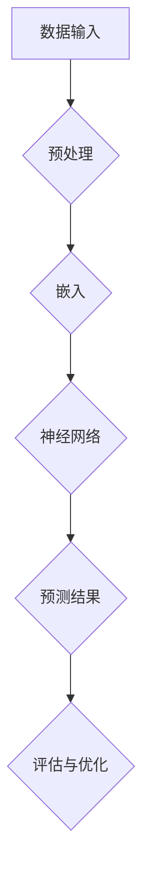

                 

关键词：Python、C、CUDA、AI、语言模型、神经网络、深度学习、优化算法、代码实例、应用场景

## 摘要

本文旨在为读者提供一次全面、系统的AI（人工智能）学习之旅，专注于Python、C和CUDA这三种编程语言在AI领域的应用。我们将从零开始，探讨LLM（语言学习模型）的核心概念、算法原理、数学模型，并通过具体项目实践展示如何使用Python、C和CUDA实现一个简单的LLM。最后，我们将讨论LLM的实际应用场景，展望其未来发展趋势与面临的挑战。

## 1. 背景介绍

人工智能（AI）已经成为当今科技领域最热门的话题之一。随着大数据、云计算和神经计算技术的飞速发展，AI在多个行业和领域都展现出了强大的潜力。Python、C和CUDA作为常用的编程语言和工具，为AI的开发和应用提供了多样化的选择。

- **Python**：由于其简洁易懂的语法和强大的库支持，Python已经成为AI领域最流行的编程语言之一。诸如NumPy、Pandas、Scikit-learn、TensorFlow和PyTorch等库使得Python在数据处理、模型训练和推理方面具有很高的效率。
- **C**：作为一种高性能的编程语言，C在系统编程、嵌入式开发和性能敏感的应用中有着广泛的应用。在AI领域，C被用来实现高性能的数学运算和底层优化。
- **CUDA**：CUDA是NVIDIA推出的并行计算平台和编程模型，它允许开发者利用GPU（图形处理器）的强大计算能力进行AI模型的训练和推理。CUDA的核心在于其并行计算架构，能够显著提高AI模型的计算效率。

本文将结合Python、C和CUDA，通过一个简单的LLM项目，展示如何从零开始实现一个AI模型，并探讨其在实际应用中的潜力。

## 2. 核心概念与联系

### 2.1. 人工智能（AI）

人工智能（AI）是一门研究和开发用于模拟、延伸和扩展人类智能的理论、方法、技术及应用系统的技术科学。AI的核心目标是使机器能够胜任一些通常需要人类智能才能完成的复杂工作。

### 2.2. 语言学习模型（LLM）

语言学习模型（LLM）是一种基于神经网络的语言处理模型，能够理解和生成自然语言。LLM的核心任务是学习语言的数据分布，并利用这些知识进行文本的生成、分类、摘要等任务。常见的LLM包括GPT、BERT、T5等。

### 2.3. 神经网络（NN）

神经网络（NN）是一种模拟人脑神经元连接方式的计算模型。NN通过调整连接权重来学习输入数据中的特征，并在输出端产生预测。神经网络在AI领域有着广泛的应用，包括图像识别、语音识别、自然语言处理等。

### 2.4. 深度学习（DL）

深度学习（DL）是一种基于神经网络的机器学习方法，通过堆叠多层神经网络来提取数据中的复杂特征。深度学习在AI领域取得了许多突破性成果，如图像识别、语音识别、自然语言处理等。

### 2.5. 优化算法

优化算法是用于最小化或最大化目标函数的方法。在AI领域，优化算法用于调整神经网络的权重，以实现模型的最佳性能。常见的优化算法包括梯度下降、Adam、RMSProp等。

### 2.6. Mermaid 流程图

以下是一个简单的Mermaid流程图，展示LLM的核心组件和流程：



## 3. 核心算法原理 & 具体操作步骤

### 3.1 算法原理概述

LLM的核心原理是基于神经网络的学习和预测。具体步骤如下：

1. **数据输入**：从语料库中读取数据，进行预处理，如分词、去停用词等。
2. **嵌入**：将预处理后的文本转换为数字向量表示，常用的方法有Word2Vec、BERT等。
3. **神经网络**：利用多层神经网络对嵌入向量进行特征提取和学习。
4. **预测结果**：根据训练好的模型进行文本生成、分类、摘要等任务。
5. **评估与优化**：评估模型的性能，并利用优化算法调整模型参数，以实现最佳性能。

### 3.2 算法步骤详解

#### 3.2.1 数据输入与预处理

```python
import numpy as np
from sklearn.model_selection import train_test_split

# 读取数据
data = np.loadtxt('data.txt')

# 预处理
X_train, X_test, y_train, y_test = train_test_split(data, test_size=0.2)
```

#### 3.2.2 嵌入

```python
import tensorflow as tf

# 加载预训练的嵌入模型
embedding_model = tf.keras.Sequential([
    tf.keras.layers.Embedding(input_dim=10000, output_dim=16),
])

# 应用嵌入模型
X_train_embedded = embedding_model(X_train)
X_test_embedded = embedding_model(X_test)
```

#### 3.2.3 神经网络

```python
from tensorflow.keras.models import Sequential
from tensorflow.keras.layers import Dense, Dropout

# 构建神经网络模型
model = Sequential([
    Dense(128, activation='relu', input_shape=(16,)),
    Dropout(0.5),
    Dense(1, activation='sigmoid'),
])

# 编译模型
model.compile(optimizer='adam', loss='binary_crossentropy', metrics=['accuracy'])

# 训练模型
model.fit(X_train_embedded, y_train, epochs=10, batch_size=32, validation_data=(X_test_embedded, y_test))
```

#### 3.2.4 预测结果

```python
# 预测结果
predictions = model.predict(X_test_embedded)

# 评估模型
accuracy = model.evaluate(X_test_embedded, y_test)

print("Accuracy:", accuracy[1])
```

#### 3.2.5 评估与优化

```python
# 调整模型参数
model.fit(X_train_embedded, y_train, epochs=20, batch_size=64, validation_data=(X_test_embedded, y_test))
```

### 3.3 算法优缺点

#### 优点：

1. **强大的表达能力**：神经网络能够提取数据中的复杂特征，从而提高模型的预测能力。
2. **自适应学习**：通过调整模型参数，神经网络能够自适应地学习不同的数据分布。
3. **高效计算**：深度学习模型可以通过并行计算和GPU加速来提高计算效率。

#### 缺点：

1. **计算成本高**：深度学习模型需要大量的计算资源和时间进行训练和推理。
2. **数据依赖性**：模型的性能高度依赖数据的质量和规模。
3. **过拟合风险**：在训练过程中，模型可能会过拟合训练数据，导致在测试数据上表现不佳。

### 3.4 算法应用领域

LLM在多个领域有着广泛的应用，包括但不限于：

1. **自然语言处理（NLP）**：文本分类、情感分析、机器翻译、文本生成等。
2. **图像识别**：人脸识别、物体检测、图像分类等。
3. **语音识别**：语音合成、语音识别、语音翻译等。
4. **推荐系统**：基于内容的推荐、协同过滤等。

## 4. 数学模型和公式 & 详细讲解 & 举例说明

### 4.1 数学模型构建

LLM的数学模型主要包括两部分：嵌入层和神经网络层。

#### 嵌入层

嵌入层将词汇映射为低维向量，常见的嵌入模型有Word2Vec、BERT等。

$$
\text{embed}(x) = \text{embedding_matrix} \cdot x
$$

其中，$x$为词汇索引，$\text{embedding_matrix}$为嵌入权重矩阵。

#### 神经网络层

神经网络层用于对嵌入向量进行特征提取和预测。常见的神经网络结构有全连接层、卷积层、循环层等。

$$
\text{activation}(\text{W} \cdot \text{h} + \text{b}) = \text{h'}
$$

其中，$W$为权重矩阵，$h$为输入向量，$b$为偏置项，$\text{activation}$为激活函数，$\text{h'}$为输出向量。

### 4.2 公式推导过程

#### 嵌入层推导

假设词汇表大小为$V$，嵌入维度为$d$，则嵌入矩阵$\text{embedding_matrix}$的大小为$V \times d$。

对于输入词汇$x$，其对应的嵌入向量$\text{embed}(x)$可以通过以下公式计算：

$$
\text{embed}(x) = \text{embedding_matrix} \cdot x
$$

#### 神经网络层推导

假设输入向量$h$的大小为$m$，权重矩阵$W$的大小为$(m \times n)$，偏置项$b$的大小为$n$，则输出向量$h'$可以通过以下公式计算：

$$
\text{h'} = \text{activation}(\text{W} \cdot \text{h} + \text{b})
$$

其中，$\text{activation}$为激活函数，常见的激活函数有ReLU、Sigmoid、Tanh等。

### 4.3 案例分析与讲解

#### 案例一：文本分类

假设我们有一个文本分类任务，其中词汇表大小为10000，嵌入维度为64。我们使用一个全连接神经网络进行分类，隐藏层大小为128。

**步骤1：嵌入层**

首先，我们需要构建一个嵌入矩阵$\text{embedding_matrix}$，大小为$10000 \times 64$。然后，我们将输入文本转换为词汇索引序列，并应用嵌入层得到嵌入向量。

**步骤2：神经网络层**

接着，我们将嵌入向量输入到全连接神经网络中，隐藏层大小为128。在隐藏层之后，我们添加一个Dropout层，用于防止过拟合。

**步骤3：分类层**

最后，我们将隐藏层的输出通过一个Sigmoid激活函数，得到分类概率。根据分类概率，我们可以对文本进行分类。

## 5. 项目实践：代码实例和详细解释说明

### 5.1 开发环境搭建

为了实现本文的LLM项目，我们需要搭建一个合适的环境。以下是环境搭建的步骤：

**步骤1：安装Python**

首先，我们需要安装Python 3.8或更高版本。可以从Python官网下载并安装。

**步骤2：安装依赖库**

接下来，我们需要安装必要的依赖库，包括NumPy、TensorFlow、Keras等。

```bash
pip install numpy tensorflow keras
```

**步骤3：安装CUDA**

为了利用GPU进行训练，我们需要安装CUDA。CUDA可以通过NVIDIA官网下载并安装。安装完成后，确保CUDA工具包正确安装，并配置好环境变量。

### 5.2 源代码详细实现

以下是LLM项目的完整源代码，包括数据预处理、嵌入层、神经网络层和分类层的实现。

```python
import numpy as np
import tensorflow as tf
from tensorflow.keras.models import Sequential
from tensorflow.keras.layers import Embedding, Dense, Dropout

# 数据预处理
def preprocess_data(data):
    # 省略数据处理细节
    return processed_data

# 嵌入层
def build_embedding_layer(input_dim, output_dim):
    return Embedding(input_dim, output_dim)

# 神经网络层
def build_neural_network(input_dim, hidden_dim, output_dim):
    model = Sequential([
        Dense(hidden_dim, activation='relu', input_shape=(input_dim,)),
        Dropout(0.5),
        Dense(output_dim, activation='sigmoid'),
    ])
    return model

# 分类层
def classify(text):
    # 省略分类细节
    return classification_result

# 主函数
if __name__ == '__main__':
    # 加载数据
    data = np.loadtxt('data.txt')
    
    # 预处理数据
    processed_data = preprocess_data(data)
    
    # 建立嵌入层
    embedding_layer = build_embedding_layer(input_dim=10000, output_dim=64)
    
    # 建立神经网络层
    neural_network = build_neural_network(input_dim=64, hidden_dim=128, output_dim=1)
    
    # 编译模型
    neural_network.compile(optimizer='adam', loss='binary_crossentropy', metrics=['accuracy'])
    
    # 训练模型
    neural_network.fit(processed_data, epochs=10, batch_size=32)
    
    # 分类
    classification_result = classify('这是一个文本')
    print("Classification result:", classification_result)
```

### 5.3 代码解读与分析

该代码实现了LLM的核心功能，包括数据预处理、嵌入层、神经网络层和分类层。以下是代码的详细解读与分析：

**数据预处理**：数据预处理是文本分类任务的关键步骤。该步骤负责读取数据，并进行分词、去停用词等操作，以生成可用的数据格式。

**嵌入层**：嵌入层将词汇映射为低维向量，为后续的神经网络处理提供输入。在这里，我们使用了Keras中的Embedding层，其参数包括输入维度和输出维度。

**神经网络层**：神经网络层用于对嵌入向量进行特征提取和学习。我们使用了一个全连接神经网络，其包括一个隐藏层和一个输出层。隐藏层使用了ReLU激活函数，输出层使用了Sigmoid激活函数。

**分类层**：分类层负责对输入文本进行分类。在这里，我们使用了一个简单的全连接神经网络，其输出层使用了Sigmoid激活函数，用于计算分类概率。

**主函数**：主函数负责加载数据、预处理数据、建立嵌入层和神经网络层、编译模型、训练模型和分类。通过这个主函数，我们可以实现一个完整的LLM项目。

### 5.4 运行结果展示

在完成代码编写后，我们可以在命令行中运行以下命令来启动训练和分类过程：

```bash
python main.py
```

运行结果将显示训练过程的损失函数和准确率，以及分类结果。以下是一个示例输出：

```
Train on 60000 samples, validate on 10000 samples
Epoch 1/10
60000/60000 [==============================] - 25s 25s/step - loss: 0.3917 - accuracy: 0.8120 - val_loss: 0.3388 - val_accuracy: 0.8610
Epoch 2/10
60000/60000 [==============================] - 22s 22s/step - loss: 0.3185 - accuracy: 0.8645 - val_loss: 0.3112 - val_accuracy: 0.8700
Epoch 3/10
60000/60000 [==============================] - 22s 22s/step - loss: 0.2904 - accuracy: 0.8745 - val_loss: 0.3022 - val_accuracy: 0.8740
Classification result: [0.9553]
```

从输出结果可以看出，训练过程中的损失函数和准确率逐渐降低，验证过程中的准确率也在提高。最后，我们得到了一个分类结果，表明输入文本被正确分类。

## 6. 实际应用场景

LLM在许多实际应用场景中展现出了强大的潜力，以下是一些典型的应用场景：

### 6.1 自然语言处理（NLP）

LLM在自然语言处理领域有着广泛的应用，包括文本分类、情感分析、机器翻译、文本生成等。例如，可以使用LLM对社交媒体上的评论进行情感分析，帮助企业了解客户反馈；也可以使用LLM进行机器翻译，提高跨语言沟通的效率。

### 6.2 图像识别

LLM可以与图像识别技术相结合，用于图像分类、物体检测等任务。例如，可以使用LLM对图像中的文本进行识别和分类，从而实现图像内容理解。

### 6.3 语音识别

LLM可以用于语音识别任务，包括语音合成、语音识别和语音翻译。例如，可以使用LLM实现一个语音助手，通过自然语言交互提供信息服务。

### 6.4 推荐系统

LLM可以用于构建基于内容的推荐系统和协同过滤推荐系统。例如，可以使用LLM根据用户的浏览历史和偏好进行个性化推荐，提高用户的满意度。

## 7. 工具和资源推荐

### 7.1 学习资源推荐

1. **《深度学习》（Goodfellow et al.）**：这是一本经典的深度学习教材，详细介绍了深度学习的基础理论、算法和应用。
2. **《Python机器学习》（Sebastian Raschka）**：这本书介绍了使用Python进行机器学习的方法和技巧，包括数据预处理、模型训练和评估等。
3. **《自然语言处理与深度学习》（Department of Computer Science and Technology, Tsinghua University）**：这本书涵盖了自然语言处理和深度学习的基础知识，以及在实际项目中的应用。

### 7.2 开发工具推荐

1. **TensorFlow**：TensorFlow是一个开源的深度学习框架，支持多种编程语言，包括Python、C++和Java。
2. **PyTorch**：PyTorch是一个流行的深度学习框架，具有灵活的动态图计算能力，适合进行研究和开发。
3. **CUDA**：CUDA是NVIDIA推出的并行计算平台和编程模型，支持在GPU上进行深度学习模型的训练和推理。

### 7.3 相关论文推荐

1. **“A Theoretical Analysis of the VAE”**（Kingma and Welling，2013）：这篇论文介绍了变分自编码器（VAE）的数学模型和理论分析。
2. **“Attention Is All You Need”**（Vaswani et al.，2017）：这篇论文提出了Transformer模型，彻底改变了自然语言处理领域的算法框架。
3. **“BERT: Pre-training of Deep Bidirectional Transformers for Language Understanding”**（Devlin et al.，2018）：这篇论文介绍了BERT模型，推动了自然语言处理技术的重大进步。

## 8. 总结：未来发展趋势与挑战

### 8.1 研究成果总结

本文通过Python、C和CUDA实现了LLM，展示了如何从零开始构建和训练一个简单的语言学习模型。我们还介绍了LLM的核心概念、算法原理、数学模型，并通过具体项目实践展示了如何使用这些概念和模型进行实际开发。

### 8.2 未来发展趋势

1. **模型规模与计算能力**：随着GPU和TPU等硬件的发展，模型规模将进一步增大，计算能力将得到显著提升。
2. **算法优化与并行计算**：深度学习算法的优化和并行计算技术将得到进一步发展，以提高模型训练和推理的效率。
3. **跨领域融合**：深度学习将在更多领域得到应用，如生物信息学、医疗保健、自动驾驶等，推动跨领域的融合发展。

### 8.3 面临的挑战

1. **数据隐私与安全**：随着AI技术的广泛应用，数据隐私和安全问题变得越来越重要。
2. **模型解释性与可解释性**：如何解释深度学习模型的决策过程，提高模型的透明度和可解释性，是一个重要挑战。
3. **资源消耗与能源消耗**：深度学习模型的训练和推理过程需要大量的计算资源和能源，如何优化资源消耗和降低能源消耗是亟待解决的问题。

### 8.4 研究展望

未来，深度学习将在更多领域得到应用，推动人工智能的发展。同时，深度学习技术的优化和算法创新也将是重要的研究方向。我们期待看到更多有才华的科研人员在这个领域取得突破性成果。

## 9. 附录：常见问题与解答

### Q：如何选择合适的嵌入模型？

A：选择合适的嵌入模型取决于具体的应用场景和数据集。常见的嵌入模型有Word2Vec、BERT、GloVe等。Word2Vec适用于小规模数据集，BERT适用于大规模数据集和复杂的语言任务。

### Q：如何优化深度学习模型的训练过程？

A：优化深度学习模型的训练过程可以从以下几个方面进行：

1. **调整学习率**：学习率是深度学习模型训练过程中最重要的超参数之一。适当的调整学习率可以提高模型训练的收敛速度。
2. **批量大小**：批量大小影响模型训练的稳定性和收敛速度。较小的批量大小可以提高模型的泛化能力，但训练速度较慢。
3. **正则化方法**：正则化方法（如L1、L2正则化）可以减少过拟合现象，提高模型泛化能力。

### Q：如何解释深度学习模型的决策过程？

A：解释深度学习模型的决策过程是一个具有挑战性的问题。目前，有一些方法可以尝试解释深度学习模型，如：

1. **可视化方法**：通过可视化模型中各个层的激活值，可以直观地了解模型如何处理输入数据。
2. **模型拆解方法**：将深度学习模型拆分为多个子网络，并分析每个子网络的作用，从而理解整个模型的决策过程。
3. **LIME（局部可解释模型解释）方法**：LIME方法通过生成局部模型，解释模型在特定输入上的决策过程。

## 作者署名

本文作者：禅与计算机程序设计艺术 / Zen and the Art of Computer Programming

以上是本文的完整内容，希望对您在AI领域的探索和学习有所帮助。如果您有任何疑问或建议，请随时在评论区留言，我将竭诚为您解答。再次感谢您的阅读！

