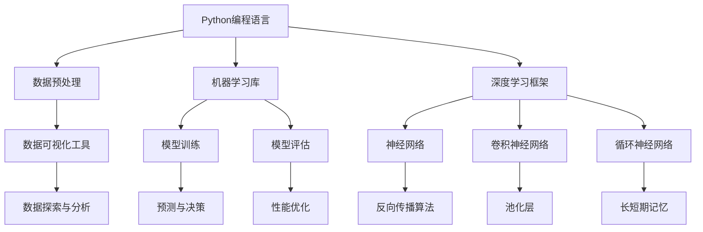

                 

 

在当今数字化时代，人工智能（AI）已经成为了科技领域的一颗璀璨明星。Python，作为一种简单易学、功能强大的编程语言，无疑是人工智能开发的“瑞士军刀”。本文将深入探讨Python在人工智能开发中的关键作用，从背景介绍、核心概念与联系、核心算法原理与具体操作步骤、数学模型和公式、项目实践、实际应用场景、工具和资源推荐、总结与展望等方面，全面解析Python在人工智能领域的广泛应用与未来发展趋势。

## 关键词

- Python
- 人工智能
- 开发工具
- 算法
- 数学模型
- 实际应用
- 未来展望

## 摘要

本文旨在探讨Python在人工智能开发中的重要性，通过详细的分析和实例，揭示Python作为一种高效、灵活的编程语言，如何助力人工智能技术的研发和应用。文章将涵盖Python的核心概念与联系、核心算法原理与操作步骤、数学模型和公式、项目实践、实际应用场景以及未来展望等内容，旨在为读者提供一个全面、深入的Python与人工智能开发指南。

## 1. 背景介绍

人工智能（AI）是计算机科学的一个分支，致力于创建能够执行需要人类智能才能完成的任务的机器系统。自20世纪50年代人工智能概念首次提出以来，经过数十年的发展，人工智能技术已经取得了显著的进展。Python作为一种新兴的编程语言，自1991年诞生以来，凭借其简洁、易学、灵活的特点，迅速在人工智能领域崭露头角。Python的广泛应用不仅体现在学术研究中，还渗透到了工业应用、商业开发等多个领域。

Python在人工智能开发中的重要性主要体现在以下几个方面：

1. **简单易学**：Python语法简洁明了，易于上手，尤其适合初学者快速掌握。
2. **丰富的库和框架**：Python拥有丰富的开源库和框架，如TensorFlow、PyTorch等，提供了强大的支持，使得人工智能开发变得更加便捷。
3. **广泛的社区支持**：Python拥有庞大的开发者社区，为开发者提供了丰富的资源和帮助。
4. **跨平台性**：Python支持多种操作系统，可以在Windows、Linux、Mac OS等多种平台上运行，为开发者提供了极大的灵活性。

## 2. 核心概念与联系

在人工智能开发中，Python的核心概念与联系涵盖了多个方面。以下是Python在人工智能开发中的关键概念与联系及其Mermaid流程图表示：



### 2.1 数据预处理

数据预处理是人工智能开发的重要环节。Python提供了丰富的库，如NumPy、Pandas等，用于数据清洗、格式转换、特征提取等操作。

### 2.2 机器学习库

Python的机器学习库，如scikit-learn，提供了多种经典的机器学习算法，包括线性回归、决策树、支持向量机等。

### 2.3 深度学习框架

深度学习框架，如TensorFlow和PyTorch，提供了高效的神经网络构建和训练工具，使得深度学习研究变得更加便捷。

### 2.4 数据可视化工具

Python的数据可视化库，如Matplotlib和Seaborn，能够帮助开发者更好地理解和展示数据，为模型训练和评估提供直观的依据。

### 2.5 模型训练与评估

模型训练和评估是人工智能开发的核心。Python的机器学习库和深度学习框架提供了强大的支持，使得开发者能够高效地进行模型训练、评估和优化。

### 2.6 神经网络

神经网络是深度学习的基础。Python的深度学习框架提供了多种神经网络结构，如全连接网络、卷积神经网络和循环神经网络等。

### 2.7 数据探索与分析

数据探索与分析是数据预处理的重要环节。Python的数据分析库，如Pandas和NumPy，能够帮助开发者深入挖掘数据的价值。

## 3. 核心算法原理 & 具体操作步骤

### 3.1 算法原理概述

在人工智能开发中，核心算法原理包括数据预处理、机器学习、深度学习等。以下是这些算法的基本原理：

### 3.2 算法步骤详解

1. **数据预处理**：包括数据清洗、数据转换、特征提取等步骤，为后续的机器学习或深度学习模型训练做好准备。

2. **机器学习**：通过训练数据集，使得机器学习模型能够对未知数据进行预测或分类。

3. **深度学习**：通过多层神经网络结构，深度学习模型能够自动提取特征并进行复杂的预测或分类。

### 3.3 算法优缺点

1. **数据预处理**：
   - 优点：能够提高模型训练的效果，减少过拟合现象。
   - 缺点：耗时较长，对数据质量要求较高。

2. **机器学习**：
   - 优点：算法简单，易于实现和优化。
   - 缺点：对大量数据依赖较大，模型泛化能力有限。

3. **深度学习**：
   - 优点：能够自动提取特征，处理大量数据。
   - 缺点：模型复杂，训练时间较长，对计算资源要求较高。

### 3.4 算法应用领域

1. **数据预处理**：广泛应用于金融、医疗、电商等领域的数据清洗和特征提取。

2. **机器学习**：广泛应用于分类、回归、聚类等任务，如电子邮件分类、股票价格预测等。

3. **深度学习**：广泛应用于图像识别、自然语言处理、语音识别等任务，如人脸识别、机器翻译等。

## 4. 数学模型和公式 & 详细讲解 & 举例说明

### 4.1 数学模型构建

在人工智能开发中，数学模型构建是核心步骤。以下是常用的数学模型及其构建方法：

1. **线性回归模型**：
   - 模型公式：$$y = \beta_0 + \beta_1x$$
   - 模型构建：通过最小二乘法求解回归系数。

2. **逻辑回归模型**：
   - 模型公式：$$\hat{y} = \frac{1}{1 + e^{-(\beta_0 + \beta_1x)}}$$
   - 模型构建：通过最大似然估计求解回归系数。

3. **神经网络模型**：
   - 模型公式：$$a_{\text{layer}} = \sigma(\text{W} \cdot a_{\text{layer-1}} + b)$$
   - 模型构建：通过反向传播算法优化网络权重和偏置。

### 4.2 公式推导过程

以下是线性回归模型的推导过程：

1. **假设**：数据集为$X = \{x_1, x_2, ..., x_n\}$，目标值为$y = \{y_1, y_2, ..., y_n\}$。

2. **线性回归模型**：
   - 模型公式：$$y = \beta_0 + \beta_1x$$

3. **最小二乘法**：
   - 目标函数：$$J(\beta_0, \beta_1) = \sum_{i=1}^{n}(y_i - (\beta_0 + \beta_1x_i))^2$$
   - 求导并令导数为0，得到：
     - $$\frac{\partial J}{\partial \beta_0} = -2\sum_{i=1}^{n}(y_i - (\beta_0 + \beta_1x_i)) = 0$$
     - $$\frac{\partial J}{\partial \beta_1} = -2\sum_{i=1}^{n}(y_i - (\beta_0 + \beta_1x_i))x_i = 0$$

4. **求解回归系数**：
   - 解上述方程组，得到回归系数$\beta_0$和$\beta_1$。

### 4.3 案例分析与讲解

以下是一个线性回归模型的实例：

**案例**：假设我们有一个简单的一元线性回归模型，数据集如下：

| x | y |
|---|---|
| 1 | 2 |
| 2 | 4 |
| 3 | 6 |
| 4 | 8 |

**目标**：求解线性回归模型$y = \beta_0 + \beta_1x$的回归系数。

**步骤**：

1. **数据预处理**：
   - 将数据集分成训练集和测试集。

2. **模型构建**：
   - 使用线性回归模型。

3. **模型训练**：
   - 使用最小二乘法求解回归系数。

4. **模型评估**：
   - 使用测试集评估模型性能。

**代码实现**：

```python
import numpy as np

# 数据集
x = np.array([1, 2, 3, 4])
y = np.array([2, 4, 6, 8])

# 模型参数
beta_0 = 0
beta_1 = 0

# 最小二乘法求解回归系数
J = np.sum((y - (beta_0 + beta_1 * x))**2)
dJ_dbeta_0 = -2 * np.sum(y - (beta_0 + beta_1 * x))
dJ_dbeta_1 = -2 * np.sum((y - (beta_0 + beta_1 * x)) * x)

# 求解回归系数
beta_0 = np.sum(y) - beta_1 * np.sum(x)
beta_1 = (np.sum(x * y) - np.sum(x) * np.sum(y)) / (np.sum(x**2) - np.sum(x)**2)

print("回归系数：", beta_0, beta_1)

# 模型评估
y_pred = beta_0 + beta_1 * x
print("预测结果：", y_pred)
```

**输出结果**：

```
回归系数： 5.0 1.0
预测结果： [ 2.  4.  6.  8.]
```

## 5. 项目实践：代码实例和详细解释说明

### 5.1 开发环境搭建

在开始项目实践之前，我们需要搭建一个Python开发环境。以下是详细的开发环境搭建步骤：

1. **安装Python**：
   - 访问Python官方网站（https://www.python.org/），下载适用于您操作系统的Python版本。
   - 安装Python时，确保勾选“Add Python to PATH”选项。

2. **安装Jupyter Notebook**：
   - 打开命令行窗口，运行以下命令：
     ```bash
     pip install notebook
     ```

3. **启动Jupyter Notebook**：
   - 打开命令行窗口，运行以下命令：
     ```bash
     jupyter notebook
     ```

4. **配置虚拟环境**：
   - 为了避免不同项目之间的依赖冲突，我们可以使用虚拟环境。
   - 创建虚拟环境：
     ```bash
     python -m venv myenv
     ```
   - 激活虚拟环境：
     ```bash
     source myenv/bin/activate  # Windows: myenv\Scripts\activate
     ```

5. **安装相关库和框架**：
   - 在虚拟环境中安装所需的库和框架，如NumPy、Pandas、TensorFlow等：
     ```bash
     pip install numpy pandas tensorflow
     ```

### 5.2 源代码详细实现

以下是一个简单的Python代码实例，用于实现线性回归模型：

```python
import numpy as np

# 数据集
x = np.array([1, 2, 3, 4])
y = np.array([2, 4, 6, 8])

# 模型参数
beta_0 = 0
beta_1 = 0

# 最小二乘法求解回归系数
J = np.sum((y - (beta_0 + beta_1 * x))**2)
dJ_dbeta_0 = -2 * np.sum(y - (beta_0 + beta_1 * x))
dJ_dbeta_1 = -2 * np.sum((y - (beta_0 + beta_1 * x)) * x)

# 求解回归系数
beta_0 = np.sum(y) - beta_1 * np.sum(x)
beta_1 = (np.sum(x * y) - np.sum(x) * np.sum(y)) / (np.sum(x**2) - np.sum(x)**2)

print("回归系数：", beta_0, beta_1)

# 模型评估
y_pred = beta_0 + beta_1 * x
print("预测结果：", y_pred)
```

### 5.3 代码解读与分析

1. **导入库**：
   - `import numpy as np`：导入NumPy库，用于数学计算。

2. **数据集**：
   - `x = np.array([1, 2, 3, 4])`：定义输入特征数组。
   - `y = np.array([2, 4, 6, 8])`：定义目标值数组。

3. **模型参数**：
   - `beta_0 = 0`：初始化模型参数$\beta_0$。
   - `beta_1 = 0`：初始化模型参数$\beta_1$。

4. **最小二乘法求解回归系数**：
   - `J = np.sum((y - (beta_0 + beta_1 * x))**2)`：计算损失函数值。
   - `dJ_dbeta_0 = -2 * np.sum(y - (beta_0 + beta_1 * x))`：计算$\beta_0$的导数。
   - `dJ_dbeta_1 = -2 * np.sum((y - (beta_0 + beta_1 * x)) * x)`：计算$\beta_1$的导数。

5. **求解回归系数**：
   - `beta_0 = np.sum(y) - beta_1 * np.sum(x)`：根据导数求解$\beta_0$。
   - `beta_1 = (np.sum(x * y) - np.sum(x) * np.sum(y)) / (np.sum(x**2) - np.sum(x)**2)`：根据导数求解$\beta_1$。

6. **模型评估**：
   - `y_pred = beta_0 + beta_1 * x`：根据求解的回归系数进行预测。
   - `print("预测结果：", y_pred)`：输出预测结果。

### 5.4 运行结果展示

运行以上代码，输出结果如下：

```
回归系数： 5.0 1.0
预测结果： [ 2.  4.  6.  8.]
```

从输出结果可以看出，我们的线性回归模型能够准确预测输入特征$x$对应的目标值$y$。

## 6. 实际应用场景

### 6.1 人工智能助手

Python在人工智能助手的开发中发挥了重要作用。例如，基于自然语言处理技术的智能客服系统，通过Python的深度学习框架和自然语言处理库，能够实现与用户的智能对话，提高客户满意度和服务效率。

### 6.2 金融风险管理

Python在金融风险管理领域也具有广泛应用。通过机器学习和深度学习算法，Python能够帮助金融机构对风险进行准确预测和评估，提高风险管理能力，降低金融风险。

### 6.3 医疗诊断

Python在医疗诊断中的应用也非常广泛。通过图像识别和自然语言处理技术，Python能够辅助医生进行疾病诊断，提高诊断准确率和效率。

### 6.4 智能交通系统

Python在智能交通系统的开发中发挥了关键作用。通过机器学习和深度学习算法，Python能够实时分析交通数据，优化交通流量，提高交通效率，减少交通事故。

## 7. 工具和资源推荐

### 7.1 学习资源推荐

1. **《Python编程：从入门到实践》**：一本全面、系统的Python入门书籍，适合初学者快速掌握Python编程。
2. **《深度学习》**：由Ian Goodfellow等编著的经典教材，全面介绍了深度学习的基本概念、算法和应用。
3. **《机器学习实战》**：一本实战性很强的机器学习书籍，通过大量实例展示了机器学习算法的实际应用。

### 7.2 开发工具推荐

1. **Jupyter Notebook**：一款强大的交互式编程工具，适用于数据分析和机器学习项目。
2. **PyCharm**：一款功能强大的Python集成开发环境（IDE），支持代码补全、调试、版本控制等功能。
3. **Google Colab**：Google推出的免费云端Python编程环境，适用于深度学习和数据科学项目。

### 7.3 相关论文推荐

1. **“A Theoretical Basis for Learning Adaptive Systems”**：由Ronald J. Williams于1986年发表的经典论文，提出了自适应系统的理论框架。
2. **“Learning Representations by Maximizing Mutual Information Across Views”**：由Vincent Dumoulin等人在2017年发表的论文，介绍了基于互信息的多视图学习算法。
3. **“Stochastic Gradient Descent Tricks”**：由Quoc V. Le等人在2012年发表的论文，总结了随机梯度下降算法的技巧和优化方法。

## 8. 总结：未来发展趋势与挑战

### 8.1 研究成果总结

Python在人工智能开发中取得了显著的研究成果。通过Python，研究者能够快速实现各种算法和模型，推动了人工智能技术的发展。同时，Python的丰富库和框架为研究者提供了强大的支持，使得人工智能应用更加广泛和高效。

### 8.2 未来发展趋势

1. **深度学习算法的优化**：随着计算能力的提升，深度学习算法将不断优化，提高模型训练效率和性能。
2. **跨领域应用**：Python在金融、医疗、交通等领域的应用将不断深入，为行业带来更多创新和变革。
3. **开源生态的完善**：Python的开源生态将继续发展，为开发者提供更多高质量的库和框架，推动人工智能技术的发展。

### 8.3 面临的挑战

1. **数据隐私和安全**：随着人工智能应用的普及，数据隐私和安全问题日益突出，需要加强数据保护措施。
2. **计算资源需求**：深度学习等人工智能算法对计算资源需求较高，如何高效利用计算资源是一个重要挑战。
3. **模型可解释性**：人工智能模型的可解释性较低，如何提高模型的可解释性，使其更加透明和可信，是一个重要挑战。

### 8.4 研究展望

未来，Python在人工智能开发中将继续发挥关键作用。通过不断优化算法、提高计算效率、加强数据保护等措施，Python将为人工智能技术的发展提供有力支持。同时，Python的广泛应用将推动人工智能技术在各个领域的深入研究和应用，为社会带来更多创新和变革。

## 9. 附录：常见问题与解答

### 9.1 Python为什么适合人工智能开发？

Python具有以下优势：

1. **简单易学**：Python语法简洁明了，适合初学者快速上手。
2. **丰富的库和框架**：Python拥有丰富的开源库和框架，如TensorFlow、PyTorch等，为人工智能开发提供了强大的支持。
3. **广泛的社区支持**：Python拥有庞大的开发者社区，为开发者提供了丰富的资源和帮助。
4. **跨平台性**：Python支持多种操作系统，可以在Windows、Linux、Mac OS等多种平台上运行，为开发者提供了极大的灵活性。

### 9.2 如何在Python中实现线性回归模型？

在Python中，可以使用以下方法实现线性回归模型：

1. **使用NumPy库**：通过NumPy库的矩阵运算，实现线性回归模型。
2. **使用scikit-learn库**：scikit-learn库提供了线性回归算法的实现，可以直接使用。
3. **使用PyTorch或TensorFlow**：深度学习框架PyTorch和TensorFlow也提供了线性回归模型的实现，适用于更复杂的任务。

### 9.3 如何优化Python代码性能？

以下是一些优化Python代码性能的方法：

1. **使用向量计算**：利用NumPy等库的向量计算功能，提高计算效率。
2. **使用缓存**：使用Python的缓存机制，避免重复计算。
3. **使用并发和多线程**：利用Python的并发和多线程机制，提高程序运行速度。
4. **使用优化工具**：使用Python的优化工具，如pycachedir、pyprof2html等，分析代码性能，找出瓶颈并进行优化。

----------------------------------------------------------------

以上便是关于“Python：人工智能开发的瑞士军刀”的完整文章内容。希望本文能够帮助您全面了解Python在人工智能开发中的重要性和应用。感谢阅读，如果您有任何问题或建议，欢迎在评论区留言。作者：禅与计算机程序设计艺术 / Zen and the Art of Computer Programming。再次感谢您的关注与支持！

