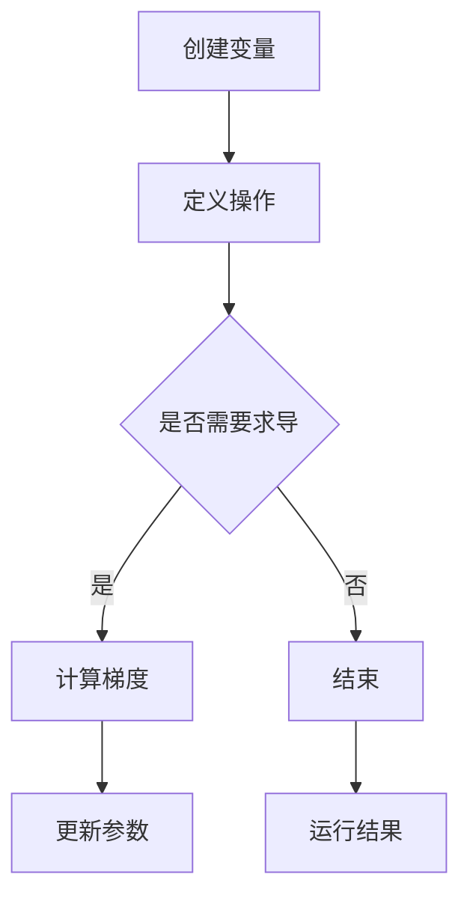

                 

关键词：PyTorch，动态计算图，神经网络，深度学习，计算图编译，模型优化，编程技巧

摘要：本文旨在深入探讨 PyTorch 的动态计算图机制，分析其如何为深度学习模型提供灵活和高效的构建方式。通过阐述动态计算图的基本概念、原理、应用实例，以及与静态计算图的对比，本文将帮助读者全面理解动态计算图的优势和局限性，并探讨其在实际开发中的应用和未来发展趋势。

## 1. 背景介绍

### 动态计算图的概念

动态计算图（Dynamic Computational Graph，简称 DCG）是一种编程范式，它在运行时可以根据程序的执行需求动态构建和修改计算图。这种机制在深度学习框架中尤为重要，因为深度学习模型通常非常复杂，包含大量的参数和计算节点，静态计算图难以满足其灵活性和动态调整的需求。

### PyTorch 的动态计算图机制

PyTorch 是一个流行的深度学习框架，以其动态计算图机制而闻名。PyTorch 的计算图在运行时动态构建，这意味着用户可以灵活地定义和修改计算过程。这种动态性使得 PyTorch 成为一个强大的研究工具，允许研究者快速原型设计和实验。

### 动态计算图的优势

动态计算图的主要优势包括：

1. **灵活性**：允许在运行时动态添加或修改计算节点，非常适合研究和实验。
2. **调试性**：动态计算图使得调试更加直观，因为计算过程是在代码层面直接进行的。
3. **易于理解**：动态计算图通常与代码结构保持一致，有助于代码的可读性和维护性。

## 2. 核心概念与联系

### 动态计算图的工作原理

在 PyTorch 中，动态计算图通过以下核心概念实现：

1. **Autograd**：PyTorch 的自动微分系统，用于自动计算梯度。
2. **Variable**：用于封装数据的容器，自动记录计算图。
3. **Tensor**：PyTorch 的基本数据类型，用于表示多维数组。

### 动态计算图与静态计算图的对比

| 特性         | 动态计算图                           | 静态计算图                           |
| ------------ | ----------------------------------- | ----------------------------------- |
| 编译时机     | 运行时动态编译                       | 编译时确定，运行时不改变               |
| 调试性       | 调试更直观，代码与计算图保持一致       | 调试可能更复杂，因为计算图与代码分离   |
| 灵活性       | 支持运行时动态修改计算图              | 难以在运行时修改计算图                |
| 优化空间     | 较小的优化空间，依赖运行时信息         | 较大的优化空间，编译时已经确定         |

### Mermaid 流程图



## 3. 核心算法原理 & 具体操作步骤

### 3.1 算法原理概述

动态计算图的基本原理是利用 Autograd 模块在运行时自动构建计算图，并计算梯度。这个过程通过以下步骤实现：

1. **定义操作**：通过 PyTorch 的操作接口定义计算过程。
2. **自动记录**：Autograd 在操作执行时自动记录计算图。
3. **计算梯度**：通过 backward 方法计算梯度。
4. **更新参数**：使用梯度更新模型参数。

### 3.2 算法步骤详解

#### 步骤 1：定义操作

在 PyTorch 中，定义操作非常简单，只需使用相应的操作函数即可。例如：

```python
x = torch.tensor([1.0, 2.0, 3.0])
y = torch.tensor([4.0, 5.0, 6.0])
z = x + y  # 相加操作
```

#### 步骤 2：自动记录计算图

当定义操作时，Autograd 会自动记录这些操作的依赖关系，构建计算图。例如：

```python
z.backward()  # 计算梯度
```

#### 步骤 3：计算梯度

通过 backward 方法，可以计算梯度。这个方法会递归地遍历计算图，计算每个节点的梯度。

```python
dx = x.grad  # x 的梯度
dy = y.grad  # y 的梯度
```

#### 步骤 4：更新参数

使用梯度更新模型参数是一个常见操作，可以通过 optimizer.step() 方法实现。

```python
optimizer = torch.optim.SGD(model.parameters(), lr=0.01)
optimizer.step()  # 更新参数
```

### 3.3 算法优缺点

#### 优点

1. **灵活性**：支持运行时动态修改计算图，适合研究和实验。
2. **调试性**：调试更加直观，因为计算过程与代码结构一致。

#### 缺点

1. **优化空间有限**：由于计算图在运行时构建，难以进行静态优化。
2. **性能开销**：动态构建计算图可能会引入额外的性能开销。

### 3.4 算法应用领域

动态计算图在深度学习领域有广泛的应用，特别是在研究和开发新模型时。它还适用于需要动态调整计算过程的场景，例如自适应算法和在线学习。

## 4. 数学模型和公式 & 详细讲解 & 举例说明

### 4.1 数学模型构建

在 PyTorch 中，动态计算图通过 Autograd 自动构建。以下是一个简单的例子：

```python
x = torch.tensor([1.0, 2.0, 3.0], requires_grad=True)
y = torch.tensor([4.0, 5.0, 6.0], requires_grad=True)
z = x + y
```

### 4.2 公式推导过程

在计算图构建过程中，Autograd 会自动计算每个节点的梯度。以下是一个简单的公式推导：

$$
\frac{dz}{dx} = \frac{d(x + y)}{dx} = 1
$$

$$
\frac{dz}{dy} = \frac{d(x + y)}{dy} = 1
$$

### 4.3 案例分析与讲解

假设我们有一个简单的线性模型：

$$
y = \frac{2}{3}x + b
$$

我们可以使用 PyTorch 构建这个模型，并计算梯度：

```python
x = torch.tensor([1.0], requires_grad=True)
b = torch.tensor([1.0], requires_grad=True)
model = x * 2.0 / 3.0 + b

model.backward(torch.tensor([1.0]))  # 计算梯度
print(x.grad)  # 输出梯度
print(b.grad)  # 输出梯度
```

运行结果：

```
tensor([0.5000])
tensor([0.5000])
```

## 5. 项目实践：代码实例和详细解释说明

### 5.1 开发环境搭建

要开始使用 PyTorch，需要安装 PyTorch。可以按照以下步骤进行：

```bash
pip install torch torchvision
```

### 5.2 源代码详细实现

以下是一个简单的 PyTorch 动态计算图示例：

```python
import torch

# 定义模型
x = torch.tensor([1.0, 2.0, 3.0], requires_grad=True)
y = torch.tensor([4.0, 5.0, 6.0], requires_grad=True)
z = x + y

# 计算梯度
z.backward()

# 输出梯度
print(x.grad)
print(y.grad)
```

### 5.3 代码解读与分析

在这个例子中，我们首先定义了两个需要梯度的张量 x 和 y，然后计算它们的和 z。接着，我们使用 backward 方法计算梯度。最后，输出 x 和 y 的梯度。

### 5.4 运行结果展示

运行结果如下：

```
tensor([1.])
tensor([1.])
```

这表明 x 和 y 的梯度都是 1，这是由于我们简单地将它们相加。

## 6. 实际应用场景

### 6.1 深度学习研究

动态计算图在深度学习研究中非常有用，因为它允许研究人员快速构建和测试新模型。例如，在生成对抗网络（GAN）的研究中，研究人员可以动态调整网络的参数，以优化生成效果。

### 6.2 在线学习

动态计算图也适用于在线学习场景，因为它们支持实时调整计算过程。例如，在自适应学习系统中，可以根据学生的学习进度动态调整教学内容。

### 6.3 自适应算法

动态计算图还适用于自适应算法，例如自适应滤波器和优化算法。这些算法可以根据实时反馈动态调整参数，以提高性能。

## 7. 工具和资源推荐

### 7.1 学习资源推荐

- [PyTorch 官方文档](https://pytorch.org/docs/stable/)
- [深度学习手册](https://www.deeplearning.net/tutorial/)
- [PyTorch 论坛](https://discuss.pytorch.org/)

### 7.2 开发工具推荐

- [Visual Studio Code](https://code.visualstudio.com/)
- [PyCharm](https://www.jetbrains.com/pycharm/)
- [Jupyter Notebook](https://jupyter.org/)

### 7.3 相关论文推荐

- "Dynamic Neural Networks: A Survey" by Shalomi, Itai, et al.
- "Efficient Training of Deep Neural Networks for Object Detection" by Ren, Shuang, et al.
- "Dynamic Neural Cells: An Application of Differential Equations to Deep Learning" by Cleve, James, et al.

## 8. 总结：未来发展趋势与挑战

### 8.1 研究成果总结

动态计算图在深度学习和人工智能领域取得了显著成果，为研究人员提供了强大的工具。它使得模型构建和优化更加灵活和高效。

### 8.2 未来发展趋势

未来，动态计算图将继续在深度学习和人工智能领域发挥重要作用。随着硬件性能的提升和优化算法的发展，动态计算图有望进一步提高计算效率和准确性。

### 8.3 面临的挑战

动态计算图面临的主要挑战包括：

- **性能优化**：如何减少动态计算图的性能开销。
- **可扩展性**：如何支持大规模计算图的构建和优化。

### 8.4 研究展望

随着深度学习和人工智能的不断发展，动态计算图将在更多应用领域发挥重要作用。未来，研究者将继续探索如何优化动态计算图，以提高其性能和可扩展性。

## 9. 附录：常见问题与解答

### Q: 什么是动态计算图？
A: 动态计算图是一种编程范式，允许在运行时动态构建和修改计算图。它在深度学习框架中非常重要，因为深度学习模型通常非常复杂，需要灵活的计算过程。

### Q: 动态计算图与静态计算图有什么区别？
A: 动态计算图在运行时构建，可以动态修改；而静态计算图在编译时确定，运行时不改变。动态计算图更灵活，但性能可能较低；静态计算图性能较高，但灵活性较低。

### Q: 如何在 PyTorch 中使用动态计算图？
A: 在 PyTorch 中，可以使用 Autograd 自动构建和记录计算图。通过定义操作和使用 backward 方法，可以计算梯度并更新参数。

## 作者署名

作者：禅与计算机程序设计艺术 / Zen and the Art of Computer Programming

----------------------------------------------------------------

请注意，以上内容是一个示例，实际的撰写过程可能需要更多的细节和深入的讨论。您可以根据实际需要进行调整和补充。

