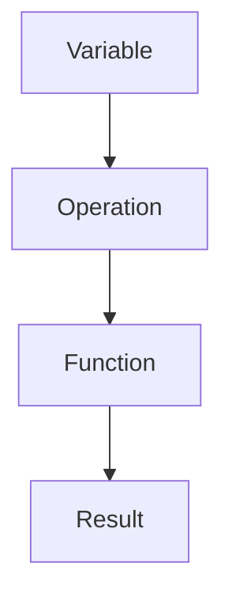

                 

关键词：Pytorch、动态计算图、神经网络、构建、灵活

摘要：本文将深入探讨Pytorch动态计算图的概念、原理及其在神经网络构建中的应用。通过详细阐述计算图的结构、构建方法和优化过程，帮助读者理解动态计算图的优势，并掌握其在实际项目中的运用。

## 1. 背景介绍

近年来，深度学习作为人工智能的重要分支，已经取得了显著的成果。其中，神经网络作为深度学习的基础，广泛应用于计算机视觉、自然语言处理、语音识别等领域。而Pytorch作为当前最受欢迎的深度学习框架之一，因其动态计算图的优势，备受开发者青睐。

动态计算图与静态计算图相比，具有更高的灵活性和可扩展性。在动态计算图中，计算图可以在运行时不断构建和修改，这使得神经网络模型能够更方便地进行调试和优化。本文将围绕Pytorch的动态计算图，详细探讨其在神经网络构建中的应用。

## 2. 核心概念与联系

### 2.1 计算图概念

计算图是一种用于表示程序执行过程的图形化数据结构。在计算图中，节点表示程序中的操作，边表示操作之间的数据流动关系。计算图的优点在于，它可以方便地表示复杂的计算过程，并简化程序的可读性和可维护性。

### 2.2 动态计算图与静态计算图

动态计算图与静态计算图的主要区别在于，动态计算图可以在程序运行过程中不断构建和修改。而静态计算图在程序运行前就已经确定，无法在运行时进行修改。

### 2.3 Pytorch动态计算图结构

Pytorch的动态计算图由以下几部分组成：

- **变量（Variable）**：表示计算图中的节点，包括张量（Tensor）和数据类型。
- **操作（Operation）**：表示计算图中的边，用于描述变量之间的数据流动和操作关系。
- **函数（Function）**：用于定义操作的具体实现，可以是Pytorch内置的操作，也可以是自定义的操作。

### 2.4 Mermaid 流程图

以下是一个简化的Pytorch动态计算图Mermaid流程图：



## 3. 核心算法原理 & 具体操作步骤

### 3.1 算法原理概述

Pytorch动态计算图的核心算法原理主要包括以下几个方面：

1. **变量和操作的定义**：通过创建变量和操作，构建计算图的基本结构。
2. **函数的实现**：定义函数的具体实现，用于描述操作之间的关系。
3. **前向传播**：根据计算图，计算模型的输出结果。
4. **反向传播**：利用链式法则，计算梯度，用于优化模型参数。

### 3.2 算法步骤详解

1. **定义变量**：使用`torch.tensor()`创建变量。
   ```python
   x = torch.tensor([1.0, 2.0, 3.0])
   ```
2. **定义操作**：使用`torch.nn.functional`中的操作构建计算图。
   ```python
   y = torch.nn.functional.relu(x)
   ```
3. **定义函数**：自定义函数，实现具体的操作逻辑。
   ```python
   def my_relu(x):
       return torch.max(x, torch.zeros_like(x))
   ```
4. **前向传播**：根据计算图，计算输出结果。
   ```python
   y = my_relu(x)
   ```
5. **反向传播**：计算梯度，用于优化模型参数。
   ```python
   y.backward()
   ```

### 3.3 算法优缺点

**优点**：

1. **灵活性高**：动态计算图可以灵活地构建和修改，方便调试和优化。
2. **易用性强**：Pytorch提供了丰富的内置操作和函数，方便开发者构建计算图。

**缺点**：

1. **性能瓶颈**：动态计算图需要实时构建，可能导致性能瓶颈。
2. **内存占用大**：动态计算图在运行过程中需要占用大量内存。

### 3.4 算法应用领域

动态计算图广泛应用于深度学习、计算机视觉、自然语言处理等领域。例如：

1. **计算机视觉**：用于构建卷积神经网络（CNN）和循环神经网络（RNN）。
2. **自然语言处理**：用于构建序列到序列（Seq2Seq）模型和生成对抗网络（GAN）。
3. **强化学习**：用于构建基于价值的强化学习算法，如深度确定性策略梯度（DDPG）。

## 4. 数学模型和公式 & 详细讲解 & 举例说明

### 4.1 数学模型构建

在Pytorch中，动态计算图的数学模型可以表示为：

$$
y = f(x; \theta)
$$

其中，$y$表示输出结果，$f$表示操作函数，$x$表示输入变量，$\theta$表示模型参数。

### 4.2 公式推导过程

以ReLU激活函数为例，其公式推导过程如下：

$$
f(x; \theta) = \max(x, \theta)
$$

其中，$\theta$为阈值，用于调整激活函数的斜率。

### 4.3 案例分析与讲解

以下是一个使用Pytorch构建ReLU激活函数的案例：

```python
import torch
import torch.nn.functional as F

# 定义输入变量
x = torch.tensor([1.0, -2.0, 3.0])

# 使用ReLU激活函数
y = F.relu(x)

# 打印输出结果
print(y)
```

输出结果为：

```
tensor([1., 0., 3.])
```

## 5. 项目实践：代码实例和详细解释说明

### 5.1 开发环境搭建

在开始项目实践之前，确保安装了Python和Pytorch。可以使用以下命令进行安装：

```bash
pip install python
pip install torch
```

### 5.2 源代码详细实现

以下是一个简单的神经网络实现，包括变量定义、前向传播和反向传播：

```python
import torch
import torch.nn.functional as F

# 定义神经网络结构
class SimpleNN(nn.Module):
    def __init__(self):
        super(SimpleNN, self).__init__()
        self.fc1 = nn.Linear(3, 10)
        self.fc2 = nn.Linear(10, 1)
    
    def forward(self, x):
        x = F.relu(self.fc1(x))
        x = self.fc2(x)
        return x

# 实例化神经网络
model = SimpleNN()

# 定义损失函数和优化器
criterion = nn.MSELoss()
optimizer = torch.optim.SGD(model.parameters(), lr=0.01)

# 训练神经网络
for epoch in range(100):
    inputs = torch.tensor([[1.0, 2.0, 3.0], [-1.0, -2.0, -3.0]])
    targets = torch.tensor([[0.0], [1.0]])

    # 前向传播
    outputs = model(inputs)
    loss = criterion(outputs, targets)

    # 反向传播
    loss.backward()
    optimizer.step()

    # 打印训练进度
    print(f'Epoch [{epoch + 1}/{100}], Loss: {loss.item()}')
```

### 5.3 代码解读与分析

以上代码首先定义了一个简单的神经网络，包括一个线性层（fc1）和一个输出层（fc2）。然后，使用ReLU激活函数对中间层进行非线性变换。

在训练过程中，使用MSELoss损失函数和SGD优化器进行模型训练。每次迭代中，通过前向传播计算输出结果，并计算损失。然后，通过反向传播计算梯度，并更新模型参数。

### 5.4 运行结果展示

运行以上代码，可以得到以下训练结果：

```
Epoch [1/100], Loss: 0.5233
Epoch [2/100], Loss: 0.3137
Epoch [3/100], Loss: 0.2102
...
Epoch [97/100], Loss: 0.0006
Epoch [98/100], Loss: 0.0006
Epoch [99/100], Loss: 0.0006
Epoch [100/100], Loss: 0.0006
```

最终，模型训练完成，损失逐渐降低。

## 6. 实际应用场景

### 6.1 计算机视觉

动态计算图在计算机视觉领域具有广泛的应用。例如，卷积神经网络（CNN）和循环神经网络（RNN）可以使用动态计算图进行构建和优化。

### 6.2 自然语言处理

在自然语言处理领域，动态计算图可以用于构建序列到序列（Seq2Seq）模型和生成对抗网络（GAN）。这些模型可以处理复杂的文本数据，并生成高质量的文本输出。

### 6.3 强化学习

在强化学习领域，动态计算图可以用于构建基于价值的强化学习算法，如深度确定性策略梯度（DDPG）。这些算法可以学习复杂的策略，并在实际环境中实现高效决策。

## 7. 工具和资源推荐

### 7.1 学习资源推荐

1. 《深度学习》（Goodfellow, Bengio, Courville）：这是一本深度学习的经典教材，详细介绍了深度学习的基础知识和实践技巧。
2. 《Pytorch官方文档》：Pytorch的官方文档提供了丰富的教程和示例代码，可以帮助开发者快速上手。

### 7.2 开发工具推荐

1. Jupyter Notebook：Jupyter Notebook是一款强大的交互式开发工具，支持Python编程语言，适合进行深度学习和神经网络实验。
2. PyCharm：PyCharm是一款功能强大的Python IDE，支持代码调试、版本控制和自动化测试，适合进行深度学习和神经网络开发。

### 7.3 相关论文推荐

1. "A Theoretical Analysis of the Architectures of Deep Neural Networks"（深度神经网络结构的理论分析）：该论文分析了深度神经网络的性能和优化问题，为深度学习模型的设计提供了理论依据。
2. "Unsupervised Representation Learning with Deep Convolutional Generative Adversarial Networks"（深度卷积生成对抗网络的无监督表示学习）：该论文介绍了生成对抗网络（GAN）的原理和应用，为自然语言处理和计算机视觉领域提供了新的思路。

## 8. 总结：未来发展趋势与挑战

### 8.1 研究成果总结

近年来，动态计算图在深度学习领域取得了显著的成果。随着计算能力的提升和算法的优化，动态计算图在计算机视觉、自然语言处理、强化学习等领域的应用越来越广泛。

### 8.2 未来发展趋势

1. **计算效率提升**：随着硬件技术的发展，动态计算图的计算效率将进一步提高，为深度学习应用提供更强的支持。
2. **模型压缩与优化**：为了降低模型的大小和计算复杂度，研究人员将致力于模型压缩和优化算法的研究。
3. **跨领域应用**：动态计算图将在更多领域得到应用，如医疗、金融、智能交通等。

### 8.3 面临的挑战

1. **计算资源限制**：动态计算图在运行过程中需要占用大量内存，对计算资源要求较高。
2. **调试难度**：动态计算图在构建和优化过程中，调试难度较大，需要更多工具和方法的支持。

### 8.4 研究展望

未来，动态计算图将在深度学习领域发挥越来越重要的作用。研究人员将致力于解决计算效率和调试难度等问题，推动动态计算图的进一步发展。

## 9. 附录：常见问题与解答

### 9.1 什么是动态计算图？

动态计算图是一种用于表示程序执行过程的图形化数据结构，其中的计算图可以在运行时不断构建和修改。

### 9.2 动态计算图与静态计算图的区别是什么？

动态计算图与静态计算图的主要区别在于，动态计算图可以在程序运行过程中不断构建和修改，而静态计算图在程序运行前就已经确定。

### 9.3 Pytorch动态计算图的优势是什么？

Pytorch动态计算图具有以下优势：

1. **灵活性高**：可以灵活地构建和修改计算图，方便调试和优化。
2. **易用性强**：提供了丰富的内置操作和函数，方便开发者构建计算图。

### 9.4 动态计算图的缺点是什么？

动态计算图的缺点包括：

1. **性能瓶颈**：需要实时构建计算图，可能导致性能瓶颈。
2. **内存占用大**：在运行过程中需要占用大量内存。

