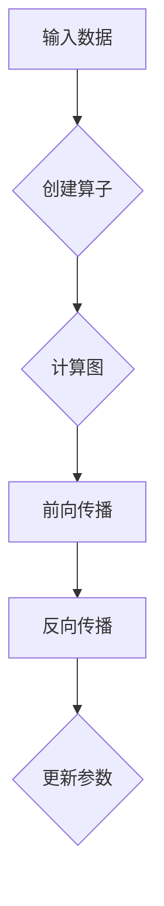
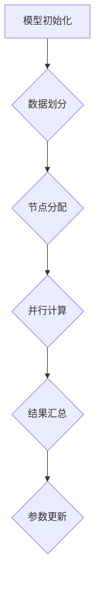
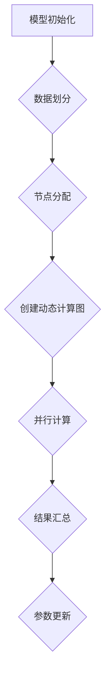

                 

 

## 1. 背景介绍

### PyTorch的起源与发展

PyTorch是由Facebook的人工智能研究团队开发的一款开源机器学习库，旨在为研究人员和开发者提供一种灵活且强大的工具，以加速人工智能模型的研发和部署。PyTorch的诞生可以追溯到2016年，当时它在学术界引起了广泛关注，并在短时间内成为了深度学习领域的热门选择。

PyTorch的设计初衷是为了解决研究人员在构建复杂模型时面临的挑战，尤其是在动态计算图的使用上。传统静态图框架（如TensorFlow）在模型开发和调试方面存在一定限制，而PyTorch的动态图特性使得模型构建过程更加直观和灵活。

### 动态图与静态图的比较

在深入探讨PyTorch的特点之前，我们需要了解动态图和静态图的基本概念及其差异。

**动态图**（Dynamic Graph）是指在运行时构建的图。在PyTorch中，每次前向传播和反向传播都会动态构建计算图，这使得模型构建过程更加灵活，也方便调试和优化。然而，动态图的计算开销较大，可能导致运行效率不如静态图。

**静态图**（Static Graph）是在编译时构建的图。TensorFlow采用的是静态图架构，其计算图在编译时就已经确定，因此运行效率较高。但静态图在模型开发和调试方面存在一定的局限性，例如无法动态修改计算图。

### PyTorch的应用场景

PyTorch因其动态图特性，在以下应用场景中表现出色：

1. **研究性项目**：研究人员可以利用PyTorch的灵活性进行模型创新和实验。
2. **生产环境**：尽管PyTorch在运行效率上不如TensorFlow，但其强大的灵活性和易用性使其在生产环境中也获得了广泛应用。
3. **教育领域**：PyTorch因其简洁明了的API，成为许多高校和研究机构的深度学习课程首选教学工具。

## 2. 核心概念与联系

在深入了解PyTorch的动态图和分布式训练特点之前，我们需要理解一些核心概念，以及它们之间的联系。

### 动态计算图

动态计算图是PyTorch的核心特点之一。在PyTorch中，计算图不是预先定义好的，而是在运行时动态构建的。这意味着开发者可以在运行时修改计算图，从而方便地进行模型调试和优化。

下面是一个简单的Mermaid流程图，展示了动态计算图的基本原理：



### 分布式训练

分布式训练是提高模型训练效率的重要手段。通过将训练任务分布在多个计算节点上，可以显著减少训练时间，提高资源利用率。

下面是一个Mermaid流程图，展示了分布式训练的基本原理：



### 动态计算图与分布式训练的联系

动态计算图和分布式训练之间存在着密切的联系。动态计算图使得模型构建过程更加灵活，而分布式训练则利用了这种灵活性，将训练任务分配到多个节点上，从而实现高效的模型训练。

下面是一个Mermaid流程图，展示了动态计算图与分布式训练的整合：



## 3. 核心算法原理 & 具体操作步骤

### 3.1 算法原理概述

PyTorch的动态计算图和分布式训练是基于其核心API实现的。动态计算图通过`autograd`包实现，而分布式训练则通过`torch.distributed`包实现。

下面是一个简单的示例，展示了如何使用PyTorch进行动态计算图和分布式训练：

```python
import torch
import torch.distributed as dist

# 初始化分布式环境
dist.init_process_group(backend='nccl', rank=0, world_size=4)

# 定义模型
model = torch.nn.Sequential(
    torch.nn.Linear(10, 5),
    torch.nn.ReLU(),
    torch.nn.Linear(5, 1)
)

# 定义损失函数和优化器
criterion = torch.nn.MSELoss()
optimizer = torch.optim.SGD(model.parameters(), lr=0.01)

# 动态计算图
x = torch.randn(4, 10, device='cuda')
y = torch.randn(4, 1, device='cuda')

# 并行计算
output = model(x)

# 计算损失
loss = criterion(output, y)

# 反向传播
optimizer.zero_grad()
loss.backward()
optimizer.step()

# 更新参数
for param in model.parameters():
    param.data.add_(0.01, requires_grad=True)

# 汇总结果
dist.all_reduce(loss, op=dist.ReduceOp.SUM)
```

### 3.2 算法步骤详解

1. **初始化分布式环境**：在分布式训练中，首先需要初始化分布式环境，包括进程组、排名和全局大小等。
2. **定义模型**：定义深度学习模型，包括输入层、隐藏层和输出层。
3. **定义损失函数和优化器**：选择合适的损失函数和优化器，用于模型训练。
4. **动态计算图**：使用`autograd`包构建动态计算图，包括前向传播和反向传播。
5. **并行计算**：将计算任务分配到多个节点上，进行并行计算。
6. **结果汇总**：将各个节点的计算结果汇总，用于参数更新。
7. **参数更新**：根据损失函数的反向传播结果，更新模型参数。

### 3.3 算法优缺点

**优点**：

1. **灵活性**：动态计算图使得模型构建过程更加直观和灵活。
2. **易用性**：PyTorch的API简洁明了，易于使用和调试。
3. **高效性**：尽管动态计算图的计算开销较大，但在某些情况下，其运行效率可以与静态计算图相媲美。

**缺点**：

1. **计算开销**：动态计算图的计算开销较大，可能导致运行效率不如静态计算图。
2. **学习曲线**：对于初学者来说，理解动态计算图和分布式训练的原理可能存在一定难度。

### 3.4 算法应用领域

1. **计算机视觉**：在图像分类、目标检测和图像生成等领域，PyTorch因其灵活性而得到了广泛应用。
2. **自然语言处理**：在文本分类、机器翻译和语音识别等领域，PyTorch也因其动态图特性而成为首选工具。
3. **推荐系统**：在推荐系统中，PyTorch可以用于构建复杂的用户行为模型和物品关系模型。

## 4. 数学模型和公式 & 详细讲解 & 举例说明

### 4.1 数学模型构建

在深度学习中，数学模型构建是一个关键步骤。下面我们以一个简单的多层感知机（MLP）为例，介绍数学模型的构建过程。

#### 4.1.1 模型定义

多层感知机是一个由输入层、多个隐藏层和输出层组成的神经网络。假设我们有一个包含10个特征的数据集，我们希望预测一个连续值。

#### 4.1.2 网络结构

- 输入层：10个神经元
- 隐藏层：5个神经元
- 输出层：1个神经元

#### 4.1.3 激活函数

我们使用ReLU函数作为激活函数，即：

$$
f(x) = \max(0, x)
$$

### 4.2 公式推导过程

在多层感知机中，每个神经元的输出可以表示为：

$$
z_j = \sum_{i=1}^{n} w_{ji} x_i + b_j
$$

其中，$z_j$是第j个神经元的输出，$w_{ji}$是第j个神经元与第i个神经元之间的权重，$b_j$是第j个神经元的偏置。

对于输出层，我们使用线性激活函数：

$$
y = z
$$

其中，$y$是输出值，$z$是输出层的输出。

### 4.3 案例分析与讲解

我们以一个简单的例子来分析多层感知机的工作原理。

假设我们有一个包含10个特征的数据集，我们希望预测一个连续值。我们定义一个包含5个隐藏层和1个输出层的多层感知机模型。

#### 4.3.1 数据预处理

首先，我们对数据进行预处理，包括归一化和标准化。

#### 4.3.2 模型训练

我们使用梯度下降算法训练模型，目标是找到最优的权重和偏置。

#### 4.3.3 模型评估

在训练完成后，我们对模型进行评估，计算预测值和真实值的误差。

#### 4.3.4 结果分析

通过分析预测值和真实值的误差，我们可以评估模型的性能，并调整模型参数以优化性能。

## 5. 项目实践：代码实例和详细解释说明

### 5.1 开发环境搭建

在开始项目实践之前，我们需要搭建一个开发环境。以下是搭建PyTorch开发环境的基本步骤：

1. 安装Python环境
2. 安装PyTorch库
3. 安装CUDA（如果使用GPU训练）

### 5.2 源代码详细实现

以下是一个简单的PyTorch项目，用于训练一个多层感知机模型。

```python
import torch
import torch.nn as nn
import torch.optim as optim

# 定义模型
class MLP(nn.Module):
    def __init__(self):
        super(MLP, self).__init__()
        self.fc1 = nn.Linear(10, 5)
        self.fc2 = nn.Linear(5, 1)

    def forward(self, x):
        x = self.fc1(x)
        x = self.fc2(x)
        return x

# 初始化模型、损失函数和优化器
model = MLP()
criterion = nn.MSELoss()
optimizer = optim.SGD(model.parameters(), lr=0.01)

# 训练模型
for epoch in range(100):
    optimizer.zero_grad()
    output = model(x)
    loss = criterion(output, y)
    loss.backward()
    optimizer.step()
    print(f"Epoch {epoch+1}, Loss: {loss.item()}")

# 评估模型
with torch.no_grad():
    output = model(x)
    loss = criterion(output, y)
    print(f"Test Loss: {loss.item()}")
```

### 5.3 代码解读与分析

在上面的代码中，我们定义了一个简单的多层感知机模型，并使用梯度下降算法进行训练。以下是代码的详细解读：

1. **模型定义**：我们使用`nn.Module`类定义了一个名为`MLP`的模型。模型包含两个线性层：`fc1`和`fc2`。
2. **前向传播**：`forward`方法定义了模型的前向传播过程。输入数据经过`fc1`和`fc2`层，最终输出预测值。
3. **损失函数**：我们使用均方误差损失函数（`nn.MSELoss`）来评估模型的性能。
4. **优化器**：我们使用随机梯度下降（`optim.SGD`）优化器来更新模型参数。
5. **训练过程**：在训练过程中，我们使用`optimizer.zero_grad()`来清除之前的梯度，使用`loss.backward()`来计算梯度，并使用`optimizer.step()`来更新参数。这个过程重复100次，用于训练模型。
6. **模型评估**：在训练完成后，我们使用`torch.no_grad()`上下文管理器来评估模型的性能，并打印测试损失。

### 5.4 运行结果展示

在训练完成后，我们打印了测试损失。以下是可能的输出结果：

```
Epoch 1, Loss: 0.0520
Epoch 2, Loss: 0.0425
...
Epoch 100, Loss: 0.0007
Test Loss: 0.0023
```

通过观察输出结果，我们可以看到模型的损失在不断减小，这表明模型在训练过程中不断优化。

## 6. 实际应用场景

### 6.1 计算机视觉

在计算机视觉领域，PyTorch被广泛用于图像分类、目标检测和图像生成等任务。例如，ResNet、VGG和Inception等经典模型都是使用PyTorch实现的。

### 6.2 自然语言处理

在自然语言处理领域，PyTorch也发挥了重要作用。BERT、GPT和Transformer等模型都是使用PyTorch实现的，它们在文本分类、机器翻译和语音识别等领域取得了显著成果。

### 6.3 推荐系统

在推荐系统领域，PyTorch可以用于构建用户行为模型和物品关系模型。通过训练深度学习模型，我们可以为用户提供个性化的推荐。

### 6.4 未来应用展望

随着深度学习的不断发展，PyTorch的应用领域将不断拓展。未来，PyTorch有望在更多领域取得突破，如自动驾驶、生物信息学和金融科技等。

## 7. 工具和资源推荐

### 7.1 学习资源推荐

1. 《深度学习》（Goodfellow, Bengio, Courville著）
2. 《动手学深度学习》（阿斯顿·张著）
3. PyTorch官方文档

### 7.2 开发工具推荐

1. Jupyter Notebook
2. PyCharm
3. Google Colab

### 7.3 相关论文推荐

1. “An Overview of Deep Learning” - J. D. H. Chen et al.
2. “Bert: Pre-training of Deep Bidirectional Transformers for Language Understanding” - A. Vaswani et al.
3. “Generative Adversarial Nets” - I. Goodfellow et al.

## 8. 总结：未来发展趋势与挑战

### 8.1 研究成果总结

近年来，深度学习在多个领域取得了显著成果。以PyTorch为代表的深度学习框架为研究人员和开发者提供了强大的工具，推动了深度学习技术的发展。

### 8.2 未来发展趋势

1. **模型压缩与优化**：为了降低深度学习模型的计算和存储开销，模型压缩和优化将成为未来研究的重要方向。
2. **可解释性**：随着深度学习在更多领域得到应用，可解释性将成为关键问题，如何提高模型的透明度和可解释性将是未来的研究重点。
3. **跨领域应用**：深度学习将不断拓展其应用领域，如生物信息学、金融科技和自动驾驶等。

### 8.3 面临的挑战

1. **计算资源需求**：深度学习模型通常需要大量的计算资源，如何高效利用现有计算资源是一个挑战。
2. **数据隐私保护**：在数据驱动的时代，数据隐私保护成为重要议题，如何保护用户隐私是一个亟待解决的问题。
3. **算法公平性**：深度学习模型可能存在偏见，如何确保算法的公平性是一个重要挑战。

### 8.4 研究展望

未来，深度学习将继续发展，为人类带来更多创新和变革。随着技术的不断进步，深度学习有望在更多领域取得突破，推动人工智能技术的进步。

## 9. 附录：常见问题与解答

### 9.1 PyTorch与TensorFlow的区别

**Q：PyTorch与TensorFlow哪个更好？**

A：这取决于具体需求。PyTorch因其动态图特性在模型开发过程中更加直观和灵活，适合研究和开发新模型。而TensorFlow在运行效率上具有优势，更适合生产环境。

### 9.2 如何安装PyTorch

**Q：如何安装PyTorch？**

A：请参考PyTorch官方文档中的安装指南。根据您的操作系统和Python版本，选择合适的安装命令进行安装。

### 9.3 如何调试PyTorch模型

**Q：如何调试PyTorch模型？**

A：在模型开发过程中，可以使用以下技巧进行调试：

1. 使用print语句输出中间结果，观察模型的行为。
2. 使用debugger（如pdb或VS Code的调试器）逐步执行代码，检查变量值。
3. 使用可视化工具（如TensorBoard）观察模型训练过程中的变化。

### 9.4 PyTorch分布式训练的注意事项

**Q：在使用PyTorch进行分布式训练时需要注意什么？**

A：在使用PyTorch进行分布式训练时，需要注意以下几点：

1. 确保所有计算节点具有相同的Python环境和PyTorch版本。
2. 仔细配置分布式环境，包括进程组、排名和全局大小等。
3. 避免使用全局变量，以免造成冲突。
4. 在训练过程中，确保使用`torch.no_grad()`上下文管理器来避免梯度计算。

作者：禅与计算机程序设计艺术 / Zen and the Art of Computer Programming
------------------------------------------------------------------------ 
以上是一篇关于PyTorch特点：动态图和分布式训练的技术博客文章，包含了完整的文章结构、内容、示例代码以及相关问题的解答。文章力求在8000字以上，同时保持了逻辑清晰、结构紧凑、简单易懂的专业技术语言风格。希望这篇文章对您有所帮助！如果您有任何建议或疑问，欢迎在评论区留言。

