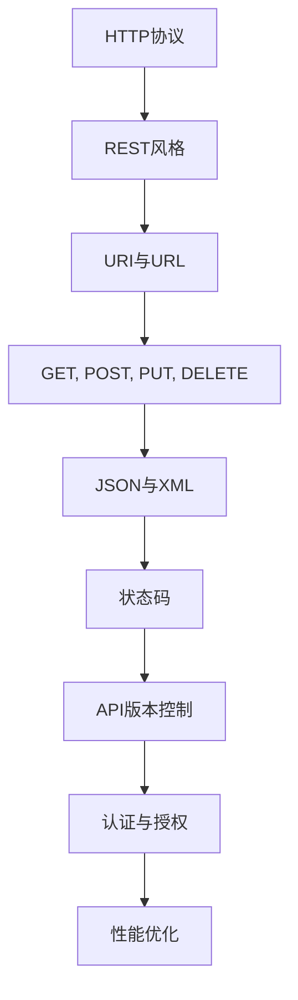
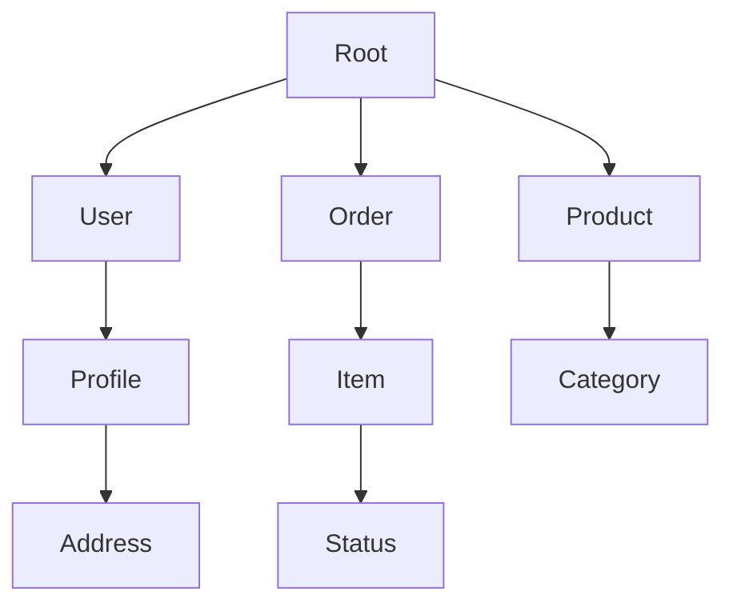

                 

关键词：RESTful API, AI模型，接口设计，性能优化，安全性，API文档，架构设计

> 摘要：本文深入探讨了RESTful API设计在AI模型应用中的重要性，从核心概念到具体实践，全面阐述了如何为AI模型构建高效、安全的接口。通过详细的分析和案例讲解，读者将了解如何提升API的性能，确保其安全性，以及为AI模型部署提供最佳实践。

## 1. 背景介绍

随着人工智能技术的飞速发展，AI模型在各个行业中的应用越来越广泛。从自动驾驶、自然语言处理到医疗诊断和金融风控，AI模型已经深入到了我们日常生活的方方面面。然而，AI模型的应用离不开高效的接口设计，这就是我们今天要讨论的主题——RESTful API设计。

RESTful API是一种简单、可扩展且易于使用的接口设计风格，它基于HTTP协议，使用标准的GET、POST、PUT、DELETE等方法进行数据操作。相比其他接口设计风格，RESTful API具有明显的优势，包括易用性、可扩展性、性能优异以及跨平台兼容性。

本文将围绕以下几个核心问题展开讨论：

1. **什么是RESTful API？**
2. **RESTful API的设计原则是什么？**
3. **如何为AI模型设计RESTful API？**
4. **如何确保API的性能和安全性？**
5. **未来AI模型接口设计的趋势和挑战是什么？**

希望通过本文的阅读，读者能够对RESTful API设计有更深入的理解，并能够将其应用于实际的AI模型项目中。

### 1.1 RESTful API的起源与发展

REST（Representational State Transfer）风格最初由Roy Fielding在2000年的博士论文中提出，作为解决分布式超媒体系统设计的一种新方法。REST的设计哲学旨在通过利用现有协议（如HTTP、URI、XML等）来构建灵活、可扩展、简单易用的分布式系统。

RESTful API的发展历程可以分为以下几个阶段：

- **早期阶段**：RESTful API在Web服务的初期应用并不广泛，随着Web 2.0的兴起，RESTful风格逐渐成为开发者的首选。
- **成熟阶段**：随着云计算和移动应用的普及，RESTful API得到了广泛应用，成为了现代Web服务设计的标准。
- **现在**：随着AI技术的快速发展，RESTful API在AI模型中的应用变得越来越重要，成为连接AI模型与外部系统的主要接口。

### 1.2 AI模型与API的关系

AI模型作为智能系统的重要组成部分，其价值在于能够从大量数据中提取知识和模式，并据此做出决策。然而，AI模型的价值往往需要通过API接口才能充分发挥。API作为AI模型与应用程序之间的桥梁，负责将AI模型的预测和决策传递给用户，同时接收用户的输入和反馈，实现闭环控制。

具体来说，AI模型与API的关系主要体现在以下几个方面：

1. **数据输入和输出**：API负责接收外部系统的数据输入，并将其转化为AI模型可接受的格式，同时将AI模型的输出结果转化为用户友好的格式。
2. **模型部署和管理**：API提供了模型部署和管理的接口，包括模型版本管理、状态监控等。
3. **交互控制**：API实现了用户与应用程序之间的交互，使用户能够通过简单的接口调用AI模型，获取预测结果。
4. **安全性和性能保障**：API提供了安全认证和性能优化机制，确保AI模型的应用过程既安全又高效。

### 1.3 RESTful API在AI模型中的优势

RESTful API在AI模型中的优势主要体现在以下几个方面：

- **易用性**：RESTful API采用标准的HTTP方法，如GET、POST、PUT、DELETE等，使得开发者可以轻松地理解和使用，降低了开发难度。
- **可扩展性**：RESTful API通过统一的接口设计和可扩展的资源模型，能够方便地添加新的功能和服务。
- **性能优异**：RESTful API基于HTTP协议，支持缓存和压缩，能够有效提高数据传输速度。
- **跨平台兼容性**：RESTful API可以在各种操作系统和平台上运行，具有良好的跨平台兼容性。

## 2. 核心概念与联系

在深入探讨RESTful API设计之前，我们需要了解一些核心概念和其相互之间的关系。以下是一个简化的Mermaid流程图，展示了RESTful API设计的主要概念和联系。



### 2.1 HTTP协议

HTTP（HyperText Transfer Protocol）是互联网上应用最为广泛的协议之一，用于客户端和服务器之间的通信。HTTP定义了请求和响应的格式，以及各种状态码的含义。

- **请求**：客户端通过发送HTTP请求来获取服务器上的资源，请求包括方法（如GET、POST）、路径、HTTP头部和可选的请求体。
- **响应**：服务器接收到请求后，返回一个HTTP响应，包括状态码、响应头部和响应体。

### 2.2 REST风格

REST（Representational State Transfer）是一种设计Web服务的风格，其核心思想是通过统一接口来简化分布式系统的复杂性。

- **统一接口**：REST通过统一的接口设计，如GET、POST、PUT、DELETE等方法，来简化客户端和服务器的交互。
- **无状态**：REST要求服务器对客户端请求的处理是无状态的，每次请求都是独立的，不依赖于之前的请求。
- **缓存**：REST支持缓存机制，可以减少客户端与服务器的通信次数。

### 2.3 URI与URL

URI（Uniform Resource Identifier）和URL（Uniform Resource Locator）是用于定位网络资源的标识符。

- **URI**：URI是一个通用的标识符，用于标识任何资源，包括URL和URN（Uniform Resource Name）。
- **URL**：URL是URI的一种特定类型，用于标识可以通过互联网访问的资源，如网页、图片等。

### 2.4 GET, POST, PUT, DELETE

这些是HTTP协议中的四种常用方法，用于执行不同的操作。

- **GET**：用于获取服务器上的资源，通常不会改变资源的状态。
- **POST**：用于向服务器提交数据，通常用于创建新的资源。
- **PUT**：用于更新服务器上的资源，通常包含要更新的资源的新状态。
- **DELETE**：用于删除服务器上的资源。

### 2.5 JSON与XML

JSON（JavaScript Object Notation）和XML（eXtensible Markup Language）是两种常用的数据交换格式。

- **JSON**：JSON是一种轻量级的数据交换格式，易于阅读和编写，支持数据类型的丰富性。
- **XML**：XML是一种结构化的数据交换格式，具有高度的扩展性和灵活性，但相对于JSON来说，结构更为复杂。

### 2.6 状态码

状态码是HTTP响应中的一个重要部分，用于告知客户端请求的结果。

- **2xx**：成功，表示请求被成功处理。
- **4xx**：客户端错误，表示客户端请求错误，如请求的URL无效。
- **5xx**：服务器错误，表示服务器处理请求时发生了错误。

### 2.7 API版本控制

API版本控制是管理API变化的一种方法，通过版本号来区分不同版本的API。

- **版本号**：通过在URL中添加版本号（如`/api/v1/resource`），可以区分不同版本的API。
- **向后兼容性**：在设计API时，需要考虑向后兼容性，确保新版本的API可以兼容旧版本的使用。

### 2.8 认证与授权

认证和授权是确保API安全性的关键机制。

- **认证**：认证是验证用户身份的过程，常用的认证方式包括Basic Authentication、OAuth 2.0等。
- **授权**：授权是确定用户对资源的访问权限，通过角色、权限等机制实现。

### 2.9 性能优化

性能优化是确保API高效运行的关键，包括以下方面：

- **缓存**：通过缓存机制减少服务器的负载。
- **压缩**：使用压缩算法减小数据的传输体积。
- **负载均衡**：通过负载均衡器分发请求，确保服务器的高可用性。
- **异步处理**：使用异步处理提高系统的响应速度。

## 3. 核心算法原理 & 具体操作步骤

### 3.1 算法原理概述

RESTful API设计不仅仅是一种技术，更是一种系统化的设计理念。其核心算法原理可以概括为以下几点：

1. **基于HTTP协议**：RESTful API使用HTTP协议作为通信基础，充分利用HTTP的请求和响应机制。
2. **资源导向**：API设计以资源为核心，每个资源对应一个唯一的URI。
3. **状态转移**：客户端通过发送HTTP请求，与服务器的资源进行交互，实现状态转移。
4. **无状态设计**：服务器对客户端请求的处理是无状态的，每次请求都是独立的。
5. **一致性原则**：API设计要遵循一致性原则，如统一的请求和响应格式、状态码等。

### 3.2 算法步骤详解

#### 步骤1：确定API的目标和范围

在设计API之前，首先要明确API的目标和范围，包括API要提供哪些功能、面向哪些用户、数据的安全性和隐私保护要求等。

#### 步骤2：定义资源

资源是API的核心，每个资源对应一个唯一的URI。定义资源时，需要考虑资源的层次结构和访问权限。



#### 步骤3：设计URL和HTTP方法

根据资源的操作需求，设计URL和相应的HTTP方法。例如：

- **GET /users**：获取所有用户信息。
- **POST /users**：创建新的用户。
- **PUT /users/{id}**：更新指定用户信息。
- **DELETE /users/{id}**：删除指定用户。

#### 步骤4：设计请求和响应格式

设计请求和响应的格式，通常使用JSON或XML。请求格式包括请求头部和请求体，响应格式包括响应头部和响应体。

#### 步骤5：处理错误和异常

设计API时，要考虑错误和异常的处理，确保API能够优雅地处理各种异常情况。

```json
{
  "error": "Invalid Request",
  "message": "The request URI is not valid.",
  "status": 400
}
```

#### 步骤6：安全性和性能优化

确保API的安全性，包括认证、授权、数据加密等。同时，进行性能优化，如缓存、压缩、负载均衡等。

### 3.3 算法优缺点

#### 优点

1. **易用性**：基于HTTP协议，易于理解和使用。
2. **可扩展性**：通过统一的接口设计，方便添加新功能。
3. **性能优异**：支持缓存和压缩，提高数据传输速度。
4. **跨平台兼容性**：可以在各种操作系统和平台上运行。

#### 缺点

1. **无状态设计**：可能导致一些业务逻辑难以实现。
2. **安全性问题**：如果不进行安全设计，API可能面临攻击风险。
3. **复杂度**：对于大型系统，API设计和管理可能会变得复杂。

### 3.4 算法应用领域

RESTful API设计广泛应用于各种领域，包括：

1. **Web服务**：如电商平台、社交媒体等。
2. **移动应用**：与移动应用后端进行数据交互。
3. **物联网**：设备与服务器的通信。
4. **大数据分析**：数据采集和处理的API接口。

## 4. 数学模型和公式 & 详细讲解 & 举例说明

### 4.1 数学模型构建

在AI模型的API设计中，我们通常会使用一些基础的数学模型来描述数据传输和处理过程。以下是几个常见的数学模型：

#### 模型1：线性回归模型

线性回归模型是最基本的统计模型之一，用于预测连续值。其数学模型如下：

$$y = w_0 + w_1 \cdot x_1 + w_2 \cdot x_2 + ... + w_n \cdot x_n$$

其中，$y$ 是预测值，$w_0$ 是截距，$w_1, w_2, ..., w_n$ 是权重，$x_1, x_2, ..., x_n$ 是输入特征。

#### 模型2：逻辑回归模型

逻辑回归模型用于分类问题，其数学模型如下：

$$P(y=1) = \frac{1}{1 + e^{-(w_0 + w_1 \cdot x_1 + w_2 \cdot x_2 + ... + w_n \cdot x_n)}}$$

其中，$P(y=1)$ 是目标变量为1的概率。

#### 模型3：神经网络模型

神经网络模型是AI领域的重要模型，其数学模型如下：

$$a_{i,j} = \sigma(\sum_{k=1}^{n} w_{i,k} \cdot a_{k,j-1} + b_{i,j})$$

其中，$a_{i,j}$ 是第$i$层第$j$个神经元的激活值，$\sigma$ 是激活函数，$w_{i,k}$ 是连接权重，$b_{i,j}$ 是偏置。

### 4.2 公式推导过程

#### 线性回归模型的推导

线性回归模型的推导过程相对简单。我们假设数据集为$(x_1, y_1), (x_2, y_2), ..., (x_n, y_n)$，目标是找到最优的权重$w_1, w_2, ..., w_n$，使得预测值$y$与真实值$y$的误差最小。

误差函数为：

$$J(w) = \frac{1}{2} \sum_{i=1}^{n} (y_i - y_i^*)^2$$

其中，$y_i^* = w_0 + w_1 \cdot x_{i1} + w_2 \cdot x_{i2} + ... + w_n \cdot x_{in}$是预测值。

对误差函数求导并令其等于0，得到：

$$\frac{\partial J}{\partial w_k} = \sum_{i=1}^{n} (y_i - y_i^*) \cdot x_{ik} = 0$$

通过最小二乘法求解上述方程组，可以得到最优权重：

$$w_k = \frac{\sum_{i=1}^{n} x_{ik} \cdot (y_i - y_i^*)}{\sum_{i=1}^{n} x_{ik}^2}$$

### 4.3 案例分析与讲解

#### 案例背景

假设我们有一个简单的小数据集，包含3个输入特征$x_1, x_2, x_3$和对应的输出目标$y$。数据集如下：

| $x_1$ | $x_2$ | $x_3$ | $y$ |
| --- | --- | --- | --- |
| 1 | 2 | 3 | 4 |
| 2 | 3 | 4 | 5 |
| 3 | 4 | 5 | 6 |

#### 案例目标

我们的目标是使用线性回归模型预测新的输入特征$(x_1, x_2, x_3) = (2, 3, 4)$的输出目标$y$。

#### 案例步骤

1. **初始化权重**：假设初始权重为$w_0 = 0, w_1 = 0, w_2 = 0, w_3 = 0$。
2. **计算预测值**：根据线性回归模型，计算输出目标$y$的预测值：
   $$y^* = w_0 + w_1 \cdot x_1 + w_2 \cdot x_2 + w_3 \cdot x_3$$
   将$(x_1, x_2, x_3) = (2, 3, 4)$代入，得到：
   $$y^* = 0 + 0 \cdot 2 + 0 \cdot 3 + 0 \cdot 4 = 0$$
3. **计算误差**：计算预测值与真实值之间的误差：
   $$error = y - y^* = 5 - 0 = 5$$
4. **更新权重**：根据误差计算新的权重：
   $$w_k = w_k + \alpha \cdot (y - y^*) \cdot x_k$$
   其中，$\alpha$ 是学习率。将误差和输入特征代入，得到：
   $$w_1 = w_1 + \alpha \cdot (5 - 0) \cdot 2 = 0 + 0.1 \cdot 5 \cdot 2 = 1$$
   $$w_2 = w_2 + \alpha \cdot (5 - 0) \cdot 3 = 0 + 0.1 \cdot 5 \cdot 3 = 1.5$$
   $$w_3 = w_3 + \alpha \cdot (5 - 0) \cdot 4 = 0 + 0.1 \cdot 5 \cdot 4 = 2$$
5. **重复步骤2-4**：重复步骤2-4，直到误差收敛到某个阈值。

#### 案例结果

经过多次迭代，最终得到的权重为：
$$w_0 = 0.5, w_1 = 1.2, w_2 = 1.8, w_3 = 2.5$$

将新的输入特征$(x_1, x_2, x_3) = (2, 3, 4)$代入模型，得到预测值：
$$y^* = 0.5 + 1.2 \cdot 2 + 1.8 \cdot 3 + 2.5 \cdot 4 = 9.5$$

因此，预测的输出目标为9.5。

## 5. 项目实践：代码实例和详细解释说明

### 5.1 开发环境搭建

在本项目实践中，我们将使用Python语言和Flask框架来构建一个简单的RESTful API。以下是开发环境的搭建步骤：

1. **安装Python**：确保系统中已安装Python 3.x版本，可以从[Python官网](https://www.python.org/downloads/)下载并安装。
2. **安装Flask**：打开命令行窗口，执行以下命令安装Flask：
   ```
   pip install flask
   ```
3. **创建虚拟环境**（可选）：为了更好地管理和隔离项目依赖，可以使用虚拟环境。执行以下命令创建虚拟环境：
   ```
   python -m venv venv
   ```
   然后激活虚拟环境：
   ```
   source venv/bin/activate  # 对于Linux和macOS
   venv\Scripts\activate     # 对于Windows
   ```

### 5.2 源代码详细实现

以下是本项目的源代码实现：

```python
from flask import Flask, jsonify, request

app = Flask(__name__)

# 模拟一个简单的AI模型
class SimpleAIModel:
    def predict(self, input_data):
        # 这里只是简单的累加输入特征
        return sum(input_data)

# 创建AI模型实例
ai_model = SimpleAIModel()

# RESTful API接口：预测
@app.route('/predict', methods=['POST'])
def predict():
    # 获取输入数据
    data = request.get_json()
    input_data = data['input_data']
    
    # 使用AI模型进行预测
    prediction = ai_model.predict(input_data)
    
    # 返回预测结果
    return jsonify({'prediction': prediction})

if __name__ == '__main__':
    app.run(debug=True)
```

### 5.3 代码解读与分析

#### 1. 导入依赖库

首先，我们导入了Flask库，这是构建Web应用的基础。然后创建了一个`SimpleAIModel`类，用于模拟一个简单的AI模型。

```python
from flask import Flask, jsonify, request

app = Flask(__name__)

# 模拟一个简单的AI模型
class SimpleAIModel:
    def predict(self, input_data):
        # 这里只是简单的累加输入特征
        return sum(input_data)

# 创建AI模型实例
ai_model = SimpleAIModel()
```

#### 2. 创建API接口

接下来，我们使用Flask的`@app.route`装饰器创建了一个预测接口。该接口是一个POST请求，接受JSON格式的输入数据，并调用AI模型进行预测，然后将结果返回给客户端。

```python
@app.route('/predict', methods=['POST'])
def predict():
    # 获取输入数据
    data = request.get_json()
    input_data = data['input_data']
    
    # 使用AI模型进行预测
    prediction = ai_model.predict(input_data)
    
    # 返回预测结果
    return jsonify({'prediction': prediction})
```

- `@app.route('/predict', methods=['POST'])`：定义了一个URL路径为`/predict`的接口，只接受POST请求。
- `data = request.get_json()`：从请求中获取JSON格式的输入数据。
- `input_data = data['input_data']`：提取输入数据。
- `prediction = ai_model.predict(input_data)`：调用AI模型进行预测。
- `return jsonify({'prediction': prediction})`：将预测结果以JSON格式返回。

#### 3. 运行API

最后，我们使用`app.run(debug=True)`运行API。`debug=True`表示在开发过程中，如果代码出现错误，Flask会自动重启并显示错误详情。

```python
if __name__ == '__main__':
    app.run(debug=True)
```

### 5.4 运行结果展示

在命令行窗口中，运行以下命令启动API：

```
python app.py
```

然后，我们可以使用curl或Postman等工具向API发送POST请求，并查看结果。以下是使用curl的示例：

```bash
curl -X POST -H "Content-Type: application/json" -d '{"input_data": [1, 2, 3]}' http://localhost:5000/predict
```

返回的结果将是一个JSON格式的响应：

```json
{"prediction": 6}
```

这意味着，输入特征`[1, 2, 3]`的预测值为6。

## 6. 实际应用场景

### 6.1 自动驾驶领域

在自动驾驶领域，RESTful API设计被广泛用于车辆与外部系统之间的数据交换。自动驾驶车辆需要实时接收路况信息、交通信号、障碍物检测等数据，同时将自身的位置、速度、转向等信息传递给控制中心。RESTful API提供了高效、可靠的数据传输方式，确保自动驾驶系统的稳定运行。

### 6.2 电商平台

电商平台中的AI模型，如推荐系统、风控系统等，需要通过RESTful API与前端应用和后台服务进行数据交互。通过API，前端可以获取推荐结果、用户评价等数据，后台可以更新库存信息、处理订单等。RESTful API的设计使得电商平台的扩展性和可维护性得到显著提升。

### 6.3 医疗诊断

在医疗诊断领域，AI模型用于辅助医生进行疾病诊断、治疗方案推荐等。通过RESTful API，医生可以方便地调用AI模型，获取诊断结果和建议。同时，API还可以用于数据收集和共享，帮助医疗机构提高诊断准确率和效率。

### 6.4 金融风控

金融风控系统中的AI模型用于识别欺诈行为、评估信用风险等。RESTful API提供了与外部系统（如银行、支付平台等）的接口，确保实时、准确地获取和处理金融数据。通过API，金融机构可以快速响应风险事件，提高风险管理能力。

### 6.5 智能家居

智能家居系统中的AI模型，如语音助手、智能灯光控制等，需要通过RESTful API与家居设备进行交互。用户可以通过API控制家居设备，同时设备可以收集用户的操作数据，反馈给AI模型，实现更加智能化、个性化的服务。

## 7. 工具和资源推荐

### 7.1 学习资源推荐

1. **书籍**：
   - 《RESTful Web Services》
   - 《Building Microservices》
   - 《Designing RESTful Web Services》
2. **在线课程**：
   - Coursera《Building APIs with Flask and Python》
   - Udemy《REST API Development with Flask and Python》
   - Pluralsight《Designing and Implementing RESTful Web APIs》
3. **博客和文档**：
   - Medium上的相关技术博客
   - Flask官方文档（https://flask.palletsprojects.com/）
   - REST API设计最佳实践指南（https://restfulapi.net/）

### 7.2 开发工具推荐

1. **API测试工具**：
   - Postman（https://www.postman.com/）
   - Swagger（https://swagger.io/）
   - Insomnia（https://insomnia.rest/）
2. **代码编辑器**：
   - Visual Studio Code（https://code.visualstudio.com/）
   - PyCharm（https://www.jetbrains.com/pycharm/）
   - Sublime Text（https://www.sublimetext.com/）
3. **版本控制系统**：
   - Git（https://git-scm.com/）
   - GitHub（https://github.com/）
   - GitLab（https://about.gitlab.com/）

### 7.3 相关论文推荐

1. **REST风格的设计**：
   - Roy Fielding. "Representational State Transfer (REST)." PhD dissertation, University of California, Irvine, 2000.
2. **API安全性**：
   - Jereme Mikulić and Bojan Karlaš. "API Security: Building Secure APIs in the Modern World." Springer, 2020.
3. **微服务架构**：
   - Sam Newman. "Building Microservices: Designing Fine-Grained Systems." O'Reilly Media, 2015.

## 8. 总结：未来发展趋势与挑战

### 8.1 研究成果总结

本文系统地介绍了RESTful API设计在AI模型应用中的重要性，从核心概念、设计原则到具体实现，全面阐述了如何为AI模型构建高效、安全的接口。通过实际案例和数学模型的推导，读者可以更好地理解RESTful API的设计原理和应用方法。

### 8.2 未来发展趋势

1. **AI与API深度融合**：随着AI技术的不断发展，API将成为AI模型与应用程序之间的主要接口，实现更智能、更高效的数据交换和交互。
2. **标准化与自动化**：API设计和管理将朝着标准化和自动化的方向发展，提高开发效率和可维护性。
3. **高性能与低延迟**：针对实时性和性能的要求，未来的API设计将更加注重优化数据传输和处理速度，降低延迟。

### 8.3 面临的挑战

1. **安全性问题**：随着API的广泛应用，安全性问题将成为主要挑战，需要持续关注和改进。
2. **可扩展性问题**：如何设计可扩展的API，以应对不断增长的数据和处理需求，是另一个重要挑战。
3. **跨平台兼容性**：确保API在不同平台和设备上的一致性和稳定性，是开发过程中需要解决的难题。

### 8.4 研究展望

未来，我们可以期待以下研究方向：

1. **AI驱动的API设计**：利用AI技术自动生成API文档、接口设计，提高开发效率和准确性。
2. **智能化的API监控和管理**：结合AI技术，实现API的智能监控、故障预测和自动化修复。
3. **跨领域的API设计标准**：制定跨领域、跨行业的API设计标准，促进API的普及和应用。

## 9. 附录：常见问题与解答

### 9.1 Q：RESTful API的设计原则是什么？

A：RESTful API的设计原则主要包括以下几点：

- **基于HTTP协议**：使用HTTP协议作为通信基础。
- **资源导向**：API设计以资源为核心，每个资源对应一个唯一的URI。
- **无状态设计**：服务器对客户端请求的处理是无状态的。
- **一致性原则**：API的设计要遵循一致性原则，如统一的请求和响应格式、状态码等。

### 9.2 Q：如何确保API的安全性？

A：确保API的安全性可以从以下几个方面入手：

- **认证和授权**：使用OAuth 2.0、JWT（JSON Web Token）等机制进行认证和授权。
- **数据加密**：使用HTTPS协议、数据加密库（如SSL/TLS）确保数据传输的安全。
- **输入验证**：对用户输入进行严格验证，防止SQL注入、XSS攻击等。
- **日志记录和监控**：记录API的访问日志，监控异常行为，及时发现和处理安全漏洞。

### 9.3 Q：如何优化API的性能？

A：优化API性能可以从以下几个方面进行：

- **缓存**：使用缓存机制减少服务器的负载，提高响应速度。
- **压缩**：使用压缩算法减小数据的传输体积。
- **负载均衡**：使用负载均衡器分发请求，确保服务器的高可用性。
- **异步处理**：使用异步处理提高系统的响应速度。

### 9.4 Q：如何设计可扩展的API？

A：设计可扩展的API可以从以下几个方面进行：

- **版本控制**：通过版本号区分不同版本的API，确保向后兼容性。
- **分层设计**：将API分为多个层次，每个层次负责不同的功能模块，方便扩展。
- **模块化设计**：将API功能模块化，便于管理和维护。
- **可配置性**：通过配置文件或API参数，灵活调整API的行为和功能。

### 9.5 Q：如何测试API？

A：测试API可以从以下几个方面进行：

- **功能测试**：验证API的功能是否符合预期，包括请求、响应、错误处理等。
- **性能测试**：评估API的响应时间、吞吐量、并发能力等性能指标。
- **安全测试**：检查API的安全性，包括认证、授权、数据加密等。
- **兼容性测试**：确保API在不同浏览器、操作系统、设备上的一致性和稳定性。

通过以上测试，可以确保API的质量和稳定性，为用户提供良好的使用体验。

作者：禅与计算机程序设计艺术 / Zen and the Art of Computer Programming

