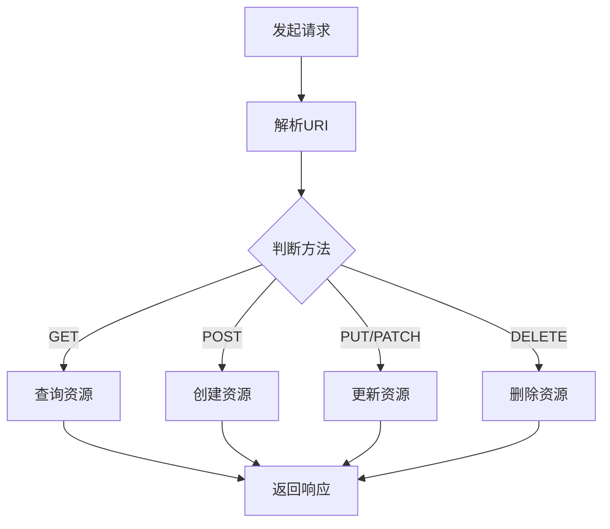

                 

 RESTful API设计是现代Web服务开发中至关重要的一环。随着互联网应用的迅速增长，API作为不同系统之间交互的桥梁，其设计质量直接影响到系统的性能、可扩展性和用户体验。本文旨在探讨RESTful API设计的原则、方法以及最佳实践，帮助开发者构建高效、可扩展的Web服务。

> **关键词**：RESTful API，Web服务，设计原则，可扩展性，用户体验

> **摘要**：本文首先介绍了RESTful API的基本概念和设计原则，随后详细讨论了RESTful架构风格的关键要素，包括资源表示、状态转移和超媒体。接着，文章深入分析了API设计中的常见问题和挑战，并提供了解决方案。最后，文章通过具体的代码实例和实际应用场景，展示了如何将理论应用于实践，并提出了未来发展的趋势与挑战。

## 1. 背景介绍

在互联网技术快速发展的今天，Web服务已经成为了各类应用系统之间进行数据交换和功能调用的重要手段。RESTful API作为一种遵循REST（Representational State Transfer）设计风格的API，因其简单性、灵活性和可扩展性而广受开发者青睐。RESTful API设计不仅能够提高系统的可维护性和互操作性，还能够降低系统的学习成本，使开发者能够更加专注于业务逻辑的实现。

RESTful API设计的重要性主要体现在以下几个方面：

1. **可扩展性**：通过合理的API设计，系统能够轻松扩展，满足日益增长的业务需求。
2. **用户体验**：简洁、直观的API接口能够提高开发者的工作效率，减少错误和调试时间，从而提升用户体验。
3. **互操作性**：遵循标准化的设计原则，不同系统之间能够更加容易地进行数据交换和功能调用。
4. **性能优化**：通过合理的设计和优化，API能够在保证功能完整性的同时，提高系统的响应速度和处理能力。

本文将围绕RESTful API设计的关键要素，深入探讨其设计原则、方法以及在实际应用中的问题与挑战。通过本文的阅读，读者将能够更好地理解RESTful API的设计思路，掌握最佳实践，从而在实际开发中创造出更加优秀、高效的Web服务。

## 2. 核心概念与联系

### 2.1 RESTful API定义

RESTful API（Representational State Transfer Application Programming Interface）是基于REST架构风格设计的一套接口规范。REST本身是一种设计风格，旨在通过HTTP协议实现分布式超媒体系统的交互。RESTful API则是将这种设计风格应用于实际开发中，以实现不同系统之间的数据交换和功能调用。

### 2.2 RESTful API设计原则

RESTful API设计原则主要包括以下五个方面：

1. **统一接口**：接口的设计应该保持一致性，包括资源的命名、请求方法、状态码等，以提高易用性和可维护性。
2. **无状态性**：API应该无状态，每次请求之间相互独立，避免在服务器端保存状态信息，从而提高系统的可扩展性和可靠性。
3. **客户端-服务器架构**：客户端（用户界面）和服务器（业务逻辑和数据）分离，客户端负责用户界面和交互逻辑，服务器负责处理请求和提供数据。
4. **分层系统**：系统应该采用分层架构，以实现模块化设计，提高系统的可扩展性和可维护性。
5. **可缓存性**：API响应应该支持缓存，以提高系统的性能和响应速度。

### 2.3 RESTful API与HTTP的联系

HTTP（Hypertext Transfer Protocol）是Web服务中常用的传输协议，RESTful API设计与HTTP协议有着紧密的联系。

1. **请求方法**：RESTful API中的请求方法（如GET、POST、PUT、DELETE等）与HTTP方法相对应，用于表示资源的操作方式。
2. **状态码**：HTTP状态码用于表示请求的结果和状态，如200 OK表示请求成功，400 Bad Request表示请求无效，500 Internal Server Error表示服务器内部错误。RESTful API设计中应充分利用这些状态码，以便更好地传达请求的处理结果。
3. **URI（统一资源标识符）**：URI是RESTful API中用于标识资源的唯一标识符。URI的设计应遵循简洁、易于理解、可扩展的原则。

### 2.4 RESTful API与超媒体的联系

超媒体（Hypermedia）是RESTful API设计中的一个重要概念，它指的是通过链接（如HTML中的超链接）连接的不同资源。在RESTful API中，超媒体用于在响应中提供指向其他资源的链接，从而实现状态转移和资源导航。

1. **JSON Hypermedia API（JAX-RS）**：JAX-RS是一种基于Java的RESTful Web服务规范，它支持超媒体，允许在JSON响应中嵌入链接，实现资源的动态导航。
2. **HAL（Hypermedia as the Engine of Application State）**：HAL是一种基于JSON的轻量级超媒体格式，它通过在JSON对象中嵌入链接，实现资源的动态导航和状态转移。

### 2.5 RESTful API设计原理的Mermaid流程图

以下是一个简单的Mermaid流程图，展示了RESTful API设计的基本原理：



在这个流程图中，发起请求后，服务器根据URI和请求方法进行相应的资源操作，并最终返回响应。这种设计方法使得API接口简单、直观，易于理解和扩展。

## 3. 核心算法原理 & 具体操作步骤

### 3.1 算法原理概述

RESTful API的设计主要基于REST架构风格，其核心算法原理可以概括为以下几点：

1. **统一接口设计**：采用统一的接口设计原则，使得API接口易于理解和维护。
2. **无状态性**：确保每次请求之间相互独立，避免在服务器端保存状态信息。
3. **客户端-服务器架构**：实现客户端和服务器端的分离，降低系统的复杂度。
4. **分层系统设计**：采用分层架构，提高系统的可扩展性和可维护性。
5. **支持缓存**：充分利用HTTP缓存机制，提高系统性能。

### 3.2 算法步骤详解

1. **解析请求**：首先，服务器接收到客户端发起的HTTP请求，根据URI和请求方法进行解析。
2. **资源定位**：根据请求的URI，定位到具体的资源。
3. **资源操作**：根据请求方法，执行相应的资源操作（如查询、创建、更新或删除资源）。
4. **返回响应**：将处理结果以HTTP响应的形式返回给客户端，包括状态码、响应体等。
5. **状态转移与导航**：在响应中嵌入超媒体链接，实现资源的动态导航和状态转移。

### 3.3 算法优缺点

**优点**：

1. **简单性**：基于HTTP协议，易于理解和实现。
2. **灵活性**：支持多种数据格式（如JSON、XML）和请求方法（如GET、POST、PUT、DELETE）。
3. **可扩展性**：通过统一的接口设计原则，系统易于扩展和重构。
4. **可缓存性**：支持HTTP缓存机制，提高系统性能。

**缺点**：

1. **性能瓶颈**：由于HTTP协议的局限性，在高并发场景下可能存在性能瓶颈。
2. **安全性问题**：需要关注API的安全性，防范攻击（如SQL注入、跨站请求伪造等）。
3. **文档维护**：随着API接口的增多，文档的维护和更新可能变得困难。

### 3.4 算法应用领域

RESTful API设计广泛应用于各种领域，包括但不限于：

1. **Web服务**：用于实现不同系统之间的数据交换和功能调用。
2. **移动应用**：提供RESTful API，方便移动应用与服务器端进行交互。
3. **物联网**：通过RESTful API实现物联网设备的数据采集和远程控制。
4. **微服务架构**：在微服务架构中，RESTful API用于实现服务之间的通信和协作。

## 4. 数学模型和公式 & 详细讲解 & 举例说明

### 4.1 数学模型构建

RESTful API设计中的数学模型主要涉及以下几个方面：

1. **状态转移**：客户端通过发起不同的HTTP请求，实现资源的状态转移。状态转移可以用状态图（State Transition Graph）来表示。
2. **资源表示**：资源在API中的表示方式，通常采用JSON或XML格式。资源表示可以用数据结构（如树或图）来表示。
3. **超媒体链接**：在响应中嵌入的超媒体链接，用于实现资源的动态导航。超媒体链接可以用链接图（Link Graph）来表示。

### 4.2 公式推导过程

1. **状态转移公式**：

   状态转移可以用以下公式表示：

   $S_{i+1} = f(S_i, R_i)$

   其中，$S_i$表示当前状态，$R_i$表示请求，$f$表示状态转移函数，$S_{i+1}$表示下一个状态。

2. **资源表示公式**：

   资源表示可以用以下公式表示：

   $R = {r_1, r_2, ..., r_n}$

   其中，$r_1, r_2, ..., r_n$表示不同的资源。

3. **超媒体链接公式**：

   超媒体链接可以用以下公式表示：

   $L = {l_1, l_2, ..., l_m}$

   其中，$l_1, l_2, ..., l_m$表示不同的链接。

### 4.3 案例分析与讲解

假设有一个简单的博客系统，包含文章、评论和用户三个主要资源。下面是一个具体的案例：

1. **状态转移**：

   初始状态：用户未登录。

   请求：用户发起登录请求。

   状态转移：用户登录成功，状态变为已登录。

   请求：用户发起查看文章请求。

   状态转移：用户查看文章，状态不变。

   请求：用户发起评论文章请求。

   状态转移：用户发表评论，状态不变。

2. **资源表示**：

   资源表示：文章（id，标题，内容，作者），评论（id，内容，作者，文章id），用户（id，用户名，密码）。

3. **超媒体链接**：

   响应：文章详情页面包含查看评论的链接。

   链接：查看评论（GET /articles/{articleId}/comments）。

   响应：评论详情页面包含修改评论的链接。

   链接：修改评论（PUT /comments/{commentId}）。

通过上述案例，我们可以看到RESTful API设计中的数学模型在实际应用中的具体体现。状态转移、资源表示和超媒体链接共同构建了一个完整、动态的API系统。

## 5. 项目实践：代码实例和详细解释说明

### 5.1 开发环境搭建

在本节中，我们将使用Spring Boot框架来构建一个简单的RESTful API。首先，需要确保已经安装了Java开发工具包（JDK）和Gradle构建工具。接下来，按照以下步骤进行开发环境搭建：

1. **创建Spring Boot项目**：

   使用Gradle创建一个新的Spring Boot项目：

   ```shell
   gradle create-project --type=project \
   --locations=org.springframework.boot,org.springframework.boot.spring-boot-starter \
   --name=restful-api
   ```

2. **添加依赖**：

   在`build.gradle`文件中添加相关依赖项：

   ```groovy
   dependencies {
       implementation 'org.springframework.boot:spring-boot-starter-web'
       implementation 'org.springframework.boot:spring-boot-starter-data-jpa'
       implementation 'mysql:mysql-connector-java'
   }
   ```

3. **配置数据库**：

   在`application.properties`文件中配置数据库连接信息：

   ```properties
   spring.datasource.url=jdbc:mysql://localhost:3306/restful_api?useSSL=false&serverTimezone=UTC
   spring.datasource.username=root
   spring.datasource.password=root
   spring.jpa.hibernate.ddl-auto=update
   ```

### 5.2 源代码详细实现

下面是一个简单的RESTful API实现，包括用户、文章和评论三个主要资源。

1. **实体类**：

   ```java
   @Entity
   public class User {
       @Id
       @GeneratedValue(strategy = GenerationType.IDENTITY)
       private Long id;
       private String username;
       private String password;
       
       // Getters and Setters
   }
   
   @Entity
   public class Article {
       @Id
       @GeneratedValue(strategy = GenerationType.IDENTITY)
       private Long id;
       private String title;
       private String content;
       @ManyToOne
       private User author;
       
       // Getters and Setters
   }
   
   @Entity
   public class Comment {
       @Id
       @GeneratedValue(strategy = GenerationType.IDENTITY)
       private Long id;
       private String content;
       @ManyToOne
       private User author;
       @ManyToOne
       private Article article;
       
       // Getters and Setters
   }
   ```

2. **数据访问层**：

   ```java
   @Repository
   public interface UserRepository extends JpaRepository<User, Long> {
   }
   
   @Repository
   public interface ArticleRepository extends JpaRepository<Article, Long> {
   }
   
   @Repository
   public interface CommentRepository extends JpaRepository<Comment, Long> {
   }
   ```

3. **服务层**：

   ```java
   @Service
   public class UserService {
       @Autowired
       private UserRepository userRepository;
       
       public User createUser(User user) {
           return userRepository.save(user);
       }
       
       public User getUserById(Long id) {
           return userRepository.findById(id).orElseThrow(() -> new ResourceNotFoundException("User not found"));
       }
   }
   
   @Service
   public class ArticleService {
       @Autowired
       private ArticleRepository articleRepository;
       
       public Article createArticle(Article article) {
           return articleRepository.save(article);
       }
       
       public Article getArticleById(Long id) {
           return articleRepository.findById(id).orElseThrow(() -> new ResourceNotFoundException("Article not found"));
       }
   }
   
   @Service
   public class CommentService {
       @Autowired
       private CommentRepository commentRepository;
       
       public Comment createComment(Comment comment) {
           return commentRepository.save(comment);
       }
       
       public Comment getCommentById(Long id) {
           return commentRepository.findById(id).orElseThrow(() -> new ResourceNotFoundException("Comment not found"));
       }
   }
   ```

4. **控制器层**：

   ```java
   @RestController
   @RequestMapping("/users")
   public class UserController {
       @Autowired
       private UserService userService;
       
       @PostMapping
       public User createUser(@RequestBody User user) {
           return userService.createUser(user);
       }
       
       @GetMapping("/{id}")
       public User getUserById(@PathVariable Long id) {
           return userService.getUserById(id);
       }
   }
   
   @RestController
   @RequestMapping("/articles")
   public class ArticleController {
       @Autowired
       private ArticleService articleService;
       
       @PostMapping
       public Article createArticle(@RequestBody Article article) {
           return articleService.createArticle(article);
       }
       
       @GetMapping("/{id}")
       public Article getArticleById(@PathVariable Long id) {
           return articleService.getArticleById(id);
       }
   }
   
   @RestController
   @RequestMapping("/comments")
   public class CommentController {
       @Autowired
       private CommentService commentService;
       
       @PostMapping
       public Comment createComment(@RequestBody Comment comment) {
           return commentService.createComment(comment);
       }
       
       @GetMapping("/{id}")
       public Comment getCommentById(@PathVariable Long id) {
           return commentService.getCommentById(id);
       }
   }
   ```

### 5.3 代码解读与分析

在上述代码中，我们首先定义了三个实体类：`User`、`Article`和`Comment`，分别表示用户、文章和评论。每个实体类都包含了相应的属性和标识符，并使用了JPA注解进行标注。

数据访问层（Repository）负责与数据库进行交互，实现了基本的数据操作方法，如增加、删除、查询和更新。服务层（Service）则负责业务逻辑的实现，调用数据访问层的方法，完成具体的功能。

控制器层（Controller）负责处理HTTP请求，将请求路由到相应的服务层，并将处理结果返回给客户端。每个控制器都对应了一个RESTful API接口，遵循统一的接口设计原则。

### 5.4 运行结果展示

假设我们成功启动了Spring Boot应用程序，并访问以下API接口：

1. **创建用户**：

   ```http
   POST /users
   Content-Type: application/json
   
   {
       "username": "john_doe",
       "password": "password123"
   }
   ```

   响应：

   ```json
   {
       "id": 1,
       "username": "john_doe",
       "password": "password123"
   }
   ```

2. **获取用户**：

   ```http
   GET /users/1
   ```

   响应：

   ```json
   {
       "id": 1,
       "username": "john_doe",
       "password": "password123"
   }
   ```

3. **创建文章**：

   ```http
   POST /articles
   Content-Type: application/json
   
   {
       "title": "Hello World",
       "content": "This is my first article.",
       "author": {"id": 1}
   }
   ```

   响应：

   ```json
   {
       "id": 1,
       "title": "Hello World",
       "content": "This is my first article.",
       "author": {"id": 1}
   }
   ```

4. **获取文章**：

   ```http
   GET /articles/1
   ```

   响应：

   ```json
   {
       "id": 1,
       "title": "Hello World",
       "content": "This is my first article.",
       "author": {"id": 1}
   }
   ```

通过以上示例，我们可以看到RESTful API的基本运行结果。每个API接口都遵循了RESTful设计原则，包括统一的接口设计、无状态性和客户端-服务器架构。此外，我们还展示了如何通过HTTP请求和响应实现资源的创建、查询和更新操作。

## 6. 实际应用场景

RESTful API设计在多个实际应用场景中展现了其强大的功能和优势。以下是一些典型的应用场景：

### 6.1 Web服务

Web服务是RESTful API最常见和最基础的应用场景。开发者可以通过RESTful API实现不同系统之间的数据交换和功能调用，从而构建复杂的Web应用。例如，社交媒体平台可以通过RESTful API提供用户信息、内容分享、好友关系等功能，便于第三方应用接入和使用。

### 6.2 移动应用

随着移动设备的普及，移动应用与服务器端的数据交互也变得越来越频繁。RESTful API为移动应用提供了简洁、易用的接口，使得开发者可以快速实现与服务器端的数据通信。通过RESTful API，移动应用可以获取用户信息、订单状态、新闻资讯等，从而提升用户体验。

### 6.3 物联网

在物联网（IoT）领域，设备与服务器之间的通信是关键。RESTful API通过标准化的接口设计，使得不同设备能够方便地接入物联网平台，实现数据的采集、处理和监控。例如，智能家居设备可以通过RESTful API与服务器端进行交互，实现远程控制和状态监控。

### 6.4 微服务架构

微服务架构是近年来流行的一种系统架构风格，其核心思想是将大型系统拆分为多个小型、独立的服务模块，以提高系统的可扩展性和可维护性。RESTful API在微服务架构中发挥着重要作用，用于实现服务模块之间的数据交换和功能调用。通过RESTful API，微服务架构能够更好地实现模块化和分布式系统的设计。

### 6.5 API网关

API网关是另一个常见的应用场景。API网关负责接收来自外部客户端的请求，并进行路由、认证、日志记录等操作，然后转发给内部服务。通过API网关，开发者可以统一管理API接口，提供更好的安全性、性能和可扩展性。RESTful API设计使得API网关能够灵活地处理不同的请求，实现分布式系统的无缝集成。

### 6.6 跨平台应用

RESTful API设计使得跨平台应用开发变得更加简单。通过统一的接口设计原则，开发者可以轻松地将Web、移动和物联网应用与服务器端进行集成。无论是Web前端、移动客户端还是物联网设备，都可以通过RESTful API获取所需的数据和服务，从而实现跨平台的开发。

## 7. 工具和资源推荐

### 7.1 学习资源推荐

1. **《RESTful API设计：艺术与最佳实践》**：这是一本经典的RESTful API设计书籍，详细介绍了RESTful API的设计原则、方法和最佳实践，适合初学者和进阶开发者阅读。
2. **《RESTful Web API设计》**：本书由知名开发者Sam Ruby撰写，深入探讨了RESTful Web API的设计和实现，包含大量实践案例和代码示例。
3. **RESTful API设计教程**：在线教程，提供从基础到高级的RESTful API设计知识，适合自学和巩固。

### 7.2 开发工具推荐

1. **Postman**：Postman是一个流行的API测试工具，支持HTTP协议的各种请求方法，可以方便地构建、测试和调试RESTful API。
2. **Swagger**：Swagger是一个API文档生成工具，可以自动生成RESTful API的文档，便于开发者了解和使用API接口。
3. **Spring Boot**：Spring Boot是一个基于Spring框架的快速开发工具，提供了丰富的支持，方便开发者构建RESTful API服务。

### 7.3 相关论文推荐

1. **“Representational State Transfer”**：这篇论文是REST架构风格的创始人Roy Fielding撰写的，详细介绍了REST的基本概念和设计原则。
2. **“RESTful Web Services”**：本文介绍了RESTful Web服务的概念、架构和实现方法，是理解RESTful API设计的重要文献。
3. **“Design and Implementation of RESTful Web Services”**：本文讨论了RESTful Web服务的实际设计和实现，包含大量实用技巧和经验。

## 8. 总结：未来发展趋势与挑战

### 8.1 研究成果总结

RESTful API设计在过去几十年中取得了显著的成果。开发者通过遵循RESTful设计原则，成功构建了大量高效、可扩展的Web服务。这些服务在不同领域得到了广泛应用，如Web应用、移动应用、物联网和微服务架构。同时，随着云计算、大数据和人工智能等技术的发展，RESTful API设计也在不断演进，以满足日益复杂的业务需求。

### 8.2 未来发展趋势

1. **API版本管理**：随着API接口的增多和更新，API版本管理变得越来越重要。未来将出现更多自动化、智能化的API版本管理工具，以提高开发效率和降低维护成本。
2. **API安全**：随着API攻击手段的不断升级，API安全将成为一个长期关注的话题。开发者将更加注重API安全，采用更严格的认证和授权机制，防范各类安全威胁。
3. **API自动化测试**：自动化测试将成为RESTful API设计的重要环节。未来将出现更多高效、智能的API自动化测试工具，以加速开发和部署过程。
4. **API网关与微服务**：API网关和微服务架构将继续融合发展。API网关将扮演越来越重要的角色，成为分布式系统的核心枢纽，而微服务架构将得到更广泛的应用，推动系统架构的变革。

### 8.3 面临的挑战

1. **性能优化**：在高并发场景下，RESTful API的性能优化是一个重要挑战。开发者需要关注系统架构和缓存策略，以提高系统的响应速度和处理能力。
2. **安全性问题**：随着API接口的增多，安全性问题也日益突出。开发者需要关注API安全，防范SQL注入、跨站请求伪造等常见攻击手段。
3. **文档与文档维护**：API文档的编写和维护是一个长期、持续的过程。未来需要更多自动化、智能化的工具，以简化文档编写和维护工作，提高文档质量和更新速度。

### 8.4 研究展望

1. **API设计智能化**：随着人工智能技术的发展，API设计有望变得更加智能化。通过机器学习等技术，自动化生成API文档、优化API接口，提高开发效率和系统质量。
2. **API管理与协作**：未来将出现更多集成的API管理平台，支持跨团队、跨项目的协作，实现API的全生命周期管理。
3. **API标准化与互操作性**：推动API标准化，提高不同系统之间的互操作性，降低系统的耦合度，促进各类应用的互联互通。

通过不断的研究和创新，RESTful API设计将在未来继续发挥重要作用，推动Web服务和分布式系统的变革与发展。

## 9. 附录：常见问题与解答

### 9.1 什么是RESTful API？

RESTful API是基于REST（Representational State Transfer）设计风格的一套接口规范，通过HTTP协议实现分布式系统的数据交换和功能调用。RESTful API具有简单、灵活、可扩展等特点，广泛应用于各类Web服务、移动应用和物联网等领域。

### 9.2 RESTful API与SOAP API有什么区别？

RESTful API和SOAP API都是用于实现分布式系统数据交换和功能调用的接口规范，但它们在以下几个方面存在区别：

1. **协议**：RESTful API基于HTTP协议，而SOAP API基于XML协议。
2. **风格**：RESTful API采用无状态、统一的接口设计原则，而SOAP API采用面向服务的架构（SOA）。
3. **灵活性**：RESTful API支持多种数据格式（如JSON、XML），而SOAP API主要使用XML。
4. **性能**：在简单性和性能方面，RESTful API通常优于SOAP API。

### 9.3 如何设计RESTful API？

设计RESTful API的主要步骤包括：

1. **定义资源**：明确API中需要处理的数据实体，如用户、文章、评论等。
2. **确定接口**：为每个资源定义统一的接口，包括URL、HTTP方法、请求和响应格式等。
3. **遵循REST原则**：遵循RESTful API设计原则，如统一接口、无状态性、客户端-服务器架构等。
4. **实现安全性**：确保API的安全性，采用认证、授权、加密等机制。
5. **编写文档**：编写详细的API文档，包括接口描述、请求和响应示例等。

### 9.4 RESTful API有哪些优点？

RESTful API的优点包括：

1. **简单性**：基于HTTP协议，易于理解和实现。
2. **灵活性**：支持多种数据格式和请求方法。
3. **可扩展性**：通过统一的接口设计原则，系统易于扩展和重构。
4. **可缓存性**：支持HTTP缓存机制，提高系统性能。
5. **互操作性**：遵循标准化的设计原则，便于不同系统之间的集成。

### 9.5 RESTful API设计有哪些挑战？

RESTful API设计面临的挑战包括：

1. **性能优化**：在高并发场景下，需要关注系统性能优化。
2. **安全性问题**：需要关注API的安全性，防范各类安全威胁。
3. **文档维护**：随着API接口的增多，文档的编写和维护可能变得困难。
4. **API版本管理**：需要关注API版本管理，确保旧版API的兼容性和迁移。

### 9.6 RESTful API设计中的最佳实践有哪些？

RESTful API设计中的最佳实践包括：

1. **使用小写URL**：使用小写字母和短横线（-）分隔单词。
2. **遵循REST原则**：遵循统一的接口设计原则，如无状态性、客户端-服务器架构等。
3. **使用JSON或XML**：使用JSON或XML等常见的数据格式，提高互操作性和可读性。
4. **遵循HTTP状态码**：正确使用HTTP状态码，便于客户端理解和处理错误。
5. **编写详细的API文档**：编写详细的API文档，包括接口描述、请求和响应示例等。

通过遵循这些最佳实践，可以设计出高效、可扩展、安全的RESTful API。希望这些常见问题与解答对您在RESTful API设计过程中有所帮助。如果您还有其他问题，欢迎随时提问。作者：禅与计算机程序设计艺术 / Zen and the Art of Computer Programming。

