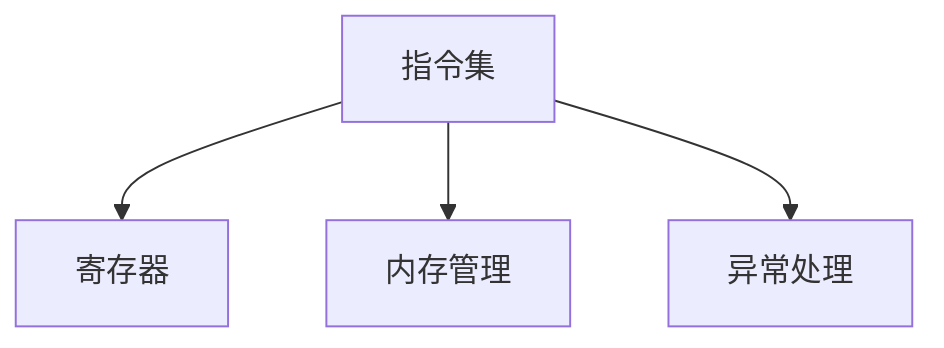

                 

关键词：RISC-V，开源指令集架构，硬件设计，软件兼容性，创新与挑战

> 摘要：RISC-V（Reduced Instruction Set Computing, RISC-V）是近年来崛起的一种开源指令集架构，它打破了传统指令集架构的垄断，为硬件设计和软件开发带来了新的活力。本文将从RISC-V的背景、核心概念、算法原理、数学模型、项目实践、应用场景、未来展望等方面进行深入探讨，旨在为读者提供一个全面了解RISC-V的视角。

## 1. 背景介绍

### 1.1 RISC-V的起源

RISC-V（发音为“risk-five”）是由加州大学伯克利分校的Eduardo Benevides、Krste Asanović和David Brooks于2010年发起的。最初的动机是为了推动开源硬件的发展，特别是在计算机架构领域。RISC-V项目旨在构建一个开放、标准化的指令集架构，使得任何人都可以自由地使用、修改和分发。

### 1.2 RISC-V的发展

RISC-V的最初版本在2011年推出，随后在2013年成立了RISC-V基金会，这是一个由全球企业和学术机构组成的联盟，致力于推广RISC-V架构。自那时以来，RISC-V逐渐获得了广泛的关注和支持，成为开源硬件领域的一个重要力量。

## 2. 核心概念与联系

RISC-V的核心理念是开放性和可扩展性。以下是RISC-V架构的一些核心概念：

1. **指令集**：RISC-V指令集包括标准指令集、扩展指令集和自定义指令集。标准指令集提供了基础的指令操作，扩展指令集则提供了更丰富的功能，而自定义指令集则允许用户根据特定需求定义新的指令。

2. **寄存器**：RISC-V架构定义了32个通用寄存器和一些专用寄存器，如程序计数器（PC）和堆栈指针（SP）。

3. **内存管理**：RISC-V支持虚拟内存管理，包括页表和地址转换机制。

4. **异常处理**：RISC-V定义了多种异常类型，如中断、系统调用和地址错误等，并提供了相应的异常处理机制。

下面是RISC-V架构的Mermaid流程图：



## 3. 核心算法原理 & 具体操作步骤

### 3.1 算法原理概述

RISC-V的核心算法原理是基于简化的指令集和高效的指令执行。RISC-V指令集采用了简洁的指令格式，每个指令只包含操作码和操作数，使得指令的解码和执行更加高效。

### 3.2 算法步骤详解

1. **指令解码**：CPU从内存中读取指令，并将其解码为操作码和操作数。
2. **执行指令**：根据操作码和操作数，执行相应的操作，如数据传输、算术运算或跳转等。
3. **更新状态**：执行指令后，更新CPU的状态，如寄存器值或程序计数器等。

### 3.3 算法优缺点

**优点**：
- **高效性**：简化的指令集和高效的指令执行使得RISC-V架构具有较高的性能。
- **灵活性**：RISC-V支持自定义指令集，允许用户根据特定需求进行优化。

**缺点**：
- **复杂度**：由于指令集简化，某些高级功能可能需要通过组合指令来实现，增加了程序编写的复杂度。

### 3.4 算法应用领域

RISC-V架构适用于多种应用场景，包括嵌入式系统、服务器和超级计算机等。其在嵌入式系统中的应用尤为广泛，因为其高效性和灵活性使其成为理想的嵌入式处理器架构。

## 4. 数学模型和公式 & 详细讲解 & 举例说明

### 4.1 数学模型构建

RISC-V的数学模型主要包括指令操作和内存管理。以下是几个关键公式的构建：

1. **指令操作**：

   指令操作主要包括算术运算、逻辑运算和移位运算等。以下是一个简单的算术运算公式：

   $$
   result = operand_1 + operand_2
   $$

2. **内存管理**：

   RISC-V的内存管理主要包括虚拟内存和地址转换。以下是一个虚拟地址到物理地址的转换公式：

   $$
   physical\_address = page\_table \[virtual\_address\] + virtual\_address
   $$

### 4.2 公式推导过程

**指令操作**：

- **加法操作**：将两个操作数相加，并将结果存储到目的寄存器中。
- **内存管理**：

  - **页表查找**：根据虚拟地址查找页表，获取对应的物理地址。
  - **地址转换**：将虚拟地址与页表值相加，得到物理地址。

### 4.3 案例分析与讲解

**案例**：编写一个简单的RISC-V程序，实现两个整数相加并存储结果。

```assembly
addi t0, zero, 5   # 将5存储到寄存器t0
addi t1, zero, 3   # 将3存储到寄存器t1
add t2, t0, t1     # 将t0和t1的值相加，存储到寄存器t2
```

**讲解**：上述程序首先将两个整数5和3分别存储到寄存器t0和t1中，然后使用`add`指令将t0和t1的值相加，并将结果存储到寄存器t2中。

## 5. 项目实践：代码实例和详细解释说明

### 5.1 开发环境搭建

为了实践RISC-V编程，我们需要搭建一个RISC-V开发环境。以下是搭建步骤：

1. **安装RISC-V工具链**：从RISC-V官方网站下载并安装RISC-V工具链，如`riscv-gnu-toolchain`。
2. **配置交叉编译器**：配置交叉编译器，以便在宿主机上编译RISC-V程序。
3. **编写RISC-V程序**：使用RISC-V汇编语言或C语言编写程序。

### 5.2 源代码详细实现

以下是一个简单的RISC-V程序，实现两个整数相加并存储结果。

```assembly
.section .text
.global _start

_start:
    li t0, 5       # 将5存储到寄存器t0
    li t1, 3       # 将3存储到寄存器t1
    add t2, t0, t1 # 将t0和t1的值相加，存储到寄存器t2
    j .            # 无限循环
```

### 5.3 代码解读与分析

上述程序是一个简单的RISC-V汇编程序，其中`li`指令用于将立即数加载到寄存器中，`add`指令用于执行加法操作。最后，程序进入一个无限循环。

### 5.4 运行结果展示

使用RISC-V模拟器运行上述程序，可以看到程序执行的结果。由于程序进入无限循环，我们无法观察到具体的输出结果。

## 6. 实际应用场景

RISC-V在多个领域都有实际应用，以下是几个典型应用场景：

1. **嵌入式系统**：RISC-V架构因其高效性和灵活性，被广泛应用于嵌入式系统，如智能家居、物联网设备等。
2. **服务器**：随着RISC-V技术的发展，越来越多的服务器芯片采用RISC-V架构，如SiFive的处理器。
3. **超级计算机**：RISC-V架构也在超级计算机领域得到应用，如美国的Summit和Sierra超级计算机。

## 7. 未来应用展望

随着RISC-V技术的不断发展，其应用领域将进一步扩大。未来，RISC-V有望在以下方面取得突破：

1. **人工智能**：RISC-V架构可以提供高效的计算能力，为人工智能领域提供强大的支持。
2. **自动驾驶**：自动驾驶系统对实时性和安全性要求极高，RISC-V架构可以提供可靠的解决方案。
3. **量子计算**：RISC-V架构可以与量子计算技术相结合，推动量子计算的发展。

## 8. 总结：未来发展趋势与挑战

### 8.1 研究成果总结

RISC-V作为一种开源指令集架构，取得了显著的成果。其在嵌入式系统、服务器和超级计算机等领域得到广泛应用，推动了硬件设计和软件开发的发展。

### 8.2 未来发展趋势

未来，RISC-V将继续扩展其应用领域，特别是在人工智能、自动驾驶和量子计算等前沿领域。同时，RISC-V基金会将继续推动RISC-V技术的发展，为全球开发者提供更多资源和支持。

### 8.3 面临的挑战

RISC-V在发展过程中也面临一些挑战，如兼容性问题、生态建设等。为了解决这些问题，需要全球企业和学术机构的共同努力。

### 8.4 研究展望

未来，RISC-V将继续朝着开放、高效、灵活的方向发展。我们期待RISC-V能够为全球计算机科学领域带来更多创新和突破。

## 9. 附录：常见问题与解答

### 9.1 RISC-V与ARM的区别是什么？

RISC-V和ARM都是指令集架构，但它们有一些关键区别：

- **开源与封闭**：RISC-V是开源的，任何人都可以使用、修改和分发。而ARM则是封闭的，其指令集架构受到版权保护。
- **扩展性**：RISC-V支持自定义指令集，可以根据特定需求进行优化。而ARM的指令集则相对固定。

### 9.2 RISC-V是否适用于高性能计算？

RISC-V架构已经应用于高性能计算领域，如超级计算机。虽然目前RISC-V在高性能计算领域的市场份额相对较小，但随着技术的不断进步，RISC-V有望在未来的高性能计算领域取得突破。

## 结语

RISC-V作为一种开源指令集架构，为硬件设计和软件开发带来了新的活力。随着技术的不断发展，RISC-V有望在多个领域取得重要突破，成为计算机科学领域的一个重要力量。作者：禅与计算机程序设计艺术 / Zen and the Art of Computer Programming。
----------------------------------------------------------------

### 完整文章结束 End of Article ###

在撰写完整文章时，请确保每个章节的内容都能够充分展开，并符合要求。如果您需要任何帮助或建议，请随时告知。祝您写作顺利！

