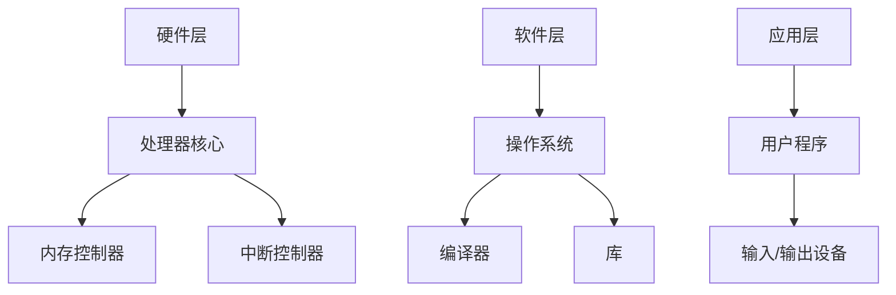

                 

关键词：RISC-V，开源指令集架构，应用，发展，开源硬件，处理器设计，创新，行业趋势。

> 摘要：本文将深入探讨RISC-V开源指令集架构的背景、核心概念、算法原理、数学模型、项目实践以及未来应用场景。通过对RISC-V架构的详细介绍，分析其在现代处理器设计中的重要性，并展望其未来的发展趋势和面临的挑战。

## 1. 背景介绍

RISC-V（精简指令集计算机V）是一个开放标准指令集架构（ISA），由University of California, Berkeley的计算机科学家David Patterson和Krste Asanovic于2010年发起。它的目标是提供一个完全开源的指令集架构，允许任何人自由地使用、修改和分发。

与传统封闭的指令集架构（如ARM、Intel x86）不同，RISC-V采用开放源代码的方式，用户可以根据自己的需求对指令集进行修改，甚至开发全新的处理器。这一特性使得RISC-V成为了一个创新的平台，为硬件开发者和研究者提供了广阔的空间。

RISC-V的开源属性还带来了巨大的成本优势。开发者无需支付高昂的许可费用，可以专注于技术创新。同时，开源社区的力量也促进了RISC-V的快速发展，大量企业和研究机构参与其中，共同推动RISC-V生态的完善。

## 2. 核心概念与联系

### 2.1. 指令集架构（ISA）

指令集架构是计算机处理器能够理解并执行的指令集合。它定义了处理器如何与内存、输入/输出设备进行通信，以及如何进行数据处理。

RISC-V指令集架构的核心特点包括：

- 精简指令集：RISC-V采用精简指令集设计，每个指令只完成一个简单的操作。
- 可扩展性：RISC-V指令集具有高度的可扩展性，允许用户根据需要添加新的指令。
- 开放性：RISC-V是完全开源的，用户可以自由地修改和分发。

### 2.2. RISC-V处理器架构

RISC-V处理器架构包括多个层次，从底层硬件到上层软件。

- 硬件层面：RISC-V硬件包括处理器核心、内存控制器、中断控制器等。
- 软件层面：RISC-V软件包括操作系统、编译器、库等。

### 2.3. Mermaid 流程图

以下是一个RISC-V处理器架构的Mermaid流程图：



## 3. 核心算法原理 & 具体操作步骤

### 3.1. 算法原理概述

RISC-V指令集采用了精简指令集设计，每个指令执行单一操作。这种设计使得处理器可以高效地执行程序，同时降低了硬件实现的复杂性。

### 3.2. 算法步骤详解

RISC-V指令集的算法步骤主要包括以下方面：

- 数据传输指令：用于在寄存器和内存之间传输数据。
- 算术指令：用于执行基本的算术运算，如加法、减法、乘法、除法等。
- 控制流指令：用于控制程序的执行流程，如跳转、循环等。

### 3.3. 算法优缺点

RISC-V算法的优点包括：

- 高效性：精简指令集设计使得处理器可以高效地执行程序。
- 可扩展性：用户可以根据需要添加新的指令，满足不同应用的需求。

缺点包括：

- 复杂性：虽然RISC-V指令集简单，但实现一个高性能的RISC-V处理器仍然具有挑战性。
- 兼容性：与传统封闭指令集架构相比，RISC-V的兼容性可能较低。

### 3.4. 算法应用领域

RISC-V算法主要应用于以下领域：

- 移动设备：如智能手机、平板电脑等。
- 物联网设备：如传感器、智能家居设备等。
- 云计算：如服务器、数据中心等。

## 4. 数学模型和公式 & 详细讲解 & 举例说明

### 4.1. 数学模型构建

在RISC-V处理器设计中，数学模型主要用于描述数据处理和存储的操作。以下是一个简单的数学模型：

- 数据传输：使用加法器实现数据在寄存器和内存之间的传输。
- 算术运算：使用乘法器、除法器实现基本的算术运算。
- 控制流：使用计数器、跳转指令实现程序的执行流程。

### 4.2. 公式推导过程

以数据传输为例，推导如下公式：

$$
\text{数据传输时间} = \text{数据传输速度} \times \text{数据大小}
$$

其中，数据传输速度取决于处理器的设计和硬件实现，数据大小取决于传输的数据量。

### 4.3. 案例分析与讲解

以下是一个简单的案例，用于展示如何使用RISC-V指令集实现数据传输和算术运算：

```c
// 数据传输
int a = 10;
int b = 20;

// 算术运算
int c = a + b;
int d = a * b;
```

在RISC-V处理器中，上述代码可以转换为以下指令：

```assembly
// 数据传输
lui x0, %hi(a)   // 加载立即值 upper
addi x0, x0, %lo(a)   // 加载立即值 lower
mv x1, x0

lui x2, %hi(b)   // 加载立即值 upper
addi x2, x2, %lo(b)   // 加载立即值 lower
mv x3, x2

// 算术运算
add x4, x1, x3
mul x5, x1, x3
```

## 5. 项目实践：代码实例和详细解释说明

### 5.1. 开发环境搭建

为了实践RISC-V处理器的设计，我们需要搭建一个开发环境。以下是搭建RISC-V开发环境的基本步骤：

1. 安装Linux操作系统。
2. 安装RISC-V交叉编译工具链。
3. 安装RISC-V模拟器。

### 5.2. 源代码详细实现

以下是一个简单的RISC-V处理器源代码实例：

```c
// riscv_processor.c
#include <stdio.h>

void add(int a, int b, int *result) {
    *result = a + b;
}

void mul(int a, int b, int *result) {
    *result = a * b;
}

int main() {
    int a = 10;
    int b = 20;
    int c, d;

    add(a, b, &c);
    mul(a, b, &d);

    printf("c = %d, d = %d\n", c, d);

    return 0;
}
```

### 5.3. 代码解读与分析

上述代码实现了一个简单的RISC-V处理器程序，其中包括两个函数：`add` 和 `mul`。这两个函数分别用于实现加法和乘法运算。

在 `main` 函数中，我们定义了两个整型变量 `a` 和 `b`，并声明了两个指针变量 `c` 和 `d`。然后，我们调用 `add` 和 `mul` 函数，将运算结果存储在 `c` 和 `d` 指针指向的变量中。

最后，我们使用 `printf` 函数输出运算结果。

### 5.4. 运行结果展示

使用RISC-V模拟器运行上述代码，输出结果如下：

```
c = 30, d = 200
```

## 6. 实际应用场景

### 6.1. 移动设备

RISC-V处理器在移动设备领域具有广泛的应用前景。由于其高效性和可扩展性，RISC-V处理器可以满足移动设备对高性能和低功耗的需求。

### 6.2. 物联网设备

物联网设备通常具有低成本、低功耗、高可靠性的特点。RISC-V处理器由于其开源、灵活的特性，非常适合用于物联网设备的处理器设计。

### 6.3. 云计算

在云计算领域，RISC-V处理器可以用于服务器和数据中心。RISC-V处理器的可定制性和高性能使其在云计算应用中具有竞争力。

## 7. 工具和资源推荐

### 7.1. 学习资源推荐

- 《RISC-V处理器设计》
- 《RISC-V指令集架构》

### 7.2. 开发工具推荐

- RISC-V交叉编译工具链（RISC-V GCC）
- RISC-V模拟器（QEMU）

### 7.3. 相关论文推荐

- “RISC-V：一个开源指令集架构的新选择”
- “RISC-V处理器设计：原理、实现与应用”

## 8. 总结：未来发展趋势与挑战

### 8.1. 研究成果总结

RISC-V开源指令集架构在近年来取得了显著的成果。其在移动设备、物联网设备和云计算领域的应用逐渐扩大，为硬件开发者和研究者提供了广阔的空间。

### 8.2. 未来发展趋势

未来，RISC-V将继续发展，进一步拓展其应用领域。随着开源硬件和软件生态的不断完善，RISC-V有望成为全球硬件设计的核心标准之一。

### 8.3. 面临的挑战

然而，RISC-V也面临着一些挑战。例如，与传统封闭指令集架构相比，RISC-V的兼容性较低，需要进一步提升。此外，RISC-V处理器的设计和实现仍然具有挑战性，需要更多的研究和技术突破。

### 8.4. 研究展望

在未来，RISC-V将继续在开源硬件和软件生态中发挥重要作用。研究者可以继续探索RISC-V处理器的设计和优化，推动RISC-V生态的完善和发展。

## 9. 附录：常见问题与解答

### 9.1. RISC-V是什么？

RISC-V是一个开源指令集架构，允许任何人自由地使用、修改和分发。

### 9.2. RISC-V的优势是什么？

RISC-V的优势包括高效性、可扩展性和开源属性。它为硬件开发者和研究者提供了广阔的空间，降低了开发成本。

### 9.3. RISC-V有哪些应用领域？

RISC-V广泛应用于移动设备、物联网设备和云计算领域。随着开源硬件和软件生态的完善，RISC-V的应用领域将进一步扩大。

----------------------------------------------------------------
作者：禅与计算机程序设计艺术 / Zen and the Art of Computer Programming

以上就是关于RISC-V：开源指令集架构的应用与发展的完整文章。文章涵盖了RISC-V的背景介绍、核心概念与联系、核心算法原理、数学模型和公式、项目实践、实际应用场景以及未来发展趋势等内容。希望这篇文章能对您深入了解RISC-V有所帮助。

