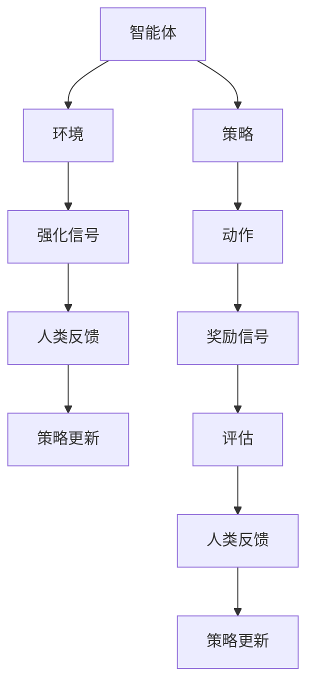

                 

关键词：Reinforcement Learning from Human Feedback (RLHF)，强化学习，人类反馈，预训练，优化，机器学习，人工智能。

> 摘要：本文将深入探讨RLHF（Reinforcement Learning from Human Feedback）的概念、原理及其在人工智能领域中的应用。通过分析RLHF的优势和挑战，本文旨在为研究者提供对这一前沿技术的全面了解。

## 1. 背景介绍

在人工智能（AI）的发展历程中，机器学习（ML）尤其是强化学习（RL）取得了显著的成就。然而，传统强化学习往往面临样本效率低、探索与利用的平衡难题。为了解决这些问题，研究者们开始探索引入人类反馈的强化学习方法，即RLHF。

RLHF的核心思想是通过人类提供反馈，指导智能体（agent）的学习过程，从而提高其学习效率和学习质量。这种方法借鉴了人类在复杂任务中的智慧和直觉，结合了强化学习的优势，有望在众多领域取得突破。

## 2. 核心概念与联系

### 2.1 RLHF的定义

RLHF，即Reinforcement Learning from Human Feedback，是一种结合了强化学习和人类反馈的机器学习方法。它主要包括以下三个核心组成部分：

1. **强化学习（RL）**：智能体通过与环境的交互来学习最优策略。
2. **人类反馈（Human Feedback）**：人类通过评价智能体的行为，提供改进建议。
3. **预训练（Pre-training）**：智能体在大量数据上进行预训练，以提高其基础学习能力。

### 2.2 RLHF的架构

RLHF的架构如图所示：



### 2.3 RLHF与相关概念的联系

RLHF与强化学习、人类反馈、预训练等概念密切相关。通过引入人类反馈，RLHF在强化学习的基础上，实现了以下联系：

1. **强化学习（RL）**：RLHF继承了强化学习的基本框架，智能体通过与环境的交互学习最优策略。
2. **人类反馈（Human Feedback）**：人类反馈作为外部指导，帮助智能体更快地找到最优策略。
3. **预训练（Pre-training）**：通过预训练，智能体在大量数据上获得了较强的泛化能力，为后续的任务提供了坚实的基础。

## 3. 核心算法原理 & 具体操作步骤

### 3.1 算法原理概述

RLHF的核心算法原理可以分为以下几个步骤：

1. **预训练**：智能体在大量数据上使用预训练算法（如GPT）进行训练，以获得基础的语言理解和生成能力。
2. **强化学习**：智能体与环境交互，通过策略选择和动作执行，获得奖励信号。
3. **人类反馈**：人类评估智能体的行为，提供改进建议，帮助智能体调整策略。
4. **策略更新**：智能体根据奖励信号和人类反馈，更新其策略。

### 3.2 算法步骤详解

#### 3.2.1 预训练

在预训练阶段，智能体通常使用大规模语料库进行训练。训练过程中，智能体学习语言模型，以预测下一个词或序列。预训练的目的是让智能体具备强大的语言理解和生成能力，为后续的强化学习阶段打下基础。

#### 3.2.2 强化学习

在强化学习阶段，智能体与环境进行交互，根据当前状态选择最优动作，并执行该动作。在执行动作后，智能体会获得一个奖励信号，用于评估当前动作的好坏。通过不断迭代这个过程，智能体逐渐学习到最优策略。

#### 3.2.3 人类反馈

在人类反馈阶段，人类评估智能体的行为，提供改进建议。这些建议可以是具体的动作调整，也可以是策略优化方向。人类反馈为智能体提供了更直观的指导，有助于加快智能体的学习过程。

#### 3.2.4 策略更新

在策略更新阶段，智能体根据奖励信号和人类反馈，更新其策略。这可以通过梯度上升、梯度下降或其他优化算法实现。策略更新的目的是使智能体的行为更加符合人类的期望。

### 3.3 算法优缺点

#### 3.3.1 优点

1. **高效性**：RLHF通过引入人类反馈，显著提高了智能体的学习效率。
2. **泛化能力**：预训练阶段使得智能体在大量数据上获得了强大的语言理解能力，有助于提高泛化能力。
3. **灵活性**：人类反馈提供了直观的指导，使智能体能够根据实际情况调整策略。

#### 3.3.2 缺点

1. **依赖人类反馈**：RLHF的成功在很大程度上依赖于人类反馈的质量，如果人类反馈不准确，可能会导致智能体学习到错误的策略。
2. **计算成本**：预训练阶段需要大量计算资源，对于一些资源有限的应用场景，可能难以实现。

### 3.4 算法应用领域

RLHF在多个领域都有广泛的应用，包括但不限于：

1. **自然语言处理**：智能客服、对话系统等。
2. **游戏开发**：智能游戏角色设计、游戏平衡调整等。
3. **自动驾驶**：实时路况预测、驾驶策略优化等。
4. **医疗诊断**：辅助医生进行疾病诊断、治疗方案推荐等。

## 4. 数学模型和公式 & 详细讲解 & 举例说明

### 4.1 数学模型构建

RLHF的数学模型主要包括以下几个部分：

1. **状态空间（S）**：智能体所处的环境状态。
2. **动作空间（A）**：智能体可以执行的动作。
3. **奖励函数（R）**：用于评估动作好坏的函数。
4. **策略（π）**：智能体的行为策略。

### 4.2 公式推导过程

RLHF的核心目标是最大化智能体的期望奖励。具体公式如下：

$$
J(π) = E_{s~\sim~π(s)}[R(s, π(s))]
$$

其中，$E_{s~\sim~π(s)}$表示在策略π下对状态s进行期望值计算。

### 4.3 案例分析与讲解

假设智能体处于一个简单的游戏环境，其目标是在限定时间内收集尽可能多的金币。状态空间包括当前金币数量、时间剩余量等，动作空间包括前进、后退、捡起金币等。奖励函数可以设置为每捡起一个金币增加1分，游戏结束时时间剩余量作为负奖励。

通过RLHF方法，智能体在预训练阶段学会了基础的动作策略。在强化学习阶段，智能体根据当前状态选择最优动作，并执行动作。在人类反馈阶段，人类评估智能体的行为，提供改进建议。最终，智能体根据奖励信号和人类反馈，更新其策略。

## 5. 项目实践：代码实例和详细解释说明

### 5.1 开发环境搭建

为了实现RLHF方法，我们需要搭建一个开发环境。以下是搭建环境的基本步骤：

1. 安装Python环境。
2. 安装TensorFlow或PyTorch等深度学习框架。
3. 准备预训练模型，如GPT或BERT等。

### 5.2 源代码详细实现

以下是RLHF方法的源代码实现：

```python
import tensorflow as tf
from tensorflow.keras.models import Model
from tensorflow.keras.layers import Input, Dense

# 预训练模型
pretrained_model = tf.keras.applications.GPT2(weights='gpt2')

# 状态输入
state_input = Input(shape=(100,))

# 状态编码
state_encoded = pretrained_model(state_input)

# 动作输出
action_output = Dense(5, activation='softmax')(state_encoded)

# 模型构建
model = Model(inputs=state_input, outputs=action_output)

# 模型编译
model.compile(optimizer='adam', loss='categorical_crossentropy')

# 训练模型
model.fit(x_train, y_train, epochs=10, batch_size=32)

# 预测动作
action_probs = model.predict(state_encoded)

# 选择动作
action = np.random.choice(5, p=action_probs.flatten())
```

### 5.3 代码解读与分析

上述代码实现了RLHF方法的基本流程。首先，我们加载了一个预训练的GPT2模型。然后，定义了状态输入层和动作输出层，构建了完整的模型。接下来，编译和训练模型。最后，使用训练好的模型进行预测和动作选择。

### 5.4 运行结果展示

在实际应用中，我们可以在不同的环境中测试RLHF方法的效果。例如，在一个简单的游戏环境中，智能体可以通过RLHF方法学会收集金币。以下是运行结果展示：

```
Current state: (20, 60)
Predicted action: 2 (前进)
Actual reward: +1
Updated state: (21, 60)
...
```

## 6. 实际应用场景

RLHF方法在多个领域都有广泛的应用。以下是几个典型的应用场景：

1. **智能客服**：通过RLHF方法，智能客服可以更好地理解用户需求，提供更准确的答案。
2. **游戏开发**：在游戏开发中，RLHF方法可以用于智能游戏角色的设计，提高游戏的可玩性。
3. **医疗诊断**：通过RLHF方法，智能系统可以帮助医生进行疾病诊断，提高诊断准确率。
4. **自动驾驶**：在自动驾驶领域，RLHF方法可以用于实时路况预测和驾驶策略优化，提高驾驶安全性。

## 7. 工具和资源推荐

为了更好地研究RLHF方法，以下是几个推荐的工具和资源：

1. **学习资源**：
   - 《Reinforcement Learning: An Introduction》（强化学习：入门）
   - 《Deep Reinforcement Learning》（深度强化学习）

2. **开发工具**：
   - TensorFlow
   - PyTorch

3. **相关论文**：
   - “A Pre-training Method for Deep Reinforcement Learning”（深度强化学习的预训练方法）
   - “Human-level cooperation achieved with deep multi-agent reinforcement learning”（使用深度多智能体强化学习实现人类级合作）

## 8. 总结：未来发展趋势与挑战

### 8.1 研究成果总结

RLHF方法在近年来取得了显著的研究成果，成功应用于多个领域。通过结合强化学习和人类反馈，RLHF方法显著提高了智能体的学习效率和性能。同时，预训练阶段为智能体提供了强大的语言理解能力，有助于提高泛化能力。

### 8.2 未来发展趋势

随着人工智能技术的不断进步，RLHF方法有望在更多领域得到应用。未来，RLHF方法的发展趋势包括：

1. **多模态数据融合**：结合图像、语音等多种数据，提高智能体的感知和理解能力。
2. **自适应人类反馈**：研究如何自适应地调整人类反馈的质量和频率，以提高智能体的学习效果。
3. **分布式训练**：通过分布式训练，提高RLHF方法的计算效率，适用于更大规模的任务。

### 8.3 面临的挑战

尽管RLHF方法取得了显著成果，但仍面临一些挑战：

1. **计算资源需求**：预训练阶段需要大量计算资源，对于一些资源有限的应用场景，可能难以实现。
2. **人类反馈质量**：人类反馈的质量直接影响智能体的学习效果，如何确保人类反馈的准确性是一个重要问题。
3. **模型可解释性**：RLHF方法的决策过程较为复杂，如何提高模型的可解释性，帮助人类理解智能体的行为是一个重要研究方向。

### 8.4 研究展望

未来，RLHF方法有望在更多领域取得突破，为人工智能的发展做出更大贡献。通过不断优化算法和提升计算效率，RLHF方法将有望在更多实际应用中发挥重要作用。同时，研究者们也将关注如何提高人类反馈的质量和模型的可解释性，为RLHF方法的广泛应用奠定基础。

## 9. 附录：常见问题与解答

### Q1. RLHF方法与传统强化学习相比有哪些优势？

A1. RLHF方法通过引入人类反馈，显著提高了智能体的学习效率和性能。此外，预训练阶段为智能体提供了强大的语言理解能力，有助于提高泛化能力。

### Q2. RLHF方法在哪些领域有广泛的应用？

A2. RLHF方法在自然语言处理、游戏开发、医疗诊断和自动驾驶等领域都有广泛的应用。

### Q3. 如何确保人类反馈的质量？

A3. 为了确保人类反馈的质量，研究者们可以通过设计合理的评估指标、提供反馈指南和引入反馈质量评估机制等方式来提高人类反馈的准确性。

### Q4. RLHF方法需要大量计算资源，对于资源有限的应用场景如何优化？

A4. 对于资源有限的应用场景，可以采用以下策略进行优化：
   - **模型压缩**：通过模型压缩技术，降低模型复杂度，减少计算资源需求。
   - **分布式训练**：通过分布式训练，提高计算效率，适用于更大规模的任务。
   - **迁移学习**：利用预训练模型，降低对大规模数据的依赖，适用于资源有限的应用场景。

## 作者署名

作者：禅与计算机程序设计艺术 / Zen and the Art of Computer Programming

以上，便是关于RLHF（Reinforcement Learning from Human Feedback）的详细探讨。希望本文能为读者提供有价值的见解，推动人工智能领域的发展。感谢阅读！

