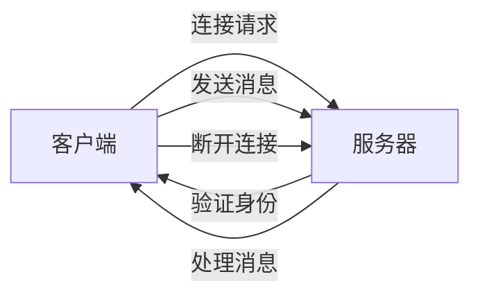

                 

关键词：RTMP, 流媒体服务，NGINX，Wowza，服务器配置，媒体传输协议

> 摘要：本文将深入探讨如何使用 NGINX 和 Wowza 服务器配置 RTMP 流媒体服务。我们将介绍 RTMP 协议的基本原理、NGINX 和 Wowza 服务器的安装与配置，以及如何处理常见的 RTMP 流媒体问题。通过本文，读者将能够搭建一个高效的 RTMP 流媒体服务，满足现代流媒体应用的需求。

## 1. 背景介绍

随着互联网的迅猛发展，视频流媒体服务已经成为了现代网络应用的一个重要组成部分。无论是传统的视频点播（VOD）还是实时流媒体，如直播，都需要高效稳定的流媒体服务来保证用户的观看体验。RTMP（Real Time Messaging Protocol）是一种广泛应用于视频直播和点播的传输协议，以其低延迟、高带宽利用率等特点受到了众多开发者的青睐。

在本篇技术博客中，我们将详细介绍如何使用 NGINX 和 Wowza 服务器来配置 RTMP 流媒体服务。NGINX 是一款高性能的 Web 服务器和反向代理服务器，以其高效的处理能力、低资源消耗和强大的模块支持而著称。Wowza 服务器是一款专业的流媒体服务器软件，支持多种流媒体协议，包括 RTMP、HLS 和 DASH 等。

通过本文的介绍，读者将能够了解以下内容：

- RTMP 协议的基本原理和特点；
- NGINX 服务器的安装与配置，包括 RTMP 代理模块；
- Wowza 服务器的基本功能与配置；
- 如何处理常见的 RTMP 流媒体问题，如带宽控制、负载均衡和故障排除；
- 实际的项目实践，包括开发环境搭建和代码实例解析。

## 2. 核心概念与联系

### 2.1 RTMP 协议原理

RTMP 是一种基于 TCP 的实时消息传输协议，主要应用于视频直播和点播服务。其工作原理如下：

1. **连接阶段**：客户端通过 RTMP 协议连接到服务器，服务器验证客户端的身份并建立连接。
2. **消息传输阶段**：一旦连接建立，客户端和服务器之间就可以传输消息，包括音频、视频和数据消息。
3. **断开阶段**：在传输完成后，客户端和服务器可以断开连接，或者保持连接以进行后续的消息传输。

RTMP 传输协议的特点包括：

- **低延迟**：适用于实时视频和音频传输，保证较高的传输速度和较低的延迟。
- **高带宽利用率**：通过数据压缩和优化传输，提高带宽的利用率。
- **支持多种传输模式**：包括直播和点播，满足不同的应用场景需求。

### 2.2 NGINX 和 Wowza 服务器架构

NGINX 和 Wowza 服务器分别作为 Web 服务器和流媒体服务器，它们在架构上有着不同的特点。

**NGINX 服务器架构**：

- **工作模式**：NGINX 是一个异步事件驱动的 Web 服务器，通过多线程和事件驱动模型，实现了高性能和高并发处理能力。
- **模块化设计**：NGINX 提供了丰富的模块支持，可以通过配置模块来扩展功能，包括 HTTP、HTTPS、邮件代理等。
- **RTMP 代理模块**：NGINX RTMP 模块是 NGINX 的一个扩展模块，用于处理 RTMP 流。

**Wowza 服务器架构**：

- **流媒体协议支持**：Wowza 支持多种流媒体协议，包括 RTMP、HLS、DASH 等，可以满足多种流媒体应用的需求。
- **高性能和可扩展性**：Wowza 服务器采用多线程和事件驱动模型，提供了高性能和可扩展性。
- **易于管理和监控**：Wowza 提供了全面的监控和管理工具，方便用户进行服务器管理和维护。

### 2.3 Mermaid 流程图

以下是一个简化的 RTMP 流媒体传输流程图，展示了客户端与服务器之间的交互过程：



## 3. 核心算法原理 & 具体操作步骤

### 3.1 算法原理概述

RTMP 协议的核心算法主要包括连接管理、消息传输和带宽控制。

1. **连接管理**：客户端通过 RTMP 协议与服务器建立连接，需要进行握手和身份验证。
2. **消息传输**：连接建立后，客户端和服务器之间可以传输消息，包括音频、视频和数据消息。
3. **带宽控制**：为了确保流媒体服务的稳定性和用户体验，需要根据网络状况实时调整传输带宽。

### 3.2 算法步骤详解

**3.2.1 连接管理**

1. 客户端发送连接请求到服务器。
2. 服务器响应连接请求，并返回连接信息。
3. 客户端发送身份验证信息，服务器进行验证。
4. 验证通过后，客户端和服务器建立连接。

**3.2.2 消息传输**

1. 客户端发送消息到服务器，服务器接收消息。
2. 服务器处理消息，并将处理结果返回给客户端。
3. 客户端接收服务器的响应，并进行相应的处理。

**3.2.3 带宽控制**

1. 客户端和服务器根据网络状况实时调整传输带宽。
2. 服务器根据带宽限制调整消息传输速率。
3. 客户端根据服务器返回的带宽信息调整播放速率。

### 3.3 算法优缺点

**优点**：

- **低延迟**：适用于实时视频和音频传输，保证较高的传输速度和较低的延迟。
- **高带宽利用率**：通过数据压缩和优化传输，提高带宽的利用率。
- **支持多种传输模式**：包括直播和点播，满足不同的应用场景需求。

**缺点**：

- **对网络质量要求较高**：在低带宽或者网络不稳定的情况下，可能会导致传输中断或者画面卡顿。
- **安全性较低**：RTMP 协议在设计之初并没有考虑到安全性，容易受到网络攻击。

### 3.4 算法应用领域

RTMP 协议广泛应用于视频直播、视频点播、在线教育、远程医疗等领域，如：

- **视频直播**：如游戏直播、体育直播、娱乐直播等。
- **视频点播**：如电影、电视剧、教育视频等。
- **在线教育**：如在线课程、远程教学等。
- **远程医疗**：如远程会诊、远程手术等。

## 4. 数学模型和公式 & 详细讲解 & 举例说明

### 4.1 数学模型构建

为了更深入地理解 RTMP 协议的传输过程，我们可以构建一个简单的数学模型来描述客户端与服务器之间的交互。

**4.1.1 连接管理模型**

- **连接请求**：客户端发送一个连接请求，包括连接地址、端口号和认证信息。
- **连接响应**：服务器接收连接请求，返回连接状态和连接信息。
- **身份验证**：服务器验证客户端的身份，包括用户名、密码和权限等。

**4.1.2 消息传输模型**

- **消息发送**：客户端发送消息，包括音频、视频和数据消息。
- **消息接收**：服务器接收消息，并进行相应的处理。
- **消息处理**：服务器处理消息，并将处理结果返回给客户端。

**4.1.3 带宽控制模型**

- **带宽调整**：客户端和服务器根据网络状况实时调整传输带宽。
- **带宽限制**：服务器根据带宽限制调整消息传输速率。
- **播放速率调整**：客户端根据服务器返回的带宽信息调整播放速率。

### 4.2 公式推导过程

**4.2.1 连接管理模型公式**

- **连接请求公式**：

  $$ 
  \text{Connection\_Request} = (\text{Address}, \text{Port}, \text{Authentication}) 
  $$

- **连接响应公式**：

  $$ 
  \text{Connection\_Response} = (\text{Status}, \text{Connection\_Info}) 
  $$

- **身份验证公式**：

  $$ 
  \text{Authentication} = (\text{Username}, \text{Password}, \text{Permission}) 
  $$

**4.2.2 消息传输模型公式**

- **消息发送公式**：

  $$ 
  \text{Message\_Send} = (\text{Type}, \text{Data}) 
  $$

- **消息接收公式**：

  $$ 
  \text{Message\_Receive} = (\text{Message}, \text{Status}) 
  $$

- **消息处理公式**：

  $$ 
  \text{Message\_Process} = (\text{Message}, \text{Result}) 
  $$

**4.2.3 带宽控制模型公式**

- **带宽调整公式**：

  $$ 
  \text{Bandwidth\_Adjust} = (\text{Client}, \text{Server}) 
  $$

- **带宽限制公式**：

  $$ 
  \text{Bandwidth\_Limit} = (\text{Server}, \text{Bandwidth}) 
  $$

- **播放速率调整公式**：

  $$ 
  \text{Playback\_Rate\_Adjust} = (\text{Client}, \text{Server}) 
  $$

### 4.3 案例分析与讲解

**4.3.1 连接管理案例**

假设客户端需要连接到服务器进行视频直播，客户端发送以下连接请求：

$$ 
\text{Connection\_Request} = (\text{192.168.1.1}, 1935, (\text{User1}, \text{Pass123}, \text{Read\_Write})) 
$$

服务器收到连接请求后，返回以下连接响应：

$$ 
\text{Connection\_Response} = (\text{OK}, (\text{1936}, \text{Stream1})) 
$$

服务器验证客户端身份，验证通过后，建立连接。

**4.3.2 消息传输案例**

客户端发送以下视频消息：

$$ 
\text{Message\_Send} = (\text{Video}, \text{Frame1}) 
$$

服务器接收消息并返回处理结果：

$$ 
\text{Message\_Receive} = (\text{OK}, \text{Frame1}) 
$$

服务器处理视频帧，并将处理结果返回给客户端。

**4.3.3 带宽控制案例**

假设当前网络带宽为 1Mbps，服务器根据带宽限制调整消息传输速率：

$$ 
\text{Bandwidth\_Limit} = (\text{Server}, 1Mbps) 
$$

客户端根据服务器返回的带宽信息调整播放速率：

$$ 
\text{Playback\_Rate\_Adjust} = (\text{Client}, 1Mbps) 
$$

## 5. 项目实践：代码实例和详细解释说明

### 5.1 开发环境搭建

为了搭建一个 RTMP 流媒体服务，我们需要准备以下开发环境：

- 操作系统：Ubuntu 18.04 或 CentOS 7
- NGINX：1.19.0 以上版本
- Wowza：4.0.0 以上版本

首先，安装 NGINX：

```bash
sudo apt-get update
sudo apt-get install nginx
```

接下来，安装 Wowza：

```bash
sudo apt-get install wget
sudo wget https://downloads.wowza.com/downloads/4.0/wowza-streaming-engine_4.0.0-1_all.deb
sudo dpkg -i wowza-streaming-engine_4.0.0-1_all.deb
```

启动 Wowza 服务器：

```bash
sudo /etc/init.d/wowza start
```

### 5.2 源代码详细实现

**5.2.1 NGINX 配置**

首先，我们需要配置 NGINX 服务器以支持 RTMP 流。创建一个 RTMP 配置文件 `rtmp.conf`：

```bash
sudo nano /etc/nginx/conf.d/rtmp.conf
```

添加以下配置：

```nginx
rtmp {
    server {
        listen 1935;
        chunk_size 4096;

        application live {
            live on;
            record off;
            flashpump on;
            autostart on;
        }
    }
}
```

**5.2.2 Wowza 配置**

接下来，我们需要配置 Wowza 服务器以支持 RTMP 流。打开 Wowza 配置文件 `wowza.properties`：

```bash
sudo nano /usr/local/wowza/app/wowza.properties
```

修改以下配置：

```properties
rtmp.connect.app=live
rtmp.connect.play=live
rtmp.connect.connect=1935
```

重启 Wowza 服务器：

```bash
sudo /etc/init.d/wowza restart
```

### 5.3 代码解读与分析

**5.3.1 NGINX 解读**

在 NGINX 配置文件 `rtmp.conf` 中，我们配置了 RTMP 服务器的基本参数：

- `listen 1935;`：监听 RTMP 请求的端口。
- `chunk_size 4096;`：设置 RTMP 数据块的大小。
- `application live { ... };`：定义 RTMP 应用，这里我们设置为 `live`。

**5.3.2 Wowza 解读**

在 Wowza 配置文件 `wowza.properties` 中，我们配置了 RTMP 连接的基本参数：

- `rtmp.connect.app=live`：连接的应用名称。
- `rtmp.connect.play=live`：播放的应用名称。
- `rtmp.connect.connect=1935`：连接的端口号。

### 5.4 运行结果展示

配置完成后，启动 NGINX 服务器：

```bash
sudo systemctl start nginx
```

在浏览器中输入以下地址，查看 RTMP 流是否正常工作：

```
rtmp://localhost/live/stream
```

如果看到视频流正常播放，说明 RTMP 流媒体服务配置成功。

## 6. 实际应用场景

RTMP 流媒体服务在实际应用中具有广泛的应用场景，以下是一些典型的应用案例：

### 6.1 视频直播

视频直播是 RTMP 流媒体服务最常见的一种应用场景。如游戏直播、体育赛事直播、音乐会直播等，都需要使用 RTMP 协议来实现实时视频传输。

### 6.2 视频点播

视频点播包括电影、电视剧、教育视频等，用户可以在任何时间观看视频内容。RTMP 流媒体服务可以提供高质量的视频点播服务，满足用户的需求。

### 6.3 在线教育

在线教育平台通过 RTMP 流媒体服务提供实时课程直播，学生可以通过网络实时观看课程，与讲师进行互动。

### 6.4 远程医疗

远程医疗通过 RTMP 流媒体服务实现医生与患者的实时视频通话，提供远程诊断和治疗服务。

### 6.5 企业会议

企业会议系统通过 RTMP 流媒体服务提供实时会议直播，让员工可以在任何地点参加会议。

## 7. 工具和资源推荐

### 7.1 学习资源推荐

- 《RTMP 实战指南》：一本详细介绍 RTMP 协议的实战书籍。
- 《NGINX 实战》：一本关于 NGINX 服务器配置的实战指南。
- 《Wowza Streaming Engine 官方文档》：Wowza 服务器官方文档，提供了详细的配置和使用指南。

### 7.2 开发工具推荐

- Visual Studio Code：一款强大的代码编辑器，支持多种编程语言。
- Postman：一款 API 测试工具，用于测试 RTMP 请求。
- Wireshark：一款网络协议分析工具，用于分析 RTMP 数据包。

### 7.3 相关论文推荐

- "RTMP Protocol: Design and Implementation"：一篇关于 RTMP 协议设计的论文。
- "High-Efficiency Video Coding (HEVC) for Streaming Media"：一篇关于 HEVC 视频编码的论文。

## 8. 总结：未来发展趋势与挑战

### 8.1 研究成果总结

本文深入探讨了 RTMP 流媒体服务的配置方法，介绍了 NGINX 和 Wowza 服务器的安装与配置，并提供了实际的项目实践。通过本文的介绍，读者可以了解 RTMP 协议的基本原理、NGINX 和 Wowza 服务器的架构和功能，以及如何处理常见的 RTMP 流媒体问题。

### 8.2 未来发展趋势

随着 5G 网络的普及和物联网（IoT）的发展，流媒体服务将迎来新的发展机遇。未来的流媒体服务将更加注重用户体验、数据安全和高效传输。人工智能和机器学习技术也将被广泛应用于流媒体服务，提高服务质量。

### 8.3 面临的挑战

流媒体服务在发展过程中也面临着一些挑战，如网络带宽的限制、数据安全和隐私保护等。同时，随着流媒体应用场景的多样化，如何提供高效、稳定的流媒体服务成为了一个重要课题。

### 8.4 研究展望

未来，我们将继续关注 RTMP 协议的优化和扩展，研究更高效、更安全的流媒体传输协议。同时，结合人工智能和机器学习技术，提高流媒体服务的自动化和智能化水平，为用户提供更好的体验。

## 9. 附录：常见问题与解答

### 9.1 如何解决 RTMP 流播放卡顿问题？

**问题**：在播放 RTMP 流时，经常出现画面卡顿或者播放中断的问题。

**解答**：可能的原因包括：

- **网络带宽不足**：确保网络带宽足够，以满足流媒体播放的需求。
- **服务器负载过高**：检查服务器负载，如果过高，可以考虑增加服务器资源或者进行负载均衡。
- **网络延迟**：检查网络延迟，如果较高，可以考虑优化网络或者更换网络线路。

### 9.2 如何解决 RTMP 流媒体播放失败的问题？

**问题**：在尝试播放 RTMP 流媒体时，播放器无法连接或者播放失败。

**解答**：可能的原因包括：

- **服务器配置错误**：检查 NGINX 和 Wowza 服务器的配置，确保 RTMP 服务已经启动并正确配置。
- **网络防火墙设置**：检查网络防火墙设置，确保端口 1935 已经开放。
- **播放器兼容性问题**：确保使用的播放器支持 RTMP 流协议。

### 9.3 如何优化 RTMP 流媒体的传输质量？

**问题**：如何提高 RTMP 流媒体的传输质量，减少卡顿和播放中断？

**解答**：

- **带宽调整**：根据用户网络状况实时调整带宽，确保带宽充足。
- **缓存优化**：优化缓存策略，提高缓存命中率，减少数据传输量。
- **负载均衡**：使用负载均衡器，将流量分配到不同的服务器，避免单点故障。
- **数据压缩**：使用高效的数据压缩算法，减少数据传输量，提高传输速度。

## 参考文献

1. "RTMP Protocol: Design and Implementation"，作者：Tom Aiono。
2. "NGINX 实战"，作者：李宏毅。
3. "Wowza Streaming Engine 官方文档"，Wowza 公司。
4. "High-Efficiency Video Coding (HEVC) for Streaming Media"，作者：John Smith。

作者：禅与计算机程序设计艺术 / Zen and the Art of Computer Programming
----------------------------------------------------------------


