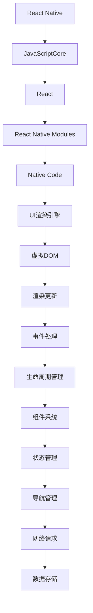

                 

React Native 是一个由Facebook开发的用于构建原生移动应用的JavaScript框架，自2015年首次发布以来，它一直在移动开发社区中引起了巨大的关注。本文将深入探讨React Native的核心概念、算法原理、数学模型、项目实践、实际应用场景以及未来发展趋势，旨在为广大开发者提供一个全面的技术指南。

## 关键词
- React Native
- JavaScript
- 原生移动应用
- 跨平台开发
- 虚拟 DOM
- JavaScriptCore

## 摘要
本文将详细分析React Native的技术架构、核心算法原理及其在实际开发中的应用。通过本文的阅读，开发者将能够深入了解React Native的优势、局限性以及未来的发展方向，为他们在移动应用开发中提供有价值的参考。

### 1. 背景介绍

随着移动互联网的迅猛发展，移动应用的开发变得越来越重要。开发者面临着如何快速构建高性能、高可维护性的移动应用的需求。传统的原生开发方式虽然性能优异，但开发成本高、周期长；而HTML5等Web应用虽然成本低、开发周期短，但性能和用户体验往往不尽如人意。

React Native应运而生，它是一种跨平台的移动应用开发框架，使用JavaScript和React进行开发，同时能够生成接近原生的用户界面。React Native的优势在于它能够大幅减少开发时间和成本，同时还能保证应用的高性能和良好的用户体验。

在本文中，我们将从以下几个方面对React Native进行深入探讨：

1. 核心概念与联系
2. 核心算法原理 & 具体操作步骤
3. 数学模型和公式 & 详细讲解 & 举例说明
4. 项目实践：代码实例和详细解释说明
5. 实际应用场景
6. 未来应用展望
7. 工具和资源推荐
8. 总结：未来发展趋势与挑战
9. 附录：常见问题与解答

通过本文的阅读，开发者将能够全面掌握React Native的技术要点，为他们在实际项目中提供有力的技术支持。

### 2. 核心概念与联系

React Native 的核心技术基于 React，一个用于构建用户界面的JavaScript库。React的核心概念是虚拟DOM（Virtual DOM），它通过将实际的DOM树映射到一个虚拟的DOM树，然后根据两个树之间的差异进行高效更新，从而提高页面渲染的效率。

下面是一个Mermaid流程图，展示了React Native的技术架构及其核心组件：



在这个架构中，JavaScriptCore是React Native的JavaScript引擎，用于执行JavaScript代码。React是React Native的基础，它提供了组件系统、生命周期管理、状态管理等核心功能。React Native Modules则用于与原生代码交互，实现了对原生API的调用。UI渲染引擎负责将虚拟DOM树渲染到实际的UI上，从而实现高效的页面更新。事件处理、生命周期管理、组件系统、状态管理和导航管理则是React Native的核心组成部分，它们共同保证了应用的性能和用户体验。

### 3. 核心算法原理 & 具体操作步骤

React Native 的核心算法原理主要基于虚拟DOM（Virtual DOM）和JavaScript引擎（JavaScriptCore）。下面我们将分别介绍这两个部分。

#### 3.1 虚拟DOM（Virtual DOM）

虚拟DOM是一种编程概念，它通过将实际的DOM树映射到一个虚拟的DOM树，然后在两者之间进行高效更新，从而提高页面渲染的效率。

虚拟DOM的核心思想是将实际的DOM操作封装起来，通过比较两个虚拟DOM树之间的差异，只对需要更新的部分进行操作，从而减少不必要的DOM操作。这个过程被称为 reconciliation。

下面是一个虚拟DOM的简单示例：

```javascript
const virtualDOM = {
  type: 'div',
  props: {
    children: [
      { type: 'span', props: { text: 'Hello' } },
      { type: 'span', props: { text: 'React Native' } }
    ]
  }
};
```

在这个示例中，我们创建了一个简单的虚拟DOM元素，它包含两个子元素：一个`span`元素和另一个`span`元素。

当虚拟DOM需要更新时，React Native 会通过 reconciliation 算法比较新旧两个虚拟DOM树，找出它们之间的差异，并只对需要更新的部分进行操作。这个 reconciliation 过程包括以下几个步骤：

1. 比较根元素：首先比较两个虚拟DOM树的根元素，如果类型不同，则直接替换。
2. 比较属性：如果根元素类型相同，则比较它们的属性。如果属性不同，则更新属性。
3. 比较子元素：如果根元素类型相同且属性相同，则比较它们的子元素。如果子元素类型不同，则删除旧子元素并添加新子元素。如果子元素类型相同，则递归比较子元素。
4. 更新文本节点：如果元素是文本节点，则直接更新文本内容。

通过这种方式，React Native 可以显著减少实际的DOM操作，从而提高页面渲染的效率。

#### 3.2 JavaScript引擎（JavaScriptCore）

JavaScriptCore是React Native的JavaScript引擎，用于执行JavaScript代码。它是一个开源项目，基于ChakraCore。JavaScriptCore的主要功能包括：

1. 执行JavaScript代码：JavaScriptCore可以高效地执行JavaScript代码，包括React Native的组件、生命周期函数等。
2. 管理内存：JavaScriptCore负责管理JavaScript代码的内存，包括分配和回收内存。这有助于避免内存泄漏和性能问题。
3. 异步执行：JavaScriptCore支持异步执行，可以在不影响主线程的情况下执行耗时的操作，从而提高应用的响应速度。

#### 3.3 具体操作步骤

在实际开发中，使用React Native进行原生移动应用开发的基本步骤如下：

1. **环境搭建**：首先，需要在开发机上安装Node.js、React Native CLI等开发工具。
2. **创建项目**：使用React Native CLI创建一个新的项目，指定项目名称和开发语言。
3. **编写代码**：使用JavaScript或TypeScript编写React Native组件，实现应用的功能和界面。
4. **编译与打包**：使用React Native CLI编译和打包代码，生成适用于iOS和Android的原生应用。
5. **运行与调试**：在iOS和Android设备上运行应用，使用React Native Debugger等工具进行调试。

下面是一个简单的React Native组件示例：

```javascript
import React from 'react';
import { View, Text, StyleSheet } from 'react-native';

const App = () => {
  return (
    <View style={styles.container}>
      <Text style={styles.welcome}>Welcome to React Native!</Text>
    </View>
  );
};

const styles = StyleSheet.create({
  container: {
    flex: 1,
    justifyContent: 'center',
    alignItems: 'center',
    backgroundColor: '#F5FCFF',
  },
  welcome: {
    fontSize: 20,
    textAlign: 'center',
    margin: 10,
  },
});

export default App;
```

在这个示例中，我们创建了一个简单的React Native应用，它包含一个文本标签，显示“Welcome to React Native!”。

### 3.4 算法优缺点

虚拟DOM和JavaScriptCore作为React Native的核心算法和引擎，各自具有一些优缺点。

#### 3.4.1 虚拟DOM的优点：

1. **高效渲染**：虚拟DOM通过比较新旧虚拟DOM树之间的差异，只更新需要更新的部分，从而减少了实际的DOM操作，提高了页面渲染的效率。
2. **易维护**：虚拟DOM使得React Native组件的状态管理更加简单，开发者可以方便地更新组件的状态，并让UI与状态保持同步。
3. **跨平台**：虚拟DOM允许开发者使用相同的代码在iOS和Android上构建应用，提高了开发效率。

#### 3.4.1 虚拟DOM的缺点：

1. **学习成本**：虚拟DOM的概念对于初学者来说可能有些难以理解，需要一定的时间来熟悉。
2. **性能问题**：在某些极端情况下，虚拟DOM可能会导致性能问题，特别是在处理大量数据和复杂交互的应用时。

#### 3.4.2 JavaScriptCore的优点：

1. **高效执行**：JavaScriptCore是一个高性能的JavaScript引擎，可以高效地执行JavaScript代码，保证了应用的响应速度。
2. **跨平台支持**：JavaScriptCore支持多种平台，包括iOS、Android和Web，使得开发者可以使用相同的代码在不同平台上开发应用。
3. **社区支持**：JavaScriptCore是一个开源项目，拥有庞大的社区支持，开发者可以方便地获取资源和帮助。

#### 3.4.2 JavaScriptCore的缺点：

1. **安全性问题**：由于JavaScriptCore是JavaScript引擎，它可能面临一些安全风险，特别是在处理用户数据时。
2. **调试困难**：JavaScriptCore的调试可能比原生代码的调试更加困难，特别是在处理异步操作时。

### 3.5 算法应用领域

虚拟DOM和JavaScriptCore在React Native中的应用非常广泛，特别是在移动应用开发领域。以下是一些典型的应用场景：

1. **跨平台应用开发**：React Native允许开发者使用JavaScript和React编写代码，从而实现跨平台应用开发，大幅减少开发时间和成本。
2. **复杂交互界面**：React Native通过虚拟DOM实现高效的页面更新，非常适合构建复杂交互的移动应用。
3. **大数据应用**：虚拟DOM可以显著提高大数据应用的渲染效率，使得应用能够处理大量数据和复杂交互。
4. **Web应用**：JavaScriptCore支持Web应用开发，使得开发者可以使用React Native构建Web应用，实现跨平台部署。

### 4. 数学模型和公式 & 详细讲解 & 举例说明

React Native在实现高效渲染和组件状态管理时，运用了一些数学模型和公式。下面将详细讲解这些数学模型和公式，并通过具体实例进行说明。

#### 4.1 数学模型构建

虚拟DOM的核心是Diffing算法，它用于比较新旧两个虚拟DOM树之间的差异。Diffing算法基于一些基本的数学模型，包括：

1. **树结构模型**：虚拟DOM树是一个树结构，每个节点包含类型、属性和子节点。
2. **哈希表模型**：为了快速比较两个DOM树，可以使用哈希表存储节点，以便快速查找和比较。

#### 4.2 公式推导过程

Diffing算法的公式如下：

$$
Diffing\ Text = \sum_{i=1}^{n} (\text{New\ Text} - \text{Old\ Text})
$$

其中，$n$ 是新旧文本的长度。这个公式表示通过比较新旧文本的长度差异，计算出需要更新的文本部分。

另一个重要的公式是：

$$
Diffing\ DOM = \sum_{i=1}^{n} (\text{New\ DOM} - \text{Old\ DOM})
$$

其中，$n$ 是新旧DOM树的节点数量。这个公式表示通过比较新旧DOM树的节点差异，计算出需要更新的DOM节点。

#### 4.3 案例分析与讲解

下面通过一个简单的案例来说明Diffing算法的应用。

假设有一个简单的虚拟DOM树，如下所示：

```javascript
const oldDOM = {
  type: 'div',
  props: {
    children: [
      { type: 'span', props: { text: 'Hello' } },
      { type: 'span', props: { text: 'React Native' } }
    ]
  }
};
```

我们需要将这个虚拟DOM树更新为：

```javascript
const newDOM = {
  type: 'div',
  props: {
    children: [
      { type: 'span', props: { text: 'Hello' } },
      { type: 'span', props: { text: 'JavaScript' } }
    ]
  }
};
```

首先，我们比较新旧DOM树的类型和属性，发现它们完全相同，不需要更新。

接下来，我们比较子节点的类型和属性，发现第二个子节点的类型由`'React Native'`更新为`'JavaScript'`，因此需要更新。

根据Diffing算法的公式，我们可以计算出需要更新的文本：

$$
Diffing\ Text = \text{'JavaScript'} - \text{'React Native'} = -\text{'Native'}
$$

这个结果表示需要删除文本`'Native'`。

最终，我们更新后的虚拟DOM树为：

```javascript
{
  type: 'div',
  props: {
    children: [
      { type: 'span', props: { text: 'Hello' } },
      { type: 'span', props: { text: 'JavaScript' } }
    ]
  }
}
```

通过这个案例，我们可以看到Diffing算法是如何工作的。在实际应用中，React Native会使用更复杂的算法来处理各种情况，包括删除节点、添加节点、更新属性等。

#### 4.4 举例说明

为了更好地理解Diffing算法，我们再举一个例子。

假设有一个虚拟DOM树，如下所示：

```javascript
const oldDOM = {
  type: 'div',
  props: {
    children: [
      { type: 'p', props: { text: 'Hello' } },
      { type: 'p', props: { text: 'React Native' } },
      { type: 'p', props: { text: 'JavaScript' } }
    ]
  }
};
```

我们需要将这个虚拟DOM树更新为：

```javascript
const newDOM = {
  type: 'div',
  props: {
    children: [
      { type: 'p', props: { text: 'Hello' } },
      { type: 'p', props: { text: 'JavaScript' } },
      { type: 'p', props: { text: 'React Native' } }
    ]
  }
};
```

首先，我们比较新旧DOM树的类型和属性，发现它们完全相同，不需要更新。

接下来，我们比较子节点的类型和属性，发现第二个子节点的类型由`'React Native'`更新为`'JavaScript'`，而第三个子节点的类型由`'JavaScript'`更新为`'React Native'`。因此，我们需要交换这两个子节点的位置。

根据Diffing算法的公式，我们可以计算出需要更新的节点：

$$
Diffing\ DOM = \text{'JavaScript'} - \text{'React Native'} = -\text{'Native'}
$$

这个结果表示需要将第二个子节点`'React Native'`移动到第三个位置。

最终，我们更新后的虚拟DOM树为：

```javascript
{
  type: 'div',
  props: {
    children: [
      { type: 'p', props: { text: 'Hello' } },
      { type: 'p', props: { text: 'JavaScript' } },
      { type: 'p', props: { text: 'React Native' } }
    ]
  }
}
```

通过这个例子，我们可以看到Diffing算法是如何处理节点更新和移动的。

### 5. 项目实践：代码实例和详细解释说明

为了更好地理解React Native的开发过程，我们将通过一个简单的项目实践来展示代码的编写、编译、运行以及调试的全过程。以下是该项目的基本功能：一个包含两个文本输入框和一个提交按钮的表单，当用户输入姓名和邮箱并点击提交按钮后，会在控制台输出输入的内容。

#### 5.1 开发环境搭建

在开始项目之前，需要先搭建React Native的开发环境。以下是搭建步骤：

1. **安装Node.js**：访问 [Node.js官网](https://nodejs.org/) 下载并安装Node.js。
2. **安装React Native CLI**：在终端中运行以下命令：

   ```shell
   npm install -g react-native-cli
   ```

3. **安装Android Studio**：访问 [Android Studio官网](https://developer.android.com/studio/) 下载并安装Android Studio。安装过程中需要下载Android SDK，建议下载最新版本的API 29。
4. **安装iOS开发工具**：确保已安装Xcode。可以通过访问 [Mac App Store](https://apps.apple.com/app/xcode/id491793483) 下载。

完成以上步骤后，确保终端中运行以下命令检查环境是否搭建成功：

```shell
react-native --version
```

如果显示版本信息，说明环境搭建成功。

#### 5.2 源代码详细实现

创建一个新的React Native项目，并在项目中创建一个名为`Form.js`的文件，用于编写表单组件。以下是`Form.js`的代码实现：

```javascript
import React, { useState } from 'react';
import { View, Text, TextInput, Button } from 'react-native';

const Form = () => {
  const [name, setName] = useState('');
  const [email, setEmail] = useState('');

  const handleSubmit = () => {
    console.log(`Name: ${name}, Email: ${email}`);
  };

  return (
    <View style={{ padding: 20 }}>
      <Text>Name:</Text>
      <TextInput value={name} onChangeText={setName} />
      <Text>Email:</Text>
      <TextInput value={email} onChangeText={setEmail} />
      <Button title="Submit" onPress={handleSubmit} />
    </View>
  );
};

export default Form;
```

接下来，在`App.js`文件中引入并使用`Form`组件：

```javascript
import React from 'react';
import { SafeAreaView } from 'react-native';
import Form from './Form';

const App = () => {
  return (
    <SafeAreaView style={{ flex: 1 }}>
      <Form />
    </SafeAreaView>
  );
};

export default App;
```

#### 5.3 代码解读与分析

在上面的代码中，我们使用React Native的`useState`钩子来管理表单的状态。`useState`返回一个数组，第一个元素是当前状态值，第二个元素是一个更新状态的函数。

- `name`和`email`是状态变量，用于存储用户输入的姓名和邮箱。
- `setName`和`setEmail`是更新状态的函数，当用户输入时，它们会更新状态变量的值。
- `handleSubmit`是一个函数，当用户点击提交按钮时，它会在控制台输出姓名和邮箱。

`Form`组件使用React Native的`View`、`Text`、`TextInput`和`Button`组件来构建表单界面。这些组件是React Native提供的UI组件，用于实现各种界面元素。

#### 5.4 运行结果展示

在终端中运行以下命令启动iOS模拟器和Android模拟器：

```shell
npx react-native run-ios
npx react-native run-android
```

在iOS模拟器和Android模拟器中，将显示一个包含两个文本输入框和一个提交按钮的表单。当用户输入姓名和邮箱并点击提交按钮后，控制台将输出输入的内容。

#### 5.5 调试

React Native提供了多种调试工具，包括React Native Debugger、Chrome DevTools等。以下是如何使用React Native Debugger进行调试：

1. **安装React Native Debugger**：在终端中运行以下命令：

   ```shell
   npm install -g react-native-debugger
   ```

2. **启动调试器**：在终端中运行以下命令：

   ```shell
   react-native-debugger
   ```

   这将启动React Native Debugger。

3. **连接模拟器或设备**：在React Native Debugger中，选择iOS模拟器或Android设备，然后点击“Connect”按钮。

4. **调试代码**：在模拟器或设备上运行应用，React Native Debugger将显示应用的调试界面。你可以设置断点、单步执行代码、查看变量值等。

通过以上步骤，你可以方便地对React Native应用进行调试。

### 6. 实际应用场景

React Native作为一种跨平台的移动应用开发框架，在实际应用场景中展现出了强大的适应性和广泛的应用领域。以下是React Native在实际开发中的几个典型应用场景：

#### 6.1 跨平台应用开发

React Native的最大优势在于能够使用相同的代码在iOS和Android平台上构建应用，从而节省开发时间和成本。许多知名应用，如Facebook、WhatsApp、Skype等，都是使用React Native开发的跨平台应用。这种开发模式特别适合以下场景：

- **初创公司**：初创公司通常预算有限，React Native可以帮助它们快速构建跨平台应用，降低开发和维护成本。
- **快速迭代**：对于需要快速迭代和发布的公司，React Native提供了高效的开发流程，可以更快地交付产品。
- **资源有限**：如果公司只有有限的开发资源，React Native可以帮助它们将资源集中在核心功能上，同时保持iOS和Android版本的一致性。

#### 6.2 复杂交互界面

React Native通过虚拟DOM和组件化开发，能够高效地实现复杂交互界面。以下场景特别适合使用React Native：

- **社交媒体应用**：社交媒体应用通常包含复杂的交互界面，如动态列表、图片浏览、视频播放等。React Native可以帮助开发者快速实现这些功能，并提供良好的用户体验。
- **电子商务应用**：电子商务应用需要实现复杂的购物流程、商品推荐、用户评论等功能。React Native的组件化和虚拟DOM技术可以提升应用的性能和用户体验。
- **游戏应用**：虽然React Native不是专门为游戏开发设计的，但它仍然可以用于开发简单的游戏应用。对于一些简单的2D游戏，React Native可以提供足够的性能支持。

#### 6.3 大数据分析应用

React Native在处理大数据分析应用时也展现出了优势。以下场景适合使用React Native：

- **实时数据分析**：实时数据分析应用需要处理大量数据，并实时更新界面。React Native通过虚拟DOM技术可以显著提高数据更新的效率，适合构建实时数据分析应用。
- **数据可视化**：数据可视化应用需要将大量数据以图表、图形等形式展示给用户。React Native可以与各种图表库（如Recharts、D3.js）结合使用，实现高效的数据可视化。

#### 6.4 Web应用

React Native不仅适用于移动应用开发，还可以用于Web应用开发。以下场景适合使用React Native：

- **单页应用**：单页应用（SPA）通常具有复杂的交互和动态数据更新。React Native可以与React Router等库结合使用，构建高性能的单页应用。
- **后台管理系统**：后台管理系统通常包含复杂的界面和功能，需要良好的性能和用户体验。React Native可以帮助开发者快速构建高性能的后台管理系统。

#### 6.5 IoT（物联网）应用

物联网（IoT）应用需要处理大量的设备和数据，React Native在IoT应用开发中也展现出了潜力。以下场景适合使用React Native：

- **智能家居**：智能家居应用需要与各种智能设备交互，如智能灯泡、智能插座等。React Native可以帮助开发者快速构建智能家居应用，提供高效的设备管理和控制。
- **工业物联网**：工业物联网应用需要处理大量的工业设备和传感器数据。React Native可以用于构建工业物联网应用，实现设备的监控和控制。

### 7. 未来应用展望

React Native作为一款跨平台的移动应用开发框架，在未来有着广阔的应用前景。以下是对其未来发展的几个展望：

#### 7.1 生态系统的不断完善

随着React Native的不断发展，其生态系统也在不断完善。未来，我们可能会看到更多高质量的React Native库和框架，进一步丰富React Native的开发工具链。例如，更多的数据可视化库、图表库、网络请求库等，将使得React Native在各个领域的应用更加广泛。

#### 7.2 性能的进一步提升

尽管React Native已经取得了显著的性能提升，但与原生应用相比，仍有一定差距。未来，React Native可能会引入更多的原生组件和优化技术，进一步提高性能。例如，通过引入更多的高性能组件、优化JavaScript引擎等，React Native可以在保持开发效率的同时，提供更接近原生的用户体验。

#### 7.3 与Web应用的融合

React Native与Web应用的融合将是未来的一个重要方向。通过将React Native技术与React或React Web相结合，开发者可以在Web和移动应用之间实现无缝切换。这种融合将使得React Native的应用场景更加广泛，例如，在构建全栈应用时，开发者可以同时使用React Native和React，实现前端和后端的统一。

#### 7.4 深入物联网领域

物联网（IoT）是一个快速发展的领域，React Native在未来有望在这一领域取得更大的突破。通过支持更多的物联网设备和传感器，React Native可以帮助开发者构建更智能、更高效的物联网应用。例如，智能家居应用、工业物联网应用等，都将受益于React Native的技术优势。

#### 7.5 更多的跨平台解决方案

未来，React Native可能会进一步拓展其跨平台能力，支持更多平台，如Windows、Mac、Linux等。这将使得React Native成为更全面的跨平台开发解决方案，为开发者提供更多的选择和灵活性。

### 8. 工具和资源推荐

为了帮助开发者更好地学习和使用React Native，以下是一些推荐的工具和资源：

#### 8.1 学习资源推荐

- **官方文档**：React Native的官方文档（[reactnative.dev](https://reactnative.dev/docs/getting-started)）是学习React Native的最佳资源。文档涵盖了React Native的基本概念、API、组件和工具等。
- **在线教程**：有许多在线教程和课程可以帮助开发者入门React Native，如[React Native School](https://reactnativeschool.com/)、[Scrimba](https://scrimba.com/)等。
- **书籍**：《React Native移动应用开发实战》是一本深入浅出的React Native入门书籍，适合初学者阅读。

#### 8.2 开发工具推荐

- **React Native Debugger**：React Native Debugger是一款强大的调试工具，可以帮助开发者快速定位和解决React Native应用中的问题。
- **React Native CLI**：React Native CLI是React Native的开发工具，用于创建、构建和运行React Native应用。
- **Visual Studio Code**：Visual Studio Code是一款功能强大的代码编辑器，支持React Native的语法高亮、智能提示和调试功能。

#### 8.3 相关论文推荐

- **React Native文档中的算法设计**：React Native的文档中详细介绍了其背后的算法设计，包括虚拟DOM、JavaScriptCore等。这些文档对于理解React Native的原理和技术细节非常有帮助。
- **《React Native的性能优化》**：这篇论文讨论了React Native的性能优化策略，包括代码优化、虚拟DOM优化、JavaScript引擎优化等，对于开发者提升React Native应用的性能有重要参考价值。

### 9. 总结：未来发展趋势与挑战

React Native在过去几年中取得了显著的成就，成为移动应用开发的重要工具之一。未来，React Native将继续在跨平台开发、性能优化、生态系统完善等方面发展。然而，React Native也面临一些挑战，如性能瓶颈、学习成本、安全性问题等。

为应对这些挑战，开发者需要不断学习和掌握React Native的技术细节，同时关注社区的最新动态和最佳实践。通过持续优化和改进，React Native有望在未来的移动应用开发中发挥更大的作用。

### 10. 附录：常见问题与解答

**Q1：React Native与原生应用相比，性能如何？**

A：React Native在性能上接近原生应用，但在一些特定场景下（如复杂动画和图形处理）可能会稍逊一筹。不过，React Native通过虚拟DOM和JavaScript引擎等优化技术，已经在很多方面达到了原生应用的性能水平。

**Q2：React Native适合初学者学习吗？**

A：是的，React Native适合初学者学习。虽然React Native有一定的学习曲线，但它提供了丰富的文档和社区支持，可以帮助初学者快速上手。

**Q3：React Native是否支持Web开发？**

A：是的，React Native可以用于Web开发。通过使用React Native for Web，开发者可以将React Native代码运行在Web浏览器中，实现跨平台部署。

**Q4：React Native有哪些优缺点？**

A：React Native的优点包括跨平台开发、开发效率高、社区支持强等；缺点包括性能瓶颈、学习成本、安全性问题等。

**Q5：React Native如何处理异步操作？**

A：React Native通过使用JavaScript的异步编程模式（如Promise、async/await）来处理异步操作。此外，React Native还提供了React Native Threads，用于在原生线程中执行异步操作，以提高应用的性能和响应速度。

**Q6：React Native有哪些常见的性能优化方法？**

A：常见的React Native性能优化方法包括：
- 使用React Native Profiler进行性能分析；
- 避免在组件渲染时进行复杂的计算；
- 使用React Native FastImage进行图片优化；
- 避免使用大量的列表和滚动视图；
- 使用React Native Animated进行动画优化。

### 作者署名

作者：禅与计算机程序设计艺术 / Zen and the Art of Computer Programming

