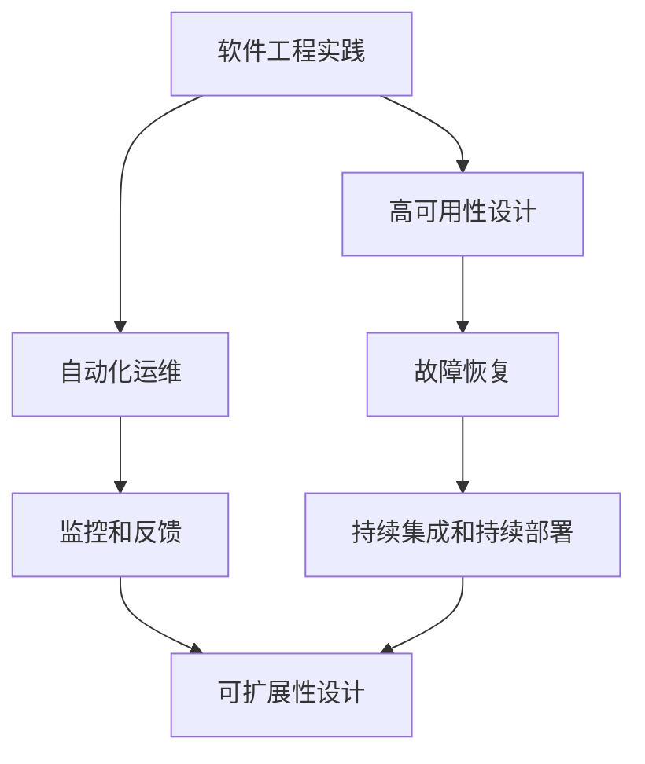

                 

关键词：SRE，高可用性，系统可靠性，可扩展性，故障恢复，自动化运维

> 摘要：本文将深入探讨SRE（Site Reliability Engineering，站点可靠性工程）的核心原则，以及如何通过这些原则来保持系统的高可用性和可扩展性。我们将从SRE的起源和定义开始，逐步介绍高可用性和可扩展性的重要性，以及SRE在实践中如何实现这两个目标。最后，我们将展望SRE未来的发展趋势和面临的挑战。

## 1. 背景介绍

### SRE的起源

SRE起源于谷歌，是由谷歌的工程师Ben Treynor-Seymour在2009年首次提出的。他希望将软件工程的最佳实践应用于运维工作，以解决谷歌大规模分布式系统的高可用性和可扩展性问题。SRE的核心目标是确保系统的可靠性和稳定性，同时保持开发效率。

### SRE的定义

SRE是一种将工程思维应用于运维工作的方法，它结合了软件工程、系统设计和运营实践。SRE团队不仅负责系统的运维，还要参与系统的设计和开发，确保系统能够在遇到故障时快速恢复，并在需求增长时能够弹性扩展。

## 2. 核心概念与联系

### 高可用性（High Availability）

高可用性是指系统在面临各种故障时能够迅速恢复，确保业务连续性的能力。高可用性的核心目标是减少系统故障的时间，提高系统的可用性。

### 可扩展性（Scalability）

可扩展性是指系统能够随着需求增长而自动调整资源的能力。可扩展性的核心目标是确保系统在流量增加时能够保持性能，不出现性能瓶颈。

### SRE与高可用性、可扩展性的关系

SRE通过一系列原则和实践，确保系统能够实现高可用性和可扩展性。SRE强调自动化、监控、测试和反馈，这些原则都是为了提高系统的可靠性和稳定性。

### Mermaid 流程图

下面是一个简单的Mermaid流程图，展示了SRE如何与高可用性和可扩展性相关联：



## 3. 核心算法原理 & 具体操作步骤

### 3.1 算法原理概述

SRE的核心算法原理主要包括以下几个方面：

- **自动化**：通过编写脚本和自动化工具，减少手动操作，提高运维效率。
- **监控**：通过监控系统性能和指标，及时发现异常并触发告警。
- **测试**：通过自动化测试和混沌工程，确保系统在面临故障时能够快速恢复。
- **反馈**：通过反馈机制，持续优化系统和流程。

### 3.2 算法步骤详解

1. **需求分析**：确定系统的高可用性和可扩展性需求。
2. **设计**：根据需求设计系统架构，包括故障转移、负载均衡和数据库复制等。
3. **开发**：编写代码，实现自动化运维和监控功能。
4. **测试**：通过自动化测试和混沌工程，验证系统的高可用性和可扩展性。
5. **部署**：将系统部署到生产环境，并持续监控和优化。

### 3.3 算法优缺点

**优点**：

- **高效率**：自动化和监控大大提高了运维效率。
- **高可靠性**：通过测试和反馈，确保系统在面临故障时能够快速恢复。
- **弹性扩展**：系统可以根据需求自动调整资源，确保性能。

**缺点**：

- **初期成本高**：需要投入大量资源进行系统设计和自动化工具开发。
- **维护复杂**：系统需要持续维护和优化，以应对不断变化的需求。

### 3.4 算法应用领域

SRE的应用领域非常广泛，包括但不限于以下方面：

- **互联网公司**：如谷歌、亚马逊、阿里巴巴等，它们拥有大规模分布式系统，需要确保高可用性和可扩展性。
- **金融行业**：银行、证券、保险等金融机构，对系统的可靠性和稳定性要求极高。
- **云计算服务**：如AWS、Azure、阿里云等，提供云服务，需要确保服务的稳定性和可靠性。

## 4. 数学模型和公式 & 详细讲解 & 举例说明

### 4.1 数学模型构建

SRE的数学模型主要包括以下几个关键指标：

- **可用性（Availability）**：系统在一段时间内正常运行的时间比例。
- **故障恢复时间（Recovery Time）**：系统从故障中恢复的时间。
- **资源利用率（Resource Utilization）**：系统资源的利用率。

### 4.2 公式推导过程

- **可用性公式**：

  $$ Availability = \frac{正常运行时间}{总时间} $$

- **故障恢复时间公式**：

  $$ Recovery Time = \frac{故障时间}{故障发生次数} $$

- **资源利用率公式**：

  $$ Resource Utilization = \frac{实际使用资源}{总资源} $$

### 4.3 案例分析与讲解

假设我们有一个系统，它在一个月内发生了5次故障，每次故障的恢复时间分别是1小时、2小时、3小时、4小时和5小时。系统总共运行了1000小时。

- **可用性**：

  $$ Availability = \frac{1000 - (1 + 2 + 3 + 4 + 5)}{1000} = \frac{985}{1000} = 0.985 $$

- **故障恢复时间**：

  $$ Recovery Time = \frac{1 + 2 + 3 + 4 + 5}{5} = \frac{15}{5} = 3小时 $$

- **资源利用率**：

  $$ Resource Utilization = \frac{实际使用资源}{总资源} $$

  假设系统的总资源是100个CPU核心，实际使用资源是80个CPU核心。

  $$ Resource Utilization = \frac{80}{100} = 0.8 $$

## 5. 项目实践：代码实例和详细解释说明

### 5.1 开发环境搭建

为了实践SRE原则，我们需要搭建一个开发环境，包括以下工具：

- **Docker**：用于容器化应用程序。
- **Kubernetes**：用于容器编排。
- **Prometheus**：用于监控系统性能和指标。
- **Grafana**：用于可视化监控数据。

### 5.2 源代码详细实现

以下是使用Docker和Kubernetes实现自动化运维的简单示例：

**Dockerfile**：

```dockerfile
FROM ubuntu:latest
RUN apt-get update && apt-get install -y nginx
COPY index.html /usr/share/nginx/html/
EXPOSE 80
```

**kubernetes.yaml**：

```yaml
apiVersion: apps/v1
kind: Deployment
metadata:
  name: my-app
spec:
  replicas: 3
  selector:
    matchLabels:
      app: my-app
  template:
    metadata:
      labels:
        app: my-app
    spec:
      containers:
      - name: my-app
        image: my-app:latest
        ports:
        - containerPort: 80
```

### 5.3 代码解读与分析

上述代码中，我们使用了Dockerfile来构建应用程序的容器镜像，然后使用kubernetes.yaml文件来部署应用程序到Kubernetes集群。这样，我们就可以通过Kubernetes来管理应用程序的运行状态，实现自动化运维。

### 5.4 运行结果展示

部署完成后，我们可以使用以下命令来查看应用程序的运行状态：

```shell
kubectl get pods
```

输出结果如下：

```shell
NAME                     READY   STATUS    RESTARTS   AGE
my-app-6c5d7544f4-2g2gg   1/1     Running   0          10s
my-app-6c5d7544f4-8jbg4   1/1     Running   0          10s
my-app-6c5d7544f4-tnsbv   1/1     Running   0          10s
```

我们可以看到，应用程序已经成功部署到了Kubernetes集群，并运行了3个副本。

## 6. 实际应用场景

### 6.1 互联网公司

互联网公司通常需要处理海量用户请求，因此确保系统的高可用性和可扩展性至关重要。SRE原则可以帮助它们实现这一目标，例如通过负载均衡、故障转移和数据库复制等技术来提高系统的可靠性。

### 6.2 金融行业

金融行业对系统的可靠性和稳定性要求极高，任何故障都可能导致巨大的经济损失。SRE原则可以帮助金融机构实现快速故障恢复和弹性扩展，从而确保业务的连续性。

### 6.3 云计算服务

云计算服务提供商需要为大量客户提供稳定可靠的服务。SRE原则可以帮助他们实现自动化运维、监控和故障恢复，从而提高服务的质量和客户满意度。

## 7. 工具和资源推荐

### 7.1 学习资源推荐

- 《Google SRE：谷歌是如何运行得又快又好的》
- 《SRE Handbook》
- 《Site Reliability Engineering: Designing and Building High-availability Systems》

### 7.2 开发工具推荐

- **Kubernetes**：用于容器编排。
- **Prometheus**：用于监控系统性能和指标。
- **Grafana**：用于可视化监控数据。
- **Docker**：用于容器化应用程序。

### 7.3 相关论文推荐

- **"The Site Reliability Engineering Handbook" by Rachel Roumeliotis and Chris Jones**
- **"Embracing Chaos Engineering to Build Resilient Systems" by Kelsey Hightower,.
- **"The Importance of SRE for Building High-Performance Teams" by Matt Stine**

## 8. 总结：未来发展趋势与挑战

### 8.1 研究成果总结

SRE作为一项新兴的技术理念，已经在众多互联网公司和金融机构中得到广泛应用。通过SRE原则，这些公司能够实现系统的高可用性和可扩展性，提高运维效率和业务连续性。

### 8.2 未来发展趋势

随着云计算和大数据技术的不断发展，SRE将逐渐成为企业IT基础设施的核心组成部分。未来，SRE将更加注重自动化、智能化和自适应化，以应对不断变化的业务需求。

### 8.3 面临的挑战

- **技术复杂性**：随着系统规模的扩大，SRE技术的复杂性也在不断增加，这对运维人员提出了更高的要求。
- **人才短缺**：SRE人才稀缺，如何培养和引进专业的SRE人才成为企业面临的挑战。
- **成本控制**：实现SRE原则需要大量的投入，如何控制成本成为企业关注的重点。

### 8.4 研究展望

未来，SRE将朝着更加智能化、自适应化和自动化的方向发展。随着人工智能和机器学习技术的应用，SRE将能够更好地预测故障、优化资源配置和提升系统性能。

## 9. 附录：常见问题与解答

### 9.1 SRE与DevOps有什么区别？

SRE和DevOps都是关注系统运维和开发流程的方法论，但它们的侧重点不同。DevOps强调开发（Development）和运维（Operations）的紧密协作，以提高软件交付速度和可靠性。SRE则更侧重于系统的高可用性和稳定性，通过自动化和工程化手段来确保系统的可靠运行。

### 9.2 SRE适用于哪些场景？

SRE适用于需要高可用性和可扩展性的场景，如互联网公司、金融行业和云计算服务提供商等。这些行业通常需要处理海量数据和高并发请求，对系统的稳定性和性能有极高的要求。

### 9.3 如何开始实践SRE？

开始实践SRE可以从以下几个方面入手：

1. **了解SRE原则**：学习《Google SRE：谷歌是如何运行得又快又好的》等书籍，了解SRE的基本概念和实践方法。
2. **搭建实验环境**：使用Docker、Kubernetes等工具搭建一个简单的实验环境，实践SRE的自动化运维和监控功能。
3. **引入SRE实践**：逐步将SRE原则引入到实际项目中，通过自动化和测试来提高系统的高可用性和可扩展性。

### 9.4 SRE与云计算的关系是什么？

SRE与云计算密切相关。云计算为SRE提供了强大的基础设施支持，如虚拟化技术、容器化和分布式存储等。通过云计算，SRE可以实现更高效的资源管理和调度，提高系统的可靠性和性能。

### 9.5 SRE的主要优势是什么？

SRE的主要优势包括：

1. **提高系统可靠性**：通过自动化和测试，确保系统在面临故障时能够快速恢复。
2. **提高运维效率**：通过自动化运维，减少手动操作，提高运维效率。
3. **提高业务连续性**：通过高可用性和可扩展性设计，确保业务在遇到故障时能够持续运行。

### 9.6 SRE的主要挑战是什么？

SRE的主要挑战包括：

1. **技术复杂性**：随着系统规模的扩大，SRE技术的复杂性也在不断增加。
2. **人才短缺**：SRE人才稀缺，如何培养和引进专业的SRE人才成为企业面临的挑战。
3. **成本控制**：实现SRE原则需要大量的投入，如何控制成本成为企业关注的重点。

作者：禅与计算机程序设计艺术 / Zen and the Art of Computer Programming
------------------------------------------------------------------------

