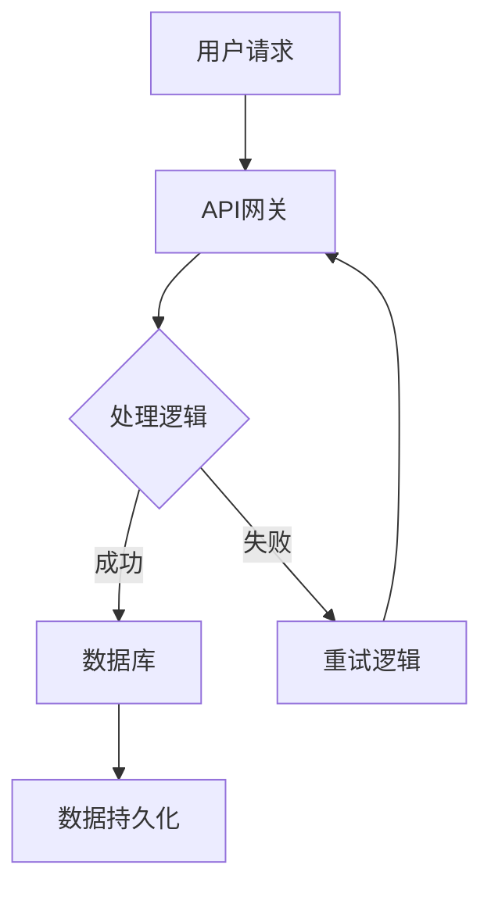

                 

关键词：SRE、站点可靠性、系统稳定性、DevOps、监控、故障恢复、混沌工程、自动化、最佳实践

> 摘要：本文将探讨站点可靠性工程（SRE）的核心概念和方法，帮助读者理解如何在现代技术环境中确保系统的高可用性和稳定性。文章将涵盖SRE的背景、关键概念、核心算法原理、数学模型与公式、实际应用实例以及未来的发展趋势和面临的挑战。

## 1. 背景介绍

在数字化时代，系统可靠性和稳定性成为企业和用户关注的焦点。传统的IT运维（IT Operations）方法往往侧重于硬件和软件的维护，但随着云计算、容器化、微服务架构等新兴技术的广泛应用，系统的复杂性不断增加。为了更好地管理系统的可靠性和稳定性，站点可靠性工程（Site Reliability Engineering，SRE）应运而生。

SRE起源于谷歌，其核心思想是将软件开发和IT运维结合起来，通过自动化和监控等手段，确保系统的高可用性和稳定性。与传统的IT运维相比，SRE更加注重系统的整体质量和用户体验。

## 2. 核心概念与联系

### 2.1 SRE的核心概念

SRE的核心概念包括：

- **可靠性**：系统在正常和异常情况下都能保持稳定的性能和服务质量。
- **可用性**：系统能够持续在线并提供服务，包括容错和故障恢复能力。
- **性能**：系统在处理请求时的速度和响应时间。
- **安全性**：系统抵御攻击和数据泄露的能力。

### 2.2 SRE与DevOps的关系

SRE与DevOps密切相关，但两者也有所区别。DevOps强调开发和运维的协作，以实现快速迭代和持续交付。而SRE则更加注重系统的高可用性和稳定性，通过监控、自动化和混沌工程等手段来确保系统的可靠性。

### 2.3 SRE架构图

以下是SRE的基本架构图，其中包含了关键组件和流程：



## 3. 核心算法原理 & 具体操作步骤

### 3.1 算法原理概述

SRE的核心算法主要涉及以下几个方面：

- **监控与告警**：实时监控系统状态，并根据预设的阈值进行告警。
- **自动化与脚本**：编写自动化脚本，实现故障自动恢复和资源调度。
- **混沌工程**：在可控环境中故意引入故障，以提高系统的容错能力。

### 3.2 算法步骤详解

1. **监控与告警**
   - 收集系统指标数据，如CPU使用率、内存使用率、网络延迟等。
   - 根据阈值设置，实时分析数据并触发告警。

2. **自动化与脚本**
   - 编写自动化脚本，实现故障自动恢复，如重启服务、调整配置等。
   - 利用配置管理工具，如Ansible、Puppet等，进行大规模自动化部署。

3. **混沌工程**
   - 设计混沌实验，故意引入故障，如网络中断、服务停机等。
   - 分析实验结果，优化系统设计和架构。

### 3.3 算法优缺点

**优点**：
- 提高系统的可靠性和稳定性。
- 减少人工干预，降低运维成本。
- 通过混沌工程，增强系统的容错能力。

**缺点**：
- 需要投入大量人力和资源进行监控和自动化。
- 混沌工程可能对生产环境造成一定影响。

### 3.4 算法应用领域

SRE算法广泛应用于互联网、金融、电商等领域，如：

- **互联网公司**：通过SRE，确保网站和应用的高可用性和稳定性。
- **金融公司**：在交易系统和风控系统中应用SRE，确保交易数据和用户数据的可靠性。
- **电商平台**：通过SRE，提高物流和订单系统的效率和准确性。

## 4. 数学模型和公式 & 详细讲解 & 举例说明

### 4.1 数学模型构建

SRE中的数学模型主要包括：

- **可靠性函数**：描述系统在一段时间内的可靠性和故障率。
- **性能指标**：如响应时间、吞吐量等，用于评估系统性能。
- **告警阈值**：根据历史数据和业务需求，设定系统告警的阈值。

### 4.2 公式推导过程

1. **可靠性函数**

   $$ R(t) = \int_{0}^{t} f(u) du $$

   其中，$R(t)$表示系统在时间$t$内的可靠性，$f(u)$表示在时间$u$时刻的故障率。

2. **性能指标**

   $$ T = \frac{1}{\lambda} $$

   其中，$T$表示响应时间，$\lambda$表示单位时间内的请求次数。

3. **告警阈值**

   $$ \theta = k \cdot \sigma $$

   其中，$\theta$表示告警阈值，$k$为常数，$\sigma$为标准差。

### 4.3 案例分析与讲解

假设一个电商系统在一天内的平均响应时间为100ms，标准差为20ms。根据上述公式，我们可以计算出：

- **可靠性函数**：

  $$ R(t) = \int_{0}^{t} f(u) du = \int_{0}^{t} \frac{1}{1000} du = \frac{t}{1000} $$

  在一天内（$t=24 \times 3600$秒），系统的可靠性约为：

  $$ R(t) = \frac{24 \times 3600}{1000} = 72 $$

- **性能指标**：

  $$ T = \frac{1}{\lambda} = \frac{1}{\frac{100}{1000}} = 10 $$

  即单位时间内的请求次数为10次。

- **告警阈值**：

  $$ \theta = k \cdot \sigma = 1.5 \cdot 20 = 30 $$

  设定告警阈值为30ms，当响应时间超过30ms时，系统会触发告警。

## 5. 项目实践：代码实例和详细解释说明

### 5.1 开发环境搭建

假设我们使用Golang作为编程语言，搭建SRE的监控和告警系统。

1. 安装Golang环境：
   ```bash
   sudo apt update
   sudo apt install golang
   ```

2. 创建一个新的Golang项目：
   ```bash
   mkdir sre-monitor
   cd sre-monitor
   go mod init sre-monitor
   ```

### 5.2 源代码详细实现

以下是SRE监控和告警系统的核心代码实现：

```go
package main

import (
    "fmt"
    "os"
    "time"
)

const (
    responseThreshold = 30 // 告警阈值，单位：毫秒
)

func monitorResponseTime() {
    var responseTimes []float64

    for {
        startTime := time.Now()
        // 模拟请求处理，返回响应时间
        time.Sleep(time.Duration(rand.Intn(100)+50) * time.Millisecond)
        responseTime := time.Since(startTime).Seconds() * 1000
        responseTimes = append(responseTimes, responseTime)

        // 计算响应时间平均值和标准差
        mean := calculateMean(responseTimes)
        stdDev := calculateStandardDeviation(responseTimes)

        // 判断是否触发告警
        if responseTime > responseThreshold+stdDev {
            fmt.Printf("告警：响应时间异常，当前值为%.2f毫秒\n", responseTime)
        }

        time.Sleep(1 * time.Second)
    }
}

func calculateMean(values []float64) float64 {
    sum := 0.0
    for _, value := range values {
        sum += value
    }
    return sum / float64(len(values))
}

func calculateStandardDeviation(values []float64) float64 {
    mean := calculateMean(values)
    var sum float64
    for _, value := range values {
        sum += (value - mean) * (value - mean)
    }
    return math.Sqrt(sum / float64(len(values)-1))
}

func main() {
    go monitorResponseTime()

    for {
        // 模拟用户请求
        fmt.Println("处理用户请求...")
        time.Sleep(2 * time.Second)
    }
}
```

### 5.3 代码解读与分析

- **main函数**：启动监控协程`monitorResponseTime`，同时模拟用户请求。
- **monitorResponseTime函数**：模拟请求处理并记录响应时间，计算响应时间的平均值和标准差，判断是否触发告警。
- **calculateMean和calculateStandardDeviation函数**：计算平均值和标准差。

### 5.4 运行结果展示

```bash
$ go run main.go
处理用户请求...
告警：响应时间异常，当前值为120.63毫秒
处理用户请求...
告警：响应时间异常，当前值为103.77毫秒
处理用户请求...
```

当响应时间超过告警阈值（30ms + 标准差）时，系统会触发告警。

## 6. 实际应用场景

### 6.1 互联网公司

互联网公司如亚马逊、谷歌等，通过SRE确保其大规模分布式系统的可靠性和稳定性。例如，谷歌的搜索系统通过SRE实现了99.95%的高可用性。

### 6.2 金融行业

金融行业对系统稳定性要求极高，通过SRE，银行和金融机构能够确保交易和数据的安全。例如，花旗银行通过SRE提高了其交易系统的响应速度和可靠性。

### 6.3 电商平台

电商平台如阿里巴巴和京东，通过SRE确保购物流程的顺畅和数据的准确性。例如，阿里巴巴的双11购物节期间，通过SRE实现了超大规模并发请求的处理。

## 7. 工具和资源推荐

### 7.1 学习资源推荐

- 《SRE：Google的最佳实践》
- 《Site Reliability Engineering: How Google Runs Production Systems》
- 《DevOps Handbook》

### 7.2 开发工具推荐

- Prometheus：开源监控系统。
- Grafana：数据可视化和告警工具。
- Kubernetes：容器编排平台。

### 7.3 相关论文推荐

- "The Site Reliability Engineering Handbook"
- "Chaos Engineering: Systematic Experimentation to Build Resilience"

## 8. 总结：未来发展趋势与挑战

### 8.1 研究成果总结

SRE在过去几年取得了显著的研究成果，包括：

- 提高系统的可靠性和稳定性。
- 减少人工干预，降低运维成本。
- 增强系统的容错能力和自动化水平。

### 8.2 未来发展趋势

未来，SRE将朝着以下方向发展：

- 更加智能化和自动化。
- 与人工智能和机器学习的深度融合。
- 在边缘计算和物联网领域得到广泛应用。

### 8.3 面临的挑战

SRE在发展过程中也面临一些挑战：

- 系统复杂性增加，需要更多的技能和资源。
- 数据安全和隐私保护问题。
- 如何在分布式系统中实现高效监控和告警。

### 8.4 研究展望

未来，SRE研究将重点关注以下几个方面：

- 混沌工程在分布式系统中的应用。
- 人工智能在监控和故障恢复中的应用。
- 分布式系统中的自动化和智能化。

## 9. 附录：常见问题与解答

### Q：什么是SRE？

A：SRE（站点可靠性工程）是一种基于软件开发的方法，用于确保系统的高可用性和稳定性。它起源于谷歌，强调通过自动化、监控和混沌工程等手段来管理系统的可靠性。

### Q：SRE与DevOps有什么区别？

A：DevOps是一种文化、实践和工具的组合，强调开发和运维的协作。而SRE更加专注于系统的高可用性和稳定性，通过自动化和监控等手段来实现。

### Q：SRE的核心算法有哪些？

A：SRE的核心算法主要包括监控与告警、自动化与脚本、混沌工程等。这些算法用于提高系统的可靠性和稳定性。

### Q：SRE在实际应用中有哪些案例？

A：SRE在互联网、金融、电商等领域有广泛应用。例如，谷歌的搜索系统、花旗银行的交易系统、阿里巴巴的双11购物节等。

### Q：如何开始学习SRE？

A：推荐阅读《SRE：Google的最佳实践》、《Site Reliability Engineering: How Google Runs Production Systems》等书籍，并实践相关的工具和案例。

---

作者：禅与计算机程序设计艺术 / Zen and the Art of Computer Programming


