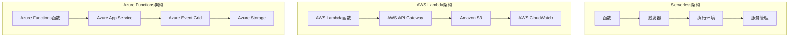

                 

关键词：Serverless架构，AWS Lambda，Azure Functions，无服务器，云计算，微服务，函数即服务，架构设计，性能优化，安全性

摘要：本文将深入探讨Serverless架构及其在实际开发中的应用，重点分析AWS Lambda与Azure Functions这两大主流Serverless平台的架构原理、优缺点及实践应用。通过对比分析，读者将能够全面了解Serverless架构的优势和挑战，从而为项目选择合适的Serverless平台提供有力指导。

## 1. 背景介绍

Serverless架构是一种新兴的云计算服务模式，旨在通过将服务器管理从开发者手中转移给云服务提供商，从而简化开发流程，提高系统灵活性。Serverless架构的核心思想是函数即服务（Function as a Service，简称FaaS），开发者只需关注业务逻辑的实现，无需关心服务器运维。

Serverless架构的出现源于微服务架构的演化。随着互联网应用的日益复杂，传统的单体应用逐渐难以满足需求。微服务架构通过将应用拆分为多个独立的服务，提高了系统的可维护性和可扩展性。然而，微服务架构也带来了服务器管理的复杂性。Serverless架构正是为了解决这一难题而诞生的。

AWS Lambda和Azure Functions是当前最流行的两大Serverless平台。AWS Lambda由亚马逊提供，而Azure Functions则由微软推出。两者均为开发者提供了高效、灵活的Serverless解决方案，但在架构原理、功能特性、优缺点等方面存在一定的差异。

## 2. 核心概念与联系

### 2.1. Serverless架构原理

Serverless架构的核心是函数（Function），开发者只需编写业务逻辑代码，并将其部署到Serverless平台。平台会负责函数的调度、执行和资源管理。具体来说，Serverless架构包括以下几个关键组件：

- **函数（Function）**：业务逻辑实现，可以是单个文件或多个文件组成的模块。
- **触发器（Trigger）**：触发函数执行的事件，如HTTP请求、定时任务、数据库变更等。
- **执行环境（Runtime Environment）**：运行函数的虚拟化环境，提供必要的运行时依赖和资源。
- **服务管理（Service Management）**：管理函数的生命周期，包括创建、部署、更新、删除等。

### 2.2. AWS Lambda架构

AWS Lambda是亚马逊提供的一种Serverless计算服务。其架构包括以下几个核心部分：

- **Lambda函数**：开发者编写的业务逻辑代码，支持多种编程语言。
- **AWS API Gateway**：提供HTTP接口，供外部系统调用Lambda函数。
- **Amazon S3**：存储Lambda函数的部署包和依赖。
- **AWS CloudWatch**：监控和管理Lambda函数的运行状态。

### 2.3. Azure Functions架构

Azure Functions是微软提供的Serverless计算服务。其架构包括以下几个核心部分：

- **函数**：开发者编写的业务逻辑代码，支持多种编程语言。
- **Azure App Service**：提供函数的托管和执行环境。
- **Azure Event Grid**：触发函数执行的事件源。
- **Azure Storage**：存储函数的日志和依赖。

### 2.4. Mermaid流程图



## 3. 核心算法原理 & 具体操作步骤

### 3.1. 算法原理概述

Serverless架构的核心算法原理主要包括以下几个方面：

- **函数调度与执行**：平台根据触发器的类型和策略，动态调度函数执行。执行过程中，平台会为函数分配必要的计算资源。
- **资源管理**：平台自动管理函数的运行时资源，如CPU、内存、网络等。开发者无需关心资源的分配和释放。
- **异步处理**：Serverless架构支持异步处理，函数可以在执行过程中触发其他函数或外部服务，实现复杂的业务逻辑。

### 3.2. 算法步骤详解

1. **函数创建**：开发者编写业务逻辑代码，并将其部署到Serverless平台。
2. **触发器配置**：为函数配置触发器，定义触发函数执行的事件。
3. **函数执行**：触发器触发函数执行，平台调度函数运行，分配计算资源。
4. **函数监控**：平台监控函数的运行状态，如CPU使用率、内存占用等，并在异常情况下进行自动恢复。
5. **日志与告警**：平台记录函数的执行日志，并在发生异常时发送告警通知。

### 3.3. 算法优缺点

#### 3.3.1. 优点

- **简化开发**：Serverless架构将服务器管理转移给平台，开发者只需关注业务逻辑实现。
- **弹性伸缩**：平台根据负载自动调整计算资源，实现高效的资源利用率。
- **低成本**：按需计费，无需为闲置资源支付费用。

#### 3.3.2. 缺点

- **局限性**：某些特定场景下，Serverless架构的性能和功能可能无法满足需求。
- **依赖平台**：Serverless架构对平台有一定依赖，切换平台可能需要重新设计和部署。

### 3.4. 算法应用领域

Serverless架构适用于以下领域：

- **Web应用**：快速搭建和部署RESTful API，实现微服务架构。
- **数据处理**：批量处理数据、实时数据处理和分析。
- **物联网**：处理物联网设备产生的大量数据，实现智能设备管理。

## 4. 数学模型和公式 & 详细讲解 & 举例说明

### 4.1. 数学模型构建

Serverless架构的数学模型主要包括以下几个方面：

- **计算资源消耗**：函数执行过程中消耗的计算资源，如CPU、内存等。
- **网络传输开销**：函数执行过程中产生的网络流量。
- **存储成本**：函数的存储和持久化成本。

### 4.2. 公式推导过程

假设函数F在执行过程中消耗的计算资源为C，网络传输开销为N，存储成本为S。则函数的总成本C_total可以表示为：

$$ C_{total} = C + N + S $$

其中，C、N、S的具体计算方法如下：

- **计算资源消耗**：$ C = a \times t $，其中a为每单位时间消耗的计算资源，t为函数执行时间。
- **网络传输开销**：$ N = b \times l $，其中b为每单位流量消耗的网络资源，l为函数执行过程中产生的流量。
- **存储成本**：$ S = c \times s $，其中c为每单位存储消耗的成本，s为函数的存储时间。

### 4.3. 案例分析与讲解

假设一个Web应用使用AWS Lambda处理用户请求，平均每个请求处理时间为1秒，产生的网络流量为100KB，函数的存储时间为1小时。根据以上参数，可以计算函数的总成本：

- **计算资源消耗**：$ C = 0.0001 \times 1 = 0.0001 $。
- **网络传输开销**：$ N = 0.0001 \times 100 \times 1024 = 10.24 $。
- **存储成本**：$ S = 0.001 \times 3600 = 3.6 $。

则函数的总成本为：

$$ C_{total} = 0.0001 + 10.24 + 3.6 = 13.84 $$

根据AWS Lambda的计费规则，每百万请求的费用为0.16美元。因此，该Web应用每月的总成本为：

$$ \text{总成本} = \frac{13.84}{0.16} = 86.5 \text{美元} $$

## 5. 项目实践：代码实例和详细解释说明

### 5.1. 开发环境搭建

要开发一个使用AWS Lambda和Azure Functions的Serverless项目，首先需要在AWS和Azure上创建账号，并配置相应的开发环境。具体步骤如下：

1. **AWS账号创建**：访问[AWS官网](https://aws.amazon.com/)，按照提示创建AWS账号。
2. **AWS CLI安装**：在本地计算机上安装AWS CLI工具，用于与AWS服务进行通信。
3. **AWS凭证配置**：配置AWS凭证，授权AWS CLI访问AWS账号。
4. **Azure账号创建**：访问[Azure官网](https://azure.com/)，按照提示创建Azure账号。
5. **Azure CLI安装**：在本地计算机上安装Azure CLI工具，用于与Azure服务进行通信。
6. **Azure凭证配置**：配置Azure凭证，授权Azure CLI访问Azure账号。

### 5.2. 源代码详细实现

以下是一个简单的Serverless项目示例，实现一个基于AWS Lambda和Azure Functions的RESTful API。

#### AWS Lambda

```python
# lambda_function.py

import json

def lambda_handler(event, context):
    # 读取请求体
    body = json.loads(event['body'])

    # 处理请求
    result = {'status': 'success', 'message': 'Hello, World!'}
    if 'name' in body:
        result['message'] = f'Hello, {body['name']}!'

    # 返回响应
    return {
        'statusCode': 200,
        'body': json.dumps(result)
    }
```

#### Azure Functions

```csharp
// Function1.cs

using System.IO;
using System.Threading.Tasks;
using Microsoft.AspNetCore.Mvc;
using Microsoft.Extensions.Logging;

public static async Task<IActionResult> Get(
    ILogger log)
{
    // 读取请求体
    var body = new StreamReader(HttpContext.Request.Body).ReadToEndAsync().Result;

    // 处理请求
    var result = new { status = "success", message = "Hello, World!" };
    if (!string.IsNullOrEmpty(body))
    {
        var data = JsonConvert.DeserializeObject<dynamic>(body);
        if (data != null && data.name != null)
        {
            result.message = $"Hello, {data.name}!";
        }
    }

    // 返回响应
    return new OkObjectResult(result);
}
```

### 5.3. 代码解读与分析

以上代码分别展示了AWS Lambda和Azure Functions的简单实现。两者均使用了异步编程模型，提高了函数的响应速度。

- **AWS Lambda**：使用了Python语言，函数名为`lambda_handler`。函数接收事件（`event`）和上下文（`context`）参数，并从事件中获取请求体，处理请求后返回响应。
- **Azure Functions**：使用了C#语言，函数名为`Get`。函数使用了`ILogger`日志接口记录运行日志，并从请求体中获取数据，处理请求后返回响应。

### 5.4. 运行结果展示

1. **AWS Lambda**：使用AWS API Gateway将Lambda函数暴露为RESTful API，通过HTTP请求访问函数。例如，请求`https://your-api-endpoint/`，可以收到如下响应：

```json
{
    "statusCode": 200,
    "body": {
        "status": "success",
        "message": "Hello, World!"
    }
}
```

2. **Azure Functions**：使用Azure App Service将函数暴露为RESTful API，通过HTTP请求访问函数。例如，请求`https://your-function-app functionName`，可以收到如下响应：

```json
{
    "status": "success",
    "message": "Hello, World!"
}
```

## 6. 实际应用场景

Serverless架构在实际开发中具有广泛的应用场景，以下列举几个典型应用：

- **Web应用**：通过Serverless架构快速搭建和部署RESTful API，实现前后端分离，提高开发效率。
- **数据处理**：利用Serverless架构处理大量数据，如日志收集、实时数据分析等。
- **物联网**：通过Serverless架构实现物联网设备的数据处理和智能控制，降低系统复杂度。
- **移动应用**：为移动应用提供后端服务，实现离线数据同步和推送等功能。

## 7. 未来应用展望

随着云计算技术的不断发展，Serverless架构在未来将具有更广泛的应用前景。以下是一些未来应用展望：

- **集成与扩展**：Serverless架构将与其他云计算服务（如容器化、大数据、人工智能等）进行深度融合，提供更丰富的服务。
- **全球化部署**：Serverless架构将支持全球多地域部署，提高系统的可用性和性能。
- **自动化与智能化**：Serverless架构将引入更多自动化和智能化技术，如自动扩缩容、故障自恢复等，降低运维成本。

## 8. 总结：未来发展趋势与挑战

Serverless架构作为一种新兴的云计算服务模式，具有显著的性能、成本和开发效率优势。然而，在快速发展过程中，也面临着一些挑战：

- **性能优化**：Serverless架构在处理大量并发请求时，可能存在性能瓶颈。未来需要引入更多优化技术，提高系统性能。
- **安全性**：Serverless架构的安全性是开发者和用户关注的重点。未来需要加强安全防护，防止数据泄露和恶意攻击。
- **依赖平台**：Serverless架构对平台有一定依赖，如何实现跨平台兼容性是一个重要课题。

## 9. 附录：常见问题与解答

### Q1. Serverless架构与微服务架构有何区别？

Serverless架构是一种实现微服务架构的一种方式，其主要区别在于服务器管理方面。微服务架构要求开发者自行管理服务器，而Serverless架构将服务器管理转移给云服务提供商，降低了开发者的运维负担。

### Q2. Serverless架构是否适合所有项目？

Serverless架构在某些场景下具有显著优势，但在处理大量并发请求或需要高稳定性时，可能存在性能瓶颈。因此，是否选择Serverless架构需要根据项目需求进行权衡。

### Q3. 如何选择合适的Serverless平台？

选择合适的Serverless平台需要考虑以下因素：

- **功能特性**：了解不同平台的函数语言支持、触发器类型、API网关等特性。
- **性能表现**：比较不同平台的函数执行性能、网络延迟等指标。
- **成本**：评估不同平台的计费模式和费用，选择性价比高的平台。
- **生态支持**：考虑平台的社区活跃度、工具和资源的丰富程度。

## 作者署名

本文作者：禅与计算机程序设计艺术 / Zen and the Art of Computer Programming
----------------------------------------------------------------

以上是文章的整体结构和大致内容。接下来，您可以根据文章结构模板中的要求，逐一填充各个章节的内容，确保文章的完整性、逻辑性和专业性。记得在撰写过程中，保持文字的流畅性和易读性，确保读者能够轻松理解文章的核心观点和内容。祝您撰写顺利！

