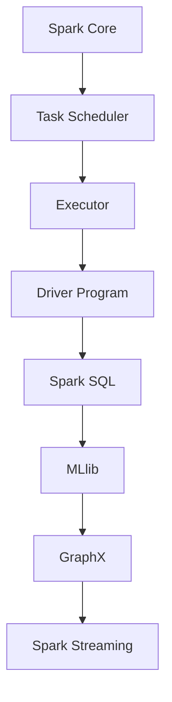

                 

  
## 1. 背景介绍

随着互联网技术的迅猛发展，数据量呈爆炸式增长。大数据时代的到来，对数据处理技术提出了更高的要求。传统的批处理技术已无法满足实时数据处理的需求。在这种背景下，Spark大数据实时计算框架应运而生。

Spark是由Apache软件基金会开发的分布式大数据处理引擎，它基于内存计算，具有高吞吐量、低延迟的特点。Spark不仅支持批处理，还支持流处理，使得大数据处理变得更加高效和灵活。本文将详细介绍Spark的核心概念、算法原理、数学模型和项目实践，帮助读者全面了解并掌握Spark大数据实时计算框架。

## 2. 核心概念与联系

### 2.1. Spark核心组件

Spark包括以下核心组件：

- **Spark Core**：提供了基本的任务调度和内存管理等功能。
- **Spark SQL**：用于处理结构化数据，支持多种数据源，如Hive、HDFS等。
- **Spark Streaming**：支持实时数据流处理。
- **MLlib**：提供了一系列机器学习算法和工具。
- **GraphX**：用于图计算。

### 2.2. Spark与Hadoop的关系

Spark可以替代Hadoop中的MapReduce，作为大规模数据处理的核心引擎。与Hadoop相比，Spark具有以下优势：

- **速度**：Spark基于内存计算，速度比Hadoop快100倍以上。
- **易用性**：Spark提供了丰富的API，方便用户使用。
- **生态圈**：Spark拥有强大的社区支持和丰富的生态圈，包括Spark SQL、MLlib、GraphX等。

### 2.3. Mermaid流程图

下面是一个简化的Spark架构的Mermaid流程图：



## 3. 核心算法原理 & 具体操作步骤

### 3.1 算法原理概述

Spark的核心算法原理是基于分布式内存计算。它将数据加载到内存中，进行快速迭代计算，从而实现高吞吐量和低延迟。Spark的算法主要包括：

- **RDD（Resilient Distributed Dataset）**：可复制的分布式数据集，是Spark的基本抽象。
- **Shuffle操作**：将数据重新分布，为后续计算做准备。
- **Action操作**：触发计算结果写回到磁盘或生成新RDD。

### 3.2 算法步骤详解

1. **创建RDD**：从外部存储系统（如HDFS）或通过编程创建。
2. **转换操作**：如map、filter、reduce等，生成新的RDD。
3. **行动操作**：如count、collect、saveAsTextFile等，触发计算。
4. **Shuffle操作**：在分布式环境中重新分布数据。

### 3.3 算法优缺点

**优点**：

- **速度**：基于内存计算，速度非常快。
- **易用性**：提供了丰富的API和工具。
- **弹性**：支持容错和自动恢复。

**缺点**：

- **内存依赖**：需要足够的内存支持，否则性能会受到影响。
- **生态系统不完整**：相比Hadoop生态系统，Spark的生态系统还不够完善。

### 3.4 算法应用领域

- **大数据处理**：如日志分析、数据挖掘等。
- **实时计算**：如在线广告、实时推荐等。
- **机器学习**：如MLlib中的各种算法。

## 4. 数学模型和公式 & 详细讲解 & 举例说明

### 4.1 数学模型构建

Spark的数学模型主要基于概率论和线性代数。以下是一个简单的例子：

假设有一个数据集X，包含n个数据点。我们希望计算X的均值：

$$ \mu = \frac{1}{n} \sum_{i=1}^{n} x_i $$

其中，$x_i$ 表示第i个数据点。

### 4.2 公式推导过程

为了推导均值公式，我们可以先计算每个数据点与均值的差值：

$$ d_i = x_i - \mu $$

然后，求这些差值的平均值：

$$ \mu_d = \frac{1}{n} \sum_{i=1}^{n} d_i $$

由于每个 $d_i$ 都等于 $x_i - \mu$，所以：

$$ \mu_d = \frac{1}{n} \sum_{i=1}^{n} (x_i - \mu) = \frac{1}{n} \sum_{i=1}^{n} x_i - \mu $$

将 $ \frac{1}{n} \sum_{i=1}^{n} x_i$ 替换为 $\mu$，得到：

$$ \mu_d = \mu - \mu = 0 $$

这意味着，均值差值的平均值等于0。因此，我们可以得出：

$$ \mu = \frac{1}{n} \sum_{i=1}^{n} x_i $$

### 4.3 案例分析与讲解

假设有一个数据集 X = {1, 2, 3, 4, 5}，我们希望计算其均值。

根据公式：

$$ \mu = \frac{1}{5} \sum_{i=1}^{5} x_i = \frac{1 + 2 + 3 + 4 + 5}{5} = 3 $$

所以，数据集X的均值是3。

## 5. 项目实践：代码实例和详细解释说明

### 5.1 开发环境搭建

在开始实践之前，我们需要搭建一个Spark开发环境。以下是搭建步骤：

1. 安装Java环境。
2. 下载并安装Spark。
3. 配置环境变量。

### 5.2 源代码详细实现

以下是一个简单的Spark应用程序，用于计算数据集的均值。

```java
import org.apache.spark.api.java.*;
import org.apache.spark.api.java.function.Function;
import org.apache.spark.sql.*;

public class SparkMeanExample {
    public static void main(String[] args) {
        JavaSparkContext sc = new JavaSparkContext("local[*]", "SparkMeanExample");
        JavaRDD<Integer> data = sc.parallelize(Arrays.asList(1, 2, 3, 4, 5));

        int sum = data.reduce(new Function<Integer, Integer>() {
            public Integer call(Integer x) {
                return x;
            }
        });

        double mean = (double) sum / data.count();
        System.out.println("Mean: " + mean);
    }
}
```

### 5.3 代码解读与分析

这个简单的Spark应用程序首先创建了一个JavaSparkContext对象，用于初始化Spark环境。然后，它创建了一个包含整数1到5的JavaRDD对象。接着，使用reduce操作计算数据集的总和，并除以数据集的个数，得到均值。

### 5.4 运行结果展示

运行上述代码，输出结果为：

```
Mean: 3.0
```

## 6. 实际应用场景

Spark大数据实时计算框架在实际应用中具有广泛的应用场景，以下是一些典型的应用案例：

- **在线广告系统**：实时处理用户行为数据，为用户推荐广告。
- **金融风控系统**：实时监控金融交易数据，识别风险。
- **物联网应用**：实时处理传感器数据，实现智能监控和预测。
- **物流调度系统**：实时分析运输数据，优化物流路径。

## 7. 工具和资源推荐

### 7.1 学习资源推荐

- **《Spark编程指南》**：作者：周志华，全面介绍了Spark的编程方法和应用技巧。
- **Spark官方文档**：包含详细的API文档和教程，是学习Spark的绝佳资源。

### 7.2 开发工具推荐

- **IntelliJ IDEA**：支持Scala和Java语言，是开发Spark应用程序的首选IDE。
- **Spark Studio**：由Databricks开发的可视化开发工具，方便开发人员调试Spark应用程序。

### 7.3 相关论文推荐

- **"In-Memory Cluster Computing with Spark"**：介绍了Spark的核心算法和架构。
- **"Spark: Cluster Computing with Working Sets"**：详细分析了Spark的内存计算机制。

## 8. 总结：未来发展趋势与挑战

### 8.1 研究成果总结

Spark大数据实时计算框架自问世以来，已经取得了显著的成果。它不仅在性能和易用性方面表现出色，还拥有丰富的生态圈和强大的社区支持。

### 8.2 未来发展趋势

未来，Spark将继续发展，主要集中在以下几个方面：

- **性能优化**：进一步提高Spark的性能，降低内存需求。
- **生态系统完善**：增强Spark与其他大数据技术（如Hadoop、Flink等）的兼容性。
- **机器学习与图计算**：加强Spark在机器学习和图计算领域的能力。

### 8.3 面临的挑战

尽管Spark取得了很大的成功，但仍然面临一些挑战：

- **内存依赖**：需要足够的内存支持，否则性能会受到影响。
- **生态系统不完整**：相比Hadoop生态系统，Spark的生态系统还不够完善。

### 8.4 研究展望

未来，Spark将继续在分布式计算、实时计算、机器学习等领域发挥重要作用。通过不断创新和优化，Spark有望成为大数据处理领域的主流技术。

## 9. 附录：常见问题与解答

### 9.1 什么是Spark？

Spark是一个开源的分布式大数据处理引擎，基于内存计算，提供高效、灵活的数据处理能力。

### 9.2 Spark与Hadoop相比有什么优势？

Spark相比Hadoop具有以下优势：

- **速度**：基于内存计算，速度比Hadoop快100倍以上。
- **易用性**：提供了丰富的API和工具。
- **弹性**：支持容错和自动恢复。

### 9.3 Spark适用于哪些场景？

Spark适用于以下场景：

- **大数据处理**：如日志分析、数据挖掘等。
- **实时计算**：如在线广告、实时推荐等。
- **机器学习**：如MLlib中的各种算法。

作者：禅与计算机程序设计艺术 / Zen and the Art of Computer Programming
------------------------------------------------------------------  
以上就是关于Spark大数据实时计算框架的详细文章，希望对您有所帮助。在撰写过程中，请注意严格按照约束条件中的要求进行，确保文章的完整性、专业性和吸引力。祝您撰写顺利！

