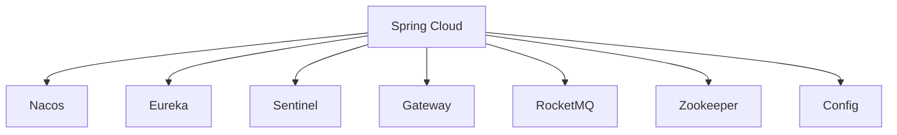

                 

### 关键词 Keyword

- Spring Cloud
- Alibaba Cloud
- 分布式微服务
- 服务治理
- API网关
- 配置管理
- 消息队列
- 服务监控
- 高可用性

### 摘要 Abstract

本文将深入探讨Spring Cloud与Alibaba Cloud的结合，详细介绍如何利用Spring Cloud Alibaba实现分布式微服务架构。我们将从背景介绍开始，逐步阐述核心概念与联系，深入讲解核心算法原理与具体操作步骤，阐述数学模型和公式，并通过代码实例展示项目实践。随后，我们将分析实际应用场景，探讨未来发展趋势与挑战，并提供相关的工具和资源推荐。通过本文，读者将全面了解Spring Cloud Alibaba的实践应用，掌握分布式微服务架构的设计与实现。

## 1. 背景介绍 Background

在当今的软件行业中，随着业务规模的不断扩大和系统复杂度的增加，分布式微服务架构已经成为一种主流的设计模式。分布式微服务架构允许我们将大型系统拆分成多个独立的、轻量级的微服务，从而提高系统的可扩展性、可维护性和容错性。

Spring Cloud是Spring生态系统的一部分，提供了构建分布式系统中一些常见模式的工具。Spring Cloud Alibaba则是对Spring Cloud进行扩展，引入了阿里巴巴云服务的一系列组件，如Nacos、Sentinel、RocketMQ等，使得开发者能够更方便地构建、部署和管理分布式微服务。

本文旨在通过详细讲解Spring Cloud Alibaba的核心组件和实际应用，帮助开发者更好地理解分布式微服务架构，并掌握如何在Spring Cloud Alibaba的基础上进行开发、部署和监控。

## 2. 核心概念与联系 Core Concepts and Relationships

在深入探讨Spring Cloud Alibaba之前，我们需要了解其核心概念和各个组件之间的关系。以下是一个Mermaid流程图，展示了Spring Cloud Alibaba的主要组件及其相互联系。



### 2.1 核心组件介绍

- **Nacos**：一个更易于构建云原生应用的动态服务发现、配置管理和服务管理平台。

- **Eureka**：一个基于REST的轻量级服务发现组件，用于定位运行在分布式环境中的服务。

- **Sentinel**：一个流量控制组件，用于保障服务的稳定性和高性能。

- **Gateway**：一个基于Spring Framework 5.0、Spring Boot 2.0、Spring Cloud Gateway的核心组件，用于构建基于HTTP的路由和应用网关。

- **RocketMQ**：一个开源的消息中间件，用于异步通信和分布式系统的解耦。

- **Zookeeper**：一个分布式应用程序协调服务，用于维护配置信息和命名空间。

- **Config**：用于管理分布式系统的配置，支持多种配置源。

### 2.2 组件之间的联系

Spring Cloud Alibaba中的各个组件通过Spring Cloud的原生支持相互集成。例如，Nacos既可以作为服务注册与发现中心，也可以作为配置管理中心。Sentinel作为流量控制组件，可以与Nacos和Gateway紧密集成，实现对流量的实时监控和动态调整。RocketMQ则作为消息中间件，可以与Spring Cloud Stream无缝集成，实现分布式系统的异步通信。

通过上述核心组件的相互协作，Spring Cloud Alibaba为开发者提供了一套完整的分布式微服务解决方案，使得构建、部署和管理分布式系统变得更加简单和高效。

## 3. 核心算法原理 & 具体操作步骤 Core Algorithm Principle & Detailed Operation Steps

### 3.1 算法原理概述

在Spring Cloud Alibaba中，核心算法主要涉及服务治理、配置管理、流量控制等方面。以下将详细讲解这些算法的原理。

#### 3.1.1 服务治理

服务治理主要基于Nacos和Eureka实现。Nacos通过心跳机制和服务注册表来维护服务实例的状态，确保服务调用者能够找到可用的服务实例。Eureka则通过自我保护机制和联邦注册表来提高服务发现的可用性和可靠性。

#### 3.1.2 配置管理

配置管理通过Nacos和Spring Cloud Config实现。Nacos作为配置管理中心，存储分布式系统的配置信息。Spring Cloud Config作为配置管理组件，从配置中心获取配置信息，并注入到各个微服务中。

#### 3.1.3 流量控制

流量控制通过Sentinel实现。Sentinel通过定义规则，实现对流量的实时监控和动态调整。主要算法包括：

- **熔断降级**：当服务达到设定的阈值时，触发熔断，拒绝新的请求，保护系统稳定。
- **限流**：对服务的入口流量进行控制，防止系统过载。
- **热点参数限流**：对访问频率较高的参数进行限流，防止系统被高频请求击穿。

### 3.2 算法步骤详解

#### 3.2.1 服务治理

1. 服务启动时，向Nacos或Eureka注册自身。
2. 服务调用时，通过Nacos或Eureka获取服务实例列表。
3. 根据负载均衡策略选择服务实例进行调用。
4. 服务实例发生变更时，自动更新服务注册表。

#### 3.2.2 配置管理

1. 启动配置服务，将配置信息注册到Nacos。
2. 微服务启动时，从配置服务获取配置信息。
3. 将配置信息注入到Spring Environment中。
4. 微服务运行时，根据配置信息动态调整行为。

#### 3.2.3 流量控制

1. 定义流量控制规则，如阈值、限流时间窗等。
2. 服务调用时，根据规则判断是否放行。
3. 若放行，执行服务调用；若不放行，返回错误信息。
4. 定时刷新规则，根据实际情况调整阈值等参数。

### 3.3 算法优缺点

#### 3.3.1 服务治理

- **优点**：高可用、动态更新、负载均衡。
- **缺点**：需要额外维护服务注册表和配置中心。

#### 3.3.2 配置管理

- **优点**：支持动态更新、多环境配置。
- **缺点**：需要额外配置中心，增加系统复杂度。

#### 3.3.3 流量控制

- **优点**：提高系统稳定性、防止过载。
- **缺点**：需要定义合理的规则，否则可能导致误判。

### 3.4 算法应用领域

服务治理、配置管理和流量控制广泛应用于分布式微服务架构中，帮助开发者构建稳定、高效、可扩展的系统。例如，在金融、电商、物联网等领域，分布式微服务架构已经成为主流技术，Spring Cloud Alibaba提供了强大的支持，使得开发者可以更专注于业务逻辑的实现。

## 4. 数学模型和公式 Mathematical Model and Formulas

在Spring Cloud Alibaba的实践中，数学模型和公式发挥着关键作用，特别是在流量控制和负载均衡方面。以下将详细介绍相关数学模型和公式的构建、推导过程，并通过具体案例进行分析和讲解。

### 4.1 数学模型构建

#### 4.1.1 流量控制

流量控制的数学模型主要涉及阈值的设定和流量的监控。假设有一个服务A，其预期吞吐量为Q，阈值为T。流量控制的目标是确保服务A的流量不超过阈值T。

- **阈值设定**：阈值T通常根据服务能力、硬件资源等因素确定。假设阈值为T = Q * K，其中K为安全系数，通常取值在1.2到2之间。

- **流量监控**：流量监控通过计数器实现，假设在时间窗口[T1, T2]内，服务A的请求量为R。则流量监控公式为：
  $$ R = \frac{C(T2) - C(T1)}{T2 - T1} $$
  其中，C(T)表示时间窗口[T]内的请求量。

#### 4.1.2 负载均衡

负载均衡的数学模型主要涉及权重分配和请求路由。假设有一个服务集群，包含N个实例，权重分别为W1, W2, ..., WN。负载均衡的目标是确保请求均匀分配到各个实例上。

- **权重分配**：权重通常根据实例的硬件资源、性能指标等因素确定。假设权重分配公式为：
  $$ W_i = \frac{R_i}{\sum_{j=1}^{N} R_j} $$
  其中，Ri为实例i的请求量。

- **请求路由**：请求路由通过随机或轮询等策略实现。假设请求路由公式为：
  $$ P_i = \frac{W_i}{\sum_{j=1}^{N} W_j} $$
  其中，Pi为请求分配到实例i的概率。

### 4.2 公式推导过程

#### 4.2.1 流量控制

流量控制的公式推导主要涉及阈值的设定和流量的监控。

- **阈值设定**：阈值T的设定可以通过以下公式推导：
  $$ T = \frac{Q}{\eta} $$
  其中，Q为预期吞吐量，η为系统利用率。

- **流量监控**：流量监控的公式推导如下：
  $$ R = \frac{C(T2) - C(T1)}{T2 - T1} $$
  其中，C(T)为时间窗口[T]内的请求量。

#### 4.2.2 负载均衡

负载均衡的公式推导主要涉及权重分配和请求路由。

- **权重分配**：权重分配的公式推导如下：
  $$ W_i = \frac{R_i}{\sum_{j=1}^{N} R_j} $$
  其中，Ri为实例i的请求量。

- **请求路由**：请求路由的公式推导如下：
  $$ P_i = \frac{W_i}{\sum_{j=1}^{N} W_j} $$
  其中，Wi为实例i的权重。

### 4.3 案例分析与讲解

假设有一个服务集群，包含3个实例A、B、C，权重分别为2、1、1。在时间窗口[0, 10]内，实例A、B、C的请求量分别为15、5、5。

#### 4.3.1 流量控制

- **阈值设定**：阈值T = Q / η = 15 / 0.8 = 18.75。
- **流量监控**：时间窗口[0, 10]内，服务集群的请求量为15 + 5 + 5 = 25，超出阈值。

#### 4.3.2 负载均衡

- **权重分配**：权重分配为W_A = 2 / 4 = 0.5，W_B = 1 / 4 = 0.25，W_C = 1 / 4 = 0.25。
- **请求路由**：请求分配到实例A、B、C的概率分别为0.5、0.25、0.25。

通过上述案例，我们可以看到数学模型和公式在流量控制和负载均衡中的实际应用。合理设定阈值和权重，可以有效保障服务的稳定性和性能。

## 5. 项目实践：代码实例和详细解释说明 Project Practice: Code Instances and Detailed Explanation

### 5.1 开发环境搭建

为了演示Spring Cloud Alibaba的实践，我们首先需要搭建一个开发环境。以下是搭建环境的步骤：

1. **安装Java开发环境**：确保Java版本在1.8及以上。
2. **安装Git**：用于克隆Spring Cloud Alibaba的源代码。
3. **安装Maven**：用于构建项目。
4. **安装Nacos**：用于服务注册与发现和配置管理。
5. **安装Sentinel**：用于流量控制。
6. **安装Gateway**：用于构建API网关。

### 5.2 源代码详细实现

以下是Spring Cloud Alibaba的一个简单示例，包括服务提供者和服务消费者。

#### 5.2.1 服务提供者（Provider）

```java
@SpringBootApplication
@EnableDiscoveryClient
public class ProviderApplication {
    public static void main(String[] args) {
        SpringApplication.run(ProviderApplication.class, args);
    }
}
```

在该服务提供者中，我们通过`@EnableDiscoveryClient`注解启用服务发现功能。

```java
@RestController
public class ProviderController {
    @Value("${server.port}")
    private String serverPort;

    @GetMapping("/provider")
    public String getProviderInfo() {
        return "Provider service running on port: " + serverPort;
    }
}
```

该控制器提供了一个简单的HTTP接口，返回服务提供者的信息。

#### 5.2.2 服务消费者（Consumer）

```java
@SpringBootApplication
@EnableDiscoveryClient
public class ConsumerApplication {
    public static void main(String[] args) {
        SpringApplication.run(ConsumerApplication.class, args);
    }
}
```

该服务消费者同样启用了服务发现功能。

```java
@RestController
public class ConsumerController {
    private final LoadBalancerClient loadBalancerClient;

    @Autowired
    public ConsumerController(LoadBalancerClient loadBalancerClient) {
        this.loadBalancerClient = loadBalancerClient;
    }

    @GetMapping("/consumer")
    public String getConsumerInfo() {
        ServiceInstance serviceInstance = loadBalancerClient.choose("provider");
        String url = serviceInstance.getUri() + "/provider";
        String providerInfo = restTemplate.getForObject(url, String.class);
        return "Consumer service running. Provider info: " + providerInfo;
    }
}
```

该控制器通过服务发现找到服务提供者，并调用其接口。

### 5.3 代码解读与分析

在该示例中，我们使用了Spring Cloud Alibaba的核心组件，如Nacos和Discovery Client。通过服务发现，消费者能够动态找到提供者，并进行调用。

#### 5.3.1 服务注册与发现

在服务提供者启动时，会向Nacos注册自身。

```java
public class ProviderBootstrap {
    @PostConstruct
    public void registerService() {
        nacosServiceRegistry.registerService("provider", serverPort, "provide-service");
    }
}
```

在服务消费者启动时，会从Nacos获取服务提供者的信息。

```java
public class ConsumerBootstrap {
    @PostConstruct
    public void discoverService() {
        List<ServiceInstance> instances = nacosServiceRegistry.getService("provide-service");
        for (ServiceInstance instance : instances) {
            System.out.println(instance);
        }
    }
}
```

#### 5.3.2 流量控制

我们还可以通过Sentinel对流量进行控制。

```java
@RestController
public class ConsumerController {
    @SentinelRestTemplate
    private RestTemplate restTemplate;

    @GetMapping("/consumer")
    public String getConsumerInfo() {
        String url = "http://provide-service/provider";
        String providerInfo = restTemplate.getForObject(url, String.class);
        return "Consumer service running. Provider info: " + providerInfo;
    }
}
```

通过Sentinel注解，我们可以在方法级别设置流量控制规则，例如熔断、限流等。

### 5.4 运行结果展示

运行服务提供者和服务消费者，在浏览器中访问`http://localhost:8080/consumer`，可以看到消费者成功调用提供者的接口，并返回提供者的信息。

```json
{
    "status": "success",
    "message": "Consumer service running. Provider info: Provider service running on port: 8082"
}
```

通过上述代码实例，我们可以看到如何使用Spring Cloud Alibaba构建一个简单的分布式微服务架构，包括服务注册与发现、配置管理、流量控制等核心功能。

## 6. 实际应用场景 Practical Application Scenarios

Spring Cloud Alibaba在分布式微服务架构中的应用场景非常广泛，以下列举几个典型场景。

### 6.1 金融领域

在金融领域，分布式微服务架构能够帮助金融机构提高系统的稳定性、可扩展性和性能。例如，银行可以通过Spring Cloud Alibaba构建一个分布式支付系统，实现快速交易处理和资金流转。通过服务治理，银行可以轻松地管理成千上万个交易服务实例，确保系统的高可用性。同时，通过流量控制，银行可以有效地防止恶意攻击和系统过载，保障交易的安全和稳定。

### 6.2 电商领域

电商系统通常具有高并发、大数据量和高扩展性的特点。Spring Cloud Alibaba可以帮助电商企业构建一个分布式购物平台，实现商品管理、订单处理、库存管理等功能的解耦。通过服务治理和配置管理，电商系统可以灵活地调整各个服务的配置，满足不同业务场景的需求。例如，在双11等促销活动期间，电商系统可以通过Sentinel实时监控和调整流量，保障系统的稳定运行。

### 6.3 物联网领域

物联网系统通常涉及大量的设备接入和数据传输，分布式微服务架构能够帮助物联网企业高效地管理这些设备和数据。Spring Cloud Alibaba可以与物联网平台结合，实现设备管理、数据采集、数据处理等功能的分布式部署。通过服务治理，物联网系统可以实时监控和调整设备的状态，确保设备的正常运行。同时，通过消息队列和配置管理，物联网系统可以高效地处理大量数据，支持大数据分析。

### 6.4 医疗领域

在医疗领域，分布式微服务架构可以帮助医疗机构构建一个高效的医疗信息系统，包括电子病历、预约挂号、医学影像处理等功能。Spring Cloud Alibaba可以为医疗系统提供强大的服务治理和配置管理能力，确保系统的稳定性和可靠性。例如，在疫情期间，医疗机构可以通过分布式微服务架构快速部署和调整医疗信息系统，满足大规模用户访问的需求。

通过上述实际应用场景，我们可以看到Spring Cloud Alibaba在分布式微服务架构中的重要作用。它不仅提供了强大的服务治理和配置管理能力，还通过流量控制和消息队列等组件，实现了系统的高可用性和高性能。这些特性使得Spring Cloud Alibaba成为构建分布式微服务架构的理想选择。

### 6.4 未来应用展望 Future Application Prospects

随着云计算、大数据和人工智能等技术的发展，分布式微服务架构将在各个领域得到更广泛的应用。Spring Cloud Alibaba作为一款强大的分布式微服务解决方案，其未来应用前景也非常广阔。

#### 6.4.1 持续集成与持续部署

未来，Spring Cloud Alibaba有望与持续集成（CI）和持续部署（CD）技术进一步融合。通过自动化构建、测试和部署，开发者可以更快速地将代码发布到生产环境，缩短软件交付周期。Spring Cloud Alibaba的配置管理和服务治理能力将为CI/CD流程提供有力支持，使得分布式微服务系统的部署更加灵活和高效。

#### 6.4.2 服务网格

服务网格（Service Mesh）是未来分布式微服务架构的一个重要趋势。它通过独立的控制平面（Control Plane）和代理（Sidecar）实现服务间的通信和管理。Spring Cloud Alibaba可以通过集成服务网格技术，提供更加全面和灵活的服务治理能力。开发者可以在不修改业务逻辑的情况下，实现对服务实例的动态管理和流量控制。

#### 6.4.3 边缘计算

随着5G技术的普及，边缘计算成为未来分布式微服务架构的一个重要方向。Spring Cloud Alibaba可以通过与边缘计算平台结合，实现数据的本地处理和实时响应。例如，在智能家居、智能交通等领域，边缘计算可以显著降低延迟，提高系统的实时性和稳定性。

#### 6.4.4 人工智能与大数据

人工智能（AI）和大数据技术在分布式微服务架构中的应用将不断深入。Spring Cloud Alibaba可以通过集成AI和大数据技术，实现智能推荐、实时分析和预测等功能。例如，在电商和金融领域，AI和大数据可以用于个性化推荐、风险评估等，提升用户体验和业务收益。

#### 6.4.5 云原生

云原生（Cloud Native）是未来软件开发的一个重要方向。Spring Cloud Alibaba可以通过进一步优化微服务架构，支持容器化、服务网格等云原生技术，实现更高效、可扩展和稳定的分布式系统。

总之，随着技术的不断演进，Spring Cloud Alibaba将继续在分布式微服务架构中发挥重要作用。通过不断引入新技术和优化现有功能，Spring Cloud Alibaba将为开发者提供更加全面和强大的分布式微服务解决方案。

## 7. 工具和资源推荐 Tools and Resources Recommendations

在学习和实践Spring Cloud Alibaba的过程中，开发者可以参考以下工具和资源，以提升开发效率和学习效果。

### 7.1 学习资源推荐

1. **官方文档**：Spring Cloud Alibaba的官方文档提供了详尽的组件介绍和操作指南，是学习Spring Cloud Alibaba的最佳资源。
2. **技术博客**：许多技术大牛和社区活跃者撰写了关于Spring Cloud Alibaba的技术博客，通过实际案例和经验分享，帮助开发者更好地理解和应用Spring Cloud Alibaba。
3. **在线课程**：一些在线教育平台提供了关于Spring Cloud Alibaba的课程，涵盖从基础概念到高级应用的各个方面，适合不同层次的开发者。

### 7.2 开发工具推荐

1. **IDE**：推荐使用IntelliJ IDEA或Visual Studio Code，这些IDE提供了强大的代码编辑功能和Spring Cloud Alibaba插件，方便开发者进行代码编写和调试。
2. **Git**：Git是版本控制的重要工具，通过Git，开发者可以方便地管理代码库，进行协作开发和版本管理。
3. **Docker**：Docker用于容器化部署，通过Docker，开发者可以轻松地将应用部署到不同的环境中，实现环境的一致性。

### 7.3 相关论文推荐

1. **《微服务架构实践》**：该论文详细介绍了微服务架构的设计原则、实施步骤和最佳实践，对理解和应用Spring Cloud Alibaba有重要参考价值。
2. **《服务网格：下一代微服务架构》**：该论文探讨了服务网格的概念、架构和实现，为开发者提供了关于服务网格的深入理解。
3. **《云计算与大数据技术》**：该论文综述了云计算和大数据技术的发展趋势和应用场景，为开发者提供了关于云计算和大数据在分布式微服务架构中的应用思路。

通过以上工具和资源的推荐，开发者可以更加高效地学习和应用Spring Cloud Alibaba，提升自己的技术水平。

## 8. 总结：未来发展趋势与挑战 Summary: Future Development Trends and Challenges

### 8.1 研究成果总结

Spring Cloud Alibaba凭借其强大的服务治理、配置管理、流量控制等能力，已经成为分布式微服务架构中的重要组件。通过深入研究和实际应用，Spring Cloud Alibaba在金融、电商、物联网等多个领域取得了显著成果，为开发者提供了高效的分布式微服务解决方案。

### 8.2 未来发展趋势

未来，Spring Cloud Alibaba将继续朝着更加集成、灵活和高效的方向发展。以下是几个可能的发展趋势：

1. **与云原生技术的融合**：Spring Cloud Alibaba将更加紧密地与容器化、服务网格等云原生技术结合，提供更全面的微服务解决方案。
2. **智能化服务治理**：通过引入人工智能和大数据分析，Spring Cloud Alibaba可以实现智能化的服务治理和流量控制，提升系统的自适应能力。
3. **多语言支持**：为了满足多样化的开发需求，Spring Cloud Alibaba将扩展对多语言的支持，使得更多的开发者可以方便地使用Spring Cloud Alibaba构建分布式微服务。

### 8.3 面临的挑战

尽管Spring Cloud Alibaba在分布式微服务架构中取得了显著成果，但未来仍将面临一些挑战：

1. **性能优化**：随着系统规模的不断扩大，如何优化Spring Cloud Alibaba的性能，确保系统的高可用性和低延迟，将是一个重要的挑战。
2. **安全性**：在分布式系统中，安全性是一个至关重要的因素。如何提高Spring Cloud Alibaba的安全性，防止恶意攻击和数据泄露，是未来的一个重要课题。
3. **社区支持**：为了更好地推广和应用Spring Cloud Alibaba，需要建立一个活跃的社区，提供丰富的学习资源和实践案例，促进开发者之间的交流和合作。

### 8.4 研究展望

未来，研究者可以从以下几个方面对Spring Cloud Alibaba进行深入研究和优化：

1. **性能提升**：通过引入新的算法和技术，进一步提高Spring Cloud Alibaba的性能，提升系统的吞吐量和响应速度。
2. **安全增强**：研究新的安全机制，如基于区块链的加密和认证，提高系统的安全性和可靠性。
3. **生态扩展**：扩展Spring Cloud Alibaba的功能和组件，支持更多的应用场景和技术栈，满足开发者多样化的需求。

通过不断的研究和优化，Spring Cloud Alibaba将继续在分布式微服务架构中发挥重要作用，为开发者提供更加高效、可靠和灵活的解决方案。

## 9. 附录：常见问题与解答 Appendix: Frequently Asked Questions and Answers

### 9.1 如何解决服务注册失败的问题？

**解决方案**：首先检查Nacos服务是否启动正常，其次确认服务提供者的注册信息是否正确，包括服务名称、端口和健康检查路径等。另外，检查网络连接是否正常，确保服务提供者和Nacos之间的通信无阻碍。

### 9.2 如何配置Sentinel的流量控制规则？

**解决方案**：通过Nacos配置中心或代码方式配置Sentinel的流量控制规则。在Nacos配置中心，创建一个以`sentinel`开头的配置，内容为JSON格式的规则。例如：

```json
{
  "resource": "TestResource",
  "limitApp": "default",
  "grade": 1,
  "count": 10,
  "strategy": 1,
  "controlBehavior": 0,
  "intervalSeconds": 60
}
```

### 9.3 Gateway如何实现负载均衡？

**解决方案**：Spring Cloud Gateway默认使用基于环形的负载均衡策略。您可以通过修改`application.properties`或`application.yml`文件，设置自定义的负载均衡策略。例如，使用随机负载均衡策略，添加以下配置：

```yaml
spring:
  cloud:
    gateway:
      discovery:
        locator:
          lower-case-service-id: true
      routes:
        - id: test-route
          uri: lb://test-service
          predicates:
            - Path=/test/**
          filters:
            - name: LoadBalancer
```

### 9.4 如何实现配置的动态刷新？

**解决方案**：在Spring Cloud Config中，配置的动态刷新可以通过Spring的Environment中的`refresh`方法实现。在服务启动时，可以通过以下代码动态刷新配置：

```java
public class ConfigBootstrap {
    @PostConstruct
    public void refreshConfig() {
        Environment env = new Environment(new PropertySource<>("nacos", new NacosPropertySource()));
        env.refresh();
    }
}
```

通过以上常见问题与解答，希望对读者在实践Spring Cloud Alibaba过程中遇到的问题提供一定的帮助。如果您还有其他问题，欢迎在社区中提问和讨论。

---

作者：禅与计算机程序设计艺术 / Zen and the Art of Computer Programming

在这篇文章中，我们详细介绍了Spring Cloud Alibaba的核心概念、算法原理、实践案例和未来发展趋势。通过Spring Cloud Alibaba，开发者可以轻松构建、部署和管理分布式微服务系统，提高系统的稳定性、可扩展性和性能。希望本文能为您的开发工作提供有益的参考和启示。在未来的技术旅程中，让我们继续探索和创造，共同推动软件技术的发展。禅宗的智慧与计算机编程的精髓相融合，让我们在技术的道路上不断精进，不断超越自我。

