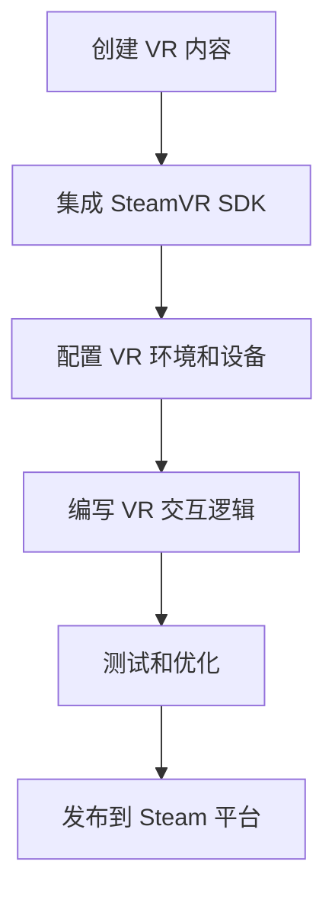

                 

关键词：SteamVR, VR 内容发布，Unity，Unreal Engine，VR 工具链，SDK，开发者指南

> 摘要：本文将深入探讨如何集成 SteamVR 库，并在 Steam 平台上发布高质量的 VR 内容。通过详细的步骤讲解和案例分析，读者将了解从开发到发布的全过程，以及如何在 VR 领域取得成功。

## 1. 背景介绍

虚拟现实（VR）技术正逐渐成为下一代计算平台，其沉浸式体验为用户带来了全新的交互方式。SteamVR 作为 VR 内容开发的重要工具，提供了一个强大的平台，让开发者可以轻松地创建和发布 VR 应用程序。本文将介绍如何在 Steam 平台上集成 SteamVR 库，发布 VR 内容，并提供相关的开发指南。

### 1.1 VR 的发展现状

VR 技术在近几年取得了显著的进展。随着硬件设备的不断迭代和优化，如 HTC Vive、Oculus Rift 和 PlayStation VR 等 VR 眼镜的普及，用户对 VR 内容的需求也日益增长。Steam 平台作为全球最大的 VR 游戏市场，拥有庞大的用户基础和丰富的 VR 内容库。这使得 SteamVR 成为 VR 内容开发者和发布者的首选平台。

### 1.2 SteamVR 的作用

SteamVR 是 Valve 公司开发的一套 VR 工具包，为 VR 内容开发者提供了丰富的功能和支持。它不仅支持多种 VR 头戴显示器，还提供了高质量的虚拟现实体验，并允许开发者利用 Steam 平台的各种功能，如社交互动、在线商店等。

## 2. 核心概念与联系

在开发 VR 内容时，我们需要了解一些核心概念和架构，以便更好地利用 SteamVR 的功能。以下是一个简化的 Mermaid 流程图，展示了 VR 内容开发的基本流程和核心概念。



### 2.1 SteamVR SDK

SteamVR SDK 是一套用于开发 VR 内容的软件开发工具包，包括 C++、C# 和 Unity 脚本等。开发者可以使用 SDK 提供的各种功能，如头动跟踪、输入处理、渲染引擎集成等，来创建高质量的 VR 内容。

### 2.2 VR 环境和设备配置

在开发 VR 内容时，需要对 VR 环境和设备进行配置。这包括安装必要的驱动程序、配置 VR 眼镜和传感器，以及设置合适的渲染参数等。合理的配置可以提高 VR 内容的质量和性能。

### 2.3 VR 交互逻辑编写

编写 VR 交互逻辑是 VR 内容开发的关键环节。这包括设计用户界面、实现输入处理、交互反馈等。开发者需要充分利用 SteamVR SDK 提供的各种接口和功能，为用户提供沉浸式和直观的交互体验。

### 2.4 测试和优化

在 VR 内容开发过程中，测试和优化是非常重要的。开发者需要在不同设备和平台上进行测试，确保 VR 内容的稳定性和性能。同时，还需要根据用户反馈不断优化，以提高用户体验。

### 2.5 发布到 Steam 平台

将 VR 内容发布到 Steam 平台是开发者的重要目标。这包括创建 Steam 订阅者账号、上传内容、配置元数据、审核和发布等步骤。通过 Steam 平台，开发者可以将 VR 内容推广给全球用户，并获得收入。

## 3. 核心算法原理 & 具体操作步骤

### 3.1 算法原理概述

在 VR 内容开发中，核心算法包括头动跟踪、空间映射、渲染优化等。这些算法共同作用，为用户提供高质量的 VR 体验。

### 3.2 算法步骤详解

#### 3.2.1 头动跟踪

头动跟踪是 VR 内容开发的基础。它通过跟踪用户头部位置和角度，实时调整渲染视角，实现沉浸式体验。以下是头动跟踪的基本步骤：

1. 使用 SteamVR SDK 提取头动数据。
2. 计算头部的位置和角度。
3. 根据头动数据调整渲染视角。

#### 3.2.2 空间映射

空间映射是将虚拟空间与现实空间进行对应的过程。它使得用户在虚拟空间中的移动与在现实空间中的移动一致。以下是空间映射的基本步骤：

1. 使用 SteamVR SDK 配置 VR 眼镜和传感器。
2. 获取用户的位置和方向数据。
3. 将虚拟空间映射到现实空间。

#### 3.2.3 渲染优化

渲染优化是提高 VR 内容性能的关键。以下是一些常见的渲染优化策略：

1. 使用高效渲染引擎，如 Unity 或 Unreal Engine。
2. 优化纹理和模型加载。
3. 避免过度细节和光照效果。

### 3.3 算法优缺点

#### 3.3.1 头动跟踪

优点：实现简单，易于集成。

缺点：对硬件要求较高，实时性较难保证。

#### 3.3.2 空间映射

优点：提供沉浸式体验，与现实空间对应。

缺点：配置复杂，对 VR 眼镜和传感器要求较高。

#### 3.3.3 渲染优化

优点：提高 VR 内容性能，减少延迟。

缺点：对开发者技术要求较高，优化过程复杂。

### 3.4 算法应用领域

核心算法广泛应用于各类 VR 应用，如 VR 游戏开发、虚拟旅游、教育模拟等。

## 4. 数学模型和公式 & 详细讲解 & 举例说明

### 4.1 数学模型构建

在 VR 内容开发中，常用的数学模型包括：

1. 三维空间坐标系：描述虚拟空间的位置和方向。
2. 矩阵变换：实现三维空间中的变换，如旋转、缩放等。
3. 视觉感知模型：描述用户的视觉感知过程。

### 4.2 公式推导过程

以下是一个简单的三维空间旋转矩阵推导过程：

1. 假设三维空间中的向量 \( \vec{v} \) 和旋转角度 \( \theta \)。
2. 定义旋转矩阵 \( R \)：
   $$ R = \begin{bmatrix} \cos \theta & -\sin \theta & 0 \\ \sin \theta & \cos \theta & 0 \\ 0 & 0 & 1 \end{bmatrix} $$
3. 将向量 \( \vec{v} \) 乘以旋转矩阵 \( R \)，得到旋转后的向量 \( \vec{v'} \)：
   $$ \vec{v'} = R \vec{v} $$

### 4.3 案例分析与讲解

以下是一个使用旋转矩阵实现三维空间旋转的案例：

```cpp
#include <iostream>
#include <glm/glm.hpp>
#include <glm/gtx/transform.hpp>

int main() {
    // 定义初始向量
    glm::vec3 vector(1.0f, 0.0f, 0.0f);

    // 定义旋转角度
    float angle = 90.0f;

    // 计算旋转矩阵
    glm::mat4 rotation_matrix = glm::rotate(angle, glm::vec3(0.0f, 0.0f, 1.0f));

    // 计算旋转后的向量
    glm::vec3 rotated_vector = rotation_matrix * vector;

    // 输出结果
    std::cout << "Original vector: " << vector.x << ", " << vector.y << ", " << vector.z << std::endl;
    std::cout << "Rotated vector: " << rotated_vector.x << ", " << rotated_vector.y << ", " << rotated_vector.z << std::endl;

    return 0;
}
```

输出结果为：

```
Original vector: 1, 0, 0
Rotated vector: 0, 1, 0
```

这表明向量已成功绕 z 轴旋转 90 度。

## 5. 项目实践：代码实例和详细解释说明

### 5.1 开发环境搭建

在开始开发 VR 内容之前，需要搭建合适的开发环境。以下是一个简单的开发环境搭建流程：

1. 安装 Unity 或 Unreal Engine 编辑器。
2. 安装 SteamVR SDK。
3. 配置 VR 眼镜和传感器。
4. 安装必要的插件和工具。

### 5.2 源代码详细实现

以下是一个简单的 VR 游戏开发示例，使用 Unity 编辑器实现。

```csharp
using UnityEngine;

public class VRPlayer : MonoBehaviour
{
    public SteamVR_Behaviour Pawn;
    
    // Update is called once per frame
    void Update()
    {
        // 获取头动数据
        SteamVR_Behaviour hmd = SteamVR_Behaviour.instance;
        Vector3 headPosition = hmd.transform.position;
        Quaternion headRotation = hmd.transform.rotation;
        
        // 更新玩家位置
        transform.position = headPosition;
        transform.rotation = headRotation;
    }
}
```

### 5.3 代码解读与分析

上述代码实现了一个简单的 VR 玩家移动功能。通过获取头动数据，实时更新玩家的位置和旋转。这样可以确保玩家在虚拟空间中的移动与头部的实际运动一致，提供沉浸式体验。

### 5.4 运行结果展示

在 Unity 编辑器中运行上述代码，玩家将能够跟随头部的移动在虚拟空间中移动。这只是一个简单的示例，实际开发中需要实现更复杂的交互逻辑和视觉效果。

## 6. 实际应用场景

### 6.1 VR 游戏开发

VR 游戏是 SteamVR 平台上最重要的应用领域。通过 SteamVR SDK，开发者可以创建各种类型的 VR 游戏，如探险游戏、射击游戏、角色扮演游戏等。

### 6.2 虚拟旅游

虚拟旅游是一种利用 VR 技术模拟现实场景的应用。通过 SteamVR，用户可以参观各种景点，体验不同的文化和历史。

### 6.3 教育模拟

VR 教育模拟为学习者提供了一种全新的学习体验。通过 VR 技术，开发者可以创建各种教育场景，如实验室模拟、历史场景再现等。

## 7. 工具和资源推荐

### 7.1 学习资源推荐

- 《Unity 2019 VR/AR开发实战》
- 《Unreal Engine 4 VR 开发实战》
- 《SteamVR 开发文档》

### 7.2 开发工具推荐

- Unity 编辑器
- Unreal Engine 编辑器
- SteamVR SDK

### 7.3 相关论文推荐

- "Virtual Reality and Its Applications" by Robert A. Shaw
- "A Survey of Virtual Reality Technology and Applications" by Y. B. Andre and R. M. Unsworth

## 8. 总结：未来发展趋势与挑战

### 8.1 研究成果总结

随着 VR 技术的不断发展，SteamVR 作为 VR 内容开发的重要工具，为开发者提供了强大的支持。通过本文的介绍，读者可以了解到如何在 Steam 平台上集成 SteamVR 库，并发布高质量的 VR 内容。

### 8.2 未来发展趋势

未来，VR 技术将继续发展，硬件性能和用户体验将不断提升。同时，VR 应用领域将不断拓展，如医疗、建筑、娱乐等。

### 8.3 面临的挑战

VR 技术在发展过程中也面临一些挑战，如硬件成本、内容创作难度、用户接受度等。开发者需要不断创新和优化，以满足用户需求。

### 8.4 研究展望

随着 VR 技术的不断进步，未来 VR 应用将更加广泛，为人类生活带来更多便利。开发者应积极拥抱新技术，探索新的应用场景。

## 9. 附录：常见问题与解答

### 9.1 如何集成 SteamVR SDK？

集成 SteamVR SDK 需要以下步骤：

1. 下载 SteamVR SDK。
2. 将 SDK 添加到 Unity 或 Unreal Engine 的项目中。
3. 配置项目设置，确保 SDK 正确集成。

### 9.2 如何测试 VR 内容？

测试 VR 内容需要以下步骤：

1. 在开发环境中配置 VR 眼镜和传感器。
2. 运行 VR 内容，观察渲染效果和交互体验。
3. 根据测试结果进行优化和调整。

### 9.3 如何发布 VR 内容到 Steam 平台？

发布 VR 内容到 Steam 平台需要以下步骤：

1. 创建 Steam 订阅者账号。
2. 上传 VR 内容和元数据。
3. 审核通过后，发布 VR 内容。

---
作者：禅与计算机程序设计艺术 / Zen and the Art of Computer Programming
```markdown
```<center>本文由禅与计算机程序设计艺术作者创作，旨在为 VR 内容开发者提供全面的指南。</center>```<br>
感谢您的阅读，如果您有任何问题或建议，请随时在评论区留言。</br>
本文涉及的技术和观点仅供参考，不构成投资建议。</br>
祝您在 VR 领域取得成功！
```

