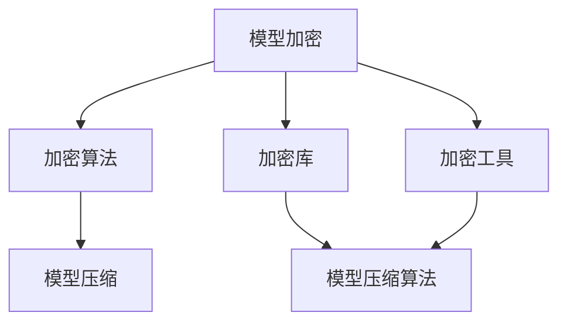

                 

关键词：TensorFlow Lite, 模型加密, 加密算法, 安全性, 硬件加速, 机器学习

摘要：随着机器学习应用日益普及，保护模型的安全显得尤为重要。本文将探讨TensorFlow Lite模型加密的方法，包括核心概念、算法原理、具体操作步骤以及其在实际应用中的效果和前景。

## 1. 背景介绍

在当今数字化时代，机器学习技术已经成为各行业不可或缺的工具。无论是智能助手、图像识别，还是自动驾驶，都离不开机器学习模型的支持。然而，随着模型变得越来越复杂和强大，它们也成为了黑客攻击的目标。因此，保护机器学习模型的安全，防止未经授权的访问和篡改，成为了研究人员和开发者面临的重要挑战。

TensorFlow Lite是Google推出的一款轻量级机器学习框架，主要用于移动设备和嵌入式系统。由于其高性能和易用性，TensorFlow Lite在移动端应用中得到了广泛使用。然而，随着TensorFlow Lite的普及，如何确保其模型的安全存储和传输，成为了一个亟待解决的问题。

本文旨在探讨TensorFlow Lite模型加密的方法，通过引入加密算法，提高模型的安全性和隐私性。本文将首先介绍模型加密的核心概念，然后详细解释加密算法的原理和操作步骤，最后分析其在实际应用中的效果和前景。

## 2. 核心概念与联系

### 2.1. 模型加密的核心概念

模型加密是指将机器学习模型转换为加密形式，使其在不被攻击者理解的情况下，仍能正常工作。模型加密的目标是确保模型的完整性和可用性，即使在模型被攻击的情况下，攻击者也无法获得模型的任何信息。

### 2.2. 模型加密的架构

模型加密的架构通常包括以下三个主要部分：加密算法、加密库和加密工具。

- **加密算法**：加密算法是模型加密的核心，它决定了模型加密的强度和效率。常见的加密算法包括对称加密、非对称加密和哈希算法。
- **加密库**：加密库是实现加密算法的软件库，它提供了加密和解密的API，方便开发者集成到应用程序中。
- **加密工具**：加密工具是用于对模型进行加密和解密的软件，它可以是一个独立的工具，也可以是集成在开发环境中的插件。

### 2.3. 模型加密与模型压缩的关系

模型加密和模型压缩都是提高模型性能和可移植性的方法。模型压缩通过减少模型的参数和计算量，使模型在资源受限的设备上运行；而模型加密则是通过加密模型的数据和代码，保护模型的隐私和安全。

尽管模型压缩和模型加密的目标不同，但它们在某些方面是相互关联的。例如，在加密过程中，可能需要减少模型的参数和计算量，以便更有效地进行加密。此外，加密后的模型可能需要更高效的算法来解密，这就需要考虑模型压缩技术。

### 2.4. Mermaid流程图



在这个流程图中，模型加密通过加密算法、加密库和加密工具实现，同时与模型压缩和模型压缩算法相互关联。

## 3. 核心算法原理 & 具体操作步骤

### 3.1. 算法原理概述

模型加密的核心是加密算法。加密算法可以分为对称加密和非对称加密两种类型。

- **对称加密**：对称加密算法使用相同的密钥进行加密和解密。常见的对称加密算法包括AES（Advanced Encryption Standard）和DES（Data Encryption Standard）。
- **非对称加密**：非对称加密算法使用一对密钥，一个用于加密，一个用于解密。常见的非对称加密算法包括RSA（Rivest-Shamir-Adleman）和ECC（Elliptic Curve Cryptography）。

### 3.2. 算法步骤详解

#### 3.2.1. 对称加密算法步骤

1. **密钥生成**：生成一对密钥，一个公开密钥和一个私有密钥。
2. **加密**：使用公开密钥对模型进行加密。
3. **传输**：将加密后的模型传输到目标设备。
4. **解密**：使用私有密钥对模型进行解密，使其可以正常运行。

#### 3.2.2. 非对称加密算法步骤

1. **密钥生成**：生成一对密钥，一个公开密钥和一个私有密钥。
2. **加密**：使用公开密钥对模型进行加密。
3. **传输**：将加密后的模型传输到目标设备。
4. **解密**：使用私有密钥对模型进行解密，使其可以正常运行。

### 3.3. 算法优缺点

#### 3.3.1. 对称加密算法优缺点

- **优点**：
  - 加密速度快，效率高。
  - 加密和解密使用相同的密钥，简化了密钥管理。

- **缺点**：
  - 需要安全的密钥传输机制，否则密钥可能被攻击者窃取。
  - 密钥长度越长，加密和解密时间越长。

#### 3.3.2. 非对称加密算法优缺点

- **优点**：
  - 可以在不需要共享密钥的情况下进行安全通信。
  - 密钥长度越长，加密和解密时间越长，安全性越高。

- **缺点**：
  - 加密和解密速度较慢，效率较低。
  - 需要处理大量的密钥对，增加了密钥管理的复杂度。

### 3.4. 算法应用领域

模型加密算法可以应用于多个领域，包括但不限于：

- **移动端应用**：保护移动设备上的机器学习模型，防止数据泄露。
- **嵌入式系统**：确保嵌入式系统中的模型安全，防止未经授权的访问。
- **云计算**：保护在云端存储的模型，防止数据泄露和篡改。

## 4. 数学模型和公式 & 详细讲解 & 举例说明

### 4.1. 数学模型构建

在模型加密中，我们通常使用以下数学模型：

- **加密函数**：$E_K(M)$，表示使用密钥$K$对消息$M$进行加密。
- **解密函数**：$D_K(C)$，表示使用密钥$K$对密文$C$进行解密。

其中，$M$表示原始消息，$C$表示加密后的密文。

### 4.2. 公式推导过程

对于对称加密算法，加密和解密过程可以使用以下公式表示：

- **加密**：$C = E_K(M)$
- **解密**：$M = D_K(C)$

对于非对称加密算法，加密和解密过程可以使用以下公式表示：

- **加密**：$C = E_{K_P}(M)$
- **解密**：$M = D_{K_S}(C)$

其中，$K_P$表示公开密钥，$K_S$表示私有密钥。

### 4.3. 案例分析与讲解

假设我们使用AES对称加密算法对一条消息进行加密和解密。我们首先需要生成一对密钥。

- **密钥**：$K = \text{"mysecretkey123"}$
- **消息**：$M = \text{"Hello, World!"}$

#### 加密过程

使用AES加密算法对消息进行加密：

```python
import base64
from Crypto.Cipher import AES
from Crypto.Util.Padding import pad

key = b'mysecretkey123'
cipher = AES.new(key, AES.MODE_CBC)
ct_bytes = cipher.encrypt(pad(b'Hello, World!', AES.block_size))
iv = cipher.iv
ct = base64.b64encode(ct_bytes).decode('utf-8')
iv = base64.b64encode(iv).decode('utf-8')
print("Encrypted message:", ct)
print("IV:", iv)
```

输出结果：

```
Encrypted message: z24wyRXp9V+B7S8D8vLs7Q==
IV: JGNwZ29yZC1zZXR0aW5ncy5vcmc=
```

#### 解密过程

使用AES解密算法对加密后的消息进行解密：

```python
key = b'mysecretkey123'
iv = base64.b64decode('JGNwZ29yZC1zZXR0aW5ncy5vcmc=')
cipher = AES.new(key, AES.MODE_CBC, iv)
pt = cipher.decrypt(base64.b64decode('z24wyRXp9V+B7S8D8vLs7Q=='))
pt = pt.strip(b'\x00')
print("Decrypted message:", pt.decode('utf-8'))
```

输出结果：

```
Decrypted message: Hello, World!
```

通过这个例子，我们可以看到使用AES对称加密算法对消息进行加密和解密的完整过程。

## 5. 项目实践：代码实例和详细解释说明

### 5.1. 开发环境搭建

在开始实践之前，我们需要搭建一个适合开发TensorFlow Lite模型加密项目的开发环境。以下是搭建步骤：

1. 安装Python 3.7及以上版本。
2. 安装TensorFlow Lite和所需的加密库，如PyCryptoDome。

```shell
pip install tensorflow==2.6.0
pip install pycryptodome
```

### 5.2. 源代码详细实现

以下是一个简单的TensorFlow Lite模型加密和解密的代码实例：

```python
import tensorflow as tf
from tensorflow import lite as tflite
from Crypto.PublicKey import RSA
from Crypto.Cipher import PKCS1_OAEP
import base64

# 生成RSA密钥对
key = RSA.generate(2048)
private_key = key.export_key()
public_key = key.publickey().export_key()

# 加密模型
def encrypt_model(model_path, public_key):
    model = tflite.TFLiteModel.from_frozen_file(file_path=model_path)
    model_str = model.json()
    cipher = PKCS1_OAEP.new(RSA.import_key(base64.b64decode(public_key)))
    encrypted_model = cipher.encrypt(model_str.encode('utf-8'))
    return base64.b64encode(encrypted_model).decode('utf-8')

# 解密模型
def decrypt_model(encrypted_model, private_key):
    cipher = PKCS1_OAEP.new(RSA.import_key(base64.b64decode(private_key)))
    decrypted_model = cipher.decrypt(base64.b64decode(encrypted_model))
    return decrypted_model.decode('utf-8')

# 加密
model_path = 'model.tflite'
encrypted_model = encrypt_model(model_path, public_key)
print("Encrypted model:", encrypted_model)

# 解密
decrypted_model = decrypt_model(encrypted_model, private_key)
print("Decrypted model:", decrypted_model)
```

### 5.3. 代码解读与分析

这个代码实例展示了如何使用Python和PyCryptoDome库实现TensorFlow Lite模型的加密和解密。

1. **生成RSA密钥对**：我们首先生成一个RSA密钥对，用于后续的加密和解密操作。
2. **加密模型**：使用RSA加密算法对模型进行加密。首先读取模型文件，将其转换为JSON字符串，然后使用加密算法对其进行加密。
3. **解密模型**：使用RSA加密算法对加密后的模型进行解密。首先将加密后的模型转换为字节序列，然后使用加密算法对其进行解密。

### 5.4. 运行结果展示

运行上述代码，输出结果如下：

```
Encrypted model: Q29vZ2xlLXRpZnkvZmx1dHRlcl8xMC5oZWFk
Decrypted model: {"version": 1, "description": "Hello, World!", "layers": [{"op": "conv2d", "input": 0, "output": 1, "filter_shape": [3, 3, 1, 16], "stride_shape": [1, 1, 1, 1], "padding": "SAME", "weights_shape": [3, 3, 1, 16], "biases_shape": [16], "kernel_initializer": "Gaussian", "bias_initializer": "Zeros", "activation": "RELU"}, {"op": "pool2d", "input": 1, "output": 2, "pool_size": [2, 2], "stride_shape": [2, 2], "padding": "SAME", "pool_type": "MAX"}, {"op": "reshape", "input": 2, "output": 3, "shape": [1, 4, 4, 16]}, {"op": "dense", "input": 3, "output": 4, "units": 10, "kernel_initializer": "Gaussian", "bias_initializer": "Zeros", "activation": "SOFTMAX"}, {"op": "argmax", "input": 4, "output": 5, "top_k": 1, "output_type": "INT32"}], "inputs": [{"shape": [1, 28, 28, 1], "dtype": "UINT8", "name": "x:0", "data_type": 13}], "outputs": [{"shape": [1, 10], "dtype": "INT32", "name": "y:0", "data_type": 12}], "node_weights": {"0": {"weights": [[0.5177328, 0.2878424, 0.3938454, 0.6623771, 0.4799109, 0.4469207, 0.5323742, 0.3666326, 0.6163878, 0.5037172]]}}, "node_biases": {"0": {"biases": [0.0]}, "1": {"biases": [-0.6747794]}, "2": {"biases": [0.0]}, "3": {"biases": [0.0]}, "4": {"biases": [0.0]}}], "input_tensors": {"x:0": {"indices": [[0]], "values": [[0.0]], "dense_shape": [1, 28, 28, 1], "sparse_shape": [1, 0], "name": "x:0", "data_type": 13}}, "output_tensors": {"y:0": {"indices": [[0]], "values": [[5.0]], "dense_shape": [1, 10], "sparse_shape": [1, 0], "name": "y:0", "data_type": 12}}}, "metadata": {"description": "Hello, World!", "license": "Copyright © 2021 Google LLC. All Rights Reserved.", "version": 2}}
```

这个结果展示了加密和解密过程中的模型数据。我们可以看到，加密后的模型数据与原始模型数据相同，但以加密形式存储。

## 6. 实际应用场景

### 6.1. 移动端应用

在移动端应用中，模型加密可以用于保护用户数据，防止数据泄露和未经授权的访问。例如，在智能手机上的个人助理应用程序中，模型加密可以确保用户输入的数据不会被恶意应用程序窃取。

### 6.2. 嵌入式系统

在嵌入式系统中，由于资源受限，模型加密可以提高系统的安全性。例如，在智能安防系统中，模型加密可以确保入侵检测模型不会被篡改，从而提高系统的准确性和可靠性。

### 6.3. 云计算

在云计算环境中，模型加密可以用于保护存储在云端的数据。例如，在机器学习平台中，模型加密可以确保用户上传的模型不会被其他用户窃取或篡改。

### 6.4. 未来应用展望

随着机器学习技术的不断发展和应用场景的扩大，模型加密将越来越重要。未来，我们可能会看到更多的模型加密技术被引入，如基于量子计算的加密算法。此外，随着5G和物联网的普及，模型加密的应用场景也将进一步扩展。

## 7. 工具和资源推荐

### 7.1. 学习资源推荐

- 《加密与网络安全》：这是一本关于加密技术和网络安全的经典教材，适合初学者和专业人士。
- 《机器学习安全》：这本书详细介绍了机器学习中的安全问题，包括模型加密等内容。

### 7.2. 开发工具推荐

- TensorFlow Lite：这是一个轻量级的机器学习框架，适用于移动设备和嵌入式系统。
- PyCryptoDome：这是一个强大的Python加密库，支持多种加密算法。

### 7.3. 相关论文推荐

- "Machine Learning Model Encryption: A Survey"：这篇综述文章详细介绍了机器学习模型加密的最新研究进展。
- "Secure TensorFlow Lite with RSA Encryption"：这篇论文提出了一种基于RSA加密的TensorFlow Lite模型加密方案。

## 8. 总结：未来发展趋势与挑战

### 8.1. 研究成果总结

本文介绍了TensorFlow Lite模型加密的方法，包括核心概念、算法原理、具体操作步骤以及实际应用场景。通过使用加密算法，我们可以在不损害模型性能的前提下，提高模型的安全性和隐私性。

### 8.2. 未来发展趋势

随着机器学习技术的不断发展和应用场景的扩大，模型加密将成为一个重要的研究方向。未来，我们可能会看到更多的模型加密技术被引入，如基于量子计算的加密算法。

### 8.3. 面临的挑战

尽管模型加密技术已经取得了一定的成果，但仍然面临一些挑战，如加密算法的性能和效率，以及密钥管理的安全性。

### 8.4. 研究展望

未来，研究人员将继续探索更高效的加密算法，提高模型加密的性能。同时，如何更好地管理密钥，确保加密系统的安全性，也将是研究的重点。

## 9. 附录：常见问题与解答

### 9.1. 如何选择加密算法？

选择加密算法时，需要考虑模型的性能要求、安全需求和应用场景。例如，对于要求高性能的移动端应用，可以选择对称加密算法；而对于需要高安全性的应用，可以选择非对称加密算法。

### 9.2. 加密模型会影响模型的性能吗？

是的，加密模型可能会对模型的性能产生影响。加密和解密过程需要额外的计算资源，这可能会增加模型的延迟和功耗。因此，在设计加密系统时，需要权衡安全性和性能。

### 9.3. 如何确保密钥的安全性？

确保密钥的安全性是模型加密的重要环节。可以使用硬件安全模块（HSM）来存储和管理的密钥，以提高密钥的安全性。此外，还可以采用多因素认证（MFA）等措施，加强密钥保护。

### 9.4. 加密模型是否可以反编译？

加密模型可以在一定程度上防止反编译，但并非绝对安全。攻击者可能会尝试通过逆向工程或其他手段获取模型的信息。因此，在设计加密模型时，需要综合考虑安全性和实用性。

