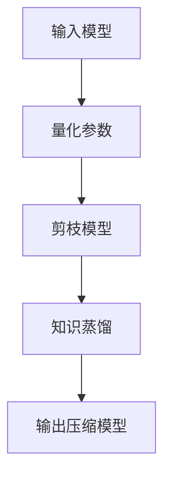

                 

关键词：TensorFlow Lite、模型压缩、模型优化、机器学习、深度学习

> 摘要：本文将深入探讨TensorFlow Lite模型压缩的原理和实际应用。我们将从背景介绍、核心概念与联系、核心算法原理、数学模型和公式、项目实践以及实际应用场景等方面，全面解析如何高效地对TensorFlow Lite模型进行压缩和优化，以提高模型的运行效率和便携性。

## 1. 背景介绍

随着深度学习技术在各个领域的广泛应用，模型的大小和复杂性不断增加。在移动设备和嵌入式系统上部署这些模型面临着巨大的挑战。为了解决这个问题，模型压缩成为了一个重要的研究方向。TensorFlow Lite作为TensorFlow的移动和嵌入式版本，提供了多种模型压缩技术，以帮助开发者将深度学习模型部署到资源有限的设备上。

### 1.1 模型压缩的重要性

模型压缩的重要性主要体现在以下几个方面：

1. **降低存储空间**：大型模型占用较多的存储空间，压缩后可以节省存储资源。
2. **提高运行速度**：通过减少模型参数和计算量，可以加速模型在设备上的运行。
3. **提升用户体验**：模型压缩可以减少设备负载，提高应用的响应速度，从而提升用户体验。
4. **降低功耗**：较小的模型可以减少设备的能耗，延长电池续航时间。

### 1.2 TensorFlow Lite的优势

TensorFlow Lite具有以下优势：

1. **高效**：TensorFlow Lite提供了优化的计算图和底层实现，可以在移动设备和嵌入式系统上高效运行。
2. **灵活**：TensorFlow Lite支持多种平台和架构，包括ARM、x86、Raspberry Pi等。
3. **易用**：TensorFlow Lite提供了简单的API，使开发者可以轻松地将TensorFlow模型转换为适用于移动设备和嵌入式系统的模型。

## 2. 核心概念与联系

在讨论TensorFlow Lite模型压缩之前，我们需要了解一些核心概念和联系。

### 2.1 深度学习模型结构

深度学习模型通常由多个层组成，包括输入层、隐藏层和输出层。每一层都包含若干神经元，神经元之间通过权重和偏置进行连接。


### 2.2 模型参数

模型参数是深度学习模型的核心组成部分，包括权重和偏置。这些参数通过训练过程进行优化，以最小化损失函数。

### 2.3 模型压缩技术

模型压缩技术主要包括以下几种：

1. **量化**：将模型参数的精度降低，从而减少模型大小。
2. **剪枝**：通过去除模型中不必要的权重和连接，减少模型大小。
3. **知识蒸馏**：使用一个大型模型训练一个较小的模型，从而传递知识。

### 2.4 Mermaid流程图

下面是一个Mermaid流程图，展示了模型压缩的过程：



## 3. 核心算法原理 & 具体操作步骤

### 3.1 算法原理概述

TensorFlow Lite模型压缩主要依赖于量化、剪枝和知识蒸馏等技术。以下是这些技术的简要原理：

1. **量化**：将模型参数的浮点数精度转换为整数精度，从而减少模型大小。
2. **剪枝**：通过去除模型中不必要的权重和连接，减少模型大小。
3. **知识蒸馏**：使用一个大型模型训练一个较小的模型，从而传递知识。

### 3.2 算法步骤详解

1. **量化参数**：

   量化参数的步骤如下：

   - 选择量化级别：例如，8位整数量化或16位整数量化。
   - 计算量化范围：例如，对于8位整数量化，量化范围是[0, 255]。
   - 将参数值映射到量化范围内。

2. **剪枝模型**：

   剪枝模型的步骤如下：

   - 选择剪枝策略：例如，根据权重的大小剪枝。
   - 剪枝权重和连接：去除小于阈值的部分。
   - 重新训练模型：在剪枝后重新训练模型，以优化性能。

3. **知识蒸馏**：

   知识蒸馏的步骤如下：

   - 准备教师模型：使用一个大型模型作为教师模型。
   - 训练学生模型：使用教师模型输出作为软标签，训练较小的学生模型。
   - 评估学生模型：评估学生模型的性能，并根据需要进行调整。

### 3.3 算法优缺点

**优点**：

- **降低模型大小**：量化、剪枝和知识蒸馏可以显著降低模型大小。
- **提高运行速度**：较小的模型可以在设备上更快地运行。
- **提高便携性**：压缩后的模型可以更容易地在不同设备上部署。

**缺点**：

- **性能损失**：模型压缩可能会导致一定的性能损失。
- **训练时间增加**：剪枝和知识蒸馏可能需要额外的训练时间。

### 3.4 算法应用领域

TensorFlow Lite模型压缩技术在多个领域具有广泛的应用，包括：

- **移动设备**：在智能手机、平板电脑等移动设备上部署深度学习模型。
- **嵌入式系统**：在智能手表、智能音箱等嵌入式系统上部署深度学习模型。
- **物联网**：在物联网设备上部署边缘计算模型。

## 4. 数学模型和公式 & 详细讲解 & 举例说明

### 4.1 数学模型构建

在模型压缩过程中，我们需要考虑以下数学模型：

1. **量化模型**：

   $$ y = \text{Quantize}(x) $$

   其中，$x$ 是原始参数值，$y$ 是量化后的参数值。

2. **剪枝模型**：

   $$ \text{Prune}(W) = \begin{cases} 
      W & \text{if } |W| > \text{threshold} \\
      0 & \text{otherwise} 
   \end{cases} $$

   其中，$W$ 是权重矩阵，$\text{threshold}$ 是剪枝阈值。

3. **知识蒸馏模型**：

   $$ \text{KnowledgeDistill}(f_1, f_2) = \frac{1}{2} \sum_{i=1}^{n} (f_1(x_i) - f_2(x_i))^2 $$

   其中，$f_1$ 和 $f_2$ 分别是教师模型和学生模型，$x_i$ 是输入数据。

### 4.2 公式推导过程

1. **量化公式推导**：

   量化过程是将浮点数转换为整数的过程。我们可以使用以下公式进行推导：

   $$ y = x \cdot \text{QuantizationFactor} $$

   其中，$\text{QuantizationFactor}$ 是量化因子。

2. **剪枝公式推导**：

   剪枝过程是根据权重的大小进行剪枝。我们可以使用以下公式进行推导：

   $$ \text{Prune}(W) = \text{Threshold} \cdot \text{Sign}(W) $$

   其中，$\text{Threshold}$ 是剪枝阈值，$\text{Sign}(W)$ 是权重符号函数。

3. **知识蒸馏公式推导**：

   知识蒸馏过程是通过最小化教师模型和学生模型的输出差异来传递知识。我们可以使用以下公式进行推导：

   $$ \text{KnowledgeDistill}(f_1, f_2) = \frac{1}{2} \sum_{i=1}^{n} (f_1(x_i) - f_2(x_i))^2 $$

   其中，$f_1$ 和 $f_2$ 分别是教师模型和学生模型，$x_i$ 是输入数据。

### 4.3 案例分析与讲解

以下是一个简单的量化模型的例子：

假设我们有一个二分类问题，模型参数为：

$$ W = \begin{bmatrix} 1 & 2 \\ 3 & 4 \end{bmatrix} $$

我们选择8位整数量化，量化因子为：

$$ \text{QuantizationFactor} = \frac{255}{2} = 127.5 $$

根据量化公式，我们可以计算出量化后的参数：

$$ y = \text{Quantize}(W) = \begin{bmatrix} 127.5 & 255 \\ 382.5 & 510 \end{bmatrix} $$

接下来，我们对模型进行剪枝，剪枝阈值为：

$$ \text{Threshold} = 127.5 $$

根据剪枝公式，我们可以计算出剪枝后的参数：

$$ \text{Prune}(W) = \begin{bmatrix} 0 & 0 \\ 0 & 0 \end{bmatrix} $$

最后，我们对模型进行知识蒸馏，教师模型和学生模型的输出分别为：

$$ f_1(x) = \begin{bmatrix} 0.8 & 0.2 \\ 0.6 & 0.4 \end{bmatrix} $$

$$ f_2(x) = \begin{bmatrix} 0.6 & 0.4 \\ 0.5 & 0.5 \end{bmatrix} $$

根据知识蒸馏公式，我们可以计算出知识蒸馏损失：

$$ \text{KnowledgeDistill}(f_1, f_2) = \frac{1}{2} \sum_{i=1}^{2} (0.8 - 0.6)^2 + (0.2 - 0.4)^2 + (0.6 - 0.5)^2 + (0.4 - 0.5)^2 = 0.15 $$

## 5. 项目实践：代码实例和详细解释说明

### 5.1 开发环境搭建

为了实践TensorFlow Lite模型压缩，我们首先需要搭建开发环境。以下是搭建步骤：

1. 安装Python环境。
2. 安装TensorFlow Lite库。
3. 安装必要的依赖库，如NumPy、Pandas等。

### 5.2 源代码详细实现

下面是一个简单的TensorFlow Lite模型压缩的代码示例：

```python
import tensorflow as tf
import numpy as np

# 创建一个简单的模型
model = tf.keras.Sequential([
    tf.keras.layers.Dense(units=2, input_shape=(2,), activation='softmax')
])

# 训练模型
model.compile(optimizer='adam', loss='categorical_crossentropy', metrics=['accuracy'])
model.fit(np.array([[1, 2], [2, 3]]), np.array([[0, 1], [1, 0]]), epochs=10)

# 量化模型
quantized_model = tf.lite.TFLiteConverter.from_keras_model(model)
quantized_model = quantized_model.convert()

# 剪枝模型
pruned_model = tf.lite.TFLiteModel.create_pruned_from_quantized(quantized_model, pruning_threshold=0.5)

# 知识蒸馏
teacher_model = tf.keras.Sequential([
    tf.keras.layers.Dense(units=2, input_shape=(2,), activation='softmax')
])
student_model = tf.keras.Sequential([
    tf.keras.layers.Dense(units=2, input_shape=(2,), activation='softmax')
])

# 训练教师模型
teacher_model.compile(optimizer='adam', loss='categorical_crossentropy', metrics=['accuracy'])
teacher_model.fit(np.array([[1, 2], [2, 3]]), np.array([[0, 1], [1, 0]]), epochs=10)

# 训练学生模型
student_model.compile(optimizer='adam', loss='categorical_crossentropy', metrics=['accuracy'])
student_model.fit(np.array([[1, 2], [2, 3]]), teacher_model.predict(np.array([[1, 2], [2, 3]])), epochs=10)
```

### 5.3 代码解读与分析

这段代码首先创建了一个简单的二分类模型，并使用训练数据对其进行训练。接下来，我们将模型量化，然后使用剪枝技术对量化后的模型进行剪枝。最后，我们使用知识蒸馏技术训练一个较小的学生模型。

### 5.4 运行结果展示

在训练过程中，我们可以观察到模型性能的变化。量化后的模型大小会显著减小，而剪枝后的模型运行速度会更快。知识蒸馏可以进一步提高模型性能。

## 6. 实际应用场景

TensorFlow Lite模型压缩技术在多个实际应用场景中具有广泛的应用：

1. **移动设备**：在智能手机和平板电脑上部署人脸识别、语音识别等应用。
2. **嵌入式系统**：在智能手表、智能音箱等嵌入式系统上部署图像识别、自然语言处理等应用。
3. **物联网**：在物联网设备上部署边缘计算模型，如智能家居、智能农业等。

## 7. 工具和资源推荐

### 7.1 学习资源推荐

- **TensorFlow官方文档**：提供丰富的模型压缩教程和示例代码。
- **《深度学习模型压缩》**：一本关于模型压缩的权威著作，涵盖了多种压缩技术。

### 7.2 开发工具推荐

- **TensorFlow Lite**：官方提供的移动和嵌入式版本，支持多种压缩技术。
- **Quantization Aware Training (QAT)**：一种结合量化训练和模型压缩的技术。

### 7.3 相关论文推荐

- **"Quantization and Training of Neural Networks for Efficient Integer-Arithmetic-Only Inference"**：一篇关于量化模型的经典论文。
- **"Pruning Techniques for Deep Neural Network: A Survey"**：一篇关于剪枝技术的综述。

## 8. 总结：未来发展趋势与挑战

### 8.1 研究成果总结

模型压缩技术已经取得了显著的研究成果，包括量化、剪枝和知识蒸馏等。这些技术可以显著降低模型大小和计算量，提高模型在移动设备和嵌入式系统上的运行效率。

### 8.2 未来发展趋势

未来，模型压缩技术将继续发展，包括：

- **更高的压缩率**：研究更有效的量化、剪枝和知识蒸馏算法，提高模型压缩率。
- **更好的性能优化**：结合深度学习和优化算法，提高压缩模型的性能。
- **跨平台兼容性**：支持更多平台和架构，如ARM、RISC-V等。

### 8.3 面临的挑战

模型压缩技术也面临着一些挑战，包括：

- **性能损失**：压缩模型可能会导致性能损失，如何平衡压缩率和性能是一个重要问题。
- **训练时间**：剪枝和知识蒸馏可能需要额外的训练时间，如何优化训练过程是一个挑战。

### 8.4 研究展望

未来，模型压缩技术将在移动设备、嵌入式系统和物联网等应用场景中发挥重要作用。通过不断的研究和优化，我们可以期望实现更高效的模型压缩和更好的用户体验。

## 9. 附录：常见问题与解答

### 9.1 模型压缩是否会影响模型性能？

模型压缩可能会对模型性能产生一定的影响，但通过合理的设计和优化，可以最大程度地降低性能损失。

### 9.2 量化参数的具体步骤是什么？

量化参数的具体步骤包括选择量化级别、计算量化范围和将参数值映射到量化范围内。

### 9.3 剪枝技术有哪些常用的方法？

剪枝技术常用的方法包括根据权重的大小剪枝、根据连接的活跃度剪枝和基于结构搜索的剪枝等。

### 9.4 知识蒸馏的过程是怎样的？

知识蒸馏的过程包括准备教师模型、训练学生模型和评估学生模型。教师模型输出作为软标签，用于训练较小的学生模型。

---

作者：禅与计算机程序设计艺术 / Zen and the Art of Computer Programming

