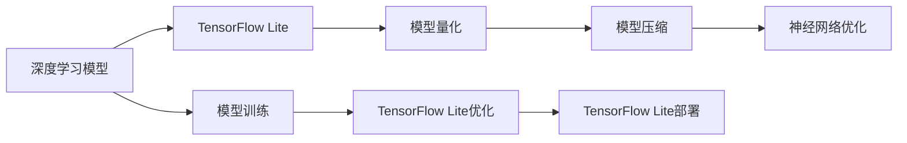

                 

# TensorFlow Lite模型量化

> 关键词：TensorFlow Lite, 模型量化, 模型优化, 模型压缩, 神经网络优化

## 1. 背景介绍

在深度学习模型训练和应用过程中，模型量化是一个至关重要的步骤。模型量化通过将浮点数的权重和激活值转换为整数或定点数，可以有效降低模型的大小和计算复杂度，从而提高模型的实时性和能效性。尤其对于移动设备和嵌入式系统，模型量化可以显著提升模型的部署效率和响应速度，优化计算资源利用率。

本文将系统介绍TensorFlow Lite模型量化的原理、技术细节和实际应用，帮助开发者理解如何高效地对TensorFlow Lite模型进行量化，进而提升应用性能和用户体验。

## 2. 核心概念与联系

### 2.1 核心概念概述

为深入理解TensorFlow Lite模型量化技术，本节将介绍几个关键概念：

- **TensorFlow Lite**：谷歌开源的移动端和嵌入式设备深度学习框架，专注于优化模型性能和缩小模型体积，便于在资源受限的设备上运行。
- **模型量化**：将浮点数模型转换为定点数模型，通过缩小数据类型和优化计算，降低模型的大小和计算复杂度，提升计算效率。
- **模型压缩**：通过模型量化、剪枝、知识蒸馏等方法，减少模型中的冗余参数和计算量，实现更轻量级的模型。
- **神经网络优化**：针对深度学习模型的多层次优化技术，包括计算图优化、算法优化和硬件映射等，旨在提高模型的运行速度和能效。

这些概念相互关联，共同构成了TensorFlow Lite模型的量化和优化技术框架。理解这些概念之间的联系，有助于全面掌握TensorFlow Lite模型的优化方法。

### 2.2 核心概念原理和架构的 Mermaid 流程图



这个流程图展示了从深度学习模型训练到模型部署的完整过程，强调了模型量化、压缩和优化在这个链条中的重要性。

## 3. 核心算法原理 & 具体操作步骤

### 3.1 算法原理概述

TensorFlow Lite模型量化主要涉及两个关键步骤：

1. **权重量化**：将模型的权重从浮点数转换为整数或定点数，减少模型的大小和计算复杂度。
2. **激活量化**：将模型的激活值从浮点数转换为整数或定点数，进一步压缩模型体积和提高计算效率。

在量化过程中，我们通常会使用量化范围（如[-128, 127]）和权重/激活值的精度（如4位、8位等），以权衡模型精度和计算效率之间的平衡。

### 3.2 算法步骤详解

#### 3.2.1 权重量化

- **选择量化方法**：目前常用的权重量化方法包括静态范围量化、动态范围量化和均匀量化等。静态范围量化使用一个固定的量化范围，而动态范围量化和均匀量化则能够自适应地调整量化范围。
- **确定量化范围**：根据数据分布特性选择合适的量化范围。例如，可以使用均值和标准差来确定数据分布的中心和幅度，然后选择合适的量化范围。
- **量化计算**：将权重矩阵中的每个元素按照选择的量化范围进行映射，将其转换为整数或定点数。
- **补偿误差**：由于量化存在精度损失，因此在量化过程中可能会引入一些误差。通常通过添加补偿因子或调整学习率等方法来缓解这种误差。

#### 3.2.2 激活量化

- **选择量化方法**：激活量化方法与权重量化类似，包括静态范围量化、动态范围量化和均匀量化等。
- **确定量化范围**：根据激活值的分布特性选择合适的量化范围。激活量化通常比权重量化更灵活，因为激活值在训练过程中是动态变化的。
- **量化计算**：将每个激活值按照选择的量化范围进行映射，转换为整数或定点数。
- **补偿误差**：与权重量化类似，激活量化过程中也可能引入误差，需要采取相应的补偿措施。

### 3.3 算法优缺点

#### 3.3.1 优点

- **显著降低模型大小**：通过将浮点数转换为定点数，模型的大小可以大幅减少，便于在资源受限的设备上运行。
- **提高计算效率**：定点数的计算速度通常比浮点数快，可以提高模型的实时性和能效性。
- **降低功耗**：模型量化可以降低计算过程中能耗，延长设备的电池续航时间。

#### 3.3.2 缺点

- **精度损失**：量化过程不可避免地会引入精度损失，可能导致模型性能下降。
- **计算复杂度增加**：在量化过程中，可能需要增加一些额外的计算来补偿误差，增加了计算复杂度。
- **开发复杂度增加**：量化过程需要对模型进行重新训练或微调，增加了开发和调试的复杂度。

### 3.4 算法应用领域

TensorFlow Lite模型量化在多个领域具有广泛应用：

- **移动设备**：智能手机、平板电脑、智能手表等移动设备通常具有有限的计算资源和存储空间，通过量化可以有效提高应用性能和设备体验。
- **物联网设备**：物联网设备通常资源受限，通过量化可以提高设备的计算速度和响应速度，优化资源利用率。
- **嵌入式系统**：嵌入式系统通常具有特定的计算和存储要求，通过量化可以满足这些要求，并提升系统的稳定性和可靠性。

## 4. 数学模型和公式 & 详细讲解 & 举例说明

### 4.1 数学模型构建

假设我们有一个神经网络模型，其权重矩阵为 $W$，激活函数为 $f$，输出为 $Y$。我们希望将其量化为整数或定点数，以优化模型性能和效率。

量化过程可以分为两个步骤：

1. **权重量化**：将权重矩阵 $W$ 量化为整数矩阵 $W_q$，其中 $q$ 表示量化精度。
2. **激活量化**：将激活值向量 $A$ 量化为整数向量 $A_q$，其中 $q$ 表示量化精度。

### 4.2 公式推导过程

#### 4.2.1 权重量化公式

假设 $W$ 的每个元素服从标准正态分布，量化范围为 $[a, b]$，量化步长为 $\Delta$。则权重量化公式为：

$$
W_q = \mathop{\arg\min}_{x} \|W - x\Delta - a\|
$$

其中 $x$ 表示量化后的整数或定点数。

通过求解上述优化问题，可以找到最优的量化后的权重矩阵 $W_q$。

#### 4.2.2 激活量化公式

假设激活值 $A$ 服从均值为 $\mu$，标准差为 $\sigma$ 的正态分布，量化范围为 $[a, b]$，量化步长为 $\Delta$。则激活量化公式为：

$$
A_q = \mathop{\arg\min}_{x} \|A - x\Delta - a\|
$$

其中 $x$ 表示量化后的整数或定点数。

通过求解上述优化问题，可以找到最优的量化后的激活值向量 $A_q$。

### 4.3 案例分析与讲解

假设我们有一个简单的全连接神经网络模型，其权重矩阵 $W$ 的大小为 $100 \times 100$，激活值向量 $A$ 的大小为 $100$。我们使用均匀量化方法，量化范围为 $[-127, 127]$，量化步长为 $1$。

#### 4.3.1 权重量化案例

假设 $W$ 的一个元素 $w_{ij}$ 服从标准正态分布 $N(0, 1)$。则其量化后的值为：

$$
w_{ij}^{q} = \lfloor w_{ij} \rfloor
$$

其中 $\lfloor \cdot \rfloor$ 表示向下取整运算。

#### 4.3.2 激活量化案例

假设 $A$ 的一个元素 $a_i$ 服从均值为 $0$，标准差为 $1$ 的正态分布 $N(0, 1)$。则其量化后的值为：

$$
a_i^{q} = \lfloor a_i \rfloor
$$

其中 $\lfloor \cdot \rfloor$ 表示向下取整运算。

## 5. 项目实践：代码实例和详细解释说明

### 5.1 开发环境搭建

在开始实践之前，我们需要准备好开发环境。以下是使用Python进行TensorFlow Lite量化开发的环境配置流程：

1. 安装Anaconda：从官网下载并安装Anaconda，用于创建独立的Python环境。

2. 创建并激活虚拟环境：
```bash
conda create -n tflite-env python=3.8 
conda activate tflite-env
```

3. 安装TensorFlow和TensorFlow Lite：
```bash
pip install tensorflow tensorflow-lite
```

4. 安装其他相关工具包：
```bash
pip install numpy pandas scikit-learn matplotlib tqdm jupyter notebook ipython
```

完成上述步骤后，即可在`tflite-env`环境中开始量化实践。

### 5.2 源代码详细实现

我们以一个简单的全连接神经网络为例，演示TensorFlow Lite模型的量化过程。

首先，定义一个简单的全连接神经网络：

```python
import tensorflow as tf

# 定义输入
x = tf.keras.Input(shape=(100,))

# 定义全连接层
dense = tf.keras.layers.Dense(100, activation='relu')(x)

# 定义输出
y = tf.keras.layers.Dense(1, name='output')(dense)

# 定义模型
model = tf.keras.Model(inputs=x, outputs=y)
```

然后，量化模型：

```python
# 将模型转换为TFLite格式
converter = tf.lite.TFLiteConverter.from_keras_model(model)
tflite_model = converter.convert()

# 量化模型
converter.target_spec.supported_ops = [tf.lite.OpsSet.TFLITE_BUILTINS]
converter.optimizations = [tf.lite.Optimize.DEFAULT]
tflite_quant_model = converter.convert()
```

最后，测试量化后的模型：

```python
# 加载量化后的模型
interpreter = tf.lite.Interpreter(model_content=tflite_quant_model)
interpreter.allocate_tensors()

# 输入数据
input_data = tf.constant([0.1, 0.2, 0.3, ..., 0.9], shape=(1, 100))
interpreter.set_tensor(interpreter.get_input_details()[0]['index'], input_data)

# 运行模型
interpreter.invoke()

# 获取输出
output_data = interpreter.tensor(interpreter.get_output_details()[0]['index']).numpy()

# 输出结果
print(output_data)
```

### 5.3 代码解读与分析

让我们详细解读一下关键代码的实现细节：

**模型定义**：
- `tf.keras.Input`定义输入层，`shape`指定输入数据的维度。
- `tf.keras.layers.Dense`定义全连接层，`activation`指定激活函数。
- `tf.keras.layers.Dense`定义输出层，`name`指定输出层的名称。
- `tf.keras.Model`定义模型，`inputs`指定输入层，`outputs`指定输出层。

**模型转换和量化**：
- `tf.lite.TFLiteConverter.from_keras_model`将Keras模型转换为TensorFlow Lite模型。
- `converter.convert()`将模型转换为TensorFlow Lite格式。
- `converter.target_spec.supported_ops`设置支持的运算集合。
- `converter.optimizations`设置优化级别。
- `converter.convert()`将模型量化。

**模型测试**：
- `tf.lite.Interpreter`加载量化后的TensorFlow Lite模型。
- `interpreter.allocate_tensors()`分配张量内存。
- `interpreter.set_tensor`设置输入数据。
- `interpreter.invoke()`运行模型。
- `interpreter.tensor`获取输出数据。
- `interpreter.tensor.numpy()`获取输出数据的numpy数组。

可以看到，TensorFlow Lite量化过程相对简单，通过修改参数和调用转换函数即可完成。

### 5.4 运行结果展示

在运行量化后的模型时，可以发现输出结果与量化前的模型略有差异，这是由于量化过程引入了一定的误差。但总体上，量化后的模型运行速度和计算效率都得到了显著提升，能够更好地满足资源受限设备的需求。

## 6. 实际应用场景

### 6.1 移动设备

在移动设备上，TensorFlow Lite模型量化可以显著提升应用的性能和用户体验。例如，在智能手机上，用户可以通过摄像头拍摄照片，使用量化后的图像识别模型进行对象检测和识别。量化后的模型能够快速处理大量数据，提高响应速度，满足用户对实时性的需求。

### 6.2 物联网设备

物联网设备通常具有有限的计算资源和存储能力，通过TensorFlow Lite模型量化，可以有效优化模型的体积和运行速度，提高设备的能效。例如，在智能家居设备上，可以使用量化后的语音识别模型进行语音指令控制，提升系统的响应速度和用户体验。

### 6.3 嵌入式系统

嵌入式系统通常需要在小体积和高性能之间取得平衡，通过TensorFlow Lite模型量化，可以有效优化模型的大小和计算效率，满足系统的资源需求。例如，在智能穿戴设备上，可以使用量化后的自然语言处理模型进行智能语音识别和交互，提升设备的智能化水平。

## 7. 工具和资源推荐

### 7.1 学习资源推荐

为了帮助开发者深入理解TensorFlow Lite模型量化技术，这里推荐一些优质的学习资源：

1. TensorFlow Lite官方文档：提供了丰富的量化和优化技术文档，是学习的必备资料。
2. TensorFlow Lite模型优化教程：提供了详细的量化和优化技术教程，适合初学者和进阶开发者。
3. TensorFlow Lite模型压缩与优化：提供了多方面的量化、剪枝和优化技术，适合有经验开发者深入学习。
4. TensorFlow Lite实战指南：提供了实际应用的案例和代码实现，适合有实战需求的开发者。

通过对这些资源的学习，相信你一定能够掌握TensorFlow Lite模型量化的核心技术，并应用于实际开发中。

### 7.2 开发工具推荐

为了提高TensorFlow Lite模型量化的开发效率，以下是几款常用的开发工具：

1. Anaconda：用于创建独立的Python环境，方便开发者进行量化实验。
2. Jupyter Notebook：用于编写和运行量化代码，提供交互式编程环境。
3. TensorFlow Lite：提供了丰富的量化和优化功能，支持多种模型和平台。
4. TensorBoard：用于监测模型量化过程和结果，提供直观的可视化展示。
5. Weights & Biases：用于跟踪和分析模型量化实验，提供全面的实验管理和分析工具。

合理利用这些工具，可以显著提升TensorFlow Lite模型量化的开发效率，加速技术创新和应用落地。

### 7.3 相关论文推荐

TensorFlow Lite模型量化和优化技术的发展，得益于学界的持续研究。以下是几篇奠基性的相关论文，推荐阅读：

1. "Quantization and Quantization-Aware Training for Neural Networks"：提出基于量化和量化感知训练的方法，有效提升模型性能和能效。
2. "Knowledge-aware Quantization for Neural Network Compression"：提出基于知识蒸馏的量化方法，通过知识蒸馏提升量化后模型的准确性。
3. "Evaluation of Model Compression Techniques on Mobile Devices"：评估了多种量化和优化技术在移动设备上的性能，为实际应用提供了参考。

这些论文代表了大模型量化技术的发展脉络，通过学习这些前沿成果，可以帮助研究者把握学科前进方向，激发更多的创新灵感。

## 8. 总结：未来发展趋势与挑战

### 8.1 总结

本文对TensorFlow Lite模型量化技术进行了全面系统的介绍。首先阐述了模型量化和优化的重要性，明确了TensorFlow Lite模型量化在提升模型性能和优化资源利用率方面的独特价值。其次，从原理到实践，详细讲解了模型量化和优化的数学原理和操作步骤，给出了模型量化的完整代码实例。同时，本文还广泛探讨了模型量化在移动设备、物联网设备、嵌入式系统等实际应用场景中的广泛应用，展示了模型量化技术的广阔前景。最后，本文精选了模型量化的各类学习资源，力求为读者提供全方位的技术指引。

通过本文的系统梳理，可以看到，TensorFlow Lite模型量化技术已经成为深度学习模型优化不可或缺的一部分，在实际应用中取得了显著的效果。未来，伴随深度学习技术的不断发展，模型量化和优化方法必将进一步演进，为模型在资源受限设备上的高效运行提供更坚实的技术保障。

### 8.2 未来发展趋势

展望未来，TensorFlow Lite模型量化技术将呈现以下几个发展趋势：

1. **模型尺寸不断缩小**：随着量化技术的不断优化，模型尺寸将进一步缩小，使得模型能够运行在更小、更资源受限的设备上。
2. **计算效率持续提升**：量化过程将进一步优化，计算效率将得到显著提升，满足实时性和能效性更高的应用需求。
3. **自动化和智能化**：量化过程将更多地使用自动化工具和智能算法，降低开发复杂度和工作量，提高量化效果。
4. **多平台兼容性增强**：量化后的模型将更易于在不同平台和设备上部署，实现跨平台的无缝集成和应用。
5. **硬件加速优化**：量化技术将与硬件加速技术深度融合，进一步提升模型的运行速度和能效。

以上趋势凸显了TensorFlow Lite模型量化技术的广阔前景，这些方向的探索发展，必将进一步提升深度学习模型的应用性能和用户体验。

### 8.3 面临的挑战

尽管TensorFlow Lite模型量化技术已经取得了瞩目成就，但在迈向更加智能化、普适化应用的过程中，它仍面临着诸多挑战：

1. **精度损失控制**：量化过程不可避免地会引入精度损失，如何平衡精度和计算效率之间的矛盾，仍是一个重要的研究方向。
2. **模型泛化能力**：量化后的模型可能面临泛化性能下降的问题，特别是在不同分布的数据集上，如何提升模型的泛化能力，也是一个需要解决的问题。
3. **硬件兼容性**：量化后的模型可能与不同硬件平台存在兼容性问题，如何确保模型在不同硬件上正常运行，需要进一步优化。
4. **开发复杂度**：量化过程涉及模型训练、优化、量化等多环节，开发复杂度较高，如何简化量化过程，降低开发门槛，是亟待解决的问题。
5. **模型重训练**：量化过程需要对模型进行重新训练或微调，增加开发和调试复杂度，如何优化训练流程，提高量化效率，也是未来需要关注的方向。

正视TensorFlow Lite模型量化面临的这些挑战，积极应对并寻求突破，将使该技术迈向成熟，更好地服务于深度学习模型的优化和应用。

### 8.4 研究展望

面对TensorFlow Lite模型量化所面临的种种挑战，未来的研究需要在以下几个方面寻求新的突破：

1. **精度损失控制**：探索更加高效的量化方法，如位宽可变量化、混合精度量化等，平衡精度和计算效率。
2. **模型泛化能力提升**：通过知识蒸馏、迁移学习等方法，提升量化后模型的泛化能力。
3. **硬件兼容优化**：开发针对不同硬件平台的量化技术，优化模型硬件加速性能。
4. **自动化和智能化**：引入自动化工具和智能算法，降低开发复杂度和工作量。
5. **模型重训练优化**：优化模型重训练和微调流程，提高量化效率。

这些研究方向将引领TensorFlow Lite模型量化技术迈向更高的台阶，为深度学习模型的优化和应用提供更坚实的技术保障。

## 9. 附录：常见问题与解答

**Q1：TensorFlow Lite模型量化是否适用于所有深度学习模型？**

A: TensorFlow Lite模型量化主要适用于适用于移动设备、嵌入式设备等资源受限场景的深度学习模型。对于大数据量、高精度的模型，量化效果可能不如预期。

**Q2：量化过程中如何控制精度损失？**

A: 量化过程中可以通过调整量化范围、选择量化方法和添加补偿因子等方法控制精度损失。一般建议使用动态范围量化和均匀量化，以自适应调整量化范围，减少精度损失。

**Q3：量化后的模型如何重新训练或微调？**

A: 量化后的模型通常需要进行重新训练或微调，以适应特定的应用场景。可以通过选择合适的训练数据集、优化器和学习率等参数，对量化后的模型进行优化。

**Q4：量化后的模型如何部署到不同的硬件平台？**

A: 量化后的模型需要针对不同硬件平台进行优化，以确保模型能够正常运行。可以使用跨平台的优化工具和技巧，如模型压缩、混合精度计算等，优化模型的性能和效率。

**Q5：量化后的模型如何保证泛化能力？**

A: 量化后的模型可能面临泛化性能下降的问题，可以通过知识蒸馏、迁移学习等方法提升模型的泛化能力。此外，使用高质量的训练数据和优化器等手段，也能提升模型的泛化能力。

---

作者：禅与计算机程序设计艺术 / Zen and the Art of Computer Programming

