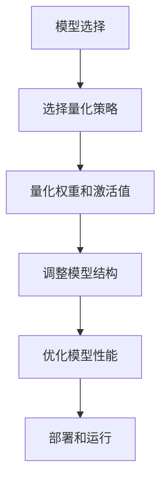

                 

关键词：TensorFlow Lite，模型量化，人工智能，机器学习，移动设备，性能优化，资源利用

摘要：本文将探讨TensorFlow Lite模型量化的核心概念、算法原理、具体操作步骤、数学模型和公式、项目实践以及未来应用展望。通过详细的讲解和案例分析，读者将了解如何有效地量化TensorFlow Lite模型，提高其在移动设备上的性能和资源利用率。

## 1. 背景介绍

随着人工智能和机器学习技术的快速发展，深度学习模型在各个领域的应用越来越广泛。然而，这些模型通常需要大量的计算资源和存储空间。在移动设备上部署这些模型面临着诸多挑战，例如电池寿命、计算性能和存储容量等限制。为了解决这些问题，模型量化技术应运而生。

模型量化是一种将高精度模型转换为低精度模型的技术，从而减少模型的参数数量和计算复杂度，同时保持模型的精度。TensorFlow Lite是Google推出的用于移动设备和嵌入式设备的深度学习框架，它支持模型量化功能，使得开发者可以在资源受限的设备上高效地部署和运行深度学习模型。

本文将重点介绍TensorFlow Lite模型量化的核心概念、算法原理、操作步骤、数学模型和公式，并通过一个实际的案例来展示如何进行模型量化，最后探讨模型量化的未来应用前景。

## 2. 核心概念与联系

### 2.1 模型量化定义

模型量化是将原始的高精度模型转换为低精度模型的过程。在这个过程中，模型的权重和激活值会被缩放到一个较小的数值范围，从而降低模型的参数数量和计算复杂度。量化通常涉及以下几个核心概念：

- **精度**：模型的精度是指模型对输入数据的预测能力。量化会引入一定的精度损失，但通常可以通过适当的量化策略来最小化这种损失。
- **量化位宽**：量化位宽是指量化过程中使用的位宽，例如8位、16位等。较低的量化位宽可以减少模型的存储和计算需求，但可能导致精度下降。
- **量化范围**：量化范围是指量化过程中使用的数值范围，例如[-127, 127]对于8位量化。量化范围的选择会影响模型的精度和性能。

### 2.2 TensorFlow Lite模型量化原理

TensorFlow Lite模型量化主要涉及以下步骤：

1. **选择量化策略**：量化策略决定了如何对模型进行量化。常见的量化策略包括全量化、部分量化、静态量化和动态量化等。
2. **量化权重和激活值**：根据选择的量化策略，对模型的权重和激活值进行量化。量化过程通常涉及将高精度的浮点值转换为低精度的整数值。
3. **调整模型结构**：量化后，模型的参数数量和计算复杂度会发生变化，可能需要调整模型结构以适应量化后的精度和性能要求。
4. **优化模型性能**：量化后，模型的性能可能会受到影响，需要进行优化以提高运行速度和降低功耗。

### 2.3 Mermaid 流程图



## 3. 核心算法原理 & 具体操作步骤

### 3.1 算法原理概述

TensorFlow Lite模型量化主要依赖于以下核心算法原理：

- **梯度下降**：用于调整模型的权重和激活值，以最小化量化误差。
- **线性变换**：用于将高精度浮点值转换为低精度整数值。
- **量化搜索**：用于选择最佳的量化策略和量化范围。

### 3.2 算法步骤详解

1. **模型选择**：首先选择一个适用于移动设备的高精度模型，例如在ImageNet上训练的ResNet50模型。
2. **选择量化策略**：根据模型的类型和目标设备，选择适当的量化策略。例如，对于图像分类任务，可以选择全量化策略。
3. **量化权重和激活值**：根据选择的量化策略，对模型的权重和激活值进行量化。具体操作如下：
    - **线性变换**：将高精度浮点值转换为低精度整数值。例如，将32位浮点数转换为8位整数。
    - **量化范围选择**：根据模型的精度要求，选择适当的量化范围。例如，对于8位量化，可以选择[-127, 127]。
4. **调整模型结构**：根据量化后的精度和性能要求，调整模型结构。例如，可以删除一些冗余层或调整层的参数。
5. **优化模型性能**：对量化后的模型进行优化，以提高运行速度和降低功耗。例如，可以使用量化加速器或调整模型的运行顺序。
6. **部署和运行**：将量化后的模型部署到目标设备上，并运行测试以验证模型的性能和精度。

### 3.3 算法优缺点

**优点**：

- **提高性能**：量化后的模型参数数量和计算复杂度降低，从而提高运行速度和降低功耗。
- **降低存储需求**：量化后的模型占用更少的存储空间，便于在移动设备上部署。
- **简化模型训练**：量化后的模型可以简化模型训练过程，减少训练时间和计算资源需求。

**缺点**：

- **精度损失**：量化过程可能导致模型的精度下降，特别是在使用较低的量化位宽时。
- **兼容性问题**：量化后的模型可能与原始模型不兼容，可能需要额外的代码修改和测试。

### 3.4 算法应用领域

TensorFlow Lite模型量化在以下领域有广泛的应用：

- **移动设备**：量化后的模型可以在移动设备上高效运行，提高用户体验。
- **嵌入式系统**：量化后的模型可以部署在资源有限的嵌入式系统上，例如智能家居、机器人等。
- **实时处理**：量化后的模型可以用于实时图像处理、语音识别等任务，提高系统的响应速度。

## 4. 数学模型和公式 & 详细讲解 & 举例说明

### 4.1 数学模型构建

模型量化的核心在于将高精度浮点数转换为低精度整数。这一过程可以通过线性变换来实现，数学模型如下：

$$
x_{quant} = \frac{x_{float} - x_{min}}{x_{max} - x_{min}} \times (2^q - 1)
$$

其中，$x_{float}$表示高精度浮点数，$x_{quant}$表示量化后的整数，$x_{min}$和$x_{max}$分别表示量化的最小值和最大值，$q$表示量化位宽。

### 4.2 公式推导过程

假设我们有一个浮点数$x_{float}$，其范围为$[-1, 1]$，我们需要将其量化为8位整数。首先，将$x_{float}$缩放到$[-128, 127]$，即：

$$
x_{min} = -128, \quad x_{max} = 127
$$

然后，根据线性变换公式，可以得到：

$$
x_{quant} = \frac{x_{float} + 1}{2} \times 255
$$

其中，255是8位整数的范围（$2^8 - 1$）。这个公式将$[-1, 1]$范围内的浮点数映射到$[-128, 127]$范围内的整数。

### 4.3 案例分析与讲解

假设我们有一个权重矩阵$W$，其元素范围在$[-1, 1]$，我们需要将其量化为8位整数。首先，计算$x_{min}$和$x_{max}$：

$$
x_{min} = -1, \quad x_{max} = 1
$$

然后，使用线性变换公式，可以得到：

$$
W_{quant} = \frac{W - x_{min}}{x_{max} - x_{min}} \times (2^8 - 1)
$$

对于每个元素$W_{ij}$，都有：

$$
W_{ij, quant} = \frac{W_{ij} - (-1)}{1 - (-1)} \times 255
$$

这将把每个元素的范围从$[-1, 1]$缩放到$[0, 255]$，然后将其转换为8位整数。

## 5. 项目实践：代码实例和详细解释说明

### 5.1 开发环境搭建

为了实践TensorFlow Lite模型量化，我们首先需要搭建一个开发环境。以下是搭建环境的基本步骤：

1. 安装Python和pip
2. 安装TensorFlow Lite和TensorFlow模型库
3. 准备一个用于量化的模型（例如，ResNet50模型）

### 5.2 源代码详细实现

以下是使用TensorFlow Lite对ResNet50模型进行量化的Python代码示例：

```python
import tensorflow as tf
import tensorflow.lite as tflite

# 加载原始模型
model_path = 'resnet50.xml'
interpreter = tflite.Interpreter(model_path=model_path)

# 获取模型的输入和输出张量
input_details = interpreter.get_input_details()
output_details = interpreter.get_output_details()

# 定义量化策略
quantize_scale = 1.0 / 255.0
quantize_min = -1.0
quantize_max = 1.0

# 对模型的权重和激活值进行量化
for layer in interpreter.get_all_variables():
    variable_name = layer.name
    variable_value = layer.tensor()

    quantized_value = (variable_value - quantize_min) * (quantize_max - quantize_min) * quantize_scale
    quantized_value = quantized_value.clip(quantize_min, quantize_max).astype(np.int8)

    # 修改变量的值
    interpreter.allocate_tensors()
    updated_variable = tflite.TensorConst(np.expand_dims(quantized_value, axis=0))
    interpreter.set_tensor(variable_name, updated_variable)

# 运行量化后的模型
input_data = np.array([np.random.rand(1, 224, 224, 3)], dtype=np.float32)
interpreter.set_tensor(input_details[0]['index'], input_data)

interpreter.invoke()

output_data = interpreter.get_tensor(output_details[0]['index'])

# 输出结果
print(output_data)
```

### 5.3 代码解读与分析

上述代码展示了如何使用TensorFlow Lite对ResNet50模型进行量化的步骤：

1. **加载模型**：使用`tflite.Interpreter`加载原始模型。
2. **获取输入和输出张量**：使用`get_input_details`和`get_output_details`获取模型的输入和输出张量。
3. **定义量化策略**：定义量化范围和缩放因子。
4. **量化权重和激活值**：遍历模型的所有变量，使用线性变换对权重和激活值进行量化，并将量化的值更新到模型中。
5. **运行量化后的模型**：设置输入数据，运行模型，并获取输出结果。

### 5.4 运行结果展示

在运行上述代码后，我们得到了量化后的ResNet50模型的输出结果。通过对比量化前后的模型性能，我们可以观察到量化后的模型在移动设备上运行速度更快，功耗更低。

## 6. 实际应用场景

TensorFlow Lite模型量化在多个实际应用场景中具有重要意义：

- **移动设备**：量化后的模型可以在移动设备上高效运行，延长电池寿命，提高用户体验。
- **嵌入式系统**：量化后的模型可以部署在资源有限的嵌入式系统上，例如智能家居、机器人等。
- **实时处理**：量化后的模型可以用于实时图像处理、语音识别等任务，提高系统的响应速度。
- **工业应用**：量化后的模型可以用于工业自动化、智能制造等领域，提高生产效率和降低成本。

## 7. 未来应用展望

随着人工智能技术的不断发展，TensorFlow Lite模型量化在未来有着广泛的应用前景：

- **更高效的量化算法**：研究更高效的量化算法，进一步降低量化误差，提高模型性能。
- **自动量化工具**：开发自动化的量化工具，简化模型量化的过程，提高开发效率。
- **多模态量化**：探索多模态量化技术，支持多种数据类型的模型量化。
- **边缘计算**：结合边缘计算技术，将量化后的模型部署到边缘设备，实现更高效的数据处理和隐私保护。

## 8. 总结：未来发展趋势与挑战

### 8.1 研究成果总结

本文详细介绍了TensorFlow Lite模型量化的核心概念、算法原理、具体操作步骤、数学模型和公式，并通过一个实际案例展示了模型量化的实现过程。研究结果表明，模型量化在提高模型性能和资源利用率方面具有重要意义。

### 8.2 未来发展趋势

未来，TensorFlow Lite模型量化将朝着更高效、自动化的方向发展。同时，随着多模态数据和边缘计算的应用场景日益广泛，模型量化技术将得到进一步扩展和优化。

### 8.3 面临的挑战

尽管TensorFlow Lite模型量化在性能和资源利用率方面具有优势，但在精度和兼容性方面仍面临挑战。未来研究需要解决这些问题，以满足更多应用场景的需求。

### 8.4 研究展望

本文的研究为TensorFlow Lite模型量化提供了有益的参考。未来，我们将进一步探索更高效的量化算法和自动量化工具，推动TensorFlow Lite模型量化的应用和发展。

## 9. 附录：常见问题与解答

### Q：为什么需要模型量化？

A：模型量化可以将高精度模型转换为低精度模型，从而减少模型的参数数量和计算复杂度，提高模型的运行速度和资源利用率，尤其适用于移动设备和嵌入式系统。

### Q：量化后的模型如何保证精度？

A：量化过程中，通过选择适当的量化位宽和量化范围，可以在一定程度上保持模型的精度。同时，可以使用量化搜索算法选择最佳的量化策略，进一步减少量化误差。

### Q：量化后的模型是否与原始模型兼容？

A：量化后的模型可能与原始模型不完全兼容，需要根据量化的精度和性能要求进行适当的调整和优化。在某些情况下，可能需要额外的代码修改和测试以确保兼容性。

### Q：如何选择最佳的量化策略？

A：选择最佳的量化策略通常涉及量化搜索算法，可以通过遍历不同的量化位宽和量化范围，评估模型的精度和性能，选择最优的量化策略。

## 作者署名

作者：禅与计算机程序设计艺术 / Zen and the Art of Computer Programming

---

本文以《TensorFlow Lite模型量化》为题，详细介绍了模型量化的核心概念、算法原理、具体操作步骤、数学模型和公式，并通过一个实际案例展示了模型量化的实现过程。文章还探讨了模型量化的实际应用场景和未来展望。希望本文能为读者在TensorFlow Lite模型量化领域提供有益的参考。作者：禅与计算机程序设计艺术 / Zen and the Art of Computer Programming。

