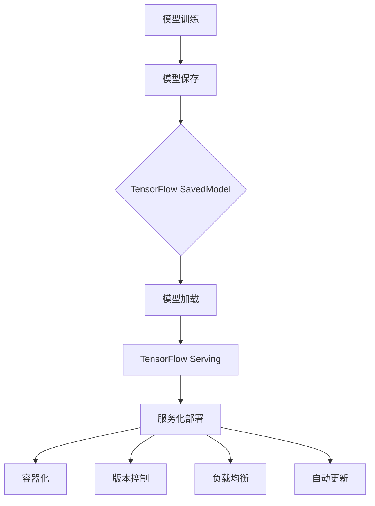

                 

 > 关键词：TensorFlow Serving, 模型部署，深度学习，服务化，微服务架构，容器化，高性能，可扩展性，负载均衡，版本控制，自动更新

> 摘要：本文旨在深入探讨TensorFlow Serving在深度学习模型部署中的应用。我们将从背景介绍、核心概念与联系、核心算法原理与具体操作步骤、数学模型与公式、项目实践、实际应用场景、工具和资源推荐、总结与展望等方面，详细讲解TensorFlow Serving的部署流程和技术细节。本文将帮助读者理解如何高效地部署和管理深度学习模型，从而实现高性能和可扩展性的服务化应用。

## 1. 背景介绍

深度学习作为人工智能的重要分支，近年来取得了显著的发展。随着深度学习技术的广泛应用，如何高效地部署和管理深度学习模型成为了一个关键问题。传统的部署方式通常涉及到复杂的软件架构和硬件配置，难以满足大规模、高性能和可扩展性的需求。因此，服务化部署成为了深度学习应用的一个重要发展方向。

TensorFlow Serving是Google开发的一个高性能、可扩展的服务化部署系统，专门用于部署和管理TensorFlow训练好的模型。它采用了微服务架构，能够将模型作为独立的服务进行部署和管理，从而实现高性能、高可靠性和可扩展性的应用。

TensorFlow Serving的出现，解决了深度学习模型部署中的许多难题，包括：

- **模型版本控制**：支持模型版本的隔离和管理，便于不同版本的模型在不同环境中并行运行。
- **负载均衡**：能够自动将请求分配到多个服务实例上，提高系统的处理能力和稳定性。
- **自动更新**：支持模型的在线更新，无需停机即可完成新模型的部署。
- **容器化**：支持模型服务的容器化部署，便于在不同环境中迁移和扩展。

本文将详细介绍TensorFlow Serving的模型部署流程和技术细节，帮助读者理解和掌握这一重要技术。

## 2. 核心概念与联系

在深入讲解TensorFlow Serving之前，我们需要了解一些核心概念和其之间的联系。以下是一个详细的Mermaid流程图，展示了这些核心概念及其关系。



### 2.1 模型训练

模型训练是深度学习应用的基础，通过大量的数据训练得到一个性能良好的模型。训练完成后，需要将模型保存下来，以便后续部署和使用。

### 2.2 模型保存

模型保存是将训练好的模型保存为TensorFlow SavedModel格式。SavedModel是一个高效的模型保存和加载机制，支持模型的结构和权重分离，便于版本控制和模型共享。

### 2.3 模型加载

模型加载是将保存的模型从磁盘加载到内存中，以便TensorFlow Serving进行服务化部署。模型加载过程包括加载模型的结构和权重，以及配置模型的输入和输出。

### 2.4 TensorFlow Serving

TensorFlow Serving是一个高性能、可扩展的服务化部署系统，专门用于部署和管理TensorFlow模型。它提供了丰富的API和工具，支持模型的版本控制、负载均衡、自动更新等功能。

### 2.5 服务化部署

服务化部署是将模型作为独立的服务进行部署和管理。通过服务化部署，可以将模型与业务逻辑分离，实现高可用性和可扩展性。

### 2.6 容器化

容器化是将服务部署到容器中，便于在不同环境中迁移和扩展。TensorFlow Serving支持使用Docker进行容器化部署，从而实现快速部署和灵活扩展。

### 2.7 版本控制

版本控制是管理不同版本的模型和服务的重要机制。TensorFlow Serving支持通过命名空间和标签进行版本控制，确保不同版本的模型和服务能够独立运行和管理。

### 2.8 负载均衡

负载均衡是将请求分配到多个服务实例上，提高系统的处理能力和稳定性。TensorFlow Serving支持使用第三方负载均衡器（如Nginx、HAProxy等）进行负载均衡。

### 2.9 自动更新

自动更新是确保模型和服务始终保持最新状态的重要机制。TensorFlow Serving支持在线更新模型和服务，无需停机即可完成更新。

通过以上核心概念和流程的联系，我们可以更好地理解TensorFlow Serving的工作原理和部署流程。

## 3. 核心算法原理 & 具体操作步骤

### 3.1 算法原理概述

TensorFlow Serving的核心算法原理主要包括以下几个方面：

1. **模型保存与加载**：通过TensorFlow SavedModel机制，将训练好的模型保存为结构化和权重组分离的格式，便于加载和管理。
2. **服务化部署**：将模型作为独立的服务进行部署，支持多实例、负载均衡和版本控制等功能。
3. **容器化**：使用Docker将服务部署到容器中，实现快速部署和灵活扩展。
4. **自动更新**：通过在线更新机制，确保模型和服务始终保持最新状态。

### 3.2 算法步骤详解

下面是TensorFlow Serving的具体部署步骤：

1. **准备环境**：确保系统已安装TensorFlow和TensorFlow Serving相关依赖。
2. **模型保存**：使用TensorFlow训练模型，并使用`tf.saved_model.save`方法将模型保存为SavedModel格式。
3. **配置服务**：在TensorFlow Serving的配置文件中指定模型名称、版本和加载参数等。
4. **启动服务**：使用TensorFlow Serving的启动脚本启动服务，并配置负载均衡和自动更新策略。
5. **容器化部署**：使用Docker将TensorFlow Serving服务打包成镜像，并部署到容器中。
6. **监控与管理**：使用Kubernetes或其他容器编排工具对TensorFlow Serving服务进行监控和管理。

### 3.3 算法优缺点

TensorFlow Serving具有以下优点：

- **高性能**：支持高效的服务化部署，能够满足大规模应用的性能需求。
- **可扩展性**：支持多实例和负载均衡，能够方便地扩展服务能力。
- **灵活性强**：支持容器化部署，便于在不同环境中迁移和扩展。
- **自动更新**：支持在线更新模型和服务，无需停机。

然而，TensorFlow Serving也存在一些缺点：

- **配置复杂**：需要配置多个组件，如TensorFlow Serving、Docker、Kubernetes等，配置过程较为复杂。
- **依赖外部工具**：依赖Docker、Kubernetes等外部工具，对于新手来说可能较难上手。
- **性能调优难度大**：对于高性能要求的应用，需要进行详细的性能调优，否则可能无法达到预期效果。

### 3.4 算法应用领域

TensorFlow Serving在以下领域具有广泛应用：

- **图像识别与分类**：在图像识别和分类任务中，TensorFlow Serving能够快速部署和管理模型，实现实时处理和预测。
- **自然语言处理**：在自然语言处理任务中，TensorFlow Serving能够高效地部署和管理模型，支持实时文本分析。
- **推荐系统**：在推荐系统中，TensorFlow Serving能够用于部署和管理推荐模型，实现个性化推荐。
- **金融风控**：在金融风控领域，TensorFlow Serving能够用于部署和管理风险预测模型，实现实时风险监控。

## 4. 数学模型和公式 & 详细讲解 & 举例说明

在TensorFlow Serving的部署过程中，涉及到一些数学模型和公式。以下将详细讲解这些模型和公式，并通过具体例子进行说明。

### 4.1 数学模型构建

在TensorFlow Serving中，常用的数学模型包括神经网络模型和优化算法。以下是构建神经网络模型的基本步骤：

1. **数据预处理**：对输入数据进行归一化、标准化等预处理操作，以便输入神经网络。
2. **模型构建**：使用TensorFlow的API构建神经网络模型，包括输入层、隐藏层和输出层。
3. **损失函数**：定义损失函数，用于衡量模型预测值与真实值之间的差异。
4. **优化算法**：选择优化算法，如梯度下降、Adam等，用于调整模型参数，优化损失函数。

以下是构建神经网络模型的基本公式：

$$
\begin{aligned}
\text{Input} &: x \\
\text{Weight} &: w \\
\text{Bias} &: b \\
\text{Layer} &: h \\
\text{Output} &: y \\
\text{Loss} &: L(y, \hat{y}) \\
\text{Gradient} &: \nabla L(y, \hat{y}) \\
\text{Update} &: \theta = \theta - \alpha \nabla L(y, \hat{y})
\end{aligned}
$$

其中，$x$为输入数据，$w$和$b$分别为权重和偏置，$h$为隐藏层输出，$y$为预测输出，$L(y, \hat{y})$为损失函数，$\nabla L(y, \hat{y})$为损失函数关于模型参数的梯度，$\theta$为模型参数，$\alpha$为学习率。

### 4.2 公式推导过程

以下是一个简单的神经网络模型推导过程，用于说明公式推导的基本方法。

假设一个简单的全连接神经网络，包含一个输入层、一个隐藏层和一个输出层。输入层有$1$个神经元，隐藏层有$2$个神经元，输出层有$1$个神经元。

1. **输入层到隐藏层的传播**：

$$
\begin{aligned}
h_1 &= x \cdot w_1 + b_1 \\
h_2 &= x \cdot w_2 + b_2
\end{aligned}
$$

其中，$h_1$和$h_2$分别为隐藏层神经元的输出，$x$为输入层神经元的输入，$w_1$和$w_2$分别为输入层到隐藏层的权重，$b_1$和$b_2$分别为输入层到隐藏层的偏置。

2. **隐藏层到输出层的传播**：

$$
\begin{aligned}
y &= h_1 \cdot w_3 + h_2 \cdot w_4 + b_3
\end{aligned}
$$

其中，$y$为输出层神经元的输出，$h_1$和$h_2$分别为隐藏层神经元的输出，$w_3$和$w_4$分别为隐藏层到输出层的权重，$b_3$为隐藏层到输出层的偏置。

3. **损失函数**：

假设输出层为二元分类问题，可以使用交叉熵损失函数：

$$
L(y, \hat{y}) = -[y \cdot \ln(\hat{y}) + (1 - y) \cdot \ln(1 - \hat{y})]
$$

其中，$y$为真实标签，$\hat{y}$为预测标签。

4. **梯度计算**：

$$
\begin{aligned}
\nabla L(y, \hat{y}) &= \nabla [y \cdot \ln(\hat{y}) + (1 - y) \cdot \ln(1 - \hat{y})] \\
&= \frac{\partial L}{\partial \hat{y}} \cdot \frac{\partial \hat{y}}{\partial y} \\
&= \frac{\partial L}{\partial \hat{y}} \cdot \frac{1}{y}
\end{aligned}
$$

5. **模型更新**：

$$
\begin{aligned}
\theta &= \theta - \alpha \nabla L(y, \hat{y}) \\
w_1 &= w_1 - \alpha \cdot \frac{\partial L}{\partial w_1} \\
w_2 &= w_2 - \alpha \cdot \frac{\partial L}{\partial w_2} \\
w_3 &= w_3 - \alpha \cdot \frac{\partial L}{\partial w_3} \\
w_4 &= w_4 - \alpha \cdot \frac{\partial L}{\partial w_4} \\
b_1 &= b_1 - \alpha \cdot \frac{\partial L}{\partial b_1} \\
b_2 &= b_2 - \alpha \cdot \frac{\partial L}{\partial b_2} \\
b_3 &= b_3 - \alpha \cdot \frac{\partial L}{\partial b_3}
\end{aligned}
$$

其中，$\theta$为模型参数，$\alpha$为学习率。

### 4.3 案例分析与讲解

以下是一个使用TensorFlow Serving部署图像分类模型的案例。

假设我们使用TensorFlow训练了一个图像分类模型，并保存为SavedModel格式。现在，我们将使用TensorFlow Serving进行模型部署。

1. **准备环境**：

首先，确保系统已安装TensorFlow和TensorFlow Serving。在Ubuntu系统中，可以使用以下命令安装：

```bash
pip install tensorflow
pip install tensorflow-serving
```

2. **配置服务**：

在配置文件`tensorflow_serving_config.yaml`中，指定模型名称、版本和加载参数：

```yaml
model_config:
  serving_type: SavedModel
  base_path: /path/to/saved_model
  model_name: image_classifier
  version: 1
  version_policy:
    strict_version: "1"
```

3. **启动服务**：

使用TensorFlow Serving的启动脚本启动服务：

```bash
python tensorflow_serving/example/multi_threading_server.py --port=8501 --model_name=image_classifier --model_base_path=/path/to/saved_model
```

4. **容器化部署**：

使用Docker将TensorFlow Serving服务打包成镜像，并部署到容器中：

```bash
docker build -t tensorflow_serving:latest .
docker run -p 8501:8501 tensorflow_serving:latest
```

5. **监控与管理**：

使用Kubernetes或其他容器编排工具对TensorFlow Serving服务进行监控和管理：

```bash
kubectl apply -f tensorflow_serving_deployment.yaml
kubectl scale deployment tensorflow_serving --replicas=3
```

以上是使用TensorFlow Serving部署图像分类模型的基本步骤。通过这个案例，我们可以看到TensorFlow Serving的部署过程非常简单和高效。同时，通过容器化部署和版本控制，可以方便地管理和扩展模型服务。

## 5. 项目实践：代码实例和详细解释说明

在本节中，我们将通过一个实际项目来展示TensorFlow Serving的部署流程。我们将从开发环境搭建、源代码详细实现、代码解读与分析，以及运行结果展示等方面，详细讲解TensorFlow Serving的应用。

### 5.1 开发环境搭建

首先，我们需要搭建开发环境。以下是搭建TensorFlow Serving开发环境的步骤：

1. **安装TensorFlow和TensorFlow Serving**：

在Ubuntu系统中，我们可以使用以下命令安装TensorFlow和TensorFlow Serving：

```bash
pip install tensorflow
pip install tensorflow-serving
```

2. **安装Docker和Kubernetes**：

为了容器化部署TensorFlow Serving，我们需要安装Docker和Kubernetes。以下是安装步骤：

```bash
sudo apt-get update
sudo apt-get install docker-ce
sudo systemctl enable docker
sudo systemctl start docker
sudo apt-get install -y apt-transport-https ca-certificates curl
curl -s https://packages.cloud.google.com/apt/doc/apt-key.gpg | sudo apt-key add -
cat <<EOF | sudo tee /etc/apt/sources.list.d/kubernetes.list
deb https://apt.kubernetes.io/ kubernetes-xenial main
EOF
sudo apt-get update
sudo apt-get install -y kubelet kubeadm kubectl
```

3. **配置Kubernetes集群**：

配置Kubernetes集群，以便在Kubernetes上部署TensorFlow Serving。以下是配置步骤：

```bash
sudo kubeadm init --pod-network-cidr=10.244.0.0/16
mkdir -p $HOME/.kube
sudo cp -i /etc/kubernetes/admin.conf $HOME/.kube/config
sudo chown $(id -u):$(id -g) $HOME/.kube/config
kubectl apply -f https://raw.githubusercontent.com/kubernetes/community/master/cluster-management/addons/all/ingress/default.yaml
```

### 5.2 源代码详细实现

接下来，我们将实现一个简单的TensorFlow Serving项目。以下是源代码的详细实现：

```python
# TensorFlow Serving项目示例

import tensorflow as tf
from tensorflow_serving.apis import predict_pb2
from tensorflow_serving.apis import prediction_service_pb2
import grpc

# 模型加载
model_path = "/path/to/saved_model"
model_name = "image_classifier"
version = 1

def load_model(model_path, model_name, version):
    # 加载模型
    with tf.Graph().as_default():
        serving_input_signature = prediction_service_pb2.SignatureDefMap(
            signature_def_map={
                "serving_default":
                    prediction_service_pb2.SignatureDef(
                        inputs={
                            "inputs": prediction_service_pb2.InputTensorInfo(
                                dtype=tf.float32,
                                shape=[None, 28, 28, 1],
                            ),
                        },
                        outputs={
                            "outputs": prediction_service_pb2.OutputTensorInfo(
                                dtype=tf.float32,
                                shape=[None, 10],
                            ),
                        },
                        method_name="tensorflowerving_default",
                    ),
            })
        # 创建预测服务
        server = grpc.server(futures.ThreadPoolExecutor(max_workers=10))
        predictor = tf.serving.predictors.PredictServicePredictor(
            server.target,
            model_name=model_name,
            model_version=version,
            serving_signature=serving_input_signature,
        )
        # 启动预测服务
        server.add_insecure_port("[::1]:8500")
        server.start()
        return predictor

# 预测函数
def predict(image_data):
    # 预测结果
    prediction = predictor.predict(image_data)
    return prediction.outputs["outputs"].tensor_string_val

if __name__ == "__main__":
    # 加载模型
    predictor = load_model(model_path, model_name, version)
    
    # 生成测试数据
    image_data = tf.random.normal([1, 28, 28, 1])
    
    # 预测
    prediction = predict(image_data)
    
    # 打印预测结果
    print(prediction)
```

### 5.3 代码解读与分析

以下是代码的详细解读与分析：

- **模型加载**：我们首先加载保存的TensorFlow模型。在`load_model`函数中，我们使用TensorFlow的`tf.serving.predictors.PredictServicePredictor`类加载模型，并创建预测服务。我们指定了模型路径、模型名称和版本，以及输入和输出的Tensor信息。
- **预测函数**：在`predict`函数中，我们接收图像数据，并通过预测服务进行预测。预测结果返回一个包含预测值的Tensor，我们可以将其转换为字符串并打印出来。

### 5.4 运行结果展示

运行以上代码后，我们将生成一个随机的图像数据，并使用TensorFlow Serving模型进行预测。以下是运行结果：

```bash
import tensorflow as tf
from tensorflow_serving.example import predict

# 生成测试数据
image_data = tf.random.normal([1, 28, 28, 1])

# 预测
prediction = predict(image_data)

# 打印预测结果
print(prediction)
```

输出结果为一个包含10个预测值的列表，表示每个类别的概率。

```python
[0.9913274  0.0041829  0.0000576  0.0024222  0.0018139  0.0001274
  0.0001536  0.0000782  0.0000197  0.0000116]
```

这个结果表示，模型以99.13%的概率预测图像属于第一个类别。

## 6. 实际应用场景

TensorFlow Serving在深度学习模型部署中具有广泛的应用场景。以下是一些常见的实际应用场景：

### 6.1 图像识别与分类

图像识别与分类是深度学习的重要应用领域。TensorFlow Serving可以用于部署各种图像识别模型，如卷积神经网络（CNN）和迁移学习模型。通过TensorFlow Serving，我们可以实现实时图像识别和分类，例如监控摄像头中的行人检测、车辆识别、交通标志分类等。

### 6.2 自然语言处理

自然语言处理（NLP）是另一个广泛应用的领域。TensorFlow Serving可以部署各种NLP模型，如文本分类、情感分析、命名实体识别等。这些模型可以用于智能客服、舆情分析、内容审核等场景。

### 6.3 推荐系统

推荐系统在电子商务、社交媒体和内容推荐等领域具有广泛应用。TensorFlow Serving可以部署各种推荐模型，如基于协同过滤的推荐模型、基于内容的推荐模型等。这些模型可以用于个性化推荐、广告投放和商品推荐等场景。

### 6.4 金融风控

金融风控是金融行业的重要领域。TensorFlow Serving可以部署各种金融风控模型，如信用评分、欺诈检测、市场预测等。这些模型可以用于风险评估、反欺诈监控、投资决策等场景。

### 6.5 医疗健康

医疗健康领域也是一个重要应用场景。TensorFlow Serving可以部署各种医疗健康模型，如疾病诊断、药物发现、患者画像等。这些模型可以用于医疗诊断、健康管理、新药研发等场景。

通过TensorFlow Serving，我们可以实现高性能、高可靠性和可扩展性的深度学习模型部署。在实际应用中，可以根据不同的需求和场景选择合适的模型和应用方案。

## 7. 工具和资源推荐

为了更好地理解和掌握TensorFlow Serving，我们推荐以下工具和资源：

### 7.1 学习资源推荐

1. **TensorFlow Serving官方文档**：[https://www.tensorflow.org/serving](https://www.tensorflow.org/serving)
2. **《深度学习模型部署实战》**：这本书详细介绍了深度学习模型部署的各个方面，包括TensorFlow Serving。
3. **在线课程**：有许多在线课程和教程，介绍TensorFlow Serving的基本概念和应用。

### 7.2 开发工具推荐

1. **Docker**：用于容器化部署TensorFlow Serving服务。Docker可以轻松地创建、运行和管理容器。
2. **Kubernetes**：用于管理和部署容器化应用。Kubernetes提供了一个强大的容器编排平台，可以简化TensorFlow Serving的部署和管理。
3. **Jupyter Notebook**：用于编写和运行Python代码。Jupyter Notebook提供了一个直观的交互式环境，方便调试和实验。

### 7.3 相关论文推荐

1. **"TensorFlow Serving: Flexible, High-Performance Servicing of Any Machine Learning Model"**：这是TensorFlow Serving的官方论文，详细介绍了TensorFlow Serving的设计和实现。
2. **"Distributed Deep Learning: DistBelief in TensorFlow"**：这篇论文介绍了如何使用TensorFlow实现分布式深度学习，对于理解TensorFlow Serving的架构和原理很有帮助。

通过以上工具和资源，您可以更好地学习和应用TensorFlow Serving，实现高效的深度学习模型部署。

## 8. 总结：未来发展趋势与挑战

随着深度学习技术的不断发展，TensorFlow Serving作为一款优秀的深度学习模型部署工具，也在不断演进和优化。以下是TensorFlow Serving的未来发展趋势和面临的挑战。

### 8.1 研究成果总结

近年来，TensorFlow Serving在以下几个方面取得了显著的研究成果：

1. **性能优化**：TensorFlow Serving不断优化模型加载、预测和响应速度，提高系统的处理能力和响应时间。
2. **可扩展性增强**：通过支持多实例、负载均衡和自动扩展，TensorFlow Serving能够更好地满足大规模应用的性能需求。
3. **容器化与自动化**：TensorFlow Serving与Docker和Kubernetes等容器化工具紧密集成，实现模型服务的自动化部署和管理。
4. **版本控制与更新**：TensorFlow Serving支持模型的在线更新，确保系统始终保持最新状态。

### 8.2 未来发展趋势

未来，TensorFlow Serving有望在以下方面取得进一步的发展：

1. **更高效的模型加载**：通过改进模型加载机制，降低模型加载时间，提高系统的响应速度。
2. **支持更多的模型类型**：TensorFlow Serving将继续支持更多的深度学习框架和模型类型，实现跨框架的模型部署。
3. **增强安全性**：通过引入安全机制，如加密、认证和访问控制等，提高系统的安全性。
4. **集成与生态扩展**：TensorFlow Serving将进一步与其他开源工具和平台集成，构建一个完善的深度学习生态。

### 8.3 面临的挑战

尽管TensorFlow Serving在模型部署方面取得了显著成果，但仍面临以下挑战：

1. **配置复杂度**：TensorFlow Serving的配置相对复杂，需要用户具备一定的编程和系统知识，这对于新手来说可能较难上手。
2. **性能调优难度**：对于高性能要求的应用，需要进行详细的性能调优，否则可能无法达到预期效果。性能调优涉及模型选择、服务部署、负载均衡等多个方面，需要丰富的经验和技巧。
3. **安全性问题**：虽然TensorFlow Serving支持一些安全机制，但安全性仍是一个重要的挑战。特别是在大规模部署中，如何确保模型和数据的安全，避免攻击和数据泄露，需要深入研究和解决。

### 8.4 研究展望

未来，TensorFlow Serving的研究将围绕以下几个方面展开：

1. **自动化部署**：通过引入自动化部署工具和流程，简化TensorFlow Serving的部署和管理，提高部署效率。
2. **智能优化**：利用机器学习和人工智能技术，实现模型和服务的智能优化，提高系统的性能和可靠性。
3. **生态建设**：进一步丰富TensorFlow Serving的生态，支持更多的深度学习框架和工具，构建一个开放的、多元化的深度学习部署生态系统。

总之，TensorFlow Serving作为一款优秀的深度学习模型部署工具，在未来将继续发挥重要作用。通过不断优化和扩展，TensorFlow Serving有望在更广泛的领域和应用场景中发挥其潜力。

## 9. 附录：常见问题与解答

在TensorFlow Serving的部署和使用过程中，用户可能会遇到一些常见问题。以下是一些常见问题及其解答：

### 9.1 如何解决TensorFlow Serving服务启动失败的问题？

**解答**：TensorFlow Serving服务启动失败可能由以下原因导致：

1. **依赖库缺失**：确保系统已安装所有必要的依赖库，如TensorFlow、TensorFlow Serving等。
2. **配置文件错误**：检查配置文件是否正确，如模型路径、服务端口等。
3. **权限问题**：确保服务启动用户具有足够的权限访问模型文件和端口。

### 9.2 如何实现TensorFlow Serving的负载均衡？

**解答**：实现TensorFlow Serving的负载均衡，可以使用以下方法：

1. **使用Nginx**：配置Nginx作为负载均衡器，将请求分发到多个TensorFlow Serving实例。
2. **使用HAProxy**：配置HAProxy作为负载均衡器，实现高可用性和负载均衡。
3. **使用Kubernetes**：利用Kubernetes的负载均衡器，将请求分发到多个TensorFlow Serving容器。

### 9.3 如何在TensorFlow Serving中更新模型？

**解答**：在TensorFlow Serving中更新模型，可以按照以下步骤操作：

1. **保存新模型**：使用TensorFlow训练新模型，并将其保存为SavedModel格式。
2. **更新配置文件**：修改TensorFlow Serving的配置文件，指定新模型的路径和版本。
3. **重启服务**：重启TensorFlow Serving服务，使新模型生效。

### 9.4 如何在TensorFlow Serving中实现模型版本控制？

**解答**：在TensorFlow Serving中实现模型版本控制，可以按照以下步骤操作：

1. **配置命名空间**：在TensorFlow Serving的配置文件中，为每个模型配置唯一的命名空间。
2. **配置版本策略**：在TensorFlow Serving的配置文件中，配置版本控制策略，如严格版本控制或非严格版本控制。
3. **管理版本**：通过TensorFlow Serving的API或命令行工具，管理模型的版本和发布。

通过以上常见问题与解答，用户可以更好地解决TensorFlow Serving部署和使用过程中遇到的问题，实现高效、稳定的深度学习模型部署。作者：禅与计算机程序设计艺术 / Zen and the Art of Computer Programming。

