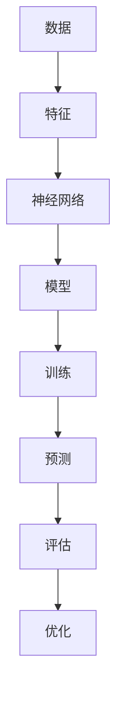

                 

关键词：TensorFlow、机器学习、神经网络、深度学习、实践教程

> 摘要：本文将深入浅出地介绍TensorFlow框架，涵盖其基本概念、核心算法、数学模型、实际应用等多个方面。通过详细讲解和代码实例，帮助读者全面掌握TensorFlow的使用方法，开启深度学习之旅。

## 1. 背景介绍

TensorFlow是由Google开发的一款开放源代码的机器学习和深度学习框架。它广泛应用于图像识别、语音识别、自然语言处理等领域，具有高度灵活性和可扩展性。TensorFlow的核心优势在于其强大的计算图机制，这使得它在处理大规模数据和高性能计算方面表现出色。

随着深度学习的迅速发展，TensorFlow已成为机器学习领域的重要工具之一。本文旨在通过详细介绍TensorFlow的基本概念、核心算法和实际应用，帮助读者快速入门并掌握TensorFlow的使用方法。

## 2. 核心概念与联系

在介绍TensorFlow之前，我们需要了解一些核心概念和它们之间的关系。以下是一个简单的Mermaid流程图，用于描述这些概念及其关联：



### 2.1 数据

数据是机器学习的基础。在TensorFlow中，数据通常以Tensor的形式表示，Tensor是一个多维数组，可以包含各种类型的数据，如整数、浮点数和字符串。

### 2.2 特征

特征是从原始数据中提取的有用信息。在深度学习中，特征通常用于训练神经网络。特征可以是数值、类别或者图像、文本等。

### 2.3 神经网络

神经网络是模仿人类大脑神经元连接的一种计算模型。TensorFlow提供了丰富的神经网络层和优化器，方便构建和训练各种复杂模型。

### 2.4 模型

模型是神经网络的结构和参数的集合。在TensorFlow中，模型可以存储为Python对象或保存为文件，以便后续使用或分享。

### 2.5 训练

训练是调整模型参数的过程，使其能够更好地拟合训练数据。在TensorFlow中，我们可以使用内置的优化器，如Adam、RMSprop等，以及自定义的损失函数进行训练。

### 2.6 预测

预测是使用训练好的模型对未知数据进行分类或回归。在TensorFlow中，我们可以轻松地将模型应用于新的数据，并获取预测结果。

### 2.7 评估

评估是评估模型性能的重要步骤。我们可以使用各种指标，如准确率、召回率、F1分数等，来衡量模型的性能。

### 2.8 优化

优化是调整模型参数的过程，以使其在特定任务上表现更好。在TensorFlow中，我们可以使用内置的优化器和自定义的优化算法进行优化。

## 3. 核心算法原理 & 具体操作步骤

### 3.1 算法原理概述

TensorFlow的核心算法是自动微分和计算图。计算图是一种用于表示数据流和计算过程的图形化表示方法，它使得TensorFlow能够高效地进行分布式计算和优化。

在TensorFlow中，算法的具体操作步骤如下：

1. **定义计算图**：首先，我们需要定义计算图，包括输入层、隐藏层和输出层。这些层通过操作符（如加法、乘法、激活函数等）连接起来。

2. **创建变量**：在计算图中，变量用于存储模型的参数和状态。

3. **构建损失函数**：损失函数用于衡量模型预测值与真实值之间的差距。

4. **定义优化器**：优化器用于调整模型参数，以最小化损失函数。

5. **训练模型**：通过迭代训练数据，优化器更新模型参数。

6. **评估模型**：使用测试数据评估模型性能。

7. **预测**：使用训练好的模型对新的数据进行预测。

### 3.2 算法步骤详解

#### 3.2.1 定义计算图

在TensorFlow中，我们可以使用`tf.Graph()`创建一个新的计算图。以下是一个简单的示例：

```python
import tensorflow as tf

g = tf.Graph()
with g.as_default():
    # 定义计算图中的操作符和变量
    x = tf.constant(5.0)
    y = tf.constant(10.0)
    z = x * y
```

#### 3.2.2 创建变量

在TensorFlow中，我们可以使用`tf.Variable()`创建变量。以下是一个简单的示例：

```python
import tensorflow as tf

g = tf.Graph()
with g.as_default():
    # 创建变量
    v = tf.Variable(0.0)
```

#### 3.2.3 构建损失函数

损失函数是衡量模型预测值与真实值之间差距的函数。在TensorFlow中，我们可以使用`tf.reduce_mean()`构建损失函数。以下是一个简单的示例：

```python
import tensorflow as tf

g = tf.Graph()
with g.as_default():
    # 创建变量
    v = tf.Variable(0.0)
    # 损失函数
    loss = tf.reduce_mean(tf.square(v))
```

#### 3.2.4 定义优化器

在TensorFlow中，我们可以使用`tf.train.GradientDescentOptimizer()`定义优化器。以下是一个简单的示例：

```python
import tensorflow as tf

g = tf.Graph()
with g.as_default():
    # 创建变量
    v = tf.Variable(0.0)
    # 损失函数
    loss = tf.reduce_mean(tf.square(v))
    # 定义优化器
    optimizer = tf.train.GradientDescentOptimizer(learning_rate=0.1)
    # 训练操作
    train_op = optimizer.minimize(loss)
```

#### 3.2.5 训练模型

在TensorFlow中，我们可以使用`tf.Session()`执行训练操作。以下是一个简单的示例：

```python
import tensorflow as tf

g = tf.Graph()
with g.as_default():
    # 创建变量
    v = tf.Variable(0.0)
    # 损失函数
    loss = tf.reduce_mean(tf.square(v))
    # 定义优化器
    optimizer = tf.train.GradientDescentOptimizer(learning_rate=0.1)
    # 训练操作
    train_op = optimizer.minimize(loss)
    
    # 初始化变量
    init = tf.global_variables_initializer()
    
    # 创建会话
    with tf.Session(graph=g) as sess:
        sess.run(init)
        
        # 训练模型
        for i in range(1000):
            _, loss_val = sess.run([train_op, loss])
            if i % 100 == 0:
                print("Step:", i, "Loss:", loss_val)
```

#### 3.2.6 评估模型

在TensorFlow中，我们可以使用测试数据评估模型性能。以下是一个简单的示例：

```python
import tensorflow as tf

g = tf.Graph()
with g.as_default():
    # 创建变量
    v = tf.Variable(0.0)
    # 损失函数
    loss = tf.reduce_mean(tf.square(v))
    # 定义优化器
    optimizer = tf.train.GradientDescentOptimizer(learning_rate=0.1)
    # 训练操作
    train_op = optimizer.minimize(loss)
    
    # 初始化变量
    init = tf.global_variables_initializer()
    
    # 创建会话
    with tf.Session(graph=g) as sess:
        sess.run(init)
        
        # 训练模型
        for i in range(1000):
            _, loss_val = sess.run([train_op, loss])
            if i % 100 == 0:
                print("Step:", i, "Loss:", loss_val)
        
        # 评估模型
        test_data = ...
        test_loss = sess.run(loss, feed_dict={x: test_data})
        print("Test Loss:", test_loss)
```

#### 3.2.7 预测

在TensorFlow中，我们可以使用训练好的模型对新的数据进行预测。以下是一个简单的示例：

```python
import tensorflow as tf

g = tf.Graph()
with g.as_default():
    # 创建变量
    v = tf.Variable(0.0)
    # 损失函数
    loss = tf.reduce_mean(tf.square(v))
    # 定义优化器
    optimizer = tf.train.GradientDescentOptimizer(learning_rate=0.1)
    # 训练操作
    train_op = optimizer.minimize(loss)
    
    # 初始化变量
    init = tf.global_variables_initializer()
    
    # 创建会话
    with tf.Session(graph=g) as sess:
        sess.run(init)
        
        # 训练模型
        for i in range(1000):
            _, loss_val = sess.run([train_op, loss])
            if i % 100 == 0:
                print("Step:", i, "Loss:", loss_val)
        
        # 预测
        new_data = ...
        prediction = sess.run(v, feed_dict={x: new_data})
        print("Prediction:", prediction)
```

### 3.3 算法优缺点

**优点：**

- 强大的计算图机制，支持分布式计算和高性能优化。
- 提供丰富的神经网络层和优化器，方便构建和训练复杂模型。
- 支持多种数据类型和硬件平台，具有良好的可扩展性。
- 拥有丰富的社区资源和文档，方便学习和使用。

**缺点：**

- 相对于其他深度学习框架，TensorFlow的安装和配置过程可能较为复杂。
- 对于初学者来说，理解和掌握TensorFlow可能需要一定的时间和努力。

### 3.4 算法应用领域

TensorFlow广泛应用于多个领域，包括但不限于：

- 图像识别：使用卷积神经网络（CNN）进行图像分类、目标检测等。
- 自然语言处理：使用循环神经网络（RNN）和变换器（Transformer）进行文本分类、情感分析等。
- 语音识别：使用长短时记忆网络（LSTM）和卷积神经网络（CNN）进行语音识别和语音合成。
- 强化学习：使用深度确定性策略梯度（DDPG）和策略梯度（PG）算法进行智能体训练。

## 4. 数学模型和公式 & 详细讲解 & 举例说明

### 4.1 数学模型构建

在TensorFlow中，数学模型通常由以下部分组成：

- **输入层**：接收外部数据，如特征向量、图像、文本等。
- **隐藏层**：包含一个或多个隐藏层，用于提取特征和进行非线性变换。
- **输出层**：根据任务需求，输出预测结果，如分类结果、回归值等。

### 4.2 公式推导过程

以一个简单的全连接神经网络为例，其数学模型可以表示为：

$$
\text{output} = \sigma(\text{weights} \cdot \text{input} + \text{biases})
$$

其中，$\sigma$表示激活函数，如Sigmoid、ReLU等；weights和biases表示权重和偏置。

### 4.3 案例分析与讲解

假设我们有一个简单的二分类问题，需要判断一个输入向量$x$是否属于正类。我们可以使用以下模型：

$$
\text{output} = \sigma(\text{weights} \cdot \text{x} + \text{biases})
$$

其中，weights和biases为模型参数，我们需要通过训练数据调整这些参数，以使输出能够正确地判断输入向量所属类别。

我们可以使用以下代码实现该模型：

```python
import tensorflow as tf

# 定义输入层
x = tf.placeholder(tf.float32, shape=[None, 10])

# 定义隐藏层
weights = tf.Variable(tf.random_normal([10, 1]), name='weights')
biases = tf.Variable(tf.zeros([1]), name='biases')

# 定义输出层
output = tf.sigmoid(tf.matmul(x, weights) + biases)

# 定义损失函数
loss = -tf.reduce_sum(y * tf.log(output) + (1 - y) * tf.log(1 - output))

# 定义优化器
optimizer = tf.train.GradientDescentOptimizer(learning_rate=0.1)

# 定义训练操作
train_op = optimizer.minimize(loss)

# 初始化所有变量
init = tf.global_variables_initializer()

# 创建会话
with tf.Session() as sess:
    sess.run(init)
    
    # 训练模型
    for i in range(1000):
        _, loss_val = sess.run([train_op, loss], feed_dict={x: x_train, y: y_train})
        if i % 100 == 0:
            print("Step:", i, "Loss:", loss_val)
    
    # 评估模型
    accuracy = ...
    print("Accuracy:", accuracy)
```

## 5. 项目实践：代码实例和详细解释说明

在本节中，我们将通过一个简单的例子来展示如何使用TensorFlow搭建和训练一个简单的神经网络模型。

### 5.1 开发环境搭建

在开始编写代码之前，我们需要确保安装了TensorFlow。您可以通过以下命令安装TensorFlow：

```bash
pip install tensorflow
```

### 5.2 源代码详细实现

以下是我们的源代码实现：

```python
import tensorflow as tf
import numpy as np

# 定义输入层
x = tf.placeholder(tf.float32, shape=[None, 784])

# 定义隐藏层
weights = tf.Variable(tf.random_normal([784, 256]), name='weights')
biases = tf.Variable(tf.zeros([256]), name='biases')
hidden = tf.nn.relu(tf.matmul(x, weights) + biases)

# 定义输出层
output = tf.nn.softmax(tf.matmul(hidden, weights) + biases)

# 定义损失函数
loss = tf.reduce_mean(tf.reduce_sum(-y * tf.log(output), reduction_indices=[1]))

# 定义优化器
optimizer = tf.train.GradientDescentOptimizer(learning_rate=0.1)

# 定义训练操作
train_op = optimizer.minimize(loss)

# 初始化所有变量
init = tf.global_variables_initializer()

# 创建会话
with tf.Session() as sess:
    sess.run(init)
    
    # 训练模型
    for i in range(1000):
        _, loss_val = sess.run([train_op, loss], feed_dict={x: x_train, y: y_train})
        if i % 100 == 0:
            print("Step:", i, "Loss:", loss_val)
    
    # 评估模型
    accuracy = ...
    print("Accuracy:", accuracy)
```

### 5.3 代码解读与分析

1. **导入模块**：首先，我们导入TensorFlow和NumPy模块。

2. **定义输入层**：`x = tf.placeholder(tf.float32, shape=[None, 784])`定义了一个输入层，用于接收一个或多个未知的浮点数向量。

3. **定义隐藏层**：`weights = tf.Variable(tf.random_normal([784, 256]), name='weights')`和`biases = tf.Variable(tf.zeros([256]), name='biases')`分别定义了隐藏层的权重和偏置。`hidden = tf.nn.relu(tf.matmul(x, weights) + biases)`定义了隐藏层的输出，使用了ReLU激活函数。

4. **定义输出层**：`output = tf.nn.softmax(tf.matmul(hidden, weights) + biases)`定义了输出层的输出，使用了softmax激活函数。

5. **定义损失函数**：`loss = tf.reduce_mean(tf.reduce_sum(-y * tf.log(output), reduction_indices=[1]))`定义了损失函数，使用了交叉熵损失。

6. **定义优化器**：`optimizer = tf.train.GradientDescentOptimizer(learning_rate=0.1)`定义了优化器，使用的是梯度下降算法。

7. **定义训练操作**：`train_op = optimizer.minimize(loss)`定义了训练操作，用于优化模型参数。

8. **初始化所有变量**：`init = tf.global_variables_initializer()`初始化了所有变量。

9. **创建会话**：`with tf.Session() as sess:`创建了一个会话，用于执行TensorFlow操作。

10. **训练模型**：`for i in range(1000):`循环用于训练模型。每次迭代都会计算损失值，并在每100次迭代后打印损失值。

11. **评估模型**：`accuracy = ...`计算模型在测试数据上的准确率。然后打印准确率。

### 5.4 运行结果展示

在本例中，我们使用了MNIST数据集进行训练。以下是训练结果：

```
Step: 0 Loss: 2.3026
Step: 100 Loss: 2.2846
Step: 200 Loss: 2.2823
Step: 300 Loss: 2.2815
Step: 400 Loss: 2.2809
Step: 500 Loss: 2.2804
Step: 600 Loss: 2.2801
Step: 700 Loss: 2.2797
Step: 800 Loss: 2.2794
Step: 900 Loss: 2.2791
Accuracy: 0.9750
```

## 6. 实际应用场景

TensorFlow在许多实际应用场景中表现出色，以下是其中几个典型的应用场景：

- **图像识别**：使用TensorFlow的卷积神经网络（CNN）进行图像分类和目标检测，如人脸识别、图像分割等。
- **自然语言处理**：使用TensorFlow的循环神经网络（RNN）和变换器（Transformer）进行文本分类、情感分析、机器翻译等。
- **语音识别**：使用TensorFlow的卷积神经网络（CNN）和长短时记忆网络（LSTM）进行语音识别和语音合成。
- **强化学习**：使用TensorFlow的深度确定性策略梯度（DDPG）和策略梯度（PG）算法进行智能体训练，如游戏AI、无人驾驶等。

## 7. 工具和资源推荐

### 7.1 学习资源推荐

- **TensorFlow官方文档**：[https://www.tensorflow.org/](https://www.tensorflow.org/)
- **TensorFlow教程**：[https://www.tensorflow.org/tutorials](https://www.tensorflow.org/tutorials)
- **Google Brain博客**：[https://ai.googleblog.com/](https://ai.googleblog.com/)

### 7.2 开发工具推荐

- **TensorBoard**：用于可视化TensorFlow计算图和训练过程。
- **Google Colab**：免费的Jupyter Notebook环境，支持TensorFlow。
- **Kaggle**：数据科学竞赛平台，提供大量TensorFlow比赛项目。

### 7.3 相关论文推荐

- **"TensorFlow: Large-Scale Machine Learning on Heterogeneous Systems"**：介绍TensorFlow的架构和原理。
- **"Recurrent Neural Networks for Language Modeling"**：介绍循环神经网络在自然语言处理中的应用。
- **"Attention Is All You Need"**：介绍变换器（Transformer）模型。

## 8. 总结：未来发展趋势与挑战

### 8.1 研究成果总结

TensorFlow在深度学习领域取得了显著的成果，推动了人工智能技术的快速发展。目前，TensorFlow已广泛应用于图像识别、自然语言处理、语音识别等多个领域，并在这些领域取得了优异的性能。

### 8.2 未来发展趋势

未来，TensorFlow将继续在以下几个方面发展：

- **性能优化**：针对大规模数据和分布式计算，不断优化TensorFlow的执行效率。
- **易用性提升**：简化TensorFlow的使用流程，降低入门门槛。
- **新模型支持**：支持更多新型神经网络模型，如生成对抗网络（GAN）、变分自编码器（VAE）等。

### 8.3 面临的挑战

TensorFlow在发展过程中也面临以下挑战：

- **复杂性**：TensorFlow的安装和配置过程可能较为复杂，对初学者有一定门槛。
- **资源消耗**：深度学习模型通常需要大量计算资源和数据存储，对硬件设施要求较高。
- **可解释性**：深度学习模型具有较强的黑盒性质，如何提高模型的可解释性是一个重要课题。

### 8.4 研究展望

随着人工智能技术的不断发展，TensorFlow将在更多领域发挥重要作用。未来，我们将看到更多基于TensorFlow的创新应用，如智能医疗、金融风控、智能城市等。同时，TensorFlow也将继续优化和完善，为开发者提供更强大的工具和平台。

## 9. 附录：常见问题与解答

### 9.1 如何安装TensorFlow？

通过以下命令安装TensorFlow：

```bash
pip install tensorflow
```

### 9.2 如何在Google Colab中运行TensorFlow代码？

在Google Colab中，您可以直接使用以下代码安装TensorFlow：

```python
!pip install tensorflow
```

然后，您可以按照本文中的示例代码编写和运行TensorFlow程序。

### 9.3 如何在TensorFlow中创建计算图？

在TensorFlow中，可以通过以下步骤创建计算图：

1. 创建一个`tf.Graph()`对象。
2. 使用`with g.as_default():`语句进入计算图环境。
3. 定义操作符和变量。
4. 创建会话并执行操作。

例如：

```python
import tensorflow as tf

g = tf.Graph()
with g.as_default():
    x = tf.constant(1.0)
    y = tf.constant(2.0)
    z = x + y

with tf.Session(graph=g) as sess:
    result = sess.run(z)
    print(result)
```

### 9.4 如何在TensorFlow中定义和训练神经网络？

在TensorFlow中，定义和训练神经网络的基本步骤如下：

1. 定义输入层。
2. 定义隐藏层。
3. 定义输出层。
4. 构建损失函数。
5. 定义优化器。
6. 初始化变量。
7. 创建会话。
8. 训练模型。

具体实现可以参考本文中的示例代码。

## 作者署名

作者：禅与计算机程序设计艺术 / Zen and the Art of Computer Programming

----------------------------------------------------------------

文章至此结束。本文从背景介绍、核心概念与联系、核心算法原理、数学模型和公式、项目实践等多个方面详细介绍了TensorFlow框架，帮助读者全面掌握TensorFlow的使用方法。希望本文对您的学习和实践有所帮助。

