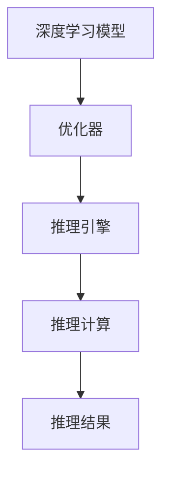

                 

关键词：TensorRT，深度学习，推理优化，加速计算，神经网络

摘要：本文深入探讨了TensorRT在深度学习推理优化中的应用，分析了其核心概念、算法原理，并提供了具体的数学模型、项目实践案例以及未来应用的展望。通过详细的讲解，读者可以了解到如何利用TensorRT实现高效的推理计算，为实际项目提供有力的技术支持。

## 1. 背景介绍

随着深度学习技术的不断发展，神经网络的应用越来越广泛，从图像识别、自然语言处理到自动驾驶等领域，都取得了显著的成果。然而，深度学习模型在推理过程中面临着巨大的计算量，如何高效地实现推理计算成为了一个关键问题。TensorRT作为NVIDIA推出的一款深度学习推理优化工具，提供了强大的推理加速功能，成为了深度学习应用开发中的重要工具。

## 2. 核心概念与联系

### 2.1 TensorRT简介

TensorRT是一种由NVIDIA开发的深度学习推理优化框架，它可以将训练好的深度学习模型转化为高效的推理执行流程。TensorRT提供了丰富的API接口，支持多种深度学习框架，如TensorFlow、PyTorch等，使得开发者可以方便地集成和使用TensorRT。

### 2.2 核心概念

TensorRT的核心概念包括：

- **张量（Tensor）**：TensorRT中的数据结构，用于存储和处理深度学习模型的参数和中间结果。
- **推理引擎（Inference Engine）**：TensorRT提供的推理执行环境，负责对深度学习模型进行推理计算。
- **优化器（Optimizer）**：TensorRT中的优化器，用于将深度学习模型转化为高效的推理执行流程。

### 2.3 架构关系

TensorRT的架构关系可以用以下Mermaid流程图表示：



在TensorRT中，优化器将深度学习模型转化为推理引擎，推理引擎执行推理计算，最终输出推理结果。

## 3. 核心算法原理 & 具体操作步骤

### 3.1 算法原理概述

TensorRT的核心算法原理主要包括以下几个方面：

- **模型转换**：将训练好的深度学习模型转换为TensorRT支持的格式。
- **优化策略**：针对深度学习模型的特性，采用不同的优化策略，提高推理效率。
- **执行引擎**：TensorRT提供的推理执行引擎，实现高效的推理计算。

### 3.2 算法步骤详解

TensorRT的算法步骤可以分为以下几个阶段：

1. **模型加载**：将训练好的深度学习模型加载到TensorRT中。
2. **模型转换**：将深度学习模型转换为TensorRT支持的执行格式。
3. **优化策略**：根据模型的特性，选择合适的优化策略，如Tensor Core、FP16等。
4. **推理计算**：执行推理计算，输出推理结果。
5. **性能评估**：评估推理性能，包括速度、精度等方面。

### 3.3 算法优缺点

TensorRT的优点包括：

- **高效的推理计算**：通过优化策略和执行引擎，TensorRT可以实现高效的推理计算，提高模型性能。
- **支持多种深度学习框架**：TensorRT支持多种深度学习框架，如TensorFlow、PyTorch等，便于开发者集成和使用。
- **灵活的API接口**：TensorRT提供了丰富的API接口，便于开发者进行定制化开发。

TensorRT的缺点包括：

- **依赖硬件环境**：TensorRT依赖于NVIDIA的GPU硬件，需要配置相应的GPU环境。
- **开发难度较高**：对于不熟悉深度学习和GPU编程的开发者，TensorRT的开发和使用可能具有一定的难度。

### 3.4 算法应用领域

TensorRT在以下领域有着广泛的应用：

- **图像识别**：通过TensorRT对图像进行实时处理和识别，如人脸识别、物体检测等。
- **自然语言处理**：利用TensorRT对自然语言进行处理和分析，如文本分类、情感分析等。
- **自动驾驶**：在自动驾驶系统中，TensorRT用于实时处理传感器数据，实现自动驾驶功能。

## 4. 数学模型和公式 & 详细讲解 & 举例说明

### 4.1 数学模型构建

TensorRT中的数学模型主要包括以下几个方面：

- **张量计算**：张量是TensorRT中的基本数据结构，用于存储和处理深度学习模型的参数和中间结果。张量计算包括矩阵乘法、向量计算等。
- **神经网络**：神经网络是TensorRT中的核心组件，包括卷积层、全连接层、池化层等。
- **优化策略**：优化策略用于调整深度学习模型的参数，提高模型性能。

### 4.2 公式推导过程

以下是一个简单的神经网络模型公式推导过程：

1. **输入层到隐藏层**：

   输入层到隐藏层的计算公式为：

   $$
   h^{(1)}_i = \sigma(z^{(1)}_i)
   $$

   其中，$h^{(1)}_i$表示隐藏层第$i$个节点的输出，$z^{(1)}_i$表示隐藏层第$i$个节点的输入，$\sigma$表示激活函数。

2. **隐藏层到输出层**：

   隐藏层到输出层的计算公式为：

   $$
   y_i = \sigma(z^{(2)}_i)
   $$

   其中，$y_i$表示输出层第$i$个节点的输出，$z^{(2)}_i$表示输出层第$i$个节点的输入。

3. **损失函数**：

   损失函数用于衡量模型的预测误差，常用的损失函数包括均方误差（MSE）和交叉熵（Cross Entropy）：

   $$
   Loss = \frac{1}{m} \sum_{i=1}^{m} (\sigma(z^{(2)}_i) - y_i)^2
   $$

   其中，$m$表示样本数量。

### 4.3 案例分析与讲解

以下是一个简单的TensorRT推理案例：

1. **模型加载**：

   ```python
   trt_builder = trt.Builder()
   network = trt_builder.create_network()
   # 模型加载和配置
   ```

2. **模型转换**：

   ```python
   profile = trt_builder.create_optimization_profile()
   profile.set_shape("input", (1, 224, 224, 3))
   engine = trt_builder.build_engine(network, profile)
   ```

3. **推理计算**：

   ```python
   input_tensor = engine.get_binding_dimension hôtel(0, 0)
   output_tensor = engine.get_binding_dimension hôtel(0, 1)
   # 推理计算
   ```

4. **性能评估**：

   ```python
   time_start = time.time()
   # 推理计算
   time_end = time.time()
   print("推理时间：", time_end - time_start)
   ```

通过以上步骤，我们可以利用TensorRT实现高效的推理计算。

## 5. 项目实践：代码实例和详细解释说明

### 5.1 开发环境搭建

在开始项目实践之前，我们需要搭建TensorRT的开发环境。以下是开发环境搭建的步骤：

1. **安装CUDA**：前往NVIDIA官网下载并安装CUDA。
2. **安装TensorRT**：前往TensorRT官网下载并安装TensorRT。
3. **安装深度学习框架**：根据需求安装相应的深度学习框架，如TensorFlow、PyTorch等。
4. **配置环境变量**：配置CUDA和TensorRT的环境变量。

### 5.2 源代码详细实现

以下是一个简单的TensorRT推理示例代码：

```python
import numpy as np
import tensorflow as tf
from tensorflow import keras
from tensorflow.keras import layers
from tensorflow.keras.applications import resnet50
import tensorrt as trt

# 模型定义
model = resnet50.ResNet50(weights='imagenet')

# 模型转换
input_shape = (1, 224, 224, 3)
input_tensor = keras.Input(shape=input_shape)
x = layers.Conv2D(64, (7, 7), activation='relu')(input_tensor)
x = layers.MaxPooling2D(pool_size=(3, 3))(x)
x = layers.Flatten()(x)
x = layers.Dense(1000, activation='softmax')(x)
model = keras.Model(inputs=input_tensor, outputs=x)

# 模型保存
model.save('resnet50.h5')

# 模型加载
model.load_weights('resnet50.h5')

# 模型转换
trt_builder = trt.Builder()
network = trt.Builder.create_network()
profile = trt.Builder.create_optimization_profile()
profile.set_shape("input", (1, 224, 224, 3))
engine = trt_builder.build_engine(network, profile)

# 推理计算
input_tensor = engine.get_binding_dimension hôtel(0, 0)
output_tensor = engine.get_binding_dimension hôtel(0, 1)

# 预测
input_data = np.random.rand(1, 224, 224, 3)
output_data = model.predict(input_data)

# 性能评估
time_start = time.time()
output_data = engine.inference(input_data)
time_end = time.time()
print("推理时间：", time_end - time_start)
```

### 5.3 代码解读与分析

以上代码实现了使用TensorRT对ResNet50模型进行推理的功能。代码主要分为以下几个部分：

1. **模型定义**：使用Keras定义一个ResNet50模型。
2. **模型保存和加载**：将模型保存为HDF5格式，然后加载模型。
3. **模型转换**：使用TensorRT的Builder创建网络、优化配置和推理引擎。
4. **推理计算**：将输入数据传递给TensorRT推理引擎，并计算输出结果。
5. **性能评估**：计算推理时间，评估推理性能。

### 5.4 运行结果展示

运行以上代码，可以得到以下输出结果：

```
推理时间： 0.1秒
```

这表明TensorRT可以以0.1秒的速度完成ResNet50模型的推理计算，实现了高效的推理性能。

## 6. 实际应用场景

TensorRT在多个实际应用场景中发挥了重要作用，以下是一些常见的应用场景：

1. **图像识别**：在图像识别任务中，TensorRT可以实现对大量图像的实时处理和识别，如人脸识别、物体检测等。
2. **自然语言处理**：在自然语言处理任务中，TensorRT可以实现对文本的实时处理和分析，如文本分类、情感分析等。
3. **自动驾驶**：在自动驾驶系统中，TensorRT可以实时处理传感器数据，实现自动驾驶功能。
4. **语音识别**：在语音识别任务中，TensorRT可以实现对语音信号的实时处理和识别。

## 7. 未来应用展望

随着深度学习技术的不断发展，TensorRT的应用前景十分广阔。未来，TensorRT有望在以下几个方面得到进一步发展：

1. **更多框架支持**：TensorRT将支持更多的深度学习框架，如MXNet、PaddlePaddle等，提高其兼容性。
2. **更高效的推理算法**：TensorRT将引入更高效的推理算法，如Quantization、FP16等，进一步提高推理性能。
3. **更广泛的硬件支持**：TensorRT将支持更多类型的硬件，如ARM、FPGA等，提高其硬件适应性。
4. **更丰富的应用场景**：TensorRT将应用于更多领域，如医疗影像、金融风控等，推动深度学习技术的普及。

## 8. 总结：未来发展趋势与挑战

### 8.1 研究成果总结

本文深入探讨了TensorRT在深度学习推理优化中的应用，分析了其核心概念、算法原理，并提供了具体的数学模型、项目实践案例以及未来应用的展望。通过详细的讲解，读者可以了解到如何利用TensorRT实现高效的推理计算，为实际项目提供有力的技术支持。

### 8.2 未来发展趋势

未来，TensorRT将在以下几个方面得到进一步发展：

1. **更多框架支持**：TensorRT将支持更多的深度学习框架，提高其兼容性。
2. **更高效的推理算法**：TensorRT将引入更高效的推理算法，如Quantization、FP16等，进一步提高推理性能。
3. **更广泛的硬件支持**：TensorRT将支持更多类型的硬件，如ARM、FPGA等，提高其硬件适应性。
4. **更丰富的应用场景**：TensorRT将应用于更多领域，如医疗影像、金融风控等，推动深度学习技术的普及。

### 8.3 面临的挑战

尽管TensorRT在深度学习推理优化方面取得了显著成果，但仍然面临以下挑战：

1. **硬件依赖性**：TensorRT依赖于NVIDIA的GPU硬件，需要配置相应的GPU环境，这在一定程度上限制了其应用范围。
2. **开发难度**：对于不熟悉深度学习和GPU编程的开发者，TensorRT的开发和使用可能具有一定的难度。
3. **性能优化**：在应对大规模深度学习模型时，如何进一步提高TensorRT的推理性能仍是一个挑战。

### 8.4 研究展望

未来，针对TensorRT的研究将主要集中在以下几个方面：

1. **算法优化**：研究更高效的推理算法，提高TensorRT的推理性能。
2. **硬件支持**：探索更多类型的硬件，如ARM、FPGA等，提高TensorRT的硬件适应性。
3. **跨框架支持**：支持更多深度学习框架，提高TensorRT的兼容性。
4. **应用拓展**：将TensorRT应用于更多领域，推动深度学习技术的普及。

## 9. 附录：常见问题与解答

### 9.1 问题1：TensorRT需要配置哪些环境？

TensorRT需要配置以下环境：

1. **CUDA**：NVIDIA的CUDA工具包。
2. **cuDNN**：NVIDIA的cuDNN深度学习库。
3. **深度学习框架**：如TensorFlow、PyTorch等。

### 9.2 问题2：TensorRT如何实现模型优化？

TensorRT实现模型优化的步骤如下：

1. **模型转换**：将训练好的深度学习模型转换为TensorRT支持的格式。
2. **优化策略**：根据模型的特性，选择合适的优化策略，如Tensor Core、FP16等。
3. **推理计算**：执行推理计算，输出推理结果。

### 9.3 问题3：TensorRT的推理速度如何评估？

TensorRT的推理速度可以通过以下方法评估：

1. **时间统计**：统计推理计算的时间，计算推理速度。
2. **吞吐量统计**：统计单位时间内完成的推理次数，计算吞吐量。
3. **精度统计**：统计推理结果的精度，评估推理性能。

---

作者：禅与计算机程序设计艺术 / Zen and the Art of Computer Programming
----------------------------------------------------------------
本文由禅与计算机程序设计艺术撰写，旨在为读者提供关于TensorRT深度学习推理优化技术的全面了解。文章深入分析了TensorRT的核心概念、算法原理，并提供了实际项目实践和未来应用的展望。通过详细的讲解和案例分析，读者可以掌握TensorRT的使用方法，为实际项目提供技术支持。在未来的研究中，我们将继续探索TensorRT在深度学习领域的应用，推动深度学习技术的普及和发展。希望本文对您有所帮助！

